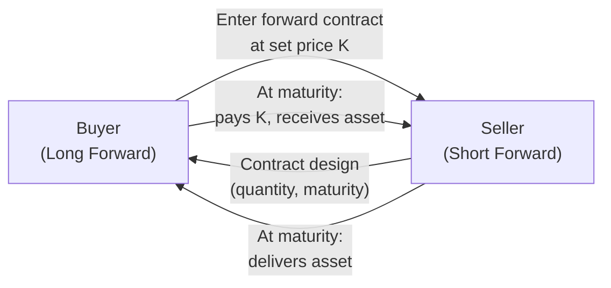

## 2.1 A Brief Overview of Forward-Based Derivatives

Imagine someone—perhaps a coffee importer—who wants to lock in the cost of coffee for the next six months so they don’t get blindsided by sudden price jumps. Or a Canadian business that needs to pay an overseas supplier in Japanese yen and wants to fix the exchange rate well in advance of the payment date. In both cases, forward-based derivatives can be the solution. They’re essentially custom contracts between two parties to buy or sell an underlying asset at a predetermined price on a specified date in the future.

Forward-based derivatives trace their roots back hundreds of years, with farmers and merchants using informal agreements to secure future prices for agricultural products. Today, forward contracts—as well as related products—span far beyond agriculture, encompassing currencies, interest rates, equity indices, and more. Let’s examine these forward-based derivatives, dig into their key mechanics, and see why they matter so much in modern markets.

A Quick Anecdote: Early in my career, I remember a colleague telling me about a small gold producer in Northern Ontario. They entered into forward agreements to protect themselves from volatile gold prices. The owners were thrilled to have predictable revenue streams, even if it meant occasionally missing out on sudden price surges. But that’s the trade-off: certainty versus the chance for extra profit. That’s precisely the heart of forward-based derivatives—trading off some potential upside or downside in exchange for stability.

### Key Concepts and Definitions

Before we dive into details, here are some definitions to keep us all on the same page:

• Forward Contract: A private, customized agreement between two parties to buy or sell an asset at a preset price on a future date.  
• OTC (Over-the-Counter): Trades that happen privately between parties, rather than on a centralized exchange.  
• Credit Risk: The risk that the other side of a contract might fail to fulfill its obligations.  
• Collateral: Assets or cash pledged to protect against credit risk.  
• Trade Repository: An entity that serves as a centralized registry for derivatives transactions to promote regulatory transparency.  
• Hedger: A person or entity using derivatives to reduce or eliminate risk from price fluctuations.  
• Speculator: A trader aiming to profit from changes in market prices.  
• Arbitrageur: One who exploits price differences in related instruments or markets.

### A Simple Look at How Forward Contracts Work

A forward contract is like a handshake (though these days, it’s often digital) between two parties: a buyer (long position) and a seller (short position). They agree on a quantity, a price, and a future delivery or settlement date. On that date, the buyer will pay the agreed-upon price, and the seller will deliver the underlying asset—or arrange a cash settlement, depending on the contract terms.

Here’s a quick visual of how these two parties interact:

In this diagram, “K” represents the forward price—the agreed-upon amount that the buyer pays at maturity.

### Why Forward-Based Derivatives?

You might be thinking, “Okay, so it’s a contract. Big deal.” But forward-based derivatives solve real business and investment challenges:

• Farmers and food processors can plan production and pricing.  
• Banks can help companies lock in interest rates for upcoming loan needs.  
• Multinational corporations can fix costs for future currency payments.  
• Commodity producers can stabilize revenue streams.

It’s all about hedging risk. People use forward-based derivatives because they’re tired of sleepless nights spent worrying about potential market swings. 

Yet, it’s not just about hedging. Speculators also love forwards because they can take a position in a market without needing all the upfront capital (though they still face credit considerations). And arbitrageurs can jump in to earn risk-free profits by exploiting price discrepancies across different markets or products—like a puzzle-solver scanning for hidden clues in the price matrix.

### The Role of Credit Risk

Back when I was new to forwards, I’ll admit I was baffled by how personalized they could be. But then came the big question: “What if the other person doesn’t pay up?” This highlights the key difference between forward-based derivatives and exchange-traded futures. 

Forwards lack an exchange clearinghouse that guarantees each side of the trade. Instead, these are private deals, which means each party must evaluate the other’s creditworthiness. Big banks, for instance, have entire credit departments analyzing the risk of default and might demand collateral or “margin” from certain counterparties. 

This credit risk factor is extremely important. Even a well-structured forward contract gains you little if your counterparty can’t deliver on its promise. That’s why many firms have netting agreements in place—they offset obligations across multiple trades with the same counterparty to reduce overall exposure. Additionally, parties might use an ISDA Master Agreement (International Swaps and Derivatives Association framework) to define the legal terms for netting, default events, collateral posting, and so on.

### Terms and Flexibility

One of the beauties (and complications) of forward-based derivatives is how flexible they are. With an exchange-traded product like a futures contract, specs are standardized—you get a fixed contract size, a limited choice of delivery months, and so forth. But in the world of forwards:

• Quantity: You can customize exactly how many barrels of oil, bushels of wheat, Canadian dollars, or anything else you need.  
• Delivery Date: You pick a date that aligns perfectly with your production schedule or payment timeline.  
• Underlying Specifications: Want to deliver a certain grade of commodity? You can specify that.  
• Settlement: Physical delivery? Cash settlement? It’s all negotiable.

This tailored approach is powerful for businesses with unique needs. But it also makes forward contracts more complex to price and manage. Without standardized exchange rules, everything is up for discussion—from early termination clauses to special force majeure conditions.

### Common Underlyings for Forwards

Though you can theoretically write a forward on just about anything, some of the most common are:

• Currencies (e.g., USD/CAD, CAD/JPY)  
• Interest rates (forward rate agreements, or FRAs)  
• Commodities (energy products like oil or natural gas, metals like gold or aluminum, agricultural goods like wheat or coffee)  
• Equity indices or shares (though many prefer exchange-traded futures or total return swaps)

In the Canadian context, many businesses and investors engage in currency forwards to manage exchange rate risk. For instance, if you’re a Canadian importer who pays suppliers in euros, a forward contract can protect you from unexpected upward shifts in the EUR/CAD exchange rate.

### Real-World Scenario: Locking in Commodity Costs

Let’s suppose you run a chain of artisanal bakeries across Canada, and wheat is your primary raw material. Wheat prices can be unpredictable—droughts, global supply chain issues, and policy changes all drive the price. To stabilize your production costs, you might negotiate a forward contract with a supplier to deliver specific grades of wheat over the next six months at a fixed price.

• You (the buyer) are the long forward: you agree to buy wheat at, say, CA$300 per tonne for 1,000 tonnes in six months.  
• The supplier (the seller) is the short forward: they agree to deliver 1,000 tonnes of the specified grade in six months time at the agreed price.  
• Both parties are hedging: you hedge against rising prices, and the supplier hedges against falling prices.

If, at maturity, the spot price is higher than CA$300 per tonne, you benefit because you locked in a lower price. If it’s lower, you’ll be paying more than the current spot price. But in either case, you gain peace of mind knowing precisely what your costs will be.

### A Look at Payoffs

Although we’ll explore detailed pricing in future chapters, it’s good to glance at how forward payoffs are structured. For the buyer of a forward at maturity (time T):


\text{Payoff}_{\text{Long}} = S_T - K


Where:  
• \\(S_T\\) = the spot price of the underlying asset at maturity  
• \\(K\\)  = the forward price (the agreed-upon price)  

If you’re the long party and \\(S_T\\) is higher than \\(K\\), your payoff is positive (you effectively pay a lower price than the market rate). If \\(S_T\\) is lower, your payoff is negative because you could have bought the commodity more cheaply on the open market. For the short party, the payoff is simply \\(K - S_T\\).

### Participants in Forward-Based Derivatives

• Hedgers: Commercial entities like farmers, mining companies, exporters, importers, or manufacturers who want to manage price risks in raw materials, currency exchange rates, or interest rates.  
• Speculators: Individuals or funds who have a market view and seek to profit from being on the right side of a future price movement.  
• Arbitrageurs: Traders or hedge funds that look for price discrepancies among related contracts or different markets—for instance, they might simultaneously buy a forward contract in one market and sell a similar instrument on another market if they see a mispricing.

### The OTC Nature of Forwards

Unlike exchange-traded derivatives such as futures or standard options, forwards are primarily traded over the counter (OTC). This structure has its pros and cons:

Pros:  
• Flexibility to customize contract terms.  
• Tailored to specific hedging or investment needs.  
• Potentially more efficient for large, specialized transactions.

Cons:  
• No clearinghouse to protect against default risk.  
• Limited transparency in pricing compared to exchange-traded markets.  
• Potentially higher transaction costs and more onerous documentation.

### Regulatory Landscape in Canada

In Canada, forward-based derivatives linked to interest rates, FX, or certain commodities must often be reported to recognized trade repositories—this is mandated by the Canadian Securities Administrators (CSA) and overseen by the Canadian Investment Regulatory Organization (CIRO). While we used to talk about IIROC or MFDA as separate entities, they no longer exist independently. Since early 2023, CIRO has served as Canada’s national self-regulatory body, ensuring that investment dealers, mutual fund dealers, and relevant marketplaces comply with regulations.

This focus on trade reporting aims to keep regulators informed about potential systemic risks. If you’re dealing with forward-based derivatives in a corporate capacity, check out the CSA notices regarding trade repositories and data submission. The official CIRO website (https://www.ciro.ca) is your go-to source for the most up-to-date information. 

### Collateral and Risk Management Techniques

Because there’s no intermediary guaranteeing payment, counterparties might choose to establish credit support arrangements, such as:

• Posting Collateral (a common practice in the interbank market for FX forwards and interest rate swaps).  
• Netting Agreements (common under ISDA Master Agreements to subtract offsetting exposures across multiple trades and reduce overall credit exposure).  
• Thresholds & Initial Margin: Some large trades require the counterparty to post margin upfront.  
• Haircuts: Accepting collateral at a discounted value relative to market value.

All these measures reduce the risk of catastrophic default. But they also add operational complexity: you need systems and processes to track collateral amounts and margin calls, plus you need legal documentation to be rock-solid.

### Balancing the Impact on Corporate Balance Sheets

Companies rely heavily on forward-based derivatives to smooth out financial uncertainties. For instance, if you’re a Canadian airline buying jet fuel, forward contracts can dampen the shock of price spikes, helping your balance sheet remain more predictable. However, you should note:

• Gains and losses on these derivatives might need to be marked-to-market.  
• Hedge accounting rules can affect how your firm reports derivative gains or losses in financial statements. In Canada, IFRS or Accounting Standards for Private Enterprises (ASPE) apply, depending on your corporate structure.  
• Large forward positions can create liquidity strains if market prices move significantly against you and the collar or margin required jumps unexpectedly.

### Practical Tools and Resources

If you’re interested in modeling forward-based products, you can explore open-source libraries like QuantLib (https://www.quantlib.org). It offers classes and methods for pricing forward-rate agreements, interest rate swaps, and a variety of other derivatives. The best part is that you can often fine-tune these models to match your specific risk parameters or scenario analyses.

For an educational deep dive, check out the Bourse de Montréal’s Derivatives Knowledge Center (https://www.m-x.ca), where you’ll find a range of materials that may also delve into forward-like contracts and how they compare to standardized futures. Although Bourse de Montréal focuses on exchange-traded products, understanding futures can help clarify core concepts around forward-based instruments. And if you crave a more academic treatment, John C. Hull’s “Options, Futures, and Other Derivatives” offers a well-respected and comprehensive view on forward and futures markets.

### A Quick Comparison to Futures

While we’ll talk more about futures later in this chapter, it’s useful to see how forwards differ. Below is a small table that highlights some of these contrasts:

| Feature                | Forwards (OTC)                                                                       | Futures (Exchange-Traded)                                                     |
|------------------------|---------------------------------------------------------------------------------------|-------------------------------------------------------------------------------|
| Standardization        | Fully customizable                                                                    | Highly standardized                                                           |
| Trading Venue          | Private OTC (no centralized location)                                                | Organized exchanges                                                           |
| Counterparty Risk      | Higher, no clearinghouse guarantees                                                  | Reduced, due to clearinghouse guarantee                                       |
| Liquidity              | Can be limited, depends on counterparty’s willingness                                 | Generally higher, because of standardized contracts and broader participation |
| Margin Requirements    | Negotiated between parties, not mandatory unless specified in the contract            | Required by the exchange on all participants                                  |
| Regulatory Oversight   | Subject to various reporting rules (CIRO, CSA), but less transparency                 | Well-regulated, transparent pricing, daily settlement                         |

This table captures how forward derivatives remain more flexible but come with the additional caveat of credit risk and less liquidity.

### Common Pitfalls and Best Practices

• **Over-Hedging**: It’s easy to think that more hedging is always better, but you can end up with exposures that ruin your upside potential.  
• **Not Monitoring Credit Risk**: Failing to track your counterparty’s financial health can lead to a massive surprise if they default.  
• **Ignoring Cash Flow Implications**: If your forward is “in the money,” the other party might require additional collateral, or you’ll have to manage daily changes in your position’s mark-to-market value.  
• **Documentation Errors**: Small mistakes in forward contracts—especially complex ones—can trigger legal disputes.  
• **Regulatory Gaps**: Overlooking reporting requirements can lead to fines or sanctions. Stay in the loop with CIRO and CSA guidelines.

From personal experience, I once helped a small importer who forgot to confirm the correct settlement currency in a forward contract. They accidentally locked in a forward for U.S. dollars, but they really needed Australian dollars. It was quite a headache. Lesson learned: always double-check the basics!

### Practical Example: Currency Forward for a Canadian Exporter

Let’s walk through a hypothetical scenario:

• A Canadian tech firm, MapleApps Inc., expects to receive USD 1 million from a U.S. client in six months.  
• To protect their CAD revenue, MapleApps enters a forward contract to convert USD to CAD at a rate of 1.32 CAD/USD in six months.  
• In six months, if the USD/CAD spot rate is 1.35, MapleApps would have otherwise received more CAD by converting at the spot. But they locked in the 1.32, effectively giving up some upside in exchange for certainty.  
• If the spot rate is 1.27 in six months, MapleApps benefits from the forward contract because the locked-in 1.32 is better than the lower prevailing exchange rate.

Although MapleApps might not love missing out on favorable currency moves, the CFO likely sleeps better knowing their budget is protected from sudden fluctuations.

### Settlement Mechanics

For forward-based derivatives, settlement can occur in two primary ways:

1. **Physical Delivery**: The underlying asset changes hands on the settlement date. Common in commodity forwards—like an oil producer delivering barrels of crude to a refinery at the agreed price.  
2. **Cash Settlement**: Instead of delivering the physical asset, one party pays the difference between the contract price and the asset’s market price at maturity. This approach is more common with financial forwards (like currency forwards or forward rate agreements).

When deciding which settlement approach to adopt, consider practical factors—where will you store a thousand barrels of oil if you’re forced to take physical delivery? How will you handle shipping and insurance? If these logistics are complicated, cash settlement is often preferable.

### Evolving Market Trends

The forward-based derivatives market has grown more complex, especially as technology evolves. Electronic trading platforms specializing in OTC products have brought greater transparency and somewhat improved liquidity. Meanwhile, regulatory authorities worldwide have introduced rules for mandatory trade reporting, margin for uncleared derivatives, and, more recently, efforts to push certain standardized OTC contracts into central clearing. 

However, truly customized forwards (like those needed by small businesses or niche commodity producers) aren’t easily standardized. These products will remain in the OTC realm where relationship-driven negotiation and customization are critical.

### Concluding Thoughts

Forward-based derivatives offer a valuable tool for managing risk, whether it’s commodity price risk, currency risk, or interest rate risk. Their flexibility is a major draw, but it also comes with added responsibilities like credit analysis, collateral management, and regulatory reporting. As you explore further chapters, you’ll see how forwards compare to other derivative instruments like futures and options, plus how all these products fit into a modern risk management strategy.

Don’t forget: Tools like QuantLib help with pricing, the Bourse de Montréal’s knowledge center can offer further educational resources, and reading heavy hitters like John Hull’s “Options, Futures, and Other Derivatives” can illuminate the theoretical side of these instruments. And, of course, always keep tabs on the CIRO website (https://www.ciro.ca), where you’ll find the latest Canadian regulatory guidance on trade reporting, margin, clearing, and more.

Best of luck on your journey through derivatives—and may your forward contracts always settle smoothly!

---

## Sample Exam Questions: Forward-Based Derivatives Essentials



### A forward contract is best described as:
- [ ] A standardized agreement traded on a formal exchange.
- [x] A customized contract agreed upon privately between two parties.
- [ ] An agreement guaranteed by a clearinghouse.
- [ ] A contract that involves no credit risk.

> **Explanation:** A forward contract is tailored by two private parties for a future transaction, which differs from exchange-traded futures that are standardized and backed by a clearinghouse.

### Which of the following is a primary advantage of using forward-based derivatives?
- [ ] No risk of default due to clearing services.
- [x] Flexibility to customize contract terms.
- [ ] Elimination of all price risk.
- [ ] Full regulatory protection from any losses.

> **Explanation:** The main advantage of forward-based derivatives is that contract terms can be fully customized to suit each party’s specific needs.

### In Canada, who currently oversees national regulation of investment dealers and monitors derivatives markets?
- [ ] The Investment Industry Regulatory Organization of Canada (IIROC)
- [ ] The Mutual Fund Dealers Association (MFDA)
- [x] The Canadian Investment Regulatory Organization (CIRO)
- [ ] The Canadian Trade Organization (CTO)

> **Explanation:** Since 2023, CIRO has replaced both IIROC and MFDA as the single national self-regulatory authority.

### If you’re hedging with a forward to fix the price of a commodity you’ll need in six months, which of the following statements applies?
- [x] You reduce the uncertainty of future costs, but you might miss out on lower market prices.
- [ ] You completely eliminate your financial risk, no matter what the market does.
- [ ] You automatically obtain better prices than spot.
- [ ] You avoid all margin requirements and never face any credit considerations.

> **Explanation:** Hedging with forwards locks in a future price, providing certainty but also removing the possibility to benefit from a more favorable spot price at maturity.

### Which participant in the forward market primarily seeks risk-free profit from mispriced instruments across different markets?
- [ ] Hedger
- [ ] Speculator
- [x] Arbitrageur
- [ ] Regulator

> **Explanation:** Arbitrageurs look for price inefficiencies or market discrepancies that allow them to lock in a guaranteed profit with minimal (or zero) net risk.

### One key difference between forwards and futures is:
- [x] Forwards are privately negotiated and carry higher credit risk.
- [ ] Forwards are standardized and trade on exchanges.
- [ ] Futures do not require margin posting, while forwards do.
- [ ] Only forwards can be financially settled.

> **Explanation:** Futures are standardized contracts that trade on organized exchanges and benefit from clearinghouse guarantees. Forwards are customized OTC contracts with heightened credit risk.

### Which of the following best describes “collateral” in a forward contract?
- [ ] A government bond on which interest must be paid to the issuing counterparty.
- [x] Assets or cash posted to manage and mitigate counterparty credit risk.
- [ ] Shares of a company that automatically get converted into futures.
- [ ] A mandatory legal requirement that eliminates market risk.

> **Explanation:** Collateral is posted by one or both parties to offset potential losses in case the other counterparty defaults.

### Why are netting agreements crucial for OTC forward transactions?
- [ ] They convert forwards into exchange-traded products.
- [ ] They eliminate the need for any margin or collateral.
- [x] They allow parties to offset mutual obligations, thereby reducing credit exposure.
- [ ] They guarantee a minimum profit for both parties.

> **Explanation:** Netting agreements permit counterparties to calculate net amounts owed across multiple transactions, lowering their overall credit exposure.

### What is a trade repository’s main function in the context of Canadian regulations for forward-based derivatives?
- [x] To store and report derivative transaction data for regulatory oversight.
- [ ] To serve as a clearinghouse that guarantees each trade.
- [ ] To run the exchange where these contracts are traded.
- [ ] To provide free audits and risk certifications for all market participants.

> **Explanation:** Trade repositories collect data from both sides of a derivative transaction, ensuring transparency and helping regulators track potential systemic risks.

### True or False: Under a physically settled forward contract, the seller delivers the actual underlying asset to the buyer at a future date.
- [x] True
- [ ] False

> **Explanation:** A physically settled forward involves the transfer of the specified asset—such as a commodity or currency—on the contract’s settlement date.


