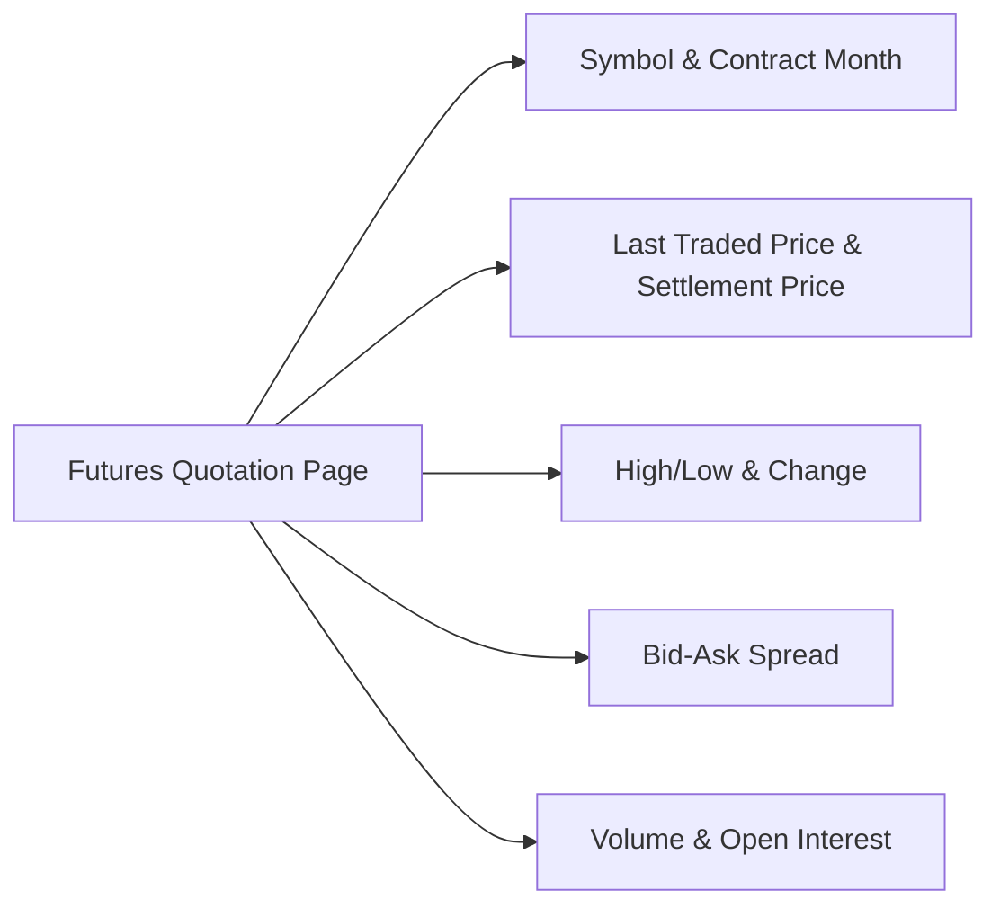

## 2.10 Reading a Futures Quotation Page

Reading a futures quotation page can feel like scanning an unfamiliar map: there are numbers and symbols everywhere, and you’re not entirely sure which path to follow first. I remember the first time I looked at one, I thought, “Um, so, why are they using letters like ‘H’ and ‘U’ to represent contracts? And how on earth do I figure out which price is the ’real’ price for my trade?” You might be asking yourself the same questions. Let’s break down the details so everything becomes clearer. By the end, you’ll be able to navigate a futures quotation page with confidence.

### Understanding the Layout

A typical futures quotation page—whether on a trading platform, a financial website, or a specialized data terminal—shows a row of relevant data for each futures contract. For example, you might see columns labeled:

• Contract or Symbol  
• Month and Year (sometimes abbreviated as “H24,” “M24,” etc.)  
• Last Traded Price  
• Change (from previous close or settlement)  
• Bid-Ask (Bid = highest advertised buy price, Ask = lowest advertised sell price)  
• Volume  
• Open Interest  
• High and Low of the trading session  
• Settlement Price  

In many modern trading systems, you can add or remove columns according to your needs. But usually, the essential fields remain consistent. And if you’re feeling a bit overwhelmed, trust me—it’ll all become second nature once you see how each piece fits together.

### Key Data Fields

Let’s tackle each of the most common fields in a futures quote.

**Contract or Symbol**  
Futures contracts are typically identified by a root symbol plus a letter representing the delivery month and a last digit or two for the year. For instance, the S&P/TSX 60 Index futures might use a root like “SXF.” Then, you’ll notice codes for the month:  
• March = H  
• June = M  
• September = U  
• December = Z  

So “SXFH24” means the S&P/TSX 60 Index futures contract expiring in March 2024. That’s your signpost to know which specific product and expiry you’re trading.

**Month and Year**  
As hinted above, the month is expressed via a letter code, and then we attach the year. Some data feeds list it as “Mar24,” others might say “H24.” Both convey the same message.

**Last Traded Price**  
This is simply the most recent price at which the contract changed hands. Be aware that the last traded price can be a bit stale if there hasn’t been a recent transaction. Sometimes you’ll see a large gap between the last traded price and the current bid or ask if the market is illiquid.

**Change from Previous Settlement**  
The “Change” column (or sometimes “Net Change”) tells you how the price has moved relative to yesterday’s official settlement price. This helps you see if the market is up or down from the prior day. If you’re seeing a large intraday move, it might signal breaking news or unexpected supply-demand shifts in the underlying commodity or financial instrument.

**High/Low**  
The high price is the most expensive trade of the session, and the low price is the cheapest trade of the session. These can help you visualize the range—how volatile or stable the market has been during the day.

**Bid-Ask Spread**  
The bid is the highest price someone in the market is currently willing to pay, and the ask is the lowest price someone is currently willing to accept to sell. A narrow bid-ask spread generally indicates an active market with strong liquidity. A wider spread often hints that there’s less trading activity or higher uncertainty, so you might have to be mindful of slippage when getting in or out of your position.

**Settlement Price**  
The settlement price is the official daily closing price set by the exchange. This is the number used by clearinghouses to calculate daily margin requirements (the process known as marking-to-market). In other words, the settlement price can differ slightly from the last trade if that last trade occurred at a different price than the official close. If your broker or clearing firm calculates your margin, they’re using this settlement price.

**Volume**  
Volume tells you how many contracts have traded during the current session. If you see that 10,000 contracts have traded, the market is typically more liquid compared to one with, say, 50 contracts in volume. Liquidity is a big deal. It affects how easily (and at what cost) you can enter or exit a position.

**Open Interest**  
Open interest shows the total number of contracts that are “open” and have not yet expired or been closed out. It is a snapshot of ongoing participation in a particular contract. Generally, when open interest is high, there’s more market depth, which can lead to tighter spreads and better opportunities for hedgers and speculators alike.

### Comparing Last Traded Price and Settlement Price

It’s really important to understand the difference between the last traded price and the settlement price. Maybe you’re thinking, “Aren’t they the same thing?” Actually, not always. The settlement price is established by the exchange (such as the Bourse de Montréal for many Canadian futures) at or near the end of the trading day, often using a weighted average of trades over a certain time window or a special settlement procedure. If the final trade of the day was off-market or if the market was especially volatile toward the close, the settlement price might differ.

Why do we care? Because your margin calls and daily profit/loss statements will be based on this settlement price. For instance, if your last trade took place at 120.50, but the settlement ended up at 121.00, you’ll be credited or debited using 121.00. This distinction can cause confusion if you’re not aware of it. So watch out.

### Volume and Open Interest: Gauging Liquidity and Participation

**Volume** is all about the day’s trading activity. It resets daily, so it’s a gauge of interest on that particular day. **Open interest**, on the other hand, shows the number of outstanding contracts that haven’t been offset or delivered. If you’re trading to hedge (let’s say you’re a producer protecting against commodity price fluctuations) or to speculate, a contract with more open interest typically means you can get in and out more easily. A high open interest also suggests that more participants are engaged, which generally yields a more robust price discovery process.

### Reading Expiry Months and Rolling Forward

Futures contracts expire. This adds a layer of complexity you don’t always see in the cash markets. When reading a futures quote, you’ll see multiple contract months—like March (H) 2024, June (M) 2024, September (U) 2024, and so on. Near-dated contracts (the ones expiring sooner) generally have the highest trading volume, though that can vary by market. Far-dated contracts sometimes have lower volumes. That’s not necessarily a bad thing, but it means you might see wider spreads if you intend to trade those further-out months.

If you’re speculating or hedging long-term, you may need to “roll” your position from one contract month to the next as expiry approaches—closing out the soon-to-expire contract and reopening a position in a later month. Keeping an eye on how these near-dated and far-dated contracts trade is crucial for your strategy and your cost-of-carry assumptions.

### Market Depth, Electronic Data Feeds, and Real-Time vs. Delayed Quotes

Gone are the days of purely open-outcry pits: most futures trading is now electronic. An electronic quote feed often gives you not only the best bid and ask but also the depth of market—how many contracts are being bid or offered at various price levels. Market depth can guide you on how quickly the price might move if large orders hit the market.

Many data providers offer real-time quotes (often with a subscription or exchange fees) or delayed quotes (commonly 15-20 minutes behind). For some traders, delayed data is enough for reference. For active traders, real-time data is crucial because a lot can happen in 15 minutes—especially if you’re trading a volatile underlying like crude oil or equity index futures.

Below is a simple diagram showing the major data fields that come together to form a futures quote.

### Tips and Potential Pitfalls

• **Watching Volume Spikes**: A sudden spike in volume can indicate newly emerging trends or big participation from institutional players. That could be your cue to investigate further.  
• **Understanding Settlement Procedures**: Settlement can involve different formulas or special opening/closing auctions. Check your exchange’s methodology. You don’t want a surprise margin call.  
• **Far-Dated vs. Near-Dated**: Far-dated contracts often have lower liquidity; if you’re trading them, watch for wider bid-ask spreads.  
• **Rolling Isn’t Free**: If you hold positions past the front-month expiry, you’ll need to roll your contract. The cost of rolling can be influenced by the spread between contract months. Pay attention to these details, as they can eat into your profit.  
• **Settlement Price vs. Last Trade**: Keep your eyes on the settlement price for mark-to-market in your trading account. This might differ from the last traded price by a small, but sometimes meaningful, margin.  

### Practical Example: A Crude Oil Futures Quote

Let’s say we’re looking at “CL” (West Texas Intermediate crude oil futures) and we pull up a quote screen for the upcoming months:

| Contract | Last Trade | Chg   | Bid    | Ask    | Volume   | Open Interest | Settle | High   | Low    |
|----------|-----------|-------|--------|--------|----------|--------------|--------|--------|--------|
| CLH24    | 77.35     | -0.20 | 77.30  | 77.40  | 128,000  | 250,000      | 77.45  | 78.10  | 76.60  |
| CLM24    | 76.90     | -0.15 | 76.85  | 76.95  | 45,000   | 120,000      | 76.88  | 77.70  | 76.25  |
| CLU24    | 75.50     | +0.05 | 75.45  | 75.55  | 12,000   | 60,000       | 75.48  | 76.00  | 75.20  |

- **CLH24 corresponds to the March (H) 2024 contract.**  
- **Last Trade** for CLH24 is 77.35, but the **Settle** is 77.45. The -0.20 change is relative to yesterday’s settlement of 77.55.  
- Notice how higher **Volume** in the near-month contract (CLH24) suggests more liquidity, which is typical.  
- The **Bid**-**Ask** for CLH24 is 77.30–77.40, so the spread is $0.10. Compare that to CLU24, where the spread is only $0.10 as well, but the volume is lower—so the spread might widen quickly if a large order comes into the market.  
- The difference in settlement prices across months can reflect carrying costs, expectations about future supply, or seasonal factors (crude oil might have seasonal demand spikes in certain months).

### Regulatory Framework and Best Practices

Because we’re focusing on the Canadian perspective, note that:

• The Bourse de Montréal (often abbreviated as “the Bourse” or “MX”) is a major exchange for listed derivatives in Canada, including equity, index, and interest rate futures.  
• CIRO (Canadian Investment Regulatory Organization) oversees investment dealers and marketplace integrity. They set the rules for best execution, client margin requirements, and overall market transparency. If you want to see official guidelines, head over to [https://www.ciro.ca](https://www.ciro.ca).  
• The Canadian Investor Protection Fund (CIPF) remains the national investor protection fund. It protects your assets in case a member firm becomes insolvent (though it doesn’t insure your trading losses, of course).  
• The Canadian Derivatives Clearing Corporation (CDCC) acts as the central clearinghouse for certain Canadian futures and options, helping mitigate counterparty risk.

Staying on top of these regulations helps ensure that you’re trading in an environment with oversight and orderly processes. CIRO sets important guidelines to make sure investors receive best execution. Also, keep in mind that additional margin rules may apply, and these can vary depending on whether you’re trading for hedging purposes or speculative strategies.

### Open-Source Tools and Data Feeds

Some people like to go beyond the standard broker platforms or exchange websites. Yahoo Finance (though it’s not always fully comprehensive for futures) or Alpha Vantage can give you some coverage—just note that data might be delayed. For high-level analysis or academic backtesting, people sometimes lean on Python scripts with open-source libraries, pulling data from an API or from free end-of-day quotes. If you want real-time data, you typically need a subscription from a recognized data provider or from your brokerage.

### Personal Take: Don’t Forget the Details

When I was first learning about futures, I once confused the last traded price with the settlement price, and the resulting margin calculation was… let’s just say “eye-opening.” I got a margin call that was bigger than expected. From that day on, I made sure to always check the official settlement price. Mistakes happen. But the more comfortable you become reading the futures quotes, the easier it is to spot those differences and avoid shock.

### Real-World Strategies & Considerations

• **If you’re a hedger**: You might follow the near contract month closely, since that’s where most liquidity is. But you’ll also keep an eye on future months to lock in longer-term prices if needed.  
• **If you’re a speculator**: Volume and open interest are critical. You want a deep, liquid market so your trades can be executed quickly and at tighter spreads.  
• **If you’re a calendar spread trader**: You’ll watch the price differences between, say, CLH24 and CLM24. That difference can indicate backwardation or contango in commodity markets, or certain interest rate expectations in financial futures.

### Summary

Reading a futures quote might feel complicated at first, but it’s basically about understanding a few staple metrics: last traded price, settlement price, bid-ask spread, volume, open interest, and the high/low range. Once you grasp how each piece works, you’ll gain a powerful sense of how the market moves and what your daily profit and loss might look like. Above all, remember that the settlement price is the official reference for margin and day-end accounting—don’t rely solely on the last trade. Future success in your derivatives journey depends on comfortable mastery of these fundamentals.

---

### Additional Resources

• [Montréal Exchange Market Data](https://www.m-x.ca/en/market-data) – Official real-time and historical quotes for Canadian futures and options.  
• [CIRO](https://www.ciro.ca) – Canada’s regulatory body overseeing investment dealers and marketplace integrity.  
• *Trading in Futures: Written in Plain English*, by Carley Garner – A friendly introduction to futures markets.  
• [Alpha Vantage](https://www.alphavantage.co/) – An API service offering free and paid data, which you can use for personal or academic projects (limited coverage for some instruments).  
• *Technical Analysis of the Futures Markets*, by John J. Murphy – For those wanting deeper insights into price action and volume studies.

---

## Sample Exam Questions: Reading a Futures Quotation Page



### Which price in a futures quotation is typically used by the clearinghouse for marking-to-market and margin calculations?

- [ ] Last traded price
- [ ] High price for the day
- [x] Settlement price
- [ ] Average mid-price

> **Explanation:** Exchanges (like the Bourse de Montréal) use the official settlement price, established at or near the close of trading, as the basis for marking-to-market and calculating margin requirements.

### What does the letter “U” typically represent in a futures contract month code?

- [ ] March
- [x] September
- [ ] June
- [ ] December

> **Explanation:** In futures shorthand, the contract months follow a letter code. “H” for March, “M” for June, “U” for September, and “Z” for December are common examples.

### If a futures contract’s spread between the bid and ask prices widens significantly, what might this indicate?

- [ ] The market is highly liquid
- [x] Lower liquidity or higher uncertainty
- [ ] A sudden drop in open interest
- [ ] The underlying asset has ceased trading

> **Explanation:** A wider bid-ask spread often suggests lower liquidity or higher uncertainty, making it more costly to enter or exit positions at desired prices.

### When a futures quote shows a “Change” of -0.15, this value typically compares the current price to which of the following?

- [ ] The prior day’s opening price
- [ ] The current day’s first trade
- [x] The prior day’s settlement price
- [ ] The market’s average price over the last five days

> **Explanation:** The standard practice is to compare today’s price to the previous settlement price, which is the official closing reference established by the exchange.

### Which data field indicates the total number of unsettled and outstanding futures contracts at a given time?

- [x] Open interest
- [ ] Volume
- [ ] Bid-Ask Spread
- [ ] Settlement price

> **Explanation:** Open interest shows how many contracts remain open and unclosed. This contrasts with volume, which shows how many contracts traded on a given day.

### Why is it important to track volume in a futures contract?

- [ ] Volume is irrelevant to trading decisions
- [ ] It only matters for market makers
- [x] High volume implies more liquidity and potentially tighter bid-ask spreads
- [ ] It removes the need for margin requirements

> **Explanation:** A higher trading volume indicates more liquidity, generally resulting in tighter spreads and better execution. Low-volume markets can be riskier to trade due to larger spreads.

### Which regulatory body currently oversees investment dealers and derivatives marketplace integrity in Canada (as of 2025)?

- [ ] MFDA
- [ ] IIROC
- [x] CIRO
- [ ] CIPF

> **Explanation:** Effective June 1, 2023, the Mutual Fund Dealers Association (MFDA) and the Investment Industry Regulatory Organization of Canada (IIROC) amalgamated into the Canadian Investment Regulatory Organization (CIRO), which oversees investment dealers and market integrity.

### What primary function does the Canadian Derivatives Clearing Corporation (CDCC) serve in the futures market?

- [ ] Providing personal financial advice to traders
- [x] Acting as the central clearinghouse to reduce counterparty risk
- [ ] Setting the official settlement price for all futures trades
- [ ] Collecting taxes on derivatives transactions

> **Explanation:** The CDCC is Canada’s central clearing counterparty for derivatives. It ensures trades are cleared and settled while mitigating counterparty credit risk.

### How can differences between near-dated and far-dated futures prices inform you about the market?

- [ ] They prove the market is inefficient
- [x] They can reflect carrying costs or future supply and demand expectations
- [ ] They are irrelevant to hedgers and speculators
- [ ] They should be ignored unless you trade options

> **Explanation:** Variances across contract months often reflect storage costs, interest rates, supply-demand expectations, or seasonal influences in commodity and financial markets.

### A higher open interest in a futures contract usually suggests:

- [x] Greater participation and potentially deeper liquidity
- [ ] Lower hedging interest from market players
- [ ] Minimal trading activity in that instrument
- [ ] The contract has hit its final settlement date

> **Explanation:** When open interest is high, more participants have open positions. This often implies deeper liquidity and can facilitate smoother trading opportunities.


