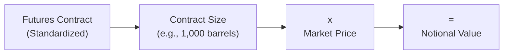

## 2.11 Contract Size and the Value of the Underlying Interest

Understanding the idea of contract size in futures might sound, well, a bit technical. But trust me, it's one of the first topics every new futures trader has that “aha” moment about. I remember the first time I traded a modest wheat futures contract and was stunned by how a small price move could lead to a surprisingly big dollar impact—far bigger than just picking up a couple of shares of stock. Let’s dive in.

### Why Contract Size Matters

Imagine you’ve got a single futures contract on crude oil in your account. You see the price for one barrel at $75, and that one contract might represent 1,000 barrels. That effectively means you’re controlling $75,000 worth of oil (your notional value). And to maintain that position, you might only post a fraction of it as margin—maybe a couple of thousand dollars. A 1% move on the price can turn into hundreds of dollars in gains or losses. 

This is exciting, right? But it also goes to show how critical it is to know exactly how much of the underlying asset you’re exposed to when you buy or sell a futures contract. Contract size can vary widely among different products (agricultural, energy, or financial), so matching the right contract size with your strategy is key. 

### Standardized Contracts

Futures contracts are typically standardized by exchanges. This means the exchange defines specific details like how many barrels, bushels, or financial units each futures contract represents. The exchange also sets other terms like the grade, the delivery mechanism, and sometimes the last trading day. The Canadian Derivatives Clearing Corporation (CDCC) handles clearing for derivatives listed on the Montréal Exchange, ensuring that standardized contracts remain uniform and trusted.

Let’s look at some typical examples of contract sizes (please note that these are purely illustrative; actual sizes and specs can differ by exchange and product):

| Future                              | Standard Contract Size                   |
|-------------------------------------|-------------------------------------------|
| Crude Oil (NYMEX/Globex)            | 1,000 barrels of crude oil               |
| Corn                                | 5,000 bushels of corn                    |
| Gold                                | 100 troy ounces of gold                  |
| 10-Year Government Treasury Note    | $100,000 face value                      |
| S&P/TSX 60 Index (SXF on MX)        | Multiplier of $200 × Index level         |
| 3M Canadian Bankers’ Acceptance (BAX) | Notional principal of CA$1,000,000 (for interest) |

Those are the standard contracts. Exchanges sometimes introduce “mini” or “micro” versions that only require a fraction of the standard contract size. This helps reduce margin requirements and can broaden market accessibility, especially to retail or smaller-scale institutional participants.

### Calculating the Notional Value

Calculating the total notional value is straightforward: multiply the contract size by the current market price of the underlying. Let’s do a walk-through. Suppose you’re looking at a crude oil futures contract at a quoted price of $75 per barrel, and each contract represents 1,000 barrels:

Notional Value = Contract Size × Underlying Price  
= 1,000 barrels × $75 per barrel  
= $75,000  

This is the total value of the crude oil that your single futures contract is replicating or “controlling.” That notional value influences your margin, the potential for gains or losses, and your overall capital requirements.

### Visualizing the Relationship

It can help to see a quick diagram of how contract size ties directly into notional value.

The bigger the contract size, the greater the absolute impact of every penny move in price.  

### Influence on Margin Requirements

Because futures trade on margin, you only put down a small portion (often referred to as “initial margin”) of that notional value to control the position. But remember—profit and loss are marked to market daily. So if prices swing against you, you could be called on to deposit more money into your account (a “margin call”). When you choose a contract with a large size, it’s much easier to bump up against that scenario if markets move quickly.

### Different Assets, Different Measures

Various commodities and financial instruments use different units for their contract sizes. Agricultural commodities might measure in bushels (like wheat or corn) or pounds (like live cattle or hogs). Metals like gold and silver might measure in ounces, while financial futures typically specify a face or notional value of the underlying instrument. For instance, a bond future might be based on $100,000 face value of a government bond with a specified coupon rate and maturity range.  

Canada’s own markets reflect this diversity. On the Montréal Exchange, interest rate futures like BAX (Three-Month Canadian Bankers’ Acceptance Futures) have a notional amount of C$1,000,000 in deposits for a three-month period. Stock index futures—like the S&P/TSX 60 Index futures—have a standardized multiplier (commonly $200) multiplied by the index level itself.

### Mini and Micro Contracts

So, what if you don’t want that big an exposure? Exchanges offer smaller contracts, often referred to as mini or micro contracts. These can drastically reduce margin requirements and the potential risk of a fast-moving position. For example, some stock index futures in the U.S. come in “mini” or “micro” sizes that are only a fraction (e.g., one-fifth or one-tenth) of the standard contract.  

It’s not unusual for an exchange—like the Montréal Exchange or others globally—to periodically adjust specs or roll out new contracts. CIRO might issue guidelines to make sure participants understand how adjustments affect margin calculations or risk exposures.

### Real-World Example: Calculating Gains and Losses

Let’s say you buy one Canadian crude oil futures contract (hypothetical scenario) at $80 per barrel, controlling 1,000 barrels:  

• Notional value at purchase:  
  1,000 × $80 = $80,000  

• One week later, the price rises to $81.30 per barrel:  

• New notional value:  
  1,000 × $81.30 = $81,300  

• Your gain:  
  $81,300 – $80,000 = $1,300  

It might look like just $1.30 per barrel, but times 1,000 barrels, that’s $1,300 in total. The beauty (or stress!) of futures is that you only posted a fraction of $80,000 in margin to control that entire contract. It works strongly in your favor when you’re right about market direction—but we shouldn’t forget it can just as easily magnify losses.

### Choosing the Right Contract

Sometimes, new futures traders make the mistake of diving into a large-size contract thinking, “I can handle that.” Then a small move in the market triggers margin calls they can’t meet. If your capital is limited or you’re not looking for that level of exposure, a mini or micro contract might be a wiser choice. Always consider:  
• Your hedging or speculative objectives  
• The volatility of the underlying asset  
• Your risk tolerance and margin constraints

### Regulatory Considerations and CIRO

As of 2023, Canada’s main regulatory body for investment dealers and certain market integrity functions is the Canadian Investment Regulatory Organization (CIRO). This organization ensures that when new contracts or changes to existing standards come into effect, members are well-versed on updated margin guidelines and reporting requirements. Although the Mutual Fund Dealers Association (MFDA) and the Investment Industry Regulatory Organization of Canada (IIROC) were predecessors, they no longer exist as separate bodies.  

CIRO commonly monitors how the exchanges roll out (or modify) contract specs—particularly if the changes might impact risk or introduce new complexities for traders. Keep an eye on CIRO’s official communications at [https://www.ciro.ca](https://www.ciro.ca) for margin requirement updates, especially around new or mini futures listings.

### Tying It All Together

A thorough awareness of the interplay between contract size, margin, and the underlying asset price is the linchpin of successful futures trading. Whether you’re hedging a wheat harvest or speculating on the next interest rate move, you need the right-sized tool—a contract too big becomes unmanageable, while contract sizes too small might not meet your trading objectives in a cost-effective way.

### Additional Resources

• Montréal Exchange Website: Visit the official Montréal Exchange site for contract specifications, including mini or micro versions of index or other futures:  
  https://www.m-x.ca/  
• Commodity Atlas (FAO): This open-source data resource offers global agricultural commodities info:  
  http://www.fao.org  
• Online Trading Simulators: Several reputable brokers and educational platforms offer real-time or delayed futures trading simulators. You can practice seeing how contract size and price changes affect your notional value and margin balance—without risking real money.

---

## Sample Exam Questions: Contract Size and the Value of the Underlying Interest



### A farmer wants to hedge 5,000 bushels of corn. Which statement is correct regarding contract size? 
- [x] If each futures contract is for 5,000 bushels, then one contract exactly hedges the farmer’s crop. 
- [ ] The contract size isn’t important because price swings will be minimal. 
- [ ] The farmer needs multiple contracts since each covers only 1,000 bushels. 
- [ ] Contract sizes for corn futures never change. 

> **Explanation:** Corn futures typically trade in 5,000-bushel contracts, meaning one contract would hedge exactly 5,000 bushels.  

### Suppose a futures contract is sized at 1,000 barrels of oil and the price is $87 per barrel. Which of the following best represents the contract’s notional value? 
- [x] $87,000 
- [ ] $870 
- [ ] $8,700 
- [ ] $870,000 

> **Explanation:** Notional value is calculated as Contract Size × Price = 1,000 × $87 = $87,000.  

### If a futures contract’s size is too large for your portfolio, what’s a potential alternative? 
- [x] Trading mini or micro versions of the contract 
- [ ] Trading with higher leverage 
- [ ] Ignoring margin calls 
- [ ] Buying more contracts  

> **Explanation:** Trading smaller contracts (mini or micro) helps reduce notional exposure and margin requirements, aligning with a smaller portfolio or lower risk tolerance.  

### How do changes in the underlying price affect a futures contract’s notional value? 
- [x] Notional value moves in direct proportion to the underlying price. 
- [ ] Notional value is fixed once the contract is opened. 
- [ ] Notional value decreases if the price rises. 
- [ ] None of the above. 

> **Explanation:** The notional value is simply contract size multiplied by the current price. As the price changes, the notional value changes.  

### Choose the correct statement regarding CIRO guidelines and contract sizes: 
- [x] CIRO may update margin requirements if an exchange alters a contract’s size. 
- [ ] CIRO prohibits trading mini contracts. 
- [ ] CIRO mandates a standard size of $100,000 for all financial futures. 
- [ ] CIRO has no role in regulating contract sizes. 

> **Explanation:** CIRO may issue new guidelines or margin requirements when contract specifications change, but it doesn’t mandate universal standardization.  

### For a gold futures contract sized at 100 troy ounces, if gold is trading at $1,850 per ounce, what’s the approximate notional value? 
- [x] $185,000 
- [ ] $1,850 
- [ ] $18,500 
- [ ] $1,850,000 

> **Explanation:** 100 ounces × $1,850 per ounce = $185,000.  

### Which factor is key in determining daily profit or loss on a futures position? 
- [x] The change in the underlying price multiplied by the contract size 
- [ ] The absolute value of the contract’s notional at the start of trading 
- [ ] The margin interest rate 
- [ ] The number of participants in the market 

> **Explanation:** P/L is primarily driven by price changes in the underlying multiplied by the contract size for the positions held.  

### Why might an agricultural producer choose a futures contract that closely matches their production amount? 
- [x] To hedge risk effectively without over- or under-hedging 
- [ ] To temporarily abandon production goals 
- [ ] They don’t; producers generally avoid futures 
- [ ] Because futures are guaranteed to earn a profit 

> **Explanation:** Matching production size to a futures contract size better hedges the price risk without taking on excess exposure (over-hedge) or insufficient coverage (under-hedge).  

### If a trader does not want to hold a full notional value of $1 million in an interest rate futures contract, what is the simplest solution? 
- [x] Trade a smaller contract if available, like a mini or micro contract 
- [ ] Short multiple contracts at once 
- [ ] Wait until the contract expires 
- [ ] Hedge with a different commodity 

> **Explanation:** Selecting a contract that matches desired exposure (mini or micro) is the simplest solution to reduce the notional value.  

### A large contract size can magnify both profits and losses. True or False? 
- [x] True 
- [ ] False 

> **Explanation:** Larger contract sizes mean that small underlying price movements can translate into significant dollar gains or losses, amplifying the position’s risk.  


