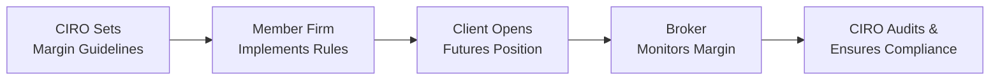
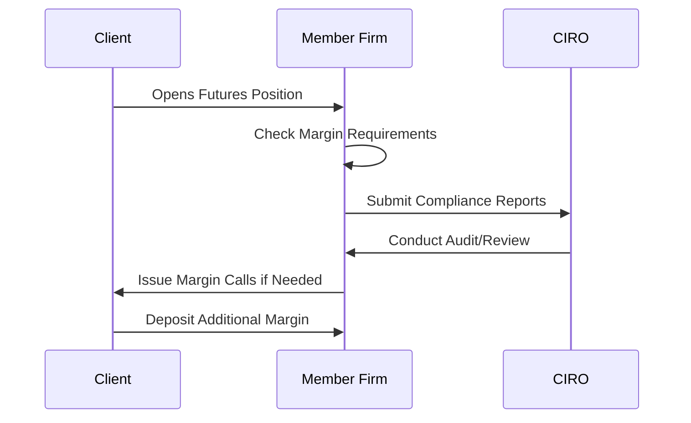

## 2.12 CIRO Oversight and Margin Guidelines for Futures

It’s one thing to understand the nuts and bolts of a futures contract, but it’s quite another to navigate the regulatory environment that shapes how such contracts can be traded. If you’re in Canada, the Canadian Investment Regulatory Organization (CIRO) is the key player setting margin requirements, monitoring member firms, and protecting the interests of investors who trade futures. This section aims to demystify CIRO’s margin guidelines and clarify how the overall oversight process works.

Sometimes, folks ask me how I learned about margin requirements in the first place. I still recall feeling overwhelmed when I first realized that the “little deposit” I was putting down on a futures contract wasn’t actually the total cost but just the margin. I had a bit of a “Whoa, that changes everything!” moment—especially when I realized that CIRO could raise or lower that required margin deposit depending on what's happening in the broader marketplace. Let’s get into the nitty-gritty of how all this plays out.

  
### The Role of CIRO in Regulating Futures

CIRO has one primary objective: To ensure Canada’s investment dealers and mutual fund dealers meet compliance standards, protect retail and institutional investors, and uphold market integrity. Meanwhile, CIPF (Canadian Investor Protection Fund) serves as the single protection plan for client assets if a broker-dealer fails. CIRO took over the roles previously held by the Mutual Fund Dealers Association of Canada (MFDA) and the Investment Industry Regulatory Organization of Canada (IIROC). Although these two are now defunct, references to them might still pop up in older resources.

When it comes to futures, CIRO enforces margin requirements and compliance arrangements that must be upheld by approved participants (also commonly called “member firms”). If you manage or advise a futures account, you must keep up with CIRO’s guidelines to ensure you’re staying on the right side of the rules. Let’s explore some core aspects of this regulation:

• Minimum margin requirements for futures positions.  
• Periodic audits of member firms to ensure rules are being followed.  
• Risk concentration limits that prevent any single position from threatening a firm’s stability.  
• Monitoring of disclosure and best execution practices.  
• Enforcement of risk disclosures to clients.  
• Oversight of insider trading and market manipulation.  

It’s a tall order, right? Don’t worry—CIRO publishes extensive resources, such as the CIRO Rule Book on its website (https://www.ciro.ca). You’ll also find updates from the Canadian Securities Administrators (CSA) and Bourse de Montréal bulletins on margin changes during periods of heightened market volatility.

  
### Understanding Margin for Futures

In plain language, margin is the “good-faith deposit” required to protect the clearinghouse, broker, and the overall financial system from defaults. Think of margin as collateral. The actual nominal value of your futures contract might be much larger than the margin you post, but it’s your margin that ensures you can handle daily market moves (a concept known as marking-to-market).

  
#### Initial Margin vs. Maintenance Margin

If you’re just stepping into the futures arena, you’ll quickly hear about “initial margin” and “maintenance margin.” They’re not the same thing. Here’s a quick breakdown:

• Initial Margin: The amount you must deposit when you open your futures position.  
• Maintenance Margin: A lower threshold that your account equity shouldn’t dip below after you’ve established the position.  

Let’s say the initial margin for a certain commodity futures contract is CAD 4,000. You open the position and post that much. Then the market moves, and your unrealized losses reduce your account equity. If it falls below the maintenance margin—maybe CAD 3,000—then you face the dreaded margin call. And let’s be honest, margin calls can be “Oh gosh, I need to scramble for extra cash” moments. You’ll have to top up back to that original initial margin amount, or in some cases to a level set by your brokerage.

  
#### Formula for Margin Calculation (KaTeX Example)

You might see margin expressed as a product of the contract’s notional value and a certain percentage. Suppose the margin requirement is r (as a decimal), the futures price is P, and the contract size is S (number of units). Then:


\text{Margin} = P \times S \times r


For instance, if P is CAD 1,000, S is 10 (meaning each contract represents 10 units), and r is 0.10 (i.e., 10%), then the margin for one contract is:


\text{Margin} = 1,000 \times 10 \times 0.10 = 1,000 \, \text{CAD}


This is a simplified illustration; actual margin scenarios can be more complex, depending on the market, volatility, and CIRO’s margin rules in effect at the time.

  
### Periodic Audits and CIRO Oversight

One interesting tidbit: CIRO performs routine compliance audits (or spot checks) on member firms. In these audits, the regulator’s primary concerns include:

• Are the firm’s records in good order?  
• Are margin requirements being consistently enforced?  
• Are any clients overconcentrated in a single position or asset class?  
• Is there timely disclosure of risks to clients?

Compliance audits can feel intense from the inside. I once worked at a firm where the auditors arrived just before a holiday weekend—ah, talk about a perfect storm. You can bet our entire team scrambled to print reports, confirm daily margin calls, and prove that client accounts were being monitored.

But these audits and the fear factor surrounding them exist for a good reason. If a brokerage allows a handful of large accounts to carry extremely leveraged positions, that single vulnerability can undermine the firm’s liquidity and stability if something goes awry in the market. So, from a systemic risk perspective, we want the regulator’s watchful eye on potential “hotspots.”

  
### Risk Concentration Limits

Imagine you have a client who’s bullish on gold—a real gold bug—buying 50 gold futures contracts. That’s a big bet. If prices swing the wrong way, your firm could be on the hook for massive losses. To mitigate this, CIRO sets risk concentration limits. These are effectively caps that help ensure no single client or proprietary trade is large enough to jeopardize the broker’s health.

Risk concentration limits often hinge on a ratio of the position size to the firm’s capital base, or to the relevant portfolio’s net asset value. For instance, a firm might set an internal rule that “No single client can hold more than 20% of the firm’s overall clearing capital in margin exposures.” This is just an example for illustration—real figures can differ dramatically.

  
### Margin Adjustments in Volatile Times

You’ve probably experienced times when the market just won’t sit still—political uncertainty, central bank announcements, or events like the 2020–2021 pandemic volatility. In such climates, CIRO, along with the major exchanges like the Bourse de Montréal, can increase margin requirements to protect against large price swings. This ensures that both buyers and sellers have enough skin in the game to remain solvent if the market moves unpredictably.

The logic here is straightforward: Higher volatility = higher potential for big daily price fluctuations = a bigger chance that someone could default. By increasing margin requirements, regulators reduce the overall level of risk in the system.

  
#### Example: Margin Increases During Turbulent Markets

Let’s say under “normal conditions,” the margin for an equity index futures contract stands at around CAD 8,000. Then big headlines hit, and volatility skyrockets. The Bourse issues a bulletin stating margins will be raised by 20%. Now, your margin requirement is CAD 9,600. You might see that as an annoyance—more capital tied up in margin. But from the regulator’s perspective, it’s crucial to prevent large-scale defaults and panic-selling.

  
### CIRO’s Role in Market Integrity

Beyond margin oversight, CIRO enforces rules against market manipulation, insider trading, and other practices that could harm investors or undermine confidence. They coordinate closely with the CSA (Canadian Securities Administrators) to ensure that futures traders aren’t using their positions to artificially distort market prices or harness material nonpublic information.

This means if, for instance, a particular futures market is being heavily shorted by an inside group looking to corner supply or drive down the price, CIRO might intervene. Enforcement can range from formal warnings to heavy fines and even bans from the industry. Which is a good reminder that any short-lived “gain” from insider activity can easily be dwarfed by the penalties (and reputational damage) that follow.

  
### The Importance of Disclosure

Every so often, I come across a friend or a neighbor who’s super-excited about their new “speculative strategy” in the futures markets. Usually, they learned about it from an online forum or YouTube star. While it’s great to see that enthusiasm, I always encourage them to read the risk disclosures their brokerage provides. CIRO requires these disclosures for good reason:

• They outline how futures leverage works, so you realize the potential for amplified profits and losses.  
• They clarify that no one can guarantee future performance.  
• They inform you about the daily settlement process (mark-to-market).  

Sometimes novices skip reading these disclaimers, jumping head-first into the deep end. That’s akin to ignoring a “wet floor” sign and then blaming the caretaker when you slip. So do yourself a favor—read those disclaimers. They’re not just boilerplate. They’re your first layer of protection and empowerment as a trader.

  
### Practical Example: Margin Call Scenario

To put these regulatory principles into perspective, imagine the following hypothetical scenario:

1. Alicia, an active individual trader, opens a futures account with a CIRO-licensed member firm. She decides to go long on 5 crude oil futures contracts.  
2. The initial margin, set by both the exchange and the firm in line with CIRO’s guidelines, is CAD 8,000 per contract. So Alicia posts CAD 40,000.  
3. Oil prices fall unexpectedly, and Alicia’s account equity drops by CAD 12,000 in unrealized losses. Now her account sits at CAD 28,000 in equity. That’s well below the maintenance margin threshold (say, CAD 30,000).  
4. The broker issues a margin call. Alicia needs to deposit enough funds to restore her account to the initial margin level of CAD 40,000.  
5. If Alicia cannot meet the margin call in time, the broker may liquidate some or all of her positions to mitigate the risk.  

Throughout this process, the firm must demonstrate to CIRO (if audited) that it enforced margin calls promptly and adhered to disclosure procedures. If the firm’s compliance managers failed to deliver margin calls, or they overlooked Alicia’s overconcentration in futures, that’s a potential violation that could result in fines or sanctions from CIRO.

  
### Member Firm Responsibilities

It’s not just about you, the client. The member firms themselves have responsibilities:

• Maintaining Comprehensive Records: Brokerage firms must keep records of each client’s positions, margin balances, and trade confirmations.  
• Daily (or More Frequent) Monitoring: Firms must check your account balances against required margin levels, especially in volatile times. Some advanced firms run intraday modeling for large accounts.  
• Audits and Reporting: Member firms are subject to ongoing compliance checks to ensure that they haven’t overlooked risky exposures. They also have to submit regular reports to CIRO on their net capital, outstanding client positions, liquidity frameworks, and more.  
• Disaster Preparedness: Firms are encouraged to incorporate “stress testing” or “scenario analysis” in their risk management programs, anticipating black swan events or severe market shocks.

  
### High-Level Diagram of Margin Oversight

Below is a simple Mermaid diagram showing the key players and processes involved in margin oversight. It can help visualize how regulatory supervision flows from CIRO down to the client level.

• Step A: CIRO publishes margin guidelines and compliance standards.  
• Step B: The member firm (brokerage) applies these guidelines, configuring margin levels and risk controls.  
• Step C: Client starts trading.  
• Step D: Client’s positions are monitored daily (sometimes hourly or intraday).  
• Step E: Periodically, CIRO conducts audits and reviews the firm’s processes to confirm adherence to the rules.

  
### Risk Management Workflow

We can also represent a simplified margin risk management workflow:

1. Client opens a position.  
2. Broker ensures that initial and maintenance margins align with CIRO requirements.  
3. Broker periodically reports position and margin data to CIRO.  
4. CIRO can intervene if it detects anomalies or breaches.  
5. Broker issues margin calls if the client’s equity drops below the maintenance margin threshold.  
6. Client steps up to supply more funds or risk liquidation.

  
### Best Practices and Common Pitfalls

• Keep Liquidity in Mind: Because margin calls can strike fast, savvy traders maintain extra cash or liquid assets to handle a margin call.  
• Monitor Volatility: If volatility is spiking, you could face stricter margin requirements. Watch for bulletins from the Bourse de Montréal and CIRO.  
• Avoid Overconcentration: Even if you have a strong market thesis, concentrate too much in one sector or commodity, and you might face firm-imposed limits or extra scrutiny.  
• Stay Informed: Regulatory changes happen. Keep an eye on the official rule book and staff notices.  
• Watch for “Hidden Correlations”: Two or more positions that seem uncorrelated can move in lockstep during a crisis—leading to bigger-than-expected margin requirements.

  
### Additional References for Canadian Futures Traders

Below are valuable resources if you want to dig deeper:

1. **CIRO Rule Book** (https://www.ciro.ca): Your primary reference for margin requirements, compliance procedures, and updates.  
2. **CSA Staff Notices**: Periodically clarifies margin rules for derivatives and shares guidelines on best practices.  
3. **Bourse de Montréal Regulatory Notices**: Contains bulletins and margin schedules, especially when market volatility prompts changes.  
4. **Open-Source Tools & Data**: Websites like Yahoo Finance or Quandl can help you track real-time or historical futures prices to keep an eye on volatility.  
5. **Professional Publications**: Organizations like the CFA Institute occasionally publish white papers on margin regulations, which can broaden your understanding of global best practices.

  
### Wrapping It All Up

There you have it—CIRO’s oversight and margin guidelines for futures trading in Canada. From initial margin to compliance audits and risk concentration limits, there are many layers of checks and balances designed to keep the market functioning smoothly. If all these rules seem a little overwhelming, always remember the purpose behind them: ensuring financial stability and helping investors (like you and me) trade confidently in a secure environment.

Just like seatbelts and airbags in a car, margin requirements and regulatory oversight exist to protect you from unexpected market collisions. Keep them in mind, stay vigilant, and you’ll be ready to handle the twists and turns of the futures highway.

  
## Sample Exam Questions: CIRO Margin Oversight & Futures Trading



### Which organization oversees margin requirements for futures trading in Canada today?

- [ ] Bank of Canada
- [ ] IIROC
- [x] CIRO
- [ ] CIPF

> **Explanation:** CIRO (Canadian Investment Regulatory Organization) is the current self-regulatory body in Canada, overseeing both investment and mutual fund dealers as well as margin requirements for futures.

### What is the purpose of a maintenance margin in futures trading?

- [x] It ensures a trader always maintains sufficient equity above a certain threshold.
- [ ] It eliminates the need for a margin call altogether.
- [ ] It guarantees that the trader cannot lose money.
- [ ] It penalizes traders who use leverage.

> **Explanation:** Maintenance margin is set to ensure that if the market moves against a trader’s position, there is a ready mechanism—through margin calls—to bring the account equity back to the broker’s required level.

### If a single client at a brokerage holds a very large position that could endanger the firm, which of the following helps prevent this risk?

- [x] Risk concentration limits
- [ ] Fixed interest rates
- [ ] Reduced commissions
- [ ] Elimination of soft-dollar arrangements

> **Explanation:** CIRO imposes risk concentration limits to keep any single client’s position from being so large that it could threaten the financial stability of the member firm if the trade goes sideways.

### Which statement best describes a margin call?

- [x] An instruction from the broker to deposit additional funds or collateral due to account equity falling below maintenance margin.
- [ ] A request from a client to purchase more contracts.
- [ ] A reward given by the exchange for profitable trades.
- [ ] A penalty fee for early contract termination.

> **Explanation:** A margin call happens when the account value slips under the maintenance margin. The client must deposit extra funds back to the initial margin level or risk position liquidation.

### During heightened market volatility, what can CIRO and exchanges typically do to mitigate systemic risk?

- [x] Increase margin requirements
- [ ] Suspend all trading for the entire day
- [x] Raise both initial and maintenance margin levels
- [ ] Lower margin requirements to encourage trading

> **Explanation:** In times of volatility, regulators and exchanges often hike margin levels to ensure participants are adequately capitalized, thus reducing the risk of defaults.

### Why is it important for broker-dealers to perform daily or even intraday checks on their clients’ margin accounts?

- [x] To quickly identify if a client’s equity is falling below the required levels
- [ ] To supplement marketing research for new derivatives
- [ ] To track which client is achieving the highest returns
- [ ] To avoid paying transaction fees to the exchange

> **Explanation:** The main reason is risk management—they need to ensure compliance with CIRO’s rules and protect their firm from overexposed accounts.

### What usually happens if a client fails to meet a margin call?

- [x] The broker may liquidate some or all of the client’s positions
- [ ] The client’s account becomes immune to future regulation
- [x] The client can no longer open new positions and may face forced closings
- [ ] The client automatically becomes a day trader

> **Explanation:** If the account is underwater and the client doesn’t post additional margin, the broker has the right to sell or close positions to cover the shortfall, in accordance with CIRO guidelines.

### Which document is a crucial resource for specific margin and compliance requirements in Canada?

- [ ] U.S. Securities Exchange Act
- [ ] Bank Act
- [ ] Federal Reserve Bulletin
- [x] CIRO Rule Book

> **Explanation:** The CIRO Rule Book is the authoritative source for details on margin requirements, compliance obligations, and best practices for broker-dealers in Canada.

### What is the marking-to-market process in futures trading?

- [x] A daily settling of gains and losses based on the market’s closing prices
- [ ] The mandatory hedging of all client positions
- [ ] A monthly statement that outlines interest earned on margin accounts
- [ ] The immediate liquidation of profitable positions

> **Explanation:** Marking-to-market ensures that all futures accounts reflect daily profit and loss changes, enabling brokers to manage margin calls promptly.

### True or False: CIRO can take disciplinary action against a firm if they fail to issue margin calls in a timely manner.

- [x] True
- [ ] False

> **Explanation:** CIRO can (and does) fine, sanction, or otherwise discipline member firms that do not uphold margin call standards, as this neglect can pose systemic risk.


