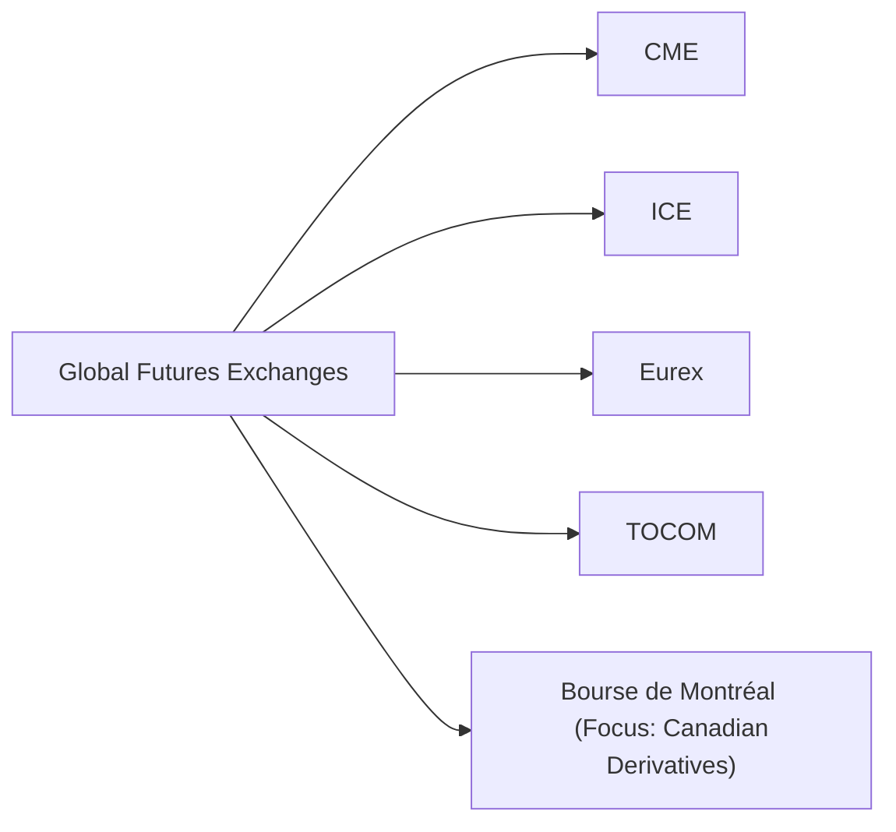

## 2.13 Key Global Futures Exchanges (Comparison to Bourse de Montréal)

It’s sometimes astonishing to step onto the bustling trading floor of a major futures exchange (at least, I recall the electric vibe the first time I did it years ago!). The place practically hums with traders juggling risk across every commodity, currency, or index you can imagine. While open-outcry pits have given way to electronic platforms in most parts of the world, the global network of futures markets remains vibrant and interconnected. Here, we’ll dive into some of the world’s key futures exchanges, highlight what they’re known for, and compare each to the Bourse de Montréal (often called Montréal Exchange or MX) in Canada.

Use this as your guide to better grasp how different futures exchanges serve global markets, and why the Bourse de Montréal has carved out a unique place in the vast global derivatives landscape.

Understanding how these exchanges differ—especially when implementing cross-border strategies—can help you navigate everything from margin requirements to trading hours and potential tax implications. After all, we’re in a very interconnected world; I’ve personally witnessed traders in Europe hedging North American commodities, or Canadians speculating on Japanese interest rate zones late at night. That’s how global the picture has become.

  
Building Blocks of a Global Futures Exchange  
-------------------------------------------

Sometimes you’ll hear new traders ask: “Why do we need so many different futures exchanges?” Well, each exchange typically focuses on certain types of products—like commodities, energy, metals, or interest rates—and each operates under specific regulatory frameworks and time zones that reflect the needs of their home market. Still, many are globally relevant because they list benchmark contracts that set worldwide price references.

• Product Specialization: Exchanges often concentrate on products that matter to their local economies or align with their historical roots.  
• Global Accessibility: Thanks to electronic trading, you can now trade contracts 24 hours a day in many cases.  
• Regulatory Setting: Each exchange’s operations reflect the rules of its national regulator, though global harmonization efforts (like IOSCO principles) help keep markets aligned.  
• Clearing and Settlement: This is crucial to ensure each counterparty meets its obligations, often via designated clearinghouses.

  
Major Global Exchanges at a Glance  
----------------------------------

Before comparing them directly to the Bourse de Montréal, let’s look at four big names: CME, ICE, Eurex, and TOCOM. Each has a specialty and a separate legal framework, but in many ways, they share the common goal of facilitating transparent, liquid markets.  

Chicago Mercantile Exchange (CME)  
---------------------------------

If you think of one exchange that truly shaped the concept of modern futures trading, CME (part of the CME Group) has to be near the top. Historically known for its strong presence in agricultural products (e.g., corn, wheat, and soybeans through the CBOT division), CME also added massive interest rate products like Eurodollar futures, equity index futures like the E-mini S&P 500, and energy products through its NYMEX division (which includes WTI crude oil futures).  

CME operates virtually around the clock on its electronic Globex platform, bridging different time zones. It’s often considered the largest and most diverse futures exchange group in the world.

Intercontinental Exchange (ICE)  
-------------------------------

ICE began life largely focusing on over-the-counter energy markets back in the late 1990s. It has since expanded through acquisitions, including the New York Board of Trade (NYBOT). ICE is known for benchmark contracts like Brent crude oil futures—an international price reference for much of the world’s crude supply.  

Energy, soft commodities (like coffee, cocoa, sugar), and financial futures (interest rates and equity indexes) are all part of ICE’s offerings. ICE has also grown a broad global footprint, with exchanges in the U.S., Europe, and Singapore.  

Eurex  
-----

Based in Europe, particularly Frankfurt, Eurex is a powerhouse for European interest rate derivatives (think German Bund futures) and equity index derivatives like those on the DAX. Eurex also offers extensive stock options, volatility products, and a range of equity index futures from various European markets.  

One interesting thing about Eurex is that it’s partially owned by the Deutsche Börse Group and the Swiss Exchange (formerly Swiss Financial Market Services). Its trading hours cater primarily to European market participants, although significant volumes often come from North America and Asia.

Tokyo Commodity Exchange (TOCOM)  
--------------------------------

TOCOM is Japan’s main commodity futures exchange, historically recognized for its robust precious metals contracts (gold, silver, platinum) and energy (crude oil, gasoline). Japan’s domestic demand for these commodities is a key driver, giving TOCOM a loyal regional user base.  

While TOCOM does not necessarily have the global volumes of a CME or ICE, it remains pivotal for Asian market participants who require access to local time zone liquidity in commodities.  

  
Visual Overview of Global Exchanges  
-----------------------------------

Below is a simple Mermaid diagram to give a quick conceptual layout of how these major exchanges co-exist in the global ecosystem. Think of it as a snapshot of the major branches on the global futures family tree:

While all are interconnected in a broad derivative web, each focuses on its preferred set of assets and has strong ties to its region’s regulatory and economic backdrop.

Comparing the Bourse de Montréal  
--------------------------------

Now let’s zero in on the home turf: the Bourse de Montréal, or Montréal Exchange (MX). It’s Canada’s oldest exchange (founded in 1874) and acts as the primary venue for trading Canadian-listed equity options and futures. Over the years, the Bourse de Montréal has developed specialized financial derivatives, such as:

• Equity Index Futures (S&P/TSX 60 Index Futures)  
• Interest Rate Futures (including Canadian Bankers’ Acceptance Futures)  
• Bond Futures (like Government of Canada bond futures)  
• Options on these futures and equity options on major Canadian companies  

Although the Bourse de Montréal may not match the sheer volume of CME or ICE in global terms, it is essential for anyone needing exposure to Canadian markets. Its liquidity in interest rate futures and equity index derivatives is especially useful for hedging Canadian dollar-denominated instruments or speculating on Canadian interest rate movements and equity sectors.

  
Market Focus and Product Range  
------------------------------

One big difference is the product coverage. While global exchanges such as CME or ICE host an array of commodity contracts (including energy, agriculture, and metals), the Bourse de Montréal mostly caters to equity and financial derivatives. This narrower product range is actually a strength for participants who specifically want to hedge or gain exposure to Canadian interest rates or equity indices.  

In short: If you need to hedge your portfolio against a shift in Canadian interest rates or maybe speculate on the Canadian stock market, Montréal’s got you covered. If you want to hedge crude oil, you might turn to CME’s WTI futures or ICE’s Brent.  

  
Liquidity and Open Interest  
---------------------------

Liquidity is sometimes measured by the total number of contracts traded in a day (volume) and the total number of open positions outstanding at any given time (open interest). CME, with its global reach, can see daily volumes in the millions of contracts in its core products. ICE, similarly, has heavy volumes in Brent crude and financial futures.  

The Bourse de Montréal, being more specialized, generally reports lower volumes than these giants. However, its open interest in certain benchmarks—like Canadian interest rate futures—has been growing steadily. For domestic and foreign participants who require targeted hedges in Canadian dollars, trading on the Bourse de Montréal can offer sufficient depth.

  
Trading Hours  
-------------

Extended trading is a common feature of top global venues. CME, for example, runs Globex nearly around the clock during weekdays, bridging Asia, Europe, and the Americas. ICE similarly offers wide time blocks for energy and financial markets.  

The Bourse de Montréal’s trading hours are aligned primarily with North American business hours, though it has expanded in certain products to accommodate European participants. For cross-border traders who need simultaneous coverage on both sides of the Atlantic—like Canadian bond futures paired with Euro Bund futures—careful scheduling is crucial.  

  
Regulatory Structures & Harmonization  
-------------------------------------

Each major venue operates within its own national regulatory framework. In the U.S., the Commodity Futures Trading Commission (CFTC) oversees futures markets, while in Europe, institutions comply with the European Securities and Markets Authority (ESMA) guidelines (often integrated with local regulators). In Canada, the regulatory environment is somewhat fragmented among provincial authorities, but the Bourse de Montréal is recognized and overseen by the Autorité des marchés financiers (AMF) in Québec, with certain national harmonization efforts.  

Since January 1, 2023, the Canadian Investment Regulatory Organization (CIRO) is the new self-regulatory organization overseeing investment dealers and mutual fund dealers. CIRO references replaced historical references to the Investment Industry Regulatory Organization of Canada (IIROC) and the Mutual Fund Dealers Association (MFDA). For official details, visit [CIRO’s website](https://www.ciro.ca).  

Meanwhile, global harmonization efforts, like IOSCO (International Organization of Securities Commissions) guidelines, help maintain some cross-border consistency in reporting and clearing requirements. If, for instance, a Canadian firm wants to trade Eurex futures, it might rely on international best practices for risk management, licensing, and cross-border collateral arrangements.  

  
Cross-Border Strategies and Considerations  
------------------------------------------

But what about cross-border strategies using the Bourse de Montréal and bigger global venues like CME or ICE? Traders often run parallel trades or multi-legged hedges across jurisdictions. I once worked with a portfolio manager who used the Bourse de Montréal Bankers’ Acceptance futures to hedge interest rate exposure in Canada, while simultaneously using Eurodollar futures at CME for U.S. rate exposure. The biggest challenges they faced:

1. Currency Differences: Gains and losses in Canadian contracts are CAD-denominated, whereas U.S. markets trade in USD. Hedging one currency exposure effectively sometimes leads to fresh currency risk.  
2. Regulatory Nuances: Margin rules might differ between the Bourse de Montréal and foreign exchanges. You’ve got to understand each exchange’s margin framework (CIRO for the Canadian side).  
3. Tax Implications: Gains on futures trades may be taxed differently in each country. Engaging a tax adviser well versed in cross-border strategies is essential.  
4. Time Zones: Managing positions across multiple continents can lead to weird working hours. Trust me, I’ve done the 2:00 a.m. calls with European contacts—coffee becomes your best friend.  

  
Case Study: Comparing Canadian Bond Futures and U.S. Treasury Futures  
---------------------------------------------------------------------

Imagine a scenario with a multinational bank that needs to hedge a portfolio of Canadian government bonds and U.S. Treasuries. This bank faces interest rate risk both in Canada and the U.S.  

• The bank uses Bourse de Montréal’s 10-Year Government of Canada Bond Futures (CGB) contract to hedge the Canadian portion.  
• Simultaneously, it uses the CME 10-Year U.S. Treasury Note Futures for the U.S. exposure.  

Why bother trading in two different markets? Well, each contract is more liquid and more cost-effective for hedging a local currency bond. The bank ensures it has staff or technology to handle margin calls in both markets separately. It also carefully monitors exchange rates to translate potential gains or losses back into its base currency.  

That approach is a perfect example of how two specialized exchanges can be used in tandem for a holistic hedging strategy. The Bourse de Montréal becomes the go-to for any Canadian interest rate or TSX benchmark exposure, while CME or ICE may be used for a broader global risk management program (including energy or metals).  

  
Regulatory Update: CIRO  
-----------------------

Since you’re working (or plan to work) in Canada, keep in mind that starting January 1, 2023, the MFDA and IIROC have merged to form CIRO (Canadian Investment Regulatory Organization). CIRO sets the standards for margin, compliance, and the oversight of brokerage firms dealing in futures and derivatives. For more comprehensive info, see the [CIRO website](https://www.ciro.ca).  

While this doesn’t directly alter how the Bourse de Montréal is structured or how it competes with global exchanges, it does standardize the regulatory environment for Canadian dealers and fosters a more unified approach to compliance.  

  
Looking Ahead: Growth and Challenges  
------------------------------------

Over the last several years, the Bourse de Montréal has added more products, improved on electronic trading systems, and attracted incremental foreign participation. As the global appetite for trading derivatives has grown, the Bourse’s specialized focus on Canadian markets can remain a strategic draw for not only domestic users but also large international players wanting to hedge or speculate in Canada.  

However, the Bourse faces challenges, too. Because other global exchanges have enormous volumes and extended trading hours, they remain the first choice for many internationally oriented traders. The Bourse’s success depends on continuing to build liquidity, collaborating with global clearinghouses, and ensuring easy cross-border access.  

  
Practical Tips and Best Practices  
---------------------------------

• Compare Margin Requirements: Before opening positions on multiple global exchanges, compare margin requirements. Visit the Bourse de Montréal’s website for contract specifications and consult CIRO guidelines to ensure compliance.  
• Factor in Time Zones: If you’re placing trades in Japan, Frankfurt, New York, and Montréal, plan your trading desk coverage carefully to avoid mistakes.  
• Monitor Currency Exposure: Hedging in multiple currencies can introduce unexpected foreign exchange risk.  
• Leverage Available Resources: Both CME and ICE often publish free daily commentary or open interest reports. The Bourse de Montréal provides updates on its volumes, plus research on Canadian interest rate trends.  
• Stay Informed on Regulations: You can keep track of multi-jurisdictional requirements by following IOSCO guidelines and regularly checking for updates at [CIRO’s website](https://www.ciro.ca).  

  
Further Resources  
-----------------

• [CME Group](https://www.cmegroup.com)  
• [Intercontinental Exchange (ICE)](https://www.theice.com)  
• [Eurex](https://www.eurex.com)  
• [Tokyo Commodity Exchange (TOCOM)](https://www.jpx.co.jp/english/)  
• [Bourse de Montréal (Montréal Exchange)](https://www.m-x.ca)  
• [CIRO - Canadian Investment Regulatory Organization](https://www.ciro.ca)  
• IOSCO: [International Organization of Securities Commissions](https://www.iosco.org)  
• Financial Times coverage for market data and key insights on global futures.  

If you want to explore contract specifications, take a look at the official exchange websites—many of them provide detailed product guides, historical volume data, and margin calculators for free. It’s a treasure trove of information and will help you analyze whether a given contract suits your trading or hedging objectives.

  
Conclusion  
----------

Global futures exchanges each play a distinct role in shaping how key commodities, interest rates, and equity indexes are priced around the world. While giants like CME and ICE dominate in terms of volumes and product range, the Bourse de Montréal thrives in its specialized role: providing essential financial derivatives for the Canadian market.  

Whether you’re a portfolio manager looking to hedge against a potential shift in Canadian interest rates, or a corporate treasurer who needs a cost-effective way to protect your TSX exposure from volatility, you’ll likely use the Bourse de Montréal. Yet at the same time, you might combine it with the bigger global players if your risk footprint extends beyond Canada.  

It all comes down to selecting the right tool for the job—understanding each exchange’s strengths, regulatory frameworks, and market dynamics will help you weave a more effective global trading strategy. And, honestly, few things feel more rewarding than hitting that perfect hedge at the precise time!  

Stay curious, keep exploring market resources, and always do your homework on the regulatory side—especially with cross-border trades.  

  
## Sample Exam Questions: Key Global Futures Exchanges (Comparison to Bourse de Montréal)



### Which global exchange is particularly known for German Bund futures, a key European interest rate product?

- [ ] Chicago Mercantile Exchange (CME)
- [ ] Intercontinental Exchange (ICE)
- [x] Eurex
- [ ] Tokyo Commodity Exchange (TOCOM)

> **Explanation:** Eurex, based in Europe, is majorly known for its German Bund futures and other Eurozone interest rate products.

### Which of the following statements best describes the primary product focus of the Bourse de Montréal?

- [ ] Primarily commodities like crude oil and metals
- [x] Equity and financial derivatives focused on Canadian markets
- [ ] Agricultural futures and soft commodities
- [ ] Energy derivatives with a global benchmark status

> **Explanation:** The Bourse de Montréal specializes in Canadian equity index futures, interest rate futures, and associated financial derivatives.

### Which major global exchange provides the benchmark Brent crude oil futures contract?

- [ ] Bourse de Montréal
- [ ] Eurex
- [x] Intercontinental Exchange (ICE)
- [ ] Tokyo Commodity Exchange (TOCOM)

> **Explanation:** ICE offers Brent crude oil futures, which is considered a global benchmark for pricing many varieties of crude oil.

### How do global harmonization efforts, such as IOSCO principles, benefit cross-border traders?

- [x] They help maintain consistent reporting and clearing requirements across different jurisdictions.
- [ ] They mandate universal tax rates for futures trades.
- [ ] They require all exchanges to operate on the same time zone.
- [ ] They eliminate the need for separate regulatory approvals.

> **Explanation:** Although IOSCO does not unify tax or time zone regulations, it sets guidelines that improve consistency and transparency in multi-jurisdictional regulatory environments.

### Which factor is most critical when comparing liquidity across different futures exchanges?

- [ ] The minimum number of daily trades allowed
- [x] The volume and open interest
- [ ] The color of each exchange’s trading terminals
- [ ] Across-the-board uniform pricing

> **Explanation:** Liquidity is often measured by volume (daily trading activity) and open interest (total outstanding contracts).

### Which regulatory body oversees futures trading in Canada, following the amalgamation of IIROC and MFDA?

- [ ] IIROC
- [ ] MFDA
- [x] CIRO
- [ ] IOSCO

> **Explanation:** Since January 1, 2023, the Canadian Investment Regulatory Organization (CIRO) is Canada’s new self-regulatory organization overseeing both investment dealers and mutual fund dealers.

### For a Canadian-based trader who needs to hedge crude oil exposure, which exchange’s contract is most commonly utilized globally?

- [ ] Bourse de Montréal’s equity index futures
- [ ] Eurex’s German Bund futures
- [ ] TOCOM’s precious metals contracts
- [x] CME’s NYMEX WTI crude futures

> **Explanation:** CME Group’s NYMEX division lists the WTI crude oil futures contract, considered a key global benchmark for crude oil.

### Which of the following is NOT a recognized challenge when using cross-border futures strategies?

- [ ] Different time zones
- [ ] Varying regulatory requirements
- [ ] Currency exchange risk
- [x] A single standardized global tax policy

> **Explanation:** Each country has its own tax policies; there is no single global tax policy, which itself is a challenge rather than a non-issue.

### What best describes the trading hours model for major global exchanges like CME and ICE?

- [x] Extended trading sessions extending nearly 24 hours on weekdays
- [ ] Strictly limited to 6-8 hours per day
- [ ] Open only on weekends
- [ ] Rotating times that vary by the week

> **Explanation:** CME and ICE generally provide extended trading sessions, enabling global market participants to access the markets throughout most of the day.

### True or False: The Bourse de Montréal primarily competes on commodity products like agricultural futures alongside top-tier global exchanges.

- [ ] True
- [x] False

> **Explanation:** The Bourse de Montréal specializes mainly in financial derivatives such as equity index and interest rate futures. It does not primarily compete with global exchanges that center on agricultural commodities.


