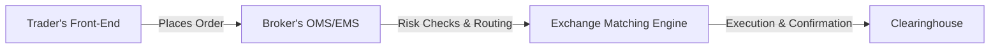

## 2.14 Electronic Order Routing and Market Data Feeds

Electronic order routing and market data feeds might sound a bit intimidating at first, but they’re basically the backbone of modern futures trading. If you’ve ever logged into a trading app on your phone, or if you’re a newcomer trying to execute your first trade, you’ve likely encountered these concepts—even if you didn’t realize it. So, let’s talk about what they actually are, why they matter, and how to use them effectively in Canada’s (and the world’s) dynamic derivatives markets.

### Why Electronic Order Routing Matters

When we discuss "electronic order routing," we’re referring to the process of sending a buy or sell order straight from your computer (or mobile device) to an exchange’s matching engine. In the era before computers took center stage, this process involved calling up your broker, who would then pass orders along via phone lines or floor traders. It was slower, prone to miscommunication, and limited by the physical presence of those involved.

Nowadays, order routing has become so fast and efficient that many folks treat it like a given. However, there’s a lot happening under the hood. That “Send Order” button in your trading platform triggers a series of automated checks—like margin availability, credit checks, and risk procedures—before your order zooms off to the exchange. And if you’re using advanced strategies or algorithmic scripts, your system might be sending a constant stream of these orders, sometimes in milliseconds. Let’s break this down with a quick visual:

- A["Trader's Front-End"]: This could be your favorite trading app, a web-based platform, or even a custom-coded program that connects to your broker’s API.  
- B["Broker's OMS/EMS"]: The Order Management System (OMS) and Execution Management System (EMS) handle risk checks, route orders, and communicate with the exchange.  
- C["Exchange Matching Engine"]: This is the exchange’s central system that matches buy and sell orders based on price, time priority, and other protocols.  
- D["Clearinghouse"]: Once trades are matched, the clearinghouse steps in to ensure each side of the transaction honors its obligations.

### The Reliability and Speed Factor (Latency)

Speed is paramount in electronic trading. Let’s say you’re trying to buy futures on the Bourse de Montréal. If your Internet connection or the broker’s routing system is slow, your order might hit the exchange late, potentially leading to a worse fill price. This delay is often called “latency”—the time it takes for your order to travel from your fingertips to the exchange’s matching engine and back.

Latency isn’t just about hardware or Internet speed—it can arise from software algorithms or even geographical distance between you and the exchange servers. For many retail traders, a fewmilliseconds here or there might not be a deal-breaker. But for high-frequency trading (HFT) shops, each microsecond of delay can cost real money. That’s why specialized firms co-locate their servers in the same data centers as the exchange or buy premium lines to minimize latency.  

### Market Data Feeds: Fuel for Trading Decisions

While order routing is like the highway your trades use to get to the exchange, market data feeds are like the scoreboard that tells you what’s happening in real time. 

- **Real-Time Data Feeds**: These feeds carry up-to-the-second (or even faster) updates of price quotes, trade executions, and market depth. If you want to execute trades based on the very latest information (especially in volatile markets), real-time is a must.  
- **Delayed Data**: For casual or long-term traders, sometimes a 15-minute delay is enough to chart basic trends. Delayed data is usually cheaper—or even free—but it’s less useful if you’re engaging in intraday strategies or quick trades.  

High-quality market data feeds provide snapshots of the order book (i.e., bids and offers at various price levels). This helps you see where most of the activity is happening. Depth-of-market data (also called Level II or Level III, depending on the exchange) can reveal how other traders are positioned, which can influence your strategy and execution price.

### Advanced Trading Platforms, APIs, and Algorithmic Wizardry

So, you click a button, an order goes to the exchange, you get a fill—simple enough, right? Well, some traders want more. Advanced platforms and APIs let traders build or lease specialized software that can do all kinds of things:

• **Algorithmic Execution**: Setting up your computer to automatically buy or sell if certain market conditions arise. For example, “Buy five futures contracts if the price dips below 100, and place a stop order at 95 in the same second.”  

• **High-Frequency Trading**: Systems capable of digesting huge amounts of data and responding in microseconds. Think thousands of orders a day, each aiming for tiny profit margins.  

• **Charting & Technical Analysis**: Tools that track indicators like moving averages, Bollinger Bands, or Relative Strength Indicators.  

• **Risk Management Modules**: Automated checks to close out or reduce positions if market volatility spikes or your net exposure grows too large.  

Many brokers these days provide APIs, so if you’re tech-savvy, you can code your own system. Open-source libraries in Python, such as “zipline” or “backtrader,” have become quite popular for backtesting algorithmic trading strategies. You can feed historical price data into these libraries, see how your strategy might have performed, and then deploy it live using your broker’s API. It’s like building a little robot that trades for you—though it’s crucial that you keep an eye on the robot so it doesn’t go haywire in real markets!

### Regulatory Environment and CIRO’s Role

All of this fancy technology doesn’t exist in a vacuum. In Canada, the regulatory framework exists to ensure fair and orderly trading. Since January 1, 2023, the Canadian Investment Regulatory Organization (CIRO) is Canada’s single self-regulatory organization. It replaced the previous separate entities (the Mutual Fund Dealers Association and the Investment Industry Regulatory Organization of Canada).

CIRO has rules to ensure:

- **Best Execution**: Brokers must strive to get clients the best possible prices under prevailing market conditions. Technology is a big part of that—if a broker’s system is glitchy or too slow, they could violate best execution obligations.  
- **Market Integrity**: CIRO wants to make sure that markets aren’t easily manipulated by, say, an unscrupulous broker or a rogue high-frequency system. Systems must have robust risk controls.  
- **Transparency and Reporting**: Under rules like National Instrument 23-103, dealers must meet certain standards for electronic trading risk management. This includes everything from system testing to making sure algorithms can’t run amok.  

Up-to-date guidance on these subjects can be found on CIRO’s official site (https://www.ciro.ca). They provide resources and bulletins covering:  

• Implementation guidelines for best execution in electronic markets  
• Cybersecurity best practices  
• Real-time vs. delayed data usage and disclosure  
• CIRO’s margin requirements and risk management for futures brokers  

### Cybersecurity and System Redundancy

As you can probably guess, technology is wonderful—until it isn’t. Have you ever been in the middle of placing a trade, and your screen freezes or the Internet goes out? It’s pretty stressful, right? In professional trading environments, these issues can result in big losses or missed opportunities. That’s why:

- **Cybersecurity**: Broker-dealers must protect their systems from hacking or data breaches. If criminals gain access, they could place unauthorized trades or manipulate pricing data.  
- **Redundancy**: Exchanges and large broker-dealers typically have backup servers in different locations. If one data center goes down due to a power outage, the load switches to the backup site with minimal (hopefully zero) interruption.  

This focus on resilience is not just “nice to have.” It’s mandated by both CIRO and the Canadian Securities Administrators (CSA). They want to ensure that critical market infrastructure doesn’t fail at the slightest hint of trouble.

### Fees, Pricing Tiers, and Real-World Examples

Exchanges generally charge fees for **real-time** data, while delayed data might be free. Let’s say you’re a day trader focusing on interest rate futures. You might pay monthly for a premium data subscription that includes Level II quotes. Or if you’re trading global markets—like CME Group’s energy futures or Euronext’s commodity futures—you might pay separate fees for each exchange’s data feed. None of this is surprising, but it can eat into your profits, so it’s important to watch your costs.

Additionally, if you’re building an HFT strategy, you may pay “co-location” fees to ensure your servers are physically near the exchange’s matching engine—cutting down on those annoying microseconds of latency. It’s a bit like renting premium real estate so your “virtual trading runner” doesn’t have to run as far.

### Real-World Anecdote

I remember a time—I was just starting to dabble in algorithmic futures strategies—when my code decided that a particular futures contract was a screaming buy at 2 a.m. local time. The system I’d built scrambled to push out multiple layered orders through my broker’s API. Problem was, I’d accidentally introduced a small glitch in my code reading the market data feed. The feed had a spike in ask prices that my script interpreted as, “Prices are about to rise massively!” But it was just a data blip. I ended up overbuying before I realized the error, and had to unwind the position quickly at a slight loss. It was a humbling lesson on the importance of data validation and robust error-handling. In other words, all the technology in the world can’t save you from your own mistakes if you’re not careful!

### Putting It All Together

Electronic order routing and market data feeds are at the core of how modern futures and forward contracts get traded. Whether you’re a retail investor placing a single order a month or an institutional desk transacting thousands of lots daily, you rely on:

1. **Efficient and Reliable Systems** to get your orders to market quickly.  
2. **Accurate and Timely Market Data Feeds** to make the best possible decisions.  
3. **Robust Risk Controls and Cybersecurity** measures to ensure system integrity.  
4. **Regulatory Compliance** under the guidance of CIRO and CSA rules.  

Mastering these tools is both an art and a science. It’s about blending technical expertise with market knowledge. Before diving into advanced algorithmic trading or co-location services, it’s wise to get a handle on the basics of how your broker and the exchange handle orders, where your data comes from, and how to verify it.  

### Best Practices and Common Pitfalls

• **Test, Test, Test**: If you’re using automated systems, run them on a simulated or “paper” account environment first. Identify potential issues before real money is on the line.  

• **Know Your Data**: Ensure you’re comfortable with your data feed’s level of detail, refresh rate, and cost structure. Delayed data might work for a swing trader, but it probably won’t cut it for intraday scalping.  

• **Watch Latency**: If you’re placing time-sensitive orders (like trading economic announcements), try to reduce latency. Switch to a wired connection, consider your physical proximity to the exchange, and review your broker’s technology.  

• **Security Is Key**: Use strong passwords, multi-factor authentication, and verify your broker’s redundancy plans.  

• **Stay in the Loop on Regulations**: Periodically check the latest bulletins from CIRO and CSA for updates to electronic trading rules, margin, and best execution guidelines.  

### Additional Resources

• **CIRO (Canadian Investment Regulatory Organization)**  
  – Official site: [https://www.ciro.ca](https://www.ciro.ca)  
  – Offers guidance on technology governance for broker-dealers, best execution requirements, and investor protection resources.  

• **Canadian Securities Administrators**  
  – Provides National Instrument 23-103, which outlines electronic trading and direct electronic access compliance obligations.  

• **Open-Source Financial Tools**  
  – “Zipline” (Python library for backtesting and algorithmic trading)  
  – “Backtrader” (Community-driven Python framework for strategy development)  

• **Exchange & Protocol Documentation**  
  – Look up FIX protocol specs (Financial Information eXchange) from your preferred exchange for detailed info on order flow.  
  – Bourse de Montréal’s website also posts technical documents on data feeds and API integration.  

Anyway, I hope this gives you a good sense of the moving parts involved in electronic order routing and market data feeds. Embrace the technology but remember to stay vigilant about risk management, especially in the high-speed world of futures. This knowledge also sets the stage for deeper explorations, whether you’re aiming to refine your hedging strategies (Chapter 4) or harness clever speculation tactics (Chapter 5).

---

## Sample Exam Questions: Electronic Order Routing and Market Data Feeds



### Which term best describes the delay between the time an order is sent and the time it is executed on the exchange?

- [ ] Real-time processing
- [x] Latency
- [ ] Front office risk
- [ ] Clock synchronicity

> **Explanation:** Latency is the technical term for delays in the transmission of data or orders from the user to the exchange and back.

### Which of the following is NOT typically associated with advanced trading platforms?

- [ ] Algorithmic strategy execution
- [x] Guaranteed zero market risk
- [ ] Charting and technical analysis tools
- [ ] Risk management modules

> **Explanation:** Advanced trading platforms can provide many features, but none can absolutely guarantee zero market risk.

### What is one major reason some traders opt for real-time market data feeds over delayed market data?

- [ ] They are always free
- [x] They provide up-to-the-second price updates necessary for active/higher-frequency trading
- [ ] They offer a lower data volume
- [ ] Delayed data is no longer available in Canada

> **Explanation:** Real-time feeds deliver instantaneous price quotes and trade updates, which are essential for rapid decision-making in active or high-frequency trading.

### Why might a high-frequency trading firm invest in co-locating its servers near an exchange’s matching engine?

- [ ] They prefer less stable power supplies
- [x] To reduce latency by physically locating closer to the exchange servers
- [ ] They have lower rent expenses in data centers
- [ ] They want more complicated trade confirmations

> **Explanation:** Co-location reduces the physical distance data has to travel, which lowers latency, an advantage in high-frequency trading.

### Which regulatory body in Canada oversees requirements for best execution and technological obligations for broker-dealers?

- [ ] IIROC (Investment Industry Regulatory Organization of Canada)
- [ ] MFDA (Mutual Fund Dealers Association)
- [x] CIRO (Canadian Investment Regulatory Organization)
- [ ] CIPF (Canadian Investor Protection Fund)

> **Explanation:** Since January 1, 2023, CIRO has replaced IIROC and MFDA, overseeing all matters related to investment dealers’ compliance.

### What is a key advantage of using open-source libraries like “zipline” or “backtrader” for algorithmic trading strategies?

- [x] They allow traders to backtest and design strategies at minimal cost
- [ ] They guarantee profits for traders
- [ ] They form part of the official CSA guidelines
- [ ] They are only available to large institutions

> **Explanation:** Open-source libraries in Python are free or low-cost tools that help users develop, test, and refine algorithmic trading strategies.

### Which of the following statements about market data feeds is correct?

- [ ] Level II data only shows the best bid and best ask
- [ ] Real-time data is not subject to any fees in Canada
- [x] Market depth data (Level II or III) shows multiple price levels, revealing broader liquidity
- [ ] Delayed data is always preferable for active day trading

> **Explanation:** Market depth data provides insights into multiple bid and ask levels, helping traders gauge liquidity.

### Under National Instrument 23-103, what is one primary focus regarding electronic trading?

- [ ] Reducing taxes on all futures trades
- [ ] Eliminating broker commissions
- [x] Enhancing risk management practices and controlling electronic trading risks
- [ ] Establishing uniform pricing for data feeds

> **Explanation:** National Instrument 23-103 mandates exchange members and dealers to implement robust risk management and supervisory controls for electronic trading.

### Which of the following is a recommended best practice for traders using algorithmic execution?

- [x] Test strategies extensively in a simulated or “paper trading” environment before going live
- [ ] Assume data is always accurate and function without verification
- [ ] Launch strategies on multiple accounts with no monitoring
- [ ] Avoid setting automated risk limits to ensure freedom of trading

> **Explanation:** Algorithmic strategies can malfunction or misread market conditions, so testing beforehand in a secure environment is essential.

### True or False: Trading platforms are required by CIRO to guarantee perfect cybersecurity measures.

- [x] True
- [ ] False

> **Explanation:** While no system can guarantee absolute security, CIRO mandates robust cybersecurity and redundancy measures to maintain market integrity.


