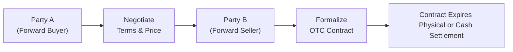

## 2.3 What Is a Forward Agreement?

Imagine sitting down in your favorite coffee shop, sipping that freshly brewed latte, and thinking, “Hmm, coffee prices might go up next season.” (I’ve totally been there, by the way.) Now, if you happen to run a café, you might be tempted to lock in the current price of coffee beans so your future costs don’t skyrocket. That’s exactly the kind of situation where something called a “forward agreement” comes into play. 

A forward agreement is a specialized, privately negotiated contract between two parties (often called counterparties). These two parties agree that, on a specific date in the future, one party will buy (and the other will sell) a set quantity of an underlying asset—think coffee beans, foreign currencies, oil, gold, or even interest rates—at a price they choose now. There’s no standardized exchange or clearinghouse stepping in the middle; it’s just you and the other side, setting the terms that suit your exact needs. 

Below, we’ll explore the essential characteristics, usages, regulatory aspects, and practical realities of forward agreements. We’ll also discuss how they differ from other derivatives (such as futures) and why they carry unique risks.

---

### Key Characteristics of Forward Agreements

One of the first things you’ll notice with forward agreements is their flexibility. Because they’re traded over the counter (OTC), you get to customize quite a few parameters:

• The maturity date: You can pick a specific date that aligns with your cash flow or operational timeline.  
• Quantity: There’s no minimum size or standardized contract. You decide how many units you need—maybe you want 50,000 pounds of coffee beans, or you want exposure to 1.2 million euros.  
• Price: The “forward price” is what you negotiate initially. You will—as a buyer—purchase the asset at this forward price on the contract expiry, and the seller agrees to deliver or settle at that price.  
• Delivery location (for commodities): If you’re dealing in physical goods, you decide where and when the delivery happens. No universal warehouse rules or standardized process to follow.  
• Settlement type: The parties have the choice between physical settlement (you physically deliver the coffee beans, or barrels of oil, or bushels of wheat, or what have you) or cash settlement (you simply exchange the difference between the agreed-upon price and the actual market price at expiration).

In short, a forward agreement is a tailor-made solution that suits your (and your counterparty’s) exact needs.

#### A Quick Mermaid Diagram to Illustrate

• A: The buyer who wants to lock in a price.  
• B: The negotiation process (price, quantity, date, etc.).  
• C: The seller providing the asset or financial instrument.  
• D: The forward agreement, often documented under an ISDA Master Agreement.  
• E: Settlement at expiration, physically or via payment of net differences.

---

### Physical Settlement vs. Cash Settlement

Before I ever got into finance, I thought “delivery” of a commodity always meant, well, a truck delivering the physical stuff to your door. In reality, many people prefer to avoid the logistics of shipping barrels of oil or storing sacks of coffee. Cash settlement is often the simpler approach: At contract expiry, the party on the losing side of the price move pays the other side the difference between the forward price and the actual market price. Meanwhile, physical settlement is exactly what it sounds like—if the forward is for wheat, the actual wheat can be delivered.

• Physical Settlement:  
  - Involves the physical handover of the commodity or asset.  
  - More common in certain agricultural or energy forwards if there’s an actual need for the physical commodity.  
  - Can be logistically complex and resource-intensive.

• Cash Settlement:  
  - No physical product changes hands.  
  - Settles in cash, based on the difference between the forward price and market price at expiry.  
  - Common in currency and interest rate forwards, where no one wants crates of currency bills or the intangible concept of an “interest rate” physically delivered.

---

### Comparing Forwards and Futures

Let’s clear up a potential point of confusion. “Wait, I’ve heard about futures—isn’t a forward basically the same thing?” The short answer is: They’re quite similar in function (locking in a future price for an asset), but they differ in key areas:

| Characteristic              | Forward Agreement                                          | Futures Contract                                                    |
|-----------------------------|------------------------------------------------------------|----------------------------------------------------------------------|
| Trading Venue               | Traded Over-the-Counter (private negotiation)             | Traded on an organized exchange (e.g., Bourse de Montréal)          |
| Standardization             | Terms are fully negotiable (custom)                       | Standardized terms (quantity, delivery date, quality, etc.)         |
| Counterparty Risk           | Exposed to counterparty default risk                      | Lower risk due to clearinghouse guarantee                           |
| Mark-to-Market & Margin     | Generally, no daily margin or mark-to-market (unless negotiated) | Daily mark-to-market and margin requirements imposed by the exchange |
| Liquidity                   | Generally lower, depends on your counterparty’s capacity  | Generally higher, with an organized marketplace                     |
| Settlement                  | Physical or cash—negotiable in the contract               | Often physically deliverable but can be cash-settled (varies by market) |

Because forwards lack standardization and an exchange clearinghouse, they’re less liquid. However, their flexibility is a huge benefit for businesses and institutions that need tailor-made solutions.

---

### Hedging with Forward Agreements

• Hedgers:  
  If you’re a business with exposure to fluctuations in currency exchange rates, interest rates, or commodity prices, you might use forward agreements to lock in a stable cost or revenue. For example, a Canadian importer who sources goods from Europe can enter into a forward agreement to purchase euros at a set price. This helps ensure stable budgeting, so if the euro skyrockets in value, they’ve already secured their future euros at a lower rate.

In my own experience, I’ve seen large retail importers lock in currency exchange rates months before the actual payment is due. This helps them avoid nasty surprises if their local currency weakens. It’s a classic illustration of risk management through forward contracts.

---

### Speculating with Forward Agreements

• Speculators:  
  Now suppose you don’t actually need the underlying asset but simply want to profit from expected price movements. You might enter a forward contract as a speculator, hoping the market price at expiry will move in your favor relative to the agreed-upon forward price. Keep in mind, though, that you face the possibility of significant losses too. With no exchange-imposed margin system, your counterparty is relying on your willingness and ability to pay up if the contract goes the other way.

Speculating with forwards can be lucrative but also perilous. Because these are OTC contracts, you’d typically want to ensure your counterparty is financially robust (and that you are, too!).

---

### Counterparty Credit Risk

One of the most distinctive features of forward agreements, and arguably their biggest downside, is the potential for counterparty default (also called counterparty credit risk). Unlike in futures markets—where the clearinghouse sits in the middle and ensures trades are honored—there’s no central party guaranteeing that your counterparty will actually deliver or pay at expiry.

Because of this, forward agreements almost always involve some form of due diligence. You might want financial statements from your counterparty, credit checks, or even extra collateral to mitigate this risk. If you’re a multinational corporation, you might only do business with banks or large institutions that have strong credit profiles.

---

### Documentation: ISDA Master Agreements

Speaking of credit checks, let’s talk about documentation. The International Swaps and Derivatives Association (ISDA) has established a Master Agreement that standardizes a lot of the legal language and procedures around OTC derivatives, including forwards. (Check it out on [www.isda.org](https://www.isda.org) if you’re curious.)

The ISDA Master Agreement covers:

• Definitions: Clarifies standard terms like “Event of Default,” “Settlement,” etc.  
• Netting Provisions: Dictates how payments can be netted across multiple derivative transactions between the same parties.  
• Collateral and Margin Requirements: Explains circumstances under which either party might need to post collateral.  
• Termination Events: Outlines triggers that allow the agreement to be ended early (e.g., credit downgrade, missed payment).

---

### Regulatory and Reporting Requirements

While forward agreements are privately negotiated, they aren’t invisible to regulators. In Canada, the Canadian Securities Administrators (CSA) and the Canadian Investment Regulatory Organization (CIRO)—effective since June 1, 2023—have emphasized the importance of OTC derivatives trade reporting. Under National Instrument 94-101, for example, the authorities want transparency on who holds these contracts, how large they are, and which parties are involved, to monitor systemic risk. You can find more info at [www.ciro.ca](https://www.ciro.ca).

By requiring trade repositories and regular reporting, regulators aim to keep an eye on potential large exposures that might threaten market stability. Large financial institutions typically have entire departments dedicated to compliance in this realm, ensuring that new and existing forward agreements are reported correctly and on time.

---

### Practical Examples and Case Studies

1. Currency Hedge for an Importer:  
   - Scenario: A Canadian electronics retailer expects to pay €2 million in six months. Fearing a spike in EUR/CAD exchange rates, the retailer enters a forward agreement with a bank to buy €2 million at a rate of, say, 1.45 CAD/EUR six months from now.  
   - Outcome: No matter what happens in the FX market, they lock in that 1.45 CAD/EUR. If the euro’s market rate ends up at 1.50, they saved 0.05 per euro. If it goes down to 1.40, they lose out on a lower spot rate but have the certainty they originally wanted.

2. Commodity Hedge for a Farmer:  
   - Scenario: A Canadian wheat farmer, worried that wheat prices might drop before harvest, sells a forward contract on 20,000 bushels at a specified price.  
   - Outcome: The farmer secures a future selling price. If wheat prices tumble, the farmer is protected. If prices shoot up, the farmer has effectively foregone the chance to sell at a higher price. This is precisely how a forward acts as a hedging device.

3. Speculative Oil Forward:  
   - Scenario: A hedge fund thinks the price of oil will rise from $70 per barrel to at least $80 in three months. They enter a forward contract to buy oil at $72 per barrel in three months, hoping to flip it if actual prices go well above that.  
   - Outcome: If the spot price ends up at $85, the hedge fund can theoretically buy at $72 and deal at $85 for a $13 profit per barrel (minus costs). If the price dips to $65, the fund is stuck buying at $72—likely incurring a big loss.

---

### Collateral Arrangements

Because forward agreements might run for many months (or even years), there’s a substantial risk that the market moves significantly along the way. Some forward agreements require periodic “margin calls” or additional collateral posting if the contract’s mark-to-market value moves. This is often negotiated in a separate Credit Support Annex (CSA) that references the ISDA Master Agreement. 

But keep in mind, the arrangement is less rigid than exchange margins. You might only post collateral if certain triggers are breached, or if the value swings beyond a threshold. This is critical in keeping both parties confident that the contract remains “good.”

---

### Role of CIRO and Other Regulations

Historically, you might have heard about Canada’s Investment Industry Regulatory Organization (IIROC) or the Mutual Fund Dealers Association (MFDA). As of June 1, 2023, these have been merged into the Canadian Investment Regulatory Organization (CIRO). So, references to IIROC or MFDA are purely historical. Now, CIRO is the single, national self-regulatory organization, ensuring that investment dealers, mutual fund dealers, and marketplace integrity all follow consistent guidelines.

For forward contracts, the relevant oversight mostly concerns:

• Trade Reporting Requirements: So the regulators know your overall positions and exposures.  
• Capital and Collateral: Ensuring firms hold enough capital to honor potential losses.  
• Suitability and KYC (Know Your Client): Especially important if forward contracts are offered to smaller institutions or local businesses.

---

### Technology and Tools for Forward Agreements

You might be wondering: “Okay, but how do we model or track the actual forward price?” Modern finance folks often use Python libraries like “pandas” and “NumPy” to handle large data sets of daily price ticks, central bank rates, or yield curves. In R, packages like “quantmod” can help fetch historical data and perform analysis. If you’re simply studying or getting started, you can:

1. Pull in historical futures data (as a proxy, if forward data is limited).  
2. Use a cost-of-carry model to estimate forward prices for commodities.  
3. Use interest rate differentials to price currency forwards.  

For detailed modeling steps, you might also want to check out the Canadian Securities Institute (CSI) courses on derivatives and advanced quantitative finance. They walk you through real-world cases, calculations, and risk management frameworks that expand on what you learn in this DFOL course.

---

### Best Practices, Pitfalls, and Lessons Learned

• Best Practices:  
  - Always do credit checks on your counterparty.  
  - Document everything carefully, possibly under an ISDA Master Agreement.  
  - Decide in advance whether you want physical or cash settlement.  
  - Keep regulators in the loop according to National Instrument 94-101 or other local guidelines.

• Common Pitfalls:  
  - Overlooking liquidity needs. Because the contract is custom, you can’t easily exit unless you find someone else to take your place or your counterparty agrees to cancel or offset the contract.  
  - Underestimating credit risk. If you’re not sure whether your counterparty can pay up or deliver, you might be in for big trouble if the market moves dramatically.  
  - Neglecting collateral. You may find yourself in a major shortfall if the contract’s value swings sharply.  

• Lessons Learned:  
  - Forward agreements are powerful but can be dangerous without thorough risk management.  
  - Hedgers typically appreciate the stability these contracts bring, while speculators like the chance for big gains (and face big losses).  
  - Effective due diligence and ongoing communication are vital.

---

### Final Thoughts

Anyway, that pretty much sums up forward agreements. They’re the building blocks of many more advanced derivatives. By offering tailor-made solutions for hedging or speculation, forwards play a big role in risk management. They do, however, come with certain complexities—like counterparty credit risk, less liquidity, and heavier contractual obligations than exchange-traded futures. 

From the vantage point of the Canadian regulatory environment, always remember to keep track of potential obligations under CIRO guidelines and relevant CSA rules. If you’re new to this space, exploring open-source financial analysis packages and official resources is a great way to build your practical skills. Ultimately, forward agreements might be “behind the scenes,” but they drive a significant portion of global trade and finance, from that latte in your hand to multinational business deals.

---

#### Glossary

• **Physical Settlement:** Actual delivery of the underlying commodity or asset.  
• **Cash Settlement:** Settlement by exchanging the net amount between contract price and market price, rather than the underlying asset.  
• **ISDA Master Agreement:** A global standard legal document for OTC derivatives documentation.  
• **Counterparty:** The other side of the contract, responsible for fulfilling obligations.  
• **Due Diligence:** Investigations and analyses (often including credit checks) to ensure the counterparty is trustworthy.

---

#### References and Further Reading

• [CIRO](https://www.ciro.ca/) – Canada’s new national self-regulatory organization for investment dealers, mutual fund dealers, and market integrity.  
• [CSA Staff Notice on OTC Derivatives Trade Reporting, National Instrument 94-101](https://www.securities-administrators.ca/) – For the latest guidelines on reporting obligations.  
• [ISDA](https://www.isda.org) – Templates and standard documentation for derivative contracts.  
• Canadian Securities Institute (CSI) – Offers structured courses on derivatives, including scrupulous coverage of forwards and related risk management.  
• Python Libraries: “pandas,” “NumPy,” “quantmod.”  
• Various academic and professional finance texts covering advanced derivatives (e.g., John Hull’s “Options, Futures, and Other Derivatives”).  

---

## Sample Exam Questions: Mastering Forward Agreements



### Which of the following best describes a forward agreement?

- [ ] A standard contract traded on an exchange with daily margining.
- [x] A private, customized contract between two parties to buy or sell an asset at a specified price in the future.
- [ ] A contract guaranteed by a clearinghouse, eliminating counterparty risk.
- [ ] A perpetual contract with no expiration date.

> **Explanation:** A forward agreement is a privately negotiated contract with no clearinghouse involvement, allowing for custom terms but also introducing counterparty credit risk.

### Which statement about settlement of a forward contract is correct?

- [ ] All forward contracts must be physically settled.
- [x] A forward can be settled physically or through a cash payment.
- [ ] Forwards are always settled by delivery of the underlying asset in a central warehouse.
- [ ] Forward contracts cannot specify settlement terms in advance.

> **Explanation:** Parties to a forward contract can decide between physical or cash settlement during the negotiation process.

### What is the primary regulatory concern associated with OTC forward contracts?

- [ ] Margin calls being too frequent.
- [x] The absence of a central clearinghouse and the resulting counterparty risk.
- [ ] Overly complicated rules for daily mark-to-market.
- [ ] Mandatory physical delivery of the underlying commodity.

> **Explanation:** In OTC markets like forwards, there is no intermediary guaranteeing performance, so counterparty risk is a major regulatory concern.  

### Under the ISDA Master Agreement, parties typically address:

- [ ] Exchange governance and daily margining rules.
- [ ] The standardization of contract sizes and delivery locations.
- [x] Definitions, termination events, and collateral requirements related to OTC transactions.
- [ ] The technology platforms that handle trade matching.

> **Explanation:** The ISDA Master Agreement provides a framework for OTC derivatives, including netting, termination, and collateral provisions—but not exchange-based trading rules.

### Which best explains the difference between a forward and a futures contract?

- [x] Forwards are OTC contracts with customized terms, whereas futures are exchange-traded with standardized terms.
- [ ] Forwards carry virtually no counterparty risk, while futures do.
- [ ] Only futures contracts can be used for hedging.
- [ ] Forwards are only used for financial assets, while futures are only for commodities.

> **Explanation:** The big distinction is that futures are standardized and exchange-traded with clearinghouse guarantees, whereas forwards are customized OTC contracts.

### Why might a Canadian importer use a forward agreement?

- [ ] To guarantee daily mark-to-market gains.
- [x] To lock in an exchange rate for a future payment, protecting against currency fluctuations.
- [ ] To speculate on falling interest rates.
- [ ] To easily exit the position through an active secondary market.

> **Explanation:** By using a forward contract, an importer can lock in a foreign currency’s price in CAD, reducing the uncertainty of currency volatility.

### What does it mean when a forward contract has a “cash settlement” feature?

- [x] Neither party physically receives the underlying asset; they settle the difference in cash based on market price vs. contract price.
- [ ] The parties are required to settle daily losses or gains.
- [ ] The underlying asset is delivered to a central exchange, then sold for cash.
- [ ] They must provide the actual asset but can also provide a small cash collateral.

> **Explanation:** With “cash settlement,” the only exchange at contract expiry is a payment matching the difference between the agreed forward price and the market price at maturity.

### Which of the following is true regarding counterparty default in a forward agreement?

- [ ] It’s impossible, because the clearinghouse always steps in.
- [ ] It’s irrelevant to parties who don’t plan to hold a contract until maturity.
- [x] It is a significant risk, as there is no central guarantor in OTC transactions.
- [ ] It only applies if the underlying asset is a currency.

> **Explanation:** In a forward contract, both parties depend on each other’s ability to perform; there is no exchange or clearinghouse backing.

### In Canada, which regulatory body currently oversees investment dealers and ensures compliance for OTC derivatives reporting?

- [ ] US Commodity Futures Trading Commission (CFTC)
- [x] Canadian Investment Regulatory Organization (CIRO)
- [ ] Mutual Fund Dealers Association (MFDA)
- [ ] Investment Industry Regulatory Organization of Canada (IIROC)

> **Explanation:** As of June 1, 2023, IIROC and the MFDA amalgamated into CIRO, which is responsible for overseeing derivatives regulations among other responsibilities.

### True or False: Forward contracts are always standardized, exchange-traded products.

- [ ] True
- [x] False

> **Explanation:** By definition, forward contracts are OTC derivatives with no standard exchange-related specifications.


