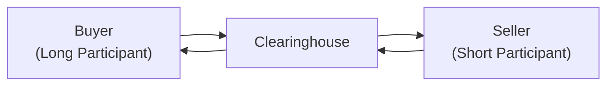
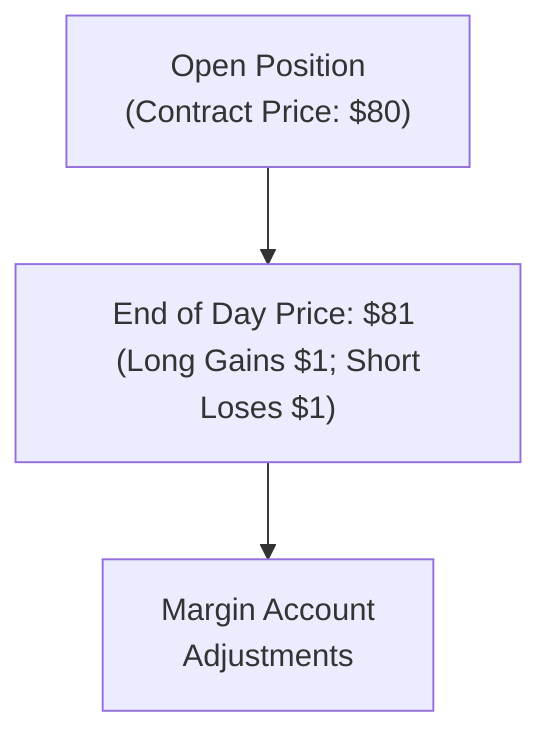

## 2.4 What Is a Futures Contract?

Introduction  
Have you ever found yourself wanting to lock in a price for something—like, say, a big purchase? Maybe you were worried that prices might go up by the time you actually needed to buy. Futures contracts do exactly that but in a high-powered financial environment. They let you buy or sell a specified amount of an underlying asset (like wheat, oil, bonds, or even an equity index) at a later date, and at a price you agree upon today. That’s the essence. But let me share a quick anecdote first: I remember the first time I dove into the futures market, I was terrified of missing some critical detail—like forgetting to deposit enough margin or not understanding the daily settlement process. Huh, well, I’m still here, so it ended up all right. But I did learn that a rock-solid grasp of the mechanics makes all the difference.

Key Characteristics of a Futures Contract  
Futures contracts are standardized agreements between buyers (long positions) and sellers (short positions). The underlying asset, contract size, and expiration date are all predefined by the exchange, which means that every futures contract on a particular asset has the same specifications. It’s kind of like buying a standardized pack of gum at the store: you always know it contains exactly the same number of sticks. In futures-speak, you know exactly how many barrels of oil or bushels of wheat or how many units of an index each contract represents.

Standardization also translates into higher liquidity, because participants aren’t haggling over the contract’s finer points—they only debate price. The Bourse de Montréal (Montréal Exchange), for instance, lists futures on equity indices and interest rate instruments. By having standardized contracts, the exchange makes it easier for more people and institutions to participate, which typically boosts trading volume and fosters tighter bid/ask spreads.

Exchange as a Facilitator  
So, how does this entire system hold together safely? The short answer is: the exchange plays matchmaker. But a matchmaker with rules. Because the contracts are hosted on the exchange, all trade details—from the specific quantity to the settlement date—are locked in from the start. Traders just place orders (buy or sell), and the exchange’s electronic order-matching system pairs them up.

Think of it as a giant, digital marketplace. Actually, let me phrase it differently: If you’ve ever visited a traditional farmers’ market, you know you can approach a table, see the price for apples, and if you like it, you buy. If you don’t like it, you can wait until the price changes or you can try a different vendor. On a futures exchange, if you don’t like the current price, you can place a limit order, which says you’re only willing to trade at or better than the price you specify. Periodically, your order might get filled if the market moves to that price.

Role of the Clearinghouse  
When you hear “futures contract,” you might wonder: “Isn’t there a risk that the other side might not pay up?” This is the big difference from forward agreements, which are negotiated privately and can carry significant counterparty risk. Futures mitigate this risk by having a clearinghouse stand in between the buyer and the seller. In Canada, for example, the Canadian Derivatives Clearing Corporation (CDCC) clears trades executed on the Bourse de Montréal. The clearinghouse ensures both sides post “margin”—essentially a security deposit—that gets adjusted every day according to market price movements. The clearinghouse is effectively the buyer to every seller and the seller to every buyer, guaranteeing contract performance.

Below is a simple mermaid diagram showing how the clearinghouse stands between buyers and sellers:

By acting as the middleman, the clearinghouse ensures that if one side fails to meet its obligations, the other side will still be made whole. This is why, if you’re trading futures, you’ll often see margin calls when the market moves against your position. It’s the clearinghouse saying, “Hey, friend, your position lost value today, and we need more margin to keep the trade stable.”

Marking-to-Market Process  
What do we mean by “the market moves against your position”? That’s where marking-to-market comes in. In the futures world, there’s a daily settlement of gains and losses. If you’re on the long side of a futures contract for oil at, say, $80 a barrel, and the price creeps up to $81 by the day’s close, you effectively gain $1 per barrel that day. That gain is credited to your margin account. Meanwhile, the short side of that contract is debited that same amount. The next day, the contract is basically revalued at $81 for the daily settlement. That revaluation is the marking-to-market process.

The clearinghouse uses this process to keep everyone honest—and to keep the margin accounts topped up, so no participant is drastically underwater. If losses exceed your posted margin, you have to add more funds to your account, or the clearinghouse (or your broker, on behalf of the clearinghouse) can close out your position to protect itself.

Here’s a basic illustration:

Every time the market moves, the difference between your agreed-upon contract price and the daily settlement price is recognized as an immediate profit or loss. It’s like reconciling a daily ledger, ensuring no giant deficits build up to the point where a participant might vanish with huge debts.

Underlying Assets for Futures in Canada  
In Canada, some of the most actively traded futures contracts cover:  
• Energy (like crude oil and natural gas)  
• Agricultural products (such as canola, wheat, or corn)  
• Government bonds (like the 10-year Canadian government bond)  
• Equity indices (most commonly, the S&P/TSX 60 Index)  
• Interest rate derivatives  
If you hop over to the Montréal Exchange website (www.m-x.ca), you’ll see the specs for a wide range of products. Each product’s spec page tells you the contract size, tick size, trading hours, last trading day, and any special settlement instructions.

Difference from Forwards  
When we talk about futures, it’s easy to see them as more formal versions of forward agreements. A forward is a private agreement to buy or sell an asset at a future date, but forwards don’t usually have daily marking-to-market, and there’s no clearinghouse guaranteeing the trade. That means forward participants face counterparty risk: if the entity on the other side of your trade goes bankrupt or cheats, you might be stuck. Futures solve this by standardizing everything and employing that clearinghouse middle layer.

Now, you might be thinking: “So, do I need to keep track of all those daily movements for a forward?” Usually, no, because forwards settle at maturity, not on a daily basis. Also, forwards can be custom-tailored, which is great if you have specialized needs. Futures, however, are more about standardization and easy access to liquidity.

Who Trades Futures?  
Futures markets bring together a wide range of participants:  
• Hedgers, who aim to mitigate risk. For instance, a farmer might sell wheat futures to lock in a guaranteed price for an upcoming harvest.  
• Speculators, who try to profit from price moves. They often have no underlying exposure to the commodity; they’re just betting on which way they think the price will go.  
• Arbitrageurs, who exploit price discrepancies between markets (like the cash market and the futures market) or between different exchanges.  

Hedgers often find comfort in knowing they can offset potential losses on their physical holdings (e.g., storehouses full of wheat) by taking an opposite position in the futures market. Speculators, on the other hand, typically don’t want the physical asset—they’re in it for potential short-term gains. If the price movement goes the wrong way, though, they can face losses. Because futures provide leverage, even a small price movement can cause big percentage wins or losses relative to your margin deposit.

Regulatory Landscape and CIRO  
Futures trading in Canada falls under the watchful eye of several bodies, including provincial securities regulators and the Canadian Investment Regulatory Organization (CIRO). The old IIROC and MFDA are now merged into CIRO, which monitors how firms deal with clients and enforces market integrity rules. For margin guidelines, reporting requirements, and general compliance standards, industry professionals look to CIRO for direction. CIRO ensures that dealers handle the complexities of futures trading responsibly, from advising clients about the potential risks to making sure all margin calls are properly handled.

Montreal Exchange (Bourse de Montréal)  
The Montréal Exchange is Canada’s premier derivatives exchange. It’s the place you’d go—figuratively speaking—to trade Canadian equity index futures or interest rate futures. They’ve got robust electronic trading platforms, and they publish contract specifications systematically. Participants can find important details there, such as contract multiplier, tick size, notional value, and monthly or quarterly settlement cycles. The exchange has a close relationship with the CDCC, ensuring trades get cleared quickly and reliably.

Open interest (the total number of outstanding contracts that have not been closed out) at the Montréal Exchange can be a useful indicator of liquidity. Typically, higher open interest signals that a contract is more liquid, making it easier to enter and exit positions without dramatically affecting the market price. While the liquidity might not rival, say, the CME Group for certain products, the Montréal Exchange remains the key hub for Canada-focused contracts.

Practical Example: Equity Index Futures  
A straightforward example is trading equity index futures. Imagine you think the S&P/TSX 60 Index is going to climb over the next three months. Instead of buying a basket of 60 stocks, you might buy one S&P/TSX 60 Index futures contract. If the index goes up, the value of your futures contract will (hopefully) rise. If the index goes down, though, you’ll see losses. And remember, because you’re using margin, those losses are realized daily, and you might get margin calls if the market moves against you too sharply.

Best Practices and Common Pitfalls  
One best practice is to maintain an appropriate margin buffer. Even if an exchange sets a certain initial margin requirement, it’s wise to keep a bit of extra capital in your trading account so you don’t face immediate liquidation if the market sees a short-lived spike in volatility. Also, stay aware of contract specifications: not all futures have the same tick size or settlement method (some are cash-settled, others are physically delivered). If you accidentally hold a physically settled contract into expiration without intending to do so, you could end up having to deliver commodities (like 1,000 barrels of oil!). And that is definitely not a fun surprise if you were purely speculating on prices.

Futures in Portfolio Construction  
A lesser-known angle is that many portfolio managers use futures to replicate or hedge exposures quickly. If you manage a big equity portfolio and feel the market might dip 5% over the next month, you might sell equity index futures as a hedge. That’s faster than dumping your entire basket of individual stocks. Once you believe the danger has passed, you can just buy back those futures.

Because of the leverage in futures, this approach is capital-efficient: you don’t have to devote the entire notional amount of the portfolio to the hedge—just enough margin for your short index futures position. The regulatory guidelines from CIRO clarify how such strategies need to be disclosed and how margin requirements must be calculated to reflect the hedged or unhedged status of positions.

Real-World Challenges  
Anyway, not everything is sunshine and roses. One major challenge that crops up is something called “rolling” your futures position. Each futures contract has an expiration date. If you wish to maintain the position beyond that date, you have to close the expiring contract and open a new one for the next month or quarter. That transition can involve “roll costs,” which are the difference between the outgoing contract’s price and the incoming contract’s price.

Another challenge: if you’re hedging commodities like crude oil or natural gas, you might face a “contango” situation (where the futures price is higher than the spot price) or “backwardation” (where the futures price is lower than the spot price), which affects the cost and effectiveness of your hedge. Contango can eat into your returns when you repeatedly roll futures positions in a long position, while backwardation can sometimes enhance returns—assuming you’re rolling long positions onward.

Glossary  
• Standardization: The process by which exchange-traded contracts have uniform features—like contract size, settlement, and delivery months—so traders don’t waste time customizing terms.  
• Clearinghouse: The entity guaranteeing contract performance by acting as the buyer for every seller and the seller for every buyer. It demands margin from both sides to control credit risk.  
• Marking-to-Market: The daily recalculation of each futures contract’s value, resulting in daily gains or losses for all participants.  
• Equity Index Futures: Contracts based on an index (e.g., S&P/TSX 60). Traders settle these in cash rather than through physical delivery of every stock in that index.  
• Bond Futures: Contracts that represent a notional amount of government bonds. Some are cash-settled, while others require physical delivery of specific bonds.

Official Canadian Resources and Additional Reading  
• Montréal Exchange (www.m-x.ca): Up-to-date contract specifications, market data, and regulatory guidelines.  
• CIRO (https://www.ciro.ca): Margin requirements documentation, reporting rules, and compliance standards for investment dealers. (CIRO is the successor to the now defunct IIROC and MFDA.)  
• CME Group (www.cmegroup.com): Best practices and educational resources for global futures trading, with an enormous range of products like interest rates, equity indexes, energy, and agricultural commodities.  
• “Futures and Options Markets” by Colin A. Carter: A deep academic dive into the mechanics of futures markets, hedging methods, and risk management techniques.

Wrap-Up  
Futures contracts are a staple in modern finance—used by everyone from a small-time grain farmer looking for stable revenues to multi-billion-dollar hedge funds chasing returns. The combination of standardization, exchange listing, clearinghouse support, and daily marking-to-market provides a structure that drastically reduces credit risk and increases liquidity compared to privately negotiated forward contracts. If you’re just getting started in derivatives, it can be a little intimidating at first. But trust me, once you see how it all works, futures open up a world of possibility for hedging, speculation, and portfolio diversification. When used properly, they can be a powerful tool in your financial toolkit.

---

## Sample Exam Questions: Understanding Futures Contracts and Their Mechanics



### Which of the following is true about a futures contract compared to a forward contract?

- [ ] It involves direct counterparty risk since it's not cleared.
- [x] It is standardized and cleared through a clearinghouse.
- [ ] It does not require margin.
- [ ] It does not have any daily settlements.

> **Explanation:** Futures contracts are exchange-traded, standardized, and cleared through a clearinghouse, unlike forwards, which are private agreements without standardized terms or daily settlement requirements.

### Which entity stands as the intermediary in a futures trade, ensuring both sides meet their obligations?

- [ ] The local broker
- [ ] The exchange floor manager
- [ ] The Government of Canada
- [x] The clearinghouse

> **Explanation:** The clearinghouse is the center of a futures market, interposing itself between buyers and sellers to mitigate counterparty risk.

### What is marking-to-market in the context of futures?

- [ ] The broker removing a client’s margin due to non-compliance
- [x] Daily recalculation and settlement of gains and losses based on the closing price
- [ ] Setting interest rates each morning for margin accounts
- [ ] Reconciling trades at the final contract expiration only

> **Explanation:** Marking-to-market is the process whereby gains or losses are settled daily according to that day’s closing price, ensuring margin accounts are continually updated.

### If you expect the price of an underlying asset to fall, which futures position would you likely take?

- [ ] Long futures
- [x] Short futures
- [ ] Long straddle
- [ ] Choice of either long or short futures is irrelevant

> **Explanation:** A short futures position profits if the underlying price falls.

### Which futures contract feature is determined by the exchange rather than by the buyer and seller?

- [x] Quantity and quality of the underlying asset
- [ ] The exact price at which the contract trades
- [ ] Frequency of marking-to-market
- [ ] Maximum exposure for any participant

> **Explanation:** Exchanges set standardized contract terms, including the quantity, quality, and delivery months. Pricing is determined by supply and demand in the market.

### Why do hedgers often use futures?

- [ ] To avoid paying any commissions
- [x] To lock in a future price and mitigate potential adverse price movements
- [ ] To make quick profits from tiny price fluctuations
- [ ] To speculate on the currency exchange rate alone

> **Explanation:** Hedgers typically want to reduce the risk of price volatility by securing a known purchase or sale price via a futures contract.

### In Canada, who dictates margin guidelines and oversees regulated firms offering futures?

- [ ] IIROC, as of 2025
- [ ] MFDA, definitely in charge of futures
- [x] CIRO
- [ ] CIPF

> **Explanation:** With the MFDA and IIROC merged, the Canadian Investment Regulatory Organization (CIRO) is now responsible for setting and enforcing margin rules and other compliance standards.

### What might happen if you hold a physically delivered futures contract until expiration without intending to do so?

- [x] You may be required to deliver (or receive) the actual commodity
- [ ] Nothing—you can always bail out at no cost
- [ ] The contract automatically rolls over
- [ ] Only the financial difference in price is settled, never the actual commodity

> **Explanation:** While some futures are cash-settled, physically settled contracts oblige the holder to deliver or receive the physical commodity if the position isn’t closed before expiration.

### What is open interest in futures markets?

- [ ] The difference between interest rates used in marking-to-market
- [ ] The daily settlement price
- [ ] The maximum allowable margin on a position
- [x] The total number of outstanding contracts that haven’t been closed or delivered

> **Explanation:** Open interest is the count of all open (not offset or exercised) futures contracts. It’s a common measure of market liquidity and participation.

### True or False: Speculators never provide any value to the futures market aside from seeking profit.

- [ ] True
- [x] False

> **Explanation:** Speculators add liquidity to the market, effectively allowing hedgers to enter or exit their positions with ease. They also help in price discovery by continuously trading based on expectations of future price movements.


