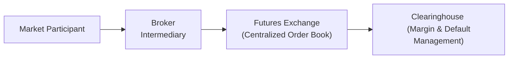

## 2.5 Organized Futures Markets

Organized futures markets are the bustling epicenter of standardized futures trading. If you’ve ever pictured a busy trading floor with rows of glowing monitors and people shouting prices at each other, well, that used to be the main scene. Nowadays, it’s much more electronic, but it’s still pretty high energy. Organized futures markets provide a centralized place—or exchange—where traders and investors can buy and sell standardized futures contracts under strict rules and watchful regulatory oversight. This structure is crucial to ensuring fairness, liquidity, and robust risk management for all involved. Let’s explore the ins and outs of these markets and why they matter.

### Overview

I remember my first visit to an organized futures exchange—it was the Bourse de Montréal in Canada. I showed up expecting a scene straight out of old movies: folks shouting “Buy! Sell!” and waving their arms. Instead, I saw rows of computers, each plugged into sophisticated trading systems. Yet, the energy was still intense. Traders were constantly reacting to price updates, economic news, and each other’s moves. Even if those open-outcry pits are mostly replaced by digital order matching, the essence of an organized futures market remains the same: to provide a centralized, regulated environment where trades can be made efficiently and confidently.

Organized futures markets create a transparent framework for trading. Prices of futures contracts—whether they’re tied to oil, wheat, interest rates, or stock market indices—are disseminated to everyone. This fosters a dynamic price-discovery process, meaning the market collectively decides prices based on supply and demand. Also, since these markets run according to standardized rules, participants generally know what to expect and how to manage their positions.

### Key Features of Organized Futures Markets

Centralized futures exchanges come with certain hallmark qualities. You will often see them spread across categories such as commodities, equities, interest rates, or foreign exchange futures. But no matter which underlying asset you’re trading, the organizational principles are typically the same.

• Fairness and Transparency: Everything is out in the open. Prices, volumes, and order flows are typically visible in real time, which is part of what we call the “centralized order book.” This helps participants see where the market stands, what current bid and ask prices look like, and how many contracts are changing hands.

• Standardized Contracts: Each futures contract has pre-set details, such as the quantity of the underlying asset, the delivery date, and the quality (where relevant, like in agricultural commodities). Standardization is your friend because it simplifies the trading process. You don’t have to negotiate these details with the counterparty—just buy or sell the existing contract terms.

• Clearinghouse Guarantee: One of the big things that gives participants peace of mind is that each exchange typically works with a clearinghouse, or is connected to one. The clearinghouse effectively becomes the buyer to every seller and the seller to every buyer, guaranteeing contract performance (subject to margin and other risk management protocols).

• Liquidity and Price Discovery: In well-established futures markets, you’re rarely “alone” in your trade. Thanks to deep liquidity—lots of buyers and sellers—orders can usually be filled at competitive prices. This environment shapes the price-discovery process. If you think the price is too high, you can place a lower bid, effectively testing whether other traders agree. If enough participants do, the overall market price might move lower. And the opposite is just as true if you think the price is too low.

• Regulatory Oversight: In Canada, CIRO—formed from the historical combination of the Mutual Fund Dealers Association of Canada and the Investment Industry Regulatory Organization of Canada—regulates the integrity of these markets along with local securities commissions. Over in the U.S., you have the Commodity Futures Trading Commission (CFTC). Each market region has its own regulatory structure, but the aim is consistent globally: to keep the markets fair, transparent, and efficient.

### The Clearinghouse

Picture the clearinghouse as a giant safety net beneath the trading floor. It stands between the buyer and seller of each futures contract, guaranteeing the transaction if both parties post enough collateral (aka margin). If one party defaults or fails to meet its margin obligations, the clearinghouse steps in.

I’ve seen a clearinghouse in action (virtually, at least) when large, quick market moves occurred, and certain traders got margin calls. If a participant’s account equity fell below a threshold, the clearinghouse mandated more funds be deposited immediately to keep the position afloat. Otherwise, the position would be closed out. This process, called marking-to-market, ensures that any gains or losses in a futures position are reflected on a daily (or sometimes intraday) basis, so no one’s losses become unmanageable. The clearinghouse is also the entity that ensures offsetting trades actually “cancel out” your original position when you want to close it.

### The Standardization of Contracts

A fundamental aspect of organized futures markets is the template-like nature of each contract. If you’re trading crude oil futures on the Chicago Mercantile Exchange (CME), the contract might specify 1,000 barrels of West Texas Intermediate (WTI) crude oil for a particular month. No haggling is needed on those details. This not only speeds up the trading process but also makes it simpler to create, maintain, and offset positions.

The Bourse de Montréal, for instance, offers contracts on Canadian interest rates, equity indices, and even certain energy products in partnership with other exchanges. Each one has an official specification that details everything from the tick size (the minimum price increment) to the last trading day for each contract month. Because of this standardization, if you open a long position in a futures contract today, you can close it (or offset it) by taking the exact opposite position tomorrow in the same contract, with no confusion about the terms.

### Price Discovery in Centralized Order Books

If you’ve ever tried to sell an item online, you know how crucial it is to see what other people are charging so you can set a fair price. Organized futures markets do something similar, but at lightning speed and with endless streams of data. The centralized order book is where all buy (bid) and sell (ask) orders congregate. Traders can see the best bid and best ask, and in many cases, they also see the depth of market—how many contracts are being bid for or offered at various price levels.

This continuous interplay of bids and offers drives the short-term price. Macroeconomic news, changes in global events, or even something as straightforward as a large institution rolling over a big position from one contract month to the next can shift that supply-demand balance and thus the futures price. Exchanges provide real-time updates, so participants always know where prices stand and can respond to new developments.

### Oversight by CIRO

Within Canada, the Canadian Investment Regulatory Organization (CIRO) supervises investment dealers, mutual fund dealers, and the market integrity side of the equity and debt marketplaces. That includes oversight of derivatives exchanges like the Bourse de Montréal. CIRO’s role is to ensure that trading practices follow guidelines designed to protect investors and keep markets transparent.

Historically, the Investment Industry Regulatory Organization of Canada (IIROC) and the Mutual Fund Dealers Association of Canada (MFDA) were separate. In 2023, they merged to form CIRO. Now, CIRO bulletins will refer to consolidated rules and frameworks that used to be handled by IIROC and the MFDA individually. For official updates and regulations, you can visit [https://www.ciro.ca](https://www.ciro.ca). The Bourse de Montréal also publishes its own rules and guidelines at [www.m-x.ca/rules](https://www.m-x.ca/rules).

What does all this mean for you? In a nutshell, you have a regulatory body that sets the standards, monitors market activity, and enforces compliance. From a trader’s perspective, that’s comforting because you know someone’s got your back if any shady practices arise.

### Real-World Scenarios and Case Studies

Organized futures markets span the globe, with major hubs including:

• Bourse de Montréal (Canada): Known for equity and interest rate derivatives, among others.  
• Chicago Mercantile Exchange (U.S.): Trades a vast array of futures—from agricultural commodities to stock indices and interest rates.  
• Intercontinental Exchange (U.S. and Europe): Offers energy futures, financial futures, and more.  

Let’s share a couple quick examples:  

• Interest Rate Futures on the Bourse de Montréal: Perhaps you’re a Canadian bank worried about potential increases in interest rates. You can lock in the current rate environment by entering into a short position on a three-month Canadian Bankers’ Acceptance futures contract. If rates do indeed rise, your short position on futures may become profitable, offsetting the higher funding costs you face in real life.

• Agricultural Futures on the CME: Let’s say you’re a soybean farmer in Manitoba. You’re concerned that prices for soybeans might go down by the time harvest arrives. So, you sell soybean futures on the CME well ahead of harvest. If prices do drop, you lock in a decent price for your crop. And if prices go up, that’s okay because you’ll earn more from selling your physical crop.

In both cases, the organized futures market served as a place for risk management, price discovery, and transferring risk from one party to another.

### Additional Tools and References

There’s a wealth of resources and tools out there to sharpen your understanding of futures markets:

• CIRO Bulletins: Valuable updates on market regulation, participant eligibility, and compliance can be found at [https://www.ciro.ca](https://www.ciro.ca).  
• Montréal Exchange Rules & Guidelines: Current margin tables, position limits, and other essential info at [www.m-x.ca/rules](https://www.m-x.ca/rules).  
• Historical Data from FINCAD: Market analysis and quantitative tools are available at [www.fincad.com](https://www.fincad.com).  
• CME Institute Courses: Free online modules on futures and options market structure at [institute.cmegroup.com](https://institute.cmegroup.com).

If you’re still learning the ropes, these references are a great place to dig deeper. Many of these sites also offer demo accounts, simulation tools, or short educational videos that make the learning process a bit more fun.

### Practical Examples: Offsetting a Futures Position

Let’s make it even more tangible. Suppose you buy five futures contracts on gold. A week later, you realize that your forecast (gold would rise) maybe was off because the latest economic data suggests inflation might be stabilizing. You decide to exit your position. You simply place an order to sell the same futures contract—in the same month—at the current market price. That’s your offsetting trade. The net effect is that your original long position in five contracts is canceled by your short position in five contracts.

If the sale occurs at a higher price, you’ve made a profit. If it’s lower, you’ve taken a loss. Either way, your position is now flat. That’s the beauty of standardization: you don’t need to find the same person who sold you the contract. The exchange’s clearinghouse ensures that your offsetting trade closes the open position in your account.

### Personal Reflections and Tips

I’ve found that one of the most attractive features of an organized futures market is the combination of transparency and liquidity. If you want to buy or sell a contract, you can usually do so quickly and see exactly how the price is set. Plus, there’s something sort of comforting about seeing all the rules spelled out ahead of time. It’s unlike some over-the-counter transactions where “negotiation” can feel like a black box.

Of course, it’s not entirely hassle-free. You need to manage your margin requirements carefully—otherwise, you could end up with a margin call at the worst possible time. Also, while the clearinghouse offers a big safety advantage, it’s not magical. Extreme market events can still lead to abrupt price moves and potential losses. That’s why risk management is so central to futures trading, probably even more so than in trading simpler instruments like equities. If you’re brand new, maybe watch the markets for a bit before diving in, or practice in a simulated environment. But once you get the hang of it, organized futures markets provide powerful tools for hedging risks or speculating on price movements.

### Mermaid Diagram: Futures Market Flow

Below is a simplified visual to show how trades flow within an organized futures exchange. It’s not 100% reflective of every nuance (because real-life trading can be more complex), but it gives you a basic idea:

• Market Participant: This could be an individual trader, a corporation, or a financial institution.  
• Broker Intermediary: Often used by participants for trade execution if they’re not connected directly to the exchange.  
• Futures Exchange: Facilitates matching of buy and sell orders.  
• Clearinghouse: Guarantees the trades, collects margins, and marks positions to market daily.

### Glossary

Exchange: An organized marketplace where standardized contracts are transacted.  
Centralized Order Book: A matching system that consolidates all buy and sell orders in one place, ensuring open and transparent price discovery.  
Price Discovery: The process by which market prices are established based on supply and demand among all participants.  
Offset: Closing out a futures position by taking the opposite position in the same contract.  
Market Regulation: Oversight that enforces orderly market function and participant compliance, often through bodies like CIRO.

---

## Sample Exam Questions: Organized Futures Markets



### Organized futures markets primarily provide which key feature?

- [x] A centralized and standardized trading environment for futures contracts
- [ ] A decentralized approach to contract negotiations
- [ ] An unregulated platform to trade any customized financial instrument
- [ ] Exclusive privileges only for select large institutions

> **Explanation:** Organized futures markets offer a centralized forum with standardized rules and contracts, ensuring transparency, liquidity, and fairness.

### Which entity typically acts as the buyer to every seller and seller to every buyer in an organized futures exchange?

- [ ] The Exchange’s Board of Directors
- [x] The Clearinghouse
- [ ] The Federal Government
- [ ] A Principal Broker

> **Explanation:** The clearinghouse guarantees and manages all trades, thereby reducing counterparty risk and ensuring smooth settlement.

### Why is standardization of the contract terms so important in organized futures markets?

- [x] It simplifies trading and promotes liquidity by removing the need to negotiate details
- [ ] It allows brokers to charge additional fees for customizing contracts
- [ ] It guarantees that all contracts will expire at the same price
- [ ] It offers participants unlimited margin capabilities

> **Explanation:** Standardization streamlines the trading process, enabling buyers and sellers to easily offset and close positions without re-negotiating details.

### In Canada, which organization oversees the regulation of derivatives exchanges such as the Bourse de Montréal?

- [ ] The MFDA (Mutual Fund Dealers Association)
- [x] CIRO (Canadian Investment Regulatory Organization)
- [ ] The SEC (Securities and Exchange Commission)
- [ ] The CFTC (Commodity Futures Trading Commission)

> **Explanation:** In 2023, IIROC and the MFDA were combined to form CIRO, the new national self-regulatory body in Canada.

### What is one main advantage of a centralized order book in an organized futures exchange?

- [x] Real-time transparency of bids and offers
- [ ] Zero transaction costs at all times
- [ ] Trading is open only to large institutions
- [ ] Guaranteed unlimited leverage

> **Explanation:** Centralized order books provide clear visibility into real-time supply and demand, facilitating accurate price discovery.

### If you want to close out a long position in a standardized futures contract, you would typically:

- [x] Enter a short position in the same contract
- [ ] Wait for the contract to expire and receive the physical commodity
- [ ] Request the exchange to nullify the contract
- [ ] Notify the clearinghouse that you are “done”

> **Explanation:** Offsetting a position generally involves taking the opposite (equal and opposite) position in the exact same contract month.

### Which best describes the “price discovery” function in futures markets?

- [x] The dynamic process where market prices are determined by supply and demand
- [ ] A regulated method of setting fixed contract rates
- [ ] An automated system guaranteeing profit for all traders
- [ ] A hidden activity exclusive to big banks

> **Explanation:** Price discovery is the market-driven process of establishing a traded price based on all participants’ information and orders.

### How does a clearinghouse manage the risk of large unexpected price movements?

- [ ] It guarantees all participants a 100% profit
- [x] It requires traders to post initial and variation margins, adjusted through daily marking-to-market
- [ ] It forbids large positions from being taken
- [ ] It invests in the underlying commodity to stabilize prices

> **Explanation:** By marking positions to market daily and collecting margins, the clearinghouse limits potential default risk from sudden price fluctuations.

### Which of the following is an accurate example of how a farmer might use futures markets?

- [x] A soybean farmer selling futures to lock in a price for their crop
- [ ] A farmer offering heavily customized forward contracts on a personal website
- [ ] A farmer trading only interest rate futures
- [ ] A farmer speculating on foreign currency futures with no business rationale

> **Explanation:** Farmers often sell commodity futures to hedge against future price declines for their crops, thus locking in a predictable revenue.

### True or False: Organized futures markets are unregulated, allowing participants complete freedom without oversight.

- [ ] True
- [x] False

> **Explanation:** Markets such as the Bourse de Montréal or the CME are subject to strict oversight by regulatory bodies like CIRO (in Canada) or the CFTC (in the United States).


