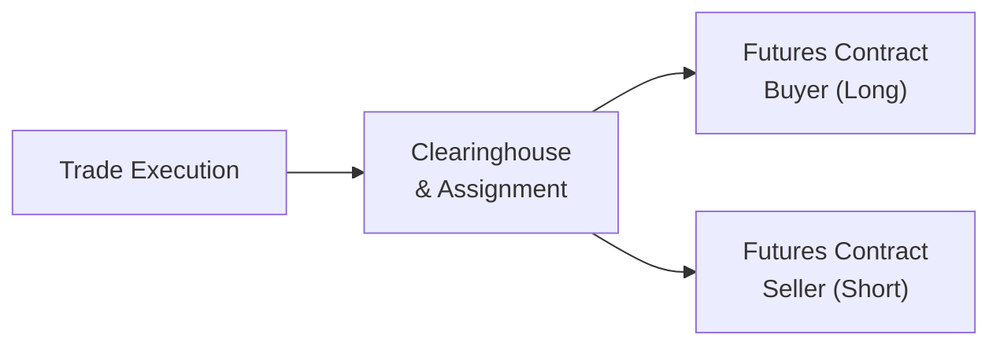

## 2.6 Buying and Selling a Futures Contract

Buying or selling a futures contract might sound like a mysterious process to those jumping into derivatives for the first time. Honestly, I remember feeling like I was stepping into a secret club when I placed my very first futures trade—my palms were sweaty as I clicked “Submit.” But once you know how the ecosystem works, it becomes second nature. This section demystifies the essentials of buying and selling futures contracts under Canadian rules and provides real-life scenarios, best practices, and references for deeper learning.

---

### Opening a Futures Trading Account

Under Canadian Investment Regulatory Organization (CIRO) guidelines, prospective futures traders must have an account specifically approved for futures trading. While some individuals set up direct “professional” relationships with a brokerage or exchange participant, the more common path for retail investors is through a registered broker-dealer platform (e.g., Questrade, Interactive Brokers Canada). These brokers typically require you to:

• Complete a futures trading application.  
• Satisfy Know-Your-Client (KYC) requirements.  
• Sign risk disclosure and other futures-specific agreements.  

In my early days, I was happily trading stocks when I decided to hedge some commodity exposure in my portfolio. My broker asked me to sign a separate agreement, acknowledging that I understood how margin, settlement, and delivery obligations might differ from equity trades. That extra paperwork ensures that both the trader and the broker are fully aware of risks and obligations.

From a compliance perspective, futures accounts often come with additional disclaimers. Unlike a fully paid stock position, you’ll be dealing with a product that is leveraged. CIRO sets margin rules that determine how much capital you need to post upfront (known as “initial margin”) and how much cushion you must maintain if your trades go south (i.e., “maintenance margin”).

---

### Market Orders, Limit Orders, and Stop Orders

Futures trade on regulated exchanges like the Montréal Exchange (for certain Canadian derivatives) and other global exchanges. The question is: how do you get your order filled?

• Market Orders: A market order is executed immediately at the best available price. Although quick fills are attractive, there’s no guarantee on the actual fill price—you pay or receive whatever is the current market price.  
• Limit Orders: A limit order sets a specific price at which you’re willing to buy or sell. If the market reaches that price (or is better), your order fills. If not, the order might never execute. Limits are often used when prices are volatile, and you want to control your entry or exit level.  
• Stop Orders (or Stop-Loss Orders): These orders only become active after the market hits a certain “stop” price. A stop order helps protect gains or limit losses once a price moves dramatically.  

Personally, I’m a fan of limit orders—especially in futures that can be thinly traded. Nothing stings more than placing a market order in a low-volume futures contract and ending up with a far worse price than expected. Been there. Done that.

---

### The Trade Execution and Clearing Process

Now, imagine you’ve placed a buy order for one futures contract on crude oil. You click “Submit,” and your brokerage platform sends the order to the exchange’s matching engine. If another trader is looking to sell the same contract at your specified price, the system matches you up. Once the trade is executed, something pretty cool happens behind the scenes: the clearing process.

The clearinghouse—like the Canadian Derivatives Clearing Corporation (CDCC) for many Canadian-listed futures—steps in as the central counterparty. Even though your order might have matched with a specific seller, the clearinghouse is effectively who you face. It “novates” the contract, meaning it substitutes itself as the buyer to every seller and the seller to every buyer. This reduces counterparty credit risk. 

Here’s a simple Mermaid diagram summarizing the process:

1) You execute the trade on the exchange.  
2) The clearinghouse assigns and becomes the counterparty, guaranteeing each side’s performance.  
3) The buyer now has a long futures position, and the seller has a short futures position.  

With this central clearing model, all trades remain anonymous post-trade, and contractual performance is guaranteed by the clearinghouse, backed by the margins posted by all participants.

---

### Margin and Leverage

Leverage might be the single biggest reason some people are drawn to (and sometimes frightened by) futures contracts. Unlike buying a stock outright, where you typically pay full price (assuming you’re not using a margin loan), futures require only a fraction of the notional value as initial margin. For example, if you want to trade one futures contract worth CA$150,000 in notional value, your broker might require only CA$10,000 as initial margin.

But fair warning: leverage amplifies both profits and losses. If the market moves in your favor, you can earn a handsome return on relatively little capital. If it moves against you, you can lose more money than you initially posted. That’s why brokerages, guided by CIRO rules, will specify:

• Initial Margin: The amount you must deposit to open a position.  
• Maintenance Margin: The minimum account balance you must maintain. If your equity drops below this level due to losses, you’ll get a margin call.  

**Margin Call**: A margin call is basically your broker messaging you, “Please deposit more money or reduce your exposure. Otherwise, we’ll have to liquidate your position.” It’s not a pleasant email to receive at breakfast.

---

### Marking to Market and Daily Settlement

Futures trading differs from other leveraged products because of the daily mark-to-market process. Each trading day, gains or losses from open futures positions are settled in cash in your account.

• If you bought a futures contract at CA$100 and the settlement price at day’s end is CA$102, you earn CA$2 per contract basis point (times contract size). This gain is immediately credited to your account.  
• Conversely, if the settlement price drops to CA$98, the CA$2 loss is deducted from your account.  

You can see how daily settlement ensures that participants pay or receive profits/losses in near real time, rather than waiting until the contract expires. This helps the clearinghouse manage credit risk and prevents large arrears from building up.

---

### Long and Short Positions

A **long position** simply means you bought the futures contract. You expect (or hope) the price of the underlying will rise. Conversely, a **short position** is when you’ve sold the futures contract, profiting from falling prices. Both longs and shorts post margin; both face daily mark-to-market.

It’s common to be short a futures contract if you already hold the underlying asset (or a correlated asset) and worry that price declines will undermine your portfolio’s value. A friend of mine who owned a large position in gold mining shares once shorted gold futures to hedge. When gold prices dropped, his miners lost money, but his short gold futures made money—balancing it all out.

---

### Role of Open Interest and Trading Volume

Open interest is the total number of outstanding contracts that have not yet been offset (i.e., closed out) or delivered. Trading volume measures how many contracts trade during a specific time period, such as a day.

• High open interest typically indicates a liquid market. There are plenty of participants, which can reduce the bid-ask spread.  
• Low open interest or thin trading volume can lead to slippage when you place trades, meaning you’ll likely get filled at a worse price than you wanted if you opt for a market order.  

Both open interest and volume are reported at the end of every trading session by exchanges. Liquidity tends to follow certain commodity or financial futures where there is robust speculation and hedging activity.

---

### Hedging with Futures

For hedgers, opening a futures position is usually a protective measure. A wheat farmer fearing a decline in grain prices might sell a wheat futures contract. If prices drop, the short position gains, offsetting losses on the farmer’s actual wheat. That’s classic hedging. The farmer is short because they already own the physical commodity they plan to sell at harvest.

Alternatively, a bread manufacturer might buy wheat futures to lock in future costs of wheat, preventing a spike in price from blowing up their business budget. If wheat prices skyrocket, the manufacturer benefits from the long position in wheat futures, offsetting higher costs in the physical market.  

---

### Common Pitfalls

1) **Overleverage**: It’s easy to get in over your head by controlling a large notional amount with only a small initial margin. A quick adverse move can trigger substantial losses.  
2) **Ignoring Maintenance Margin**: Traders often forget about maintenance margin and can get caught off guard by margin calls when the market moves quickly.  
3) **Thinly Traded Contracts**: Low-volume contracts tend to have wider bid-ask spreads. You might get stuck with an unfavorable fill.  
4) **Lack of Stop Losses**: Without prudent stop orders or other risk controls, a position can suddenly spiral into large losses.  

---

### Cybersecurity and Operational Considerations

In modern electronic trading, it’s not just about financial risks; cybersecurity is critical, too. Glitches or hacks can cause real losses if your brokerage platform is compromised or you input the wrong price. Many broker-dealers now align with frameworks such as the [NIST Cybersecurity Framework](https://www.nist.gov/) to shore up potential vulnerabilities. For your part, always use secure passwords, enable two-factor authentication, and confirm order details before hitting submit.

---

### Regulatory Framework in Canada

All participants and member firms in Canada must abide by CIRO guidelines on margin, disclosure, electronic trading, and best execution. Historically, IIROC and the MFDA oversaw separate segments of the market, but as of January 1, 2023, these have amalgamated into CIRO. If you’re curious, you can explore [CIRO’s website](https://www.ciro.ca) for official bulletins, margin rule updates, and disclosure requirements.

Retail traders should also note that the Canadian Investor Protection Fund (CIPF) is Canada’s sole investor protection fund, stepping in if a CIRO member firm fails. CIPF is independent of CIRO but covers applicable client assets when a member firm faces insolvency.

---

### Practical Example: A Lean Hogs Futures Trade

Let’s say you’re fascinated by agricultural commodities. You suspect the price of lean hogs might rise over the coming months due to weather disruptions and unforeseen demand. You decide to “go long” one lean hogs futures contract:

• Contract Notional Value: CA$80,000  
• Initial Margin (set by your broker under CIRO guidelines): CA$6,000  
• Maintenance Margin: CA$4,500  

On the first day after you purchase, the settlement price is up 2%. That’s a CA$1,600 gain (2% of CA$80,000). This amount is marked to market and credited to your account immediately, raising your free cash from CA$6,000 to CA$7,600 (assuming no additional fees). If the next day the market slides 3% from your entry price, you’ll see a CA$2,400 loss posted to your account. If that drop pushes your account balance below the maintenance margin, you might receive a margin call requiring you to deposit extra funds.

It’s a powerful mechanism that forces you to keep enough capital on hand. Because these daily gains and losses are settled in near real time, you must be prepared financially (and psychologically!) for fluctuations.

---

### Glossary of Key Terms

• **Initial Margin**: A “performance bond” that you post to open a futures position.  
• **Maintenance Margin**: A required balance that must remain in your account to keep positions open. A margin call is triggered if your account drops below this level.  
• **Open Interest**: The number of outstanding (open) contracts that have not yet been offset by an opposing trade or delivery.  
• **Margin Call**: A broker’s prompt for additional funds when your account dips below maintenance margin.  
• **Leverage**: Controlling a large notional amount of an asset with a comparatively small capital outlay.

---

### Best Practices and Tips

• **Plan Your Entry and Exit**: Determine ahead of time whether you expect to hold your futures positions for days, weeks, or months.  
• **Use Stop Orders**: Protect yourself from catastrophic losses by setting up automatic stop-loss orders.  
• **Diversify**: Spreading your trades across several correlated or uncorrelated futures contracts can reduce concentration risk.  
• **Keep Abreast of News**: Futures markets can be volatile, driven by supply-and-demand data, macroeconomic releases, and geopolitical events.  
• **Stay Educated**: Frequent the Montréal Exchange’s “Trading Procedures Guide” for updates on rules, tick sizes, and permissible strategies.  
• **Test with Simulators**: Many broker-dealers (like Interactive Brokers, Questrade, or TD Direct Investing) provide demo accounts so you can paper-trade futures under real-time conditions before risking actual money.

---

### Additional Resources

1. **CIRO Website (https://www.ciro.ca)**: Look for the latest regulatory notices, margin guidelines, and educational resources.  
2. **Montréal Exchange – Trading Procedures Guide**: Detailed instructions on order types, contract specifications, and operational guidelines.  
3. **NIST Cybersecurity Framework (https://www.nist.gov)**: For traders wanting to ensure their platforms meet robust security standards.  
4. **Broker-Dealer Educational Tools**: Interactive Brokers’ Traders’ Academy, Questrade’s Learning Centre, and similar resources give step-by-step tutorials and often host free webinars.  

If you’re starting to feel comfortable with how buying and selling futures works, congratulations—you’ve come a long way. Managing leveraged positions can be stressful, but also exhilarating. By following regulatory guidelines, respecting margin requirements, and employing prudent risk management, you can harness the power of futures to meet your market outlook—whether that’s hedging a position, speculating for profit, or simply exploring new corners of the financial universe.

Remember, you don’t have to jump in at full size right away. Try smaller or micro-sized futures to get the hang of it. Always be curious, stay tuned to market news, and keep refining your trading strategy. That sweaty-palms feeling before your first trade? That’s normal. Embrace it and learn from every single experience. Good luck and happy trading!

---

## Sample Exam Questions: Buying and Selling a Futures Contract



### Which regulatory body in Canada oversees margin requirements for futures trading as of 2025?

- [ ] The MFDA  
- [ ] IIROC  
- [x] CIRO  
- [ ] FINTRAC  

> **Explanation:** The Mutual Fund Dealers Association (MFDA) and Investment Industry Regulatory Organization of Canada (IIROC) merged on January 1, 2023, into what is now the Canadian Investment Regulatory Organization (CIRO). CIRO is responsible for overseeing margin requirements in the current regulatory landscape.

### A situation where you post additional funds because your account drops below the required minimum is known as what?

- [ ] Stop-Loss Call  
- [x] Margin Call  
- [ ] Open Interest Approval  
- [ ] Maintenance Fee  

> **Explanation:** A margin call occurs when your account’s equity falls below the maintenance margin. You must then deposit more funds or reduce your position.

### Which of the following best describes the buyer of a futures contract (a long position)?

- [x] The trader benefits if the underlying price rises.  
- [ ] The trader benefits if the underlying price keeps decreasing.  
- [ ] The trader has no daily mark-to-market.  
- [ ] The trader only pays full value at expiration.  

> **Explanation:** A “long” futures position gains when the underlying price increases. Additionally, daily marking to market applies to all participants.

### When the clearinghouse intervenes after a futures trade is matched, what role does it play?

- [x] It becomes the buyer to the seller and the seller to the buyer, guaranteeing contract performance.  
- [ ] It eliminates all risk for the broker-dealer.  
- [ ] It sets the day’s settlement price unilaterally.  
- [ ] It cancels trades that seem too volatile.  

> **Explanation:** The clearinghouse “novates” the trade, acting as the buyer to every seller and the seller to every buyer, ensuring the trade is guaranteed under clearing rules.

### Which factor(s) can help traders avoid large slippage when placing futures orders?

- [x] Using limit orders  
- [ ] Definitely using only market orders  
- [x] Trading contracts with higher liquidity  
- [ ] Waiting until the market opens  

> **Explanation:** Limit orders and choosing more liquid contracts help manage slippage and unexpected fill prices, especially during volatile market conditions.

### In a daily mark-to-market system for futures, what happens if your position shows a loss at the close?

- [x] Your account is debited that same day.  
- [ ] The loss is deferred until the futures expire.  
- [ ] You must pay the broker double the loss in penalties.  
- [ ] The clearinghouse cancels your trades automatically.  

> **Explanation:** Daily losses (and gains) are reflected in your account immediately after each trading session, ensuring near-real-time settlement.

### Open interest in a futures contract refers to:

- [x] The total number of outstanding contracts not yet offset.  
- [ ] The sum of buys plus sells for that day.  
- [x] A measure of market depth and liquidity.  
- [ ] A type of margin level.  

> **Explanation:** Open interest tracks how many contracts remain open (not delivered or offset). It’s a key indicator of market interest and liquidity.

### What is one of the biggest risks associated with excessive leverage in futures trading?

- [x] Magnified losses on relatively small price moves  
- [ ] Higher commissions from low broker competition  
- [ ] Elimination of capital losses for tax purposes  
- [ ] Inability to track open interest  

> **Explanation:** Leverage in futures involves posting just a fraction of the contract’s notional value, which can amplify potential losses if the market moves against you.

### Why might a wheat farmer decide to short sell wheat futures?

- [x] To protect against falling crop prices.  
- [ ] To capitalize on rising gold prices.  
- [ ] To increase daily equity swings in their account.  
- [ ] Because CIRO requires short positions for logistical reasons.  

> **Explanation:** Farmers often hedge by selling futures contracts to lock in favorable prices or mitigate declines in their expected harvest’s price.

### True or False: A maintenance margin is always higher than the initial margin required to open a futures position.

- [ ] True  
- [x] False  

> **Explanation:** Maintenance margin is typically set slightly lower than initial margin. Once your account balance dips below the maintenance threshold, you receive a margin call to bring it back up to the initial margin level.


