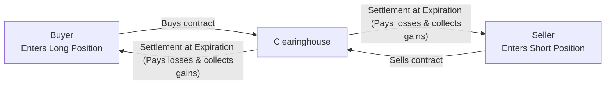
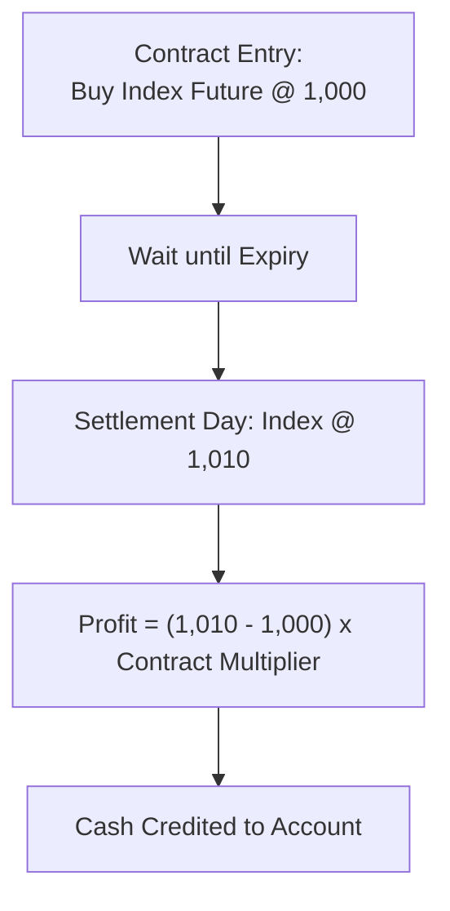

## 2.7 Cash Settlement

Imagine you enter into a futures contract on an equity index—maybe the S&P/TSX 60 Index—all excited to see what happens at expiration. Then, the big day comes, and you realize there's no actual delivery of any stocks. Instead, you open your trading account and see just a net payment for the gain or loss. This is known as cash settlement, and it has become a hugely popular way to settle certain futures and forward contracts. It can seem puzzling at first: “Wait, so there’s no box of soybeans, no truck rolling up with barrels of oil, and no big batch of shares dropping into my account?” Exactly. Sometimes, delivering or receiving the real underlying asset is just not practical.

This section explores why cash settlement exists, how it works, the key players involved, and the kind of oversight that ensures everything goes smoothly. Along the way, I'll share a few personal anecdotes, highlight some real-world examples, throw in a simple diagram or two, and hopefully make this concept a little more down-to-earth.

### Why Cash Settlement?

Physical settlement—where you deliver the actual commodity or financial asset—makes perfect sense when you’re dealing with tangible stuff like grain, gold bars, or even certain securities. But what if the underlying interest is an entire equity index, like the S&P/TSX 60, or a widely used interest rate benchmark, such as the Canadian Overnight Repo Rate Average (CORRA)? You can’t exactly “deliver” an index. And, well, delivering an interest rate is even more abstract. 

Cash settlement solves these headaches by substituting delivery of the underlying with a simple net payment to the party who’s in the money. The buyer receives or pays the difference between the futures contract price and the settlement or reference price on the expiration date, and the seller does the same in reverse. Everyone’s obligations are met, and you don’t need the logistic challenges of transferring physical assets. 

### Key Characteristics of Cash-Settled Futures

• No Physical Delivery: At contract expiration, there's no transferring of an actual commodity or security.  
• Net Payment of Gains/Losses: If the market price of the underlying is above your contract level (and you’re long), you receive the difference in cash. If the market drops below your contract level (and you’re long), you pay the difference.  
• Settlement Price: Typically, the official exchange sets the final settlement price or level. For an index future, it might be established by the closing index level on the last trading day or a specially calculated benchmark price.  
• Reduced Costs & Logistical Simplification: Because there’s no physical asset to deliver, costs connected to transportation, storage, or insurance are eliminated.  
• Popular with Speculators: Cash settlement greatly simplifies the process for those who only care about price moves, not obtaining physical goods or establishing a physical hedge.

### Real-World Example: Equity Index Futures

Let’s consider the S&P/TSX 60 Index futures contract listed on the Bourse de Montréal. Suppose you buy one contract at 1,000 index points (just a hypothetical figure). Each point might be worth C\$200 (again, hypothetical—check the actual contract specs for the real multiplier). At expiration, the exchange looks at the official closing level of the S&P/TSX 60 Index—let’s say it ends at 1,005. Because you’re long, you gain 5 points. Multiplied by C\$200, that’s a profit of C\$1,000. That C\$1,000 is delivered to you via “cash settlement.” No truck of “indexes” arrives. Just a net credit in your account.

### A Quick Mermaid Diagram

Below is a simple diagram illustrating how money flows in a cash-settled contract. Don’t worry if it looks a bit stylized—it's just a conceptual overview showing how gains and losses are handled:

At expiration:  
• If the settlement price is higher than what you bought at, the clearinghouse will deposit the difference into your account.  
• If the settlement price is lower, you’ll pay the difference.  

### Why Market Participants Like It

Traders and investors who simply want to speculate on price movements often prefer not to worry about physically receiving pork bellies, barrels of crude oil, or any equivalents. Instead, they focus purely on whether the market is going to go up or down. This is also handy for big institutional players hedging broad economic exposures (like interest rates or equity indexes) rather than single commodities or single equity positions.

Cash settlement can also be used for interest rate futures, such as CORRA futures in Canada. You can’t deliver an interest rate in a box. Instead, the final settlement is a calculation tied to the interest rate over a specified time window, aggregated into a single net payment.

### The Role of Exchanges and Clearinghouses

In Canada, for example, Bourse de Montréal is the main derivatives exchange for equity, index, and interest rate futures. The final settlement price for many of these contracts is determined by the official closing price or index level on the settlement date. The Canadian Derivatives Clearing Corporation (CDCC) is responsible for clearing these contracts, ensuring that trades are matched correctly and that each party ultimately receives or pays whatever they’re owed.

Clearinghouses, such as CDCC, stand in the middle of the buyer and seller. Before we had centralized clearing, if a buyer or seller defaulted, the other side was out of luck. Now, the clearinghouse guarantees the performance of both parties, which reduces counterparty risk. For final settlement, the clearinghouse will net out the gains and losses across all participants. If you made money, you get a credit; if you lost money, you make a payment.

### Settlement Price Methodology

The settlement price or level is usually determined by an official process. This might look like:

• The exchange observes the underlying asset's price (or index level) at a precise time, often at the market close.  
• If it’s an index future, the final settlement price might be the index’s official closing level on the last trading day, sometimes with specific timing or averaging.  
• Some interest rate futures might use the official Bank of Canada data or relevant benchmarks to lock in final settlement values.  

For instance, if you hold a 3-Month CORRA futures contract, the settlement process might involve referencing the daily CORRA rates published by the Bank of Canada each day and computing an average over the contract period, culminating in a final settlement calculation. 

### Regulatory Oversight

Cash-settled futures can be susceptible to potential manipulation, particularly near the settlement period—like “banging the close,” where traders try to move the official price just before it’s set. Because of these concerns:

• CIRO (the Canadian Investment Regulatory Organization) and the Canadian Securities Administrators (CSA) have watchful eyes on derivatives markets.  
• Exchanges have monitoring systems, circuit breakers, and position limits to deter manipulation.  
• Benchmark administrators (like Refinitiv or Bloomberg for official index values) are subject to global and domestic rules ensuring accurate and transparent benchmark data.  

The merging of the Mutual Fund Dealers Association of Canada (MFDA) and the Investment Industry Regulatory Organization of Canada (IIROC) into CIRO brought streamlined regulations under one banner. Historically, MFDA and IIROC existed separately, but since 2023, CIRO oversees everything from derivatives trading rules to the enforcement of proper settlement processes. 

### Potential Pitfalls and Points to Consider

• **Mispricing Risk**: If the settlement price is miscalculated or manipulated, either side of the trade could be unfairly affected.  
• **Basis Risk**: For some contracts that are cash-settled based on a benchmark, the underlying position an investor is hedging might not perfectly track that benchmark. This difference is the dreaded “basis risk.”  
• **Liquidity**: Certain cash-settled futures can be popular or illiquid, affecting how easy it is to enter or exit positions at fair prices.  
• **Regulatory Changes**: Regulators can alter settlement procedures or margin requirements. Always keeping an eye on official bulletins from CIRO or the CSA is crucial.  
• **Margin Calls**: Although no one is hauling physical assets around, margin requirements for futures remain a key aspect. You still have to meet margin calls if prices move against your position before expiry.

### Personal Anecdote

Early in my trading career, I spent a few days under the misconception that if I bought an interest rate futures contract—some kind of 3-Month T-Bill product—I’d have T-Bills deposited into my account at the end. (Yes, I was that new.) After all, that’s how physically settled commodity futures generally work, right? Well, I discovered the contract was cash-settled, so all I got was a net difference. I remember seeing just a credit in my account—no T-Bills in sight. It was anticlimactic but also enlightening. That’s when it really clicked that many financial futures are purely about netting out the differences, not delivering anything tangible.

### A Closer Look at Final Settlement

At expiration, the official final settlement is computed. Let’s outline a straightforward scenario:  

• You are long one futures contract on an index that has a multiplier of C\$200 per index point.  
• You buy the contract at an index level of 1,000.  
• On settlement day, the official index level closes at 1,010.  
• Your gain is (1,010 – 1,000) × C\$200 = C\$2,000.  

This final amount, minus any fees or commissions, typically lands in your brokerage account. And that’s it. The contract is closed, and you never see any actual shares or anything else associated with that index in your possession.

### Simplified Visual for Final Settlement

### Glossary

• **Settlement Price**: The price an exchange sets on the last trading day (or close to it) that determines final gains or losses on a futures contract.  
• **Expiration Date**: The date by which the futures contract must be settled, either via delivery or cash settlement.  
• **Index Futures**: Futures contracts where the underlying is a stock market index, almost always cash-settled. (S&P/TSX 60 or S&P 500 are common examples.)  
• **Benchmark Pricing**: A recognized rate or price used to settle a contract, often provided by third-party administrators like Refinitiv or Bloomberg.

### Additional Resources and References

• **CSA National Instruments**: Look into instruments such as NI 94-101 and NI 94-102 for rules on mandatory clearing and derivatives regulation in Canada.  
• **CIRO**: Canada’s current self-regulatory organization for investment and mutual fund dealers. For official updates or regulatory materials, see [CIRO website](https://www.ciro.ca).  
• **Bank of Canada Publications**: For official interest rate benchmarks such as CORRA, or to understand relevant monetary policies.  
• **Montréal Exchange Educational Articles**: Detailed guides about how equity index futures settle, margin rules, and best practices for futures traders.  
• **Benchmark Administrators**: Providers like Refinitiv or Bloomberg, which publish official index levels used to settle futures contracts worldwide.  

If you’re still encountering any confusion, I suggest checking out some practice problems, watching short tutorial videos, or even scanning through official settlement documents published by your exchange of choice. Keeping up with regulatory bulletins from CIRO or the CSA ensures you stay informed on any settlement procedure tweaks or oversight changes.

Above all, cash settlement makes sense because it’s simpler, cheaper, and more flexible—especially if the underlying “thing” is intangible or hard to deliver physically. It’s widely used, and there’s a high chance that if you’re diving into index or interest rate futures, you’re going to see a whole lot of cash settlement in action.

## Sample Exam Questions: Cash Settlement Best Practices and Market Structures



### Which statement best describes cash settlement in futures trading?

- [x] A method of settling a contract by paying or receiving the net difference.
- [ ] A method of settling a contract by physically delivering securities or commodities.
- [ ] A requirement to buy physical shares of a company.
- [ ] A strategy to avoid all margin requirements.

> **Explanation:** Cash settlement involves the net payment of gains or losses and does not require delivering the actual underlying asset.

### What is the advantage of cash-settled futures over physically delivered futures, especially for equity index contracts?

- [x] It eliminates the need to receive or deliver the actual basket of index securities.
- [ ] It completely removes all transaction costs for traders.
- [ ] It guarantees no risk of financial loss.
- [ ] It only applies to agricultural commodities, not financial assets.

> **Explanation:** Equity index futures are typically cash-settled because delivering all index components is impractical.

### How is the final settlement price typically determined in a cash-settled equity index futures contract?

- [ ] Through direct negotiation between the buyer and the seller.
- [ ] Via a random draw determined by the clearinghouse.
- [x] Based on the official closing price or index level on the settlement date.
- [ ] Using an average of prices over the past thirty days.

> **Explanation:** Exchanges normally reference the official closing index level on the last trading day to calculate final gains or losses.

### Why might regulators watch for manipulation around the settlement period of a cash-settled contract?

- [x] Traders may attempt to artificially influence the final index or benchmark price.
- [ ] There is no risk of manipulation in cash-settled contracts.
- [ ] Margin requirements do not exist for cash-settled contracts.
- [ ] There are no official rules governing settlement prices.

> **Explanation:** Because the final settlement price depends on that specific closing price or benchmark, some participants might try “banging the close” to sway that price in their favor.

### Which entity acts as the central counterparty for cash-settled futures trades in Canada?

- [ ] CIRO
- [x] Canadian Derivatives Clearing Corporation (CDCC)
- [ ] CSA
- [ ] MFDA

> **Explanation:** CDCC functions as the clearinghouse for derivatives in Canada, standing in the middle of trades to guarantee settlement.

### What happens if the cash-settled futures contract’s settlement price is higher than the long’s initial entry price?

- [x] The long side receives a net gain payment.
- [ ] The short side receives a net gain payment.
- [ ] No money changes hands because cash settlement has no real effect.
- [ ] The contract is rolled over to the next trading period.

> **Explanation:** If the final settlement price is above the long’s entry, the long gains from the difference.

### What unique challenge does the settlement of interest rate futures pose?

- [ ] You can physically deliver interest rates in large volumes.
- [x] Interest rates are intangible, so a direct physical settlement is impossible.
- [ ] They cannot be traded on regulated exchanges.
- [ ] They have no benchmarket price references.

> **Explanation:** Because interest rates are conceptual rather than physical, a cash settlement based on a reference benchmark is the only feasible method.

### Besides reduced costs, what is another reason that market participants prefer cash settlement?

- [ ] Traders avoid paying taxes.
- [ ] Regulators do not require any oversight of cash-settled contracts.
- [x] It simplifies the process, especially for traders who only want price exposure.
- [ ] It doubles the trading fees for the exchange.

> **Explanation:** Cash settlement allows traders to focus on price speculation without worrying about physical delivery logistics.

### When does the official expiration date of a cash-settled futures contract usually occur?

- [ ] Immediately after the contract is purchased.
- [ ] At an arbitrary time set by the broker.
- [ ] Only if the underlying asset’s price hits zero.
- [x] A date specified by the exchange, often tied to a final trading session.

> **Explanation:** The expiration date is established by the exchange and is typically the last day on which the contract can be traded.

### True or False: In Canada’s modern regulatory environment, CIRO oversees both cash-settled equity index futures and physically delivered commodity futures.

- [x] True
- [ ] False

> **Explanation:** Since the amalgamation of MFDA and IIROC into CIRO, it now oversees investment dealers, including those involved with both cash-settled and physically settled futures contracts.


