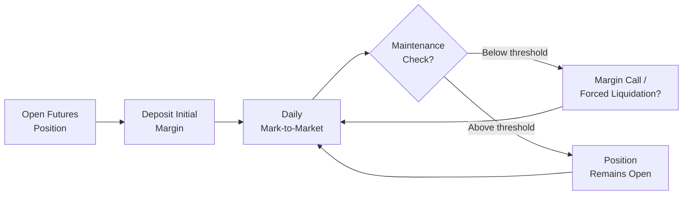

## 2.8 Margin Requirements and Marking-to-Market

Picture this: you finally take the plunge and buy five futures contracts on crude oil, convinced energy prices are about to surge. You’re excited—everyone around the office has been talking about that potential upswing in energy markets, and you just didn’t want to sit on the sidelines. So, you commit a chunk of your trading capital as margin. Then, the next morning, you get a call from your broker. Well, ironically, it’s a margin call. The markets moved against your futures position overnight, your maintained equity dipped below a certain threshold, and you need to deposit extra funds. This entire process—needing margin in the first place and adjusting that margin daily—is precisely what we’re going to explore here: Margin Requirements and Marking-to-Market.

Sometimes it might feel a bit daunting, but these practices keep traders honest and the market stable. So, let’s walk through the fundamental building blocks of these concepts and see how they all come together to protect yourselves, your broker, and, well, the entire derivatives market.

---

### A Quick Refresher on Futures and Their Risk

Futures contracts, as we discussed earlier in this chapter, are agreements to buy or sell an underlying asset—like crude oil, gold, wheat, or stock indices—at a predetermined price at a specified future date. They’re traded on exchanges that act as facilitators and accompanied by a clearinghouse that ensures trades complete smoothly.

• Futures are standardized in terms of quantity, quality (where applicable), and settlement terms.  
• Because futures offer substantial leverage, traders can control a large notional value of the underlying with a much smaller sum of money—called “margin”—deposited upfront.  
• But, with great leverage comes great responsibility. This is why margin requirements and marking-to-market exist.

---

### Understanding Margin Requirements

When you open a futures position, you must deposit an amount of collateral—known as the “initial margin.” This isn’t the same as a down payment in a mortgage, but the comparison is not too far off as both secure your obligation. In futures, it’s not a partial payment for the underlying asset but a performance bond that ensures you can bear any likely losses.

#### Initial Margin

The initial margin is set by the clearinghouse or the exchange and is meant to cover potential one-day losses under normal market conditions. This means if the market swings negatively against your position in a typical daily range, you’ll have enough funds on hand to cover those losses.

Exchanges or clearinghouses typically apply risk models—like SPAN (Standard Portfolio Analysis of Risk)—to calculate the initial margin for each type of futures contract. They look at historical volatility, daily price range, and other risk factors. A commodity with big price swings, for instance, might have a higher initial margin than a relatively stable interest-rate futures contract.

Brokers also have the discretion to set margin requirements higher than the exchange minimum—referred to as “house margin.” They might do this to reduce their own business risk, especially if they suspect that a particular customer or market sector is riskier.

#### Maintenance Margin

Maintenance margin is the minimum equity you need to have in your margin account to keep your futures position open. If your equity dips below this threshold—often 70–80% of the initial margin requirement—your broker issues a margin call. You then must top up funds to bring your account back to the initial margin level. Or, in some cases, you might choose to offset (close) the position to avoid paying additional margin.

Let’s highlight an informal example:  
• You deposit CAD \$5,000 as initial margin to open a single futures contract on crude oil.  
• The maintenance margin is CAD \$3,500.  
• If your account equity falls below CAD \$3,500 due to the market moving against you, you receive a margin call asking you to replenish the margin back to CAD \$5,000.

#### Margin as Collateral

Your margin can be posted as cash or certain securities that the clearinghouse is willing to accept. However, if you post securities, anticipate a possible “haircut.” A haircut is a discount applied to the market value of collateral; for instance, if you deposit government bonds worth CAD \$10,000, the clearinghouse might only credit you with, say, CAD \$9,500 in margin capacity, effectively imposing a 5% haircut. This measure accounts for potential price fluctuations in the collateral itself.

---

### Marking-to-Market: The Daily Check-In

Marking-to-market is the process of recalculating the value of each futures position at the end of each trading day. This is what truly differentiates futures from forward contracts, as forwards are not typically marked to market. In a forward contract, all gains and losses accumulate until maturity. In a futures contract, daily gains or losses are settled, often referred to as “daily settlement.”

• Every day, the exchange sets a settlement price for each futures contract.  
• If the market moved in your favor, the notional gains are credited to your margin account.  
• If the market moved against you, the notional losses are debited from your margin account.

This daily settlement process ensures that losses do not spiral out of control. It also neatly separates the realized performance on any given day, leaving no large unresolved liabilities to build up. By collecting margin incrementally each day, the clearinghouse drastically reduces the risk of default.

Here’s a simplified scenario:  
• Day 1: You buy 1 gold futures contract at CAD \$1,900 per ounce. Let’s assume the initial margin is CAD \$6,000, and you deposit exactly that amount.  
• Day 1 Settlement: The price drops to CAD \$1,895; your account is debited CAD \$500 for the daily mark-to-market loss (because 1 contract might represent 100 ounces × a \$5 drop = \$500). Now your account balance is CAD \$5,500.  
• Day 2 Settlement: The price rises to CAD \$1,905; you get credited CAD \$1,000 (the \$5 initial dip recovered plus an additional \$5 gain above the original price). Now your account goes back up to CAD \$6,500.  
• Should the price continue to fluctuate, your margin account will be adjusted daily by the settlement price.

#### Margin Calls and Forced Liquidation

If at any point your account balance falls below the maintenance margin, you must replenish it—this is the margin call. Imagine finishing Day 2 in the scenario above with a net account balance of \$4,500, and the maintenance margin is \$4,800. In that case, you receive a margin call to bring your balance back to, say, \$6,000, the initial margin requirement.

If you fail to respond or can’t deposit additional funds, your broker may resort to forced liquidation. That means they’ll close out your position to limit further losses and protect both themselves and the clearinghouse. Forced liquidation can be abrupt and is basically your broker’s emergency brake.

---

### Why Marking-to-Market Protects Everyone

Risk can be contagious in financial markets. If one trader accumulates massive losses that they cannot pay, it can set off a chain reaction affecting all other market participants, from the broker and clearinghouse to other traders who might end up on the receiving end of unsettled obligations. Because of daily marking-to-market:

• Big losses become visible immediately and get settled each day.  
• The clearinghouse systematically collects additional margin if the position moves into a loss.  
• The risk of default is significantly reduced because any shortfall is addressed promptly.

This process was put in place after historical defaults and crises taught regulators that it’s better to handle small, incremental losses daily than to let them pile up.

---

### A Glimpse Into CIRO Guidelines

Since June 1, 2023, the Canadian Investment Regulatory Organization (CIRO) has overseen investment dealers and marketplace integrity in Canada. CIRO sets margin guidelines for broker-dealers to ensure that margin processes align with risk management best practices. If you want the full scoop, you can browse CIRO’s Rule Book on margin requirements, found at [https://www.ciro.ca](https://www.ciro.ca).

Key aspects of these guidelines include:  
• Minimum margin rates for different asset classes, including futures.  
• How brokers determine house margin rates above the exchange minimum.  
• Procedures for margin calls and forced liquidation.  
• Requirements to maintain sufficient capital on the broker’s side to handle client defaults.  

CIRO aims to ensure that each broker enforces margin rules effectively and that clients are adequately protected from undue liquidations or the risk of meltdown if a client fails to meet obligations.

---

### Hedgers, Speculators, and Margin

Some folks use futures just to speculate—hoping to profit from price movements—while others hedge underlying market exposures. Here’s the interesting part: though margin is posted in both cases, a hedger might see futures losses offset by gains in the cash or spot market.

A farmer, for example, might be short corn futures to lock in a sale price for their upcoming harvest. If the cash corn price rises (bad for their short futures), the farmer might lose on futures while gaining in the spot market. This interplay can effectively reduce the put-up margin from a net-exposure standpoint (although they still need to maintain margin in the futures account itself). CIRO acknowledges the unique position of hedgers and, in certain circumstances, provides margin exemptions or reduced margin requirements for bona fide hedgers, subject to thorough documentation and oversight.

---

### Tools and Resources

• CIRO Rule Book, Margin and Capital Requirements Section  
• Bank of Canada publications on risk management in derivative markets, focusing on how daily settlement and margin limit systemic risk  
• “Quantitative Risk Management” by Alexander J. McNeil, which delves deeply into margin modeling and scenario analysis  
• Online margin calculators, typically provided by brokerage firms, can help you approximate the initial and maintenance margins for various futures.  

---

### Real-World Stories: My Margin Close Call

I recall a day when I first ventured into stock index futures. I’d rushed in with a modest deposit, expecting big profits. By day’s end, I was on the other side of a large market move. My phone buzzed, and my broker said, “You’re currently below maintenance margin. Please send in CAD \$3,000 by tomorrow.” My stomach sank. That conversation reminded me that margin calls can sneak up on you if daily moves exceed your expectations. Ultimately, the best way to handle it is to keep extra cash in your trading account or carefully manage position size to weather bigger-than-expected price swings.

---

### Putting It All Together: Visualizing the Lifecycle of a Futures Trade

Below is a simple flowchart to show how margin requirements and marking-to-market interact over the life of a typical futures position:

1. You open a new futures position and deposit the initial margin.  
2. At the end of each trading day, the position is marked to the settlement price.  
3. Your margin account is credited or debited accordingly.  
4. If your equity dips below the maintenance margin, you might face a margin call or potential forced liquidation.  
5. If you meet the margin call, the cycle continues until you close out the position or reach final settlement.

---

### Practical Tips, Pitfalls, and Best Practices

• Keep Extra Cushion: Maintaining only the bare minimum margin is a recipe for, well, potential heartbreak. Market movements can be swift. Having an extra cushion helps you avoid forced liquidation.  
• Monitor Volatility: When markets get rocky—say we see a geopolitical shakeup—you’ll notice your daily swings are bigger, which might lead to quicker margin calls.  
• Plan for Potential “Worst-Case” Scenario: Use scenario analysis or stress testing. Tools from advanced risk management frameworks—like those taught in “Quantitative Risk Management”—can be used, even in simpler forms, to anticipate big moves.  
• Hedger or Speculator? If hedging, note how offsetting gains or losses in the underlying might effectively reduce net risks. Yet, that doesn’t always change your formal margin requirements unless you’ve filed specific hedging documentation with your broker.  
• Respond Quickly to Margin Calls: If you don’t deposit funds or reduce your position in time, your broker can liquidate your positions without warning, often at less-than-ideal prices for you.  
• Stay Updated on CIRO Guidelines: Regulatory rules, including those for margin and capital requirements, can evolve. Check [https://www.ciro.ca](https://www.ciro.ca) regularly to remain informed of the latest updates.  

---

### Glossary of Key Terms

• Equity in the Account: The current balance in your margin account after daily settlement.  
• Forced Liquidation: When the broker closes out your position if you fail to meet a margin call or if your losses are too large.  
• Maintenance Margin: The minimum amount of equity you must keep in your margin account. If you go below this, you get a margin call.  
• Haircut: The discount applied to the posted collateral’s market value to account for potential fluctuations in its price.

---

### Final Thoughts

At its core, margin requirements and marking-to-market exist to make futures markets safer, more liquid, and more transparent for everyone. Sure, margin calls can be stressful (believe me, I’ve sweated through a few), but they’re there to ensure that your potential losses are promptly covered. This daily adjustment also ensures no single participant accumulates massive unpaid losses that jeopardize the market at large.

In Canada, CIRO oversees these practices. Their guidelines frame how brokers set initial and maintenance margins, how margin calls are handled, and what happens if you can’t pay up. With the knowledge of this system, you’re not only fulfilling a requirement of the Derivatives Fundamentals and Options Licensing Course (DFOL)—you’re safeguarding yourself, your broker, and the broader financial ecosystem. Now that’s something to feel good about!

---

## Sample Exam Questions: Margin Requirements and Marking-to-Market



### Which of the following best describes the requirement to deposit a set amount of collateral when opening a futures position?

- [ ] Maintenance margin  
- [ ] Hedging exemption  
- [x] Initial margin  
- [ ] Margin call  

> **Explanation:** Initial margin is the collateral required at the outset of establishing a futures position. Maintenance margin is a lower threshold that triggers margin calls when the account balance falls below it.

### What happens to a futures position at the end of each trading day in a process called marking-to-market?

- [ ] The futures contract is automatically exercised  
- [ ] The position is held until expiration without any interim adjustments  
- [x] Unrealized gains/losses are credited/debited based on the settlement price  
- [ ] The contract is transferred to another party  

> **Explanation:** Marking-to-market credits or debits an account daily based on the futures contract’s settlement price, ensuring that losses are settled incrementally and unpaid gains/losses do not accumulate.

### If your equity drops below the maintenance margin, your broker typically issues a:

- [ ] Rebate  
- [ ] Credit note  
- [ ] Hedge exemption  
- [x] Margin call  

> **Explanation:** A margin call is triggered when the account balance falls below the maintenance margin. The trader must replenish funds to meet the initial margin level.

### If a trader fails to meet a margin call, the broker:

- [ ] Allows the position to remain open indefinitely  
- [ ] Drops the maintenance margin requirement  
- [x] May forcibly liquidate the trader’s position  
- [ ] Reports the account to the regulator for immediate suspension  

> **Explanation:** Forced liquidation protects the broker and the clearinghouse by closing out positions to halt further losses.

### Which organization oversees investment dealers and sets guidelines for margin requirements in Canada as of 2025?

- [ ] IIROC, the Investment Industry Regulatory Organization of Canada  
- [ ] The MFDA, Mutual Fund Dealers Association of Canada  
- [x] CIRO, the Canadian Investment Regulatory Organization  
- [ ] CIPF, the Canadian Investor Protection Fund  

> **Explanation:** Following the amalgamation of IIROC and MFDA, the new Canadian Investment Regulatory Organization (CIRO) oversees investment dealers and margin guidelines.

### When posting non-cash collateral, such as government bonds, the clearinghouse often applies a:

- [x] Haircut  
- [ ] Hedging exemption  
- [ ] Margin call  
- [ ] Futures assignment  

> **Explanation:** A haircut is a discount applied to the collateral’s market value, reflecting potential changes in its price.

### How does marking-to-market help maintain stability within the futures market?

- [ ] By eliminating all leverage in the market  
- [ ] By locking in a single settlement price for the contract’s entire life  
- [x] By ensuring gains and losses are settled daily, preventing large unpaid obligations  
- [ ] By allowing traders to defer margin payments until contract expiry  

> **Explanation:** Daily settlement reduces default risk by preventing large, unrecognized losses from accumulating over time.

### Maintenance margin is best defined as:

- [ ] The pre-agreed loan term for the margin loan  
- [ ] The maximum amount a trader can lose in a single day  
- [x] The minimum account balance required to avoid a margin call  
- [ ] The final payment due at contract expiration  

> **Explanation:** Once your equity dips below the maintenance margin, you receive a margin call to restore your account to the initial margin level.

### Which of the following statements about a hedger in futures markets is correct?

- [ ] Hedgers never have to meet margin requirements  
- [ ] Hedging success means never experiencing a trading loss  
- [x] Hedgers may experience a loss in futures offset by gains in the spot market  
- [ ] Hedgers are exempt from daily marking-to-market settlements  

> **Explanation:** A hedger might lock in a price using futures and see the futures position move against them. However, they often have an offsetting cash or spot market position that benefits from that same price move.

### True or False: Brokers can set margin requirements higher than the exchange’s official minimum levels.

- [x] True  
- [ ] False  

> **Explanation:** Brokers often add a “house margin” above the exchange minimum to manage their own firm-level risk more conservatively.


