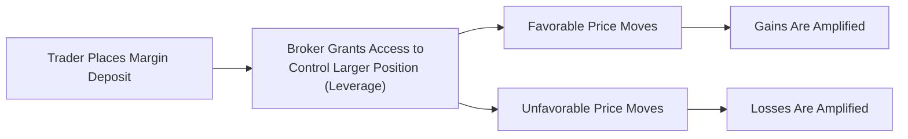

## 2.9 Futures Trading and Leverage

Leverage in futures trading can be both exhilarating and nerve-wracking. You put down a fraction of an asset’s total value as margin, and in return, you get to control a position much larger. But as you might guess, if that position goes in your favor, profits look amazing. If it goes the other way—well, the losses can be brutal. Anyway, let’s dive into how it all works, why people use it, and what risk management steps keep you from losing your shirt.

Before we begin, I still remember when a friend of mine, who was super confident in his “market read,” jumped into crude oil futures on just a few thousand dollars’ margin. He basically took a bet on oil prices shooting up. For a few days, it seemed like a no-brainer: the market ticked upward, and he felt like a genius. Then—on a news event—prices reversed sharply. He panicked. Within hours, he faced a margin call. That memory reminds me that while leverage can amplify gains, it can truly magnify losses just as quickly.

––––––––––––––––––––––––––––––––––––––––––

Understanding Leverage in Futures  
Leverage is the ability to control a large nominal value of the underlying asset for a relatively small upfront investment, often called the initial margin. In futures markets, your margin deposit might be just 5% or 10% of the total contract value, depending on the contract specifications and volatility.

For instance, suppose each futures contract controls 1,000 barrels of oil, and the price of oil is CA$80 per barrel. That’s CA$80,000 in total “notional” value. If your initial margin is CA$8,000 (10%), then you’re effectively controlling an asset worth CA$80,000 with only CA$8,000. So the leverage ratio in this case is 10:1 (80,000 / 8,000). Neat, right? But obviously, a 10% swing in the underlying could mean a 100% change to your margin. Ouch (or yay), depending on your side of the fence.

This phenomenon is precisely why so many market participants—hedgers, professional traders, retail folks—like using futures. It frees up capital, offers quick exposure, and when used properly, can be a powerful tool for portfolio management. Yet it’s also the reason folks can lose a lot more than their initial margin if things go sideways.

––––––––––––––––––––––––––––––––––––––––––

Why Traders Are Drawn to Leverage  
• Efficient Use of Capital:  Instead of tying up a ton of money buying the entire underlying asset, you post margin. This frees capital for other investments or operating needs. Hedgers, for example, can lock in prices for raw materials but still deploy their cash for business essentials like expansion or paying down debt.

• Higher Potential Returns:  If prices move in your favor, your percentage gains can outpace a standard cash transaction. A small price increase might translate into a hefty return on margin.

• Quick Adjustments:  Because futures are standardized and actively traded on exchanges, you can rapidly adjust positions. This is crucial for institutional players who need to tweak large exposures in a heartbeat.

• Simple Access to Sectors:  You can go long or short on everything from equity indices to wheat prices in a single futures account—without dealing with physical settlement or warehousing. (Although some contracts do have delivery obligations, many are cash-settled.)

At the same time, it’s not all sunshine. If the market turns around, your losses are equally magnified, uncomfortably so if you’re not prepared. (Remember that friend I told you about.) The last thing you want is a call from your broker telling you your equity is too low and you need to deposit more money or close out your position.

––––––––––––––––––––––––––––––––––––––––––

The Concept of Margin  
Margin is basically your “good faith deposit.” In Canada, the exact rules for margin vary by contract and by the clearinghouse that backs the trades. CIRO (Canadian Investment Regulatory Organization) oversees the registrants and sets ground rules ensuring that brokerage firms properly disclose the risks of leveraged trading and comply with standard margin practices. At this point, you might see references to “maintenance margin” vs. “initial margin”:

• Initial Margin:  The minimum deposit to open a position.  
• Maintenance Margin:  A lower threshold you must maintain. If your account falls below this maintenance level, you will receive a margin call.

Let’s say your initial margin on a futures contract is CA$8,000, and your maintenance margin is CA$6,000. If that position moves against you and you lose CA$2,500, your account equity (assuming no offsetting gains elsewhere) is now CA$5,500. That’s below the maintenance margin requirement, so your broker calls or texts or emails: “Please top up your margin.” If you don’t respond, the broker can close your position automatically.

––––––––––––––––––––––––––––––––––––––––––

Amplification of Returns and Losses  
So let’s break it down with an example—maybe a quick hypothetical:

• You go long (buy) one S&P/TSX 60 Index futures contract.  
• Notional value of the contract is CA$200,000.  
• Your initial margin is CA$10,000 (just for illustration).  

If the index climbs by 5%, the notional value effectively jumps to CA$210,000. That’s a CA$10,000 gain. Relative to your CA$10,000 margin, that’s a 100% return. And yes, it feels awesome. But the flip side can happen just as quickly. If the index falls 5%, your account is down CA$10,000. That’s your entire initial margin. That’s 100% of your margin deposit gone.

It’s not unusual for derivatives novices to get starry-eyed about doubling their money in a short time. But every coin has two sides. You might lose just as fast and even owe more if the market leaps over your stop-loss (like during overnight markets or a holiday closure).

––––––––––––––––––––––––––––––––––––––––––

Stop-Loss Orders and Position Sizing  
When you’re dealing with leverage, risk management is paramount. Let’s talk about a few essential risk management tactics:

Stop-Loss Order  
A stop-loss is an instruction to your broker to automatically sell (if you’re long) or buy (if you’re short) a futures contract if it hits a specified price. It’s meant to cap your losses. Sounds great, but guess what? If the market “gaps” overnight or screeches past your stop price, you can still end up with a fill that’s significantly worse than expected. So a stop-loss is not a guarantee, but it’s better than nothing.

Position Sizing  
It might feel tempting to max out your margin capacity, but it’s often more prudent to scale down. If you have CA$50,000 in your futures account, you don’t necessarily need to open five or six big positions concurrently. The core idea behind position sizing is that you keep your overall risk proportionate to your capital and risk tolerance. You don’t want to bet the entire farm on a single contract.

Overnight Gap Risk  
Futures markets can trade around the clock, but not all futures are equally liquid at 2 AM. If there’s a major economic release in Europe or Asia while you’re asleep, you could experience a price gap that leaps over your stop level. You can’t always avoid that risk, but you should be aware of it—and adjust your position size accordingly.

––––––––––––––––––––––––––––––––––––––––––

Mermaid Diagram: Leverage Flow  

Below is a simple visualization of how leverage amplifies outcomes. This is obviously simplified, but it helps illustrate the core concept:

In a nutshell, that’s why leverage is exciting—and also terrifying. The smaller your margin requirement relative to the notional value, the greater the leverage effect.

––––––––––––––––––––––––––––––––––––––––––

Why Hedgers Use Leverage Strategically  
At first glance, you might say, “If leverage is so risky, why do hedgers even bother?” But if you’re a farmer expecting to harvest 100,000 bushels of wheat, locking in a forward or futures price can help you secure a certain cash flow that justifies the cost of running your farm. And because the margin requirement is a fraction of the total value, you’re not tying up your entire capital. That can be a big plus.

The same logic applies to companies that rely on oil, metals, or other commodities. They can hedge their exposure in the futures market, freeing up capital to maintain daily operations, manage payroll, or even expand. The idea is that these hedges offset potential losses in the physical markets, so leverage becomes part of a broader strategy rather than pure speculation.

––––––––––––––––––––––––––––––––––––––––––

Regulatory Oversight by CIRO  
The Canadian Investment Regulatory Organization (CIRO), newly formed from the consolidation of the MFDA and IIROC, oversees the conduct of brokers and dealers. Among its many goals, CIRO wants to ensure that market participants understand the risks of leverage and that firms follow margin requirements set by clearinghouses. Some important points:

• Brokers Must Disclose Risks:  You’ll often see disclaimers about leverage. They’re not just for legal reasons—they’re there because day-to-day fluctuations can create significant stress and financial problems for unprepared traders.  
• Adequate Margin Practices:  Brokers in Canada are obliged to enforce margin calls if your account dips below certain thresholds. This keeps the financial system safer by reducing the risk of large defaults.  
• Ongoing Education:  You can find valuable resources on CIRO’s website (https://www.ciro.ca) that explain how futures trading and leverage work. Honestly, if you’re just starting out, these are worth a look.  

Additionally, provincial securities commissions often issue alerts and host educational sessions or provide brochures about leveraged trading. It’s worth checking the websites of organizations like the Ontario Securities Commission (OSC) or the Autorité des marchés financiers (AMF) if you’re in Québec.

––––––––––––––––––––––––––––––––––––––––––

Margin Calls and Forced Liquidations  
A margin call can feel dramatic if you’ve never experienced one. Let’s say you wake up, check your phone, and see an email from your broker: “Due to adverse price movements, your account equity has fallen below the maintenance margin requirement. Please deposit an additional CA$2,000 by 2 PM or risk liquidation.” If you don’t meet that call, the broker can close your position without asking again.

Traders sometimes forget that forced liquidations can happen quickly, especially if the market is fast-moving. The broker’s primary interest is ensuring that your account doesn’t go negative (at least not by too much). If the broker can’t close your position at a reasonable price, you might owe more money than you had in your account initially.

––––––––––––––––––––––––––––––––––––––––––

Volatility in Account Equity  
Because you’re leveraged, your account equity can swing dramatically. A day trader or scalper might prefer small daily fluctuations, but a highly leveraged position can produce significant changes from hour to hour. If you can’t stomach that risk, consider:

• Smaller contract positions (micro or mini futures, if available).  
• Trading less volatile contracts (e.g., major index futures vs. extremely volatile commodities).  
• Using options on futures for a more defined risk scenario.

––––––––––––––––––––––––––––––––––––––––––

Educational Resources  
If you’re thinking, “I need more training before I jump into this,” good call. Here are a few resources that can help:

• CIRO’s Online Investor Education Modules:  They address the basics of derivatives, margin, and how to use leverage responsibly.  
• Provincial Securities Commissions’ Alerts:  They often explicitly warn about the pitfalls and common scams relating to leveraged trading, so you can learn from others’ mistakes.  
• R Packages Such as “PerformanceAnalytics”:  If you’re into quantitative analysis, you can use open-source tools in R or Python to backtest leveraged trading strategies. “PerformanceAnalytics” is a neat package for analyzing drawdowns, volatility, and risk-adjusted returns.  
• The Canadian Securities Institute (CSI):  Offers professional courses covering risk management, margin requirements, and advanced derivatives concepts. Great for those wanting formal education or looking to get licensed.  

And if you’re looking for a deeper dive, keep an eye on courses about professional risk management. You can also join local investor associations or clubs that focus on futures and derivatives to bounce ideas around. Just be sure the folks you learn from have actual experience (and ideally realistic track records).

––––––––––––––––––––––––––––––––––––––––––

Common Pitfalls and Best Practices  
I’ve come across a few recurring pitfalls that new (and even experienced) futures traders run into:

Ignoring Risk in Favor of Reward  
Some folks get starry-eyed with profits. They post a CA$5,000 margin deposit, see the potential for a CA$50,000 gain, and forget that losing CA$5,000 is also a distinct possibility. Or more, if the market violently moves against them.

Overtrading  
When you realize you can open multiple contracts for the cost of just one or two in the equity market, it’s easy to get carried away. That’s where many meltdown stories begin.

Misjudging Volatility  
People sometimes pick a market they don’t fully understand—like natural gas futures—then watch in horror as the volatility gets out of control. If you’re new, maybe stick to contracts with “moderate” moves or consider shorter time frames.

Not Using Proper Stops or Risk Controls  
Some traders think: “I’ll just watch it. I’ll get out if it moves 2% against me.” That’s great until you go out for lunch or fall asleep. Automated stops can help you limit damage to your capital.

To keep from becoming a cautionary tale, try these best practices:

• Set Clear Risk Parameters:  “I’m willing to lose X per trade” or “I need to stop out if the market goes against me by Y points.”  
• Diversify Your Contracts:  Don’t put all your margin into one sector or commodity.  
• Stay Informed:  Keep track of economic releases, news events, or supply-demand shifts that can drastically impact futures prices.  
• Revisit Margin Requirements:  They can change if the underlying volatility spikes. Keep enough cash buffer in your account to handle expanding margin requirements without panic.

––––––––––––––––––––––––––––––––––––––––––

Case Study: Quick Gains, Quick Losses  
Let’s imagine a scenario in the Canadian equity index futures market:

• A speculative trader, Jalisa, has CA$20,000 in her account. She decides to buy two S&P/TSX 60 Index futures, each controlling roughly CA$100,000 notional value, so about CA$200,000 total.  
• Her broker’s initial margin requirement is CA$10,000 per contract. She’s using all her available margin. This is a 10:1 leverage ratio overall.  

Now, if the index rallies 2% by the next day, Jalisa’s net gain is CA$4,000 (because 2% of CA$200,000 is CA$4,000). Relative to her CA$20,000 account, that’s a 20% boost overnight. Fantastic. But if the index falls 2%, Jalisa instantly loses 20% of her account. If it falls 5%, that’s half her capital gone. And if it falls 10%, she could actually blow out her account entirely—and still owe money.

This short hypothetical underscores the importance of always factoring in the worst-case scenario. Because, well, life can throw a bunch of surprises.

––––––––––––––––––––––––––––––––––––––––––

Glossary  
• **Leverage Ratio**: The ratio of the notional value of a position to the amount of capital (margin) posted. A 10:1 leverage ratio means the notional value is 10 times the posted margin.  
• **Stop-Loss Order**: An order to close your position once the market hits a specific price, aiming to limit further losses. Not a guarantee if the market leaps over your target.  
• **Position Sizing**: The process of determining how many contracts to hold based on your overall capital, risk tolerance, and market outlook.  
• **Overnight Gap Risk**: The risk that the market opens or trades at a vastly different price from the prior session’s close, skipping over your intended exit points and causing larger-than-anticipated gains or losses.

––––––––––––––––––––––––––––––––––––––––––

Conclusion  
There’s no question that leverage is one of the most attractive facets of futures trading. It gives smaller players a seat at the table of big markets, and it helps big players free capital for other purposes. But it’s a double-edged sword. If you’re not disciplined about stop-loss orders, position sizing, margin monitoring, and overnight risk, you could be in for some harsh lessons. That’s why responsible traders—large or small—always keep a keen eye on their positions, maintain a cushion in their accounts, and stay updated on margin or regulatory changes.

The key takeaway? Educate yourself thoroughly. Make use of the resources from CIRO, provincial securities commissions, or the Canadian Securities Institute. If you’re comfortable with the risk and the pace of the market, futures trading can be an amazing addition to your toolbox—just handle that leverage with respect and caution. And if we can learn anything from that short anecdote about my friend who leapt straight into oil futures, it’s this: don’t underestimate how fast things can happen. The sharper your skills at managing leverage, the more likely you’ll succeed in navigating the futures realm.

––––––––––––––––––––––––––––––––––––––––––

## Sample Exam Questions: Futures Trading and Leverage



### What is one significant advantage of using leverage in futures trading?

- [ ] It completely removes the need for maintaining a margin account.
- [x] It allows traders to control a large position with a relatively small capital outlay.
- [ ] It guarantees profits in volatile market conditions.
- [ ] It eliminates the risk of margin calls.

> **Explanation:** Leverage enables traders to control significantly higher exposure than their margin deposit might suggest, allowing capital to be allocated elsewhere. However, it also magnifies potential losses, so it does not guarantee profits or eliminate margin calls.

### Which of the following best describes a stop-loss order?

- [ ] It is an order guaranteeing no slippage in a fast-moving market.
- [ ] It is an order to add to a position once a favorable price is reached.
- [x] It is an order to close out a position automatically once the price reaches a specified level to limit loss.
- [ ] It is an order placed only when the market has strong momentum.

> **Explanation:** A stop-loss order helps limit loss by closing the position if the market touches a certain price. It doesn’t guarantee a specific fill price if a gap occurs, but it triggers a market or limit order once the stop threshold is met.

### In Canada, which organization oversees brokers and emphasizes proper disclosure about leverage and margin practices for futures traders?

- [ ] Next-Generation Self-Regulatory Organization (NSRO)
- [ ] Investment Industry Regulatory Organization of Canada (IIROC), in current active form
- [ ] Mutual Fund Dealers Association of Canada (MFDA), in current active form
- [x] The Canadian Investment Regulatory Organization (CIRO)

> **Explanation:** Following the amalgamation of IIROC and the MFDA, CIRO now acts as the principal self-regulatory body, ensuring members provide adequate risk disclosure regarding leverage.

### If a trader’s futures account dips below the maintenance margin, which of the following typically occurs?

- [x] The trader receives a margin call and must add funds or close positions.
- [ ] The trader cannot open any new positions for at least 30 days by rule.
- [ ] The broker automatically increases the trader’s leverage ratio.
- [ ] The clearing corporation notifies the investor that futures trading is suspended.

> **Explanation:** Once equity falls below the maintenance margin, brokers issue a margin call requiring the account holder to replenish funds or reduce exposure.

### A hedger in the agricultural sector might use leverage in futures primarily to:

- [x] Lock in prices while freeing capital for other business operations.
- [ ] Amplify returns on high-volatility trading positions exclusively.
- [ ] Speculate on interest rate changes without any underlying exposure.
- [ ] Avoid fulfilling physical delivery obligations.

> **Explanation:** Hedgers frequently use leverage to manage price exposure for their commodity while reducing cash outlay, preserving funds for day-to-day operations or expansion.

### Overnight gap risk refers to:

- [ ] A guaranteed overnight price level that ensures stable margin requirements.
- [x] The possibility of the market opening at a substantially different price than the previous close.
- [ ] A time window where no margin calls can be issued.
- [ ] The extra liquidity that occurs only during nighttime trading sessions.

> **Explanation:** Markets, particularly futures markets, sometimes open at prices significantly above or below the prior close, increasing potential losses or gains if stops are skipped over by the new opening price.

### Position sizing in futures trading involves:

- [x] Determining how many contracts to trade based on capital and risk tolerance.
- [ ] Setting the absolute price at which you will exit your position.
- [ ] Requesting an increase in the daily price limit for the contract.
- [ ] Modifying the underlying asset’s notional value.

> **Explanation:** Position sizing ensures that the number of contracts you hold aligns with your account’s size and your acceptable level of risk.

### When a futures trader is fully “maxed out” on margin:

- [ ] There is zero risk because the broker will close the position automatically at a profit.
- [ ] The trader has full immunity from margin calls.
- [x] The trader has used all their available margin capability, increasing potential risk of a margin call.
- [ ] The trader can no longer monitor their account in real time.

> **Explanation:** “Maxing out” one’s margin can lead to large swings in account equity and higher chances of forced liquidation if prices move against the trader.

### One function of the maintenance margin is to:

- [ ] Lock in daily profits for the trader.
- [ ] Eliminate the need for collateral in a futures trade.
- [x] Act as a buffer ensuring the account retains sufficient equity to cover adverse price moves.
- [ ] Reduce volatility in the underlying asset.

> **Explanation:** Maintenance margin ensures the trader’s position remains adequately collateralized against adverse price movements. If the account falls below this minimum, a margin call is triggered to bring equity back above the required threshold.

### True or False:  
Leverage in futures trading magnifies both potential profits and potential losses.

- [x] True
- [ ] False

> **Explanation:** Leverage is a double-edged sword—while it can increase profits if market moves go in your favor, losses are equally magnified if the market moves against you.


