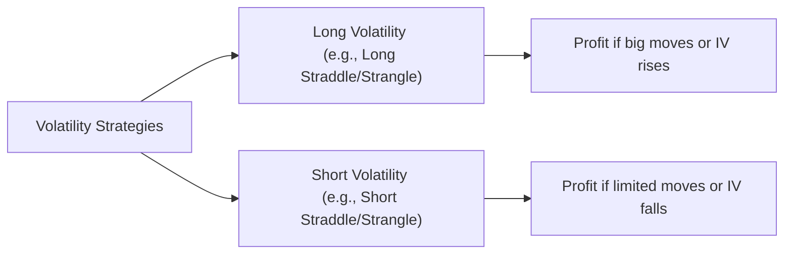
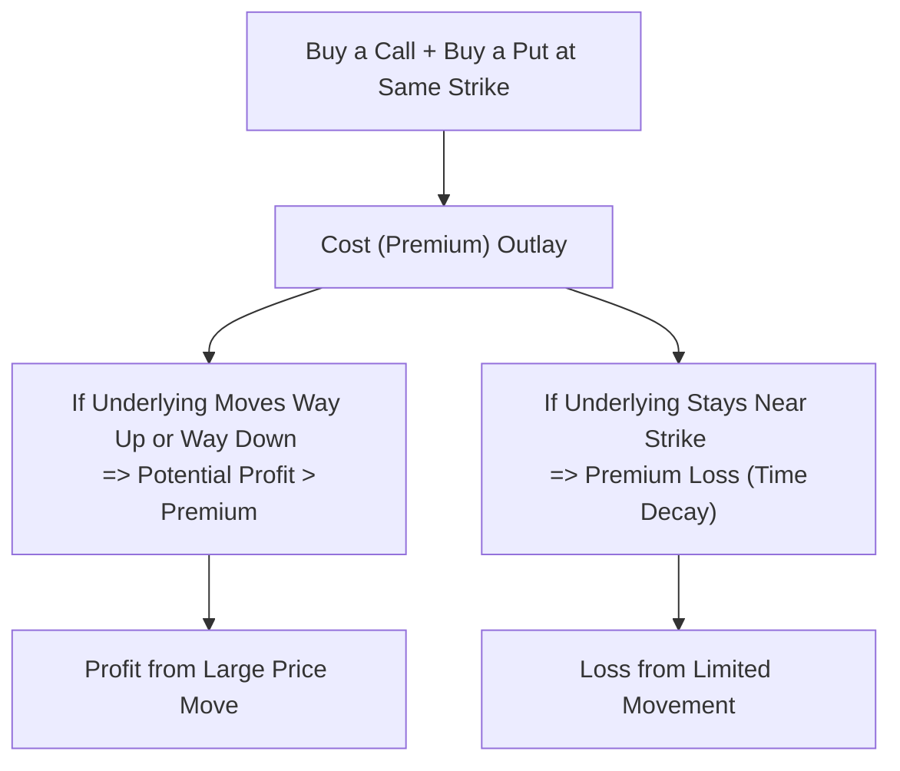

## 20.1 Introduction to Volatility Strategies

Have you ever sat around chatting with a friend about options trading and felt a bit baffled by all the talk about “vol?” Trust me, I’ve been there. I remember my early days in a small trading firm—no matter how many times I heard the words “implied volatility” or “long gamma,” I just couldn’t shake the feeling that someone was speaking a secret language. The good news is you’re not alone, and once you get a handle on it, volatility strategies can become an incredibly exciting part of the options universe.

Volatility strategies are, at their core, attempts to profit from anticipated changes in the market’s expectation of future price swings—what we generally call “implied volatility.” Instead of focusing purely on whether an asset’s price will go up (bullish) or down (bearish), volatility strategies look at how much that price will move. Sometimes, you’re betting it’ll move a lot. Other times, you’re betting it’ll barely budge.

Volatility-based trades often involve multi-leg option positions, such as straddles, strangles, or spreads. They blend calls, puts, and occasionally even exotic options to either go “long volatility” (profit if the underlying has big moves) or “short volatility” (profit if the underlying remains calm and stable). Because these strategies rely on implied volatility, time decay, and market sentiment, they typically require a deeper understanding of risk metrics—especially Vega and Theta—and often involve more sophisticated risk management practices.

Below, we’ll dig into the key principles of volatility strategies, explore real-world examples, and see why they’re so crucial in the derivative marketplace. Along the way, I’ll share some personal observations, slip in a few “Ahs” and “Hmm” moments, and we’ll relate some practical tales (like that time I forgot to check a major earnings date!). Let’s dive in.

## Why Volatility Matters

Volatility is, in many ways, the heartbeat of options pricing. If you’ve ever wondered why the cost of an option is higher ahead of a crucial earnings announcement or major economic data release, it’s largely because the market expects a bigger price swing and, therefore, demands a higher premium. This is “implied volatility” in action.

• Volatility (Vol): A standard measure of the range and speed at which a security’s price moves.  
• Implied Volatility (IV): A forward-looking estimate drawn from current market option prices. It reveals the market’s consensus (or guess) about how dramatic future price changes might be.

### Role of Volatility Strategies

Volatility strategies aren’t necessarily bullish or bearish. They’re about harnessing the power of IV shifts.  

1) Long Volatility: Typically involves buying options. Strategies like straddles or strangles seek to profit from a surge in volatility or big price moves, regardless of direction.  
2) Short Volatility: Often involves writing or selling options. You (cautiously) collect premium and hope the market stays stable, so implied volatility either remains the same or falls.

## Foundations: Key Greeks for Volatility Strategies

Before jumping headfirst into complex trades, it’s important to grasp the Greeks that matter most:

• Vega: This measures how sensitive an option’s price is to changes in implied volatility. A positive Vega means you gain if implied volatility rises; a negative Vega means you gain if implied volatility falls.  

• Theta (Time Decay): This measures how much value an option loses per day, if all else remains unchanged. If you’re long an option, Theta is working against you; if you’re short, it generally works in your favor.  

• Gamma: The rate of change in Delta as the underlying price moves. Gamma can have a major impact on how a position behaves when the market starts swinging wildly.  

• Delta: Though not directly about volatility, Delta indicates how much an option’s price changes for a $1 move in the underlying asset.  

These Greeks form the “dashboard” you’ll likely consult when managing volatility positions. 

## Common Volatility Strategies

As you get comfortable with volatility, you’ll encounter a variety of multi-leg strategies. Let’s highlight two of the most popular: the straddle and the strangle.

### Straddle
A straddle involves buying (or selling) a call and a put at the same strike price and expiry. This is often used when you expect a major price move but you’re unsure about the direction.

• Long Straddle: Profitable if the underlying makes a big move up or down. Exposed to time decay if the underlying sits still.  
• Short Straddle: Profitable if the underlying remains range-bound. Large risk if the underlying breaks out in either direction.

### Strangle
A strangle is similar to a straddle, except the call and put have different strike prices—usually one strike above the underlying market price and one strike below.

• Long Strangle: Cheaper to enter than a long straddle (because the options are out-of-the-money), but requires a slightly bigger move in the underlying for profit.  
• Short Strangle: Collects premiums from both a call and a put. Profitable if the underlying remains calm. However, if volatility surges, losses can be substantial.

To visualize the basic concept of going long or short volatility, consider the following mermaid diagram:

## Real-World Scenarios

One of my funniest (in hindsight!) memories is when I forgot that a certain biotech company was delivering crucial clinical trial results midweek. My short strangle got chewed up because the stock soared 25% overnight. So yeah, life lesson: always, and I mean always, check the event calendar.

### Earnings Announcements
Companies often see their implied volatility spike leading up to earnings. Traders might buy a straddle a few days in advance, expecting big price changes. If the market’s guess about volatility was too low, that straddle may profit nicely.

### Economic Data Releases
Economic indicators (think Bank of Canada announcements or major job reports) can cause quick jostles in interest rate futures and equity index options. Some volatility traders might seek to exploit the post-announcement IV crush. Others might sell options right before the release, aiming to cash in when implied volatility plummets after the news.

### Canadian Market Nuances
In Canadian markets, especially for energy or mining stocks, commodity price swings can be quite dramatic. If you think oil prices are about to go on a tear, a long options strategy on a major Canadian energy producer might capture gains from the spike in implied volatility. Meanwhile, a short volatility strategy might be used if you think the market is overestimating the next supply shock.

## Managing Risks and Margin

Because volatility strategies can lead to fast-changing P/L (profit/loss) profiles, risk management is crucial. If you’re short a straddle and the market unexpectedly leaps in one direction, watch out. To protect themselves, many traders will place stop-loss orders, purchase hedge options, or systematically re-balance positions.

For Canadian practitioners, you also need to know that CIRO imposes margin requirements that can vary depending on the complexity of your multi-leg trades. The more open-ended your risk, the higher your margin requirement. In some cases, the short legs of a straddle might require significantly more margin than a single short call or short put.

### CIRO Suitability Requirements
Because multi-leg volatility strategies often carry increased complexity, CIRO (the Canadian Investment Regulatory Organization) expects advisors to ensure their clients understand the potential risks. This is not just about “Do you think the market will move up or down?” It’s also about whether they grasp time decay, volatility crush after earnings, and IV jumps. Always confirm that your client’s knowledge, risk tolerance, and objectives align with the risk profile of these trades.

## Advanced Considerations: Vega and Theta Management

The interplay between Vega and Theta is paramount in volatility strategies:

• Long Vol = Positive Vega, Negative Theta. You’re basically “buying time” and paying for that in the form of time decay.  
• Short Vol = Negative Vega, Positive Theta. In stable markets, you benefit from the steady drip of time decay. But if implied volatility suddenly shoots up, your position can deteriorate quickly.

## Technology and Analytical Tools

Forty years ago (or maybe it just feels that long?), people used to rely on blackboard formulas. Nowadays, advanced analytical tools make Greeks-based risk assessment much simpler:

• QuantLib (open-source): A robust library for derivatives pricing, including advanced volatility surface models.  
• Commercial Platforms: Advanced brokerage platforms often have built-in “risk sliders” that let you see how your trade’s P/L changes with shifts in price, volatility, and time.  

Using these tools can help you fine-tune your approach, backtest hypothetical trades, and stress-test for worst-case scenarios. I remember how giddy I was the first time I saw a risk curve visualization that updated in real time—trust me, it’s a game-changer for folks who like to evaluate “What if the underlying jumps by 5% tonight?”

## Example Case Study: Earnings Straddle on XYZ Corp.

Let’s walk through a hypothetical example:

• XYZ Corp. is trading at $100, with earnings due in two days.  
• The options market implies a potential 5% move up or down on this report.  
• Suppose you buy a straddle: a $100 call and a $100 put, both expiring at the end of the week.  
• Let’s say each option costs you $3.00 in premium, so your total cost is $6.00.  

If XYZ’s stock shoots to $110, your calls might end up worth roughly $10 (intrinsic value), and your puts expire worthless. Subtract the cost of $6, and your net profit is around $4. On the flip side, if earnings disappoint and the stock tanks to $90, your put might be worth $10, giving you a $4 profit. But if the stock barely moves, say it closes around $100, then both options lose significant value, and you might lose most of your $6.00.  

Obviously, we simplified the math here, leaving out second- and third-order Greeks (like Gamma changes as the underlying moves, or any changes to implied volatility right after earnings). But the big-picture concept is that if there’s a dramatic post-announcement shift, your straddle can pay off. If not, you suffer from time decay plus the volatility rush that often evaporates after the event.

## Regulatory Perspective: CIRO and the Bourse de Montréal

### CIRO
CIRO (pronounced “S-Eye-R-Oh,” if you prefer a bit of whimsy) is the self-regulatory organization in Canada responsible for overseeing investment dealers and making sure they play by the rules. With volatility strategies carrying higher risk, CIRO pays close attention to margin requirements, client suitability, and oversight.  

### The Bourse de Montréal
For Canadian listed options, the Bourse de Montréal is a primary marketplace. It offers resources such as:

• Detailed contract specifications for equity and index options  
• Historical volatility data  
• Educational materials on advanced strategies  

It’s worth visiting their site at [www.m-x.ca](https://www.m-x.ca) to see current margin rates, contract specs, and market data that can be used to refine your approach.

## Pitfalls and Best Practices

### Pitfalls
• Overlooking Major News Events: A big rookie mistake (like my biotech fiasco)!  
• Failing to Adjust: With implied volatility frequently shifting, updating your positions may be necessary.  
• Underestimating Risk: When short volatility, markets can move way more than you might think—never sell too many strangles and then go on holiday.

### Best Practices
• Stay on Top of Greeks: Watch Vega and Theta especially.  
• Use Stop-Loss Orders or Protective Options: Cap potential losses.  
• Keep an Eye on Margin: Canadian dealers must comply with CIRO guidelines that may shift with market volatility.  
• Ongoing Education: Books like Sheldon Natenberg’s “Option Volatility & Pricing” and John Hull’s “Options, Futures, and Other Derivatives” can bolster your theoretical and practical expertise.

## Visualizing a Straddle’s P/L

Even though we’re not drawing a formal payoff chart here, let’s do a quick mermaid diagram that conceptualizes the straddle’s possible outcomes (profit, break-even, or loss).

This flowchart highlights the simplicity of a long straddle concept: pay premium upfront, need a big move to profit, risk losing that premium if the market is sleepy.

## Additional Resources

• CIRO Rule Book: Offers guidelines on options margin and multi-leg strategies.  
• [www.m-x.ca](https://www.m-x.ca): Bourse de Montréal for market data and contract specs.  
• “Option Volatility & Pricing” by Sheldon Natenberg: A deep dive into advanced volatility modeling.  
• “Options, Futures, and Other Derivatives” by John C. Hull: Mathematical underpinnings of derivatives (including volatility).  
• QuantLib: An open-source suite for pricing and risk analysis of derivatives, perfect if you’re looking to code your own volatility models.

You’ll find that many professional traders run advanced scripts and formulae on top of open-source libraries to test “What happens if IV goes from 30% to 40% overnight?” or “Which strikes are best for constructing an iron condor around the next announcement?” But you don’t have to be a coding wizard: a decent brokerage platform can stand in nicely and help with scenario analyses.

## Conclusion

Volatility strategies are all about anticipating (or containing) an asset’s potential for dramatic price swings. Whether you’re buying a straddle ahead of a major corporate announcement or writing a strangle in a calm commodity market, the name of the game is “Manage Your Risk.” Know your margin requirements, keep the Greeks in check, and ensure your trades align with your risk tolerance (or your client’s risk tolerance, if you’re an advisor).

Above all, never forget to keep one eye on the trading calendar and the other on your positions. Because if you get blindsided by a surprise press conference or an unexpected consumer confidence number, a carefully planned short volatility strategy might unravel in the blink of an eye.

And you know what? That’s also the thrill. Once you get comfy with volatility trades, you open up a whole new world of possibilities—earning profits not just from directional bets, but from the market’s guess about how wild (or tame) things could get. If that doesn’t get your heart racing (just a bit), you might already be too calm for your own good, haha!

Good luck, keep learning, and may your implied volatility forecasts be ever in your favor.

---

## Sample Exam Questions: Mastering Volatility Strategies



### Which Greek primarily measures the sensitivity of an option’s value to changes in implied volatility?

- [ ] Delta
- [x] Vega
- [ ] Theta
- [ ] Gamma

> **Explanation:** Vega tells you how much the option’s value should change if implied volatility changes by 1%. Delta measures price sensitivity to the underlying, Theta is time decay, and Gamma is the rate of change of Delta.

### What is the main objective of a long straddle strategy?

- [x] Profit from a significant price move in the underlying, in either direction
- [ ] Profit from stable market conditions
- [ ] Profit from early exercise of the call option
- [ ] Profit from dividends paid on the underlying

> **Explanation:** A long straddle expects the underlying’s price to make a big move. It doesn’t matter if it’s up or down; as long as the movement is substantial, the straddle can gain.

### Which of the following best describes a short volatility strategy?

- [ ] Buying calls and puts at different strikes to benefit from high volatility
- [x] Selling options in anticipation of stable or falling implied volatility
- [ ] Buying deep in-the-money calls for minimal time decay
- [ ] Using only protective puts to hedge an existing stock position

> **Explanation:** Short volatility strategies are typically constructed by selling options and collecting premiums. The seller benefits if implied volatility remains the same or decreases, and if the underlying doesn’t make a big move.

### True or False: Time decay (Theta) works against you if you are long an option.

- [x] True
- [ ] False

> **Explanation:** Long option holders suffer from the erosion of time value, which is a direct effect of Theta. Each day that passes reduces the option's time premium.

### Which of the following is particularly important to watch when holding a short straddle through an earnings announcement?

- [x] A potential spike in implied volatility
- [ ] Dividends on the underlying stock
- [x] A large directional move in the stock
- [ ] Time value increasing in the options

> **Explanation:** Short straddles are profitable when prices remain range-bound. An earnings announcement can cause a double whammy of big directional moves and a volatility spike, both of which can hurt a short straddle.

### Which Canadian organization oversees regulatory requirements and rules for margin on options trades?

- [x] CIRO (Canadian Investment Regulatory Organization)
- [ ] MFDA
- [ ] IIROC
- [ ] CIPF

> **Explanation:** As of 2023, MFDA and IIROC amalgamated into CIRO, which is now the self-regulatory organization responsible for Canadian investment dealers and margin rules.

### What is the primary difference between a straddle and a strangle?

- [x] A straddle has calls and puts at the same strike, while a strangle has different strikes
- [ ] A straddle involves a call and a put, a strangle involves only calls
- [x] A strangle is always more expensive to initiate
- [ ] A straddle cannot be done on index options

> **Explanation:** A straddle uses the same strike for the call and put, whereas a strangle can use two different strikes. Generally, a strangle is cheaper than a straddle, not more expensive.

### Why might someone use an out-of-the-money strangle instead of an at-the-money straddle?

- [x] The premium cost for an out-of-the-money strangle is usually lower
- [ ] The at-the-money straddle always has unlimited risk
- [ ] Volatility never increases on out-of-the-money options
- [ ] The position is risk-free at expiration

> **Explanation:** A long strangle typically costs less in premium because the strikes are out-of-the-money. However, the underlying needs a slightly bigger move to become profitable.

### Which of the following best describes Vega’s role in short volatility strategies?

- [x] Vega is negative, so the position loses value if implied volatility rises
- [ ] Vega is positive, so the position gains value if implied volatility rises
- [ ] Vega is zero in short volatility strategies
- [ ] Vega is always neutralized by Theta in short volatility strategies

> **Explanation:** A short volatility position’s Vega is typically negative, meaning you lose money if implied volatility goes up.

### True or False: An investor who goes long a straddle wants low volatility and stable prices.

- [ ] True
- [x] False

> **Explanation:** A long straddle profits from larger price swings. Low volatility is detrimental to a long straddle position.


