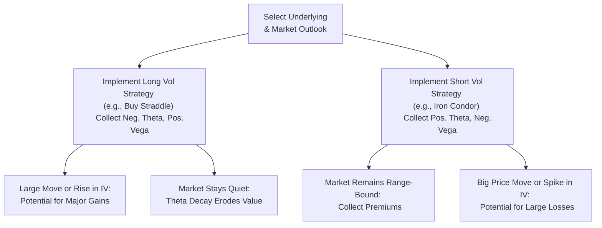

## 20.2 Long and Short Volatility Approaches

Have you ever watched a movie trailer that promised wild plot twists but actually delivered very little drama? That’s kind of what it’s like to be ready for big price swings in the market but end up facing stagnation or mild moves. In options trading, when you anticipate big market movements, going “long volatility” is your jam. But sometimes, you may expect the market to remain downright sleepy. In that scenario, you might choose a “short volatility” strategy. Anyway, both sides can be profitable—or risky!—depending on how the actual volatility plays out.

Below, we'll explore the different ways you can gain exposure to volatility, whether you want to harness major price swings or, ironically, bet that they won’t happen. We’ll go through the mechanics, the pros and cons, and some personal anecdotes that might help you understand what it actually feels like to live through these strategies. Then, we’ll check out the relevant Canadian regulatory aspects (hello, CIRO) and highlight a handful of widely used tools and references to keep in your strategic arsenal.

Long Volatility: Embracing the Swing

When you think of “long volatility,” imagine you’re preparing for the big fireworks show on Canada Day. You are paying for a front-row seat—through the option premium—in hopes that the sky indeed lights up with spectacular bursts. In financial terms, going “long volatility” generally means you profit when there’s a big price move in the underlying asset. It also means you’re more vulnerable to time decay (Theta). If the fireworks fizzle out early or arrive too late, your valuable premium drips away each day.

What Is “Long Volatility” Exactly?
Long volatility positions typically involve buying options—maybe a straddle or a strangle—where you stand to profit if implied or realized volatility ramps up. If the market experiences a big jump or plunge, you get to cash in on that robust movement. Let’s break down the main variations on this theme.

Long Straddle
A long straddle is one of the most straightforward ways to be long volatility. You buy a call and a put with the same strike price and expiration. If the underlying asset makes a large enough move in either direction, one of these options will gain significant value. But, if the market stays stagnant, both options lose time value, causing your position to bleed premiums daily.

Long Strangle
A long strangle is similar—except you buy a call and a put with different strikes, usually out of the money. Strangles are cheaper to set up than straddles but require an even bigger price movement to become profitable. Think of it like waiting for lightning to strike just the right place: You pay a smaller total premium (good for your initial cost), but you need an even bigger jolt in the market to make serious gains.

Bullish or Bearish Single Options
You may also choose to buy a single call or put if you anticipate that implied volatility will jump in tandem with a specific directional move. Although this approach focuses more on directional bets, you still benefit from an uptick in implied volatility (Vega) if it occurs. However, time decay and an incorrect directional guess can quickly erode your premium.

Pros of Long Volatility
• Unlimited upside potential. If the underlying asset “goes to the moon,” your call option or straddle can produce huge profits.  
• Managed downside. The maximum loss you can incur is the total premium paid.  
• Straightforward to implement. Buying calls, puts, or combinations is fairly direct.  

Cons of Long Volatility
• Time decay is painful. If the anticipated price move or volatility spike doesn’t happen soon, you watch your premiums melt away.  
• Premium costs can be high. In times of big market uncertainty, implied volatility is already high, making options expensive to buy.  
• Must manage “Greek” exposures (especially Theta and Gamma).  

A Personal Anecdote on Long Volatility
I remember the first time I thought I was a genius for buying a straddle ahead of an earnings announcement. My “foolproof” logic was that the stock would obviously jump on any significant surprise. But the news landed exactly in line with expectations, and implied volatility collapsed literally right after the announcement. I woke up to find that both my call and put had lost major value overnight. That’s the heartbreak of time decay (and implied volatility crush) for you.

Short Volatility: Betting on the Calm

Now, let’s check out the flip side. What if you believe the fireworks show will be more of a dud, or that the underlying stock will fluctuate within a relatively narrow range? Or maybe you think implied volatility is a bit too high. Enter short volatility strategies. Here, you collect premiums from selling options or option combinations, hoping that time decay works in your favor.

Short Straddle
A short straddle involves selling both a call and a put at the same strike price and expiration. If the underlying price stays roughly near that strike, you capture premium as both options decay. This can be super profitable in a sideways market. But if the underlying suddenly leaps or dives, your losses could get painfully large if you don’t have a proper hedge in place.

Short Strangle
A short strangle is basically the same as a short straddle, but you sell an out-of-the-money call and put. The premium is typically less than for a short straddle, but your cushion against small-to-moderate price moves is wider because you’re using out-of-the-money strikes. Essentially, you make money “as long as nothing big happens.” The risk is the underlying blasts through the call strike or plummets through the put strike, leaving you with potential for large losses.

Iron Condor
If you want to reduce the risk inherent in short straddles or strangles, you can use an iron condor. This is a four-legged strategy that combines a bear call spread and a bull put spread. You collect net premium, but each short option is also “covered” by a farther-out long option, limiting your maximum possible loss. Iron condors can be good for folks who want an income-generating strategy in sideways markets while capping that absolute blowout risk.

Pros of Short Volatility
• Potential for steady income in range-bound markets. You collect premiums if the underlying doesn’t move drastically.  
• Benefits from time decay. Every day the underlying remains calm is a good day for short positions.  
• Typically sees a higher probability of partial profit. Many short volatility trades have a wide “breakeven” zone.  

Cons of Short Volatility
• Risk can be huge if the underlying moves sharply. Naked option writing can result in theoretically unlimited losses.  
• Implied volatility spikes can blow up your position. If volatility balloons, short options can become much more expensive to buy back.  
• Requires diligent margin management. Confidence in calm markets can turn to panic if the market unexpectedly rallies or sells off.  

A Personal Anecdote on Short Volatility
I once sold a short strangle thinking the market was in a total standstill. Everything was going well—I was even daydreaming about what I’d do with those “easy” profits. Then, a major political event hit the tape. The stock whipped way beyond my call strike in a matter of hours. Let’s just say I found out how fast “paper profits” can evaporate. So yes, short volatility can be amazingly lucrative until it isn’t.

The Role of Gamma and Vega

Both long volatility and short volatility strategies hinge on key Option Greeks: Gamma and Vega. Gamma describes how Delta (your directional sensitivity) changes when the underlying moves. A high positive Gamma typically belongs to long volatility positions: you benefit as the underlying moves because your Delta can expand in your favor. Meanwhile, short volatility trades usually come with negative Gamma: you lose if a big move suddenly occurs.

Vega, on the other hand, measures how much an option's price changes as implied volatility shifts. A strong positive Vega exposure means you’re cheering for volatility to rise (long volatility). Negative Vega means you profit if volatility goes down or remains stable (short volatility). The dance between Gamma and Vega can get complicated when markets experience sudden shocks. It’s also essential to note that Gamma and Vega risks can spike quickly if something unexpected (like a surprise central bank decision or unexpected earnings), hits the market.

Managing Net Theta

Theta is a frenemy. If you’re net long options, it’s your enemy because time decay chews away the value of your position daily—especially approaching expiration. If you’re net short options, Theta is your best pal, steadily rewarding you as each day passes without major turbulence. But sometimes, ignoring Gamma or Vega while chasing Theta is like ignoring a crack in a dam. If volatility or the underlying moves big time, your short option positions could flood your portfolio with steep losses. 

Regulatory and Margin Requirements

In Canada, the Canadian Investment Regulatory Organization (CIRO) sets standards for margin requirements and the approval process for trading derivatives. Formerly, Canada had two separate regulatory bodies (IIROC and the MFDA), but they merged to form CIRO in 2023. Here’s what you need to know:

• Approval for Naked Options: Going short volatility often involves short (naked) options. Most Canadian brokerage firms require advanced options trading approval and a margin account. CIRO also imposes guidelines on how much margin you need based on the risk of your position.  
• CIRO Minimum Margin: The margin you must hold changes with the implied volatility of the underlying, your account size, and other risk parameters. This can vary from firm to firm but must meet CIRO’s baseline requirements.  
• CDCC: The Canadian Derivatives Clearing Corporation is the central clearinghouse for equity, index, and other derivative products in Canada—like the Bourse de Montréal’s options. CDCC manages the margining process and ensures trades settle in a secure environment.  

Be sure to stay informed of the latest updates because margin requirements can shift—especially after periods of market turbulence, like what occurred during the pandemic-era volatility spikes.

Selecting an Approach: Questions to Ask Yourself

• Do I have a directional viewpoint, or is my thesis purely on volatility?  
• How much capital am I willing to risk or tie up in margin?  
• Am I prepared to continuously monitor Gamma and Vega?  
• Do I anticipate a volatility spike soon (e.g., upcoming earnings or economic data)?  

If you don’t have strong directional convictions but suspect the market could get rowdy, a straddle or strangle might be the right play. If you figure the market is likely to sleepwalk through the next few weeks, selling an iron condor or short straddle might suit you better.

Practical Tools and Resources

In Canada’s derivatives scene, you’ll find a few resources that can help refine your approach:

• Montréal Exchange Tools: The Montréal Exchange (Bourse de Montréal) offers strategy evaluation tools and simulators at www.m-x.ca/tools_en.php. These can help you visualize potential payoffs, break-even points, and Greeks for your trades.  
• CIRO (www.ciro.ca): Offers guidelines on margin requirements, regulatory updates, and minimum standards for derivatives licensing.  
• CDCC (www.cdcc.ca): Provides detailed info on clearing, risk management, and margin structures for Canadian listed derivatives.  
• Python Libraries: For those with a quantitative bent, Python’s pandas, NumPy, or PyMC frameworks can help you model volatility surfaces, run scenario analyses, and back-test short-vol strategies.  
• “Dynamic Hedging” by Nassim Nicholas Taleb: Love him or hate him, Taleb’s approach to hedging both basic and exotic options offers a deeper philosophical perspective on risk transfer, volatility behavior, and tail risks.

Case Study: Calendar Spread for Volatility

Sometimes traders create a calendar spread to exploit time decay differentials and changes in implied volatility across different expirations. For instance, you might buy a longer-term option (for example, three months out) and sell a shorter-term option (one month out) on the same underlying with the same strike. If short-term implied volatility is elevated—and you suspect it will drop after a specific event—the credit from the front-month option may offset some or all of the cost of the longer-dated option. However, if the underlying makes a huge move or if volatility shifts unexpectedly, the trade can become more complex quickly.

Consider a theoretical scenario with a technology stock known for big moves on earnings day:  
• Step 1: You buy a 90-day call with a strike of $50.  
• Step 2: You sell a 30-day call with the same strike.  
• Step 3: You expect the near-term implied volatility to come down after front-month earnings. Meanwhile, the back-month option might retain value if the market continues to anticipate significant longer-term moves.  

If your forecast is right, the short call expires worthless or cheapens significantly. Meanwhile, the value of your long call might hold up or even benefit from a slight rise in longer-term volatility if the company’s fundamental outlook shifts. 

Mermaid Diagram: Visual Overview of Long vs. Short Volatility

Below is a simple mermaid diagram illustrating potential high-level flows for a straddle (long volatility) vs. an iron condor (short volatility):

In this diagram, you see how the payoff changes with market scenario. If you’re long volatility and the underlying jumps or implied volatility surges, you’re happy. If it stays sleepy, you lose your premium. Conversely, if you’re short volatility and the market goes nowhere, you keep the premium. But if volatility explodes, your phone might ring with horrifying margin calls.

Risk Management and Best Practices

• Position Sizing: Whether you’re short or long volatility, keep your position size proportionate to your capacity for risk.  
• Hedging: Consider partial hedges or spreads to limit your maximum losses. An iron condor, for example, is a more conservative approach than a naked straddle.  
• Diversification: Don’t focus all your capital on a single underlying or single trade type, especially if it’s a biotech or tech stock known for monstrous surprise moves.  
• Monitoring: Keep tabs on your portfolio’s net Delta, Gamma, Vega, and Theta. Sudden changes in implied volatility can shift your exposure quickly, especially near major events.  
• Use Tools: From the Bourse de Montréal’s web-based payoff calculators to advanced Python-based modeling, take advantage of technology to stress-test your positions.  

Final Thoughts

Long and short volatility strategies can carry drastically different risk and reward profiles. Understanding how Theta, Gamma, and Vega interplay is crucial to managing these positions effectively. In real life, the challenge is that markets rarely move exactly as you predict. An essential part of mastering these strategies is a willingness to adapt—sometimes rapidly—to changes in volatility and underlying price movements. 

For ongoing learning, check out official CIRO publications about margin requirements and derivatives licensing, as well as advanced risk management literatures like “Dynamic Hedging: Managing Vanilla and Exotic Options” by Nassim Nicholas Taleb. Combine theory and practice: build hypothetical portfolios or paper-trade to get a feel for how volatility changes actually impact your bottom line. Then, once you’re comfortable with your approach, implement these strategies for real—hopefully with a balanced perspective and robust risk controls.

---

## Sample Exam Questions: Mastering Long and Short Volatility Strategies



### Which option Greek primarily indicates an option's sensitivity to implied volatility changes?

- [ ] Delta
- [ ] Theta
- [x] Vega
- [ ] Gamma

> **Explanation:** Vega is the option Greek that measures how much the value of an option changes in response to fluctuations in implied volatility.

### Which statement best describes the payoff characteristic of a long straddle?

- [x] Potentially unlimited gains if the underlying moves significantly in either direction
- [ ] Guaranteed profit regardless of market movement
- [ ] Profitable only if the underlying moves to the upside
- [ ] Profitable only if implied volatility declines

> **Explanation:** A long straddle involves buying both a call and a put at the same strike price. If the underlying moves strongly in either direction, one of the legs can increase substantially in value.

### A trader sells a short strangle and wishes to benefit from a calm market. Which pair of option Greeks do they typically have the greatest exposure to?

- [ ] Positive Delta, Positive Vega
- [x] Negative Vega, Negative Gamma
- [ ] Positive Vega, Negative Theta
- [ ] Negative Delta, Positive Gamma

> **Explanation:** Short strangle sellers have negative Vega (they want volatility to go down or stay low) and negative Gamma (they lose money if the underlying makes a big move).

### If your portfolio is net long volatility, what happens to your P/L if implied volatility increases suddenly?

- [x] Your portfolio value will likely increase
- [ ] It will cause your total Gamma to go negative
- [ ] It has no effect because long volatility positions are insensitive to implied vol
- [ ] Your portfolio value will automatically decrease

> **Explanation:** Net long vol positions have positive Vega, which means that an increase in implied volatility typically raises option premiums, benefiting the position.

### Which strategy is designed to limit maximum losses by pairing short options with further out-of-the-money long options?

- [ ] Calendar Spread
- [ ] Risk Reversal
- [ ] Long Call
- [x] Iron Condor

> **Explanation:** An iron condor combines a bear call spread and a bull put spread, limiting risk on both the upside and downside.

### One key advantage of using an iron condor instead of a naked short straddle is:

- [x] Maximum loss is capped
- [ ] It always generates more premium
- [ ] Margin requirements are the same so it adds no benefit
- [ ] It has unlimited profit potential

> **Explanation:** Adding long options to your short positions creates a spread that limits how much you can lose.

### A long strangle typically costs less in premium than a comparable long straddle because:

- [x] The strikes are further apart from the underlying market price
- [ ] The expiration dates are always shorter
- [ ] The call options used are always in the money
- [ ] Strangles cannot profit from a downside move

> **Explanation:** A long strangle involves buying out-of-the-money calls and puts, which cost lower premiums compared to at-the-money options used in a straddle.

### Under CIRO margin rules, short option sellers must:

- [ ] Hold no margin at all since it’s not required in Canada
- [x] Maintain sufficient capital to cover potential losses
- [ ] Post cash equal to the underlying’s market value
- [ ] Only post margin in a fully paid account

> **Explanation:** CIRO requires short option sellers to maintain margin that reflects the risk of their open transactions. This ensures capital sufficiency to cover potential losses.

### What is a calendar spread primarily used for?

- [ ] Speculating on a massive directional move
- [x] Capitalizing on time decay differences and potential shifts in implied volatility across expirations
- [ ] Hedging a synthetic long stock position
- [ ] Eliminating both Delta and Vega risk

> **Explanation:** A calendar spread involves selling a shorter-term option and buying a longer-term option at the same strike to exploit time decay differentials and potential changes in longer-term implied vol.

### True or False: Negative Gamma implies that a position will gain value if the underlying undergoes large price swings.

- [ ] True
- [x] False

> **Explanation:** Negative Gamma implies that a position loses value on large price swings. Positive Gamma benefits from big moves, while negative Gamma is harmed by them.


