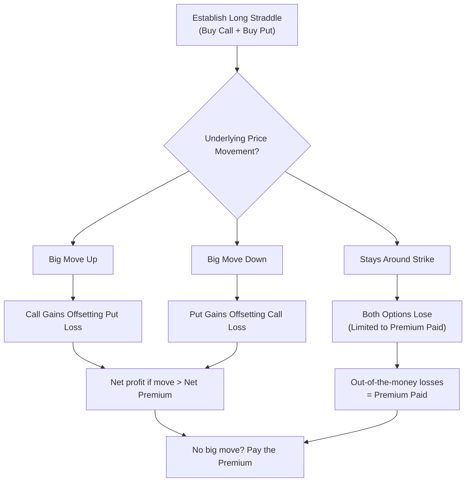

## 20.3 Straddles, Strangles, and Combinations

Sometimes, when we're uncertain about the market’s direction—maybe we think something huge is about to happen, but we’re just not sure which way prices might swing—strategies like straddles, strangles, and combinations can come in handy. Believe me, I vividly recall the first time I tried a straddle. The markets were buzzing with rumors of a big merger, and I just knew volatility could explode; but was it going up or down? I had no clue! A straddle seemed like the perfect solution at the time. In this section, we’ll walk through these volatility-based strategies, discuss how they can fit into trading objectives, highlight relevant Canadian regulatory considerations (like CIRO guidelines), and dive into best practices for risk management.

--------------------------------------------------------------------------------

### Why Volatility Strategies?

Before we talk specifically about straddles, strangles, and combinations, let's set the stage. Volatility strategies focus on addressing the following questions:

• Is the underlying price likely to experience big swings?  
• Is the direction uncertain?  
• Is implied volatility (IV) expensive or cheap relative to historical volatility?  

If these questions resonate with you, then you’ll probably find yourself exploring straddles, strangles, or more custom payoff combinations to harness (or reduce) volatility risk.

--------------------------------------------------------------------------------

### Understanding the Straddle

A straddle is one of the simplest ways to bet on volatility without picking a side. Here’s the basic structure:

• You enter two option positions simultaneously: one call and one put.  
• These options have the same strike price and the same expiration date (in other words, you use a single strike for both).

Because you’re either buying or selling both options, you can have a long straddle or a short straddle. Let’s break each scenario down.

#### Long Straddle

A long straddle is referred to as a “debit strategy,” because you pay a net premium to acquire both a call option and a put option at the same strike. The reason you might do this is simple: you anticipate a big move in the underlying price but have no idea which direction it will go. Often, companies about to announce earnings—or a commodity that’s on the cusp of some major news—are classic use cases.

• Potential gain: Essentially unlimited if the underlying moves sharply in either direction.  
• Maximum loss: The total premium you paid for the call and the put.  
• Breakeven points (at expiration):  
  - Upside breakeven = Strike + Net Premium  
  - Downside breakeven = Strike - Net Premium  

Your worst-case scenario is that the underlying price goes nowhere, and both your call and put expire out-of-the-money (OTM). You lose the entire premium. If the price rockets up or tumbles down, you’re potentially in the money on one of your options.

##### Example: Long Straddle on Tech Stock

Imagine you’re expecting a Canadian technology stock to move big-time after an upcoming product launch announcement. It’s currently trading at $100. You buy a call and a put—both with a $100 strike—for, say, $3 and $2 in premiums, respectively. The total premium outlay is $5 per share (times 100 shares per contract = $500).

• If the stock skyrockets to $110, your call might be worth about $10 in intrinsic value, while the put likely expires worthless. Your net profit is roughly $10 - $5 = $5 per share.  
• If the stock plummets to $90, your put could be worth about $10, your call worthless. Same net profit of $5 per share.  
• If the stock hovers near $100 and doesn’t move much, you likely lose the total $5 premium.

It’s a pretty straightforward concept. You just need that big move to justify the cost of both options.

#### Short Straddle

The short straddle is the flip side. You collect premium by selling both a call and a put at the same strike and expiry. You take in a credit up front but commit yourself to what can be significant risk if the underlying price makes major moves. This strategy is typically used when you believe the market is stable or volatility is overpriced and will shrink.

• Potential gain: Limited to the total premium you received for selling the put and call.  
• Maximum loss: Theoretically unlimited to the upside (if the call goes way in-the-money) and large to the downside (if the put goes deep in-the-money).  
• Breakeven points (at expiration):  
  - Upside breakeven = Strike + Net Premium Received  
  - Downside breakeven = Strike - Net Premium Received  

With a short straddle, your biggest risk is a sudden burst of volatility. Even though you collect the premiums, if the underlying moves significantly away from your strike, your losses can mount quickly. That’s why CIRO often imposes margin requirements and strict position limits to ensure you can handle adverse market moves.

--------------------------------------------------------------------------------

### Strangle: Similar Idea, Different Strikes

While the straddle uses the exact same strike for both call and put, a strangle uses different strikes. Typically, the put strike is below the current underlying price, and the call strike is above it. This makes the position cheaper to enter but requires a larger move in the underlying to reach profitability for a long strategy.

#### Long Strangle

You execute a long strangle by purchasing a call at a higher strike and a put at a lower strike. You’d do this if you’re anticipating a big move and want a lower initial cost than a straddle. However, bigger moves may be required to cover the premium outlay and generate profit.

• Potential gain: Can be large if the underlying makes a big swing either up or down.  
• Maximum loss: The total premium paid for both options.  
• Breakeven points: Further apart than with a straddle (one breakeven is above the call strike, the other below the put strike by at least the premium total).

##### Example: Long Strangle on Gold Futures

Let’s say you are actively trading gold futures listed on Bourse de Montréal (though most gold futures activity might be on larger global exchanges, we’ll keep a local theme). Gold is trading around $2,000 per ounce. You buy a slightly OTM call at a strike of $2,030 for $5 per ounce and a slightly OTM put at a strike of $1,970 for $7 an ounce, paying a total of $12 in premium. Since these call and put are further away from the money, the cost might be cheaper than an at-the-money straddle; but you now need gold to rise above $2,042 or drop below $1,958 (approximately) to see a profit at expiration.

If gold soars to $2,100, your call might be $70 in the money. Subtract your $12 cost, you net $58. If gold crashes to $1,900, your put could be $70 in the money, same net result. If gold hovers around $2,000–2,010, you likely lose the entire premium. It’s a balancing act of cost, time, and the size of the expected swing.

#### Short Strangle

A short strangle is when you sell an OTM call and an OTM put. This is somewhat “less risky” than a short straddle in that your breakeven points are wider—because you’re not short at-the-money options, but rather short out-of-the-money calls and puts. However, “less risky” is not the same as “safe.” If the market makes a massive move in either direction, you can face large losses.

• Potential gain: Limited to the premiums collected.  
• Potential loss: Potentially large to the upside or downside, though you do have some cushion because those strikes are not exactly at-the-money.  
• Margins: Typically, the margin requirements for short strangles can be hefty, and your brokerage (regulated under CIRO oversight) will check if your capital can support sudden volatility surges.

--------------------------------------------------------------------------------

### Combinations: Customizing Options Payoffs

In broader terms, “combinations” refer to multi-leg option strategies that combine calls and puts with various strikes and maturities. Sometimes folks call them “combo trades” or “risk reversals” or other names, depending on the specifics. Large institutions, hedge funds, or corporate hedgers often build such multi-leg structures to precisely tailor risk-and-reward profiles to their market outlook.

For instance, a “risk reversal” might be constructed by selling an out-of-the-money put to finance the purchase of an out-of-the-money call. This combination effectively expresses a bullish outlook with minimal net premium outlay. But there’s tail risk on the downside.

#### Why Institutions Love Combinations

• Custom Payouts: They can design payoff diagrams that precisely match their hedging or speculative needs.  
• Reduced Costs: Selling one option can offset the cost of purchasing another.  
• Regulatory and Capital Efficiency: Sometimes, certain combination trades receive margin credits from the Canadian Derivatives Clearing Corporation (CDCC) or other clearing institutions. Essentially, offsetting positions can reduce your margin requirement.  

##### Example: Corporate Hedging for a Canadian Exporter

A Canadian energy exporter might create a combination on crude oil to hedge potential downside risk while allowing for some upside participation. They could sell a call at a certain strike (collecting premium), and then use that premium to offset the cost of buying a put. The net result might be a “collar” or “risk reversal” that ensures a minimum sale price but caps the maximum revenue if prices spike beyond a threshold.

--------------------------------------------------------------------------------

### Key Risks of Straddles, Strangles, and Combinations

When I placed my first straddle trade, I thought, “Surely this is bulletproof. I can gain if the price goes up or down. What could go wrong?” Well, a lot can go wrong, especially considering the following factors:

• Sudden Changes in Implied Volatility (IV): If you’re long a straddle and implied volatility collapses, you may lose money even if the underlying moves somewhat. Conversely, if you’re short a straddle, a spike in implied volatility can hammer your P&L.  
• Gamma Risk Near Expiration: “Gamma” references the change in an option’s delta relative to changes in the underlying price. Near expiry, small moves in the underlying can produce big swings in P&L for short option positions.  
• Liquidity Risk: For wide or illiquid strike prices, you might face large bid-ask spreads. Attempting to enter or exit a strangle at illiquid strikes can quickly erode your premiums or near-term profits.  
• Unbounded Losses for Shorts: With short straddles or short strangles, the risk is extremely high if the underlying “gamma squeezes” or experiences an unforeseen price shock. Maintaining robust margin and risk management is crucial.  

--------------------------------------------------------------------------------

### Regulatory Considerations in Canada

As of 2025, the regulation of derivatives in Canada is under the Canadian Investment Regulatory Organization (CIRO). Historically, we had separate bodies like IIROC and MFDA, but those have merged. Here are some specific points to keep in mind:

• Position Limits and Reporting Requirements: CIRO sets position limits for short options strategies, especially short straddles or strangles where you can accumulate large open interest. Always check these before establishing big trades.  
• Bourse de Montréal (m-x.ca) Standard Specifications: The exchange’s website lists standard contract sizes, tick sizes, and strike intervals for equity, index, and futures options. If you’re setting up a strangle, you should be aware of how many points apart the strikes typically are.  
• CDCC Clearing Fees and Margin Credits: The Canadian Derivatives Clearing Corporation oversees clearing for the Bourse de Montréal. They can provide margin offsets (a “margin credit”) for spread or combination trades. Summaries of those rules can be found at cdcc.ca.  
• Market Integrity Rules: If you’re actively using advanced strategies, ensure compliance with all trade reporting requirements. If you’re an institutional desk, you might need to follow special guidelines on large block trades or cross trades.  

--------------------------------------------------------------------------------

### Practical Techniques and Tools

Because we’re dealing with multi-leg trades that can be complex, it’s helpful to use analytical tools to evaluate the probability of profit, breakeven points, sensitivity to changes in volatility, and so on. A few popular resources:

• R-based Packages: The “derivmkts” package on CRAN offers scenario analysis for multi-leg strategies. You can simulate the effect of changes in underlying price, implied volatility, or time decay.  
• Online Brokers: Many brokers host educational YouTube channels or live tutorials demonstrating how to place straddle or combo orders. Interactive tools can help you see P&L graphs in real time.  
• Option Analytics Platforms: Tools like OptionVue, ORATS, or even simpler apps can project Greeks (Delta, Gamma, Vega, Theta) and show how your position will evolve with price, implied volatility, and time.  

--------------------------------------------------------------------------------

### Example Payoff Diagrams (Conceptual)

Below is a simple mermaid diagram illustrating the logic flow for a long straddle’s payoff outcome. It’s not a strict x–y chart, but it shows how gains or losses might materialize depending on the underlying moving up or down.

In a real trading platform, you’d see a “V-shaped” payoff line for the long straddle at expiration. But this flowchart tries to highlight your main possibilities.

--------------------------------------------------------------------------------

### Real-World Scenario: Pre-Earnings Straddle on Canadian Blue-Chip

Let’s pretend a major Canadian bank has upcoming earnings, and there have been rumors about significant write-downs. Historically, the bank’s stock has hovered with minimal volatility. But if those rumors are true, the stock could plunge, or—if the rumors are exaggerated—the stock might soar back up once the numbers come out. You decide to enter a long straddle at the money. Suppose the stock is $80, and you buy an $80 call for $2 and an $80 put for $2, paying $4 total.

• If the rumors are true and the bank stock tumbles to $70, your put might have an intrinsic value of $10, for a potential $6 net gain after subtracting the $4 premium.  
• If the rumors are false and the stock rallies to $90, your call might net you a similar profit.  
• If the stock ends up around $80, both options expire worthless, and you lose your $4.

From a risk-reward standpoint, that $4 premium is your maximum loss. If you can’t stomach paying that amount for the potential that the stock might not budge, you shouldn’t enter the trade.

--------------------------------------------------------------------------------

### Best Practices

1. Use Probability and Volatility Studies  
   If you’re comfortable with using advanced analytics, check implied volatility levels. Are they unusually high? If IV is already inflated prior to a scheduled event, the cost of a long straddle might be too expensive to be profitable. Conversely, if IV is abnormally low, short volatility strategies might become more tempting.  

2. Keep a Close Eye on Time Decay  
   When you’re long a straddle or strangle, the clock is ticking. Theta (time decay) eats away at your premium daily, especially as you approach expiration. If a big move doesn’t occur soon, your position suffers.  

3. Manage Margin Requirements for Short Strategies  
   For short straddles or strangles, always confirm your margin requirements with your brokerage. CIRO mandates minimum margin requirements, but many brokerages add “house” requirements on top for advanced strategies.  

4. Consider Rolling Approaches  
   If you’re short a straddle and the market starts moving quickly, it can be wise to “roll” your options to new strikes to adjust your deltas and remain neutral. If you’re a long premium buyer and the underlying moves a bit but not enough to profit, sometimes rolling your strikes or adjusting your expiration can salvage some time value.  

5. Liquidity and Execution  
   Choose actively traded underlyings. Wide bid-ask spreads can undermine these strategies, especially if you need to exit quickly. The Bourse de Montréal’s official website (m-x.ca) shows liquidity data and market depth for Canadian-listed options.  

6. Stress Test with Realistic Assumptions  
   Tools like R’s “derivmkts” or paid analytics suites can help you run scenario analyses. Try out “what if underlying moves up 10%, down 10%, and implied vol changes by +5 or -5 points?” This helps clarify potential outcomes before you commit capital.  

--------------------------------------------------------------------------------

### References and Additional Resources

• CIRO Website – http://www.ciro.ca – for current regulations, margin rules, position limits, and guidelines on options.  
• Bourse de Montréal – https://www.m-x.ca – for contract specifications, market data, rules, and product listings.  
• CDCC – https://www.cdcc.ca – for clearing-related details, margin offsets, and risk management guidelines.  
• R “derivmkts” Package – https://cran.r-project.org – for open-source analytics on options and derivatives.  
• Options Education – Many online brokerage platforms offer free webinars, YouTube videos, and tutorials guiding you through multi-leg strategies.  

--------------------------------------------------------------------------------

## Sample Exam Questions: Straddles, Strangles, and Combinations



### A trader sets up a long straddle with a call and a put at the same strike and expiration date. What is the trader’s maximum possible loss?

- [ ] Unlimited, as the underlying could move against both options.
- [ ] None, because the call and put offset each other.
- [x] The total premium paid for both options.
- [ ] The difference between the strike price and the underlying price.

> **Explanation:** In a long straddle, the worst-case scenario is that both options expire worthless, so the trader loses the net premium paid.

---

### Which of the following is a key difference between a long straddle and a long strangle?

- [ ] A long straddle has unlimited risk, while a long strangle has limited risk.
- [x] A long strangle typically has different strikes for the call and the put, while a long straddle uses the same strike.
- [ ] A long straddle is always entered at zero net cost.
- [ ] A long strangle only involves ITM options.

> **Explanation:** A straddle uses the same strike for call and put, while a strangle typically uses different strikes (one above and one below the current market price).

---

### In a short straddle, the strategy profits the most if:

- [ ] The underlying experiences a massive breakout.
- [x] The underlying remains relatively stable around the strike price.
- [ ] Implied volatility spikes sharply after you enter the trade.
- [ ] Time decay is minimal.

> **Explanation:** A short straddle involves selling a call and put at the same strike and benefits from minimal movement because both premiums can decay profitably if the price stays near the strike.

---

### When trading a short strangle, one unique risk compared to a short straddle is:

- [ ] Lower margin requirements in all cases.
- [ ] There is no difference; strangles and straddles are identical.
- [ ] The inability to roll positions before expiry.
- [x] The strikes are further from the current price, so the underlying must move more before the loss occurs, but potential losses remain very large.

> **Explanation:** A short strangle sells OTM options, offering a wider “profit range.” However, if the market moves beyond those strikes, the resulting losses can still be large.

---

### Which of the following terms refers to the net premium you receive when initiating a short options strategy?

- [ ] Debit
- [x] Credit
- [ ] Intrinsic Value
- [ ] Break-Even

> **Explanation:** A short options strategy is a “credit strategy” because you collect (receive) premium upfront.

---

### A risk reversal typically involves:

- [x] Selling one OTM put and buying one OTM call, or vice versa, to structure a directional bet with limited cash outlay.
- [ ] Buying both a call and a put at the same strike.
- [ ] Selling both a call and a put at the same strike.
- [ ] Buying two calls at different strikes.

> **Explanation:** A risk reversal is a combination strategy in which an investor sells an out-of-the-money put and buys an out-of-the-money call (bullish), or the reverse (bearish), to manage cost while expressing a directional view.

---

### Which organization in Canada primarily oversees margin requirements and position limits for derivatives after 2023?

- [ ] The Investment Industry Regulatory Organization of Canada (IIROC)
- [ ] The Mutual Fund Dealers Association (MFDA)
- [ ] The Canadian Derivatives Clearing Corporation (CDCC)
- [x] The Canadian Investment Regulatory Organization (CIRO)

> **Explanation:** Following the merger of IIROC and MFDA, CIRO is now Canada’s self-regulatory body responsible for overseeing derivatives and investment dealers.

---

### How can a trader mitigate “gamma risk” in a short straddle as expiration approaches?

- [x] By rolling or adjusting option strikes to re-center around the underlying’s price and reduce delta exposure.
- [ ] By increasing the size of the short straddle.
- [ ] By ignoring implied volatility changes.
- [ ] By purchasing additional shares of the underlying after expiration.

> **Explanation:** Rolling short options to new strikes or further expiries can help manage the gamma risk that intensifies near maturity.

---

### A long strangle on a stock is best suited for which type of market outlook?

- [x] An expectation of a large price swing but uncertainty about the direction.
- [ ] A slow, sideways market where nothing changes.
- [ ] A market with no chance of volatility expansion.
- [ ] A guaranteed upward price trend.

> **Explanation:** A long strangle’s strength is capturing large moves up or down; you just need enough volatility to exceed your total premium cost.

---

### True or False: Selling a short straddle provides the seller with unlimited profit potential if the underlying price remains stable.

- [ ] True
- [x] False

> **Explanation:** Selling a short straddle has a limited profit potential (the collected premium). The profit is never unlimited because you can only keep the premium you initially received.


