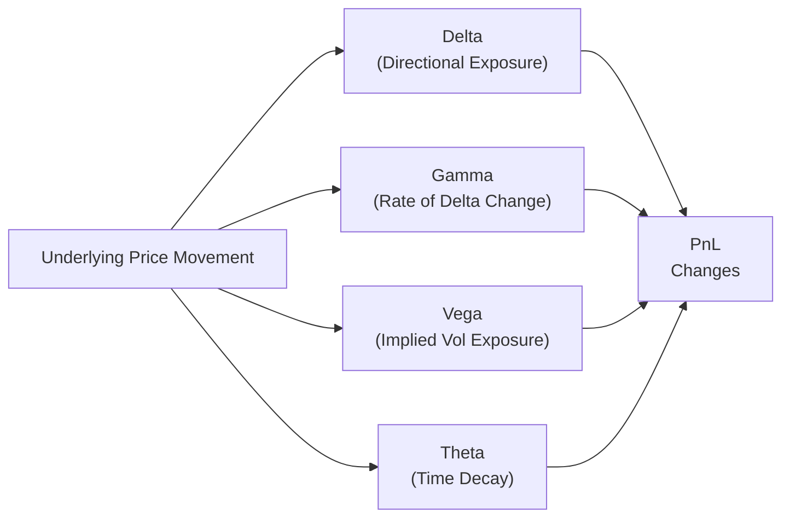

## 20.4 The Role of Greeks in Volatility Strategies

Volatility strategies can sometimes feel like a mysterious corner of options trading—one loaded with cryptic letters, complex formulas, and an ever-changing market mood. But if you can grasp the core “Greeks” (Delta, Gamma, Theta, and Vega), you’ll unlock the key factors that drive option prices and shape your potential profits or losses. Below, we’ll walk through the main Greeks, discuss how they affect volatility trades, and peek at advanced concepts like Gamma scalping and Vanna/Vomma exposure. By the end, you should have a more confident grasp of how to manage a position’s changing risk profile over time. And, believe me, once you see how these Greeks fit together, it’s a lot less intimidating than it looks.

Feel free to use official resources—like the Bourse de Montréal’s option calculator, online libraries such as QuantLib, or the Chicago Board Options Exchange (CBOE) tools—to measure these Greeks and see how they evolve. Also, keep in mind that in Canada, CIRO remains the national self-regulatory organization overseeing everything from derivatives training to industry standards, so if you need official guidance or continuing education modules on advanced volatility strategies, head to their website at https://www.ciro.ca.  

---
  
Understanding the Greeks is one thing, but knowing how to use them in an actual volatility strategy can be the real game-changer. Let’s take a look at each Greek one by one in the context of volatility trading, then dig into how they interact in a real-world scenario.

Delta Considerations in Volatility Trading

When we talk about volatility strategies, we often begin by aiming for a “Delta-neutral” stance. A Delta-neutral portfolio means the overall Delta of the position is (roughly) zero, so short-term changes in the underlying’s price won’t dramatically impact the strategy’s initial profit-and-loss (PnL). This is useful if you’re focused more on capturing changes in implied volatility or taking advantage of time decay mechanics, rather than predicting the direction of the underlying.

But here’s the catch: If the market moves against you or in your favor (it might do both in the same trading day, ironically!), your net Delta can quickly shift away from zero. That means ongoing adjustments, called re-hedging, might be necessary if you’re strictly trying to keep the position Delta-neutral. These re-hedging trades can be part of Gamma scalping (more on that soon).  

Quick personal anecdote: I recall sitting in a coffee shop on a hectic trading afternoon, trying to maintain Delta neutrality on a straddle position. The underlying stock jumped right after an unexpected earnings leak, and I had to scramble to rebalance my Delta twice in a single hour. Every adjustment brought me back to neutral, but the stock kept moving enough that by the end of the day, I was almost exhausted from all the micro-hedging. This kind of scenario really highlights why you can’t just “set and forget” a Delta-neutral strategy—especially in a volatile market.

Gamma and the Art of Scalping

Where Delta measures the sensitivity of an option’s price to changes in the underlying, Gamma measures the sensitivity of Delta itself. In simpler terms, Gamma tells you how quickly your Delta is accelerating or decelerating as the underlying moves.  

For instance, if you’re long a straddle (a call and a put at the same strike), you have positive Gamma. Whenever the underlying moves significantly—either up or down—you can offset the newly created Delta by selling (if the underlying moves up) or buying (if it moves down) a small quantity of the underlying shares. This process is known as Gamma scalping.  

Gamma scalping is typically done on a short timeframe. You’re letting the underlying whip around, hoping that the net result of these small scalps accumulates a profit. If the underlying barely moves, Gamma scalping might not be very lucrative, but if the underlying sees plenty of back-and-forth motion, these little scalps can add up nicely.

You’ll often see professional traders watching their Gamma exposure closely, especially as expiration nears. That’s because Gamma tends to spike for at-the-money options near expiration, and the speed of Delta changes is more pronounced. Although a high positive Gamma can be lucrative if done right, it usually comes with negative Theta (time decay costs), which can be painful if the underlying just sits still. Striking a balance is paramount.

Theta: The Clock Is Ticking

Theta is, in many ways, the “time thief” for option buyers. If you hold a long call or a long put, Theta is the “rent” you pay every day for the chance of big moves in your favor. In volatility strategies that rely heavily on potential price swings—like a straddle, strangle, or other “long vol” approach—Theta decay will show up daily, eroding your option premiums if the moves you anticipated do not materialize.

So, if you’re long a bunch of options (positive Gamma, positive Vega), you might be conscious of how much Theta your portfolio is losing each day. The bigger your Theta bill, the more you need the underlying to move around (and hopefully churn out those profitable Gamma scalps) to pay for it. Conversely, if you’re short volatility (e.g., writing straddles or strangles), Theta is in your favor—you’re effectively collecting that daily rent—though the risk is if a large move occurs, your short vol position may encounter sudden, large losses.  

In short: For every “Theta collector” salivating over the daily time decay, there’s the risk that the market might deliver a big surprise move. Whether you’re long vol or short vol, Theta is a key lever that will influence your profit or loss.

Vega: The Main Event for Volatility Traders

If you’re in a volatility strategy, Vega is often the star of the show. Vega measures how much option prices change for each 1% change (in point terms) in implied volatility (IV).  

• Positive Vega: A long straddle or long strangle typically has positive Vega, so you profit if implied volatility rises. If the market environment shifts from calm to stormy, that boost in IV will increase the value of your options, even without a change in the underlying price.  
• Negative Vega: A short straddle or short strangle is negative Vega, meaning you want IV to stay the same or drop. If implied volatility plunges, your short options become cheaper to buy back, handing you a profit.

But implied volatility doesn’t move in a vacuum. Market sentiment, upcoming earnings announcements, macroeconomic data releases, and even corporate news can all nudge or jolt implied vol. That’s where real-world context—like how interest rate decisions from the Bank of Canada might affect overall volatility—matters a lot.  

Remember, you don’t have to guess market direction if you’re running a long volatility strategy. Sometimes, you believe the market is about to “wake up” because of upcoming news. If you’re correct and implied vol shoots up, your long vol trade may win, even if the underlying price barely budges.

Diagram: Greeks in Action

Below is a simple Mermaid diagram that shows how changes in the underlying price can affect your Greeks and, consequently, your PnL. It’s simplistic, but it should illustrate how each Greek is interdependent with the underlying market moves.

As you can see, changes in the underlying price can shift Delta, which can then be accelerated by Gamma. Simultaneously, shifts in the market’s perception of future volatility will affect your Vega exposure, and the passage of time itself constantly grinds away (Theta), all feeding into your ultimate profit or loss.

Maintaining a Delta-Neutral (or Not-So-Neutral) Approach

You might hear about “Delta-neutral” strategies that center on volatility exposure, but it’s rarely just a matter of opening a position and walking away. Over time, as the market evolves, your Delta may drift. Maybe you sold some puts and calls to create a short strangle positioned at the money. Suddenly, the underlying creeps to the upper range of your short call strike, giving you a net negative Delta. If you still want to remain neutral, you must buy some of the underlying or other call options to offset that negative Delta—this is your re-hedging.

Of course, re-hedging can chip away at your overall profit if done too frequently or at unfavorable prices. On the flip side, ignoring your drifting Delta might turn your “market neutral” strategy into a de facto bullish or bearish bet. The sweet spot is striking a balance that matches your risk tolerance and market forecast.

Gamma Scalping and PnL

Gamma scalping is often described as a dynamic rebalancing act: you’re constantly adjusting Delta to capture small, repetitive gains from short-term fluctuations in the underlying price. In an ideal scenario, the underlying sees enough intraday or day-to-day movement to offset the Theta costs of holding those long options. But watch out: if the market is dead quiet, you’ll spend money on the option premiums (losing Theta) without recouping it through frequent, profitable scalps.

Some advanced traders let algorithms handle these fast in-and-out trades. They set parameters, such as how often to check Delta, how large the price move should be before rebalancing, and how to manage transaction costs. Others prefer a hands-on approach, scanning the market themselves and stepping in whenever Delta moves beyond a certain threshold.

Volatility Smile, Skew, and Advanced Greeks: Vanna & Vomma

In real-world markets, implied volatility isn’t always flat across strikes and maturities. You might see a volatility “smile” or “skew,” where out-of-the-money puts or calls command different implied vol levels compared to at-the-money options. This can reflect the market’s fear bias (higher demand for out-of-the-money puts) or upside mania (higher implied vol for out-of-the-money calls in hot markets).

Sophisticated volatility traders look beyond just Vega. Two advanced Greeks that sometimes come into play are Vanna and Vomma:

• Vanna measures how Delta changes relative to changes in implied volatility. In other words, if IV changes, what happens to your Delta?  
• Vomma measures how Vega changes relative to changes in implied volatility. If IV spikes, how does your Vega exposure morph?

These are typically more relevant to big institutions or specialized traders running large, complex portfolios. Still, even if you’re a smaller player, it’s valuable to grasp that implied vol shifts can create second-order effects on your position.

Practical Example: A Long Straddle in Action

Imagine you establish a long straddle on a stock trading at CAD 50. You buy a 50 call and a 50 put, each with one month to expiration. Your aim: profit from big moves in any direction or from a rise in implied volatility.  

• Delta: Right after you purchase both at-the-money options, your net Delta might be close to zero (Delta-neutral).  
• Gamma: Because both options are at the money, Gamma might be relatively high. If the stock rallies to CAD 55, your call picks up a high positive Delta. You can sell some shares or short the underlying to offset that newly positive Delta. If the stock then drops to CAD 49, your put picks up negative Delta, and you can rebuy (cover) some shares to get back to neutral.  
• Theta: Each day, especially if the stock doesn’t move, you lose some time value. If by day five the stock is still at CAD 50 and implied volatility is unchanged, you’re losing Theta without much hope to scalp.  
• Vega: If implied volatility spikes for whatever reason—maybe an unexpected economic event—your call and put premiums both rise. Even if the stock is still at CAD 50, you could close out the straddle with a profit, purely on increased implied vol.

Such a position can be quite thrilling (or stressful), and each Greek is part of a live tapestry that shifts with every tick in the stock and changes in the option market.

Risk Management and Regulatory Oversight

In Canada, CIRO requires strict oversight on how derivatives and options strategies are handled, especially for retail clients who might not fully appreciate the complexity of volatility trades. If you’re a registered individual or a supervised representative at a CIRO member firm, you’ll need to ensure you’re meeting margin requirements, abiding by suitability rules, and staying within any position limits set by the Bourse de Montréal.  

In practice, you’ll see margin expansions if the exchange or your firm perceives greater risk. For instance, a large short strangle might require more capital if volatility rises. Ongoing monitoring of a client’s risk profile and frequent trading patterns is also part of the standard procedure. Keep in mind that your client relationship model (CRM) guidelines also require you to keep the client informed about the strategy’s risks and potential for large losses, particularly if they’re involved in short volatility trades.

Tools and References

• CIRO Continuing Education Modules. For advanced option strategies, you can head to https://www.ciro.ca for official guidelines and ongoing training modules.  
• Bourse de Montréal’s Options Calculator. The Bourse provides a handy online tool to calculate each option’s Greeks. Great for scenario testing.  
• “Volatility Trading” by Euan Sinclair. This book offers practical Gamma scalping techniques and advanced volatility modeling approaches.  
• QuantLib. An open-source library that can help you compute Greeks (including advanced Greeks like Vanna/Vomma) for academic or real-world trading use.  
• CBOE Tools (www.cboe.com). The Chicago Board Options Exchange remains a large global hub for options, and they provide numerous free tools that can incorporate both U.S. and global market implied volatility data.  

It’s also worth comparing how volatility is handled on other global exchanges like the CME in the U.S. or Eurex in Europe. Sometimes the same essential concepts apply but with different underlying products, different margin rules, or slightly different regulatory frameworks.

Best Practices and Common Pitfalls

• Constant Monitoring: If you’re dealing with positive Gamma (and negative Theta), be prepared to watch the screen carefully. Large price swings can be a gift, but if your attention drifts, you might miss profitable scalping opportunities.  
• Cost-Benefit Analysis of Rehedging: Hedging Delta too often can rack up transaction costs and slippage. Hedging too seldom can let you get stuck with a big directional exposure you never intended.  
• Watch Volatility “Smile” or “Skew”: If you see a large skew, it might alter your strategy. For instance, if out-of-the-money puts are extremely expensive, you might choose to sell them or buy them—depending on your view of downward risks.  
• Avoid Over-Leverage: Volatility products can generate huge swings in PnL quickly. Make sure your position sizing is consistent with your risk tolerance and capital.  
• Understand the Advanced Greeks: For smaller positions, you might only need to track Delta, Gamma, Theta, Vega. But if you run larger or more nuanced trades, keep an eye on Vanna and Vomma since changes in implied volatility can have second-order consequences for your PnL.

Wrapping Up

Volatility strategies rely on balancing the interplay of Delta, Gamma, Theta, and Vega—plus some advanced Greeks like Vanna and Vomma. The daily fluctuations in the underlying’s price, as well as changes in implied volatility, can make or break your trade. And those quiet moments where nothing happens can be just as important, especially if Theta is eating away at your long vol positions.

At the end of the day, these strategies can be really rewarding, but—like many advanced bells and whistles—they require you to be on your toes. Incorporate the available tools from the Bourse de Montréal and global open-source libraries, keep tabs on CIRO regulatory guidelines, and always re-evaluate your positions against actual market conditions. With proper risk management, consistent monitoring, and a dose of humility, volatility trading can become a valued tool in your options arsenal.

---

## Sample Exam Questions: The Greeks and Volatility Trading Fundamentals



### Which Greek best represents the rate of change of an option’s Delta as the underlying price moves?

- [ ] Delta
- [x] Gamma
- [ ] Vega
- [ ] Theta

> **Explanation:** Gamma tells you how Delta changes for small changes in the underlying price. If you have a high Gamma, your Delta will quickly become either very positive or very negative as the underlying fluctuates.

### A Delta-neutral strategy often needs rebalancing because:

- [ ] Time value remains constant throughout the life of the option.
- [x] Underlying price changes can shift the originally neutral Delta balance.
- [ ] Option premiums never fluctuate.
- [ ] Vega remains constant.

> **Explanation:** Even if you start out with a net Delta of zero, changes in the underlying’s price can create new directional exposure. Rebalancing restores neutrality if that’s your goal.

### If you hold a positive Vega position (e.g., a long straddle), you primarily benefit from:

- [ ] A decrease in interest rates.
- [ ] A decline in implied volatility.
- [x] An increase in implied volatility.
- [ ] Rapid time decay.

> **Explanation:** Positive Vega means the value of your position increases if implied volatility rises, which typically makes options more expensive.

### Theta, also referred to as time decay, indicates:

- [x] How much an option’s value decreases with the passage of time, all else being equal.
- [ ] How rapidly implied volatility shifts when the market moves.
- [ ] The speed at which Delta changes when VIX changes.
- [ ] How dividends affect an option’s price.

> **Explanation:** Theta measures the time-based erosion of an option’s price when other factors (e.g., price, volatility) remain unchanged.

### What is Gamma scalping?

- [ ] The act of closing out a Delta-neutral trade.
- [ ] A technique for hedging currency exposure.
- [x] A strategy where traders rebalance Delta frequently to capture small profits from short-term price movements.
- [ ] A method of pricing exotic options.

> **Explanation:** Gamma scalping involves frequently adjusting your Delta position to profit from market “wiggles.” If you are long Gamma, each short-term move in the underlying can be hedged back to neutrality, potentially locking in small gains.

### In a long straddle with one month to expiration, what is a major risk if the market doesn’t move as expected?

- [x] The position’s value could erode due to Theta decay.
- [ ] The position will automatically convert into a swap.
- [ ] You risk negative Vega if volatility rises.
- [ ] Dividends triple the cost of the strategy.

> **Explanation:** With a long straddle, you have positive Gamma and positive Vega, but you’re also subject to significant time decay (Theta). If the underlying stays put, those options can bleed value quickly.

### When implied volatility “smiles” around out-of-the-money puts, it suggests:

- [ ] The underlying’s price is stable.
- [x] There is a market bias or fear, pushing up the valuation of OTM puts.
- [ ] The cost of OTM calls is always cheaper.
- [ ] Theta is higher for in-the-money options.

> **Explanation:** A volatility smile or skew often indicates that OTM puts (or calls) command higher implied vol pricing due to perceptions of tail risk, fear, or other market biases.

### Vanna measures:

- [x] How an option’s Delta changes in response to changes in implied volatility.
- [ ] How an option’s Vega changes for each day that passes.
- [ ] The number of times you must rebalance to remain Delta-neutral.
- [ ] How volumes shift after a major news announcement.

> **Explanation:** Vanna is an advanced Greek that tells you the sensitivity of Delta to changes in implied volatility.

### Vomma measures:

- [ ] How an option’s Delta changes over time.
- [x] How an option’s Vega changes in response to changes in implied volatility.
- [ ] The positional adjustment required to remain market-neutral.
- [ ] Daily fluctuations of trading volume.

> **Explanation:** Vomma is an advanced Greek that indicates how Vega itself changes when implied volatility moves, which can matter in large or complex portfolios.

### True or False: Delta, Gamma, Theta, and Vega are irrelevant for a buy-and-hold investor who never trades options.

- [x] True
- [ ] False

> **Explanation:** Strictly speaking, if you only buy equities or bonds and never touch options, you might not need to track these Greeks day-to-day. Greeks specifically quantify risk exposures within options or derivative strategies. However, many advanced equity and fixed-income traders still monitor implied vol indirectly.


