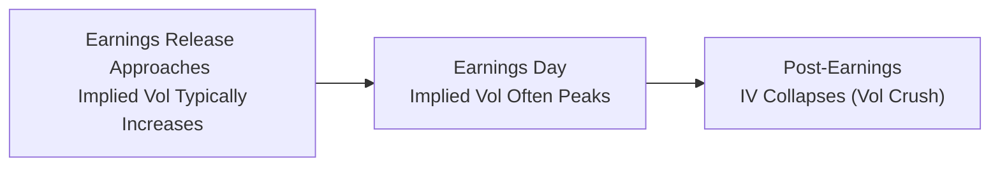

## 20.5 Volatility Crush & Earnings Plays

Sometimes, you’ll hear traders chatting about the “vol crush” like it’s this big, mysterious creature that strikes right after a major announcement—commonly, an earnings release. They’ll say things like, “Watch out for IV crush,” or “The premium just vanished into thin air after the call.” Now, this might sound super dramatic, but it’s actually a straightforward concept once you unpack it. In this section, we’ll dive deep into what “volatility crush” is, why it’s relevant, and how traders might set up strategies around earnings to play (or avoid) a potential meltdown in implied volatility (IV).

Before we jump in, let me share a quick personal story. The first time I tried to trade an earnings announcement, I was so sure that “XYZ” stock was going to pop because all the analysts seemed super bullish. I bought a bunch of short-dated call options, crossing my fingers that I'd at least double my money. Well, the stock did go up—just a little. The next morning, I was baffled to see my calls actually drop in value, even though the stock price was a fraction higher. So yeah… that was me learning all about the dreaded “volatility crush.” Let’s make sure you’re better prepared.

  
### What Is a Volatility Crush?

When folks talk about a “volatility crush,” they’re referring to a quick collapse in implied volatility. Typically, implied volatility tends to rise heading into a big news event—like earnings—because everyone expects the stock to make a large move. That extra anticipation gets priced into options as a higher implied volatility level, boosting their premiums (especially for near-dated options).  

But as soon as the event passes (for instance, the day after earnings are announced), the uncertainty is removed. Everyone now knows the results, the guidance, the new product announcements—whatever might have been revealed. Because that big question mark is answered, implied volatility often plummets. In many cases, it drops faster than you can say “option premium.”  

This is the “IV crush.” It’s basically the market exhaling, saying “Okay, now we know,” and drastically marking down the option prices to reflect a more stable, post-event outlook.

  
### Pre-Earnings Strategies

A lot of traders get excited about buying options just before earnings, hoping for that big move. Maybe you buy calls if you expect an upside surprise, or you scoop up puts if you think the earnings are going to disappoint. This approach is fueled by the possibility that the stock will shoot up or tumble down more than the market expects.  

But here’s the rub: If the stock’s actual move is smaller than what the implied volatility had “predicted,” the option might lose value despite the price move happening in your favor. That’s because the implied volatility—already priced high in anticipation—collapses after the announcement, cutting down the option’s premium.  

In other words, the “earnings volatility premium” you're paying for is like a built-in risk premium for uncertain outcomes. If that uncertainty doesn't manifest into a large enough price swing, the “vol crush” can overshadow the small gains you made from a correct directional call.  

  
#### Example: Small Post-Earnings Move

• Let’s say “ABC” stock is at CAD 100 before earnings.  
• The at-the-money (ATM) call option that expires in one week is priced at CAD 4. That’s an implied volatility that suggests the expected move could be, say, ±6%.  
• You think: “This stock is definitely headed to at least CAD 107! I’ll buy that call.”  
• Earnings come out, and the stock moves to CAD 102—so it’s up 2%.  
• However, the implied volatility drops from, let’s say, 60% to 30% right after the earnings are released. Now that call might only be worth CAD 2.75—despite the move in your direction—because of the vol crush.  

Yes, it’s kind of painful. The underlying moved in your favor, but the newly reduced implied volatility caused your option’s premium to shrink, overshadowing some or all of your gains.  

  
### Post-Earnings Strategy

On the other side of the coin, you’ll find folks who like to sell premium into earnings. The logic is, “Hey, implied volatility is super high, so if the actual move is smaller than predicted, those pricey options might become worthless fast.” Essentially, they want to collect that inflated premium before it deflates.  

But going short premium is no free lunch. The risk is that the stock could move significantly more than predicted, meaning a huge adverse difference for your short position. If you sold calls and the stock skyrockets 20%, or you sold puts and it craters, you might lose a lot—fast.  

Often, traders might use vertical spreads to limit that risk. For instance, if you believe the implied volatility is too high, you could sell an at-the-money straddle (calls and puts) just before earnings. If the actual move is smaller than the implied range, you might profit as both the calls and puts diminish in value post-announcement. But if you’re wrong, watch out.  

  
### Why Does Timing Matter So Much?

Options traders always talk about “timing is everything,” and it’s especially true around earnings. For event-driven trading to make sense, you have to understand the “expected move.” Many traders quickly estimate that by adding the cost of the at-the-money call and put for the expiration right after the news.  

If the call is trading at, say, CAD 3.00 and the put is also at CAD 3.00, the total combined premium is CAD 6.00. This suggests an expected move of roughly ±6%. If you believe the actual move might be bigger (±8% or 10%), maybe you’d prefer to buy premium. If you think the market has overestimated the likely swing, you might sell premium.

  
### How the Earnings Volatility Premium Works

Think of it like a “temporary tax” on option buyers. Right before a binary event (an earnings release, a regulatory approval, or maybe a major product announcement), implied volatility spikes. That's the “risk premium” that happens when no one is quite sure if the news will be “good, bad, or ugly.”  

Once the event is over, a big chunk of that extra premium disappears, sometimes almost instantly, resulting in a drop in implied volatility—i.e., the IV crush. This pattern is so common around earnings that some traders make it their bread and butter, focusing each quarter on event-driven trades across multiple companies.  

  
### Advantages and Disadvantages – Quick Glance

Below is a quick summary of the pros and cons of both sides (buying or selling) around earnings:

| Approach            | Potential Advantages                                          | Potential Disadvantages                                          |
|---------------------|--------------------------------------------------------------|------------------------------------------------------------------|
| Buy Options Pre-E   | • Possible big payout if stock moves beyond expected range   | • Elevated IV makes options expensive   • Risk of IV crush even if direction is correct |
| Sell Options Pre-E  | • Benefit from high premiums if the move is limited   • Quick time decay on near-dated options | • Risk of large, unexpected swings   • Margin requirements can be high |
| Wait Until Post-E   | • Less IV uncertainty after results   • Possibly find directional trades without inflated IV | • Miss out on big gamma moves   • If the stock has already moved, the best opportunity might be gone |

  
### The Canadian Angle: CIRO Margin Rules and Other Guidelines

Because we’re in Canada, let’s talk about the regulatory context. CIRO (the Canadian Investment Regulatory Organization) keeps an eye on margin requirements and risk controls for traders who use options in this manner. When you sell short-dated options, especially around earnings announcements, you might be subject to additional margin or risk-based haircuts if your positions are considered high-risk.  

Generally, event-driven trades can have large overnight swings, and regulators want to ensure you’ve got sufficient capital backing those trades. If you’re working at an investment dealer, or you’re implementing these tactics in institutional accounts, your firm’s risk desk may enforce even tighter rules during earnings season.  

  
### Practical Example: Timing a Volatility Crush Around Earnings

Let’s consider you’re trading “CDE Corp” with near-dated options, expiring this Friday. Today is Monday, and earnings are Wednesday morning before the open:

- Monday (T-2 days to earnings): Implied volatility is inching up as more traders position for a potential big move.  
- Tuesday (T-1 day to earnings): Often, implied volatility could spike even further, especially if rumors swirl or competitor earnings come in surprising.  
- Wednesday (earnings day): Once the results are out, the stock opens for trading. Within minutes, implied volatility might drop from (for example) 70% to 35%. That’s a massive crush.  
- Thursday (post-announcement): If the news was generally in line with expectations, the stock might be stable, and IV remains low. If the news was shocking, the underlying moves significantly, and implied volatility might still be somewhat elevated but typically lower than the pre-event peak.  

If you had bought calls on Tuesday and the stock soared, you could be in good shape, but you better hope it soared enough to offset the IV crush. If you sold premium on Tuesday, you might gain from the collapse in implied volatility, provided the move stays within the range you predicted.

  
### Mermaid Diagram: Typical Volatility Timeline

Below is a simplified flowchart of how implied volatility often behaves around an earnings event:

Notice how implied volatility builds as the event draws near, then peaks around the time of the announcement, and finally collapses once that uncertainty is removed.

  
### Common Pitfalls and Best Practices

• Holding Options Into Earnings Without Understanding IV: If you don’t realize how much of the premium is “event premium,” you could be disappointed even if you guess the direction correctly.  
• Overleveraging Short Options: Selling options around earnings can be lucrative, but the risk of an outsized move is real. Always respect margin rules—and your own risk tolerance.  
• Overlooking the “Expected Move”: The simplest but often overlooked metric to gauge how big a swing the market is pricing in.  
• Believing the Company’s “Post-Earnings Drift” is Guaranteed: Some stocks do show patterns of continuing to move after news, but that’s not guaranteed. If you bank on a post-event drift that never comes, you might get stuck.  
• Ignoring Liquidity in Near-Dated Options: The bid-ask spreads can be wide, especially if you’re trading right before the event. Slippage can be painful.  

  
### Using Real-World Tools and Data

Modern trading technology in Canada and around the globe can help you analyze implied volatility around earnings:

• Data Platforms: Refinitiv, Bloomberg, and other terminals provide implied volatility surfaces and historical data. You can quickly see how the IV changes into and out of an event.  
• OptionStrat (optionstrat.com): A user-friendly web-based tool that visualizes potential option strategies, showing you possible profit/loss and implied volatility shifts (though always cross-check with official data from your broker or a professional platform).  
• Bourse de Montréal’s Educational Portal: The Montréal Exchange regularly updates market insights and has an options simulator for those who want to practice.  
• “Trading Options at Expiration” by Jeff Augen: A deep dive into short-term strategies, including how to handle the last few days of an option’s life, which is very relevant during earnings.  

  
### Event-Driven Trading in Broader Context

Earnings aren’t the only time we see volatility spikes. Any “binary event” with uncertain outcome can do the same: mergers and acquisitions, regulatory approvals, or macroeconomic announcements. However, earnings are the most common and recurring events for individual stocks. This cyclical nature (every quarter) makes them a popular playground for both beginners and experts in the options space.  

  
### A Case Study

Let’s do a quick hypothetical example to make the concepts tangible:

1. Stock FGH Inc. trades at CAD 120 a week before earnings.  
2. The at-the-money straddle (call + put) that expires one day after earnings costs CAD 8 total. This implies the market expects about a 6.7% move (8/120 ≈ 0.067).  
3. You suspect the real move might be closer to 10%—maybe because of new product news. So, you buy that straddle. Here’s the result after the announcement:

   - The earnings come out. Turns out, the company had a blowout quarter, and the stock jumps to CAD 135 (a 12.5% move).  
   - Even though implied volatility fell significantly, your longs still gain enough because the underlying soared well beyond the expected range. The calls are now worth a packet, so your net position is profitable.  
   - Alternatively, if the stock had only moved to CAD 125, a 4% move, you might have found that your expensive straddle actually decreased in value post-crush.  

  
### Strategy Execution and Risk Management

In Chapters 5 (Speculating with Futures Contracts) and 6 (Basic Features of Options), we talked about risk management tools like stop-loss orders and using technical or fundamental analysis. Applying them here is equally important. You might:

• Set a maximum loss threshold for your pre-earnings position.  
• Close out half of your positions ahead of time if implied volatility is exceptionally high.  
• Use multi-leg strategies, such as iron condors, if you anticipate a range-bound reaction.  

Whenever you dabble in event-driven trades, keep the possibility of unexpected outcomes in mind. Even “boring” companies can surprise the market—and you—when you least expect it.

  
### Canadian Regulatory Notes

Because event-driven trades can lead to large overnight swings, CIRO’s** (Canadian Investment Regulatory Organization) guidelines for margin are there to protect market participants from undue risk. Your broker or firm may require:

- Additional margin for accounts with a high concentration in near-term options around earnings.  
- Stress-tested scenarios to see if your account can handle a large overnight gap.  

In institutional contexts, compliance departments often carefully track these positions to ensure they meet both internal risk policies and CIRO rules.  

> **Historical Note on SROs**: Prior to January 1, 2023, Canadian investors and firms dealing with derivatives were overseen by the Investment Industry Regulatory Organization of Canada (IIROC) and the Mutual Fund Dealers Association of Canada (MFDA). These entities amalgamated into CIRO, which is now the single national self-regulatory organization.  

  
### Final Thoughts on Volatility Crush & Earnings

Volatility crush is neither a friend nor an enemy—it’s just part of the options game. Some traders love to trade around it, others prefer to avoid the manic unpredictability of earnings altogether. Whichever side you fall on, be sure you understand how implied volatility works, how to factor in the “expected move,” and what your personal risk tolerance can handle.  

As I learned the hard way: never assume that a small stock price increase or decrease will be enough to guarantee profits on a long option trade during earnings. The same goes for short premium positions: you might collect a neat chunk of premium, but if you’re dead wrong on direction, it can blow up just as quickly.  

The best approach? Study. Experiment with small trades. Keep data-driven logs of how your predicted moves compare to actual results. Explore resources like OptionStrat and the Bourse de Montréal’s educational portal. And if you want to get super in the weeds, Jeff Augen’s book, “Trading Options at Expiration,” is a deep dive into many short-term tactics that revolve around implied volatility shifts.

  
### References and Further Reading

- Bourse de Montréal – Educational Portal: https://www.m-x.ca/  
- CIRO (Canadian Investment Regulatory Organization): https://www.ciro.ca  
- “Trading Options at Expiration” by Jeff Augen.  
- OptionStrat Visual Strategy Tool: https://optionstrat.com  
- Refinitiv and Bloomberg for real-time implied volatility data.

  
## Sample Exam Questions: Volatility Crush & Earnings Plays



### Which statement best describes a “volatility crush”?

- [ ] A gradual increase in implied volatility leading up to an event.  
- [ ] A situation where time decay drastically accelerates on expiration day.  
- [x] A rapid decline in implied volatility after an anticipated news event.  
- [ ] A short-term increase in option premiums before market close.  

> **Explanation:** “Volatility crush” typically occurs immediately after an event (like earnings) removes uncertainty, causing implied volatility to drop sharply.

---

### What is a key risk of buying options right before an earnings announcement?

- [ ] Increased time decay.  
- [x] The possibility that the implied volatility will drop significantly after earnings, reducing the option’s premium.  
- [ ] Lower liquidity in the options market.  
- [ ] The absence of any significant price move in the underlying asset.  

> **Explanation:** Even if the underlying moves in your favor, a post-event implied volatility drop can reduce, or even offset, any gains.

---

### Which of the following strategies might profit most directly from a post-earnings volatility crush?

- [ ] Buying a long straddle right before the earnings release.  
- [ ] Buying out-of-the-money calls and puts simultaneously after the announcement.  
- [x] Selling a straddle or strangle right before the earnings release.  
- [ ] Purchasing deep in-the-money calls well after the announcement.  

> **Explanation:** Selling a straddle (or strangle) before earnings can help capture premium from the pre-event vol spike. If the actual move is less than implied, you profit when implied volatility collapses.

---

### The “expected move” around an event is often estimated by:

- [x] Adding the premiums of the at-the-money call and put.  
- [ ] Subtracting the put premium from the call premium.  
- [ ] Reviewing the stock’s historical volatility for the previous year.  
- [ ] Only looking at the implied volatility of the out-of-the-money calls.  

> **Explanation:** A quick way to gauge the expected range is summing the at-the-money call and put premiums for the relevant expiration.

---

### In Canada, which entity regulates margin requirements and market integrity for options trading?

- [ ] IIROC (Investment Industry Regulatory Organization of Canada)  
- [x] CIRO (Canadian Investment Regulatory Organization)  
- [ ] MFDA (Mutual Fund Dealers Association of Canada)  
- [ ] OCC (Options Clearing Corporation)  

> **Explanation:** Since January 1, 2023, CIRO is Canada’s national self-regulatory body overseeing investment dealers, mutual fund dealers, and marketplace integrity on equity and debt markets.

---

### Which term describes the extra implied volatility priced into options just before a key announcement like earnings?

- [ ] Time value premium  
- [ ] Moneyness premium  
- [x] Earnings volatility premium  
- [ ] Skew premium  

> **Explanation:** The “earnings volatility premium” is the additional IV that options carry leading up to an earnings release.

---

### A “binary event” is best described as:

- [ ] A repeated event with negligible impact on volatility.  
- [x] A pivotal occurrence (like a merger approval) that can drastically move a stock.  
- [ ] An event that doubles the underlying’s price automatically.  
- [ ] Two or more events released at the same time.  

> **Explanation:** “Binary event” typically refers to something that can sharply alter the stock price, with one of two main outcomes (e.g., an approval or rejection).

---

### After earnings, implied volatility typically:

- [ ] Increases further as more traders buy options.  
- [x] Decreases because uncertainty is resolved.  
- [ ] Stays about the same.  
- [ ] Becomes zero for all strike prices.  

> **Explanation:** Once the market receives the new information, implied volatility generally contracts “post-event.”

---

### If a trader believes the expected move implied by options is too big, they might:

- [ ] Purchase a long call for the event.  
- [ ] Buy a put to protect downside.  
- [x] Sell premium, for example, through a straddle or strangle.  
- [ ] Avoid trading altogether.  

> **Explanation:** If you feel the implied move is overstated, you might sell those expensive options, anticipating a smaller actual move that erodes the premium.

---

### True or False: Even if a stock moves in your favor after earnings, an implied volatility drop can reduce the value of your long option.

- [x] True  
- [ ] False  

> **Explanation:** The post-event volatility crush can offset gains from favorable underlying price movement if the move is not large enough.


