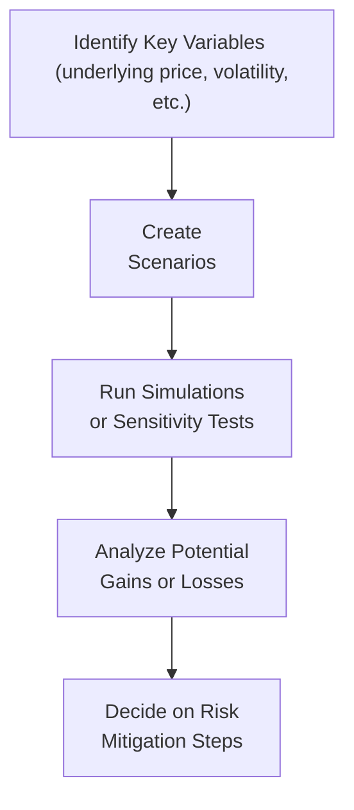

## 20.6 Options Stress Testing & Risk-Adjusted Returns

Stress testing and risk-adjusted returns probably sound like big, intimidating topics in the world of options trading, but—trust me—they’re your best friends when it comes to taming the wild beast of market volatility. I remember a time when I was trying out a new volatility strategy on a small energy stock. Everything looked stellar on paper, but I hadn’t really tested how things might play out if the market took a sudden nosedive. And guess what? It did. Let’s just say I learned a thing or two about the importance of stress testing. In this section, we’re going to explore how to prepare for those out-of-the-blue market storms using a variety of tools and techniques that go far beyond just peeking at a candlestick chart.

## Stress Testing: Why Bother?

Maybe you’re thinking, “My model says I’m good to go with this call spread. Why complicate it?” Well, because markets are full of surprises—sometimes nice ones, sometimes not so much. Stress testing is about imagining and modeling extreme scenarios, like a sudden 10% drop in the underlying stock or the implied volatility (IV) on your options doubling overnight. These tests can help you:

• Understand potential losses under worst-case conditions.  
• Prepare or adjust your hedges accordingly.  
• Sleep a little better because you have a plan if things go off the rails.

### The Basics of Stress Testing

Most stress testing involves taking one or more critical parameters—like price, volatility, or interest rates—and shifting them dramatically to see what happens to your P&L (profit and loss). Some folks might do a quick “what-if” scenario: “What if the underlying price gaps down by 8% tomorrow?” Others might simulate entire pathways of stock prices or vol levels over the next month using something like a Monte Carlo approach.

Below is a simple diagram of the general stress testing workflow:

Each node highlights a distinct step: you figure out which variables matter, conjure up some hypothetical scenarios, run simulations, check the results, and then decide whether you need to hedge more or scale back your position.

## Comparing Realized vs. Implied Volatility

Volatility strategies, like straddles or strangles, often rely on the notion of whether implied vol (IV) is “fairly priced.” If you consistently overpay for options premium, you could lose money even when the underlying wiggles around the way you expected it to. That’s because the implied vol embedded in the prices of those options might be higher than what actually comes to pass—i.e., the realized volatility (RV) of the underlying’s day-to-day moves.

• Realized volatility is the actual daily price movement, measured statistically (often using standard deviation).  
• Implied volatility is what the market thinks volatility will be in the future, embedded in the option’s premium.  

A significant part of stress testing is seeing how your strategy holds up if realized volatility falls short of what you paid for in implied volatility. For example, if your short straddle collects a high premium and the realized moves end up being quite small, you’re in luck. Conversely, if you buy a high-IV option that never quite meets the lofty volatility expectations, you can see your returns dwindle.

## Risk-Adjusted Performance Metrics

It’s not enough just to say, “I made money!” or “I lost money!” That doesn’t always reflect the amount of risk you took along the way. A more holistic approach looks at risk-adjusted returns, which bring both performance and volatility of performance into the equation.

### Sharpe Ratio

The Sharpe Ratio is a very common risk-adjusted metric. It’s basically:


\text{Sharpe Ratio} = \frac{(R_p - R_f)}{\sigma_p}


where:  
• \\( R_p \\) = your portfolio (or strategy) return  
• \\( R_f \\) = the risk-free rate (like T-bills)  
• \\( \sigma_p \\) = portfolio’s standard deviation of returns  

A higher Sharpe Ratio suggests you’re earning more excess return per unit of risk (volatility). In plain speech, if you have a Sharpe Ratio of 1.5, you’re doing pretty well. If it’s negative, well, better luck next time.

### Sortino Ratio

The Sortino Ratio is a cousin to Sharpe but only grabs the downside volatility in the denominator:


\text{Sortino Ratio} = \frac{(R_p - R_f)}{\text{Downside Deviation}}


This helps if you believe that upside volatility shouldn’t punish your risk metric. Maybe your strategy does fine with wild upside swings, but you only want to penalize the downside risk.

### Value-at-Risk (VaR)

Value-at-Risk (VaR) tries to answer a rather uncomfortable question: “How much could I lose, with a certain level of confidence, over a specific time period?” For example, a 95% 1-day VaR of \$100,000 means you expect not to exceed \$100,000 in losses with 95% probability, based on historical or modeled distributions. Keep in mind, though, that VaR can lull you into a false sense of comfort if the distributions show “fat tails” or if something truly crazy happens in the market (like a flash crash).

### Conditional VaR (CVaR)

Conditional VaR, sometimes called Expected Shortfall or CVaR, tries to improve on VaR by looking at what your average losses might be if you do exceed that VaR threshold. It focuses on tail risk—in other words, those catastrophic events that catch everyone off guard.

## Scenario Analysis

Think of scenario analysis as your “choose your own adventure” in the options world. You might consider what happens to your iron condor if the underlying leaps 5% after an earnings report. Or maybe you combine two or more factors: the stock drops 10%, and implied volatility doubles, and interest rates inch up by 50 basis points. This can be incredibly helpful for positions that have complex Greek exposures (like gamma, vega, etc.) or multiple legs.

### Historical Simulation vs. Hypothetical Scenarios

There are two broad flavors of scenario analysis:

• Historical Simulation: Plug in real market data from memorable time frames—like the 2008 financial crisis or the March 2020 COVID-19 meltdown—to see how your current positions would have fared.  
• Hypothetical Scenarios: Sometimes history doesn’t give you the exact blueprint for what might come next. In that case, you can conjure up your own “what-if” worlds—maybe the underlying gets a takeover bid, or prices crash because of a macroeconomic shock, or implied correlation among your portfolio holdings jumps through the roof.  

Both approaches have their place. Historical data is presumably “real,” but the future might not strictly follow any past pattern. The key is to remain flexible and open-minded about potential outcomes.

## Monte Carlo Simulations

Ah, Monte Carlo. The name alone sounds more like a casino than a risk management technique. But that’s sort of the point—Monte Carlo simulations run a huge number of random trials to capture a wide range of possible future outcomes. For example, you can randomize daily price moves and implied volatility changes according to some statistical distribution you believe in (e.g., lognormal for price, mean-reverting for volatility, or something more exotic). You then look at the distribution of your strategy’s P&L over hundreds or thousands of simulated paths. This method can reveal the probability of large drawdowns that a single deterministic scenario might miss.

## Regulatory and Compliance Considerations in Canada

With the newly established Canadian Investment Regulatory Organization (CIRO), the scrutiny on derivatives usage is high, particularly for retail-oriented products. The Canadian Securities Administrators (CSA) also issue staff notices providing guidelines on stress testing frameworks for institutions that deal in derivative-based products. In a compliance scenario, your firm might have to demonstrate robust stress testing procedures and ensure that margin calculations meet or exceed CIRO’s standards.

If you’re curious about margin implications, the Bourse de Montréal has a handy Margin Calculator (available at [www.m-x.ca](https://www.m-x.ca)) where you can plug in partial scenarios to gauge your margin requirements under different price and volatility conditions.

## Tools and Open-Source Resources

You don’t have to buy a pricy enterprise system to do decent stress tests. Many practitioners use Python with libraries like PyMC or TensorFlow Probability to run advanced simulations. R offers packages like “quantmod” and “PerformanceAnalytics” that can help with historical data analysis, VaR, and CVaR. If you want robust coverage, have a look at “Risk Management and Financial Institutions” by John C. Hull, which offers a wealth of practical examples and theoretical underpinnings.

## Implementing Stress Testing in Practice

So, you have your model all set, your positions are placed, and you’re pretty comfortable with your strategy. Now the question is: how do you actually do stress testing day to day?

• Identify Key Exposures. Check how much of your portfolio’s risk is concentrated in vega (sensitivity to volatility) or delta (sensitivity to price moves). This is where the concept of Marginal Risk Contribution can help.  
• Define Stress Levels. For each exposure type, define some standard stresses, such as ±10% price moves, ±30% implied vol changes, or ±1% interest rate changes.  
• Run Simulations Regularly. Some traders do this daily if they’re very active, while others do it weekly.  
• Adjust Positions if Warranted. If your stress tests consistently show an unacceptable drawdown in certain scenarios, it might be time to reduce your position size, buy some protective options, or tweak your hedges.  

## Case Study: Volatility Strategy on a Banking ETF

Let’s say you’re running a long straddle on a major Canadian banking sector ETF that’s usually stable but can get wild during certain periods, like after central bank announcements. Implied volatility is at 20%, which is historically on the high side for this ETF. You suspect that the market might be overpricing risk. You place the trade, thinking you’ll profit from big moves, but you also realize you could lose if the ETF barely moves and that 20% IV turns out to be inflated.

1. Stress Test 1: Underlying Moves Sideways  
   • If the ETF price barely budges and realized volatility ends up at 10%, your long straddle will decay quickly.  
   • By simulating a lower realized volatility environment, you see you might lose half your premium in a month.  

2. Stress Test 2: Big Crash + Vol Spike  
   • If the ETF suddenly loses 8% in two days and the implied volatility spikes from 20% to 35%, your long straddle might actually be profitable if you can exit near the peak of vol.  
   • Your test indicates a strong chance of turning a profit, but you’d need the discipline to close out quickly before mean reversion in volatility.  

3. Stress Test 3: Mildly Bullish Drift  
   • If the ETF moves up slowly, your put might erode, but your call might gain. You might end up slightly in the money or break even if you manage the position well.  
   • The test suggests you may need to dynamically delta-hedge if the call gains traction.  

By running these scenarios, you adjust your mental (and capital) preparedness for what might happen, helping avoid panic decisions if that big move actually occurs.

## Common Pitfalls and Best Practices

• Pitfall: Overreliance on Historical Volatility  
  – Market regimes change, so historical vol might not match future conditions.  

• Pitfall: Ignoring Liquidity  
  – When volatility spikes, bid–ask spreads can widen. All that P&L you see on paper might be tough to lock in at a good price.  

• Pitfall: Not Accounting for Correlation  
  – If you have multiple positions across correlated underlyings (e.g., multiple bank stocks), their losses might stack in an extreme scenario.  

• Pitfall: Blind Faith in Models  
  – Models are only as good as their assumptions. Extreme events sometimes defy normal distribution or even fat-tail approximations.  

• Best Practice: Combine Different Methods  
  – Use both historical simulations and hypothetical “what-if” scenarios, plus a sprinkling of Monte Carlo.  

• Best Practice: Keep an Eye on Margins  
  – Under stress, your required margin can balloon, forcing you to exit at the worst possible time.  

• Best Practice: Ongoing Review  
  – Stress testing isn’t a one-and-done exercise. Make it part of your routine—particularly on days when major economic data or earnings releases could rock the markets.  

## Putting It All Together

Options stress testing is about more than just surviving the next market storm; it’s about thriving through any condition by having a clear and adaptable plan in place. Whether you’re exploring a short strangle on a highly liquid index or a specialized gamma scalping strategy in a thinly traded stock, modeling your risk under extreme conditions is absolutely essential.

Additionally, measuring your results on a risk-adjusted basis—through metrics like the Sharpe Ratio, Sortino Ratio, VaR, and CVaR—gives you a full picture of how well you’re managing your capital. A lot of folks get enamored with big returns but fail to notice that they’re swinging for the fences with enormous risk. Don’t get caught in that trap.

So the next time you’re set to launch (or adjust) your options strategy, take a moment to pause and ask yourself: have I tested how my position might behave if the market does something truly unexpected? Because if there’s one thing we know about markets, it’s that the unexpected is the norm.

## Additional Resources and References

• CIRO Guidelines: Check [www.ciro.ca](https://www.ciro.ca) for official guidance on derivatives risk disclosure and best practices for retail and institutional investors.  
• CSA Staff Notices: Search the Canadian Securities Administrators’ website for staff notices referencing stress testing procedures.  
• “Risk Management and Financial Institutions” by John C. Hull: Offers an in-depth look at VaR, CVaR, and many more risk management tools.  
• Bourse de Montréal Margin Calculator: [www.m-x.ca](https://www.m-x.ca) – helpful for partial scenario calculations.  
• Python Libraries (PyMC, TensorFlow Probability), R Packages (quantmod, PerformanceAnalytics): Excellent for modeling and simulations.  

Stay curious, test your assumptions, and remember that a good defense is just as important as a good offense when it comes to trading. Happy stress testing!

---

## Sample Exam Questions: Options Stress Testing & Risk-Adjusted Returns



### Which of the following best describes the purpose of stress testing an options strategy?

- [ ] To immediately close any unprofitable options position.
- [x] To model how a portfolio might perform under extreme or unexpected market conditions.
- [ ] To guarantee risk-free profits under all market scenarios.
- [ ] To avoid paying commissions on trades.

> **Explanation:** Stress testing helps traders see how their positions might behave in extreme market moves, ensuring they have mitigation strategies in place.

### When considering realized volatility (RV) versus implied volatility (IV), which statement is correct?

- [ ] Realized volatility is always higher than implied volatility.
- [ ] Implied volatility is determined only by historical price movements.
- [x] Realized volatility reflects actual market moves, while implied volatility reflects market expectations.
- [ ] Realized and implied volatility are always equal in efficient markets.

> **Explanation:** Realized volatility is a statistical measure of actual historical moves, whereas implied volatility incorporates traders’ expectations of future moves.

### The Sharpe Ratio is calculated by:

- [x] (Portfolio Return – Risk-Free Rate) / Portfolio Standard Deviation
- [ ] (Stock Return – Bond Return) / Beta
- [ ] (Gross Revenue – Taxes) / Trading Commissions
- [ ] (Portfolio Return – Default Risk) / Market Correlation

> **Explanation:** The Sharpe Ratio measures how much excess return is achieved per unit of total risk (standard deviation).

### What is a primary limitation of Value-at-Risk (VaR)?

- [ ] It measures upside potential, not downside risk.
- [ ] It is always overly conservative and leads to reduced trading.
- [x] It does not capture what happens beyond the threshold of maximum expected loss.
- [ ] It has no relationship with market volatility.

> **Explanation:** VaR only tells you the loss threshold you might not exceed with a certain probability but doesn’t describe the size of losses if that threshold is exceeded.

### How does the Sortino Ratio differ from the Sharpe Ratio?

- [ ] The Sortino Ratio uses risk-free returns squared in its formula. 
- [x] The Sortino Ratio penalizes only downside volatility, unlike the Sharpe Ratio which penalizes total volatility.
- [ ] The Sortino Ratio omits transaction costs.
- [ ] The Sortino Ratio penalizes only upside volatility.

> **Explanation:** The Sortino Ratio focuses on downside deviation, reflecting the idea that volatility above the mean (i.e., beneficial moves) shouldn’t reduce your risk-adjusted performance measure.

### Which of the following describes Scenario Analysis in the context of options strategies?

- [ ] Only looking at historical data from one specific year to gauge performance.
- [ ] Using a single factor model to price calls and puts.
- [ ] Automatically adjusting positions based on margin calls.
- [x] Constructing “what-if” scenarios to analyze how an options strategy might behave under varied market conditions.

> **Explanation:** Scenario analysis involves exploring multiple potential futures—like big price swings, vol spikes, or interest rate changes—and seeing how each would affect your positions.

### Historical Simulation is:

- [ ] A way to incorporate random price movements using a lognormal distribution.
- [ ] A method of systematically increasing implied volatility by 10% to 20%.
- [x] Using actual past market data to see how your current strategy would have performed.
- [ ] Only for interest rate swaps.

> **Explanation:** Historical simulation backtests your strategy against real market movements in the past to gauge how it might behave in similar conditions.

### Which statement about Monte Carlo Simulations is true?

- [ ] They require perfect knowledge of future macroeconomic events.
- [x] They use random variables to simulate multiple potential future market paths.
- [ ] They cannot be used for options risk management.
- [ ] They only generate a single possible outcome.

> **Explanation:** Monte Carlo simulations involve randomized (or stochastic) inputs for price movements and volatility, allowing you to explore a wide range of possible market outcomes.

### A key pitfall of stress testing an options portfolio is:

- [ ] Over-diversification of the portfolio.
- [ ] Using both historical and hypothetical scenarios.
- [x] Overreliance on perfect distribution assumptions and ignoring correlation changes.
- [ ] Checking multiple market factors simultaneously.

> **Explanation:** Many traders rely on distribution assumptions (e.g., normal distribution) that may not hold in extremely volatile or correlated markets, leading to underestimation of tail risk.

### True or False: Conditional VaR (CVaR) is sometimes referred to as Expected Shortfall because it assesses the average of losses that exceed VaR.

- [x] True
- [ ] False

> **Explanation:** CVaR measures the expected loss beyond the VaR limit and is indeed called Expected Shortfall.


