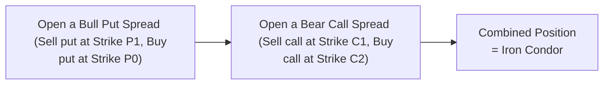

## 20.7 Iron Condors, Butterflies, and Other Volatility Spreads

Picture this: you’re sitting at your desk, sifting through charts, scanning for a stock that has been stuck in a comfortable little price range. You might think, “Hmm, if this stock just stays put (or wiggles only a bit), then maybe I can set up a trade that benefits from minimal price movement.” That’s precisely the type of situation where neutral-orientated option strategies like iron condors or certain butterfly spreads can be truly appealing. These strategies can also be adapted for more directional or higher-volatility scenarios, providing a fascinating array of ways to position yourself in the market. 

Below, we’ll dive into some of the most common multi-leg volatility spreads—like iron condors, butterflies, and diagonal spreads—and discuss how they’re used in practice. We’ll sprinkle in personal observations, dive into practical examples, highlight Canadian market nuances (especially with respect to the Bourse de Montréal and CIRO), and share some references and resources if you want to take it further.

---

### Iron Condors

An iron condor is a classic “short volatility” strategy, constructed by combining two credit spreads: 
• A bull put spread (sell one put, buy another put at a lower strike), and  
• A bear call spread (sell one call, buy another call at a higher strike).  

If that’s confusing, you’re not alone—very often, traders will zoom out and think: “Wait, why am I stacking these two spreads on top of each other?” The aim is to collect premium from both sides of the option chain, effectively betting that the underlying price will stay within the short strikes by expiration. If the underlying does remain in that sweet zone, the sold options expire worthless, and you keep the net premium received at inception.

#### Structure of an Iron Condor

• Buy 1 out-of-the-money (OTM) put with a low strike (the “lower wing”).  
• Sell 1 OTM put with a slightly higher strike (the “short put”).  
• Sell 1 OTM call with a higher strike (the “short call”).  
• Buy 1 OTM call with an even higher strike (the “upper wing”).  

The result? You have a defined-risk position. Your total maximum profit is the net premium credited to your account when you open the trade. Your maximum loss is limited to the difference between the strikes (of either spread) minus the net credit you received, multiplied by the contract multiplier (usually 100 for equity options).

Here’s a simple flow-style diagram using Mermaid to illustrate how the position is built:

In this flow:
• P0 < P1 < Current Price < C1 < C2  
• “P0 and P1” denote the strikes for the put leg, “C1 and C2” denote the strikes for the call leg.  

#### Example

Let’s say you believe TSX-listed Company X (trading around CAD 50) will remain fairly range-bound for the next month. You set up a 48/49 bull put spread (selling the 49 put and buying the 48 put) for a net credit of CAD 0.30, and a 51/52 bear call spread (selling the 51 call and buying the 52 call) for a net credit of CAD 0.25. That means you receive a total credit of CAD 0.55 per share. If Company X stays between CAD 49 and CAD 51 through expiration, you keep all CAD 0.55×100 = CAD 55 per contract, minus commissions. By contrast, if the stock drops below 48 or soars above 52, you’d lose up to the difference in strike minus total credit.  

Some folks love iron condors for their high “probability of profit” (since the stock just needs to stay within the sold strikes). But that doesn’t mean the strategy is risk-free. One big volatility spike or major news announcement can quickly push the underlying price outside your profitable zone.  

#### Why Use an Iron Condor?

1. **Range-Bound View**: If you strongly believe the underlying won’t make a large move soon—maybe it’s historically stable, or you see no major earnings announcements or central bank rate decisions on the horizon.  
2. **Implied Volatility Considerations**: You want to exploit relatively high implied volatility by collecting more premium. Short-vol traders often wait for implied volatility to spike so they can sell options at juicier prices.  
3. **Defined Risk**: An iron condor has a clear maximum loss, ideal if you don’t want the unlimited risk profile of a naked short strangle.  

#### Rolling an Iron Condor

Sometimes, markets don’t comply. Maybe your short put spread is under pressure because the underlying price is trending lower. You might “roll” that leg—closing the current short put spread and reopening a new one at lower strikes or a further expiration. Rolling can help manage risk or buy additional time.  

---

### Butterfly Spreads

A butterfly spread typically involves trades at three different strike prices, all with the same expiration. In its “standard” form, you might see this setup:  
• Buy one call at a lower strike,  
• Sell two calls at a middle strike,  
• Buy one call at a higher strike.  

Or the put version.  

This can be a long-vol strategy (where you buy “the wings” and sell the middle) or a short-vol approach (where you sell “the wings” and buy the middle).  

#### Long Call Butterfly (Debit) Example

Let’s say you buy 1 call at Strike K1, sell 2 calls at Strike K2, and buy 1 call at Strike K3, with K1 < K2 < K3. You pay a net debit. This strategy is typically used when you think the underlying might gravitate around the middle strike (K2)—but you’re not expecting drastic outsized moves. You profit the most if, at expiration, the underlying is right at K2.  

The range of max profit is limited, but so is your risk: your maximum loss is the net premium paid.  

#### Short Call Butterfly (Credit) Example

In a short butterfly, you effectively do the reverse: you sell one call at K1, buy two calls at K2, and sell one call at K3. The payoff often has an opposite risk/reward: you might collect a net credit, but risk a bigger potential drawdown if the underlying ends up near K2.  

#### Using Puts vs. Calls

Butterfly spreads can be constructed using only calls, only puts, or a combination. In practice, many traders choose the version that delivers the best net price or margin efficiency.  

#### Wings, Strikes, and Market Conditions

Sometimes you hear folks say, “I like wide-wing butterflies.” They’re talking about picking strikes that are relatively far apart (like a 10-point difference between each strike on an index). Such wide spreads generally cost more when you’re buying, but they can capture more potential profit if the underlying finishes near that center strike. Tighter-wing butterflies cost less but might have a narrower profit window.  

---

### Calendar and Diagonal Spreads

Calendar spreads (also called time spreads) involve options on the same underlying and same strike, but different expirations. A diagonal spread is similar, except the two options differ both in strike and expiration.  

If you sell a near-term option and simultaneously buy a longer-term option of the same type (call or put) for the same underlying, you can:  
1. Collect the theta (time decay) on the short, near-term option.  
2. Benefit from a potential increase in the value of the longer-dated option if implied volatility rises or if the underlying moves in your favor.  

Diagonals are especially popular among traders expecting some directional movement plus differences in implied volatility across different expirations. 

**Example**: A diagonal call spread might involve buying a call at a higher strike in a further-out month and selling a call at a slightly lower strike (or the same strike) in a nearer month. The idea is to manage the cost of the long call by collecting premium on the short call. If the market increments upward slowly or if front-month implied volatility is elevated, you might benefit from that difference.  

---

### Key Considerations

**Market Sentiment and Range-Bound Conditions**  
Iron condors and butterflies are often used when you perceive the market (or the underlying stock or index) to be range-bound or having limited upside/downside. On the other hand, a calendar or diagonal spread might be used if you think volatility in the near term might be different from longer-term volatility—in other words, if you anticipate a big announcement but think it’ll blow over in future months.

**Implied Volatility Environment**  
Selling options is generally more appealing when implied volatility is high relative to historical or realized volatility. Buying options can be more appealing when implied volatility is relatively low, though you must also consider the underlying’s potential to make large moves. Calendar and diagonal spreads, for example, rely on differences in volatility across several expirations (the volatility term structure).

**Potential for Swings Caused by Events**  
Earnings reports, central bank announcements, or ex-dividend dates can cause unexpected leaps in implied volatility. For instance, if the ex-dividend date is coming up and you hold a short call that’s near or in-the-money, assignment risk might increase. Just because you have a multi-leg strategy doesn’t mean you can ignore assignment or early exercise possibilities.  

**Margin Offsets**  
One practical advantage in Canada is that the Bourse de Montréal, in cooperation with the Canadian Derivatives Clearing Corporation (CDCC), typically allows margin offsets or reduced margin requirements for properly structured multi-leg option spreads. That means your capital efficiency can improve when you create an iron condor or a butterfly, because each spread leg offsets part of the risk of the others.

**Event-Driven Rolling Strategies**  
Some traders will build a multi-leg volatility strategy heading into a major company announcement, hoping to capture the “crush” in implied volatility after the event. You might set up a long butterfly if you expect the underlying to end up near a specific strike following the announcement, or perhaps an iron condor if you think the event hype is overblown. Once the event passes, implied volatility often declines, and that can help short-volatility strategies.  

**Observation Window**  
It’s important to keep track of the implied volatility versus realized volatility in the “observation window” that matters to you. For example, if you plan to hold your butterfly for two weeks, measure realized volatility over that approximate timeframe, or watch how implied vol for your chosen expiration changes day to day.

---

### Glossary

**Wing Options**  
In butterfly or condor strategies, these typically refer to the long options at the outer strikes. For instance, in an iron condor (short put & short call at middle strikes; long put & long call at outer strikes), the “wings” are those long options that cap potential losses if the underlying moves far away.

**Risk Graph (Payoff Diagram)**  
A visual representation of a strategy’s profit or loss at expiration over a range of underlying prices. It’s an essential tool to quickly gauge max profit, max loss, and breakeven points. People also sometimes call it a “Risk Graph.”

**Max Profit/Max Loss**  
In defined-risk strategies like iron condors and butterflies, your maximum profit is typically the net credit (iron condor) or net difference (butterfly) you receive/retain, while your maximum loss is limited to the difference between strikes minus net premium, or sometimes just the net debit you paid.

**Volatility Term Structure**  
The shape of implied volatility across different expirations. For example, you might see near-term options with higher implied vol because of an impending event, while far-dated options reflect lower implied vol.

**Ex-Dividend Date**  
If you hold a short call on a stock that’s about to go ex-dividend, that call might get exercised early by the buyer seeking to capture the dividend. Always check the ex-div date if your strategy involves short calls close to the money.

**Rolling Positions**  
The process of closing an existing position and opening a similar new one with different strike(s) or expiration(s). Rolling can be used to lock in profits, reduce risk, or extend a trade if your market outlook remains the same.

**Front-Spread/Back-Spread**  
A front-spread typically involves selling more options than you buy (in the nearer expiry), often creating a net credit and a short volatility bias. A back-spread is the opposite: you buy more options than you sell, typically at a net debit and with a long volatility bias. These can be used in various ways to exploit the market’s implied volatility structure.

**Observation Window**  
The specific timeframe in which you measure realized volatility or hold your position. Key for deciding if implied vol is over- or under-pricing future potential movement.

---

### Practical Examples and Case Studies

**Case Study: “Treading Water Before Earnings”**

You notice that MapleTech Inc. (fictitious ticker: MTI) rarely strays more than 3% from its average price outside of earnings season. You expect no major announcements for the next month, so you set up an iron condor in the month leading up to the next earnings date. Because implied volatility remains slightly elevated, you collect a healthy net premium. Sure enough, the stock barely budges, and your iron condor expires out-of-the-money (all short legs worthless). You end up pocketing the entire credit, minus commissions. That’s the dream scenario for an iron condor.  

But let’s not forget the flipside: if MapleTech had been the target of an unexpected takeover rumor, you could have seen a monstrous move in the underlying, blowing through your short strikes and leaving you with a max loss.  

**Case Study: “Butterfly Through a Dividend”**

Suppose you create a call butterfly on a dividend-paying stock right before it goes ex-dividend. While you might be eyeing that middle strike and hoping the stock hovers around it, you should also keep an eye on the possibility of the short calls being exercised early by call holders who want to capture the dividend. This risk is typically modest when extrinsic value remains high, but it’s not zero.  

**Diagonal Spread in Canadian Markets**

Imagine a diagonal call spread on a major Canadian bank. You buy a call that expires three months from now and simultaneously sell a shorter-term call that expires in one month. If the bank’s implied volatility for near-term options is quite high—maybe because of a soon-to-be-released economic data set or a Bank of Canada rate announcement—then that short call premium might be juicy. Meanwhile, the longer-dated call doesn’t lose as much time value initially. If volatility calms down after the event, the short call decays quickly, letting you reap that difference.

---

### Tips and Best Practices

• **Scan for Volatility Mismatches**: Tools like OptionVue or Interactive Brokers’ Risk Navigator let you quickly see if implied volatility is “skewed” in certain expirations or strikes, helping you refine which specific strikes to target.  

• **Check CIRO Guidelines**: In Canada, CIRO publishes educational materials and margin requirements for multi-leg strategies. They also provide guidelines on how certain strategies can be netted out for margin offsets.  

• **Practice on Simulators**: If you’re a beginner at multi-leg strategies, consider using a paper-trading account to get a feel for how iron condors or butterflies behave during real market hours (accounting for intraday implied volatility changes).  

• **Account for Assignment Risk**: Don’t forget that short options can be assigned at any time if they’re in-the-money, especially with approaching ex-dividend dates or if extrinsic value has nearly disappeared.  

• **Event-Driven Adjustments**: If you see an unexpected scheduled announcement that might spike volatility—like a central bank decision—you can roll or close out part of your spread. Alternatively, you might even morph it into a different strategy if you anticipate a big price move.  

• **Keep a Journal**: Personal anecdote: I once had a butterfly on a gold mining stock, and it seemed great until the price of gold shot up 10% overnight. My middle strike was nowhere near the final price. Now I always keep a trading journal noting key events, trade rationale, and how I adjust or exit trades. It’s amazing how much you learn from your own mistakes (and successes).

---

### Canadian Regulatory and Institutional Context

Canada’s regulatory environment for derivatives strategies is overseen by CIRO. Historically, you might have heard references to IIROC or the MFDA, but these have merged into CIRO as of 2023 to form a single self-regulatory body for investment dealers and market integrity. When setting up multi-leg trades such as iron condors or butterflies, you must ensure compliance with CIRO margin guidelines. 

The Bourse de Montréal offers extensive resources on these strategies, including margin requirement tables that highlight how offsetting positions can drastically reduce margin. This can be especially beneficial for more advanced traders and institutions. Meanwhile, the Canadian Derivatives Clearing Corporation (CDCC) handles clearing, and it provides robust risk management oversight.  

---

### Tools and Additional Resources

• **CIRO’s Online Derivatives Modules**: Check out CIRO’s official website (https://www.ciro.ca) for educational courses on advanced option spreads, risk management, and regulatory compliance.  
• **Bourse de Montréal**: Their official site lists margin offsets for multi-leg option strategies, plus regular bulletins on any rule or product updates.  
• **The Option Trader Handbook (George Jabbour and Philip Budwick)**: A classic reference with an entire section devoted to advanced spread strategies.  
• **OptionVue, Interactive Brokers Risk Navigator**: Platforms that help you stress-test complex spreads, track “the Greeks,” and monitor real-time PnL.  
• **Open-Source Tools in R or Python**: With libraries such as quantmod or matplotlib, you can fetch Bourse de Montréal data, analyze implied vol skews, or build payoff diagrams in code.  

---

### Putting It All Together

Iron condors, butterflies, calendar spreads, and diagonals can be powerful ways to monetize or hedge different volatility assumptions. If you think the market’s going to stay calm, an iron condor or short butterfly might be your jam. If you’re bracing for bigger swings or want defined risk, you might go with a long butterfly or diagonal spread. Each strategy has its own quirks—like ex-dividend assignment risk, changes in implied volatility, or margin offsets—but with careful planning (and maybe a healthy respect for the unknown), you can refine these strategies to fit your market outlook.  

Above all, keep learning and experimenting. Opening small positions and analyzing the risk graph each day can sharpen your intuition. And if you do find yourself in a sticky spot—like the time I sold a massive iron condor on a biotech company that soared on FDA approval (not my proudest trade)—try to see it as an opportunity to refine your approach. In well-structured multi-leg trades, your risk is capped, but you still want to anticipate as many “what-ifs” as possible.  

Spreads like these aren’t just about math; they’re about combining your market view, your psychology, and your risk appetite into a cohesive plan.  

---

## Sample Exam Questions: Advanced Volatility Spreads Strategies



### Iron Condor Structure
- [ ] Buy 1 call at a low strike, sell 2 calls at a middle strike, buy 1 call at a high strike
- [x] Combine a bull put spread and a bear call spread
- [ ] Buy 1 put and 1 call at the same strike
- [ ] Sell 2 puts at different strikes and buy 2 calls at different strikes

> **Explanation:** An iron condor consists of a bull put spread (selling a put at a higher strike, buying a put at a lower strike) and a bear call spread (selling a call at a lower strike, buying a call at a higher strike).  

### Calendar Spread Motivation
- [x] To capitalize on differences in implied volatility or time decay across different expirations
- [ ] To capture dividends on multiple dates
- [ ] To limit risk if the stock moves sharply
- [ ] None of the above

> **Explanation:** Calendar (time) spreads are often used to exploit the disparity in implied volatility or the time decay of a near-term option relative to a longer-term option.  

### Butterfly Spread: Max Profit Condition
- [ ] The underlying price must move strongly beyond the outer strikes
- [x] The underlying price ends up at or near the middle strike
- [ ] Early exercise occurs on all short options
- [ ] Dividends paid offset the cost of the spread

> **Explanation:** A typical butterfly spread (long the wings, short 2 at the middle) achieves its maximum profit when the underlying settles near the middle strike at expiration.  

### Rolling Positions
- [x] Involves closing one spread leg or the entire spread, then reopening a similar position at new strikes or expirations
- [ ] Is prohibited by CIRO for multi-leg trades
- [ ] Is only relevant for short call positions
- [ ] Has unlimited profit potential

> **Explanation:** Rolling is a standard technique used to adjust or extend an existing spread strategy by closing the current position and opening a new one with a new strike or expiration.  

### Impact of High Implied Volatility
- [ ] Reduces the premium received on sold options
- [ ] Has no effect on multi-leg strategies
- [x] Increases the premium received on sold options
- [ ] Makes early exercise impossible

> **Explanation:** When implied volatility is high, the overall premium for both calls and puts tends to be higher, which can benefit traders selling options.  

### Short Butterfly vs. Long Butterfly
- [x] Short butterfly is generally a credit strategy, while long butterfly is generally a debit strategy
- [ ] Short butterfly has unlimited risk, while long butterfly has unlimited profit
- [ ] Both strategies require no margin
- [ ] Both strategies always profit if the underlying remains stable

> **Explanation:** A short butterfly initiates a net credit (you receive premium) and a long butterfly initiates a net debit (you pay premium). The risk/reward profiles differ accordingly.  

### Diagonal Spread
- [ ] Same strike, same expiration
- [ ] Different strikes, same expiration
- [ ] Same strike, different underlying
- [x] Different strikes and different expirations

> **Explanation:** A diagonal spread combines options that differ in both strike price and expiration date.  

### Iron Condor Break-Even Points
- [ ] Are not relevant because the max profit is always at the short strike
- [ ] Occur only when the stock drops to zero
- [ ] Occur exactly at the outer long strikes
- [x] Are at the short strikes plus/minus the net credit

> **Explanation:** For an iron condor, the break-even points are typically the sold strike prices plus or minus the total net credit, depending on whether it’s the call side or the put side.  

### Margin Benefits for Multi-Leg Strategies
- [ ] CDCC provides no margin relief for complex spreads
- [x] The Bourse de Montréal allows margin offsets for properly structured spreads
- [ ] CIRO has banned margin on multi-leg strategies
- [ ] Brokers never allow margin offsets for retail accounts

> **Explanation:** Bourse de Montréal’s margin rules (coordinated with CDCC) often permit offsets that reduce margin requirements when you hold defined-risk or offsetting positions such as butterflies, condors, and diagonal spreads.  

### Front-Spread vs. Back-Spread
- [x] A front-spread typically sells more options than are bought, while a back-spread buys more options than are sold
- [ ] Both require the underlying to exceed the strike by expiration
- [ ] Neither involves directional bias
- [ ] Front-spreads are only constructed with puts

> **Explanation:** A front-spread is usually short more options than long (net short volatility), whereas a back-spread is long more options than short (net long volatility).  


