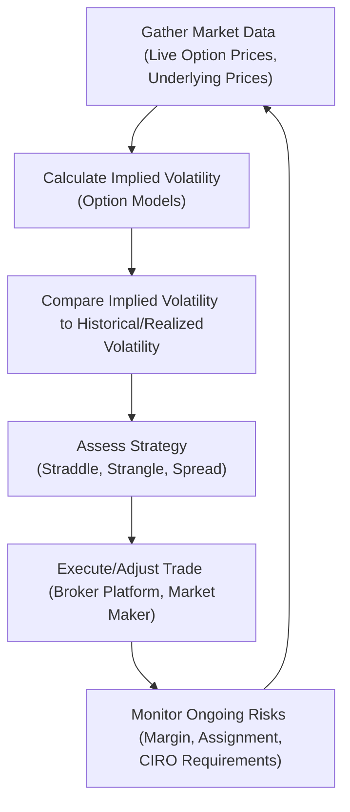

## 20.8 Additional Resources and Concluding Remarks

Volatility trading is often viewed as the ultimate “expert-level” game in options and derivatives markets. There’s a reason for that: the children of volatility—Gamma, Vega, Theta, Rho, and Delta—can be swift in rewarding the prepared and equally swift in punishing the careless. Remember that time you placed a straddle only to see implied volatility crash overnight because some big earnings news was leaked early? If you’ve never had that happen, consider yourself lucky. Actually, let’s be honest: luck tends to run out unless you’re anchored in solid strategy, proper risk management, and thorough knowledge of the rules.

Below, we’ll explore what you should look for after reading about these volatility strategies and how to level up your learning. We’ll bring in some do’s and don’ts and highlight references—both official and informal—that many traders find helpful. So let’s take a step back, do a bit of a recap, and give you a robust reference list that you can rely on.

---

### Reflecting on Volatility Strategies

We’ve seen that volatility can be your friend or your foe—sometimes both on the same trading day. Committing to the path of volatility-based strategies means doing your homework on:

• Market conditions and liquidity checks  
• Historical volatility vs. implied volatility comparisons  
• Option Greeks and scenario analyses  
• Potential regulatory constraints under CIRO rules  
• Margin calculations (especially with short options or multi-leg spreads)  
• Suitability: ensuring that neither you nor your clients (if you’re an advisor) get into trades beyond comfortable risk thresholds  

But perhaps the biggest “aha” moment for many new volatility traders is that you’re essentially trading the market’s expectation of future uncertainty. You’re not just analyzing if the price of a commodity or stock will go “up” or “down,” but also the magnitude and timing of that price move. That’s a different ballgame, and it requires specific knowledge. Think of it as having to learn new dance steps if you’re used to simple two-step dancing. Suddenly, you’re asked to waltz across the floor while staying in perfect sync with time decay and changes in implied volatility.

---

### Understanding Key Concepts in Context

Before we jump into resources, let’s do a quick review of the major concepts:

**Suitability Requirements (CIRO).** Under Canadian Investment Regulatory Organization (CIRO) guidelines, you must ensure each recommended trade aligns with the client’s financial situation, experience, and risk tolerance. For instance, a short straddle might be profitable but is typically not suitable for a first-time options trader with a conservative risk profile.

**American-Style vs. European-Style Options.** American-style options can be exercised at any time until expiration. That freedom introduces additional time-premium considerations and early assignment risk. European-style options can only be exercised at expiration—most index options follow this style, which simplifies certain volatility trades but also reduces early assignment complexities.

**Assignment Risk.** If you’ve ever had that unexpected assignment at 3:00 AM on some random Tuesday, you know it can be unnerving. The risk is especially relevant for short calls on dividend-paying stocks—investors may exercise early to capture the dividend. This dynamic can drastically alter the risk profile of your positions.

**Reg-T Margin vs. CIRO Margin Requirements.** In the U.S., Reg-T sets margin for many equity-related trades. However, in Canada, margin rules come under CIRO’s guidelines, which might differ in terms of initial margin and maintenance margin. Whenever you see margin discussions in books or websites referencing U.S. standards, double-check how the specifics translate to your Canadian context.

**Portable Alpha.** This is the idea of separating alpha (excess returns above a benchmark) from beta (market exposure). Volatility products can be used to add alpha overlays to a broader portfolio. For instance, a large pension fund might hold a passive index (beta) but simultaneously trade volatility strategies to “port” alpha. This approach requires advanced risk management to ensure you’re not doubling up on exposures you didn’t intend.

**EDGX and Other U.S. Options Exchanges.** If you’ve heard about EDGX, Cboe, or other U.S. platforms, just know they have their own exchange rules, quoting mechanisms, and fee structures. For those primarily focused on Canadian markets like the Montréal Exchange, it’s great to be aware of these other venues (especially if you plan on cross-border arbitrage), but always confirm the right margin and regulatory requirements.

**Liquidity Providers / Market Makers.** These are the folks obligated to maintain fair and orderly markets by quoting both bids and offers. They’re basically your dance partners in the market. They help reduce your slippage and get you out of (or into) positions faster. However, watch out for wide spreads in lower-volume options, because that’s where market makers might widen their quotes to limit their exposure.

---

### Diagram: Monitoring Implied vs. Realized Volatility

Below is a simple Mermaid diagram illustrating how you might track implied and realized volatility in a typical trading workflow. This can help you visualize the feedback loop between the market’s expectation (implied volatility) and what actually happens (realized volatility).

• **Gather Market Data**: Start by pulling real-time quotes, underlying prices, and monitoring macro news.  
• **Calculate Implied Volatility**: Use standard option pricing models (e.g., Black–Scholes–Merton) or your brokerage’s implied volatility calculations.  
• **Compare to Historical/Realized Volatility**: Look at whether the implied is higher or lower than realized. Discrepancies might present potential opportunities (e.g., shorting premium if implied is much higher than realized).  
• **Assess Strategy**: Decide which strategy aligns with your forecast, risk tolerance, and margin capacity.  
• **Execute/Adjust Trade**: Enter positions through your broker or trading platform, watch the order fill. Remember to review fill prices and possible partial fills in thinner markets.  
• **Monitor Ongoing Risks**: Track margin usage, keep an eye on potential early assignments for short American-style options, and stay updated on changes in implied volatility.  

This cycle repeats as markets evolve.

---

### Key Considerations Before Diving in Deeper

**1. Liquidity and Bid-Ask Spreads.**  
You might find that with certain commodity or equity options, the spread is pretty wide. That can eat into your profits, especially for multi-leg trades that involve multiple slippage points. Monitoring the depth of market (DOM) or level-2 data can be super helpful.

**2. Real-Time Monitoring and Adjustments.**  
Volatility is not static. If news breaks—or even if the rumor mill starts churning—it can spike or collapse quickly. Having the ability to adjust your positions (rolling a short strangle, for example) is a big part of successful volatility trading.

**3. Early Exercise for American Options.**  
Be sure you understand how early exercise might impact your short options, particularly if you’re short calls on a stock with a dividend coming up. Sometimes it’s rational for the long call holder to exercise early to capture the dividend. If that’s you, you get assigned and might end up short the stock unexpectedly.

**4. CIRO Suitability and Margin.**  
CIRO is serious about ensuring that retail clients understand the risks of derivatives. The new SRO environment (as of 2023) consolidated the old MFDA and IIROC into what we now call CIRO. They provide guidelines on best execution, margin rules, and suitability. You can find plenty of official materials on their website:  
• [CIRO](https://www.ciro.ca)

**5. Stress Testing and Scenario Analysis.**  
Always run “What if?” scenarios. For instance, what if implied volatility shoots up by 10 percentage points because of a macro event? Or what if the underlying gaps down significantly? Visualizing these outcomes can save you from sudden margin calls or large unexpected losses.

**6. Ongoing Education and Simulation.**  
No one masters volatility in a single reading. Tools like paper trading platforms or simulators are a goldmine for testing whether your theoretical approach translates to real-world P/L.

---

### Helpful Resources for Volatility Traders

Let’s shift gears and point you toward some resources that can really up your game:

**1. Official Regulatory and Exchange Websites**  
• **CIRO (www.ciro.ca)**: The newly formed Canadian Investment Regulatory Organization’s website is your primary gateway to rules, compliance guidelines, margin requirements, and official bulletins in Canada.  
• **Canadian Securities Administrators (CSA)**: The CSA fosters a harmonized approach to securities regulation across provinces. Check for broad regulatory notices on derivatives reporting and clearing.  
• **Montréal Exchange (m-x.ca)**: Canada’s main derivatives exchange has a wealth of educational material, contract specifications, margin calculators, and real-time data. If you want to dive into specific Canadian index options or futures, this is your reference.  

**2. Books and Literature**  
• “Options, Futures, and Other Derivatives” by John C. Hull: A classic, with lots of detail on volatility, Greeks, and risk management.  
• “Trading and Exchanges” by Larry Harris: While not strictly about options trading, it offers deep insights into market microstructure—essential for understanding how volatility trades get executed and how markets respond to big orders.  
• “Volatility Trading” by Euan Sinclair: For a more advanced dive into the topic of volatility specifically.  

**3. Journals and Articles**  
• The **Journal of Derivatives** often has peer-reviewed articles on the latest in option pricing, volatility forecasting, and risk modeling.  
• **FAJ (Financial Analysts Journal)** has practical research articles that can help you discover new approaches to hedging or alpha generation with options.  

**4. Online Courses and Webinars**  
• The **Montréal Exchange** frequently hosts webinars, some of which focus on advanced options strategies and volatility.  
• **CIRO** also sometimes collaborates with industry experts to create educational videos or presentations on best practices in derivatives.

**5. Data Sources for Backtesting**  
• **GitHub**: If you search for “options backtesting” or “volatility strategies,” you’ll find open-source projects or datasets.  
• **Kaggle**: Another popular destination with a variety of financial datasets. Typical data includes historical option prices, implied volatilities, and underlying price movements.  

**6. Community Forums and Groups**  
• **Reddit** subreddits like r/options can be surprisingly helpful. (Though be mindful: not everyone in these forums will have correct or complete information.)  
• **LinkedIn** groups focusing on derivatives or volatility trading.  
• **Local CFA Societies** in Canada sometimes arrange meetups or conferences where you can network.

---

### Personal Anecdotes on Continuous Learning

I remember early on in my trading career, I was so laser-focused on “locking in a quick profit” that I neglected to watch how the implied volatility was shifting throughout the day. I had a short straddle open, thinking the underlying stock wouldn’t move much before earnings. But then the implied volatility collapsed three days before earnings because the market collectively decided that the quarter’s results were going to be predictable. By the time earnings actually arrived, there was almost no premium left for me to collect. The moral of the story? Volatility sentiment can change long before the event you’re waiting on. If you’re not monitoring how implied volatility evolves over time, you might be left scratching your head about where your “easy gains” went. So yeah, staying on top of these changes is 90% of the game.  

---

### Best Practices for Future Development

**Keep a Trading Journal.**  
Log your trades, your reasons for entering, the “greeks” at the time, implied vs. realized volatility observations, and the outcome. Over time, patterns often emerge. Maybe you’re consistently missing a shift in volatility after news gets priced in, or you’re not factoring in short interest properly.

**Set Realistic Profit Targets and Stop Losses.**  
Volatility can cut both ways. It’s tempting to “let it ride” when the position is going your way. But a sudden news event can wipe out your unrealized gains. Put guardrails in place.

**Stay in the Loop with Regulatory Changes.**  
CIRO, the Canadian Securities Administrators (CSA), and Bourse de Montréal can introduce new rules or margin requirement tweaks that affect your trades. Sign up for alerts to avoid being caught off-guard.

**Explore Cross-Asset Volatility.**  
Sometimes, FX or commodity markets can give you fresh volatility trading opportunities that aren’t present in equity markets. This not only helps with diversification but can also teach you about different cyclical or seasonal dynamics in volatility.

**Never Underestimate the Power of Time Decay.**  
Time decay (Theta), especially in short-term contracts, can be severe—or beneficial if you’re net short options. Either way, it’s crucial to forecast systematically.

---

### Common Pitfalls and Ways to Overcome Them

1. **Ignoring Assignment Risk**: If you’re short American-style options, always remember that the long side can exercise early. Overcome this by monitoring ex-dividend dates if you’re short calls, and always consider the cost of carry.  
2. **Overleveraging**: Using too much margin can lead to forced liquidations at the worst possible time. Overcome by checking CIRO’s recommended margin rules and never max out your line.  
3. **Chasing “Cheap” Options**: Sometimes low-premium, near-expiry options are cheap for a reason. They can lose value quickly if volatility drops further or if there is insufficient time left.  
4. **Not Stress Testing**: A cluster of small trades can create big net exposure if the underlying moves sharply. Overcome this with scenario analysis across all positions, especially if they share the same underlying.  
5. **Focusing Only on Price Direction**: Volatility traders who focus solely on whether the underlying will go up or down might miss out on a crucial piece of the puzzle: the implied volatility level. Overcome by routinely comparing implied vs. realized volatility and monitoring the overall IV environment.

---

### Looking Ahead

Derivatives markets never stand still. Whether it’s new products like crypto options, rapidly evolving ESG derivatives, or new clearing requirements, you want to keep updating your knowledge. Volatility strategies are likely to remain central to advanced trading, so expect new technology—like more sophisticated algorithmic models or AI-driven volatility forecasts—to shape how we trade.

Do you want to push further? You can consider learning more about advanced modeling (like stochastic volatility models), or you might jump deeper into the macro front to anticipate volatility in different economic cycles. But no matter how advanced you get, the basics remain: measure your risk, know your margin, respect assignment possibilities, and confirm that the trades are suitable for you or your clients.

---

### Concluding Remarks

It’s been a blast stepping through these details on volatility strategies. And yes, it can feel a bit like drinking from a fire hose. The truth is, you’ll likely need multiple passes through these concepts—not to mention live practice and further reading—before you feel fully confident. Patience and consistent study are your best allies.

• Keep a close watch on your positions.  
• Stay informed about market events that could jolt implied volatility.  
• Use the official regulators’ websites (CIRO, CSA) for updates on any new rule changes or margin guidelines.  
• Practice scenario analysis to handle the dreaded “What if?” situations.  

As you move forward, remember that the Canadian derivatives market is well-regulated and still ripe with opportunity for those who do their homework. The combination of discipline, curiosity, and humility can lead to a rewarding experience in volatility trading. Good luck, and stay curious!

---

## Sample Exam Questions: Volatility Strategies and Canadian Regulatory Considerations



### Volatility-based strategies typically require special attention to early assignment risk. Which type of options can be exercised at any point prior to expiration?

- [x] American-style options
- [ ] European-style options
- [ ] Asian-style options
- [ ] None of the above

> **Explanation:** American-style options can be exercised anytime up to (and including) the expiration date. This introduces a layer of unpredictability known as early assignment risk, especially if there are dividends or other factors at play.

### According to CIRO guidelines, why is focusing on client suitability crucial when recommending a short straddle?

- [x] Because a short straddle can create unlimited risk should the underlying move significantly.
- [ ] Because profits are guaranteed for short straddles in low-volatility markets.
- [ ] Because CIRO does not allow retail investors to engage in multi-leg trades.
- [ ] Because short straddles are illegal under Canadian securities law.

> **Explanation:** Under CIRO, ensuring a trade aligns with the client’s risk tolerance, financial situation, and investment goals is mandatory. A short straddle carries unlimited risk if the underlying moves dramatically in either direction.

### When monitoring implied vs. realized volatility over the life of a trade, which of the following best describes realized volatility?

- [ ] The volatility implied by current option prices.
- [ ] The rate at which the underlying asset price is expected to move in the future.
- [x] The actual observed volatility of the underlying asset realized over a past period.
- [ ] The average historical implied volatility from exchange data.

> **Explanation:** Realized volatility measures how much the underlying price actually moved over a specific period. Implied volatility is forward-looking, reflecting the market’s views about future price fluctuations.

### Which resource would be most appropriate for getting official Canadian margin requirements for options strategies?

- [ ] U.S. Federal Reserve website for Reg-T margin
- [ ] International Monetary Fund Database
- [ ] Local financial blogging sites
- [x] CIRO (Canadian Investment Regulatory Organization) website

> **Explanation:** CIRO is the recognized self-regulatory organization in Canada. Its site is the definitive source for margin requirements in Canadian markets.

### Suppose you enter a short call on a Canadian equity that pays a dividend next month. What is a key reason the position might face early assignment?

- [ ] Calls on Canadian equities cannot be exercised early.
- [x] The long option holder may want to capture the dividend by exercising.
- [ ] Dividends only affect European-style options.
- [ ] All dividends are irrelevant to option holders.

> **Explanation:** American-style options grant the holder the right to exercise at any time. If the stock is paying a dividend, holders of calls might exercise early to become shareholders and capture that dividend.

### Which of the following best describes the concept of Portable Alpha in the context of volatility trading?

- [ ] A strategy for exercising European-style options early
- [x] Using derivatives to capture excess returns independently from the underlying market exposure
- [ ] A margin requirement approach
- [ ] A formula for computing Theta

> **Explanation:** Portable Alpha involves separating alpha (excess returns from skillful active management) from the beta (market exposure), often by using volatility overlays or other derivatives to generate returns irrespective of the core portfolio’s beta.

### One notable difference between Reg-T margin in the U.S. and CIRO margin in Canada is:

- [x] CIRO margin rules may differ from Reg-T, so you must confirm rules specifically for the Canadian market.
- [ ] There is no difference; CIRO has fully adopted Reg-T.
- [ ] Canada eliminates margin for short options.
- [ ] Reg-T does not allow trading of any derivatives in Canada.

> **Explanation:** While conceptually similar, margin rules can differ between the two jurisdictions. Traders in Canada must reference CIRO and Bourse de Montréal guidelines rather than relying solely on U.S. Reg-T rules.

### If the implied volatility of an option is significantly higher than the recent realized volatility of the underlying, which strategy might a volatility trader consider?

- [ ] Buying a strangle
- [ ] Going long a call option
- [x] Selling (writing) option premium
- [ ] Going long a put option

> **Explanation:** When implied volatility exceeds realized volatility by a large margin, some traders interpret that as an opportunity to sell (write) options, assuming implied volatility may revert to more typical levels.

### Which of the following is a practical way to stress test a volatility-based portfolio?

- [x] Use scenario analyses examining large market moves, changes in implied volatility, and potential assignment cases.
- [ ] Assume volatility will always remain constant throughout the life of the options.
- [ ] Never make changes once the positions are set.
- [ ] Focus solely on the underlying price, ignoring volatility changes.

> **Explanation:** Scenario analyses that incorporate changes in volatility, potential underlying price shocks, and early assignment risks are essential to robust stress testing. Focusing on a single dimension (like price only) is insufficient.

### True or False: A short straddle has limited upside risk since the premium collected serves as a cushion.

- [ ] True
- [x] False

> **Explanation:** A short straddle carries theoretically unlimited risk, because if the underlying asset price makes a large move (up or down), losses can exceed the collected premium and become substantial.


