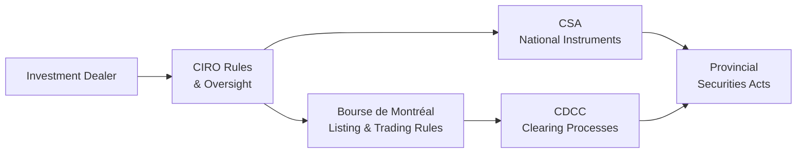

## 21.1 Options Regulation

Imagine, for a moment, that your friend or colleague hears you work with options and says, “Wow, that must be risky—aren’t they unregulated?” Well, ironically, that was me once. In my early days of exploring financial derivatives, I had no idea that options in Canada were subject to one of the most robust regulatory frameworks in the world. I simply assumed they were these wild beasts roaming free in the markets. As it turns out, that misconception couldn’t be further from the truth.

Options are not only regulated by Canada’s federal and provincial securities laws, but they also fall under the purview of the Canadian Investment Regulatory Organization (CIRO), the Bourse de Montréal, and the Canadian Derivatives Clearing Corporation (CDCC). Because so many different authorities are involved, it’s helpful to break down how each one fits into the big picture—sort of like putting puzzle pieces together.

Below, we’ll walk through the multiple layers of Canadian options regulation and look at how they work together to protect investors, preserve market integrity, and promote fair, efficient trading. We’ll also take some brief detours into personal stories and experiences, because hey, it’s more fun that way.

---

### The Canadian Regulatory Landscape

If you’re new to Canadian securities regulation, or if it’s been a while since you opened a law textbook, it helps to get a big-picture view before diving into the nitty-gritty. Canada doesn’t have a single federal securities regulator. Instead, responsibility for securities oversight is split among provincial and territorial authorities. However, these authorities collaborate under an umbrella organization called the Canadian Securities Administrators (CSA).

CIRO, formed by the 2023 amalgamation of the Investment Industry Regulatory Organization of Canada (IIROC) and the Mutual Fund Dealers Association of Canada (MFDA), plays a central role in supervising investment dealers and mutual fund dealers. Meanwhile, the provinces enact securities laws, and each province’s regulator can create local rules that supplement national requirements. For options, specifically, we’ll see how players like the Bourse de Montréal and the Canadian Derivatives Clearing Corporation (CDCC) come in to handle listing, trading, clearing, and settlement.

When I was a student, I used to joke that maybe Canadian securities regulation was so complicated that even regulators got confused. But in reality, it’s actually quite coordinated. We have “National Instruments” that unify many aspects of securities regulation across the provinces. And for derivatives and options, especially, the system ensures consistency and clarity.

---

### CIRO: The National Self-Regulatory Organization

Let’s talk about CIRO (Canadian Investment Regulatory Organization). As of January 1, 2023, the MFDA and IIROC officially combined to form this new self-regulatory organization for the investment industry in Canada. So, references to the MFDA or IIROC from pre-2023 times are now purely historical or transitional. CIRO regulates investment dealers, mutual fund dealers, and marketplace participants on both equity and debt marketplaces. 

Any firm or individual wanting to offer options to retail or institutional clients in Canada must be registered with the relevant securities commissions and must comply with CIRO rules. The CIRO Rule Book (available at [https://www.ciro.ca/rule-book](https://www.ciro.ca/rule-book)) spells out ongoing proficiency standards, capital requirements, and guidelines around business conduct. 

CIRO also sets margin requirements for options trading and enforces a comprehensive set of guidelines on how clients should be onboarded, how their option accounts are approved, and how trades are monitored. If you’re a new options representative or simply interested in the compliance side of derivatives, rummaging through the CIRO Rule Book and bulletins is a must. It might seem overwhelming at first (there’s a lot of legalese), but after a few coffee-fueled reading sessions, it starts to make sense.

---

### CSA and the National Instruments

The Canadian Securities Administrators (CSA) is an umbrella body coordinating Canada’s provincial and territorial securities regulators. If you’ve ever heard of National Instruments (NIs)—like NI 31-103 “Registration Requirements”—those come from the CSA. 

NI 31-103 sets out who must register with securities regulators before dealing in or advising on securities or derivatives. Under this National Instrument, individuals wanting to trade or advise on derivatives (including options) may need to meet specific proficiency requirements, carry certain registrations, and follow ongoing compliance rules. Depending on your province, there might be local variations, but NI 31-103 is a significant piece in establishing a uniform framework.

You’ll hear references to other National Instruments, too, such as NI 81-102 for mutual funds or NI 94-101 and 94-102 on mandatory clearing of derivatives. While these might not apply exclusively to options, they shape the broader environment in which options trading occurs—especially if you’re dealing with more complex or “over-the-counter” derivatives that blend into options strategies.

I remember stumbling upon a CSA Notice—a multi-page document describing updates to derivatives rules—and thinking, “Do I really need to read all of this?” But the short answer is yes, especially if you’re the designated compliance officer at a brokerage firm or if you’re structuring advanced hedging strategies for clients. Because these rules have legal force, skipping them can result in compliance issues or penalties.

---

### The Bourse de Montréal

For exchange-traded options, the Bourse de Montréal (often known simply as the “Bourse” or “MX”) is where the action happens in Canada. The Bourse sets listing standards for equity, index, and other derivatives, and they coordinate with CIRO on the oversight of market participants.

Sometimes, people confuse the Bourse de Montréal’s role with that of CIRO. Think of the Bourse as the marketplace operator for derivatives, while CIRO exercises oversight of dealers and market integrity across multiple marketplaces, not just the Bourse. You might see Bourse notices detailing changes to how options are quoted, new listing requirements, or policy updates on market-making obligations.

If you’re an active options trader or you manage an options desk, you’ll notice how the Bourse’s rules shape what’s actually possible on the trading floor (or, nowadays, in electronic markets). The Bourse also works in conjunction with the Canadian Derivatives Clearing Corporation (CDCC) to ensure that every trade is properly cleared and settled.

---

### Canadian Derivatives Clearing Corporation (CDCC)

The CDCC is the clearinghouse for derivatives in Canada. The best analogy I’ve come across is: if the Bourse is the stage where the performance happens, CDCC is the backstage crew making sure the show runs smoothly. Every trade that goes through the Bourse (such as your standard call or put option) needs to be “cleared” by the CDCC. Clearing basically ensures that if Party A goes bankrupt, Party B isn’t left in ruin. CDCC steps in as the central counterparty to reduce credit and counterparty risk.

CDCC membership requirements are strict, and they should be. Members need a strong financial base and must follow capital and risk management standards. In practice, that fosters safety and integrity in the Canadian derivatives marketplace. The clearing process also establishes margin requirements that must be posted by each party to a trade. If you’ve traded options, you’re probably quite familiar with margin calls, and you can thank (or blame) the clearinghouses for that. 

Moreover, the CDCC sets guidelines on how to handle things like option exercises, assignments, and corporate actions that affect option contracts (e.g., stock splits, dividends, rights issues). While we don’t want to jump too far ahead, it’s worth keeping in mind that if you hold significant open option positions at expiry, CDCC is the entity facilitating proper settlement.

---

### Layers of Oversight: A Visual Overview

You might feel that all these players—CIRO, CSA, Bourse de Montréal, and CDCC—overlap, and, well, they do. But each institution focuses on different facets of the regulatory landscape, even if some responsibilities intersect. Here’s a quick diagram that might help clarify how these layers connect:

In this diagram:  
• The investment dealer (A) must comply with CIRO rules (B).  
• CIRO operates under the broader framework of CSA National Instruments and provincial securities acts (C and D).  
• Dealers wanting to trade options on the Bourse must follow Bourse de Montréal (E) rules.  
• Every trade on the Bourse is cleared by the CDCC (F).  
• The provincial securities acts (D) remain the overarching legislation.

---

### Keeping Up with Regulatory Updates

The next question that often pops up is: “How do I actually keep track of all these changes, bulletins, and notices?” Paying attention to new or revised regulations is crucial for staying compliant and avoiding penalties. Here are a few strategies:

• Regularly check the CIRO website ([https://www.ciro.ca](https://www.ciro.ca)) for bulletins on rule amendments or guidance notices.  
• Keep an eye on CSA updates at [https://www.securities-administrators.ca](https://www.securities-administrators.ca). This is where you’ll find new National Instruments, amendments, and staff notices clarifying interpretations of existing rules.  
• Subscribe to Bourse de Montréal communications at [https://www.m-x.ca](https://www.m-x.ca). They announce listing changes, new classes of options, modifications to margin requirements, and more.  
• For deeper dives, review the CDCC’s documentation on clearing processes and margin rules, especially if you’re running a large or sophisticated options book.  

Personally, I have an email folder titled “Reg Stuff” where I filter all these notifications. It might not sound glamorous, but it’s a lifesaver when I need to quickly confirm a margin rule or show a client that their question about a new listing has already been addressed by the Bourse.

---

### Province-Specific Nuances

Even though the CSA tries to harmonize important regulations across Canada, each province can have its own local rules, policies, or securities acts. For instance, the Ontario Securities Commission (OSC), the Autorité des marchés financiers (AMF) in Quebec, and the British Columbia Securities Commission (BCSC) each enforce their own legislation. 

This can matter if you have clients in multiple provinces or if you’re an adviser traveling between territories. A compliance approach that works in Toronto might need small tweaks in Montreal or Vancouver. Usually, the differences are minor—like slightly different forms or deadlines—but it’s worth double-checking to avoid headaches. 

In some cases, a province might pilot a new rule before it’s adopted Canada-wide. Keeping tabs on local rules is especially important for new hedging or risk management strategies that might be interpreted differently under each jurisdiction’s definitions or policies.

---

### Federal Securities Laws?

You might be wondering, “So what’s the role of the federal government here?” Canada does not have a single, unified federal securities regulator. However, there are federal laws that overlap with securities (and thus with derivatives). For example, the Canadian Criminal Code can come into play if there’s fraud or market manipulation. And the Bank Act influences how big banks can engage in derivatives trading.

But the day-to-day oversight for options typically flows through provincial securities commissions and self-regulatory bodies. The system sometimes appears complex, but it has functioned effectively for decades, with some incremental modernizations along the way—like the formation of CIRO.

---

### International Influences: IOSCO and ISDA

Canadian regulators don’t exist in a vacuum. Global standard-setters like the International Organization of Securities Commissions (IOSCO) and the International Swaps and Derivatives Association (ISDA) routinely shape Canadian rules. 

For example, IOSCO might issue guidance on best practices for derivative market surveillance, while ISDA fosters standard documentation (think “ISDA Master Agreements”) that large players use for over-the-counter swaps and exotic options. Canadian authorities often adapt or adopt these international guidelines to maintain consistency. 

A classic example is the global push for mandatory clearing of certain OTC derivatives following the 2008 financial crisis. The CSA introduced clearing mandates and trade reporting obligations that align with G20 commitments—a demonstration of how international trends can directly impact the Canadian marketplace.

---

### Common Compliance Pitfalls and Strategies

Options regulation can be intricate, so let’s talk about typical pitfalls that traders and firms might encounter:

• Failing to Register Properly: Sometimes, individuals advise on options without the correct categories of registration under NI 31-103. This can lead to enforcement actions.  
• Ignoring Suitability Requirements: Even though options can be used for speculation, regulators expect you to know your client (KYC) and ensure suitability. If you’re recommending highly leveraged strategies to a risk-averse retiree, you have a problem.  
• Lax Recordkeeping: CIRO rules emphasize thorough recordkeeping. Missed orders, incomplete notes on margin calls, or inaccurate client documentation can trigger compliance reviews or fines.  
• Overlooking Margin Calls: Especially in volatile markets, margin calls can occur rapidly. Dealers must follow the required timeline—failing to do so exposes everyone to heightened risk.  
• Not Keeping Current on Bulletins: Regulatory changes happen; ignoring them isn’t an option.  

On the flip side, maintaining strong compliance doesn’t have to be burdensome. A well-organized compliance program, regular staff training, and close communication with regulators go a long way. Plus, using well-designed technology platforms to track positions and margin can help you respond quickly to any concerns about client accounts or unusual trading patterns.

---

### A Brief Personal Take

I remember a time when a colleague of mine recommended covered calls to a client who had never traded options before. She was absolutely convinced that covered calls would be a “safe bet.” But then the price of the underlying stock soared, and the client was annoyed that the option limited his upside potential. The root issue wasn’t the strategy itself—it was that the client never fully understood the trade-off. 

From a compliance perspective, that scenario highlighted the importance of the “suitability” standard. Suitability is about more than delivering pamphlets or disclaimers; it involves ensuring that the person on the other end of the conversation genuinely understands the risks and rewards. If they don’t, guess whose phone is going to ring first if something goes wrong? The regulator’s.

---

### Where To Deepen Your Knowledge

Regulatory changes happen all the time, and staying informed is critical. If you want to explore this world further, here are a few places and resources you might find useful:

• **CIRO Rule Book:** [https://www.ciro.ca/rule-book](https://www.ciro.ca/rule-book) is your go-to for official guidelines.  
• **CSA Notices and Instruments:** [https://www.securities-administrators.ca](https://www.securities-administrators.ca) is where you’ll find everything from NI 31-103 to policy statements and staff notices.  
• **Bourse de Montréal Regulatory Division:** [https://www.m-x.ca](https://www.m-x.ca). The Bourse site has bulletins on listing changes, updated margin requirements, and market regulation developments.  
• **NI 31-103 Registration Requirements:** [https://www.osc.ca/en/securities-law/instruments-rules-policies/3/31-103](https://www.osc.ca/en/securities-law/instruments-rules-policies/3/31-103).  
• **“Options as a Strategic Investment” by Lawrence G. McMillan.** A comprehensive guide on options strategies—less about regulation, more about how to trade effectively while (hopefully!) staying on the right side of the law.  
• **Coursera’s “Financial Derivatives”** or other online courses. These can provide in-depth academic perspectives and add some theoretical backbone to your understanding of practical compliance.  

You may also explore open-source financial tools or GitHub repositories that track real-time margin calculations for options. While they’re not official resources, they can be excellent learning platforms for modeling scenario analysis or stress testing your book under different compliance scenarios.

---

### Wrapping Up

When it comes to Canadian options regulation, you can think of it like an interconnected web: CIRO oversees dealer conduct and ensures firms are playing by the book; the CSA issues National Instruments that set the broader rules of the game; the Bourse de Montréal hosts the actual marketplace; and the CDCC clears the trades, ensuring financial stability. Each piece relies on the other, forming a thorough guardrail system to protect investors and maintain market confidence.

That said, regulation isn’t just about bureaucratic checklists. It’s about fostering a marketplace where participants can access derivatives to hedge or speculate responsibly, with minimal risk of fraud or systemic instability. If you understand your obligations, keep up with regulatory guidance, and take your compliance responsibilities seriously, you’ll likely find that regulation is your ally, not your enemy.

So, next time someone asks, “Aren’t options unregulated?” you can confidently tell them they’re one of the most supervised instruments in Canada, backed by an extensive (and evolving) framework that spans multiple layers of laws and rules. And that, if you ask me, is exactly how it should be.

---

## Sample Exam Questions: Options Regulation in Canada



### Which entity is responsible for setting and enforcing rules for investment dealers and mutual fund dealers in Canada?

- [ ] The Mutual Fund Dealers Association (MFDA)
- [x] The Canadian Investment Regulatory Organization (CIRO)
- [ ] The Investment Industry Regulatory Organization of Canada (IIROC)
- [ ] The Bank of Canada

> **Explanation:** Since January 1, 2023, the MFDA and IIROC amalgamated to form CIRO. All investment dealers and mutual fund dealers are now regulated under this new self-regulatory organization.

### Under which National Instrument do Canadian securities regulators set forth registration and proficiency requirements for individuals dealing in derivatives?

- [ ] NI 81-102
- [x] NI 31-103
- [ ] NI 94-102
- [ ] NI 51-101

> **Explanation:** NI 31-103 governs registration requirements and outlines how individuals must register if they want to offer securities or derivatives, including options.

### Which of the following best describes the role of the Bourse de Montréal with respect to options?

- [x] It provides a marketplace where options can be listed and traded.
- [ ] It solely handles the clearing and settlement of all Canadian derivative trades.
- [ ] It sets Canadian federal securities legislation.
- [ ] It has no regulatory function in Canada’s derivative markets.

> **Explanation:** The Bourse de Montréal operates the main exchange for derivatives in Canada, including options. Clearing is handled by the CDCC, while securities legislation is typically administered by provincial regulators and the CSA.

### Which organization is primarily responsible for clearing and settlement of exchange-traded derivatives in Canada?

- [ ] The Bourse de Montréal
- [ ] CIRO
- [x] The Canadian Derivatives Clearing Corporation (CDCC)
- [ ] The Ontario Securities Commission (OSC)

> **Explanation:** The CDCC acts as the central clearing counterparty for trades executed on the Bourse de Montréal, reducing counterparty and credit risk.

### Which Canadian body coordinates provincial and territorial securities regulators?

- [x] The Canadian Securities Administrators (CSA)
- [ ] CIRO
- [ ] The Bourse de Montréal
- [ ] The Canadian Derivatives Clearing Corporation (CDCC)

> **Explanation:** The CSA is an umbrella organization that harmonizes the rules and efforts of individual provincial and territorial regulators across Canada.

### When an investment firm advises a risk-averse retiree to engage in speculative options strategies without proper disclosures, this is likely a breach of:

- [x] Suitability and Know-Your-Client (KYC) requirements
- [ ] Margin requirements
- [ ] CDCC membership obligations
- [ ] International derivative guidelines

> **Explanation:** Firms must ensure that every recommendation is suitable for the client’s risk profile. Failing to analyze or document the client’s risk tolerance can violate both provincial regulations and CIRO rules.

### Which of the following is NOT a key source of options regulation in Canada?

- [ ] Provincial securities acts
- [ ] CIRO Rule Book
- [ ] National Instruments like NI 31-103
- [x] The U.S. Securities and Exchange Commission (SEC)

> **Explanation:** While cross-border influences and global best practices can inform Canadian standards, the SEC directly regulates U.S. markets, not Canadian markets.

### From a compliance standpoint, which statement about margin calls is correct?

- [ ] They can be ignored at the firm’s discretion.
- [ ] They only apply to uncovered put positions.
- [ ] They originate from the provincial securities commissions.
- [x] They arise from clearinghouse (CDCC) requirements and must be met within specified time frames.

> **Explanation:** Clearinghouses, such as the CDCC, set margin requirements to ensure trading parties maintain sufficient collateral. Dealers must enforce margin calls promptly.

### Which global standards-setting bodies often influence Canadian derivatives regulations?

- [ ] The Canadian Criminal Code and the Supreme Court
- [ ] The OSC and AMF
- [x] The International Organization of Securities Commissions (IOSCO) and the International Swaps and Derivatives Association (ISDA)
- [ ] Universal Exposition of Competent Oversight (UECO)

> **Explanation:** IOSCO drives high-level global standards for securities regulation, while ISDA is renowned for its master agreements and standardized documentation for derivatives.

### True or False: Canadian options markets operate under a strictly federal regulatory framework, with minimal provincial influence.

- [ ] True
- [x] False

> **Explanation:** Canada does not have a single federal securities regulator. Instead, each province or territory has its own securities commission. Regulations are harmonized through the CSA.  


