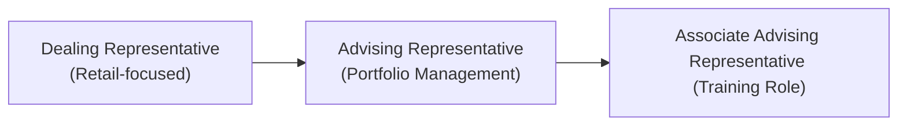

## 21.2 Individual Registration Categories

Sometimes, sorting out the different “categories” for becoming registered to deal in or advise on derivatives in Canada can feel like you’re juggling a bunch of tiny puzzle pieces in the air – you can sense how they must fit together, but you’re not exactly sure how. Let’s walk through these categories, one step at a time. I’ll share a few personal experiences and lessons learned to make this process feel more down-to-earth and less like an intimidating legal labyrinth.

Before we dig in, it’s important to remember that the regulatory environment in Canada changed significantly on January 1, 2023. The Mutual Fund Dealers Association of Canada (MFDA) and the Investment Industry Regulatory Organization of Canada (IIROC) were amalgamated. This new self-regulatory organization is now known as the Canadian Investment Regulatory Organization (CIRO). In short, if you hear references to IIROC or MFDA today, it’s only in a historical context. CIRO is your go-to resource for all matters concerning registration, compliance, and ongoing proficiency in the Canadian derivatives marketplace.

Below, we’ll talk about three big categories that matter most if you’re going to be dealing in or advising on derivative products in Canada: the Dealing Representative, the Advising Representative, and the Associate Advising Representative. We’ll also talk about how to maintain your registration—because, trust me, I once missed a deadline for updating my registration status, and it involved a boatload of stress and emails back and forth to get everything legitimized again. Don’t be me. Keep your ducks in a row from the start.

---

### Understanding the Structure of Registration in Canada

In Canada, provincial and territorial securities commissions cooperate through the Canadian Securities Administrators (CSA) to harmonize securities rules across different jurisdictions. On top of that, CIRO enforces proficiency and conduct requirements for various dealer and advisor roles. The main legal framework that sets out these registration rules is National Instrument (NI) 31-103, Registration Requirements, Exemptions and Ongoing Registrant Obligations. Part 2 of NI 31-103, specifically, speaks to categories of registration for both firms and individuals.

Registration is not just a “nice-to-have.” It’s what gives you the legal authority to conduct business in securities and derivatives. Whether your focus is retail investors (like me, back in my earlier days) or big-shot institutional clients, you need the right kind of license to engage in or advise on derivatives. And these categories come with proficiency requirements, ongoing education commitments, and supervision conditions to protect investors and maintain market integrity.

---

### The Main Categories: Dealing Representative, Advising Representative, and Associate Advising Representative

Imagine three rungs on a ladder that allow you to move closer toward your ultimate goal in the derivatives space. This next section clarifies how these categories compare in terms of responsibilities, required experience, and future opportunities.

#### Dealing Representative

A Dealing Representative is someone authorized to sell securities and derivatives (subject to the categories the firm itself is registered for). They typically handle retail accounts, working in direct contact with everyday investors. For instance, if you walk into a brokerage firm to open an account and want to trade options on the Bourse de Montréal, you will likely deal with someone in this capacity.

• **Core Responsibilities:**  
  – Understanding the needs and objectives of retail clients.  
  – Recommending appropriate derivatives or investment strategies.  
  – Executing trades and ensuring compliance with relevant regulations.  

• **Proficiency Requirements (Typical Path):**  
  – Complete the Derivatives Fundamentals and Options Licensing Course (DFOL) or equivalent recognized by CIRO.  
  – Be employed by a registered dealer that sponsors your application.  
  – Pass any firm-specific training on compliance, Know-Your-Client (KYC) procedures, and platform technology.  

• **Oversight by CIRO:**  
  – CIRO places expectations around sales practices, ethical conduct, and adequate supervision.  
  – Dealing Representatives must maintain good standing, keep up with continuing education, and renew their registration if they switch firms.

A personal note: My first role in finance was along these lines. I specifically helped retail clients navigate futures and options on agricultural commodities. I remember the biggest day-to-day challenge was bridging the knowledge gap for new investors who only had a faint idea of how wheat futures worked. But it was incredibly rewarding when they began to grasp the concept of margin and leverage.

---

#### Advising Representative

Now, if you see yourself more in the portfolio management or institutional advisory space – analyzing markets, constructing derivatives-based strategies for pension funds, or tailoring interest rate swaps for major corporations – you’re looking at the Advising Representative role.

• **Core Responsibilities:**  
  – Managing investment portfolios and crafting strategies involving derivatives.  
  – Advising institutional clients, high net-worth individuals, or specialized funds.  
  – Employing advanced derivative instruments (like swaps or complex option spreads) to achieve client objectives, such as hedging, speculation, or yield enhancement.  

• **Proficiency Requirements (Typical Path):**  
  – Often requires advanced educational credentials (e.g., CFA charter, or the Canadian Securities Institute’s CIM designation, plus relevant derivatives courses).  
  – Complete the DFOL course or equivalents recognized under NI 31-103.  
  – Accumulate relevant work experience as required by the CSA or CIRO guidelines (for instance, a minimum actual hands-on experience in a regulated firm).  

• **Oversight by CIRO and the CSA:**  
  – Must be individually registered under a registered portfolio manager or investment counsel firm.  
  – Subject to ongoing audits and standards focusing on best execution, risk management, and fiduciary responsibilities toward clients.

Typically, an Advising Representative is the go-to for more complex financial tasks such as selecting the best interest rate derivatives for a corporate treasury or hedging currency exposures for a multinational business. If you dream of diving daily into yield curves, discussing macroeconomic policy, and analyzing volatility smiles in the equity options market, the Advising Representative path might be your calling.

---

#### Associate Advising Representative

If you want to become an Advising Representative but you’re not quite there in terms of experience and credentials, the Associate Advising Representative role can be your stepping stone. Think of it as an “apprenticeship” for portfolio managers.

• **Core Responsibilities:**  
  – Support the Advising Representative in designing and executing strategies, performing research, and managing client communications.  
  – Gain the additional experience needed to meet the full proficiency requirements for an Advising Representative.  

• **Proficiency Requirements:**  
  – Often very similar to those for an Advising Representative, but the work experience threshold is usually lower at the onset.  
  – You must be supervised and mentored by a fully registered Advising Representative or a Senior Portfolio Manager.  

• **Oversight by CIRO:**  
  – The sponsoring firm must ensure adequate supervision and must confirm that the Associate is not independently advising without oversight.  

In practice, you might see an Associate Advising Representative starting off with smaller accounts or simpler trade structures. Over time, they accumulate the necessary track record, pass additional exams or courses, and eventually apply to upgrade their registration category to a full Advising Representative.

---

### Proficiency Requirements in Detail

Canada’s regulators place a high value on proficiency to ensure investors are protected and that no one’s out there “winging it” with complex derivatives. You’ll commonly hear about “completed courses recognized by CIRO,” such as:

• Derivatives Fundamentals and Options Licensing Course (DFOL) – The big essential for those who handle exchange-traded derivatives.  
• Canadian Securities Course (CSC) – A broad securities mastery course.  
• Conduct and Practices Handbook (CPH) – Covers ethics, compliance, and regulatory obligations.  
• Additional modules or designations (CFA, CIM, etc.) depending on the level of responsibility and the complexity of the product set.

The proficiency bar is especially high for folks who are giving advice, since derivatives—like interest rate swaps, equity collars, or commodity futures—can be tricky beasts that carry substantial risk if misused or poorly understood. The last thing you want is to have a client enter a leveraged position without a robust appreciation for potential drawdowns.

---

### Day-to-Day Responsibilities and Scope of Authority

Let’s break down the daily life differences between these roles in a more visual way:

| Category                     | Typical Client Base                         | Types of Derivatives Handled                 | Primary Duties                                                   |
|------------------------------|---------------------------------------------|----------------------------------------------|------------------------------------------------------------------|
| Dealing Representative       | Retail or small institutional accounts      | Exchange-traded futures & options            | Suitability assessments, trade execution, KYC updates, basic advice |
| Advising Representative      | Institutional, pension funds, HNW clients   | Futures, options, swaps, structured products | Asset allocation, portfolio construction, advanced derivative strategies |
| Associate Advising Rep       | Training capacity, often smaller accounts   | Under supervision, same broad set of products| Research support, strategy assistance, bridging to full AR status |

A typical day for a Dealing Representative might involve walking a new retail client through the basics of a covered call strategy on a Canadian blue-chip stock. Meanwhile, an Advising Representative could spend hours analyzing global interest rate movements to propose an interest rate swap hedge for a corporate client. The Associate Rep may be preparing reports on implied volatility shifts across major equity indexes or calculating potential margin requirements for new trades, all while learning from the more senior staff.

---

### CIRO’s Role in Ensuring Competence

Although the CSA sets the overarching requirements, CIRO is your direct gatekeeper when it comes to practical compliance with proficiency, licensing, and continuing education. They oversee:

• **Initial Registration Approval:** Firms submit your application and demonstrate that you meet the minimum proficiency for the category.  
• **Supervision Requirements:** If you’re an Associate AR, your sponsor must keep track of your day-to-day tasks, compliance, and progression.  
• **Ongoing Education:** There are mandatory continuing education cycles to ensure your knowledge is up to date with changing regulations and market practices.  
• **Conduct Reviews and Enforcement:** CIRO can investigate and discipline a registrant or firm if they fail to comply with rules or if there are complaints from clients.

Keeping good records of your continuing education sessions, your completed professional courses, and your annual compliance updates can save you a lot of trouble. I’ve had a friend whose official transcripts didn’t match the CE credits they claimed, leading to an uncomfortable call from the compliance department. So, log everything accurately and confirm that it lines up with the official records.

---

### Maintaining Active Registration and Switching Roles

When you change your job or firm—say you move from a retail brokerage to an asset management firm—your registration status isn’t automatically carried over. You must notify CIRO, and your new employer must file the paperwork to sponsor your new role, whether as a Dealing Rep, Associate AR, or a full Advising Rep.

• **Key Steps for Transition:**  
  1. Notify your current sponsoring firm and your new sponsoring firm.  
  2. Complete any new training or orientation required by the new firm’s product set or compliance program.  
  3. Ensure the National Registration Database (NRD) is updated with your new role, categories of registration, and sponsoring firm details.  
  4. Comply with any “cooling-off” periods if applicable, especially if your new role includes any potential conflicts (such as moving from a compliance oversight position to a trading role).

• **Potential Pitfalls:**  
  – Working without proper registration in your specific category can lead to regulatory sanctions or fines.  
  – Failing to meet an updated background check or proficiency requirement can cause your application to be delayed or rejected.  
  – Overlapping roles: If you’re trying to serve as both a Dealing Rep and an Advising Rep, you must carefully confirm that your registration categories support that combination.

---

### Regulatory Snapshot: Relevant Instruments and Guidelines

It helps to have a quick cheat sheet of the key frameworks you may need when registering:

1. **National Instrument 31-103 – Registration Requirements, Exemptions and Ongoing Registrant Obligations**  
   - Part 2 addresses categories of registration.  
   - Part 3 covers dealing with registration in different provinces.  
   - Part 4 details proficiency requirements.  

2. **CIRO Registration Information**:  
   - https://www.ciro.ca/registration-categories  
   - Includes up-to-date clarifications on licensing categories for Derivatives and other financial instruments.  

3. **Canadian Securities Institute (CSI)**:  
   - https://www.csi.ca  
   - Official course outlines for the DFOL, CSC, CPH, WME, and more.  

4. **CPA Canada**:  
   - https://www.cpacanada.ca  
   - Certain modules and continuing education programs address financial regulations, risk management, and compliance topics relevant to derivative dealers and advisors.  

---

### Practical Example: Transition from Dealing Rep to Advising Rep

Let’s say you’re currently a Dealing Representative at a large retail firm. You’ve spent a few years helping clients buy and sell equity options and you’ve taken a key interest in more complex over-the-counter (OTC) derivatives. As your curiosity grows, you decide you want to shift your career path toward being a real “derivatives guru” for institutional clients. Here’s a rough idea of what you’d need to do:

1. **Upgrade your Proficiency:**  
   - Complete additional courses, like the Wealth Management Essentials (WME) or a recognized portfolio management credential.  
   - Potentially earn a CFA charter or another advanced designation.  

2. **Find a Sponsoring Firm that is a Registered Portfolio Manager:**  
   - Approach a firm that is licensed as a portfolio manager or investment counsel.  
   - They must be willing to sponsor your application as either an Associate Advising Representative (if you lack the direct experience) or a full Advising Representative.  

3. **File the Registration Paperwork:**  
   - Your new firm will submit documentation to CIRO and update your category in the NRD system.  
   - Provide copies of exams, course transcripts, and letters of experience verifying your investment or trading background.  

4. **Adjust to the New Role:**  
   - If you start off as an Associate Advising Representative, find a senior portfolio manager to mentor you and sign off on your trades.  
   - Over time, meet the experience thresholds to lift your status to a full Advising Representative.  

5. **Maintain Ongoing Education:**  
   - Complete annual continuing education credits in advanced derivatives, compliance, and ethics.  

---

### Personal Anecdotes and Observations

I recall the sense of excitement—and a hint of terror—when I first flipped through the pages of the NI 31-103. You see so many references to your obligations, your sponsor’s role, exact course requirements, fit and proper standards, and so on. My biggest piece of advice is to break it down. Don’t be afraid to ask your compliance officer or reach out to CIRO resources directly for clarity.

Oh, and watch out for “grandfathering” clauses. Sometimes, if you’ve been working in a particular capacity for many years, you may be exempt from certain new course requirements. However, you typically have to prove your experience is relevant and continuous. Neglecting to do so could mean missing the window to claim that exemption or having to retake an entire course from scratch.

---

### Glossary

• **Dealing Representative:** An individual authorized to sell or advise on prescribed securities/derivatives, primarily retail-focused, under a registered dealer.  
• **Advising Representative:** Someone who manages portfolios or provides advice at a higher level, often serving institutional or high-net-worth clients, typically requiring deeper proficiency and experience.  
• **Associate Advising Representative:** A subordinate role under supervision, aiming to build the credentials and experience necessary to move up to an Advising Representative role.  
• **Proficiency Requirements:** Educational courses, exams, and practical experience mandated by Canadian regulators (CIRO and CSA) to be eligible for registration in specific categories.  

---

### Common Pitfalls and Best Practices

• **Pitfall #1 – Incomplete Paperwork:** Not submitting all the forms (or forgetting to do so within a specific timeframe) can stall or jeopardize your registration.  
  – **Best Practice:** Keep a checklist of required documents (transcripts, sponsor letters, background checks) and follow up to ensure they’re received.  

• **Pitfall #2 – Unclear Sponsor Relationship:** Some individuals operate under the misconception they can “do it alone.” Without a sponsoring firm recognized by regulators, your registration is incomplete.  
  – **Best Practice:** Clarify early on who your sponsor is and what that sponsorship entails.  

• **Pitfall #3 – Letting Continuing Education Slide:** In the busy life of a derivatives professional, CE requirements might slip your mind.  
  – **Best Practice:** Schedule reminders or maintain a spreadsheet to track the courses or CE credits you need each year or cycle.  

• **Pitfall #4 – Failing to Disclose a Change in Personal Circumstances:** If you face a new conflict of interest or a significant personal financial event that could affect your ability to serve clients impartially, you must disclose it.  
  – **Best Practice:** Promptly inform your compliance department. It’s always better to be proactive and transparent.  

• **Pitfall #5 – Overextending Your License Scope:** Some Dealing Representatives get excited about interesting product offerings but aren’t actually licensed to advise on them.  
  – **Best Practice:** Verify that your category of registration covers the new product. If not, you may need an internal or external licensing update.

---

### Additional Resources

1. **National Instrument 31-103, Part 2** – for an in-depth description of registration categories, including the obligations that come with each.  
2. **CIRO: Registration Categories** – [https://www.ciro.ca/registration-categories](https://www.ciro.ca/registration-categories) for the latest updates on licensing categories.  
3. **Canadian Securities Institute (CSI)** – [https://www.csi.ca](https://www.csi.ca) for detailed course outlines and registration.  
4. **CPA Canada** – [https://www.cpacanada.ca](https://www.cpacanada.ca) for specialized modules in risk management, compliance, and advanced financial analysis.

---

### Conclusion

Navigating the three primary registration categories in Canada’s derivative space—Dealing Representative, Advising Representative, and Associate Advising Representative—can, at first, feel like deciphering an ancient scroll. But with the right approach and a supportive sponsoring firm, you’ll discover that each category is clear about the responsibilities and proficiency requirements. It’s all about matching your personal goals and skill level with the right rung on the ladder.

Whether you’re focusing on guiding retail investors or designing hedging solutions for massive pension funds, there’s a place for you in this industry. Just keep your compliance records tidy, stay curious about new derivatives and regulatory changes, and ensure you’re always working within the scope of your current registration. That way, you’ll set yourself up for a smooth, enjoyable—and hopefully prosperous—journey in the Canadian derivatives market.

---

## Sample Exam Questions: Individual Registration Categories in Derivatives



### Which of the following roles primarily caters to retail investors seeking to buy and sell derivatives?

- [ ] Advising Representative
- [x] Dealing Representative
- [ ] Associate Advising Representative
- [ ] Managing Director

> **Explanation:** Dealing Representatives generally work in direct contact with retail clients, assisting them in trading and understanding derivatives.

---

### Which of the following is a transitional role for individuals aspiring to become a full Advising Representative?

- [ ] Dealing Representative
- [x] Associate Advising Representative
- [ ] Chief Compliance Officer
- [ ] Operations Associate

> **Explanation:** The Associate Advising Representative category is a stepping stone under the supervision of a fully licensed Advising Representative.

---

### Which registration category usually deals with complex derivative strategies such as interest rate swaps and advanced hedging for institutional clients?

- [x] Advising Representative
- [ ] Dealing Representative
- [ ] Associate Advising Representative
- [ ] Junior Trader

> **Explanation:** Advising Representatives are more likely to handle sophisticated derivative products and institutional portfolio management.

---

### True or False: You can continue operating in the same registration category even if you move to a new firm without filing additional paperwork.

- [ ] True
- [x] False

> **Explanation:** Switching firms requires notifying CIRO and updating the National Registration Database (NRD). Your new firm must sponsor your registration.

---

### Which regulatory instrument outlines the core requirements and ongoing obligations for registration in Canada?

- [ ] National Instrument 51-102
- [ ] National Instrument 81-102
- [x] National Instrument 31-103
- [ ] National Policy 11-203

> **Explanation:** NI 31-103 covers registration requirements, exemptions, and ongoing registrant obligations, including those for derivatives representatives.

---

### Which of the following is the self-regulatory organization currently responsible for overseeing investment dealers and derivatives activities in Canada?

- [ ] IIROC
- [ ] MFDA
- [x] CIRO
- [ ] CIPF

> **Explanation:** The Canadian Investment Regulatory Organization (CIRO) is the amalgamated SRO formed in 2023 and now oversees investment dealers, mutual fund dealers, and market integrity.

---

### An Associate Advising Representative must typically:

- [x] Be supervised by a fully registered Advising Representative
- [x] Complete mandatory proficiency requirements, though sometimes at a reduced experience threshold
- [ ] Have an exemption from taking the Derivatives Fundamentals and Options Licensing Course
- [ ] Be employed by a retail client

> **Explanation:** An Associate must meet certain educational requirements and be supervised by a fully licensed Advising Representative, often to gain the required experience for a future upgrade to a full AR designation.

---

### Which scenario best describes a Dealing Representative’s day-to-day activity?

- [ ] Overseeing the assignment of swap trades for pension funds
- [x] Guiding a retail investor through opening an options trading account
- [ ] Setting the firm’s overall capital market strategies
- [ ] Approving new product structures for sale to institutional clients

> **Explanation:** Dealing Representatives typically work with retail clients, assisting them in account opening, trade execution, and basic product education.

---

### What is the main advantage of maintaining accurate continuing education (CE) records?

- [ ] It allows you to bypass the KYC requirements.
- [ ] It guarantees a promotion within your firm.
- [x] It helps you demonstrate compliance with proficiency requirements and avoids regulatory issues.
- [ ] It removes the need for a sponsoring firm.

> **Explanation:** CE is critical for remaining in good standing with CIRO. Accurate records prove you are meeting ongoing educational obligations.

---

### Which of the following statements is TRUE regarding retaining your registration when switching firms?

- [x] You must update the NRD and have the new firm sponsor your registration.
- [ ] You can remain with your existing sponsorship for 90 days.
- [ ] Only your old firm needs to notify the regulator.
- [ ] You can keep operating for six months before the new firm must sponsor you.

> **Explanation:** Registration does not “portable-travel” with you. Whenever you switch firms, the new firm must formally sponsor and register you in your applicable role.


