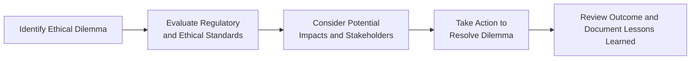

## 21.3 Registrant Code of Ethics

When you think about trust in the world of finance—especially in the ever-evolving derivatives market—do you ever wonder what keeps everything glued together? In my experience, there’s one simple concept that answers this question: ethics. If you’ve ever sat across a friend anxiously asking how they can be sure their financial advisor or derivative strategist is acting in their best interest, you might have paused and considered the significance of having a well-defined ethical framework. 

The Code of Ethics for registrants exists to protect clients, capital markets, and, frankly, the professionals themselves. This isn’t just fancy wording or some archaic rule set—these guidelines ensure that day-to-day decisions in the securities world come from a place of integrity, fairness, and accountability. Let’s dive into why this all matters, the key principles involved, and how real-world ethical dilemmas get resolved so that trust remains the bedrock of the Canadian derivatives market.

## Introduction

Picture this: you’re a freshly minted derivatives trader at a firm under the umbrella of the Canadian Investment Regulatory Organization (CIRO). You have the green light to handle client accounts, facilitate trades, and maybe even design complex hedging strategies. Everything is exciting—until you return home one evening and realize your day has been punctuated by small, subtle ethical crossroads. Perhaps you found yourself hesitating to disclose certain info to a junior colleague, or you overheard a conversation about a large block trade that hasn’t hit the market yet. In finance, these “micro-moments” can define your reputation and the trust clients place in you.

The Registrant Code of Ethics spells out the moral compass you’ll need. It reminds you—and all registered individuals—that acting with integrity, being honest with clients, protecting confidential info, and steering clear of conflicts of interest are non-negotiable. And no, it’s not just about being a good person; it’s about ensuring robust public confidence in Canada’s financial industry. 

## Ethical Principles in the Derivatives Industry

It might sound dramatic, but the derivatives industry’s smooth operation hinges on trust. There’s a reason people describe finance as an ecosystem: each participant (investors, market makers, regulators, clearing corporations, etc.) relies on another while playing their own vital role. Without a universally understood and respected ethical code, uncertainty, dishonesty, and fear would quickly tear that ecosystem apart.

• Integrity  
• Fairness  
• Confidentiality  
• Accountability  

These four cornerstones form the bedrock of ethics in finance. 

### Integrity

Think of integrity as doing the right thing even when no one is watching—like carefully verifying trade data well after hours because a slight error could harm a client’s position. It’s that quiet but powerful force ensuring you adhere to both the letter and spirit of regulatory requirements, even under time pressure or potential profit temptations. 

If you’re a registrant, it’s critical to remember that your entire professional life is shaped by your credibility. I recall, early in my career, hearing a story of a broker at a small firm who consistently “massaged” a few numbers on internal spreadsheets to boost his year-end bonus. Eventually, the minor manipulations were uncovered, leading to serious regulatory scrutiny, not just for him but the entire firm. A breach of integrity can escalate quickly to severe consequences.

### Fairness

The idea of fairness might feel intuitive. You treat people fairly; you expect others to treat you fairly. Yet, in a derivatives context—where spreads, contract specifications, and leveraged positions can get complex—fairness demands extra vigilance. For instance, front-running (which we’ll cover in more detail below) is a clear example of unfair treatment. It involves using privileged knowledge of a client’s intended order to profit personally—often to the detriment of the client and the overall market.

Fairness also applies to how you deal with your fellow registrants, your institution, and even your regulators. If something about a transaction doesn’t pass the “smell test,” it’s likely crossing the boundary of fairness. And yes, that means you sometimes must put a client’s interest ahead of your own business outcome or personal gain.

### Confidentiality

Information is currency in finance. From details on a client’s equity portfolio to pending government announcements that may shift bond yields, confidentiality is your shield against unethical or illegal practices like insider trading and market manipulation. Canadian regulators, especially under CIRO leadership, make it explicitly clear: you can only share sensitive info with authorized individuals and for the right reasons.

In daily practice, confidentiality might entail not forwarding a colleague’s email containing trade instructions to your personal account or ensuring that client statements aren’t left visible on a printing machine. Such simple steps can preserve a fiduciary relationship. 

### Accountability

Nothing can unravel public trust faster than the sense that “nobody’s in charge” or “nobody will ultimately be held responsible.” Accountability closes that gap. It’s a principle that says, “If I make a decision, I own that decision and its consequences.” Regulators like CIRO, the Canadian Securities Administrators (CSA), and various provincial commissions hold firms and individuals accountable, imposing sanctions, fines, or disciplinary actions when lines are crossed.

Accountability also extends to your moral obligations toward your profession. Are you willing to speak up if you witness unethical activity in your department? Are you prepared to recuse yourself from an account if you recognize personal or family conflicts that might compromise your objectivity?

## The Role of a Code of Ethics

If you’re wondering how these big-picture principles become day-to-day guidelines, that’s precisely where a Code of Ethics fits in. Each firm, in alignment with CIRO’s requirements, typically has its own code, ensuring that along with external laws and regulations, there’s an internal policy blueprint to help guide behavior.

A Code of Ethics does several important things:  

• Sets Standardized Guidelines: Everyone from new analysts to senior partners knows what’s expected—no ambiguity.  
• Reinforces Compliance Culture: When people see the Code of Ethics as integral and not just a “nice to have,” they’re more likely to internalize those values.  
• Provides Clarity in Challenging Situations: Real ethical dilemmas often pop up in the gray areas, like partial disclosures or borderline conflicts of interest. The Code helps shape the correct course of action.  
• Fosters Accountability and Transparency: A well-communicated code fosters an environment where staff members feel responsibility and are transparent about potential ethical concerns.  

Interestingly enough, it also acts as a symbolic contract with the public. If you talk to executives at major brokerages, they’ll often say, “Our Code of Ethics is a promise to clients, regulators, and each other.” And it’s more than just a fancy plaque on the wall—it’s embedded into daily operations, from compliance training modules to performance reviews.

## Potential Ethical Dilemmas in Everyday Practice

One of the top misconceptions is believing ethical pitfalls are only the spectacular, newsworthy ones—like Ponzi schemes or blatant insider trading. In reality, the biggest challenges often show up in those everyday micro-moments. Let’s explore a couple of these scenarios.

#### Conflict of Interest

Imagine you’re advising a client on a derivative strategy to hedge interest rate risk on their corporate bonds. You also happen to hold a significant personal position in a rate-sensitive bond fund that might gain from rising rates. Are you inadvertently guiding the client into a strategy that benefits you or your personal portfolio? Or perhaps your firm stands to earn higher fees from a particular product. The ethical code demands you disclose such conflicts and ensure the client’s best interests remain paramount.

#### Front-Running

Front-running is not only unethical; it’s illegal. Let’s say your biggest client is about to place a massive order for WTI crude oil futures. If you hop onto the trading platform to buy contracts for your personal account before the client’s large purchase drives up prices, that’s a textbook case of front-running. The Code of Ethics says you must never use privileged client knowledge for personal gain. 

Sadly, I’ve seen careers end abruptly over front-running allegations, with heavy fines and lifetime bans from the industry. It’s not worth jeopardizing your entire professional life and your firm’s reputation for a fleeting profit opportunity.

#### Misuse of Client Information

Even outside of front-running, the misuse of client data is a huge no-no. Perhaps you discovered a listing of your client’s stock holdings or tax situation while analyzing their current derivative hedges. Sharing or using that info in a casual manner—like bragging about your “inside scoop” to another potential client—can land you and your firm in hot water. The Code is crystal clear: keep privileged information under lock and key, only accessible where strictly necessary.

#### Incomplete or Misleading Disclosures

Let’s be honest: derivatives sometimes feel complicated. Clients rely on you to spell out risk exposures, margin requirements, and possible worst-case scenarios—and they trust that you’ll do it honestly. If you gloss over cost structures or manipulate performance graphs to “look good,” you’re violating both the code and the client’s trust. Regulators have ramped up oversight here. Did you know that CIRO’s code specifically underscores the importance of providing full and fair disclosure to clients? If not, well, now you do.

## Consequences of Ethical Misconduct

Failing to follow the Code of Ethics can carry hefty penalties, ranging from initial warnings and fines to revocation of registration. 

• Enforcement Actions: CIRO or provincial securities commissions can publicly censure individuals or firms, impose monetary penalties, or suspend trading privileges.  
• Disciplinary Measures: This can include losing your license or your ability to trade. Sometimes it’s a suspension for a specified period; sometimes it’s permanent.  
• Reputational Damage: The financial community is smaller than you think. Losing trust in Canada’s relatively tight-knit circle can quickly end your career.  

If you follow CIRO’s enforcement bulletins, you’ll see real-life examples of individuals who found themselves on the receiving end of disciplinary actions. Most will tell you that the reputational impact hurts as much, if not more, than any monetary penalty.

## Practical Tools for Ethical Decision-Making

So how do you ensure you’re always coloring inside the lines? Below is a simplified framework I’ve seen used at many reputable institutions:

1. Identify Ethical Dilemma: Does something feel “off”? If your gut says yes, that’s usually a strong hint.  
2. Evaluate Regulatory and Ethical Standards: Consult your firm’s Code of Ethics, CIRO guidelines, or relevant securities law.  
3. Consider Potential Impacts and Stakeholders: Who could be harmed, misled, or left out?  
4. Take Action to Resolve Dilemma: Elevate the matter to your compliance officer or relevant manager. If needed, seek legal counsel.  
5. Review Outcome and Document Lessons Learned: Ethical practice is also about continuous improvement.

## Real-World Considerations

It’s one thing to read about “doing the right thing,” but another to actually do it in real time. Let’s consider a scenario:  

A new client calls, wanting to place an options trade on a stock that’s rumored around the office to be an acquisition target. The official news hasn’t hit the wire. You do some digging and realize your firm has just completed a particular valuation report for the potential acquirer. You’re aware that if the acquisition rumor is true, the client’s stock option trade might see a major payoff. The question is: do you proceed quickly with the trade and stay quiet or do you clarify that you, as the registrant, could be in possession of material non-public info?

Ethics would demand you check with compliance immediately, confirm whether this is inside information, and potentially place restrictions on the account. This might frustrate the client if they fear missing out on huge upside. But your loyalty to the Code of Ethics and regulatory compliance must take priority.

## Tying it All to Canada’s Regulatory Framework

With the creation of CIRO (following the historic amalgamation of the Mutual Fund Dealers Association of Canada and the Investment Industry Regulatory Organization of Canada), the regulatory environment has become more streamlined. CIRO is effectively the single self-regulatory organization overseeing the entire investment dealership landscape, including mutual fund dealers, investment dealers, and marketplace activities. 

This unification reinforces that there’s no wiggle room: a single Code of Ethics standard applies across the board. Whether you’re dealing with sophisticated swap arrangements, exotic equity options, or vanilla futures, you’re still held to the same ethical baseline that fosters market integrity.

### CIRO Code of Conduct

You can find more specifics in the CIRO Code of Conduct (<https://www.ciro.ca/code-of-conduct>), which summarizes everything from conflicts of interest policies to personal trading rules. These guidelines emphasize that every registrant, from front-office staff to senior professionals, must abide by the highest ethical standards at all times. 

Remember that the Canadian Investor Protection Fund (CIPF), though independent from CIRO, also remains a key part of the ecosystem. If a firm becomes insolvent, CIPF works to protect client assets. You won’t find CIPF stepping into ethical missteps directly, but the spirit of maintaining market confidence ties right back to the ethical principles we’re discussing.

### Global Influences

It’s also worth mentioning the influence of global ethical frameworks like the CFA Institute Code of Ethics and Standards of Professional Conduct (https://www.cfainstitute.org). Even though the CFA Institute is an international body, many Canadian registrants hold CFA charters and practice these ethical standards daily. Essentially, the CFA ethics guidelines align closely with those of CIRO, though the exact language may differ.

## Non-Compliance and Accountability

Industry watchers often say that the effectiveness of a Code of Ethics depends on consistent enforcement. If people believe that unethical behavior will be swiftly and impartially sanctioned, they’re far less tempted to cut corners. Conversely, if an environment fosters the idea that “everyone’s doing it,” unethical conduct can spread quickly like a disease.

So if you ever wonder whether an isolated act (like front-running or sharing confidential info) might go unnoticed, I can assure you that regulators in Canada have become more adept at spotting red flags through advanced market surveillance technology. Tools that track unusual trading patterns in real time, integrated with big data analytics, make it exceedingly tough to engage in questionable trades without raising alarms.

## Best Practices for Maintaining an Ethical Workspace

• Keep Communication Open: Encourage colleagues to ask questions without fear of reprisal. If you see something suspicious, speak up.  
• Regular Self-Audit: Check your personal accounts, your daily tasks, and your advice to clients. Are there any hidden conflicts?  
• Ongoing Education: Attend ethics sessions, stay updated on changes to the Code or any new regulatory guidelines, and read case studies of enforcement actions.  
• Embrace Transparency: Document reasons for your trading decisions or advice to clients. That paper trail helps show that you’re following proper ethical procedures.  

This might sound basic, but in fast-paced trading environments, it’s easy to forget. Sometimes, just stepping out for a coffee break to revisit your code of ethics can keep you from drifting off track.

## Advantages of Upholding High Ethical Standards

People might ask, well, is there a real payoff to being ethical? Beyond the short answer—“You get to keep your job”—there are many tangible benefits:

• Client Retention: Clients appreciate honesty and thorough disclosures. Over time, it fosters loyalty.  
• Reduced Legal and Regulatory Risks: Ethical compliance significantly lowers the chance of running into costly lawsuits and regulatory sanctions.  
• Positive Firm Culture: A team that respects each other’s boundaries and acts with integrity typically experiences higher morale, collaboration, and retention.  
• Industry Reputation: Being known in the community as an ethical professional opens doors for career advancement, partnership offers, and new client referrals.  

From my perspective, it’s also beneficial to your mental health and sense of personal dignity to know you’re acting in a way that you can be proud of—no awkward secrets, no frantic second-guessing.

## Case Study: A Hypothetical Breach

Let’s say a junior trader, Danielle, overhears the head of derivatives mention that a major pension fund wants to unwind a billion-dollar position in government bond futures. Danielle quickly picks up some futures contracts in her personal account, anticipating that the subsequent large trade will push up prices. A couple of days later, the compliance team identifies the suspicious timing and volume of Danielle’s personal trades, cross-checking them with the pension fund’s large move. 

Outcome? Danielle not only faces immediate job termination but also a potential ban from working in the industry. This case highlights the unstoppable chain reaction: losing the certification to trade, dealing with enforcement actions from CIRO, paying fines, and being listed in official enforcement bulletins ensures that this unethical choice follows you wherever you go. 

## Summary

Acting ethically isn’t just about “being nice.” It’s integral to the functioning of capital markets, the reputation of the firm you work for, and your career longevity. The Code of Ethics encourages you to champion honesty, confidentiality, and fairness. Upholding these standards means you can sleep better at night, sure—but it also means building and preserving the public trust that underpins the entire Canadian and global derivatives industry. 

In the realm of advanced financial products—where the slightest rumor or arrangement can create or destroy millions of dollars—adhering to the Code is not simply a formality. It’s a professional mandate that ensures stability, fairness, and a level playing field for all participants.

## Glossary

• **Code of Ethics**: A formal document stating the ethical and professional standards expected of registrants. It serves as the framework for professional conduct, outlining responsibilities such as honesty, integrity, and diligence.  
• **Integrity**: Acting consistently with moral and ethical principles, even when unsupervised or when pressured by business interests.  
• **Front-Running**: Illegally trading based on knowledge of a pending order that will likely impact the price of the security or derivative, thereby securing personal gain before the market moves.  
• **Confidentiality**: Restricting access to client and firm-related information, ensuring it’s only shared with authorized personnel for necessary business operations.  

## Additional Resources

• **CIRO Code of Conduct**: <https://www.ciro.ca/code-of-conduct>  
• **CFA Institute Code of Ethics and Standards of Professional Conduct**: <https://www.cfainstitute.org>  
• **Ethics in Finance** by John R. Boatright (book offering case studies on ethical dilemmas in financial professions)  
• **Open-Source Financial Tools for Ethics Training**: Many firms develop or adopt custom e-learning modules and integrated compliance dashboards that track employee trades. Such tools can be explored on platforms like GitHub, where certain open-source compliance solutions exist.  

Feel free to explore these references if you’d like a deeper dive into ethics frameworks, case studies, or methods for improving your organization’s ethical culture. 

Remember, the next time you’re in a situation that tests your ethical stance—maybe just a small, everyday crossroads—take a moment to revisit the guiding principles. In the derivatives space, those small decisions often speak volumes about your dedication to fairness, honesty, and accountability.

---

## Sample Exam Questions: Ethical Conduct for Registrants in the Derivatives Industry



### Which principle emphasizes maintaining consistent moral standards, even when not directly supervised?

- [ ] Fairness
- [ ] Accountability
- [x] Integrity
- [ ] Transparency

> **Explanation:** Integrity is about doing the right thing consistently, whether or not someone is watching. It anchors the other principles by guiding personal and professional conduct in everyday situations.

### Which of the following scenarios most clearly represents front-running?

- [ ] An advisor disclosing a client’s intention to invest in a mutual fund to a third party.
- [x] A trader personally buying options knowing a client’s large order will drive the price higher.
- [ ] A compliance officer reviewing trading activity before the opening bell.
- [ ] A manager placing a trade at a client’s request after market close.

> **Explanation:** Front-running involves using privileged knowledge of a client’s upcoming large transaction to profit by trading ahead of that order, which is both unethical and illegal.

### In the context of a Code of Ethics, which of the following best captures the importance of confidentiality?

- [ ] Ensuring timely profit opportunities are shared with colleagues.
- [ ] Making sure valuable trade data is posted on public forums.
- [x] Restricting sensitive client information to authorized personnel only.
- [ ] Charging fees for privileged material.

> **Explanation:** Confidentiality is about limiting the distribution of sensitive or material non-public information solely to those with a legitimate business need. Sharing it elsewhere could constitute a violation of regulatory and ethical standards.

### Which principle ensures individuals and firms face consequences for unethical actions?

- [x] Accountability 
- [ ] Reciprocity
- [ ] Solidarity
- [ ] Compliance

> **Explanation:** Accountability means registrants are responsible for the consequences of their actions. In the Canadian regulatory framework, accountability helps discourage unethical practices by imposing clear, enforceable penalties.

### A derivatives representative learns that her firm is about to release a negative analyst report on a large publicly traded company. Which ethical action should she take if a client inquires about going long on that stock?

- [x] Seek immediate guidance from compliance to avoid using non-public info.
- [ ] Recommend a small position to “test the market.”
- [ ] Encourage the client to place a large buy order quickly.
- [ ] Buy the stock in her personal account, anticipating volatility.

> **Explanation:** Possessing material non-public information triggers immediate obligations to prevent conflict of interest and maintain confidentiality. Consulting compliance before making recommendations is the ethically correct approach.

### If a registrant fails to disclose a potential conflict of interest, which principle of the Code of Ethics is being most directly violated?

- [ ] Confidentiality
- [ ] Capabilities
- [x] Fairness
- [ ] Diligence

> **Explanation:** Failing to disclose a potential conflict of interest compromises the fairness principle, because undisclosed conflicts can bias recommendations and harm clients’ best interests.

### Which of the following is NOT a potential consequence of violating the Code of Ethics?

- [ ] Enforcement actions by CIRO
- [ ] Reputational damage within the industry
- [ ] Monetary fines and sanctions
- [x] Guaranteed future eligibility for higher-level positions

> **Explanation:** Violating the Code of Ethics often leads to enforcement actions, fines, and reputation harm. There’s no scenario in which unethical behavior guarantees eligibility for advanced positions; in fact, it typically destroys such opportunities.

### A registrant notices a coworker occasionally adjusting client trade records. As a best practice aligned with the Code of Ethics, the registrant should:

- [ ] Join the coworker but remain discreet.
- [x] Report the matter to a supervisor or compliance officer immediately.
- [ ] Confront the coworker privately and drop the issue if they refuse to stop.
- [ ] Wait until a quarterly compliance review to mention it.

> **Explanation:** Accountability means acting to maintain market integrity. Reporting suspicious or unethical activity is key, even if it concerns a colleague’s behavior.

### How do CIRO’s guidelines compare with global standards such as the CFA Institute Code of Ethics?

- [x] They align significantly, addressing integrity, fairness, and accountability in a similar manner.
- [ ] They are entirely different in all aspects.
- [ ] They focus only on front-running.
- [ ] They provide stricter rules than any other global entity.

> **Explanation:** While some regulatory language may differ, CIRO’s ethical principles strongly align with globally recognized standards like those of the CFA Institute, emphasizing much the same moral and professional obligations.

### True or False: Failing to abide by the Code of Ethics can result in enforcement actions and reputational damage for both the individual and the firm.

- [x] True
- [ ] False

> **Explanation:** Ethical missteps can attract regulatory scrutiny and tarnish the reputation of both the individual professional and their associated firm, possibly leading to significant penalties and loss of public trust.


