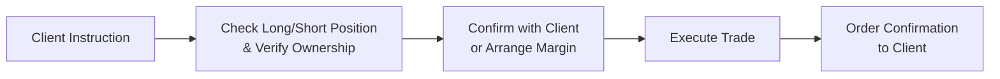

## 21.5 Trading and Sales Practices

Picture this: You’re sitting at your desk on a busy trading day, multiple screens are flashing quotes in rainbow-like arrays of red and green, and the phone rings. A client calls in to place an order to sell a put option. You quickly wonder… wait, does she actually have the underlying? Or at least, does she have the margin capacity to cover this position? The last thing you want is a compliance headache or, worse yet, an unauthorized trade situation that breaks all sorts of rules.  

This scenario is precisely why trading and sales practices are so important in derivatives. In the Canadian marketplace—under the regulatory responsibilities of the Canadian Investment Regulatory Organization (CIRO)—registrants must abide by rules to protect both themselves and their clients. Let’s unpack these responsibilities in an approachable way and see how fair, clear, and not misleading communication is the bedrock of trust in derivatives trading.  

Fair warning, I’ll share a few personal anecdotes along the way. Because, honestly, there’s nothing like real stories to illustrate how things can go very wrong—or very right—once trades start flying around at lightning speed.

  
Avoiding Pitfalls with Proper Trading Practices  
------------------------------------------------

It might sound basic, but one of the top priorities in trading is to make sure that the people who are placing trades actually have the proper assets (or margin capacity) to back them up. I remember once, early in my career, I almost processed an order where the client was “long” a stock that turned out only to exist on a watchlist. Oops. That client never held the physical shares, so we had to scurry to fix it before it got to the clearing stage. Lesson learned: verifying positions is your friend.

  
Verifying Long/Short Positions  
--------------------------------

One of the biggest responsibilities in derivatives trading is verifying the “long” or “short” position before executing any order.  

• Long Position Verification: A client who says, “I want to sell 500 shares of ABC,” must actually own 500 shares of ABC in their account, or they should be able to deliver them in time for settlement. Similarly, if a client wants to write a covered call, you—as the registrant—should confirm that the underlying security is available to cover the contract.  

• Short Position Verification: A short position arises when a client sells something they do not own. So they either need sufficient margin or a “borrow” arrangement in place. If they have a margin account for short sales, the firm must ensure the securities can be borrowed (if it’s an equity) or that they have the correct coverage for an option contract.  

In Canada, CIRO sets out margin requirements and maintenance obligations for these orders. Fail to follow them, and you’ll be on the hook for a big compliance infraction—and probably a few sleepless nights, too.  

Below is a simplified workflow for verifying client positions before executing trades:

As you can see, it’s not rocket science. But each stage in this chain is essential to prevent errors and subsequent compliance nightmares.  

Fair, Clear, and Not Misleading Communication  
----------------------------------------------

If there’s one gold standard in financial communications, it’s the rule that everything must be “fair, clear, and not misleading.” In practice, this means:  

• No Overselling: If a trading strategy is risky, you must explain the risk. Don’t withhold important cautionary details that could expose the client to hidden perils.  

• Balanced Discussions of Pros and Cons: Maybe you’re super enthusiastic about a covered call approach (because you love collecting premium, right?). However, your client needs to know that if the stock price skyrockets, they may lose out on unlimited upside.  

• Realistic Performance Claims: Don’t drop wild performance numbers without disclaimers, especially for highly complex derivatives.  

When physical documentation or digital communication is sent to clients, triple-check that the language is plain enough for them to understand. If it’s jam-packed with advanced Greeks references—Gamma, Theta, Vega, oh my—stop and think: “Would a typical retail client understand this?” If not, rework it.  

Accurate Evaluation and Recording of Orders  
--------------------------------------------

Every order you touch needs to be properly recorded with details such as:  

• Type of derivative (e.g., call option, put option, futures contract)  
• Underlying asset or index  
• Quantity (number of contracts or shares)  
• Price limit (or if it’s a market order)  
• Timing instructions (day order, good-till-canceled, fill-or-kill, etc.)  

I once made an innocent slip typing a “1” instead of a “10” for contracts. Let’s just say the difference between 1 call option and 10 call options can be the difference between an “Okay, that’s manageable” and a “Wait, I’m margin called?” meltdown. So always confirm details before sending the order to the trading desk.  

Unauthorized Trading: Don’t Even Go There  
------------------------------------------

Unauthorized trading is like the third-rail of compliance. If you start placing trades without the client’s explicit consent, or if you exceed the level of discretionary authority you’ve been granted, you are violating a fundamental rule.  

• Always Confirm: If there’s any doubt that the client wants to proceed with the trade—ask them. Email, phone call, written instructions, carrier pigeon—whatever method you choose, get evidence of their approval.  

• Document Everything: Suppose you get an email: “Go ahead and roll over my short put position for the next month.” Store that email so you can demonstrate the client’s explicit instructions if questions arise.  

• Watch Out for “Time-Sensitive” Excuses: Clients in fast-moving markets may say, “Just do it—I have no time to send an email.” In those cases, a quick recorded phone line or an electronic acceptance on your firm’s platform might suffice.  

Sales Practices: Promoting Properly  
-------------------------------------

Regulatory bodies, including CIRO and the Bourse de Montréal, keep a close eye on how derivatives are marketed. This includes advertisements, brochures, social media posts, and any other communications about your product or service offerings.  

• No Exaggerated Claims: Claiming “Guaranteed returns!” is a red flag that might get you in trouble. In fact, “guaranteed” is a loaded term requiring extremely careful use—especially in the context of derivatives.  

• Disclose Risks: If you’re marketing an exotic option that can yield fancy payoffs, mention the downside (which might be unlimited losses or complicated payoffs the average investor might not fully grasp).  

• Compliance Reviews: Many firms have a compliance review system for marketing materials. This includes disclaimers, disclaimers, and more disclaimers, particularly around hypothetical performance outcomes and risk exposures.  

Advertising guidelines from the Bourse de Montréal set the boundaries for acceptable promotional material. You can find the official rules for options advertisements here:  
• Bourse de Montréal Rules for Options Advertisement and Promotion: https://www.m-x.ca/reglements_en.php  

Monitoring Marketing Communications for Derivatives  
----------------------------------------------------

Speaking of promotional materials—this area demands specialized oversight to ensure even the best-intentioned promotions aren’t misleading. When it comes to derivatives, especially if you’re diving into complex combos or fancy yield strategies, you should:  

• Keep a Record of Every Marketing Piece: Whether it’s an email blast or a flyer at a seminar, your firm’s compliance department will want to see it.  

• Apply Consistency: If your marketing claims a strategy “manages risk,” define what that means and note any residual risk factors.  

• Bring On the Real-World Examples: Realistic examples or historical data showing up-market and down-market scenarios can help clarify risk levels for prospective clients.  

Risk Disclosures: The More, the Better  
---------------------------------------

A common pitfall is that new traders, or sometimes experienced ones, forget how quickly derivatives risk can escalate. So you want to lay it all out clearly in your disclosures:  

• Market Risk  
• Counterparty and Credit Risk  
• Liquidity Risk  
• Regulatory/Legal Risk  
• Complex Instrument Risk (for exotic derivatives)  

And here’s a tip: put it in plain language whenever possible. Nobody likes legalese or jargon that might as well be written in code.  

Samples and Tools for Compliance  
---------------------------------

If you’re looking for templates or guidelines to make your life a bit easier, consider these resources:  

• CIRO Trading Conduct Compliance Handbook. This outlines best practices under the current self-regulatory framework in Canada and is updated periodically at https://www.ciro.ca.  
• Bourse de Montréal’s “Rules for Options Advertisement and Promotion” (linked above).  
• ESMA Guidelines on product governance. Although these come from Europe, they often set the tone for global best practices, some of which have been echoed in Canadian policy.  

Gearing Up for an Evolving Regulatory Landscape  
-----------------------------------------------

The derivatives market is constantly evolving, with new products, new rules, and new players. Regulatory frameworks, especially around marketing complex derivatives and verifying client suitability, continue to tighten. This means staying on top of your continuing education requirements and reading those CIRO bulletins that land in your inbox.  

Personally, I’ve found that the times I’ve come across as most trustworthy to my clients were when I took the time to say, “Hey, you might hate to hear this, but there’s a chance that we could lose it all if the market moves against us.” That honesty, ironically, built trust. So consider adopting an “eyes wide open” approach, making sure your clients are always fully informed.  

Glossary (Key Terms)  
---------------------

Long/Short Position Verification:  
Ensuring the customer holds the underlying asset (long) or is properly authorized to short it (e.g., a margin account and locate/borrow facility for short sales) before executing the transaction.  

Unauthorized Trading:  
Executing trades in a client’s account without explicit client consent or discretionary authorization. This can lead to severe regulatory penalties, legal action, and reputational damage to the firm.  

Fair, Clear, and Not Misleading:  
A standard requiring that all communications with clients accurately represent products or services without distortion or omission of material facts.  

Conclusion and Encouragement  
-----------------------------

So, to wrap it up: if you’re in the business of derivatives trading in Canada, always remember these cornerstones—verify your client’s position, thoroughly document every detail, get the nod from your client before jumping into trades, and communicate risk fairly and transparently.  

It may feel like an extra layer of “paperwork” or “process,” but trust me, it’s worth it. At the end of the day, your clients will appreciate the openness, regulators will be satisfied with your compliance practices, and you’ll sleep better knowing you’ve done your job by the book.  

If you want to explore more, check out the CIRO Trading Conduct Compliance Handbook or the Bourse de Montréal’s official guidelines. A glance at global perspectives—like ESMA’s approach—can also provide insights into how best to design your product governance framework.  

Thanks for reading, and I hope you’ve gained (or refreshed) a sense of how crucial it is to keep everything above board—especially when dealing with specialized instruments like derivatives. Happy trading, and stay safe out there!

  
## Sample Exam Questions: Trading and Sales Practices in Derivatives



### Which of the following best describes the phrase "fair, clear, and not misleading" in client communications?

- [x] A legal standard requiring information to be balanced, accurate, and deception-free.
- [ ] A casual guideline that only applies to marketing emails.
- [ ] A standard that applies only to risk disclosures and not product promotions.
- [ ] A requirement solely for institutional clients, not retail clients.

> **Explanation:** "Fair, clear, and not misleading" is the cornerstone of best practices for all communications, ensuring clients receive balanced, honest information.

### Which of the following is considered a best practice before executing a short sale?

- [x] Verifying that the client’s account has sufficient margin or a borrow arrangement in place.
- [ ] Always placing the trade regardless of the client’s position.
- [ ] Waiting for the client to request a margin call rather than verifying up front.
- [ ] Executing the order immediately and verifying details post-trade.

> **Explanation:** Short selling requires ensuring that the client can borrow the underlying security or meet margin requirements prior to the trade.

### What is a key reason to confirm long or short positions before an order is executed?

- [x] To comply with CIRO and exchange rules that mandate accurate position verification.
- [ ] To market new derivative products to the client.
- [ ] To eliminate the need for any further margin.
- [ ] To avoid paying interest on the short position.

> **Explanation:** Verifying positions ensures you meet regulatory obligations and minimizes the risk of failed trades or compliance infractions.

### How can an advisor avoid unauthorized trading?

- [x] Obtain written or recorded verbal consent from the client before placing any trades.
- [ ] Place trades without client consent but inform them within 24 hours.
- [ ] Execute trades only after obtaining CFO approval.
- [ ] Disregard the client’s instructions if the trade is small.

> **Explanation:** The regulator’s priority is client protection. Explicit client authorization, documented in some form, is essential.

### Why is it important to disclose the downside risk when describing derivative strategies?

- [x] Because it ensures balanced communication and compliance with regulatory standards.
- [ ] Because it makes the strategy seem more attractive.
- [x] Because it helps clients make informed decisions.
- [ ] Because it reduces the maximum loss potential.

> **Explanation:** Such disclosure is about honesty and protecting clients by providing a clear understanding of potential losses. This is a requirement under fair, clear, and not misleading communications.

### What is one possible consequence of failing to meet margin requirements for a short position?

- [x] A forced buy-in or immediate cover of the short position.
- [ ] Increased market liquidity.
- [ ] Reduction of the maximum loss potential for the trade.
- [ ] Automatic reversal of the short position into a long position by the exchange.

> **Explanation:** If a short seller fails to maintain margin, the broker may force a buy-in to cover the position, preventing additional risk to the firm and the market.

### Which statement is true regarding "long" and "short" position verification?

- [x] Even if a client claims to own a security, the advisor must verify the position before execution.
- [ ] Verification is only necessary when the client is new.
- [x] Verification is a consistent requirement for each order.
- [ ] Verification is optional if the client verbally confirms the position.

> **Explanation:** Client instructions must be verified consistently, ensuring the customer is indeed long or authorized to go short.  

### According to best practices, which of the following should be included in every order record?

- [x] Quantity, specific derivative, pricing instruction, timing instruction.
- [ ] Only the product name and a final price.
- [ ] Client’s net worth and employment status.
- [ ] The client’s unrelated existing portfolio holdings, including real estate.

> **Explanation:** Proper order entry requires capturing product type, quantity, price/time instructions, and associated order details to comply with regulatory standards.  

### Which of the following marketing approaches might raise a red flag with CIRO?

- [x] A brochure claiming "guaranteed returns" without elaborating on any risks.
- [ ] A disclaimer stating potential risk and referencing official resources.
- [ ] A thoughtful, balanced presentation detailing potential gains and losses.
- [ ] An accurate explanation of the differences between covered calls and naked options.

> **Explanation:** Using language like "guaranteed returns" without discussing risks goes against the principle of providing fair, clear, and not misleading information.

### True or False: It is acceptable to execute trades for a client’s account first and inform the client about them later as long as the trade is profitable.

- [x] False
- [ ] True

> **Explanation:** Unauthorized trading is never acceptable, regardless of the outcome. All trades need explicit client consent in advance.


