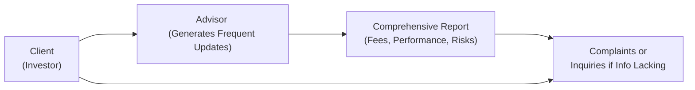

## 21.8 Client Relationship Model (CRM) Enhancements for Derivatives

There’s something pretty exciting (and maybe a little intimidating) going on in the world of Canadian finance: The push for more transparent and client-focused practices through ongoing updates to the Client Relationship Model (CRM). These changes—often dubbed CRM1, CRM2, and future enhancements—aim to help investors better understand fees, performance reporting, and conflicts of interest. Now, that’s all great, but if you're dealing in derivatives—and let's be honest, derivatives can feel pretty complex—a strong CRM framework is extra crucial. In a nutshell, more transparency benefits everyone: clients, advisors, and even the marketplace as a whole. 

Below, we’ll dig deep into how CRM specifically applies to derivatives, highlight the cost structures and embedded complexities of these instruments, and consider how to properly disclose them. We’ll also look at robust “Know-Your-Product” (KYP) processes, the nuance of performance reporting, and real-world cases that demonstrate why you should never take CRM lightly.

### Why CRM Matters in Derivatives

It’s easy to assume that CRM requirements (like clearly disclosing fees and performance) only matter for traditional, straightforward investments—like stocks or bonds—but that couldn’t be further from the truth. Derivatives often come with unique or unusual cost structures: you might see option premiums, margin interest, embedded leverage costs, or spreads that vary depending on market volatility. Because these products can be less intuitive, regulators have emphasized that transparency and clarity in disclosure are not just “nice to have,” they are mandatory.

In simpler terms, if your client doesn’t fully grasp how derivatives generate profits and losses—or all the fees involved—there’s a risk of serious mistrust or even formal complaints. And from a compliance perspective, inadequate CRM disclosures for derivatives can flag you for some unwelcome regulatory attention. Firms are expected to anticipate that complexity and go the extra mile in explaining it. 

### Phases of CRM: From Basics to Future Enhancements

Historically, the goal of CRM was to set up a bedrock of trust and clarity between advisors and clients. If we do a quick recap:

• CRM1 (the earliest phase) introduced rules to clarify relationship disclosure (e.g., building a standard for how advisors describe themselves, their services, and conflicts).  
• CRM2 brought in significant changes, requiring more detailed fee and performance reporting. Clients got to see exactly how much they paid in commissions or fees, as well as more standardized account statements.  
• Ongoing/future enhancements (sometimes called CRM3, though informally) expand on these efforts by focusing on deeper cost breakdowns and incorporating more frequent and client-friendly disclosure, particularly around more complex financial instruments like derivatives.

Regulators, including the Canadian Securities Administrators (CSA) and the Canadian Investment Regulatory Organization (CIRO), have emphasized that more frequent and more nuanced reporting is on the horizon. That means itemizing fees in real-time or near real-time, providing position-based commentary on derivatives, and covering the intricacies of margin calls or option premiums. Firms that adopt these improvements early are typically the ones that earn their clients’ long-term trust and loyalty.

### Complex Cost Structures and Fee Transparency

Let’s face it: derivatives can be complicated. Options might have both premium cost and commission. You could have embedded costs if you’re trading certain index futures spreads. Swaps and forward agreements have ongoing carry costs. Part of CRM’s evolution is aimed at making these fees more visible. 

Remember the days when you’d open your monthly statement and see a single line item for “commission” but no clue how that was calculated for an options position? Or a client might say, “I see an $X in fees, but I’m not sure what it’s for.” Under a robust CRM, those days should be behind us.

“Fee transparency” means that your firm should provide an easy-to-digest breakdown of:

• Commissions: Both standard brokerage commissions and any special fees for advanced or complex option strategies.  
• Embedded financing costs: For leveraged derivatives (like certain futures positions requiring margin or an FX forward including a forward point differential), show how interest rates or other financing levers factor in.  
• Spreads: If you’re quoting an option or future, the tightness (or wideness) of the bid-ask spread can be a cost in itself—clients should be made aware.  
• Clearing fees and exchange fees: Derivatives trades often involve more specialized clearing procedures (like with the Canadian Derivatives Clearing Corporation, CDCC). That might add another cost.  

In practice, you might disclose these items on each trade confirmation or produce an itemized monthly statement. The goal is to ensure that your clients never find themselves guessing: “Why did my account decrease more than the actual market movement?”

### Performance Reporting and Frequent Updates

Another big chunk of CRM is what we call “performance reporting.” With derivatives, performance calculations can be tricky because open positions can have unrealized gains or losses that flip quickly in response to movements in the underlying interest. If you’re advising clients to hold a complex multi-leg option strategy (like a bull call spread plus a short put), it’s your job to ensure they receive performance snapshots that adequately capture each leg’s contribution to their overall return—or lack thereof.

Regulators are nudging advisors to provide more frequent (possibly monthly or even weekly) performance updates for derivatives. These can include:

• Realized gains/losses: When an option is closed or expires in the money or out of the money, highlight that in a statement.  
• Unrealized gains/losses: The current mark-to-market of any open positions.  
• Fees or charges to date: Precisely how fees have incrementally impacted the net returns.  
• Potential margin implications: If there are maintenance margin requirements or possibility of additional calls.  

It might sound like a lot, but when you break it down in a thorough performance statement, clients can breathe easier. They’ll see, for example, that the reason their margin requirement just jumped is because implied volatility spiked in the underlying, or that they’ve actually made a net profit on each of the last five iron condors—even after commissions and fees. 

### The Importance of Suitability

CRM isn’t just about fees and performance. It’s also about ensuring that advisors place their clients in derivatives that are truly suitable for them. Unsuitable derivatives trades can result in big losses, which of course leads to disappointed (and perhaps litigious) investors. Under CRM rules, you have to:

• Conduct a thorough “Know-Your-Client” (KYC) analysis. Evaluate the client’s risk tolerance, investment goals, time horizon, and experience.  
• Match the product’s risk profile with the client’s. If a client has never traded an option before, it’s generally not a good idea to jump them into a short strangle strategy that carries unlimited risk. Right?  
• Document all your rationale. If the client wants a leveraged speculation in a futures contract, you should be able to show that the client’s personal circumstances, risk capacity, and strategy preference are in line with that.  

When you map KYC to an appropriate product through a robust “Know-Your-Product” process, you keep your client from unexpected losses—and keep yourself out of trouble with regulators and potential lawsuits.

### KYP (Know-Your-Product) Done Right

KYP is critical to a derivatives-based business. Advisors must fully understand, in detail, how each recommended derivative works. For example:

• If you’re pitching a protective put, you should be ready to explain that the premium is the “cost of insurance,” how it might eat into potential upside, and the possibility for early exercise or assignment (depending on the underlying).  
• If you’re placing a client in a commodity swap, you must explain how the floating or fixed payments are determined, the effect of basis risk, and the credit risk of the counterparty.  

Knowing your product means you:

• Research the typical scenarios in which the derivative might be most beneficial.  
• Evaluate how it behaves in extreme market conditions (imagine a wild volatility spike).  
• Keep up to date on new or emerging derivative structures—like ESG-linked swaps or crypto derivatives.  

When you truly “know your product,” you’re in a better position to explain the complexities to your client. And that’s precisely what CRM is about—transparency, clarity, and trust.

### Building Trust through More Frequent Communication

An often-overlooked aspect of CRM is that it encourages frequent, plain-language communication. Rather than sending a labyrinth of data or disclaimers, send clear, short bullet points about why the value of a particular option is changing. If implied volatility is surging and that’s beneficial for your client’s short put option, break that down simply. Or if a cross-currency swap is losing ground because of interest rate differentials, say so in a direct and approachable manner. 

This fosters trust. Personally, I remember a time when I (as an investor) received a statement with a bunch of line items for margin interest plus option assignment fees, and I had literally no idea how they were all interrelated. Only after a conversation with my broker did it finally click. But guess what? If we had a better CRM approach in place, all those details would have been front and center from the get-go.

### Frequent Derivatives Reporting: A Quick Visual

Here’s a simple diagram illustrating how frequent reporting might flow between a client, the advisor, and the regulatory environment:

In this diagram, you can see how the client and the advisor exchange ongoing information, which feeds into a comprehensive report about the portfolio’s performance, fees, and risks. This same information, if not properly disclosed or if poorly communicated, can lead to the client contacting regulators—showing just how important it is to get that reporting right.

### Pitfalls of Non-Compliance and Inadequate Disclosure

If you think that CRM guidelines are merely “best practice” suggestions, think again: ignoring or being lax about them can trigger regulatory scrutiny. There have been cases where:

• Clients were never informed of the potential for assignment on a short-call position. The stock soared, and they were assigned at well below market value. The client discovered after the fact that such a scenario existed.  
• Clients misunderstood the total cost structure on certain commodity futures trades, incurring repeated fees that ate into gains.  
• Advisors recommended overly aggressive derivative strategies to clients with minimal risk tolerance, which triggered both losses and formal complaints.  

In each of these scenarios, a robust CRM approach—where the advisor clearly spelled out the “what,” “why,” and “how much it costs”—would have prevented the fiasco.

### Best Practices for CRM in Derivatives

• Provide layered disclosures: Possibly, start with a short summary (key bullet points) of fees and performance updates, then offer a link or reference to a deeper breakdown.  
• Use real-time or daily updates, especially in volatile markets: A weekly or monthly statement often isn’t enough for the fast-moving derivative landscape.  
• Offer educational materials: If your client is new to derivatives, a quick video or a short PDF describing the basics can help them interpret the performance statements and fees.  
• Encourage clients to ask questions: So many misunderstandings stem from clients being too embarrassed or rushed to seek clarity. By fostering an environment where clients feel comfortable asking questions, you adhere to the spirit and letter of CRM rules.  

### Case Studies and Real-World Examples

• An energy hedging scenario: Suppose a client is a small business treasurer managing fuel costs. They’re new to futures contracts but want to hedge rising fuel prices. Under CRM, the advisor must do more than just place a trade. They should walk the client through all possible outcomes, fees (exchange fees, potential margin calls, settlement approach), and ongoing performance updates. Experiencing no “bill shock” or “loss shock” when settlement hits is a direct result of these disclosures.  
• The mismatch scenario: Another example might be a retiree with a relatively low risk tolerance who seemed enthusiastic about learning options. Without properly applying KYC and KYP, the advisor recommended short puts with substantial margin. The market made a fast downward move, incurring losses that far exceeded the retiree’s comfort zone. Lawsuit ensued. The firm faced fines for failing to provide CRM-compliant disclosures. That story, by the way, is repeated in various forms across investor protection clinics in Canada.  

### References and Resources

The push for better CRM compliance is both a regulatory and a market practice effort. If you’d like to read up on the official sources, here are a few:

• CSA’s Client Relationship Model Guidance:  
  https://www.securities-administrators.ca/resources/client-relationship-model/  

• CIRO’s CRM Resources:  
  https://www.ciro.ca/crm-documents  

• Investor Protection Clinics (e.g., Osgoode Hall Law School Investor Protection Clinic):  
  Explore documented case studies on how derivatives misrepresentations have impacted retail clients.  

• “Investment Client Relationship Management in Canada” by Guy David Cooper (Thomson Reuters):  
  A more in-depth legal and regulatory perspective on how CRM has evolved.  

Don’t forget, as of 2023 the new Canadian Investment Regulatory Organization (CIRO) oversees both investment dealers and mutual fund dealers. Everything we’ve said here about CRM compliance—especially for derivatives—falls under its purview.

### Concluding Thoughts

In Canada’s derivatives sphere, effective Client Relationship Model compliance is more than a box-ticking exercise. It’s a chance to build and maintain trust with clients who may be venturing into complex territory. Consider it your chance to educate, to build meaningful relationships, and to allow for transparency in fees, performance reporting, and suitability. 

Frankly, derivatives can be powerful tools, but they come with formidable risks. With strong CRM disclosures, robust KYP processes, and continuous client education, advisors and registrants can help ensure that derivatives become a constructive addition to a client’s portfolio rather than a cause for confusion, mistrust, or complaint. If we do this right, we all stand to gain: clients feel informed and secure; advisors build a strong reputation for diligence and honesty; and the Canadian financial marketplace continues to thrive with fairness and integrity.

-----

## Sample Exam Questions: Client Relationship Model (CRM) Enhancements in Derivatives



### Which of the following best describes why CRM is particularly important for derivatives trading?

- [x] Because derivatives often have complex cost structures and can generate sudden, large gains or losses.
- [ ] Because CRM only applies to traditional equities, not sophisticated products like derivatives.
- [ ] Because derivatives costs are always lower than mutual fund costs and require separate reporting.
- [ ] Because CRM does not apply to any futures or options trades.

> **Explanation:** Derivatives can have multi-layered costs (premiums, commissions, margin interest, etc.) and carry substantial risks. CRM helps ensure transparency and suitability, which is essential where complexity abounds.

### Which statement is the best example of “fee transparency” in a derivatives trade confirmation?

- [x] An itemized breakdown showing commissions, option premiums, exchange fees, and any embedded leverage costs.
- [ ] A one-line summary labeled “fees,” without a breakdown.
- [ ] Disclosure of only the commission but no reference to clearing fees.
- [ ] A single amount called “net cost,” lumping in commissions, spreads, and financing charges.

> **Explanation:** The point of fee transparency is to show investors each individual cost, including commissions, embedded leveraging costs, and clearing or exchange fees. An itemized list provides clarity.

### A client with minimal risk tolerance wants to engage in an uncovered (naked) call strategy anyway. How does CRM affect the advisor’s actions?

- [x] The advisor must explain the significant risks, ensure suitability is assessed, and document the conversation thoroughly.
- [ ] The advisor can proceed without discussion because the client explicitly asked for it.
- [ ] The advisor should automatically place the trade without verifying the client’s risk capacity.
- [ ] The advisor must assign the trade to a third party to avoid risk.

> **Explanation:** Under CRM requirements, the advisor must ensure the product is suitable, clearly explain all costs and risks, and maintain adequate documentation. Allowing a high-risk trade when the client has low tolerance could spark serious regulatory and compliance issues.

### In the context of derivatives, how do regulators generally view the importance of frequent performance reporting?

- [x] Regulators increasingly favor frequent and detailed performance statements, especially for complex instruments.
- [ ] Regulators prohibit frequent reporting to avoid confusing retail clients.
- [ ] Regulators encourage only annual derivative updates due to complexity.
- [ ] Regulators require daily phone calls to confirm each trade’s real-time performance.

> **Explanation:** CRM enhancements and modern best practices emphasize providing more frequent and more detailed statements, ensuring clients with open derivative positions are always aware of emerging risks and evolving performance.

### Which of the following describes a key purpose of the “Know-Your-Product” (KYP) rule in a derivatives context?

- [x] Advisors must fully understand the product’s features, risks, and complexities before recommending it to a client.
- [ ] Advisors should only rely on client’s knowledge and refrain from explaining product features.
- [ ] Advisors must track real-time quotes but not necessarily explain them.
- [ ] Advisors apply KYP only when dealing with large institutional accounts.

> **Explanation:** KYP requires that advisors study and understand each product thoroughly. In derivatives, knowing how an option or swap behaves is crucial before recommending it to clients.

### Which of the following is NOT typically considered a “hidden cost” in derivatives trading under CRM?

- [x] Government sales tax on groceries.
- [ ] Wider bid-ask spreads during volatile market conditions.
- [ ] Clearing and exchange fees for futures and options.
- [ ] Embedded financing costs for margin.

> **Explanation:** Government sales tax on groceries is completely unrelated to derivatives trading. The rest are legitimate hidden or indirect costs that must be disclosed to clients.

### Which scenario best demonstrates the benefits of a robust CRM approach in a derivatives context?

- [x] A client receives timely, itemized statements of short put positions, including realized and unrealized gains, commission costs, and margin implications.
- [ ] A client is told nothing until the end of the year when they receive a minimalistic annual statement.
- [ ] A client’s statements merge all trades into a single equity section with no mention of derivative risks.
- [ ] A client only learns of margin calls by searching a third-party website.

> **Explanation:** A robust CRM approach ensures that clients receive clear, detailed disclosure of all derivative trades, costs, and associated risks on a regular basis.

### Which of the following best illustrates a “case study” scenario where inadequate CRM disclosures led to issues?

- [x] An advisor failed to mention potential margin calls on short futures, and the client saw surprise withdrawals from their account.
- [ ] A client who deeply understands derivatives experiences no miscommunications with the advisor.
- [ ] A client invests in a bond and is told exactly how the coupon is paid.
- [ ] A regulator publishes guidelines that are promptly followed by the brokerage.

> **Explanation:** In the example, the deficiency in explaining margin calls resulted in the client’s confusion and dissatisfaction. That scenario leads to a breach of CRM requirements and sows distrust.

### Which of these is an example of layering communication in derivatives under CRM?

- [x] Sending a short bullet-point summary for quick reference plus a detailed statement for deeper analysis.
- [ ] Relying exclusively on phone calls with no written component.
- [ ] Only providing a dense technical report that is too long to read.
- [ ] Mailing an annual, legalistic, 100-page statement with no summary.

> **Explanation:** Layering means providing an easy summary (the “short version”) and also offering a more comprehensive breakdown for clients who want details. This approach meets diverse client needs and fosters transparency.

### True or False: Derivatives can actually benefit from CRM enhancements because it creates more transparency around unique cost structures and risk profiles.

- [x] True
- [ ] False

> **Explanation:** Absolutely true. Derivatives feature sometimes complicated cost and risk profiles, making regulatory-driven transparency and communication particularly beneficial for all parties.


