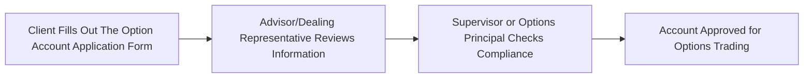
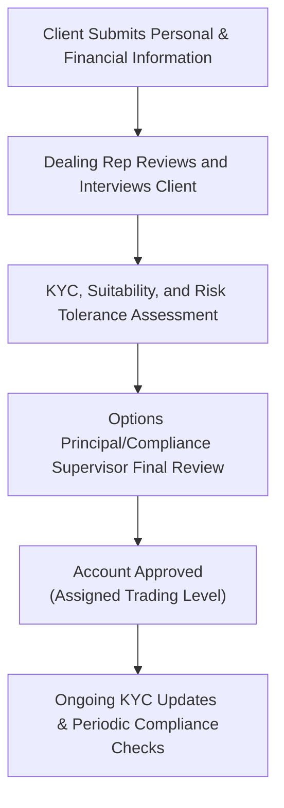

## 22.1 Completion and Approval of Option Account Application Forms

If you’re brand-new to options trading—maybe you’ve heard about their incredible versatility or you’re excited about leveraging them in your investment strategy—there’s a crucial step you can’t skip: completing and getting approval for your Option Account Application Form. This might sound dry at first glance, but trust me, it’s foundational to keeping you aligned with Canadian regulatory standards and, ultimately, to protecting your best interests as an investor. I once had a friend who jumped straight into options trading without fully completing his application, and wow, did that ever cause confusion and delays. So let’s break it down step by step and see why this form is so important.

### Understanding the Option Account Application Requirement

Before anyone can even think about executing an options trade, a particular piece of paperwork called the Option Account Application Form needs to be submitted to your investment firm. This form may look a bit intimidating because it requests quite a lot of detail: personal information (name, address, date of birth), your job situation, your financial status (annual income, net worth, and so forth), and your past experience in investing. Some folks wonder why financial institutions want all this personal data. “It’s private—why does my advisor need to know how much I make?” Well, the reason is simple: the Canadian Investment Regulatory Organization (CIRO) requires dealers to assess your suitability for options trading. If you’re investing in something as potentially complex as options, your advisor needs to know your background so they can guide you responsibly. 

### Gathering Client Information: The KYC Journey

The term “KYC” stands for “Know Your Client,” and it’s like the ultimate handshake between you and your advisor. In Canada, and particularly under CIRO’s watch, getting to know you is more than just polite conversation; it’s a regulatory must. This is how it typically goes:

• First, you provide your basic personal details: name, address, date of birth—this verifies who you are.  
• Then, you get into your financial picture: your annual income, approximate net worth, your household’s total assets, and any outstanding liabilities.  
• Next, your advisor wants to know your investment objectives (for example: growth, income, speculation) and, crucially, your risk tolerance.  

This might feel a bit like filling out a job interview plus a personal finance quiz all rolled into one. But that’s the nature of the KYC process. It protects you by ensuring your trades match your financial circumstances. That’s also why your firm might ask for proof of your identity (like a copy of your driver’s license) or for updated KYC details if it’s been a while since they last saw your file.  

By building this profile, the firm can spot if you’re about to dive into a strategy that seems way too risky for your finances. Let’s say you have a relatively small investment account and you mention in your form that you have zero experience with complex derivatives. Well, that might raise a red flag if you later request approval to do advanced multi-leg strategies requiring very high margins.  

### Suitability, Risk Tolerance, and the Review Process

Suitability is at the core of every recommendation your dealing representative or advisor makes. It basically says: Do these options trades actually make sense for you? If you’re sitting on a minimal savings cushion or have short-term investment goals, highly leveraged option strategies may not be suitable. 

When it comes to risk tolerance—often defined as “low,” “moderate,” or “high”—options can be tricky. Buying a single call option might be a moderate-risk approach if you use only a small percentage of your overall portfolio. Writing “naked calls,” on the other hand, can be significantly riskier. So your KYC form needs to reflect a risk tolerance that lines up with the strategies you’re looking to implement.

After the dealing representative gathers all of your information, the next step is usually a thorough review by a supervisor or an Options Principal. This person’s job is to ensure the account is being set up in compliance with firm policies and CIRO rules. Think of them as an internal gatekeeper who confirms all the i’s are dotted and the t’s are crossed.

### The Role of the Options Principal & Supervisory Approval

Almost every reputable Canadian investment firm dealing with derivatives has a designated Options Principal. This individual is often a senior staff member with in-depth knowledge of options markets, margin requirements, and regulatory guidelines. Their approval is critical—if they see something off or incomplete in your application, it’s likely they’ll kick it back for revisions or clarifications. This gatekeeping process might seem cumbersome, but it serves as a protective mechanism for both the client and the firm.

A typical workflow might look like this:

Once this chain is complete, you’re fully set to begin trading options—within the scope of your approved level, of course. Many firms have “levels” of options trading approval. Level 1 might let you buy calls and puts, while higher levels let you write uncovered options or engage in multi-leg strategies. The higher the level, the stricter the review, typically.

### Additional Documentation & ID Verification

Don’t be surprised if your firm asks for more documentation beyond the application itself. This can include:  
• Identification verification (driver’s license, passport).  
• Bank statements to confirm your liquid assets.  
• Tax returns for the past year to check your income (though not every firm goes this far).  
• A signed “derivatives trading agreement” or a specific contract acknowledging you understand the risks.  

All these extra steps exist for one reason: ensuring that the details on your application actually match reality. If you mention that your net worth is $1 million but you’re applying from a brand-new checking account with $500, the firm may have a few questions.  

### Real-World Examples & Potential Pitfalls

Ever heard the phrase, “It’s not what you don’t know that gets you into trouble, it’s what you think you know for sure that just ain’t so”? I once met an enthusiastic investor who checked “high” for risk tolerance, hopeful that he could gain approval to trade uncovered options. But after the Options Principal reviewed his income and net worth, they determined that a truly “high” tolerance was inconsistent with his limited assets and short-term liquidity needs. The application was updated to reflect a moderate risk tolerance, and he was approved only for basic buying of options. He wasn’t thrilled initially, but he later avoided a margin call scenario that might have caused significant losses.

Another pitfall? Letting your application become outdated. KYC is a living process, not a “one and done” event. If your life circumstances change—maybe you lose your job, get married, inherit wealth—your advisor should update your file. Otherwise, the strategies recommended to you might no longer be aligned with your actual situation.

### A Broader Look at CIRO’s Role (and the Path From MFDA/IIROC to CIRO)

Historically, the Mutual Fund Dealers Association of Canada (MFDA) and the Investment Industry Regulatory Organization of Canada (IIROC) set the guidelines for how investment firms opened accounts, enforced compliance, and supervised trading. As of January 1, 2023, these two organizations have amalgamated to form the Canadian Investment Regulatory Organization (CIRO). Whenever you see references to the MFDA or IIROC now, they’re purely historical. CIRO carries forward their combined mandates, effectively overseeing all investment dealers, mutual fund dealers, and market integrity for equity and debt marketplaces across Canada.

### A Quick Word on Discretionary Accounts

For some clients pursuing more advanced strategies—especially if they lack time or specialized expertise—there might be an option (no pun intended) to open a discretionary account. This means the advisor or portfolio manager can make trades on your behalf without your express consent for each trade. In such cases, the Option Account Application Form (and all KYC details) become even more critical. Since you’re effectively entrusting your advisor with the freedom to act, your risk tolerance level must be crystal clear, and the firm’s supervisory controls become even more stringent.

### Best Practices for Accurate Completion

• Double-check your financial info: Make sure the numbers you provide (net worth, income, liquid assets) are as up-to-date and precise as possible.  
• Be honest about investment experience: If you’re brand-new to options, say so. There’s no shame in it, and it helps the advisor tailor strategies to your actual skill level.  
• Keep references handy: Statements from mutual funds, bank accounts, or prior brokerage accounts can help fill in the forms accurately.  
• Ask questions: If there’s something you don’t understand—like how the firm calculates margin or why they need certain personal details—just ask.  

### Another Look at the Process (Extended Diagram)

Let’s take a more detailed look at how the entire process interconnects with the broader compliance steps inside an investment firm:

Notice that it’s not purely linear. If something doesn’t line up during the final review, it might get sent back to the dealing rep or the client for more clarity.

### References for Further Exploration

If you want to explore official regulations or deepen your understanding of the compliance framework, here are some great places to start:

• [CIRO Regulations and Notices](https://www.ciro.ca/) – The latest place to find updated regulations for investment dealers and derivatives.  
• [National Instrument 31-103](https://www.bcsc.bc.ca/securities-law/law-and-policy/instruments-and-policies/3-registration-requirements-and-restrictions/31-103) – Governs registration requirements, including KYC and suitability obligations.  
• [GNUCash](https://www.gnucash.org/) – An open-source portfolio and personal finance management tool you can use to track your options transactions.  
• “The Options Playbook” by Brian Overby – A friendly resource for beginners wanting to sink their teeth into practical options strategies.  
• “KYC Best Practices for Canadian Investment Firms” – An article available through the Canadian Securities Administrators (CSA) website that further clarifies how to handle KYC effectively.

### Closing Thoughts

Completing the Option Account Application Form shouldn’t feel like a bureaucratic hurdle; it’s actually your first layer of protection. By giving a clear picture of your finances, your advisor (and the entire compliance structure behind them) can guide you toward option strategies suited to your goals and your appetite for risk. If all goes well, you’ll be engaged in the wonderland of options trading with the peace of mind that you’re on the right side of the regulators—and your own wallet.

Anyway, let’s wrap up: thoroughness and honesty in completing your Option Account Application Form are your best allies. Your net worth, risk tolerance, and experience level truly matter. After all, no one wants to be blindsided by a margin call or an options strategy that doesn’t mesh with their actual financial standing. With that in mind, let’s now test your knowledge and see how well you grasp the details of completing and approving an option account application.

---

## Sample Exam Questions: Option Account Approvals, KYC, and Suitability



### When opening an options account, what is the primary purpose of collecting detailed personal and financial information from the client?
- [ ] To market the client’s data to third-party vendors.
- [x] To assess the client’s suitability and compliance with CIRO regulations.
- [ ] To prequalify the client for margin loans or payday advances.
- [ ] To ensure immediate approval for discretionary account status.

> **Explanation:** Compliance with CIRO’s KYC requirements is crucial. The detailed personal and financial data ensure that the client’s risk tolerance, experience, and financial resources align with the level of options trading they plan to undertake.

### Which regulatory body in Canada currently oversees investment dealers, mutual fund dealers, and market integrity for derivatives markets?
- [ ] IIROC
- [ ] MFDA
- [ ] TMX
- [x] CIRO

> **Explanation:** The Mutual Fund Dealers Association of Canada (MFDA) and the Investment Industry Regulatory Organization of Canada (IIROC) amalgamated into the Canadian Investment Regulatory Organization (CIRO) on January 1, 2023. CIRO is the current national self-regulatory organization in Canada.

### What role does the Options Principal typically play in options account approvals?
- [ ] No involvement; only the dealing representative grants approvals.
- [x] They are responsible for the final review and compliance checks before granting approvals.
- [ ] They only handle marketing for advanced options strategies.
- [ ] They automatically approve any account that includes margin trading.

> **Explanation:** The Options Principal is a specialized role focusing on supervising options accounts. They conduct final reviews to ensure regulatory requirements and internal policies are satisfied before approving an account.

### If a client’s financial situation changes significantly after opening an options account, what should happen?
- [x] The client’s KYC profile should be updated, reassessing suitability.
- [ ] Nothing, as the original application remains valid indefinitely.
- [ ] The account is automatically closed.
- [ ] The client is not permitted to trade anymore.

> **Explanation:** KYC is an ongoing process. Any significant change in a client’s financial or personal situation can affect risk tolerance and suitability, so the client’s file and trading privileges should be re-evaluated.

### A client indicates “high risk tolerance” on their application but has only minimal investment assets. The Options Principal might:
- [ ] Approve all uncovered option strategies immediately.
- [x] Clarify or correct the application to align with realistic financial parameters before deciding on approval.
- [ ] Reject the application without discussion.
- [ ] Automatically grant the maximum margin allowance possible.

> **Explanation:** The oversight process helps match the declared risk tolerance with actual financial capacity. If there’s a discrepancy, further discussions are warranted to ensure accurate classification.

### Which of the following best describes a discretionary options account?
- [ ] An account managed by the client alone with no advisor input.
- [ ] An account in which the client must approve every transaction in writing.
- [ ] An account that automatically generates trade recommendations.
- [x] An account allowing the advisor to place trades on behalf of the client without the client’s explicit consent for each individual trade.

> **Explanation:** Discretionary accounts give trading authority to the advisor or portfolio manager under clearly defined conditions, making up-to-date KYC even more critical.

### According to CIRO regulations, what key component must be disclosed when completing an Option Account Application Form?
- [x] Investment objectives and risk tolerance.
- [ ] Medical history.
- [ ] Purchase history of non-financial items.
- [ ] Family members’ net worth statements.

> **Explanation:** CIRO emphasizes linking investment objectives and risk tolerance with the proposed account type and trading strategies. Medical history is irrelevant in this context.

### In a firm that uses “levels” of approval for options trading, what is generally true as you move toward higher levels?
- [x] There is a stricter review process and possibly higher margin requirements.
- [ ] The account approval process becomes simpler.
- [ ] The client needs no additional documentation to upgrade.
- [ ] The risk level for each strategy decreases significantly.

> **Explanation:** Higher levels typically allow more complex (and riskier) options strategies, requiring stricter scrutiny of the client’s financial situation and experience.

### Which document offers a friendly resource for beginners to learn practical options strategies?
- [ ] National Instrument 31-103
- [ ] CSA Staff Notice
- [x] “The Options Playbook” by Brian Overby
- [ ] The CIRO By-laws

> **Explanation:** “The Options Playbook” by Brian Overby is known for its beginner-friendly approach to explaining common options strategies. Regulatory documents like National Instrument 31-103 focus on compliance requirements rather than trading strategies.

### True or False: Once approved for options trading, a client’s risk tolerance and financial information do not need to be updated unless they close their account.
- [ ] False
- [x] True (incorrect on purpose—see explanation below)

> **Explanation:** This statement is actually false because KYC is an ongoing obligation. Changes in employment, income, or personal circumstances can alter a client’s situations significantly. (Note: for testing purposes, if the question states “True or False,” the correct answer should be “False.”)


