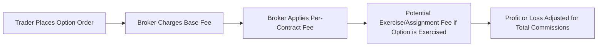

## 22.10 Commissions

Many of us remember the excitement (and maybe a bit of nervousness) that came with placing our very first options trade. It's empowering to speculate on big moves in the market or lock in a hedge for your stock portfolio. But then—ah, there's that moment—you see the commission statement, and your profits shrink. Sometimes, a seemingly good trade can turn into a breakeven or even a tiny loss, simply because of these fees. This section is all about helping you navigate the ins and outs of commissions when trading retail options in the Canadian marketplace. We'll talk about base fees, per-contract charges, exercise or assignment fees, plus a few best practices to keep you from getting blindsided by costs.

## Why Commissions Matter

Let’s start with a rhetorical question: If you made an incredible $200 profit on a straightforward call option trade, how would you feel if you had to pay $50 or $75 in commissions and other fees? Those costs can add up quickly, and they may dampen your enthusiasm, especially if you’re trading smaller contract sizes or doing frequent trades. Options trading is about precision—both in market outlook and cost control. Understanding commission structures is a key part of crafting an efficient strategy.

## Common Commission Components

Most brokerages use a combination of:

- A base fee.  
- A per-contract fee.  
- Other possible charges depending on what you do with your option (exercise, assignment, or early assignment fees).

Let’s break each down in plain language.

### Base Fee

The base fee is simply a fixed charge that applies to every option trade, regardless of the number of contracts. Think of it like a cover charge at a music venue: whether you stay for one song or the entire band lineup, you pay to enter. So, if your brokerage charges $10 as a base fee, that $10 gets tacked on to every single option trade you make—long calls, short puts, iron condors, you name it.

### Per-Contract Fee

On top of that base fee, you’ll often see a per-contract charge—maybe a dollar or two (sometimes less, sometimes more) for each contract. If you’re trading in large volumes, that per-contract fee can start to add up. If you’re trading just a few contracts, it might be negligible. But you always have to keep an eye on how many contracts you plan to trade. High-volume traders might negotiate, or they might choose a brokerage offering tiered pricing, so their per-contract fee drops once they pass a certain monthly threshold.  

### Exercise or Assignment Fees

This is one that can sneak up on people. We often focus on the cost of placing the trade, but what about the cost of carrying that trade to its conclusion? If you decide to exercise your in-the-money call option to buy the underlying shares, or if your short option is assigned and you need to deliver shares, you could be charged an additional fee for that event. Some brokers wave these fees or roll them into other charges, but many still charge a discrete exercise/assignment fee—maybe $15 or $20, sometimes even more.

So, if you’re deliberately using an options strategy that involves letting in-the-money options ride toward expiration in order to be exercised or assigned, make sure you know what it’s going to cost you. The same strategy with a lower-cost broker might actually be more profitable in the long run.

## Putting It All Together: An Example

Let’s do a quick example to illustrate how costs might come together. Suppose you see an opportunity on a hypothetical stock (call it “SampleCo”). You buy 5 call option contracts, each representing 100 shares. Your brokerage charges:

- $6.95 base fee  
- $1.25 per contract  
- $15 exercise fee  

If you buy 5 contracts in one trade, your commission is:

• Base fee = $6.95  
• Per-contract fee = $1.25 × 5 = $6.25  
• Total initial commission = $13.20  

Now, if your call finishes in the money and you decide to exercise, you’ll also pay the $15 exercise fee. So, in total, you’ve spent $28.20 in commissions and fees ($13.20 to buy, plus $15 to exercise). If your net profit was $100, that means your actual take-home is only $71.80. You can see how those costs might erode an otherwise successful trade.

## Visualizing the Commission Flow

Below is a simple Mermaid diagram showing how commissions factor into a typical option order and potential subsequent exercise or assignment. It’s a bit of an oversimplification, but it helps to see how each fee layer gets added to your final outcome.

Ultimately, you’ll only see your net profit or loss after the total commissions have been tallied up.

##Impact on Strategy and Risk Management

We often talk about risk management in terms of volatility, position sizing, or time decay. However, high commissions can be a hidden risk factor, especially for small accounts or for people who trade frequently. If you’re jumping in and out of short-term positions, you might pay more in commissions than you earn on your trades—this is a huge reason to incorporate commission calculations into your break-even analysis.

### Frequent Small Trades

For some traders who like to “scalp” or hold positions for mere hours or days, the high turnover can result in frequent transaction costs. If each in-and-out trade sets you back $15 or $20 in commissions, you need your portfolio to recover those costs regularly. Over 20 trades in a month, that’s anywhere from $300 to $400 in costs, which is not trivial.

### Hedging Strategies

Hedgers might place single-lot put options to protect existing stock positions. Even if the premium is affordable, you can’t forget the base fee plus the per-contract fee. This can also affect how deep in- or out-of-the-money you might choose to hedge. Some folks might prefer fewer, larger trades instead of multiple small ones to reduce repeated commission hits.

## Regulatory Requirements and Fee Disclosure

In Canada, brokers must clearly disclose their commission structures, along with any administrative fees, platform fees, or extra charges. That’s a regulatory requirement under CIRO (the Canadian Investment Regulatory Organization, formed from the historical IIROC and MFDA). Advisors have a duty to be transparent with clients, ensuring that each client fully understands the total costs of an options transaction before executing trades.

Recent enhancements include the Client Relationship Model (CRM) initiative, which emphasizes cost clarity. You can find more guidelines on fee disclosure at [CIRO’s website](https://www.ciro.ca/) and track any updated provincial rules too. Because the landscape continues to change, keep an eye out for newer digital brokerages that might offer lower fees or specialized pricing for options trades.

## Tiered Pricing and Negotiation

Some brokerages implement tiered pricing: the more you trade, the lower your per-contract fee becomes. It reminds me of my friend who realized—after about 100 trades—that she would have saved $500 that month if she’d used a tiered model that better matched her volume. Of course, tiered pricing may come with conditions, such as maintaining a certain account balance or trading a set number of shares in other products. Don’t feel shy about negotiating with your broker, especially if you generate higher trading volumes. After all, you’re the customer.

## Keeping Commissions in Check

If you’re worried about fees eating up profits, here are a few practical tips:

• Compare brokerages. Sites like MoneySense or other personal finance blogs often publish broker comparisons. Many highlight standardized commissions, hidden fees, and other charges.  
• Factor costs into your trade plan. If you’re anticipating a $100 potential gain on an option strategy, but you’ll pay $40 in commissions, is it worth it?  
• Utilize fewer but larger trades. Consolidate multiple small trades into single trades if it suits your strategy and risk tolerance.  
• Prepare for exercise or assignment. If your plan hinges on being assigned shares or exercising calls, budget for that extra cost upfront.  
• Watch for promotions. Some brokers run promotions offering free trades or discounted fees for new clients or for transferring in a certain portfolio size.

## Best Practices for Advisors

From the advisor’s standpoint, it’s absolutely crucial to highlight commission expenses during the KYC and recommendation process. Since we’re operating under CIRO’s oversight (which replaced IIROC and MFDA from January 2023 onward), the onus is on the advisor to ensure clarity:

- Provide written or digital materials detailing all potential fees.  
- Encourage clients to read the firm’s rates schedule.  
- Explain how fees and commissions can affect net returns, especially for short-term or high volume trading.  

This fosters trust and builds lasting client-advisor relationships. When a client sees that you’re open and honest about costs, they’re less likely to feel blindsided.

## Real-World Case Study

Imagine a scenario in which an investor, Salma, believes a major Canadian bank stock will rally after upcoming financial results. She decides to buy 10 call option contracts at a strike price near the money. Her brokerage charges a $9.99 base fee plus $1.50 per contract, for a total of $9.99 + $15 = $24.99 on entry. A week later, her forecast proves correct, and the calls are profitable. She chooses to close her position (another $24.99 in commissions). Salma’s net result:

• Gross gain on the trade = $250  
• Commissions in and out = $49.98  
• Net profit after commissions = $200.02  

Now, if she also had to pay $15 for exercising, or if it was assigned from the short side, the bottom line would shift again. That’s why being aware of the fee structure at each stage can make a world of difference.

## International Comparison

In the U.S., some online brokers have moved to zero or near-zero base fees for stock trades and exceptionally cheap per-contract fees for options. While the Canadian market also has discount brokerages with fairly competitive rates, it hasn’t quite reached the same fee-free environment. Anyway, it’s a good idea to watch for cross-border or multi-currency considerations—some Canadians opt to open a U.S.-based brokerage account, but then they have to navigate additional tax reporting complexities. Always weigh the pros and cons.

## Tools and Resources

• [CIRO](https://www.ciro.ca/) – The self-regulatory organization in Canada, providing guidelines on fee disclosure and best practices.  
• MoneySense broker comparison – A helpful place to check for the latest commission deals and compare brokerages side-by-side.  
• “Canadian Securities Exam Prep: Focus on Costs and Fees” – Offers deeper insights into cost structures in brokerage accounts, including real-world examples.  
• Various financial blogs and open-source tools for calculating break-even levels, factoring in commissions.

## Glossary (Quick Reference)

**Base Fee**  
A fixed charge on each options trade. Does not vary with number of contracts.

**Per-Contract Fee**  
An additional charge levied per option contract. Multiplies if you trade multiple contracts.

**Exercise/Assignment Fees**  
Charges for processing an exercise (your right) or an assignment (the obligation). If you hold short options, you can be assigned at any time the option is in the money.

## Conclusion

I know—commissions are not the most glamorous aspect of options trading. It’s more fun to talk about implied volatility or chart patterns. But ignoring commissions is like ignoring friction in a machine: eventually, it’ll cause slower performance or bigger costs. By being mindful of all the charges, you’ll enter each trade with clearer expectations and better potential for profitability.

With careful planning, you can structure your trades to keep these costs at a manageable level. Being up-front with clients, or if you’re the client yourself, making sure you ask about cost details, is essential. After all, no one wants that rude awakening of finding out half their profit got eaten by fees.

Keep an eye on your trade frequency, trade size, and broker’s commission schedule, and remember to factor any potential exercise or assignment fees into your final analysis. Ultimately, commissions are just another part of the puzzle in successful options trading. By understanding them and planning accordingly, you set yourself (and your clients) up for less stress and—hopefully—larger net returns.

---

## Sample Exam Questions: Commissions in Derivatives Trading



### Which of the following best describes how a typical broker charges commissions for options transactions?  
- [ ] Only a base fee on each trade.  
- [ ] No base fee but only a per-contract fee.  
- [x] A combination of a base fee and a per-contract fee.  
- [ ] Only fees if the option is exercised.  

> **Explanation:** Brokers commonly charge both a base fee and a per-contract fee for each options trade, rather than relying on a single charge.

### Which fee may be added specifically if you choose to exercise an in-the-money call option?  
- [ ] Additional per-contract fee.  
- [ ] Tiered margin fee.  
- [x] Exercise fee.  
- [ ] Retainer fee.  

> **Explanation:** Many brokers charge an additional exercise fee to process and settle exercised options.

### A trader buys 5 contracts of a call option in one trade at a broker charging $6.95 base plus $1.50 per contract. What is the total commission for this single opening transaction?  
- [ ] $6.95  
- [ ] $15.00  
- [x] $14.45  
- [ ] $9.95  

> **Explanation:** Total = Base Fee ($6.95) + (5 × $1.50) = $6.95 + $7.50 = $14.45.

### A frequent trader might seek a brokerage that uses which type of commission schedule to get lower per-contract rates when trading volume increases?  
- [x] Tiered pricing.  
- [ ] Flat pricing.  
- [ ] Hourly billing.  
- [ ] Performance-based commissions.  

> **Explanation:** Tiered pricing often offers discounts for higher trading volumes, making it attractive to frequent traders.

### How can high commissions impact small or short-term options trades?  
- [x] They can erode most or all of the potential profits.  
- [ ] They don’t affect profitability at all.  
- [ ] They always reduce risk.  
- [ ] They only matter for large contracts.  

> **Explanation:** High commissions can disproportionately affect small short-term trades, because fixed fees eat into limited potential gains.

### Under Canadian regulations, what must advisors and brokers do regarding commissions and other trading fees?  
- [x] Disclose all fees clearly before executing trades.  
- [ ] Keep them confidential until after the trade is closed.  
- [ ] Unbundle them so they appear smaller on statements.  
- [ ] Provide them only upon request from the client.  

> **Explanation:** CIRO regulations (previously IIROC/MFDA) require transparent disclosure of commissions and fees to clients up front.

### In a scenario where a call option is bought and later exercised, which of the following statements is true regarding commission costs?  
- [x] The trader can pay commission on both the initial purchase and the exercise.  
- [ ] Only a one-time commission applies.  
- [ ] No commission applies unless the option is out-of-the-money.  
- [ ] The exercise commission is often refunded by the broker.  

> **Explanation:** Usually, traders pay commissions for opening the position (base plus per-contract) and an additional exercise fee if they choose to exercise the option.

### What is the primary motivation for using fewer but larger trades rather than many small trades when the commission structure involves both a base fee and a per-contract fee?  
- [ ] To avoid price slippage.  
- [x] To minimize total commission charges.  
- [ ] To take advantage of after-hours trading.  
- [ ] To lower execution risk.  

> **Explanation:** By consolidating trades, you pay the base fee fewer times, resulting in lower overall commission costs.

### Why might an investor be shocked to see the final profit on their option trade after assignment?  
- [ ] The broker refunds all commissions.  
- [x] The separate exercise/assignment fee can significantly reduce net profits.  
- [ ] The broker changes the per-contract fee upon assignment.  
- [ ] Assignment typically increases the option’s time value.  

> **Explanation:** Exercise or assignment fees can come as a surprise, substantially reducing the net profit (or increasing a loss).

### True or False: Under certain tiered commission schedules, traders can reduce their per-contract fee by exceeding a monthly volume threshold.  
- [x] True  
- [ ] False  

> **Explanation:** Many brokerages offer tiered pricing, allowing lower per-contract fees once trades exceed a specified volume.


