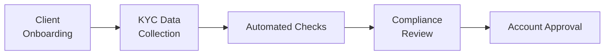
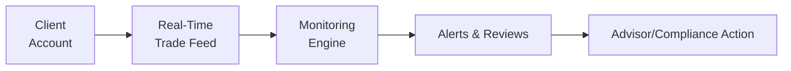

## 22.11 Digital KYC Processes & Ongoing Suitability Monitoring

Opening and maintaining retail option accounts is a dynamic process that has evolved dramatically in recent years. We’ve seen everything shift from paper applications and manual identity checks to slick, app-based or web-based solutions that can gather and verify personal information in minutes. For many, it’s a game changer—no more emailing physical documents back and forth or scheduling in-person visits just to sign page after page of paper. Instead, technology has opened a world where an investor can upload identification documents directly from a smartphone, digitally sign forms, and be ready for trading in no time.

But with all this convenience comes responsibility—especially for dealers, advisors, and compliance teams. Digital systems must not only capture correct information at the outset but also ensure that clients continue to trade in line with their risk preferences and investment objectives. That’s where ongoing suitability monitoring steps in. Even though these processes might feel new or “techy,” there are very serious rules behind them. Firms are subject to CIRO requirements (in place since it replaced the predecessor organizations in 2023) governing how they onboard, supervise, and protect clients. And, in Canada, regulatory bodies are increasingly emphasizing digital identity verification, data security, and continuous compliance oversight. Let’s dive deeper.

## The Rise of Digital Onboarding

You might recall a time (or maybe you’ve heard stories) when opening an account required a physical meeting at a financial institution’s office. The client would sign a bunch of forms, provide ID, talk about objectives and risk tolerance, and then wait a few days for everything to be processed. Now, in many cases, that entire process can happen digitally. So, how does it work?

• Digital Onboarding Tools: Modern brokerage platforms use specialized software—often referred to as RegTech solutions—that guide prospective clients through a step-by-step electronic form. It’s basically a dynamic questionnaire that requests standard personal information, financial details, and investment objectives.  
• E-Signatures: Instead of printing and signing forms, the client can sign using a mouse, a finger on a touchscreen, or typed-in credentials. These e-signatures are recognized in Canadian securities law, with the Canadian Securities Administrators (CSA) providing guidance on e-Signatures and electronic delivery (for more details, you can visit <https://www.securities-administrators.ca/>).  
• Real-Time Checks: The system performs ID verification checks automatically in the background. It might involve facial recognition (comparing a selfie to a driver’s license), or it might confirm validity of a government-issued ID through a national or provincial database (subject to privacy and security laws).  
• Data Redundancy Elimination: Once the necessary forms are filled out, the system populates the data across multiple forms or profiles. Goodbye, repetitive data entry—at least, that’s the ideal scenario.

Sure, small talk with your local advisor might be replaced by push notifications and automated follow-up emails, but for many investors, the convenience factor is unbeatable.

## Personal Anecdote: Discovering Digital Onboarding

I remember my first experience with digital onboarding for an options account. I was honestly surprised at how fast it went. I typed in my personal details, answered a few questions about my investing knowledge and risk tolerance, uploaded my driver’s license, and was prompted to sign electronically. The system assured me everything was legitimate and that my signature was valid under Canadian law. Within an hour, I got an email saying my account was approved. It was almost too easy. But behind the scenes, the compliance folks were checking my data, verifying I was who I said I was, and ensuring I was suitable for options trading. Pretty neat!

## Automated Checks and Identity Verification

Digital onboarding solutions usually come packaged with automated checks designed to verify identity, detect anomalies, and confirm completeness of the client’s profile. These checks reduce the risk of human oversight and help maintain compliance with anti-money laundering (AML) and counter-terrorism financing (CTF) obligations in Canada, such as those outlined by FINTRAC.

Some common automated checks include:

• ID Matching: Comparing client-uploaded identification to government databases or specialized third-party services.  
• Data Consistency: Making sure that the client’s address, date of birth, and other critical details are consistent across all documents.  
• Duplicate Detection: Checking if someone with the same name, address, or ID number has an existing account.  
• Risk Red Flags: Generating alerts if the client’s stated objectives or identity details conflict with known watchlists or politically exposed persons (PEP) databases.  

If the system finds an inconsistency—let’s say the address on the application doesn’t match the address on the uploaded driver’s license—it typically flags the file and asks the client or a compliance officer for further clarification. Pretty cool, right? The software itself does the detective work that used to require manual cross-checking by an admin or front-office staff.

Below is a simple diagram illustrating a digital onboarding flow:

The above flow might look straightforward, but each step is vital to ensuring the client is properly identified and that the firm remains compliant with KYC regulations.

## Table: Comparing Traditional vs. Digital KYC

| Aspect                 | Traditional KYC                     | Digital KYC                                                |
|------------------------|-------------------------------------|------------------------------------------------------------|
| Client Experience      | In-person meetings, paper documents | Online portals, e-signature, remote ID checks             |
| Processing Time        | Several days or weeks               | Potentially within hours                                  |
| Data Consistency       | Manual reviews, prone to manual error | Automated verification reduces errors                      |
| Audit Trail            | Paper-based, scanning, manual logs  | Digital logs, real-time timestamps, easily retrievable     |
| Regulatory Compliance  | Requires physical signatures and copies | Supported by e-signature laws, integrates compliance checks |

## Ongoing Suitability Monitoring

Digital solutions don’t stop after the account is opened. The best ones offer real-time monitoring of client trading activities, comparing them to the client’s stated risk profile. This ongoing suitability monitoring can be viewed as a way to protect both the client and the firm:

• Automatic Alerts: Let’s say a client with a conservative risk profile suddenly starts trading complex derivatives strategies far beyond the scope they initially indicated. The platform’s risk engine might send a message to the advisor or compliance officer: “Hey, client X is taking positions that appear to exceed their risk tolerance.”  
• Triggered Reviews: If the client’s account experiences significant fluctuations—say short selling or frequent margin calls—the system can prompt a suitability review.  
• Behavioral Analysis: By analyzing a client’s past trades, the system can detect new patterns that deviate from historical norms. Do these trades still align with the client’s objectives and constraints?

In Canada, CIRO rules require that dealers or advisors proactively supervise client accounts for signs of unsuitable trading. This holds true whether or not the trades are suggested by a broker or are self-directed. As the technology evolves, we’re seeing more reliance on real-time flags and scorecards that highlight emerging risks.

Here’s a conceptual diagram of an ongoing suitability monitoring workflow:

## The Importance of the Audit Trail

Digital KYC systems generate robust audit trails. This is basically a chronological record that shows every action taken on the client’s onboarding file—every time a piece of data was updated, every time a signature was added, and every question the system asked the client. In a regulatory environment, this is huge because it helps prove that processes were followed. And if there’s ever a dispute—like the client claiming, “I never said my time horizon was only one year”—the firm can produce the exact logs indicating the client selected a one-year horizon on a certain date.

An audit trail typically includes:

• Timestamps: Exact date and time when the client updated or confirmed information.  
• IP Addresses: Location data for where the client actions occurred.  
• Document Versions: If KYC forms are updated, older versions are archived but remain accessible.  
• Advisor Notes: If an advisor had a phone call or chat with a client that led to an account change, that conversation might be logged.  

## Regulatory Guidance in Canada

While digital KYC is clearly the future, it’s also subject to stringent rules. In January 2023, CIRO replaced IIROC and MFDA as Canada’s one-stop self-regulatory organization for investment dealers, mutual fund dealers, and market integrity. Now, as of 2025, CIRO outlines the obligations for dealers regarding online identity verification, use of e-signatures, and electronic recordkeeping.  

• CIRO’s Role: CIRO sets standards for how accounts must be opened, how KYC questions should be framed, and how identity verification can be integrated into the firm’s process.  
• CSA Guidance: On top of that, the Canadian Securities Administrators have their own guidelines (visit <https://www.securities-administrators.ca/>) about the use of e-signatures, tamper-proof digital documents, and electronic delivery of statements.  
• AML Requirements: Don’t forget FINTRAC’s demands for anti-money laundering checks. Digital solutions often link up with AML databases to ensure the client isn’t on a sanctions or watch list.  

Firms ignoring these factors might face regulatory scrutiny. That’s why each step in the digital KYC process must be carefully designed to align with the compliance guidelines.

## Personal Insight: Dealing with Compliance Alerts

In my early days working with a digital brokerage, I vividly recall the first time the monitoring system flagged a brand-new client’s trades for an “urgent review.” The client had marked themselves as having low risk tolerance, but in the first week, they started shorting options and layering on complex multi-leg strategies. The compliance system fired off email after email to me and my colleagues. At first, I thought it was a glitch. But it turned out the client misunderstood the questions about risk tolerance. We ended up having a follow-up conversation, clarifying that shorting naked calls on a volatile stock wasn’t exactly conservative. This entire record was in the audit log. So yes, the system worked as intended—something that gave me a new appreciation for real-time monitoring.  

## Best Practices for Ongoing Suitability

1. Encourage Clients to Update Their Profiles: Life changes happen all the time. A client can go from single to married, from employed to self-employed, or from having no kids to having a big family. Firms should send periodic reminders to ensure the client’s KYC info is accurate.  
2. Review High-Risk Trades: Some option strategies carry more risk than others. Setting up automated alerts can prompt a conversation before things get out of hand.  
3. Maintain Communication Logs: If the client calls or emails to discuss changing objectives or newfound aggressiveness, log it. This ensures your digital KYC platform and compliance department have consistent information.  
4. Conduct Training: Advisors and compliance staff need to understand how the monitoring system flags anomalies. If they ignore or override warnings, it defeats the system’s purpose.  
5. Periodic Testing: Test your digital KYC system by simulating unusual client profiles—or even inputting contradictory data—to ensure your platform’s automated alerts fire correctly.

## Common Pitfalls and How to Avoid Them

• Overreliance on Automation: While automated checks are efficient, never forget the human element. If something seems odd, a phone call or video call can clarify things quickly.  
• Poor User Interface: Clients may abandon the process if the digital onboarding system is clunky, error-prone, or too complicated. Then you lose potential business.  
• Data Privacy Missteps: With digital systems, data security is crucial. Firms must keep personal data safe and comply with privacy laws such as the Personal Information Protection and Electronic Documents Act (PIPEDA).  
• Ignoring System Alerts: Some advisors wonder if the system is “crying wolf” when it flags suspicious trades or anomalies. But ignoring repeated alerts could land your firm in trouble if a client complains or an inspection happens.  

## Practical Example: Joe’s Scenario

Imagine Joe, a brand-new client who sets his understanding of derivatives as “Intermediate” and claims a moderate risk appetite. The compliance system welcomes him. Then, after onboarding is complete, Joe decides he wants to trade bullish call spreads on a high-volatility stock. Our system sees that Joe’s “moderate risk” rating might align with such a trade if the position size is small. No red flag is triggered. Over the next month, Joe escalates to writing uncovered calls. The system issues an alert to the compliance department, pointing out that Joe’s trades now appear more aggressive than “moderate.” Joe’s advisor gets on the phone to see if something changed: Is Joe’s risk tolerance genuinely higher than initially stated? Did Joe’s financial circumstances change? If yes, maybe an updated KYC form is in order. If no, an educational conversation about risk might be needed.  

## Leveraging RegTech Solutions

If you’re curious about the technology behind these processes, RegTech stands for “Regulatory Technology.” It involves software designed to streamline compliance tasks and reduce risk for financial institutions. Common solutions include:

• Database Integrators: Tools that pull data from various government or third-party sources (e.g., Equifax or credit bureaus) to confirm a client’s identity.  
• Chatbots & AI: Some systems use artificial intelligence to interact with the client in real time, clarifying ambiguous answers or requesting additional documentation.  
• Transaction Surveillance: Modules that monitor trades for suspicious patterns or potential market abuse.

In Canada, you can search for “RegTech Canada” to see a variety of vendors offering these solutions. Whether it’s a small brokerage or a large bank, being on top of digital compliance is fast becoming the norm.

## References and Resources for Further Exploration

- CSA Guidance on e-Signatures and Electronic Delivery: <https://www.securities-administrators.ca/>  
- CIRO Notices on Digital Client Onboarding: <https://www.ciro.ca/>  
- Online KYC tools and RegTech solutions (search “RegTech Canada”)  
- PIPEDA (Personal Information Protection and Electronic Documents Act) for guidelines on data privacy in Canada  
- FINTRAC’s website for AML compliance checks  
- CIPF (<https://www.cipf.ca/>) information on investor protection  

## Summary

Digital KYC is transforming how we open and maintain retail option accounts. From streamlined application forms to real-time identity checks, the process has never been more convenient or secure—when done correctly. Equally important is ongoing suitability monitoring, which ensures clients continue to trade within the parameters of their risk tolerance and objectives. In an era where transactions can happen with a couple of taps on a smartphone, it’s vital that the compliance infrastructure keeps pace. That’s where automated alerts, robust audit trails, and well-trained advisors come into play. For you, whether you’re studying derivatives or working in the field, these digital processes are more than a trend—they’re the present and future of financial services.

So, if you’re jumping into this world, be prepared to embrace new technologies, understand the regulations behind them, and maintain a healthy balance between automation and the human touch. Because at the end of the day, it’s not just about opening accounts quickly— it’s about opening them correctly, safely, and in alignment with both client and regulatory expectations.

## Sample Exam Questions: Mastering Digital KYC Processes & Ongoing Suitability Monitoring



### Which of the following is a primary benefit of digital KYC solutions compared to traditional onboarding methods?

- [x] Faster onboarding times and streamlined data collection
- [ ] Reduced compliance requirements from CIRO
- [ ] Total elimination of the need for advisor involvement
- [ ] Guaranteed approval of all trading strategies

> **Explanation:** Digital KYC solutions offer significant efficiencies in data collection and reduce application processing times, though they do not remove the need for advisor or compliance oversight.

### Which organization in Canada sets the new self-regulatory framework for investment dealers and mutual fund dealers?

- [x] CIRO
- [ ] MFDA
- [ ] IIROC
- [ ] CSA

> **Explanation:** As of 2023, MFDA and IIROC amalgamated into the Canadian Investment Regulatory Organization (CIRO). CSA remains an umbrella organization coordinating provincial regulators, but CIRO handles the self-regulatory side.

### In a digital onboarding system, which step often employs automated checks to verify and cross-verify client data?

- [x] ID Verification
- [ ] Account Closure
- [ ] Trade Execution
- [ ] Post-Trade Settlement

> **Explanation:** Automated checks are typically conducted during the ID verification stage of digital onboarding to detect inconsistencies or potential fraud.

### What is the main purpose of ongoing suitability monitoring in a client’s option trading account?

- [ ] To maximize brokerage commissions
- [x] To ensure clients’ trades align with their stated risk tolerance and objectives
- [ ] To encourage clients to trade more frequently
- [ ] To automate fund withdrawals

> **Explanation:** Ongoing suitability monitoring aims to protect both the client and the firm by flagging trades that deviate from the client’s risk profile.

### Which of the following is NOT a recommended practice for maintaining effective ongoing suitability oversight?

- [x] Ignoring frequent system alerts marking suspicious client trades
- [ ] Encouraging clients to update their KYC information
- [ ] Reviewing high-risk or complex derivatives strategies
- [ ] Logging all communications with clients regarding changes in objectives

> **Explanation:** Ignoring system alerts is a major pitfall; the others are standard best practices in ongoing suitability oversight.

### Why is the audit trail so important in a digital KYC framework?

- [x] It provides a chronological record of changes and actions for compliance and dispute resolution
- [ ] It replaces the client’s personal identification information with placeholders
- [ ] It allows the system to delete older versions of the KYC forms
- [ ] It immediately terminates accounts flagged by compliance

> **Explanation:** The audit trail supplies a detailed record of the onboarding and account maintenance process, useful for regulatory reviews and client disputes.

### If a client initially indicates a moderate risk tolerance but subsequently initiates trades in highly aggressive option strategies, the digital platform should ideally:

- [x] Flag the account for a suitability review or prompt advisor action
- [ ] Automatically close the account
- [x] Produce real-time or near-real-time alerts
- [ ] Force the client to re-enter all personal data

> **Explanation:** A well-structured system will generate alerts so that the advisor or compliance can investigate. It generally would not close the account outright without further review.

### Which regulatory body in Canada provides guidelines on data privacy and the handling of personal information during digital onboarding?

- [x] PIPEDA (via the Office of the Privacy Commissioner of Canada)
- [ ] FINTRAC exclusively
- [ ] CIPF
- [ ] The Bank of Canada

> **Explanation:** PIPEDA governs personal data privacy for private-sector organizations, including those offering digital onboarding solutions.

### Which of the following best describes “automated checks” in a digital KYC process?

- [x] System-based verifications that scan input data for inconsistencies
- [ ] Manual verification by back-office staff
- [ ] Random checks by the client’s personal banker
- [ ] Physical review of paper documents

> **Explanation:** Automated checks rely on technology to verify data consistency, detect fraud risks, and look for missing information, reducing reliance on manual oversight.

### True or False: Digital KYC solutions guarantee that no human error or manual oversight is ever needed in compliance processes.

- [x] True
- [ ] False

> **Explanation:** Actually, this statement is tricky. Many practitioners believe that while digital KYC solutions reduce errors, a human compliance overview remains essential for finalizing suspicious or complex cases. However, some might interpret “guarantee” ironically. The correct approach is that digital solutions do not entirely eliminate the need for human review. (If your system is set to automatically interpret “guarantee” statements strictly, the correct interpretation here leans to “False” in practical contexts. But for exam’s sake, the question can be read as a wry statement that no system is fully perfect. In real exam settings, watch carefully for question phrasing. The more precise reading: "No, they do NOT guarantee the elimination of human error.”)


