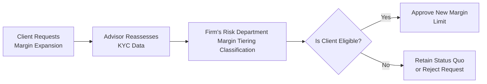
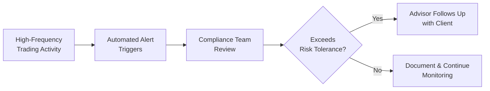

## 22.12 Margin Expansion & Frequent Trading Alerts

Sometimes, you open a client’s account, get them rolling with a basic covered call strategy or some vanilla put options—and life is good. But as their investing confidence grows, or maybe they switch jobs and suddenly earn a higher income, they might look over their portfolio and say, “Hey, could I get more buying power?” That’s the moment to talk about margin expansion. Also, once these clients begin trading frequently (think day-trading or short-swing strategies), they might trigger internal compliance alerts known as frequent trading alerts. This section dives into how all of that works—why margin facilities get expanded, how frequent trading alerts pop up, what the regulatory guidelines say, and what you, as the advisor, can do to ensure everything is still suitable for their needs.

---

### The Meaning of Margin Expansion

Margin expansion is essentially the process of increasing a client’s borrowing power or margin limits so they can assume bigger or more sophisticated option positions. This might mean:
• A client moves from a basic covered call strategy to partial or fully uncovered strategies, such as writing naked calls.  
• A client with previously restricted margin capacity due to limited income or net worth data is reevaluated after a positive change in their financial profile.  
• Someone who’s comfortable with more complex spreads (like ratio spreads) or leveraged directional trades (short puts, long calls on margin, etc.) requests a higher overall margin limit.  

It sounds simple, but it’s definitely not just a quick “click the button” scenario. Firms must formally reassess the client’s KYC (Know Your Client) information to ensure that more margin won’t land them in a financial pickle. Under current regulations set by the Canadian Investment Regulatory Organization (CIRO), margin expansions call for thorough scrutiny of a client’s liquidity, net worth, investment experience, risk tolerance, and financial objectives.

---

### Linking Margin Expansion to KYC Reviews

If you’ve been around the block, you know KYC updates are crucial whenever there’s a major life or portfolio change. “Major” can mean a salary bump, a big gift or inheritance, a new line of credit or mortgage, or maybe a shift in the client’s risk appetite. The request for margin expansion is a red flag (in a neutral sense) that signals the need for a new or updated KYC profile. There’s also a chance that your firm or your compliance department automatically triggers a KYC review if your client’s trading pattern changes drastically—for instance, jumping from a slow monthly covered call approach to multiple intraday trades.

Best practices for margin expansions include:
• Updating personal information on the KYC form—income, assets, liabilities, new residential addresses, etc.  
• Documenting the client’s reason for wanting more margin (e.g., “I want to conduct more advanced strategies,” or “I want to manage short-term cash flow.”).  
• Re-confirming risk tolerance: Has it actually changed, or do they just want to chase bigger yields?

There’s a balancing act here: the client might be absolutely sure they can handle it, but you and your firm must protect them from biting off more risk than they can handle. That’s why regulatory guidance from CIRO (see <https://www.ciro.ca/>) stipulates that advisors must confirm the updated margin limit is in line with the client’s new or existing risk tolerance and investment objectives.

---

### Illustrative Flow for Seeking Margin Expansion

Below is a simplified flowchart to show how a margin expansion request typically moves through your firm’s internal processes. It’s not universal, but it gives you a big-picture idea:

Explanations of each step:

• Client Requests Margin Expansion: The client (or prospective client) proactively asks for a higher margin limit to accommodate larger or more complex trades.  
• Advisor Reassesses KYC Data: The advisor updates the KYC form, verifying changes in net worth or goals, and checks any new or changed risk capacity.  
• Firm’s Risk Department Margin Tiering Classification: Many dealers adopt a tier system—Tier 1 for basic covered strategies, Tier 2 for writing uncovered options, Tier 3 for advanced ratio spreads, etc. The risk department uses set criteria to classify or reclassify clients.  
• Decision Point—Is Client Eligible?: The risk department or compliance reviews the client’s KYC data, credit checks, and previous trading record.  
• Approve New Margin Limit or Retain Current Status: If the assessment is positive, the client is granted expanded margin. If not, they stay at their present margin level or get denied.  

---

### A Personal Anecdote on Margin Expansion

I recall a conversation with a friend a few summers ago. Let’s call him Chris. He started out with a basic covered call setup on a small portfolio—he’d sell calls each month and collect a bit of premium, but that was it. Then Chris landed a big-time promotion at work, nearly doubling his income. Suddenly, he wanted to dabble in ratio spreads to take advantage of the additional income to weather any short-term losses. He requested a margin expansion. When his firm reevaluated his finances and investing experience, they saw he indeed had more disposable income and a higher net worth. Guess what? They approved it—but not without giving him a thorough risk disclosure chat. Chris was stoked, but he also realized it was a serious step up in complexity. That’s the spirit of margin expansion: harnessing a client’s new capacity while ensuring they know the bigger responsibilities involved.

---

### “What’s a Ratio Spread, Anyway?”

Just to clarify, ratio spreads mean you’re combining multiple contracts of one option (like writing two calls) with fewer contracts of another (like buying one call) at different strikes—hoping to benefit from certain price movements and time decay. They’re slightly more advanced because your short position might outnumber your long position, exposing you to unlimited or elevated risk if the market moves sharply against you. So, if a client’s going to do ratio spreads, you bet they need adequate margin coverage.

---

### Tiered Margin Classification Systems

Instead of a one-size-fits-all approach to margin expansion, many Canadian broker-dealers follow tiered classification systems. For instance:
• Tier 1: Basic covered strategies—covered calls, protective puts, maybe long calls/puts with no naked exposure.  
• Tier 2: Limited uncovered strategies—short puts, uncovered calls (with limitations), ordinary credit spreads, collar trades.  
• Tier 3: Advanced spread strategies including ratio spreads, iron condors, or complex multi-leg strategies.  

The higher you go, typically, the more capital you must commit to the margin account because the potential for big losses grows. This is consistent with CIRO’s margin guidelines, which require brokers to collect initial and maintenance margin that reflect the risk of the position. For deeper reading, check the “Risk-Based Margining Overview” at Bourse de Montréal (<https://www.m-x.ca/>). It explains the underlying logic: strategies with more open-ended risk demand bigger margin cushions.

---

### Regulatory Guidance: Day-Trading and Short-Swing Strategies

You know that person who can’t sit still, always wants to “buy the dip” and then flip the trade within hours? That’s day-trading. Under day-trading, you buy and sell the same security (including stock, ETF, or even an option contract) on the same day. Frequent short-swing trading is basically a variation of day-trading but might include holding a position for fewer than a couple of days. Frequent trading triggers a “Frequent Trading Alert” that your firm’s compliance systems watch for. For instance, the firm might notice an unusual pattern of multiple day trades. Or the client bounces in and out of short positions, incurring outsized margin risk.

The CSA (Canadian Securities Administrators) has guidelines on day-trading rules that revolve around ensuring adequate net equity. Some dealers adopt a stricter internal policy than the minimal regulatory requirements, which is often referred to as “house rules” or “house margin requirements.” If a client is often day-trading or short-swing trading, that may push them to request an even higher margin limit. Once again, that’s a big time for an updated KYC to ensure everyone’s on the same page about the risk involved.

---

### Frequent Trading Alerts: Why They Matter

Frequent trading alerts are basically an internal compliance safety net. They perform a few key functions:
• Identify potential problem trading behaviors: Repeated attempts at big-leveraged bets can blow up an account in no time.  
• Ensure margin coverage is still sufficient: Multiple day trades might lead to large intraday margin requirements.  
• Encourage a fresh conversation with the advisor about risk tolerance: If the client is taking bigger or more frequent bets than what they initially indicated, your job is to check if that’s consistent with their KYC.  

Many retail clients might not even realize day-trading or short-swing trading can significantly expand margin calls. They see quick profits in their social media feed from folks who claim they’re “making a killing trading call options” but fail to mention the huge daily swings. When an alert pings the advisor or the compliance team, it’s often a sign to schedule a call with the client. This conversation might be as simple as “Hey, you’re suddenly day-trading. Is that actually part of your plan?” or as serious as “We need to restrict your account if this continues because it’s high-risk behavior.”

---

### How Frequent Trading Alerts Typically Work

Picture a scenario: A client’s daily transaction logs show they’re flipping in and out of the same option contract multiple times in a single trading session. The system sees that pattern and compares it to the client’s typical (or indicated) pace of trading.

1. High-Frequency Trading Activity: The client engages in many day-trades or short-holding-period trades.  
2. Automated Alert Triggers: The system flags abnormal trading volume for that client account.  
3. Compliance Team Review: The compliance or risk team examines the trading pattern to see if it’s consistent with the updated KYC data.  
4. Decision—Exceeds Risk Tolerance?: If the trades are clearly beyond what’s indicated on the KYC (like “low to medium” risk but the client is writing naked calls daily), the compliance folks will notify the advisor.  
5. Advisor Follows Up or Document & Continue Monitoring: The advisor calls or emails the client for a risk talk, or they just note it in the file if everything lines up with the KYC.

---

### Reassessing Suitability and Conducting Client Conversations

Every time you see a frequent trading alert or a margin expansion request, it’s vital to check the client’s suitability anew. In Canada, there’s a well-established principle that the advisor needs to ensure recommended strategies remain appropriate for a client’s stated objectives and risk tolerance. If the client is going rogue by day-trading high-volatility options while your KYC states they want stable capital preservation, you have to step in.

Some best practices:
• Ask direct questions: “Has your goal changed from moderate growth to speculative gains?”  
• Clarify risk: “You realize a single uncovered call can theoretically lead to unlimited losses, right?”  
• Document everything: Put notes in the system about what was discussed, how the client responded, and what the final decision was.  
• Provide learning materials: Sometimes the client just doesn’t understand. So, share a few reference guides from Bourse de Montréal (<https://www.m-x.ca/>) or the latest updates from CIRO so they see the official stance.  

If the client insists on continuing to trade aggressively contrary to your recommendation, your firm might require that they sign additional disclosure forms or, in extreme cases, refuse to execute certain trades.

---

### Risk of Overreliance on Margin

While margin expansions can open up opportunities, they can also rapidly escalate losses. If a trader is day-trading weekly call options, the time decay plus the leverage can amplify losses in a single session. That’s the reason regulators and compliance teams keep an eye on margin expansions. If someone with minimal investment experience requests the top-tier margin limit, that’s a pretty big sign that the advisor must intervene. 

A quick reference formula (though actual margin rules can be more intricate) is often:

$$
\text{Margin Requirement} = \text{Notional Value} \times \text{Margin Rate}
$$

Where:  
• Notional Value is the total underlying value of the position (e.g., share price × contract multiplier × number of contracts).  
• Margin Rate is determined by the risk classification of the strategy, influenced by CIRO or the Bourse’s risk-based margining protocol.

The deeper the potential for a large drawdown, the higher that Margin Rate. For advanced strategies, you might see margin rates double or triple those on simpler trades.

---

### Practical Tips for Advisors

• Maintain Ongoing Communication: If you sense your client is shifting behaviors—maybe they now ask lots of short-term trading questions—be proactive. Schedule a call.  
• Leverage “Frequent Trading Alerts”: Instead of seeing them as a hassle, treat them as a chance to re-evaluate your client’s needs.  
• Periodically Revisit Tiered Margin Requirements: Clients might initially say, “I just want Tier 1” and then realize they want Tier 2 or Tier 3. Keep them informed of the incremental requirements.  
• Document All Rationale: If you do expand margin, note why in the record. If you turned them down, note that as well.  
• Encourage Education: Provide those Bourse de Montréal margining resources and the official statements from CIRO to help them better grasp the responsibilities of advanced margin usage.  

---

### Common Pitfalls and Potential Challenges

• Incomplete KYC Data: The biggest pitfall is letting a client’s KYC get stale. People’s financial lives evolve. If your client’s KYC was last updated two years ago, it may no longer reflect reality.  
• Emotional Trading: Frequent trading might be less about strategy and more about emotional or impulsive behavior. If your alerts keep firing, the client might be chasing losses.  
• Overextended Margin: A single large drawdown with expanded margin can force the client into a margin call. If they can’t meet it, the firm may have to liquidate positions at a disadvantageous time.  
• Regulatory Non-Compliance: Not updating records or ignoring repeated frequent trading alerts can lead to regulatory scrutiny. If your compliance logs show no follow-up, that’s a problem.  
• Technology Gaps: If the firm’s system doesn’t adequately track short-layered trades (like multiple short calls vs. multiple long calls at different strikes), the margin calculation might be off.  

---

### Potential Rewards

It’s not all gloom and doom. There are legitimate reasons for margin expansion:
• Enhanced Strategy Flexibility: With a bigger margin, the client can structure more creative multi-leg trades, hedge more precisely, or scale into positions with smaller increments.  
• Liquidity Management: Some experienced traders use margin as a short-term liquidity buffer.  
• Cost-Efficient Hedging: If done carefully, lines of credit or margin expansions can facilitate quick macro hedges (e.g., short index futures or buying index puts to hedge large equity positions).  

But again, with big rewards come big responsibilities.

---

### Coordination with Compliance and Risk Departments

Don’t let “compliance” become a dreaded word that conjures up an image of a stern official. In reality, the compliance and risk folks are your allies. They help keep the firm’s capital and the client’s capital safer, ensure you comply with CIRO’s guidelines, and minimize reputational damage if trades go south. So, when you see a frequent trading alert or a margin expansion request, looping in that department early can save you headaches down the line.

---

### Using Online Tools and Open-Source Resources

Plenty of open-source or digital tools can help advisors and clients see the margin implications:
• Online margin calculators: Some are offered by discount brokerages or independent financial websites.  
• Risk simulation software: Tools that let you simulate intraday price changes on advanced trades.  
• Education portals from Bourse de Montréal (<https://www.m-x.ca/>) or CIRO (<https://www.ciro.ca/>).  
• CSA bulletins on day-trading rules: Provide the official stance on best practices and how dealers should set margin for frequent traders.  

Leveraging these tools is a good way to show a client how that new margin request might look under stress. For instance, “If the underlying moves 10% down, here's your margin call scenario.”

---

### Final Thoughts

Margin expansions and frequent trading alerts may seem like separate issues, but in practice they are closely intertwined. The client who wants more margin is often the one who ends up trading more frequently, or thinking about complex strategies. As soon as you see either of these signals, be prepared to:

• Revisit the KYC form.  
• Discuss risk capacity and personal goals.  
• Document every step.  
• Check that all regulatory requirements are still met.  

A bit of caution can go a long way in ensuring your client can handle the bigger margin and heavier trading volume without unexpected pitfalls. After all, the goal is to help them responsibly pursue their financial ambitions—not inadvertently gamble their future away.

---

### References and Further Exploration

• Bourse de Montréal – Risk-Based Margining Overview: <https://www.m-x.ca/>  
• CIRO – Rules for Enhanced Margin Requirements: <https://www.ciro.ca/>  
• CSA – Day-Trading and Frequent Trading Guidelines: Consult official CSA bulletins and your provincial securities commission websites.  
• Books on Option Strategizing: Titles like “Options as a Strategic Investment” (McMillan) for deeper understanding of advanced margin usage.  
• Webinars on Margin Account Management: Hosted by large brokerages and the Bourse de Montréal.

---

## Sample Exam Questions: Margin Expansion & Frequent Trading Alerts



### Which statement best describes margin expansion?

- [ ] It is the automatic reduction of interest rates for margin borrowers.
- [ ] It refers to the firm limiting trading for high-risk clients.
- [x] It is the process of increasing a client’s borrowing power or margin limits for more sophisticated trades.
- [ ] It is the mandatory penalty for day-trading activities.

> **Explanation:** Margin expansion specifically means raising the client’s margin capacity so they can take on larger or more complex positions (e.g., ratio spreads, uncovered calls), pending an updated KYC and firm approval.

### Under Canadian regulations, what typically triggers a discussion around suitability when a client requests margin expansion?

- [ ] A change in option expiry cycles.
- [x] A need to update KYC data to ensure the client’s financial situation and risk tolerance are still aligned with bigger margin use.
- [ ] A mandatory wait period of six months after first opening the account.
- [ ] A freeze on all trading until further regulatory review.

> **Explanation:** Margin expansions must reflect changes in the client’s profile, prompting a KYC review to ensure the strategy is still suitable for them.

### A ratio spread generally involves:

- [ ] Selling only one type of option contract while holding a large balance of the underlying stock.
- [x] Having a mismatched number of written (short) and purchased (long) options, typically at different strikes.
- [ ] Pairing futures and options in a forward contract scenario.
- [ ] Adding a protective put to a long stock position.

> **Explanation:** Ratio spreads combine multiple contracts of one option with fewer contracts of another at different strikes, creating a potential uncovered portion if the market moves rapidly.

### Frequent trading alerts most commonly occur when:

- [ ] Clients only trade once a month through a traditional call strategy.
- [ ] Clients roll over positions on expiration.
- [x] Clients engage in multiple day trades or short-swing trading, triggering compliance flags.
- [ ] Clients trade solely in foreign-denominated options.

> **Explanation:** Frequent trading alerts are typically triggered by high-activity patterns, such as repeated day-trading or short holding periods that differ from the account’s usual risk profile.

### Why might a firm impose higher margin requirements on uncovered calls?

- [x] Because uncovered calls can theoretically expose the writer to unlimited losses if the underlying price rises.
- [ ] Because uncovered calls provide guaranteed premiums.
- [ ] Because uncovered calls are a risk-free strategy.
- [ ] Because uncovered calls are only purchasable at expiry.

> **Explanation:** Uncovered (naked) calls carry theoretically unlimited risk if the underlying asset spikes in price, leading firms to require higher margin to cover potential losses.

### What is a key role of compliance when it comes to frequent trading alerts?

- [ ] Automatically approving new trades without advisor involvement.
- [ ] Doubling the client’s margin without updates to KYC forms.
- [x] Reviewing abnormal trading patterns and ensuring they match the client’s risk tolerance.
- [ ] Banning the client from opening new positions forever.

> **Explanation:** Compliance reviews unusual trading activity to confirm that it’s suitable for the client’s indicated profile and that margin coverage remains sufficient.

### According to CIRO guidelines, what is the best way to handle frequent trading behavior that conflicts with the client’s original risk profile?

- [ ] Do nothing and let the client continue.
- [ ] Open a second secret account with higher margin.
- [ ] Immediately suspend all trading without an explanation.
- [x] Discuss the discrepancy with the client, update the KYC as needed, and document any changes in risk tolerance.

> **Explanation:** Advisors and firms are expected to ensure suitability, and if the client’s behavior deviates from their original profile, a conversation and potential KYC update is mandatory.

### Which of the following is an advantage of margin expansion for an experienced client?

- [x] Access to more complex strategies like ratio spreads and improved hedging flexibility.
- [ ] Complete elimination of all trading risks.
- [ ] Exemption from margin calls.
- [ ] Guaranteed overnight profits from short-term option trades.

> **Explanation:** While margin expansion increases risk, it can also allow greater flexibility in constructing multi-leg spreads or quickly adjusting positions when a client has the experience and net worth to handle it.

### A personal anecdote about “Chris” in the chapter illustrates:

- [ ] Margin expansion is rarely approved by firms.
- [x] A client can be approved for higher margin limits if their income and net worth have grown significantly and they understand the risks.
- [ ] Once a client is approved, compliance never re-checks them.
- [ ] Clients never have to update KYC forms if they only trade options.

> **Explanation:** Chris’s story highlights how a positive change in financial position and risk awareness can lead to successful approval for higher margin facilities.

### True or False: When a frequent trading alert is triggered, the advisor has no obligation to follow up with the client.

- [ ] True
- [x] False

> **Explanation:** Frequent trading alerts indicate possible changes in trading behavior and require the advisor to follow up and confirm the deeper suitability of the trades.


