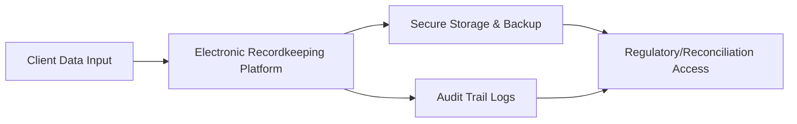

## 22.13 Electronic Recordkeeping Requirements

Electronic recordkeeping might sound mundane at first—files, digital paperwork, backups—but let me tell you, it can be a lifesaver when a regulatory audit lands on your firm’s doorstep. You know that feeling when you misplace your phone charger, and suddenly you’re scrambling right before bedtime to track it down? Well, imagine that same frantic scramble multiplied by a thousand if you don’t have your client account documents neatly stored and readily accessible in a robust electronic system. Trust me, you do not want to be rummaging through chaotic file folders during a compliance review.

This section dives into everything you need to know about maintaining thorough, accurate, and secure electronic records for retail option accounts under the watchful eyes of the Canadian Investment Regulatory Organization (CIRO) and Canadian Securities Administrators (CSA). We’ll chat about best practices, the technology behind these systems, real-world cautionary tales, and how a solid electronic recordkeeping approach secures you and your clients in the long run.

In harmony with the broader context of this chapter (Opening and Maintaining Retail Option Accounts), having top-notch recordkeeping practices is absolutely central to ensuring your firm is in line with the regulations we’ve been exploring. After all, it’s tough to comply with Option Account Application form requirements (as explained in earlier sections), or prove due diligence on disclosures, if you’re losing track of key communications. So let’s set the stage for how to build an electronic recordkeeping system that is bulletproof—or as close as we can get.

## Why Electronic Recordkeeping Matters

I remember early in my career, when a colleague of mine was once grilled by regulators about changes made on a customer’s trading permissions. The client had apparently run into large margin calls, and the story was that he had verbally changed certain parameters around his option trading. But guess what? The firm hadn’t digitally documented the client’s permission changes, so verifying the who-what-when was basically impossible. The regulatory folks were not amused, and the firm faced a hefty fine. It was a very expensive reminder that an electronic audit trail is crucial.

Regulatory compliance and client protection serve as two primary reasons for robust electronic recordkeeping:

• CIRO and CSA Requirements: Both organizations mandate that investment dealers and advisors maintain accurate, secure records of all client activity, including trade confirmations, statements, personal data updates, and more. As you’ll recall from prior sections, these rules ensure each client is properly informed of transactions and potential risks.  
• Litigation and Dispute Resolution: If a client challenges a trade or claims misinformation, robust electronic records will help you present definitive proof of what happened, who said what, and when.

## Key Regulatory Mandates & Industry Standards

Canadian rules around record preservation tend to revolve around clarity, client protection, and transparency. CIRO—a body that emerged after the amalgamation of the MFDA and IIROC—enforces these standards with an unwavering eye for completeness. They also coordinate with the CSA for a unified approach to securities regulation. Below are some must-know regulatory guidelines:

• Record Retention Periods: Firms are generally required to store records for a minimum period (often several years) after a client’s last trade or account closure. This can vary by province and by the type of record.  
• Location & Accessibility: Data must typically be stored in Canada, or else the firm must ensure full compliance with all relevant cross-border regulations and quick accessibility to data for Canadian audits.  
• Security & Confidentiality: Strong encryption, access controls, and audit logs are standard. Regulators demand procedures to protect sensitive information from unauthorized access or data breaches.  
• Quick Retrieval Mandate: Firms must be able to produce records “promptly” if regulators request them. “Promptly” typically means within a few days, or in some scenarios, even within hours.  

For more in-depth reading, see the CSA and CIRO Joint Guidance on Electronic Data Storage and Recordkeeping (<https://www.securities-administrators.ca/> and <https://www.ciro.ca/>). These documents offer official insights on acceptable practices and systems.

## Core Components of a Compliant Electronic Recordkeeping System

Let’s walk through the crucial elements you need to nail if your firm is to maintain ironclad compliance in the digital realm. Think of it as the actual “nuts and bolts” of the system.

### Secure Data Storage

Whether your firm uses internal servers or a trusted cloud service provider, data must be protected at every step. A layered approach is common:

• Encryption at Rest: Data is stored in an encrypted format, meaning that forgetting the encryption key is almost as bad as losing the data itself, so you’ve got to keep that key safe.  
• Encryption in Transit: When clients or advisors upload documents to the firm’s website or cloud, the data in transit (uploads, downloads) is also encrypted via secure protocols.  
• Multi-Factor Authentication (MFA): Advisors, compliance officers, and especially key IT staff should have multiple layers of identity verification.

### Backup and Disaster Recovery

Systems sometimes fail, or maybe your main data center is near a region prone to flooding—nature loves surprises, right? That’s why backups are essential. For instance, you might schedule daily incremental backups and weekly full backups. The backup data is often stored in a geographically separate site, which may be a different province (provided it meets data residency requirements). Regular disaster recovery tests ensure you can reinstate operations swiftly if a meltdown occurs.

### Audit Trails & Logging

An audit trail is basically your system’s “footprints in the sand” that record who changed what, when, and how. This often includes:

• Viewing or Downloading Documents: A log capturing every instance of users or clients accessing a particular record.  
• Database Updates: If someone modifies a client’s address, margin details, or trading permissions, the system notes the old value, the new value, the date, the user who made the change, and possibly a reason code.  
• Security-Related Events: If a login was attempted at odd hours or from an unrecognized device, the system should log it.  

Regulators love these audit trails because they demonstrate your firm’s operational discipline and serve as a precise timeline in case of disputes.

### Indexing and Search Functionality

Anyone who’s tried to rummage through poorly labeled PDF files knows that robust indexing and search are indispensable. You want to type in “Client’s Last Name + Date Range” and instantly see every relevant trade confirmation, any statements, and all relevant disclosures. Many advanced recordkeeping solutions allow for advanced search by metadata—such as account number, type of document, or date. This saves hours compared to manual sifting.

### Version Control and E-Signatures

For a world that moves quickly, you can’t rely on static or outdated documents. If a Terms & Conditions document changes, you should maintain both the old version and the new version, along with logs of which clients agreed to which version—and on what date. E-signatures, which are widely recognized in Canadian securities law, also require storing digital certificates and detailed logs of each signature’s authenticity check.

### Compliance Dashboards

Some modern recordkeeping solutions have compliance dashboards that send real-time alerts when anomalies occur. For instance, if a large batch of older records is suddenly purged, or there’s an unusual spike in the volume of data downloads, the system will flag it, prompting compliance staff to investigate. This is particularly useful for sniffing out potential internal fraud or data mishandling.

## Practical Example: Updating a Client’s Option Trading Privileges

Picture this scenario: a client wants to upgrade their trading privileges from covered call writing to advanced strategies like spreads. Under the new guidelines, your system requires the client to sign an updated Derivatives Trading Agreement. It also triggers an internal compliance review to ensure the client meets the updated knowledge and financial resources standard. Here’s a simplified pathway of events:

• Client logs in and requests a permission upgrade.  
• An internal compliance alert notifies the advisor that an updated client profile and risk tolerance check is required.  
• Once the advisor updates the profile, the system sends the client a digital signature request for the revised trading agreement.  
• The e-signature is validated and time-stamped.  
• A record of the updated privileges is stored in the client’s database entry, with the old privileges archived.  
• The client and advisor both receive a trade confirmation–style notice indicating the account’s new permissions.  
• The audit trail logs every step: times, digital signatures, changes, and acknowledgments.

If a regulator next month wants to see when that permission was changed, you can produce the logs in less than a minute. People may not do a literal “happy dance,” but I promise your compliance team will be breathing sighs of relief.

## Emerging Trends and Considerations

### Artificial Intelligence (AI) and Automation

AI-driven tools can automatically categorize and tag digital records based on recognized form fields. In an environment where thousands of client forms might be processed daily, advanced optical character recognition (OCR) plus AI can chunk them into appropriate categories. But keep in mind, regulators want to see the raw records, too, so you have to preserve the original files.

### Blockchain for Audit Trails?

Some innovators are exploring blockchain-based solutions for an immutable log of changes. It’s still early days for widespread adoption in mainstream finance compliance, but the idea is that every transaction or record update is time-stamped and sealed in a tamper-proof digital ledger. Maybe one day we’ll see this as more standard.

### Cybersecurity Regulations

FINTRAC, though primarily concerned with anti-money laundering (AML) compliance, also publishes best-practice guides on data security that can dovetail nicely with your recordkeeping approach. As the lines between AML and overall compliance blur, having one consolidated approach to data governance is beneficial.

## Common Pitfalls and How to Avoid Them

• Inadequate Testing of Backup Systems: “We back up daily!” is a comforting statement, yes—but if you never test your restore procedures, you might discover (too late) your backups weren’t actually restorable.  
• Non-Encrypted Emails: Some advisors still email sensitive PDF statements to clients without encryption. Not only is this a violation of many data security best practices, but in some cases, it may run afoul of privacy laws.  
• Delayed Record Updates: Pushing record updates to a secondary system once a month is risky. Real-time or near-real-time updates are crucial.  
• Manual Overload: If your staff is still manually scanning paper forms into a shared drive with random naming conventions, that’s a compliance nightmare waiting to happen.

## Real-World Case Study: The Missing Trade Confirmation

In 2022, a Canadian investment dealer faced scrutiny when a client alleged unauthorized trades in an options account. The firm insisted the confirmations had been sent, but the client insisted otherwise. It came out that the firm’s email logs had not been maintained systematically, and the confirmations were missing from the main recordkeeping database. After multiple weeks of confusion, the trades were eventually traced, but the firm was fined for non-compliance with recordkeeping obligations. The lesson? A single missing record can compromise the entire matter, leading to mistrust and big enforcement penalties.

## Visualizing the Recordkeeping Process

Below is a simplified mermaid diagram that maps out how data flows through a typical electronic recordkeeping system, from initial client data input to retrieval in case of a regulatory review.

• “Client Data Input” represents the stage where new or updated account information is entered.  
• “Electronic Recordkeeping Platform” is the central hub where data is processed, validated, and stored.  
• “Secure Storage & Backup” ensures data is regularly backed up, often in multiple data centers.  
• “Audit Trail Logs” record every significant change or access activity.  
• “Regulatory/Reconciliation Access” is the final stage for oversight—whether internal or external (CSA, CIRO, or an auditor).

## Action Steps for Advisors and Compliance Officers

• Review Your Systems Regularly: At least once a year, have your IT and compliance teams walk through the entire recordkeeping process, from data entry to retrieval, to ensure it meets or exceeds current standards.  
• Plan for System Outages: Draft a business continuity plan that details how you’ll retrieve and protect records if the main systems go down.  
• Collaborate with IT Early: Don’t wait until an audit is announced to make sure everything is working. Maintain cross-functional teams that address compliance, data security, and operational needs.  
• Train Staff Thoroughly: People, not the technology, often cause the biggest slip-ups. Make sure everyone from front-line advisors to back-office staff knows standard protocols for handling and storing records.

## Glossary

• Trade Confirmations: Documents that detail the specifics of a trade—price, quantity, commissions, and settlement dates. These confirm the transaction for both the client and the firm.  
• CSA (Canadian Securities Administrators): An umbrella organization of Canada’s provincial and territorial securities regulators that, among many responsibilities, collaborates with CIRO on recordkeeping standards.  
• Audit Trails: Electronic logs that track changes, updates, or movements of data, often used for compliance reviews and investigations.

## References and Additional Resources

• CSA and CIRO Joint Guidance on Electronic Data Storage and Recordkeeping: <https://www.securities-administrators.ca/> • <https://www.ciro.ca/>  
• “Data Security in Financial Services,” White Paper by IOSCO, which discusses broader global standards for recordkeeping and data governance.  
• FINTRAC Cybersecurity Best Practice Guides, which—though mostly AML-focused—offer great tips on data encryption and secure storage.  
• For external reading on technology solutions, check open-source frameworks like Apache Hadoop for big data storage or Elasticsearch for advanced search functionalities.

By keeping lines of communication open between your regulatory compliance team, your IT professionals, and your front-line advisors, you’ll be well-equipped to meet the evolving demands of our increasingly digital market. Proper electronic recordkeeping ensures that your firm is protected—and, crucially, that your clients are protected, too. In a world where trust can be fragile, detailed logs and accessible records can keep that trust intact, and serve as your best defense if things ever get complicated.

We’ve navigated the essential building blocks of a compliant electronic recordkeeping system to support the opening and maintenance of retail option accounts. If you invest in a holistic, future-proof approach, you’ll find it far easier to handle compliance queries, pass audits with flying colors, and most importantly, maintain client confidence in every stage of the relationship.

## Sample Exam Questions: Electronic Recordkeeping Requirements



### Which regulatory body in Canada, effective 2023, oversees recordkeeping requirements for investment dealers and mutual fund dealers?

- [ ] IIROC
- [ ] MFDA
- [x] CIRO
- [ ] FINTRAC

> **Explanation:** As of 2023, IIROC and MFDA no longer exist as separate self-regulatory organizations. They have been amalgamated into the Canadian Investment Regulatory Organization (CIRO), which now oversees recordkeeping requirements for both investment dealers and mutual fund dealers.

### Which term describes electronic logs tracking changes and updates to client records, such as new trading permissions?

- [ ] Data vault
- [x] Audit trail
- [ ] Cloud ledger
- [ ] Tier-1 log

> **Explanation:** Audit trails capture timestamps, users involved, and the specific changes made. They are essential for demonstrating regulatory compliance.

### What is one key benefit of storing multiple versions of documents (e.g., older agreements) alongside the most current version?

- [x] Quick historical reference to archived versions
- [ ] Reduced storage cost
- [ ] Elimination of backup needs
- [ ] Compliance with trade execution speed

> **Explanation:** Maintaining multiple document versions allows firms to reference each version’s terms and the client’s agreement to them at different points in time—crucial in resolving disputes or investigations.

### A robust electronic recordkeeping system must enable which of the following during a regulatory audit?

- [x] Prompt retrieval of comprehensive historical records
- [ ] Permanent deletion of all historical statements
- [ ] Open access to all employees regardless of role
- [ ] Automatic purge of large data sets monthly

> **Explanation:** Regulators may request older trade confirm documents, risk disclosures, and personal data updates. The firm must retrieve them quickly to remain compliant.

### True or False: A large part of proper recordkeeping involves ensuring secure data backups and regular testing of restore procedures.

- [x] True
- [ ] False

> **Explanation:** Firms must regularly back up client and trade data and verify that the backups are recoverable. Failing to test your restore procedures is a common (and risky) mistake.

### Which entity primarily sets guidance for anti-money laundering but also offers data security best practices that can benefit overall electronic recordkeeping?

- [ ] CIRO
- [ ] CSA
- [ ] IOSCO
- [x] FINTRAC

> **Explanation:** FINTRAC’s AML mandate includes guidelines on data protection, suspicious transaction monitoring, and KYC protocols—these overlap with or reinforce recordkeeping best practices.

### Suppose a client disputes a trade, alleging no formal confirmation was provided. Why is electronic recordkeeping crucial in this case?

- [ ] It allows the firm to replicate the trade in the future.
- [x] It provides a timestamped record of the trade confirmation, proving it was sent.
- [ ] It automatically refunds the client.
- [ ] It blocks all future trades for that client.

> **Explanation:** With robust records in place, the firm can demonstrate precisely when (and how) the trade confirmation was issued, helping to resolve the dispute accurately.

### Which of the following is NOT an example of a typical audit trail log entry?

- [x] A full cryptographic decryption of the entire client database.
- [ ] A record of who changed client risk tolerance settings.
- [ ] A time-stamped record of when a client updated personal information.
- [ ] A note of the user who attempted a failed login at 2 a.m.

> **Explanation:** Audit trails typically track specific changes or access attempts, not decrypt entire databases. Systems generally avoid storing or exposing full decryption logs in day-to-day operations.

### Blockchain-based solutions may enhance recordkeeping in the future by:

- [x] Providing an immutable ledger of transactions and updates.
- [ ] Eliminating the need for backups entirely.
- [ ] Automating regulatory sanction processes.
- [ ] Automating personal data entry for clients.

> **Explanation:** Blockchain’s immutability could significantly enhance the reliability of audit logs, though widespread adoption in mainstream compliance is still evolving.

### True or False: Regulators generally prefer it when you store sensitive client records in unencrypted formats, as it allows for quicker data access.

- [ ] True
- [x] False

> **Explanation:** Regulators worldwide—including in Canada—emphasize encryption to protect client data. Accessibility is ensured through controlled secure access, not unencrypted storage.


