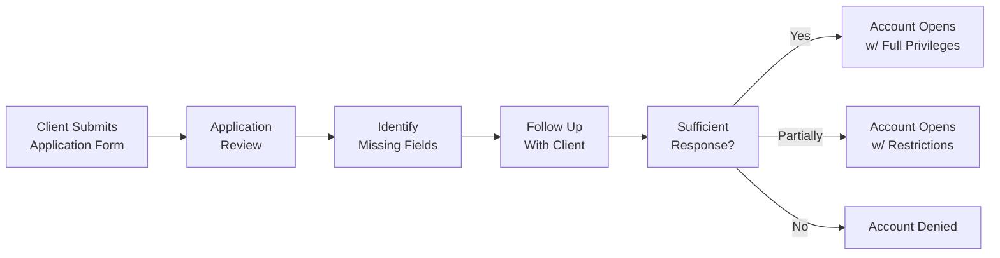

## 22.3 Unanswered Questions on the Option Account Application Form

Opening and maintaining a retail option account hinges on providing complete, accurate documentation. That seems obvious, right? You’d think so, but in practice, many individuals skip key questions on the application form. Sometimes they might do this because they're not comfortable disclosing personal financial details, or they forget certain pieces of information, or they simply run out of time and assume it's “no big deal.” Whatever the reason, these unanswered questions can lead to a range of compliance headaches for both you—the client—and the brokerage firm tasked with following strict Know-Your-Client (KYC) and consumer protection requirements.

In this section, we'll explore:

• What happens when mandatory fields on the application are left blank  
• Why these blanks can trigger compliance red flags  
• The consequences if a client refuses to share critical data  
• Practical tips for advisors and clients to address missing information proactively  
• Common best practices—and pitfalls—that can derail the onboarding process

We’ll take a slightly informal approach here. So picture me explaining this to you over a cup of coffee, walking through a labyrinth of forms, disclaimers, and regulatory guidelines—minus the dryness. Let’s jump right in.

---

## Why Complete Information Matters

Imagine you’re trying to figure out whether a friend can handle a physically demanding hike. You’d probably want to know their fitness level, any old injuries, how they react to altitude, the types of hikes they’ve done before, and so on. If they refuse to tell you or leave crucial details out—like, say, that they have a fear of heights—well, that might change how you plan the climb.

It’s the same situation when a client is opening a retail option account. The firm acts like a “guide,” if you will, ensuring that the client’s background, experience, and financial well-being are suitable for the complexities of options trading. If essential questions—like net worth, annual income, or investment experience—remain unanswered, the firm simply can’t judge suitability. Regulators in Canada (and globally) hold firms accountable for verifying that the products offered match the client’s risk tolerance and financial means. In other words, unanswered questions on the option account application can mean no green light for your journey into derivatives.

### The Firm’s Regulatory Obligations

Today, as of 2025, the Canadian Investment Regulatory Organization (CIRO) oversees investment dealers and enforces rules that ensure investor protection. Historically, the regulation was split between the Mutual Fund Dealers Association (MFDA) and the Investment Industry Regulatory Organization of Canada (IIROC), but these organizations amalgamated into CIRO. Regardless, the bottom line remains the same: your firm must maintain a complete KYC file. If there are unanswered questions that roil the waters of proper oversight, the firm could face compliance issues.

#### Compliance Red Flag (Glossary)

A “compliance red flag” is a warning sign that indicates that an account or client file may not adhere to regulatory guidelines. Missing or incomplete KYC documentation is definitely high on the list of such red flags, prompting additional scrutiny.

---

## Common Fields That Clients Leave Blank

Sometimes, you’ll fill out your name, address, and date of birth without hesitation, but then you come across more sensitive questions like annual income, net worth, or liquidity needs. Err… maybe I’ll just skip that one for now, you think. Let’s look at these in a bit more detail:

• Annual Income: The client’s income is crucial in determining how much capital they can safely commit to trading options. Without it, the firm can’t gauge whether certain option strategies would be suitable—or borderline reckless.  
• Net Worth: Net worth is an integral measure to determine whether a client has enough assets to buffer potential losses. It can be calculated using a simple formula:


\text{Net Worth} = \text{Total Assets} - \text{Total Liabilities}


If a client refuses to provide assets and liabilities, the firm is left guessing about the risk the client can realistically take on.  
• Investment Experience: Firms often ask how many years the client has been trading, the types of products they’ve traded, and whether they’ve used margin or options before. This helps the firm figure out if additional education or disclaimers are necessary before the client starts placing trades.  
• Risk Tolerance and Investment Objectives: Some new clients might see these as “just a formality,” but clarifying whether an investor wants to preserve capital, generate income, or pursue aggressive growth drastically impacts recommended option strategies.

Skipping these fields might prevent the firm from completing the necessary assessment, leading to an account restriction or possibly a denial if crucial details remain undisclosed.

---

## Potential Consequences of Unanswered Questions

### Delayed Approval

First off, there’s a very simple and immediate effect: your account approval gets delayed. The compliance department or an assigned supervisor might see incomplete fields, pick up the phone, or shoot out an email, and request clarifications. If the client is slow to respond, the entire application can stall. 

### Suitability Uncertainties

Let’s say the client wants to trade short options. This is typically considered a more advanced strategy, requiring a certain level of risk tolerance, net worth, and trading experience. With blanks on the form, the firm can’t confirm if short options are suitable. That leaves them in a bind: they either have to chase the client for the missing info or put the account in a “basic level only” mode until they confirm details.

### Regulatory Repercussions

We can’t stress enough how each firm remains under the watchful eye of regulators like CIRO or the Canadian Securities Administrators (CSA). If the firm has numerous accounts with unanswered questions, an audit can reveal non-compliance with KYC obligations. That might lead to fines or more severe sanctions. In extreme cases, repeated infractions threaten the firm’s license to operate. Not exactly the scenario you want to be in.

### Possible Account Restrictions or Denial

When a client absolutely refuses to provide enough data to confirm risk tolerance, net worth, or trading objectives, the firm may have no choice but to restrict the account to only the safest possible trades, or even deny the application. In retail options trading, that can mean no margin or advanced options privileges. In some cases, the client can only set up a “cash-covered” environment, limiting them to conservative transactions.

---

## The KYC File and Your Responsibility

Remember that the firm isn’t on a witch hunt for private details. They’re simply honoring their due diligence obligations, wanting to confirm that you’re a suitable candidate for the ups and downs of option trading. 

#### KYC File (Glossary)

A “KYC file” is an evergreen record-keeping requirement that includes the client’s identity details, financial background, and investment objectives. The firm uses it to determine suitability, track account changes, and monitor transaction patterns.

If new changes happen—like a big increase in net worth or a shift in your risk tolerance—the firm is expected to update your KYC record. However, if you never provided baseline info in the first place, it’s impossible for them to track changes or keep the file valid. 

---

## Real-World Anecdotes: When Incomplete Info Causes Havoc

### Case Study 1: The Guessing Game

I remember a former colleague who told me about a client that soared into the office wanting to make “big gains” through selling call options. The trouble? She refused to disclose her net worth, claiming that it was “nobody’s business.” The firm ended up limiting her to covered calls only, which she found too restrictive. She left frustrated that the firm wouldn’t let her trade advanced strategies, but ironically, the firm had no choice—without verifying her means to sustain losses, the compliance folks had to protect themselves and ultimately protect the client from going in over her head.

### Case Study 2: The Over-Eager Novice

Then there’s the story of a retiring electrician who, after attending a seminar on the “magic of options,” set up an account but left the income and net worth fields blank because he thought those questions were just optional extras. He tried to enter a multi-leg spread. The firm flagged the incomplete application. Together, they discovered that his financial situation was not as robust as the strategy demanded, preventing a potential meltdown if the trades went south. Once they clarified his real financial constraints, they adjusted the trading plan to a more modest put-protection strategy.

These examples underscore a simple truth: unanswered questions hamper the firm’s ability to line up suitable strategies for you. Over time, you might grudgingly appreciate that bit of protective friction.

---

## Documenting Follow-Up Attempts

If the firm spots unanswered questions, they can’t just ignore them. In fact, they have to record each attempt they make to contact the client to gather and confirm the missing information. This documentation:

• Demonstrates a good-faith effort to maintain compliance.  
• Shows regulators (like CIRO or the CSA) exactly which steps were taken.  
• Protects the firm against claims that they neglected their KYC responsibilities.

From a practical standpoint, these follow-ups might be phone calls, emails, or even snail mail. Each contact attempt should be documented with the date, the representative’s name, and a brief summary of the request or conversation outcome.

---

## Decision Time: Approve, Restrict, or Deny

Sometimes, even after repeated attempts, the client remains elusive or unwilling. The brokerage firm then has to decide if the partial data is enough for a thorough assessment. If you have enough data to gauge the client’s financial position, maybe you push forward and open the account with certain restrictions. If not, you might have to reject the application altogether.

### Possible Paths

Below is a simple diagram that shows the path a firm might take when information is incomplete:

As you see, there really are three potential outcomes: approval with full privileges, restricted approval, or denial. The weighting of those outcomes depends entirely on how well the client’s application lines up with the firm’s KYC requirements.

---

## Best Practices for Advisors

• Make It Conversational: If you’re an advisor or dealing rep, sometimes the easiest way to get sensitive financial information is through a friendly conversation.  
• Emphasize Confidentiality: Clients often skip questions because they worry about privacy. Reassure them that all shared data is strictly protected and used only to determine suitability.  
• Tie It to Real-World Consequences: Explain that incomplete information can limit the strategies they can access. No one wants to handcuff themselves due to incomplete data.  
• Document Thoroughly: Keep detailed notes of each attempt to gather missing data, references to phone calls, and any disclaimers you provided. If a client is firm in refusing certain data, note that in your file.

---

## Best Practices for Clients

• Be Transparent: If you’re the one opening the account, completing the entire application form thoroughly can streamline your approval.  
• Don’t Guess: If you’re not sure about a question—for instance, your net worth—ask for guidance or gather your financial statements before you fill in the form.  
• Ask Questions: If you’re uncomfortable disclosing certain pieces of data, don’t just leave it blank. Talk to your advisor or the compliance team and understand why they’re asking for it.  
• Keep Information Up to Date: If your financial situation changes dramatically, provide that update. This ensures your KYC file remains accurate and you continue to get strategies aligned with your new circumstances.

---

## Regulatory Backdrop and Resources

1. **CSA Compliance Reviews and Notices**  
   The Canadian Securities Administrators (CSA) regularly issue compliance notices that highlight common pitfalls in KYC and suitability processes. Checking out <https://www.securities-administrators.ca> can give you the latest updates on what regulators find crucial.

2. **CIRO Bulletins on KYC Completion**  
   CIRO publishes bulletins about best practices for KYC completion, common errors in forms, and ways to rectify them promptly. You can find these bulletins at <https://www.ciro.ca>.

3. **Industry Article: “Best Practices for Advisors in Collecting KYC Information”**  
   Published by Investment Executive, this article offers down-to-earth strategies for advisors who often struggle in gathering sensitive financial data from clients.

---

## Challenges, Pitfalls, and Strategies to Overcome Them

Nothing is ever as easy as yes/no. Here are some typical hurdles and how to tackle them:

• **Challenge**: Clients are apprehensive about privacy.  
  **Strategy**: Provide a clear explanation of data handling and reassure them about confidentiality policies.  

• **Challenge**: Clients assume they can skip details because they understand the markets well.  
  **Strategy**: Remind them that regulatory requirements hinge on balancing your knowledge with the firm’s documentation. A client’s self-assessment of expertise isn’t enough for compliance.  

• **Challenge**: Clients think leaving fields blank is faster.  
  **Strategy**: Show them how partial applications delay approval, ultimately causing more hassle.  

---

## Encouragement and Looking Ahead

Yes, the forms can feel intrusive. And yes, it may be a bit of a nuisance to rummage through old financial records. But at the end of the day, the entire KYC process is designed to ensure that your involvement with options trading is prudent, rational, and adapted to your circumstances.

**A final tip**: If you are missing certain financial pieces—maybe you’re in the middle of reorganizing your finances—be candid. Let the firm know. That fosters trust and prevents future tangles. The more the firm understands, the better they can serve you.

---

## Additional References for Deeper Exploration

• **CIRO** (formerly IIROC and MFDA) – Official guidelines on KYC processes: <https://www.ciro.ca>  
• **CSA** – Provincial securities regulators, compliance reviews: <https://www.securities-administrators.ca>  
• **Investment Executive** – “Best Practices for Advisors in Collecting KYC Information” (searchable article)  
• **Open-Source Financial Tools** – Tools like Tiller or Money Manager EX to help you systematically track assets and liabilities before applying for an option account.  

---

## Sample Exam Questions: Unanswered Questions on the Option Account Application Form



### A client leaves their annual income and net worth blank on the option account application. Which of the following statements best describes the immediate consequence?

- [ ] The account is automatically approved with full trading privileges.
- [x] The application approval may be delayed while the firm seeks clarification.
- [ ] The application is automatically forwarded to the CSA for review.
- [ ] The application can be approved only if the client deposits 50% margin.

> **Explanation:** When key data like annual income or net worth is missing, the brokerage firm usually must contact the client to gather the missing information. Lacking this, regulatory standards require a delay or even account restriction.

---

### Which best describes a “compliance red flag” in the context of incomplete account applications?

- [ ] It allows the client to escalate to a higher trading authority.
- [ ] It is an optional note made by advisors in the client’s file.
- [x] It signals potential non-adherence to regulatory guidelines, requiring further scrutiny.
- [ ] It immediately disqualifies the client from all trading activity.

> **Explanation:** A compliance red flag indicates that something in the client’s account file may not meet regulatory standards. Missing information in the KYC file often triggers these compliance flags.

---

### A client who refuses to disclose net worth wants to trade advanced option strategies. Under Canadian regulations and CIRO guidelines, what might the firm do?

- [x] Restrict or deny advanced trading privileges until sufficient information is received.
- [ ] Convert the client’s account into a margin-free environment permanently.
- [ ] Forward the data request to CIPF for client verification.
- [ ] Allow advanced strategies if the client signs a separate waiver form.

> **Explanation:** Without net worth data, the firm can’t confirm the client’s capacity to absorb potential losses from advanced option strategies. They often must restrict or deny such requests until the information is provided.

---

### In practice, how would a broker typically document follow-up attempts for missing KYC information?

- [ ] By sending only one courtesy email to the client and then discarding the application.
- [ ] By entering a single note “attempted contact” in the system, without details.
- [x] By maintaining records of each phone call, email, or message, including dates and outcomes.
- [ ] By logging the incomplete data in a separate file and ignoring it unless audited.

> **Explanation:** Demonstrating compliance often involves detailed logs of each follow-up attempt, complete with timestamps and summaries of the conversation or correspondence.

---

### If a client consistently refuses to answer multiple key KYC questions, which statement is most accurate?

- [ ] The firm must open the account within 24 hours by law.
- [x] The firm may decide to restrict or decline the account to remain compliant.
- [ ] The client can still trade all advanced strategies if they deposit a minimum of $1,000.
- [ ] The firm must escalate the missing information directly to the CSA within 48 hours.

> **Explanation:** The firm may have to restrict or close any new account application that doesn’t meet minimum KYC thresholds. Regulators require a complete suitability assessment for advanced trading privileges.

---

### Which of the following might be considered a best practice for an advisor who encounters a missing net worth field on an option account application?

- [ ] Let it pass; it’s not a priority field for a new account.
- [ ] Provide the client with an arbitrary estimate to speed approval.
- [x] Have a conversation with the client to explain the importance and reassure confidentiality.
- [ ] Restrict the account to liquidity-only transactions until net worth is verified.

> **Explanation:** Advisors should explain why specific data is required and highlight confidentiality measures. Open communication helps gather essential info while alleviating client concerns.

---

### How does documenting follow-up attempts benefit both the firm and the client?

- [x] It provides regulatory evidence of good-faith efforts and protects client interests.
- [ ] It only benefits the regulator and not the client.
- [x] It ensures transparency in case of disputes and shows the firm attempted to interpret the client's financial situation correctly.
- [ ] It penalizes the client for not disclosing details.

> **Explanation:** Detailed record-keeping helps the firm show regulators they performed due diligence. It also supports the client by ensuring the firm fully understood their situation—or attempted to—before finalizing decisions.

---

### If missing KYC information is discovered mid-application, which step is typically taken first?

- [ ] Deny the application outright.
- [ ] Report the client to the CIPF for possible fraudulent activity.
- [ ] Place the account in immediate liquidation.
- [x] Ask the client to provide the information and document the request.

> **Explanation:** Firms generally attempt to rectify missing KYC information through direct client contact. Immediate denial only follows if that attempt fails or if the client outright refuses.

---

### A client left the income field blank but tries to place a multi-leg debit spread. The firm:

- [ ] Can allow the trade as long as the margin requirement is met.
- [x] Must first confirm the client’s financial standing and risk tolerance before approving complex strategies.
- [ ] Must escalate the trade to a senior compliance manager for manual intervention.
- [ ] Should cancel the trade automatically without notice.

> **Explanation:** Complex strategies often require thorough knowledge of the client’s financial background to ensure suitability. The missing information must be gathered first.

---

### True or False: Incomplete KYC data can lead to delayed account approval, restricted trading privileges, or even denial of the account.

- [x] True 
- [ ] False

> **Explanation:** Leaving essential questions blank frequently forces the firm to request clarifications, potentially limiting or denying certain trading privileges.


