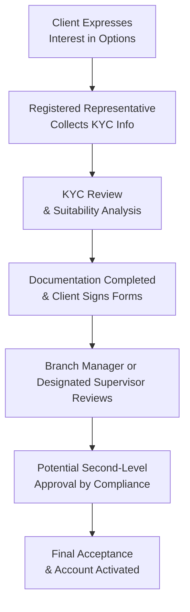

## 22.4 Responsibility for Final Acceptance of an Option Account

Opening a new option account can feel like a major milestone, sort of like finally deciding to open your own little bakery (even if, in reality, it’s just a new trading account). You’ve got visions of sweet profits and exotic option strategies swirling in your mind. But as with that bakery dream, there are rules, regulations, and official sign-offs to ensure you’re set up for success. In the context of Canadian derivatives markets, the final acceptance of a retail option account usually rests squarely with a designated individual who has the right supervisory registration (often called an Options Principal, Branch Manager, or a similar supervisory title). This section breaks down the nitty-gritty details of what that final acceptance looks like, why it matters, and how it plays out in real life.

---------------------------------------------------------------------------------------------------
## The Core Concept: Who Is in Charge of the Final Yes or No?

In many Canadian investment firms, there’s a designated supervisor who holds the ultimate responsibility for giving the final green light to new option accounts. This person could be:

• A Branch Manager with the required supervisory registration.  
• An Options Principal (sometimes called a Registered Options Principal in certain contexts).  
• Another high-level supervisor specifically approved by the firm and CIRO to supervise options activities.

Ultimately, it’s their sign-off that says, “Yes, this client may now trade the recommended type of options.” Their approval is not arbitrary. It’s thoroughly based on factors like the client’s financial literacy, trading experience, risk tolerance, and net worth, plus the completeness of all required documentation.

### Why Does This Matter?

Imagine a scenario where someone with zero trading knowledge or minimal financial resources wants to leap into advanced options strategies, such as short strangles or naked call writing. That can be very risky. The final acceptance process, overseen by a qualified supervisor, is there to ensure that the strategy level or approval level for the client is consistent with the client’s risk capacity and experience. This protects both the client and the firm: the client avoids (or at least becomes aware of) excessive risk they might not understand, and the firm steers clear of regulatory trouble or potential lawsuits if things go sour.

---------------------------------------------------------------------------------------------------
## Practical Example: A Real-Life-ish Story

Let me share a quick story. I remember once, years ago, working in a small branch where a brand-new client, let’s call her Martina, wanted to start trading options. She was super excited about writing covered calls—she’d read an article in a magazine about generating extra income on an existing stock portfolio. But she didn’t have a ton of market experience. So, my job was to gather her financial details, know-your-client (KYC) info, and general investment background. After I did all of that, I proposed a “Covered Call, Level 1 Option Approval” to the designated Branch Manager.

Everything checked out. Martina had enough knowledge to handle her chosen strategy (which is relatively low-risk, as far as option trades go), and the Branch Manager gave the final stamp of approval. Without that stamp, Martina wouldn’t have been able to proceed—even though she was raring to go. This final acceptance step helped ensure she wasn’t trying anything overly advanced for her experience level.

---------------------------------------------------------------------------------------------------
## Supervisor’s Obligations and Responsibilities

### 1. Confirming the Documentation Is Complete

Before an option account is approved, the supervisor must verify that the required documentation is fully in place. This usually includes:

• A completed new account application form (with details on the client’s employment status, net worth, investment knowledge, and objectives).  
• A signed client disclosure document stating the risks associated with options trading.  
• The client’s acknowledgement of having read and understood the risk disclosure statements, which are typically mandated by CIRO.  
• Completed KYC info (address, ID, prior investment experience, and so on).

One small detail that can cause unexpected hiccups is if there’s any missing or contradictory information on the application. For instance, if the net worth information is incomplete or if the client indicates high investment knowledge but also claims never to have traded a single security in their life, that discrepancy needs to be clarified. This might require additional follow-up with the client before the account can be approved.

### 2. Reviewing the Client Profile

Next, the person granting final acceptance has to ensure that the client’s profile lines up with the option trading level requested. This step is crucial. For example, if a client has:

• High net worth but zero trading experience—maybe a cautious approach is warranted.  
• Lots of trading experience but limited investable assets—again, it might not be suitable for them to engage in certain advanced strategies.

The final acceptance ensures the recommended or requested option trading permission doesn’t blow up in the client’s face or jeopardize the firm’s compliance obligations.

### 3. Assessing Risk Levels and Option Trading Levels

Many firms have multiple “option approval levels,” often labeled 1 through 4, or something equivalent. For instance:

• Level 1 might allow covered calls and protective puts.  
• Level 2 could include long calls and long puts.  
• Level 3 might open the door to spreads.  
• Level 4 usually permits naked strategies like uncovered calls or puts.

The compliance or supervisory team typically has internal guidelines describing which criteria a client must meet to qualify for each level. The final acceptance means the designated supervisor feels comfortable that the client can handle that risk level given their profile.

### 4. Keeping Up with Regulatory Requirements

The Canadian Investment Regulatory Organization (CIRO) is the self-regulatory organization that oversees firms and their employees. Part of CIRO’s rules is ensuring that supervisors who approve option accounts are themselves qualified. That means they need:

• Specific registrations and licensing, as recognized under National Instrument 31-103 (Registration Requirements, Exemptions and Ongoing Registrant Obligations).  
• Up-to-date training on options trading, risk management, compliance best practices, and so on.

Thus, the final acceptance is not just a “rubber stamp”; it is a regulated statement that a recognized and properly trained individual says, “This client can proceed.” Firms that fail to ensure proper qualifications for supervisors can face disciplinary action or fines.

### 5. Second-Level Approval by Compliance or Risk Management

In some firms, especially larger or more complex ones, the final acceptance might not be a single person’s domain. Certain higher-risk strategies or large margin-based accounts might need an additional sign-off from:

• The compliance department, or  
• A dedicated risk management committee.

Why? Because some strategies—for instance, selling naked calls on a high-priced stock—could create significant potential liabilities for the firm if the trade goes wildly off track. Risk management might request a redundancy check, ensuring that the client’s risk tolerance and finances can truly support these trades in worst-case scenarios.

---------------------------------------------------------------------------------------------------
## Where This All Fits in the Account Opening Process

Let’s visualize the process from the moment the client says, “I want to trade options,” all the way through to final acceptance.

In a smaller firm, the second-level compliance step (F) might not happen as a formal separate sign-off; in a larger firm, it’s often mandatory for advanced option strategies or large net-worth clients.

---------------------------------------------------------------------------------------------------
## Ensuring Supervisors Are Qualified

### Registration and Training

Supervisors with final approval authority for option accounts must hold specific licenses or designations. Historically, this was under the IIROC (Investment Industry Regulatory Organization of Canada) framework, but since its amalgamation with the MFDA, the new overarching self-regulator is CIRO. This means all references to supervisor qualifications funnel through CIRO’s rules now.

CIRO’s website (<https://www.ciro.ca/>) provides details on the registration process, examination requirements, continuing education, and supervisory responsibilities. Supervisors must typically pass exams that ensure they’re well versed in options trading (in both theory and compliance standards). They must then keep their knowledge current with ongoing training sessions, and remain up to date on relevant bulletins, rule changes, and best practices.

### National Instrument 31-103

Beyond CIRO’s own guidelines, National Instrument 31-103 addresses registration requirements for all investment dealers and advisers in Canada. It lays out the responsibilities for compliance, supervision, and the overall structure of a registrations-based system. If you really want to geek out, you can delve into the text of NI 31-103 to see how the Canadian Securities Administrators (CSA) set the bar for who can supervise what, especially when it comes to derivatives like options.

### Firm-Specific Policies

Finally, each investment firm has its own policies and procedures manual that outlines who can provide final acceptance for an option account and under what circumstances. These documents detail:

• The chain of command (so it’s crystal clear who’s authorized to sign off),  
• The steps each supervisor must undertake (KYC verification, conflict-of-interest check, new client identity verification, etc.),  
• Internal compliance forms that might go above and beyond the minimum regulatory requirements.

---------------------------------------------------------------------------------------------------
## The Roles of Compliance and Risk Management

### Compliance as the Gatekeeper

Compliance officers often review accounts flagged as high risk, ensuring that everything is squeaky clean. They sometimes rely on trade surveillance systems that monitor for unusual client requests or suspicious patterns, such as a brand-new account wanting to short massive amounts of index calls. If any red flags pop up, compliance can request a second-level review or require additional documentation before an account is granted a certain option approval level.

### Risk Management as the Safety Net

Think of risk management as the team that’s always asking, “But what if the market does X?” They look at potential stress scenarios—like big price swings in the underlying securities or changes in volatility. For high-net-worth clients, they might look at margin usage or potential margin calls. This department’s stamp of approval can be essential when a client aims to trade more complex or leveraged strategies.

In some organizations, risk management operates side-by-side with compliance (as shown above), feeding their findings into the final acceptance process (D).  

---------------------------------------------------------------------------------------------------
## Common Pitfalls and Challenges

It might be tempting for a new representative or a client to say, “Everything is good. Let’s skip the formalities.” But every so often, skipping steps leads to big trouble. Here are a few pitfalls:

1. **Incomplete or Inaccurate KYC**: If the client’s net worth is estimated incorrectly or the risk tolerance is not properly documented, the client may end up trading beyond their means.  
2. **Inadequate Product Knowledge**: Sometimes, a client might not fully understand the risk of certain strategies, like a naked call or short straddle, which can lead to unlimited losses.  
3. **Supervisor’s Lack of Up-to-Date Training**: If the supervisor isn’t fully informed on the latest regulatory updates, they might miss changes to margin requirements or new compliance bulletins.  
4. **Failure to Escalate**: If a red flag is discovered (e.g., a client with no experience wants approval for advanced options), but the final acceptance is granted anyway, that’s a major compliance breach.

---------------------------------------------------------------------------------------------------
## Best Practices for Smooth Final Acceptance

• **Double-Check Everything**: The new account form, the KYC data, the risk disclosure, and any other relevant forms.  
• **Use Automation Tools**: Some firms use specialized software that flags any discrepancies in the KYC versus the requested option trading level.  
• **Involve Risk Management Early**: If the client’s planned strategies are high risk, bring the risk team into the process ASAP.  
• **Keep Records**: Document every step of the acceptance process. Regulators love to see a clear paper (or digital) trail.  
• **Ongoing Education**: Supervisors must keep learning—attend industry webinars, read new CIRO guidelines, and periodically refresh knowledge of National Instrument 31-103.

---------------------------------------------------------------------------------------------------
## Glossary

• **Branch Manager**: The person responsible for supervising client accounts and ensuring adherence to regulatory requirements at the branch level. Typically holds the necessary supervisory registration with CIRO and approves new accounts, particularly option accounts that require specialized knowledge.

• **Risk Management**: A department or function within an organization that focuses on identifying, analyzing, and mitigating potential risks arising from trading activities. They often play a role in the final acceptance of higher-risk option accounts.

---------------------------------------------------------------------------------------------------
## Further Resources and References

• **CIRO Registration Requirements for Supervisors**: Visit <https://www.ciro.ca/> for the latest info on registration categories, supervisory roles, and continuing education.  
• **National Instrument 31-103** – **Registration Requirements, Exemptions and Ongoing Registrant Obligations**. You can find the text on the official CSA website or provincial securities commission sites.  
• **“Supervisory Standards in Canadian Securities Firms”** – An online guide by the CSA that addresses best practices in supervision and compliance.  
• **Open-Source Financial Tools**: For those interested in automating part of the due diligence or analytics process, there are open-source project libraries (e.g., in Python or R) that can model option risk scenarios quickly. While these tools aren’t regulated or official, they can provide additional insight for a supervisor verifying a high-level option account.

---------------------------------------------------------------------------------------------------
## Conclusion

That final stamp of approval—final acceptance of an option account—might sound like a narrow, bureaucratic step. But it’s really a critical protective measure. It ensures clients are trading at a level that fits their knowledge, resources, and risk tolerance, and that the firm is maintaining compliance with CIRO regulations. Without it, we risk letting clients wander into extremely risky territory with no guardrails.

So, if you find yourself in the role of a Branch Manager or a prospective options trader, remember that this final sign-off is less about red tape and more about making sure everyone is on the same page. After all, good compliance fosters client confidence and helps keep the entire Canadian derivatives market a safer and more trustworthy place for both novices and experts.

And if you’re like Martina from my earlier anecdote, rest assured that this final acceptance is a friendly formality designed to make sure you know how—and why—you’re doing what you’re doing.

---------------------------------------------------------------------------------------------------

## Sample Exam Questions: Responsibility for Final Acceptance of an Option Account



### Question 1
Which individual typically holds final responsibility for approving a new retail option account?

- [ ] The client themselves.  
- [ ] A junior associate already licensed for equities only.  
- [x] A qualified Branch Manager or Options Principal.  
- [ ] A third-party clearing corporation.  

> **Explanation:** In most Canadian investment firms, a senior individual such as a Branch Manager or Options Principal with the necessary CIRO supervisory registration provides final acceptance for new option accounts.

### Question 2
Which of the following is NOT typically part of the final acceptance process for an option account?

- [ ] Confirming all documentation is complete and accurate.  
- [ ] Ensuring the client’s risk tolerance aligns with the requested option trading level.  
- [x] Approving discretionary authority for all trades without question.  
- [ ] Verifying the client’s financial status and investment experience.  

> **Explanation:** Firms do not automatically grant discretionary authority to the supervisor; that would be a separate authorization. The rest of the items are standard parts of the final acceptance process.

### Question 3
What is one reason why second-level approval by compliance or risk management may be required?

- [x] The client aims to trade higher-risk option strategies such as naked calls.  
- [ ] The client wants only to buy stocks without margin.  
- [ ] The account is supervised by a senior manager with 20 years of experience.  
- [ ] The client has specifically requested no compliance oversight.  

> **Explanation:** Naked calls have open-ended risk. Firms often require a second level of approval to confirm the client and the firm can carry that risk.

### Question 4
“Branch Manager” typically refers to which role?

- [ ] A departmental lead for the firm’s marketing division.  
- [ ] A front-desk cashier at a bank.  
- [x] The supervisor responsible for ensuring adherence to regulatory requirements at the branch level.  
- [ ] An unlicensed person in charge of day-to-day paperwork.  

> **Explanation:** By definition, the Branch Manager is in charge of supervising client accounts, especially regarding regulatory compliance.

### Question 5
Which of the following is a consequence if the supervisor who approves option accounts does NOT hold the necessary CIRO qualifications?

- [ ] No consequences—Canadian regulations do not require formal qualifications.  
- [ ] The client can still trade options without any issues.  
- [ ] The account gains special exemption from all fees.  
- [x] The firm can face disciplinary action or fines from CIRO.  

> **Explanation:** Proper qualifications for supervisors are mandatory under CIRO rules. Lacking such qualifications can lead to regulatory action.

### Question 6
In a typical firm, which of the following might be an immediate red flag necessitating additional approval or scrutiny?

- [ ] A client with 20 years’ experience in stocks requesting Level 1 covered call authority.  
- [x] A brand-new client with no investment experience requesting Level 4 uncovered option selling.  
- [ ] A seasoned client upgrading from Level 1 to Level 2 with moderate risk tolerance.  
- [ ] A small net-worth client trading at the same level for five years with no issues.  

> **Explanation:** The biggest red flags are large leaps in risk, especially for new or inexperienced clients wanting advanced approval levels like uncovered option selling.

### Question 7
What is a key document or rule set that designates registration requirements for supervisors in Canada?

- [ ] The U.S. Securities Act of 1933.  
- [x] National Instrument 31-103.  
- [ ] The Option Clearing Corporation (OCC) manual.  
- [ ] The Chicago Board Options Exchange (CBOE) rulebook.  

> **Explanation:** In Canada, NI 31-103 lays out the registration requirements for dealers, including supervisors of derivatives.

### Question 8
Which department is primarily focused on “What if the market moves dramatically?” scenarios when approving option accounts?

- [ ] IT Department.  
- [ ] Human Resources.  
- [ ] Marketing Division.  
- [x] Risk Management.  

> **Explanation:** Risk Management addresses stress scenarios and general downside risk from market movements, ensuring that both the client and the firm can handle potential losses.

### Question 9
Which of the following statements best captures the primary objective of final acceptance?

- [x] To ensure that client, strategy, and risk tolerance are all aligned before option trading begins.  
- [ ] To allow any client to trade as many options as they desire.  
- [ ] To automatically deny clients who have zero market experience.  
- [ ] To bypass due diligence when the client asserts they have great investing instincts.  

> **Explanation:** The goal of final acceptance is to ensure the client’s risk profile, financial situation, and experience align with the requested option trading strategy, thereby protecting both the client and the firm.

### Question 10
True or False: It is permissible to skip second-level compliance approval if the Branch Manager has personally known the client for 10 years.

- [ ] True  
- [x] False  

> **Explanation:** Personal connections do not negate the firm’s policies or regulatory requirements around second-level approval for certain higher-risk strategies. Compliance and risk management steps cannot be skipped based on personal familiarity.


