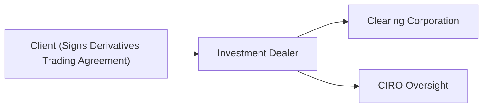

## 22.5 Completion of the Derivatives Trading Agreement Prior to Option Transactions

Have you ever gone skydiving for the first time? You know, that moment when the instructor hands you a waiver explaining the whole “high-risk” scenario, urging you to sign before you jump out of a plane? Well, a Derivatives Trading Agreement can be a bit like that: it’s a formal piece of paper that makes sure everyone involved knows the risks, the procedures, and what happens if something unexpected comes up. Without it, you’d basically be freefalling without a parachute in the world of options trading.

Below, we’ll break down the key elements of the Derivatives Trading Agreement that most Canadian investment dealers (now regulated by the Canadian Investment Regulatory Organization, or CIRO) require. We’ll walk through what it looks like, why it’s needed, how it fits into margin requirements, and even how it connects with the bigger picture of Canadian financial regulations. I’ll also share a personal anecdote—where a good friend nearly got into hot water by not reading the fine print—just to drive home how important the agreement can be.

Use this section in conjunction with other parts of Chapter 22, which covers opening and maintaining retail option accounts, so that you see the big picture on the entire account approval process. This entire chapter is framed under the current rules in Canada’s regulatory environment, where CIRO has replaced the old dual bodies (MFDA and IIROC) effective June 2023.

---

## Understanding the Purpose of the Derivatives Trading Agreement

The Derivatives Trading Agreement is essentially the gateway to options trading, clarifying responsibilities and obligations on both sides—the client and the dealer firm. Think of it as the ultimate rulebook for how you’ll handle listed options. While some dealers might include derivative-related terms in a broader account agreement, many prefer a separate, dedicated Derivatives Trading Agreement that the client signs prior to placing their first options trade.

The agreement covers topics such as:

• Roles and responsibilities: Who’s responsible for verifying you meet margin calls, how trade confirmations are communicated, etc.  
• Potential risks: You know, the big disclaimers: “Options can be risky,” “You could lose money,” “Margin calls can happen quickly.”  
• Exercising or assigning options: The procedures and deadlines involved, so you know what to expect if you’re the buyer (exercising) or the writer (getting assigned).  
• Liquidation rights and margin calls: The firm clarifies under which circumstances it can step in and liquidate positions to reduce overall risk in your account.

### Why It’s Required Before Trading

Under the Canadian regulatory framework, dealers must ensure that clients understand what they’re getting into. CIRO rules go hand in hand with provincial securities regulations. When a client signs the derivative agreement, the firm has a clear record that the client acknowledges these responsibilities and risks. Without such an agreement, confusion around margin calls, trade settlement, or option assignment would likely end up in disputes—or worse.

It’s not just about risk to the client; dealers face significant risk if they allow clients to trade derivatives without duly disclosing how the process works. For instance, if you sold some put options and the market moves significantly against you, the dealer is on the hook too for ensuring you meet margin requirements promptly. A well-crafted Derivatives Trading Agreement documents that you, the client, are aware of these obligations and the authority the firm retains in certain scenarios.

---

## Key Provisions

Let’s talk about the major clauses you’ll typically see in a Derivatives Trading Agreement. These can vary between dealers, but the essentials are usually consistent.

### Risk Disclosure

You’ll see a thorough disclaimer about the riskiness of options—i.e., that options can expire worthless, that margin calls may require immediate additional funds, and that losses could surpass your initial deposit under certain circumstances (for example, highly leveraged short option positions). The firm wants you to confirm you read it and understand it. Sometimes, I’ve seen folks skim this section and, later, express shock if they see large losses. It’s a big red flag to skip the risk disclosure—don’t do it.

### Margin Requirement Clauses

Margin arrangements are usually spelled out clearly, indicating how the firm calculates margin, the timeline to meet calls, and the firm’s right to change margin rates without advance notice. The agreement also explains that you’re required to maintain margin at all times. If the margin deficiency arises, the firm has the right to demand payment or liquidate your positions.

### Liquidation Rights

If you fail to meet a margin call, the firm typically retains the right to liquidate—without prior consultation—enough of your holdings to bring your account back into compliance. This is one of the biggest eye-openers for new options traders. You might think, “Wait, you can just close my trades?” The short answer is: yes, they can and will if needed to protect the firm (and you, in a sense) from catastrophic losses. It’s not personal—just business.

### Fees, Commissions, and Transaction Charges

The derivatives agreement often references charges associated with options trading, including exercise fees, assignment fees, and, of course, broker commissions. While these details may also appear in the main account agreement, the firm usually reiterates them here, so there’s zero confusion about how you’ll be charged for every single trade.

### Acknowledgment of Procedures for Exercise and Assignment

For a buyer, “exercising” is the official step where you opt to utilize your contract rights—like buying the underlying shares if you hold a call. For the seller, “assignment” happens when the buyer on the other side exercises. The Derivatives Trading Agreement often clarifies cut-off times, requires you to read any exchange-specific deadlines, and highlights that assignment notifications could arrive without warning. That’s right; you can be assigned any time if you hold a short option position, particularly American-style contracts.

---

## Affirmation of Risk Understanding

A key component of the signed agreement is your statement attesting that you understand the complexities and that the potential losses could be significant. In many modern online platforms, there’s a digital signature flow with typical statements like:

“By clicking here, I confirm that I have read and acknowledge the risk disclosure documents related to derivatives and margin trading, and I confirm that I understand the potential risks and obligations.”

Once you sign or click “I agree,” you’ve acknowledged in writing that if it all goes sideways, you accept full responsibility, to the extent allowed by regulatory guidelines. Although the language might seem dense, it’s crucial to realize that your signature is not just a formality—it can be legally binding proof that you were indeed forewarned.

---

## A Quick Anecdote: Don’t Skip the Fine Print

A friend of mine, David, was super excited to start trading call options on his favorite Canadian energy stock. He opened an account, got approval for options, and breezed past the Derivatives Trading Agreement by scrolling down to the bottom and clicking “I accept.” A month into trading, he bought short-dated call options ahead of an earnings announcement. The stock dipped right after earnings, making his calls nearly worthless—and that was only the beginning. He decided to roll over (meaning, close out near-expiring options and open new ones for a later date), racking up more contracts than initially planned. When the margin requirement soared, David realized he had basically pinned his entire margin cushion to a volatile bet.

He then discovered the agreement said the firm “reserves the right to close positions if margin calls remain unmet.” And guess what? They did. He rushed to deposit more funds, but by the time they arrived, the firm had partially liquidated his newer positions, fulfilling the margin deficiency. The moral of the story? If you’re signing the agreement, read it carefully—your entire trading plan could be upended if you incorrectly assume how margin or liquidation rights work.

---

## Real-World Example: A Liquidation Scenario

Let’s illustrate a typical liquidation scenario using a simple numeric example. Suppose Sarah has an options account with a $20,000 net equity. She writes a few put options on ABC Inc. The broker calculates that the total margin requirement is $18,000. So far, so good. Later, the price of ABC Inc. plummets, and the required margin—due to the increased risk of assignment—rises to $25,000. Now Sarah’s $20,000 is short by $5,000.

The firm might give Sarah a margin call, specifying that she has until the next trading day’s close of business to deposit more margin or close out some positions. If she does nothing or fails to provide the funds in time, the firm can step in and liquidate some or all of her short puts—or even other positions in her portfolio—to cover the shortfall. All of this is spelled out in the Derivatives Trading Agreement.

---

## Diagram: Client-Firm-Regulatory Oversight Flow

Here’s a simple Mermaid.js diagram showing the relationships among the client, the investment dealer, and the clearing corporation/CIRO oversight. This is roughly how it all connects when you sign a Derivatives Trading Agreement.

Explanation:  
• The client and the dealer formalize their relationship through the Derivatives Trading Agreement.  
• The dealer reports trades to the clearing corporation (e.g., the Canadian Derivatives Clearing Corporation, CDCC).  
• CIRO oversees the dealer's compliance with national securities regulations, ensuring the dealer enforces margin calls and risk protocols as agreed.

---

## Common Clauses Regarding Liquidation

We’ve highlighted liquidation rights already, but let’s drill deeper:

• Immediate Liquidation: The agreement might allow the firm to liquidate your position without a grace period if a big market event strikes.  
• Proceeds Management: The agreement might specify that the firm uses proceeds of any forced liquidation first to satisfy margin obligations, with any surplus credited back to your account.

In the event that your positions move severely against you in short order—a scenario that can happen with market volatility or big news—these clauses give the firm the power to protect itself and to some extent you, by cutting losses or preventing an even larger shortfall.

---

## Margin Calls and Communication Methods

While some old-school agreements stated that the firm would “attempt to reach you by phone,” the modern approach often includes email, text messages, push notifications through an app, or (in rare cases) snail mail. The key takeaway: the speed of notification is your responsibility to keep up with, whether that’s checking your online trading platform daily or acknowledging margin call emails.

If the Derivatives Trading Agreement specifically says the firm “will attempt to contact the client before liquidation,” it doesn’t guarantee they will always do so. Market conditions can shift so quickly that the agreement must allow for immediate liquidation if your margin deficiency is large or if the market is moving rapidly.

---

## Ties to CIRO Rules and Other Regulations

Ever since CIRO replaced the old organizations, the emphasis on robust client documentation and risk disclosures has only grown. CIRO’s best practices encourage dealers to ensure that the Derivatives Trading Agreement is kept up to date—especially regarding margin requirements and procedures for short positions. Provincial securities regulators (such as the Ontario Securities Commission or the Autorité des marchés financiers in Quebec) expect that clients have been given a thorough risk disclosure for derivatives, which is typically integrated into this agreement.

Additionally, there are references in the Canadian Securities Administrators (CSA) Staff Consultation Paper on OTC Derivatives Documentation found at <https://www.securities-administrators.ca/>. While that paper primarily focuses on over-the-counter derivatives, many of its best practices around documentation overlap with exchange-traded derivatives. The crux? Clear contractual terms, robust risk disclosure, and well-defined procedures in case of default or margin call non-compliance.

---

## Linking the Agreement to Other Parts of Your Trading Account

The Derivatives Trading Agreement usually interplays with:

• The general New Account Application (KYC form).  
• Your Option Account Application, which clarifies your risk tolerance, net worth, annual income, etc.  
• The “Know Your Client” (KYC) profile that the dealer must keep updated.  
• The risk disclosure statement specifically related to options and futures trading.  
• The margin agreement, if your account allows margin borrowing (which is virtually always the case for options).

Your derivatives agreement might incorporate all these or reference them explicitly. If an item is ambiguous, the agreement might default to the standard margin rules set by the Bourse de Montréal or CIRO guidelines.

---

## Case Study: A Corporate Account Tied to Multiple Signatories

Let’s say you’re opening an option trading account for a small corporation. Maybe you manage finances for a startup that wants to hedge currency risk or speculate on energy futures. In that case, the Derivatives Trading Agreement must be signed by the authorized officers of the corporation, just like any other legal contract. The agreement might also specify corporate resolutions that allow certain officers or directors to initiate trades on behalf of the company. The presence of multiple signatories can add complexities: if a margin call arises, the derivate agreement typically designates a primary contact or clarifies that any authorized official can satisfy margin calls or make decisions about liquidation.

---

## Potential Pitfalls and How to Avoid Them

Skipping the Read: So many folks just see the words “derivative agreement” and think, “Yeah, yeah, I know it’s risky.” That’s not enough.  
Not Evaluating Margin Clauses: Sometimes people incorrectly assume margin is purely formulaic, but the firm can (and does) change margin rates for certain securities in fast-moving markets.  
Failing to Keep Track of Corporate Actions: Dividends and splits can drastically shift an option’s margin requirement or assignment risk.  
Ignoring Liquidation Clauses: If you think you’ll always have a few days to react, you could be in for a rude awakening if the firm auto-liquidates your position in a flash crash or big earnings miss.

In short, a well-informed trader is a better-protected trader. By internalizing the key terms of the agreement, you set realistic expectations and can plan for worst-case scenarios.

---

## Incorporating Technology: E-Signatures and Real-Time Monitoring

Many brokers now facilitate an e-signature process. So you might think intangible, intangible… but that e-signature is just as binding as the old-fashioned pen-and-paper method. Also, technology has allowed for real-time margin monitoring. The moment your margin cushion gets thin, you probably receive a text or app notification that you’re nearing a margin call. At that point, the Derivatives Trading Agreement is your guiding document, outlining exactly what happens if the call isn’t met.

---

## Further Resources and References

• **CSA Staff Consultation Paper on OTC Derivatives Documentation**: <https://www.securities-administrators.ca/>  
  While centered on OTC derivatives, it underscores best practices for legal agreements governing derivatives arrangements.  
• **Sample Derivatives Trading Agreement Templates**: <https://ca.practicallaw.thomsonreuters.com/>  
  Practical Law Canada has sample clauses and explanations relevant to Canadian-listed options and futures.  
• **CIRO Website**: <https://www.ciro.ca>  
  This is your go-to for the latest regulatory updates on margin requirements, risk disclosure expectations, and firm obligations.

---

## Putting It All Together

So, you’ve got the gist—the Derivatives Trading Agreement is mandatory reading. It’s basically your contract with your dealer, ensuring you understand the full spectrum of derivatives risks and your obligations to maintain adequate margin. The agreement clarifies your rights in terms of instructions to exercise or be assigned, as well as the firm’s right—sometimes immediate—to liquidate your positions if you fail to meet a margin call.

If you’re brand new to options, reading the agreement can feel overwhelming. That’s normal. But once you parse through the legalese, you’ll realize it’s just telling you: “Make sure you handle margin calls fast. We might close positions if you don’t. Oh, and watch out for the possibility of losing more than your initial investment with certain strategies.” For many self-directed investors, that’s the final nudge to proceed with caution.

Stay curious, stay informed, and if you’re still unsure, talk it through with your financial advisor or the firm’s compliance team before signing on any dotted lines. Because just like skydiving, you want to make darn sure you know how that parachute works before you leap into the markets.

---

## Sample Exam Questions: Derivatives Trading Agreement Essentials



### Under the Derivatives Trading Agreement, what is the primary reason a dealer might liquidate a client’s positions without prior notice?

- [x] To protect both the dealer and the client when margin calls are not met or risk levels are too high.
- [ ] To speed up transaction settlements during volatile markets.
- [ ] To comply with normal trade settlement timing (T+1 or T+2).
- [ ] To re-balance the client’s portfolio to maintain diversification.

> **Explanation:** The agreement usually grants the dealer the authority to liquidate positions if margin calls go unmet or if risk levels spike. This step reduces the risk of severe losses for the firm and, indirectly, protects the client from catastrophic shortfalls.

### Which section of the Derivatives Trading Agreement typically outlines how the client will receive margin call notifications?

- [x] The communications or notification clause.
- [ ] The fee and commission schedule.
- [ ] The exercise and assignment clause.
- [ ] The disclaimers section.

> **Explanation:** Most derivative agreements include a specific clause on communication methods (e.g., email, phone, text) so clients know when and how margin calls will be conveyed.

### True or False: By signing the Derivatives Trading Agreement, the client acknowledges understanding the risks and confirms that potential losses can exceed their initial deposit.

- [x] True
- [ ] False

> **Explanation:** This is a key factor in options trading. The client’s signature usually confirms awareness that options, especially leveraged or uncovered positions, can lead to losses beyond the initial margin deposit.

### A Derivatives Trading Agreement often refers to which regulatory body’s guidelines for margin requirements and account oversight in Canada?

- [x] CIRO (the Canadian Investment Regulatory Organization).
- [ ] The U.S. Securities and Exchange Commission (SEC).
- [ ] European Securities and Markets Authority (ESMA).
- [ ] Bank for International Settlements (BIS).

> **Explanation:** CIRO enforces margin and risk oversight guidelines for Canadian investment dealers, especially post-2023, when it replaced IIROC and MFDA.

### When might the dealer have the right to liquidate positions immediately, without waiting for client instructions?

- [x] If a significant market event causes a swift increase in margin requirements or a major drop in the account’s net equity.
- [ ] Whenever the dealer sees a profitable exit opportunity on behalf of the client.
- [ ] Only at the official close of the trading session.
- [ ] If the client requests a margin call deferral.

> **Explanation:** Sudden market shocks can leave the account under-margined. The agreement typically allows the dealer to act immediately to mitigate risk and prevent further losses.

### Which of the following BEST describes the primary purpose of the liquidation rights clause in a Derivatives Trading Agreement?

- [ ] To ensure the client can always sell positions at optimal prices.
- [x] To allow the firm to manage risk by selling client positions when margin deficiencies occur.
- [ ] To ensure the client’s positions remain open until final expiration.
- [ ] To guarantee the client will never lose more than the original deposit.

> **Explanation:** The liquidation rights clause ensures the firm can reduce exposure in the event the client cannot or does not meet margin calls, minimizing risk for both parties.

### In a corporate account setup, who typically signs the Derivatives Trading Agreement?

- [ ] Only the CFO of the corporation.
- [x] The authorized officers or directors designated by a formal board resolution.
- [ ] The entire board of directors.
- [ ] Any employee within the finance department.

> **Explanation:** For corporate or institutional accounts, the agreement must be signed according to internal governance rules, often requiring designated officers or directors to sign on behalf of the organization.

### Which of the following is an example of a scenario specifically covered in the Derivatives Trading Agreement?

- [x] The firm’s right to issue a margin call immediately after market hours due to a significant drop in the underlying stock price.
- [ ] The prohibition on adjusting strike prices during an option’s life cycle.
- [ ] The client’s obligation to never sell options short.
- [ ] The guaranteed freedom to hold positions indefinitely without margin adjustments.

> **Explanation:** Sudden market movements can cause the firm to recalculate margin after hours, leading to immediate calls or forced liquidations. That scenario is typically addressed in the agreement.

### When discussing fee and commission provisions within the Derivatives Trading Agreement, which of the following is most likely included?

- [x] Potential exercise and assignment fees for options.
- [ ] The schedule for membership dues at the exchange.
- [ ] Requirements for weekly financial statements to the dealer.
- [ ] A guarantee of zero commissions for all trades.

> **Explanation:** The agreement often spells out how fees work for exercises, assignments, commissions, and possibly option contract surcharges.

### Under which circumstance could a dealer reference the Derivatives Trading Agreement to make immediate changes to margin requirements?

- [x] Following a swift volatility increase that heightens risk on the client’s short options.
- [ ] Only on the annual anniversary of the account opening.
- [ ] Once a year during a routine margin review by the clearing corporation.
- [ ] Whenever the stock market is closed for a public holiday.

> **Explanation:** A sudden spike in implied volatility can rapidly increase the risk of short option positions, prompting dealers to adjust margin requirements. The agreement clarifies they may do so at their discretion to protect against losses. 


