## 22.9 Transfer of Option Accounts

Transfers of option accounts may seem complex at first, but I promise, with the right guidance, the process can be straightforward—and even liberating! This section discusses what it actually means to transfer an option account from one firm to another, why a person might want to do so, how to handle existing positions, what forms need to be completed, and how margin and compliance come into play. I’ll also share some personal anecdotes from my own experiences (and mishaps) in this domain. By the end, you’ll see that account transfers are simply another part of the everyday hustle and bustle of the derivatives marketplace.

The reasons for transferring vary widely: maybe you want better commission rates, more sophisticated platform features, or something as simple as friendlier customer service. Regardless, the process is regulated under the Canadian Investment Regulatory Organization (CIRO) environment to protect you and the receiving firm from misunderstandings, insufficient disclosures, or other hiccups.

---

The Nature of Option Account Transfers

When you hold a retail option account, you’re typically dealing with a specific brokerage firm or dealer that is approved under CIRO. An option account includes not only your open option positions (long call, long put, spreads, etc.) but also the margin agreements, KYC (Know Your Client) documents, and an audit trail of your trading history that helps the firm assess your risk tolerance and account approvals.

Transferring an option account means taking all of those existing positions—along with all disclosures, margin requirements, open orders, and records of your prior trades—and effectively “moving” them to a different dealer. In certain jurisdictions, this process might be automated via a system like ACATS (Automated Customer Account Transfer Service), but in Canada, it can also be done through direct communication and standardized forms. Either way, the goal is to ensure a smooth hand-off of your account from the old firm (sometimes called the “delivering firm”) to the new one (the “receiving firm”).

---

Common Reasons for Account Transfer

Clients might open an option account at one dealer, then realize that a new or different broker provides something more aligned with their evolving interests. For instance:

• Service Dissatisfaction: Maybe you’re not getting timely callbacks or helpful answers from your current dealer.  
• Better Commission Rate: Some online brokers might offer lower commissions per options contract, or limited-time promotions that reduce your trading costs.  
• Platform Features: If you’re a more advanced trader, you might crave sophisticated analytics tools, advanced charting, or certain algorithmic order-entry features that other dealers don’t offer.  
• Unified Management of Investments: You might want to consolidate your accounts—options, futures, or even mutual funds—under one dealer for simpler portfolio oversight.

Whatever the reason, the decision to move can significantly improve your overall trading experience. However, each new dealer has its own set of policies, margin rules, accepted strategies, and disclosures.

---

Regulatory Requirements and the Role of CIRO

CIRO is Canada’s national self-regulatory organization that oversees investment dealers, mutual fund dealers, and marketplace integrity across equity and debt markets. As of January 1, 2023, the Mutual Fund Dealers Association of Canada (MFDA) and the Investment Industry Regulatory Organization of Canada (IIROC) amalgamated into the new body, so references to those older regulators are now purely historical.

Under the CIRO umbrella, dealers adhere to key standards that guide how client transfers must be handled. There are procedural elements—like verifying your new KYC details, ensuring your net worth and personal info are up-to-date, validating that all appropriate risk disclosures have been delivered, and confirming your account approval level (e.g., whether you’re eligible for spreads, naked strategies, or more complex trades).

The CIRO website (https://www.ciro.ca) has resources that discuss account opening and transfer procedures. Check the “Transferring Your Investment Account” area on provincial securities commission websites as well—like the Ontario Securities Commission—for consumer-geared explanations.

---

Transfer Initiation Form (TIF) and ACATS

Before you can move your account, you fill out what’s commonly called a Transfer Initiation Form (TIF). This document grants the new firm permission to gather information about your accounts from the old firm and request that assets (including option positions) be moved.

In some jurisdictions, a system called ACATS (Automated Customer Account Transfer Service) handles these requests electronically. If your new firm and old firm both participate, things can go fairly smoothly. But note that in Canada, ACATS may or may not be directly used—some dealers have their own in-house procedures that closely mirror ACATS processes. Either way, the TIF sets everything in motion:

• You sign the TIF, authorizing your new dealer to initiate the transfer.  
• The receiving firm sends the TIF to the delivering firm.  
• The delivering firm verifies your positions, checks for any open margin calls, sees if there are any restricted shares or special instructions.  
• A “transfer package” is created and forwarded back to the receiving firm.  

---

The Account Transfer Workflow in a Nutshell

To help visualize the process, here’s a simple flowchart that outlines the typical sequence of events. Keep in mind that each firm may tweak the process slightly, but the essence remains the same.

```mermaid
flowchart LR
    A["Client Decides to Transfer"] --> B["Submit Transfer Initiation Form (TIF) <br/> to New (Receiving) Firm"]
    B --> C["Receiving Firm Reviews <br/> Client Profile & Approvals"]
    C --> D["Receiving Firm Requests <br/> Old Firm to Transfer Assets"]
    D --> E["Delivering Firm Verifies Positions, <br/> Margins, & Disclosures"]
    E --> F["Positions & Documentation <br/> Sent to Receiving Firm"]
    F --> G["Receiving Firm Completes <br/> Final Account Setup"]
    G --> H["Client Confirms <br/> Transfer Completion"]
```

In this diagram, each step is tied to an action item. For example, after you decide to switch, you sign and submit the TIF. The receiving firm then performs a preliminary check to ensure your option strategies match your risk tolerance. The old (delivering) firm checks whether you have, say, any unsettled trades or margin calls. Once everything is verified, your open positions and records move over, and the new firm sets up your options trading environment.

---

KYC and Risk Disclosures

One of the more critical tasks in transferring an option account is ensuring that the new firm has accurate and up-to-date KYC information. You might find that your financial situation, risk tolerance, or investment objectives have changed since you first opened the account. Perhaps your annual income has increased, or maybe you’re more risk-averse after a market downturn. Or, honestly, you might just want to switch from day trading weekly calls to a more conservative covered call strategy.

The new firm must verify all relevant information. If your prior KYC is outdated or incomplete, you’ll usually need to fill out updated forms. You’ll also want to receive and fully understand all relevant Risk Disclosure Statements regarding options trading. This ensures clarity about the potential downside of short puts, the time decay risk of long calls, or the margin calls that may happen during market volatility.

---

Margin and Risk Considerations

Remember: Each dealer sets margin rules (within CIRO minimums) for holding open positions. The same position in your old firm might require a certain margin deposit, while in your new one, the requirement might be higher or lower depending on the firm’s risk policies. Firms can be more stringent than the CIRO baseline if they deem it necessary.

It’s not uncommon for a client to get an unexpected margin call after transferring their account if, for example, the new firm uses a different margin calculation model. A friend of mine once moved his moderately active option positions to a discount brokerage with extremely low commission rates. Well, sure enough, a few days after everything settled, he got slapped with a margin call because that new brokerage took a more conservative approach to risk. That was a bummer since he had to either deposit more funds or reduce positions right away. 

So, heads up: Evaluate the new firm’s margin requirements for your existing strategies before you move. If you’re employing a complex strategy—like iron condors on multiple indexes or leveraged short puts—make sure the new firm permits those strategies at your approval level. Not every broker is comfortable with high-risk or advanced options approaches.

---

Potential Complications

While most transfers happen without a hitch, there are a few areas where difficulties can arise:

• Strategy Restrictions: Sometimes the new firm simply does not allow certain high-risk plays—like naked calls or ratio spreads. If you already hold those positions, you might need to close them out or adjust them before transferring.  
• Margin Discrepancies: As mentioned, the new firm may require more margin or might disallow certain credit spreads.  
• Time Delays: The delivering firm might flag your account for unresolved fees, unsettled trades, or an incomplete KYC form, which can slow down the process.  
• Administrative Bottlenecks: ACATS (where available) is supposed to streamline everything, but if your old or new firm is outside the automated system, a manual approach can mean extra forms and phone calls.  
• Paperwork Mix-Ups: It’s surprisingly easy for a TIF to have a missing signature or for a client’s personal data to be slightly inaccurate. Even a minor mismatch in your name or address can cause headaches.

When these issues arise, the best remedy is quick, clear communication. A helpful representative at the receiving firm can coordinate with the delivering firm, ensuring that any missing steps or data are addressed.

---

Real-World Example: Sophie’s Shift to a New Brokerage

Imagine Sophie, a mid-career professional who initially opened an options account at a full-service brokerage. She had covered calls on a large Canadian bank stock, plus a few monthly equity put options on a tech giant. Over time, Sophie’s trading volume grew, and the commission fees started to pinch her wallet. She also realized that the full-service broker’s sophisticated analytics—cool as they were—weren’t absolutely necessary for her approach.

Looking for a better deal, she found a discount broker offering $0.75 per options contract, in contrast to the $1.25 she was paying. She also liked the discount broker’s streamlined platform. Sophie initiated a TIF, indicated her positions, and provided updated KYC data. The new broker quickly flagged that her short put position in the tech giant had a margin requirement that was about 20% higher than her old firm’s. Sophie had to deposit extra cash or partially close the position before transfer to meet that margin requirement. Her switch took slightly longer than anticipated, but once done, she was pleased with the lower commissions and still had enough capital to keep trading those short puts.

Moral of the story? Doing your homework on margin differences can save you from last-minute stress and unplanned expenses.

---

Ensuring Continuity of Risk Disclosures

When you transfer your option account, it’s crucial that you continue to receive any relevant Risk Disclosure Statements and monthly or quarterly statements about your positions. The receiving firm will typically ensure that you’re set up to receive the usual statements—either electronically or by mail—so that you’re not in the dark about potential losses or gains.

Moreover, if you decide to trade more advanced strategies after the transfer, the new firm might require you to sign additional disclaimers or disclaim certain responsibilities. Stay on top of these documents—especially if you trade high-volatility underlyings or short options with unlimited risk.

---

Best Practices Before You Initiate a Transfer

• Share your reasons for moving with your new account representative. Communication around your strategies and expectations fosters a smoother process.  
• Request a preliminary margin check from the new broker so you understand whether you’ll need more capital.  
• Make sure your address, contact info, and personal details are correct and consistent across all forms. Typos are often a cause of confusion and delay.  
• If you’re transferring within a tight trading schedule (e.g., you want to close an expiring position next week), consider closing or rolling time-sensitive trades first. You don’t want your options to expire or get assigned mid-transfer if you can avoid it.  
• Keep a copy of all TIF documents, margin agreements, and any relevant correspondence. Document everything so that you can quickly reference it if a dispute arises.

---

How the Receiving Firm Reviews the Existing Positions

One of the first things the receiving firm will do is evaluate your portfolio’s composition. If you have open call and put positions, multi-legged spreads, or uncovered positions, the new team will want to see:

• The specific underlying(s) involved  
• Strike prices and expiration dates  
• Your short vs. long exposures  
• Net credit or debit at the time of opening each position  
• Margin calculations as provided by the delivering firm  

They’ll compare that with their internal margin rules. They’ll also see if your total net worth and account objectives justify continuing to hold those positions. You might be asked to provide an updated net worth statement or other documentation if your new firm’s compliance team finds discrepancies. In some cases, if the new firm doesn’t permit certain existing positions—like a short strangle if your risk tolerance is “low”—they’ll require you to liquidate or offset those positions before the account officially arrives.

---

Updating Approvals for Various Strategies

Firms typically categorize option trading approval levels. For example, they might have:

• Level 1: Covered call writing  
• Level 2: Long calls and long puts  
• Level 3: Spreads and other limited-risk strategies  
• Level 4: Uncovered (naked) writing of puts or calls  
• Level 5: More advanced multi-legged or ratio spreads

When you complete your new account application (or a special options trading addendum), the receiving firm’s options desk or compliance department will approve you for one (or more) of these levels based on your KYC profile. If your old firm had you at Level 4 but your new firm believes you should only be at Level 2 for whatever reason—maybe your risk tolerance or net worth profile changed since you last updated your forms—then some open positions might not transfer as-is.

In many cases, the difference is minimal, especially for covered calls or basic long calls/puts. But if you’re running advanced strategies, it’s crucial to double-check.

---

Partial vs. Full Transfer

Perhaps you don’t want to move every single part of your portfolio—maybe you only want to transfer your equity option positions while keeping your existing account at the old firm for your futures positions. In that case, you can request a partial transfer. The TIF will specify exactly which assets or positions to move. The delivering firm will then only release those specific positions, leaving everything else intact.

Keep in mind that partial transfers might complicate your portfolio oversight. You’ll still need to keep track of margin or collateral obligations if you’re spread across multiple brokers. Also, if you plan on rolling positions or doing advanced multi-legged strategies that cross different underlying holdings, having them separated across firms may create more complexity. Make sure your chosen approach aligns with your trading needs.

---

Account Transfer Fees

Some firms charge an account transfer fee, typically borne by the client initiating the move. The delivering firm might impose a fee to cover the administrative cost of packaging up your account details. It doesn’t have to be exorbitant—you might see something like $50 to $150 depending on the firm—but it’s good to know upfront. There’s usually no discount for partial transfers, ironically. If fees are your main concern, read the fine print in the delivering firm’s fee schedule.

Some receiving firms, in an effort to attract new clients, may offer promotions that cover or reimburse your transfer fees if you move a certain minimum account balance. For instance, if you transfer a $50,000 portfolio, they might reimburse up to $150 in fees. It’s worth investigating to see if you can come out ahead!

---

Post-Transfer Checks and Confirmations

Once your positions arrive and your new broker has assigned account numbers and margin levels, you’ll usually receive an email confirmation or letter stating that the transfer is complete. At this point, log in and verify that:

• All the transferred positions show the correct cost basis (this matters for tax purposes).  
• No positions vanished or are missing.  
• So-called “lot” or “trade date” information is correct if you care about assignment for capital gains.  
• Margin requirements are as expected.  

Don’t be shy about calling or emailing your new broker’s support line if you see any irregularity. Better to address it right away than to wait until a margin call is triggered or you try to place a trade and can’t.

---

Additional Resources

• CIRO Procedure on Account Transfers: https://www.ciro.ca  
• “Transferring Your Investment Account” – publications available on the Ontario Securities Commission or other provincial regulators’ websites.  
• Various open-source financial planning tools (e.g., certain Python libraries or investing spreadsheets found on GitHub) can help you model how margin might change across firms.

---

Conclusion

Whether you’re switching to seek lower costs, better technology, or improved service, transferring an option account demands meticulous attention to detail. Ensuring your new firm’s margin rules align with your trading style and that updated KYC documentation is complete are crucial steps in the process. While the forms and disclaimers may seem tedious, the payoff is that you’ll be set up properly at your new broker—hopefully for an even better trading experience.

I’ll admit, the first time I transferred my own option account, I was giddy about the fresh, clean interface and novelty of being “the new client.” But I also learned the hard way that margin calculations can differ significantly from one dealer to another. If you keep a watchful eye on details like that, you’ll do just fine. Good luck on your new trading journey, and remember that an account transfer should be just another tool in your kit for optimizing your investment approach.

---

## Sample Exam Questions: Transfer of Option Accounts in Canada



### A client decides to transfer her option account to a new dealer. Which document typically initiates this process?

- [ ] A brand-new derivatives trading agreement
- [ ] A client net worth statement
- [x] A Transfer Initiation Form (TIF)
- [ ] A margin deficiency notice

> **Explanation:** The Transfer Initiation Form (TIF) is the key document that authorizes the receiving firm to request the transfer of positions from the delivering firm.

### Which of the following steps is the receiving firm most likely to take before accepting the transferred option account?

- [x] Reviewing the client’s existing open positions and margin requirements
- [ ] Liquidating all current positions automatically
- [ ] Refusing to accept any margin deposits
- [ ] Permitting only covered calls regardless of the client’s request

> **Explanation:** The receiving firm must review open positions, outstanding margin obligations, and other details to ensure compliance and proper approvals.

### Why might margin requirements increase after transferring to a new dealer?

- [ ] The new dealer must copy the old firm’s policies precisely
- [x] Each firm can set requirements above the CIRO baseline
- [ ] CIRO mandates forced margin increases upon any transfer
- [ ] The client’s risk tolerance always decreases after transfer

> **Explanation:** Different firms may have stricter internal rules on margin, resulting in a higher requirement than the delivering firm had.

### A client has an iron condor strategy open and wants to transfer accounts. What potential complication could arise?

- [ ] No complication can ever occur with an iron condor
- [x] The new firm might not permit multi-legged strategies at that approval level
- [ ] The strategy has no margin requirement
- [ ] Iron condors cannot legally be transferred

> **Explanation:** If the client is approved for complex strategies at the old firm but not at the new firm, the new dealer might not allow that open multi-legged position.

### If a client intends to transfer only some, but not all, positions to a new firm, which type of account transfer applies?

- [x] A partial transfer
- [ ] An ACATS reset
- [ ] A mandatory full transfer
- [x] None; a client must transfer all positions at once

> **Explanation:** Partial transfers allow specific positions to be moved while leaving others at the delivering firm.

### Which statement about the role of CIRO in account transfers is correct?

- [x] CIRO sets minimum guidelines and oversees dealers’ compliance
- [ ] CIRO directly processes every ACATS request
- [ ] CIRO charges a fee for each account transfer
- [ ] CIRO disallows the transfer of margin accounts

> **Explanation:** CIRO is the self-regulatory organization that sets standards and ensures dealers follow the proper procedures. It does not individually process transfers.

### What is a recommended step a client should take before initiating an option account transfer?

- [x] Verify how the new firm calculates margin requirements
- [ ] Close all profitable positions
- [x] File a complaint with the delivering firm automatically
- [ ] Sign an ISDA Master Agreement

> **Explanation:** Checking margin policies and financial requirements avoids surprises. Filing a complaint is not mandatory for an account transfer.

### Which scenario can delay the completion of an option account transfer?

- [x] The delivering firm finds mismatched client details on the TIF
- [ ] The new brokerage charges lower commissions
- [ ] The client’s original KYC forms are consistent and complete
- [ ] The client is aware of insufficient margin

> **Explanation:** Mismatched names, addresses, or account details can cause the delivering firm to pause the transfer process.

### A client notices a margin call shortly after transferring an account. Which reason best explains this situation?

- [x] The new firm imposes stricter margin requirements
- [ ] The old firm involuntarily reopened closed positions
- [ ] The client’s new firm forgot to request a TIF
- [ ] The client’s KYC form automatically lowers margin rates

> **Explanation:** Differing margin methods among dealers often cause immediate triggers of a margin call upon transfer.

### True or False? An option account transfer must always be done in full, with no partial transfers allowed.

- [ ] True
- [x] False

> **Explanation:** A client can choose a partial transfer, moving selected positions but not necessarily the entire account.


