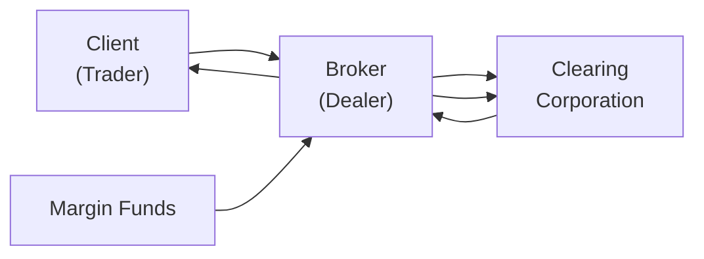

## 23.1 Basic Margin Terms

We’re about to dive into one of the most crucial elements of derivative trading: margin. If you’ve ever opened a derivatives account, or even just thought about placing a leveraged trade, you’ve probably encountered the concept of margin requirements. But what does “margin” really mean in day-to-day practice? Why is the idea of margin so tightly regulated by the Canadian Investment Regulatory Organization (CIRO) and the Bourse de Montréal? Let’s unpack these questions in a straightforward, slightly informal manner.

Margin isn’t just a deposit. It’s a promise. It’s that little nudge that says, “We’re all good here; I can cover my potential losses.” As you’ll see, margin serves as an essential cushion to protect not only your brokerage (or clearing member) but also the entire market from catastrophic failure. It’s a fundamental building block in the world of derivatives—whether you’re dealing with futures, equity options, or more exotic instruments.

Why does margin matter so much? Because without it, a single series of big losing trades could lead to a chain reaction. The idea of margin is to ensure each participant has enough skin in the game, so that even if something unexpected happens (and trust me, it can happen!), the market as a whole remains stable.

Margin typically comes in a few flavors: initial margin, maintenance margin (or maintenance requirement), variation margin (sometimes called mark-to-market in the futures space), and excess margin. While the terminology can vary across products—like equity options, futures, and swaps—the guiding principle remains the same: make sure every open position is backed by sufficient collateral.

Understanding how margin works is essential for exam success, but more importantly, it’s vital for real-life trading. So let’s get into the nuts and bolts.

Margin in Derivative Trading

When you think of derivatives, think leverage. They’re efficient, flexible, and wildly powerful—but they can also escalate your losses just as quickly as they amplify your gains. Because of this, regulators require that someone opening a derivatives position set aside a bit of money (or other eligible collateral) to cover potential losses. In effect, you—rather than your broker—are backing your own bets.

Imagine you’re placing a bet at a casino. The house needs to ensure you can pay if you lose. Margin works the same way: it’s your pledge to the broker that you can settle any obligations arising from your trades. This deposit is necessary to keep the system fair and stable.

Essential Definitions

Margin.  
The collateral required to support a leveraged position in financial instruments. In a sense, margin covers your side of the contract. If the market goes against you, your broker (backed by the clearing corporation) uses those funds to offset losses before they balloon into something unmanageable.

Initial Margin.  
This is the amount of collateral you must post at the outset of a position. If you’re trading listed equity or index options, or entering a futures contract, CIRO guidelines (along with exchange rules such as those from the Bourse de Montréal) determine how much initial margin is needed. The calculations can be quite formulaic. For example, when you buy or write an option, the margin requirement might be derived from standardized approaches—like scanning risk-based margin systems or a simpler fixed-percentage-of- underlying approach. The idea is that everyone knows from Day One how much margin is needed to open a position.

Maintenance Margin.  
After you open your position, the margin requirement may slightly differ. Maintenance margin is the minimum amount of equity you must continue to have in the account. If your losses deplete your account’s equity (or if the market becomes more volatile), your broker will likely send out a margin call to get you back up to the acceptable level. And yes, margin calls can come out of nowhere on a hectic trading day—so it’s prudent to maintain a buffer in your account.

Variation Margin (Mark-to-Market).  
Futures contracts and some cleared swaps use a daily settlement process called mark-to-market. Each day (and possibly intraday if volatility is extreme), the futures account is credited or debited based on the contract’s daily price movement. If your position generates a loss, you must post additional funds (variation margin) to make up the shortfall promptly. If you are on the winning side, you may see a credit come in, effectively pulling profits out of your position and reducing your risk. This daily or intraday “settling up” is designed to prevent losses from accumulating and keep default risk in check.

Excess Margin.  
This is the margin cushion you have above and beyond what’s required. Folks with a comfortable risk tolerance often maintain some excess margin, so they don’t get caught off guard by margin calls when markets suddenly swing.

Collateral and Haircuts

Your margin may not come purely in the form of cash—it might involve securities, government bonds, or other assets. But each form of collateral typically undergoes a “haircut,” meaning the broker values it at less than its current market price to account for potential volatility or liquidity risks. For instance, if you pledge government bonds, a broker might only count 95% of their market value toward margin. Haircuts make sure that if you must liquidate your collateral quickly, there’s enough cushion if the market value of that collateral drops.

Leverage and Risk

Margin and leverage are deeply intertwined. Think of “leverage” as the ability to take a bigger position than your cash would typically allow. If you can control $100,000 worth of underlying interest with $10,000 of margin, you’re effectively leveraging your capital 10 to 1. That’s thrilling when you’re winning... but it’s equally terrifying on the flip side. Even a small adverse move can wipe out your margin in the blink of an eye. And yes, I’ve had that experience where I thought, “Ah, the market can’t possibly gap that much overnight,” only to wake up to a substantial margin call that felt like an ice-cold shower.

Regulatory Landscape

If you’re operating in Canada, particularly in 2025 and beyond, you’ll see that CIRO is the national self-regulatory organization overseeing margin rules for investment dealers and market integrity in equity and debt marketplaces. This replaced IIROC and MFDA, which are now defunct. CIRO ensures that margin rules reflect the risk each product poses to the market and that they’re uniformly enforced across member firms. The Bourse de Montréal enforces margin requirements specifically for listed derivatives. If you want the official guidelines, you can check out:

• CIRO: https://www.ciro.ca  
• Canadian Securities Administrators (CSA): https://www.securities-administrators.ca/  
• Bourse de Montréal Rulebook: https://www.m-x.ca/  
• Canadian Derivatives Clearing Corporation (CDCC): https://www.cdcc.ca/

Margin Calls: How They Happen

So, how do margin calls actually unfold in real time? Let’s say you’re long a futures contract on one of Canada’s popular equity indexes. You put up the required initial margin of, say, $8,000. Then the index unexpectedly moves against your position. Each day, the contract is marked to market, and each day your losses add up. Eventually, your account’s equity drops below the maintenance margin threshold. At that point, your broker notifies you (that dreaded margin call email or phone call) and requests additional funds. You typically have to meet that call pretty quickly—sometimes within hours.

If you can’t meet that call, your broker may be forced to liquidate your position to limit risk. On the flip side, if the index moves in your favor, you might not just avoid a margin call—you might even earn extra margin capacity because your account equity rises (a scenario more common in futures and certain leveraged options strategies).

Anyway, the moral of the story is that margin calls are serious business. You can think of it like an alarm that signals to the market, “Hey, your position is in trouble; we need more resources now.”

Practical Example: Writing an Equity Call Option

Let’s look at a practical example. Suppose you write (sell) a call option on a Canadian blue-chip stock. You collect a premium of $1,000 in your account on Day One. However, your broker will likely require you to deposit initial margin for this short call position. One standard margin formula is something like:

Required Margin = 25% × (Market Value of Underlying) − Out-of-the-Money Amount + Premium Received,

subject to certain minimums set by CIRO. If your stock is priced at $50 (and each option contract covers 100 shares), the market value of the underlying is $5,000. Let’s assume your option is slightly out-of-the-money. Your broker might come up with a required margin of, say, $1,200. If you have $2,000 in your account, you’d be just fine since you’d be above the required margin. If the stock price goes up and your short call becomes more at risk, you might see that margin requirement jump higher.

(Please note that the exact margin formula used may differ by broker or underlying parameters, but the gist is that margin for a short option usually covers the market risk as the underlying moves.)

Mermaid Diagram: Margin Flow in a Futures Contract

Below is a simple way to visualize how margin flows between the client, broker, and clearing corporation. This is especially relevant for futures, which often use a daily mark-to-market system.

Explanation of the Diagram:

• The Trader deposits margin funds with the Broker.  
• The Broker consolidates these funds and provides margin to the Clearing Corporation.  
• The Clearing Corporation ensures all participants meet their obligations.  
• Gains or losses from daily settlements flow back to or from the Trader via the Broker.

Excess Margin: A Comfortable Cushion

Ever felt like you’d rather over-prepare than scramble at the last minute? Excess margin is just that—it’s a small comfort zone that helps you avoid margin calls. For instance, if your broker requires $5,000, you might deposit $7,000. This can really help prevent day-to-day volatility from forcing you out of otherwise sound strategies.

Common Pitfalls and Challenges

• Over-Leveraging: It’s tempting to max out your margin and take on the largest possible position. But remember, leverage cuts both ways.  
• Not Monitoring Volatility: A sudden spike in the volatility of the underlying can increase margin requirements overnight (or even intraday).  
• Neglecting Excess Margin: Without a buffer, you may face frequent, urgent margin calls, potentially forcing you to sell or close positions at less-than-ideal times.  
• Failing to Understand Product-Specific Rules: Futures, options, and swaps each have differing margin frameworks. If you’re new to commodity futures but already an equity options trader, do your homework.  
• Illiquid Collateral: Pledging illiquid assets might reduce your margin capacity or require larger haircuts.  

Best Practices

• Maintain a Margin Cushion: Keep more than the bare minimum, especially if you expect market turbulence.  
• Regularly Check Your Account: Margin requirements can change quickly with market conditions.  
• Diversify Your Positions: Holding multiple uncorrelated positions may help reduce overall risk (and might reduce your margin in certain risk-based margin frameworks).  
• Communicate with Your Broker: Whenever you sense a storm brewing or you plan a big new trade, let them know to avoid last-minute issues.  
• Stay Updated with CIRO: Because margin rules evolve, especially if new products or regulatory changes come into play.

Regulatory and Clearing Insights

In Canada, the Canadian Derivatives Clearing Corporation (CDCC) is central to clearing and settlement for many derivative products traded on the Bourse de Montréal. CDCC collects margin from member firms, who then collect margin from you (the retail or institutional trader). Each step in the chain ensures adequate coverage. This multi-layer approach protects the entire market from any single failure.

Margin Requirements by Product

• Equity Options: Typically set by guidelines that reflect the underlying stock’s price volatility, potential exercise risk, and how far the option is in or out of the money. The Bourse de Montréal publishes margin tables or formulas.  
• Index Options: Similar to equity options, but might factor in index volatility differently, and the notional can be quite large.  
• Futures: Use daily mark-to-market. The initial margin is determined by the exchange’s margin model, which could be influenced by implied volatility and historical price fluctuations.  
• OTC Swaps: Though many are moving to cleared platforms, they often require initial margin and variation margin under rules set by regulators. Collateral rules might be spelled out in an ISDA Master Agreement if trades are not centrally cleared.

Case Study: Sudden Volatility Shock

Let’s say you’re short a put option on one of Canada’s large banks. The underlying stock is typically stable, rarely making wild moves. Suddenly, news breaks about a widespread housing market downturn. The implied volatility on bank shares shoots up, and the option premium skyrockets. Your broker quickly recalculates margin, sees that your position is riskier now, and sends you a margin call. Although the underlying price hasn’t moved drastically, the potential risk of a further drop has increased because of volatility changes. If you don’t have enough excess margin, you may be forced to close the position or deposit more funds that very day to stay compliant.

From personal experience, I remember ignoring volatility expansions on an oil futures position. I told myself, “Crude oil is always volatile—this is nothing new.” That was not a wise approach. The margin jumped, and so did my stress levels.

References for Further Exploration

• CIRO Website:  
  https://www.ciro.ca  

• CSA National Instruments:  
  https://www.securities-administrators.ca/  

• Bourse de Montréal Rulebook (for margin requirements):  
  https://www.m-x.ca/  

• Canadian Derivatives Clearing Corporation:  
  https://www.cdcc.ca/  

• Open-Source Risk Analytics (e.g., QuantLib):  
  Helps you understand how margin calculations might be modeled in a real-world context.  

• CFA Institute’s “Margin Rules and Mechanisms in the Derivatives Market”  
• The Essentials of Risk Management by Michel Crouhy, Dan Galai, and Robert Mark

In Closing

Margin is the backbone of paper-based risk protection in the derivatives world. It ensures you can meet your obligations and helps keep the overall market stable. A thorough grasp of margin requirements—knowing the difference between initial margin, maintenance margin, variation margin, and what happens during a margin call—can be the difference between smooth sailing and a panic phone call from your broker.

If you find yourself asking, “Do I really need to know all this?” the answer is a resounding yes. Whether you’re speculating with options or hedging a commodity position, margin determines how far you can extend your trades, how often you’ll be asked for more funds, and ultimately how you manage your risk. And if I can leave you with one last anecdote: keep a little cushion to avoid those heart-stopping calls on a wild trading day.

Keep learning, stay informed, and don’t forget to ensure you have the resources to meet margin calls promptly. Good luck out there!

## Sample Exam Questions: Basic Margin Terms



### Which of the following best describes "initial margin" in derivative trading?

- [x] The amount of collateral posted to open a new position
- [ ] The cash required to cover daily price movements
- [ ] The difference between a bond’s market value and its face value
- [ ] The settlement received when you exit your position

> **Explanation:** Initial margin is the amount of collateral required when first entering a trading position. It ensures that traders can cover potential losses from the start.

### What term refers to the minimum account balance that must be maintained to keep a derivative position open?

- [ ] Initial margin
- [ ] Variation margin
- [x] Maintenance margin
- [ ] Excess margin

> **Explanation:** Maintenance margin is the minimum amount of collateral that must remain in your account. If the account balance falls below this level, a margin call is triggered.

### Which of the following best defines "variation margin" or "mark-to-market margin" in the context of futures?

- [ ] The margin one must pay when opening a position
- [x] The daily settling of gains and losses on open positions
- [ ] The excess equity in your account
- [ ] The personal credit score of the trader

> **Explanation:** Variation margin is used to reflect daily changes in the value of an open futures position. Gains and losses are credited or debited to the account accordingly.

### What is the purpose of a "haircut" on collateral?

- [x] To reduce the allowable value of collateral to account for potential market and liquidity risks
- [ ] To increase the margin requirement for retail traders
- [ ] To provide a financial incentive for short selling
- [ ] To eliminate the need for cash deposits

> **Explanation:** Haircuts adjust the stated value of pledged collateral, ensuring that even if its market value falls, the clearing member remains adequately protected.

### Which organization in Canada oversees margin requirements for listed derivatives on the Bourse de Montréal?

- [ ] CIPF
- [ ] OSC
- [x] CIRO
- [ ] IIROC (currently active)

> **Explanation:** As of 2023, CIRO is the national self-regulatory organization in Canada, resulting from the amalgamation of IIROC and MFDA. It helps set and enforce margin requirements for member firms.

### Which best characterizes "leverage" in margin trading?

- [x] The ability to control a larger position than your cash balance would normally permit
- [ ] The final settlement of a futures contract
- [ ] The mandatory deposit required when trading bonds
- [ ] A broker’s compensation for placing trades

> **Explanation:** Leverage allows you to control a more significant position using a smaller amount of capital. It amplifies both gains and losses.

### Why might a trader choose to maintain "excess margin" in their account?

- [ ] To avoid paying any swap fees
- [x] To provide a cushion against sudden market swings and reduce the risk of a margin call
- [ ] Because regulators mandate it for all short positions
- [ ] To finance their living expenses

> **Explanation:** Maintaining extra margin can help traders avoid urgent margin calls if markets move rapidly, preventing forced liquidation of positions.

### Which of the following is most likely to trigger a margin call?

- [ ] An increase in the trader’s net cash balance
- [ ] Declining volatility in the underlying asset
- [x] An adverse price movement that brings the account below the maintenance margin level
- [ ] Receiving dividends on the underlying stock

> **Explanation:** A margin call is typically triggered when the account value drops below the maintenance margin, often due to an unfavorable price move.

### In a short options position, margin requirements often incorporate which of the following factors?

- [x] A portion of the underlying stock's market value plus any out-of-the-money amount
- [ ] Variance in interest rates
- [ ] The trader’s personal credit history
- [ ] Time spent in the position so far

> **Explanation:** Short option margin requirements often consider a percentage of the underlying’s value, less the out-of-the-money amount, to ensure the position is properly collateralized against adverse moves.

### True or False: When the market moves in your favor for a futures contract, your variation margin requirement might decrease.

- [x] True
- [ ] False

> **Explanation:** If the market moves in your favor, daily settlements credit your account, potentially reducing additional margin requirements going forward.


