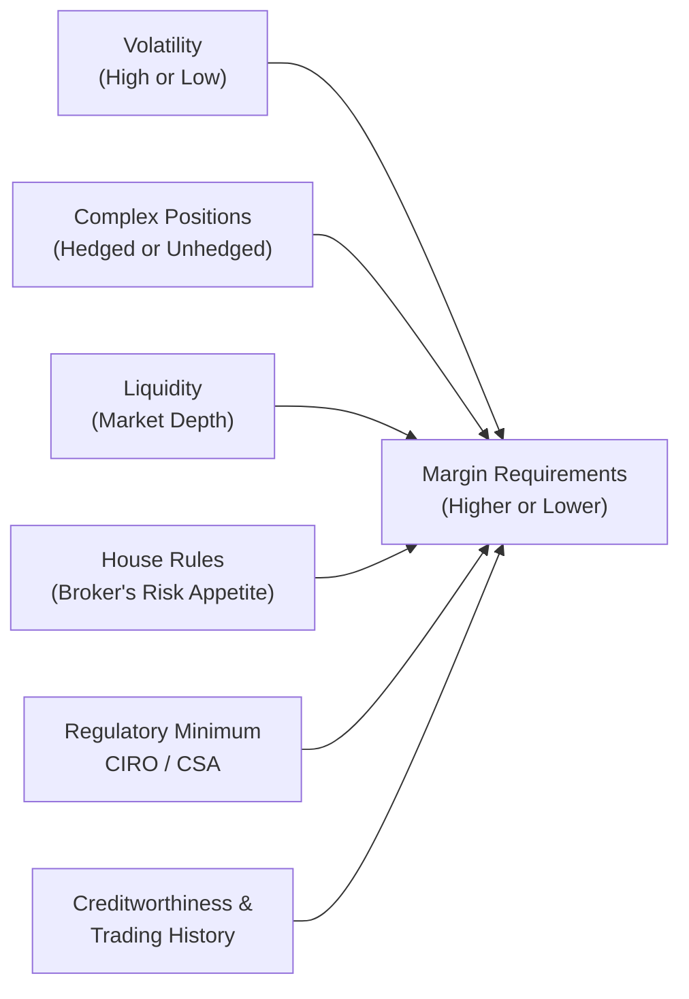

## 23.2 Factors Affecting the Amount of Margin Required

Imagine you’re about to start a new derivatives trade—maybe an options position on a stock you’ve been eyeing. There’s a moment many of us experience where we notice the margin requirement and think, “Wait, why is it so high? Or so low?” Well, margin requirements are not just pulled out of thin air. They’re driven by a combination of regulatory policies, brokerage house rules, inherent market volatility, liquidity considerations, and yes—even the reputation of the trader (your very own track record!). Let’s dig into some of the factors that can make the margin you owe go up or down.

 

### The Concept of Margin in Derivatives

Margin in derivatives trading is essentially a “good faith deposit” ensuring you have enough capital to cover potential losses on your open positions. In Canada, the Canadian Investment Regulatory Organization (CIRO)—formed from the historical merger of IIROC and the MFDA—sets or oversees the minimum regulatory margin guidelines in conjunction with the Canadian Securities Administrators (CSA). But your broker may decide to be stricter and charge you what’s called a “house margin,” which is higher than the minimum requirement. 

 

### Volatility and the Underlying Asset

One of the most influential drivers of margin is volatility. If an underlying asset is whiplashing up and down in price, you can bet the margin requirement will be higher. This is because volatile market conditions increase the likelihood that a position can swing against you quickly. Higher volatility = higher margin. It’s that simple.

• If you’re trading options on a high-volatility biotech stock that jumps 10% in a day on trial results, you’ll likely face bigger margin requirements than you would with a more stable blue-chip equity.  
• The same logic applies if you’re dealing with commodity futures (e.g., crude oil) in times of global supply shocks.

And if the volatility spikes all of a sudden (like we saw in early 2020 with certain markets), margin rates often get boosted in short order to protect market participants—and your own broker—from outsized losses.

 

### Overall Portfolio Risk (Net Risk Exposure)

So you walked into your broker’s office… well, maybe you just logged on to your trading app from your couch and set up multiple options positions. If your positions offset each other—say you have a covered call or a call spread—your net risk might be lower than if you just sold a naked call. Lower net risk often translates to lower margin.

A multi-leg option strategy that’s carefully hedged can reduce your theoretical maximum loss. A typical example is a bull call spread where you buy a call and simultaneously write a higher-strike call. The sold call helps finance part of the long call premium and reduces your net risk. In turn, your margin requirement might be less than if you had only bought the call or only sold the call naked.

On the flip side, if you’ve got positions that amplify each other’s risk—like a portfolio concentrated in one sector moving in the same downward direction—this concentration risk can drive your margin needs up. Brokers look closely at how each of your trades interacts with the others.

 

### Regulatory Requirements vs. House Margins

CIRO sets minimum margin requirements for equity options, index options, certain futures, and other listed Canadian derivatives. Similar guidelines may exist in other jurisdictions (e.g., the U.S. CFTC for futures). However, these are just minimums. If your broker feels you’re taking on more risk than is typical or that your positions are volatile, they can impose a “house margin” that’s more stringent.

• House margin provides dealers with a cushion in case the client account experiences rapid losses.  
• In periods of extreme market turmoil, many brokerage firms will temporarily raise their house margins across all clients, or specifically for those with large or speculative positions.

Consumers—especially new derivatives traders—might find these rules frustrating: “Why am I paying more than the regulatory minimum?” But from the firm’s perspective, it’s about risk management. They’d rather you post more margin up front than chase you down for a margin call as the trade moves against you.

 

### Market Conditions and Volatility Indexes

We already touched on volatility, but there’s a specific angle here tied to so-called “fear gauges” like the VIX (which measures implied volatility for U.S. S&P 500 options). Even though the VIX is a U.S.-based metric, global markets keep an eye on it. In Canada, we have equivalent measures to gauge implied volatility on key indices like the S&P/TSX 60. When the market’s “fear gauge” is high, you can almost bet your margin will be higher—like an insurance premium that goes up when storms are looming.

Over the years, I’ve seen personal examples: I remember one summer when markets suddenly swooned due to unexpected geopolitical tensions. My margin requirements for previously stable positions almost doubled within a week. The reason? The fear index soared, and brokers responded by establishing steeper margin buffers.

 

### Liquidity of the Underlying

Liquidity basically answers the question: “How fast can I buy or sell this position without drastically affecting its price?” A highly liquid underlying—like a large-cap stock or a major currency pair—usually has lower margin requirements relative to something that trades lightly and has large bid-ask spreads.

If your underlying interest is extremely illiquid, the risk of not being able to unwind that position in a timely manner is greater. If the broker can’t guarantee a quick exit, they might require you to pony up more margin. For instance, small-cap stocks with thin volumes or farmland futures that trade only a few times a week might come with stiffer margin demands. 

 

### Creditworthiness and Trading History

Sometimes, it’s not about the market; it’s about you! If you’ve built a reputation for prudent trading over many years—meeting all your calls on time, maintaining a diversified portfolio, rarely employing high-risk strategies—your broker may offer more lenient margin terms. Conversely, if you’re new to the game or have had margin calls in the past, the firm might be cautious and impose additional margins to protect themselves.

A friend of mine, who’s an experienced commodity trader, told me once that because she’s got a long track record of responsibly managing large futures positions, her house margin level is often lower than the standard. That’s a perk of trust and reliability, but it took her years of stable performance to get there.

 

### Concentration Risk

Concentration risk is the scenario where a large portion of your portfolio is tied up in a single asset, sector, or highly correlated group of assets. If you’re “all in” on a single stock or just a couple of correlated commodities, your portfolio vulnerability is higher. Brokers like to see diversity in your holdings. If everything is in one basket, margin requirements can quickly rise.

Cross-verification among correlated assets might also drive margin changes. If you hold multiple positions in the same region or sector that react similarly to economic news, your combined risk is higher. For instance, if you have heavy positions in technology stocks plus a few correlated call options on the same sector, the broker might require more margin to guard against an abrupt meltdown in the tech sector.

 

### Offsetting or Hedged Positions

Hedging is essentially taking a position that reduces the risk of losses in another position. For example, if you hold 1,000 shares of a highly volatile mining stock, you might buy corresponding put options to limit your downside. Or you might short futures to hedge a physically held commodity. From a margin perspective, your net risk is lower, which can lead to lower margin requirements. The broker sees that if one side of your trade goes south, the other side might offset some or all of those losses.

Of course, you have to do it right. Partial hedges will only partially reduce your margin. And keep in mind that certain instruments, even if they appear correlated, don’t always move perfectly in opposite directions.

 

### Putting It All Together: A Visual Overview

Below is a simple Mermaid diagram illustrating some of the key factors that feed into margin requirements:

The center node represents margin requirements, and each factor feeds into whether your margin ends up higher or lower. Notice that liquidity, house rules, regulatory minimums, and your own creditworthiness converge around that one requirement. If multiple risk factors come together—like high volatility with low liquidity—be prepared for margin to jump.

 

### Common Pitfalls

• Underestimating the Impact of Volatility: Some folks assume the margin schedule is static. Then markets get choppy, and they’re blindsided by margin calls.  
• Misjudging Liquidity: If you’re trading in an obscure market or low-volume stock, keep an eye on how quickly (and easily) you could liquidate your position if needed.  
• Over-Concentration: You might think, “I’m great at picking biotech stocks,” until that sector tanks and your margin requirement skyrockets. Diversification can help keep your margin in check.  
• Relying on Historical Volatility Alone: Implied volatility changes fast; just because something has been stable in the past doesn’t mean it’ll remain stable when major news hits.

 

### Case Study: Margin Requirements in a Turbulent Market

Suppose you trade energy futures that typically have a margin ratio of, let’s say, 5% in a stable environment. Suddenly, geopolitical tensions cause oil prices to swing wildly in a single day. The implied volatility has spiked, the exchange is worried about settlement risk, and your broker is on high alert. Overnight, your margin may jump from 5% to 8% or even reach 10%. That might mean you need an extra $80,000 to $100,000 in your account if you hold $1 million worth of contracts. That’s a real example many commodity traders live with: margin requirements can shift abruptly.

 

### Margin in OTC Derivatives: Swaps and Forwards

Over-the-counter (OTC) derivatives, such as interest rate swaps or currency forwards, present another angle. Under CSA initiatives and CIRO rules, certain standardized OTC derivatives must be reported to trade repositories and sometimes centrally cleared. Centrally cleared swaps will have margin requirements akin to exchange-traded products, whereas bilateral (uncleared) swaps can have variable or negotiated margins. Your creditworthiness and the nature of the swap (e.g., interest rate swap vs. highly tailored commodity swap) affect your margin significantly in this space.

 

### Best Practices and Risk Management

• Keep an Eye on Margin Rate Notices: The Bourse de Montréal periodically issues updates on margin multipliers for various futures and options contracts. It’s a good idea to subscribe to these notices so you aren’t caught off guard.  
• Maintain Sufficient Liquidity: Always keep enough cash or cash equivalents (e.g., T-bills) in your account to meet potential margin calls, especially if you trade volatile products.  
• Diversify, Diversify: Spreading out your exposure across uncorrelated assets can reduce your margin burden.  
• Communicate With Your Broker: If you anticipate adding large or complex positions, talk to your broker in advance. They might offer flexible margin solutions or help you structure a hedged approach that minimizes margin.  

 

### References and Additional Resources

• Review Margin Rate Notices from the Bourse de Montréal for up-to-date margin multipliers:  
  https://www.m-x.ca  

• Consult CIRO Member Rules regarding client margin guidelines and risk-based margin policy:  
  https://www.ciro.ca  

• Read the CSA’s instruments on OTC derivatives for more depth on margin for non-exchange-traded products:  
  https://www.securities-administrators.ca/  

• Explore risk management research from the Bank for International Settlements (BIS) for global perspectives:  
  https://www.bis.org/  

• Look into advanced margin strategies or refer to educational materials on multi-leg options to reduce margin where feasible.

 

## Sample Exam Questions: Factors Influencing Margin Requirements in Derivatives



### A trader holds multiple long call options on a volatile small-cap stock with low liquidity. Which factor is most likely to raise their margin requirement?

- [ ] House margin being lower than the regulatory minimum
- [x] The low liquidity and high volatility of the underlying stock
- [ ] Offsetting positions in the trader’s portfolio
- [ ] Decreasing implied volatility in the overall market

> **Explanation:** Assets with low liquidity and high volatility tend to have higher margin requirements because the trader could experience larger losses over shorter time frames, and it may be hard to liquidate the position.

### Which statement best describes the relationship between volatility and margin requirements?

- [x] Higher volatility often leads to higher margin requirements.
- [ ] Higher volatility often leads to lower margin requirements.
- [ ] Volatility has no influence on margin requirements.
- [ ] Margin requirements increase only if volatility remains high for at least 30 days.

> **Explanation:** As markets become more volatile, dealers and regulators raise margins to protect both the client and the brokerage firm from large market swings.

### How do offsetting positions, such as a covered call, typically impact margin requirements?

- [ ] They significantly increase margin requirements.
- [ ] They have no effect on margin requirements.
- [x] They can reduce margin requirements because they lower net risk.
- [ ] They are only recognized by regulators, not brokers.

> **Explanation:** If one position hedges another, the net exposure is lower, often translating into lower margin requirements.

### Which regulatory body in Canada oversees margin requirements for investment dealers and the broader marketplace?

- [ ] The Bank of Canada
- [ ] The defunct Investment Industry Regulatory Organization of Canada (IIROC)
- [ ] The defunct Mutual Fund Dealers Association of Canada (MFDA)
- [x] The Canadian Investment Regulatory Organization (CIRO)

> **Explanation:** CIRO (the entity resulting from IIROC and MFDA’s amalgamation) is currently responsible for regulating investment dealers and overseeing margin guidelines.

### When a trader's portfolio is heavily concentrated in a single sector that faces a sudden decline, what is likely to happen to their margin requirements?

- [x] Margin requirements will probably increase due to concentration risk.
- [ ] Margin requirements will remain unchanged.
- [ ] Margin requirements will decrease because the portfolio value dropped.
- [ ] The regulatory minimum margin guidelines won’t allow changes.

> **Explanation:** A concentrated portfolio increases the risk of a significant drawdown if the sector experiences negative events. Brokers compensate by raising margins to protect against potential losses.

### The measure of how fast an underlying asset can be bought or sold without significantly affecting its price is called:

- [ ] Volatility
- [ ] Offset ratio
- [x] Liquidity
- [ ] House margin

> **Explanation:** Liquidity refers to the ease of entering or exiting positions. Less liquid assets carry higher risk and often require higher margins.

### Why do brokerage firms sometimes impose house margins above the minimum regulatory requirement?

- [ ] It is illegal to apply more than the minimum regulatory margin.
- [ ] They prefer to maintain low levels of capital in client accounts.
- [x] They want an extra cushion against potential market risk and client default.
- [ ] House margins don’t exist in practice.

> **Explanation:** House margins are a common practice to ensure the firm is protected if markets move rapidly or the client’s positions deteriorate quickly.

### What is a possible benefit of sustaining a long, positive trading track record with a brokerage firm?

- [x] The broker might offer more flexible or lower house margin requirements.
- [ ] The broker will disallow multi-leg strategies.
- [ ] The broker will reduce the regulatory minimum margin.
- [ ] Regulators will eliminate margin requirements entirely.

> **Explanation:** Clients with consistent, reliable trading histories can be perceived as less risky, sometimes allowing them more favorable margin terms.

### How do sudden spikes in implied volatility indexes (like the VIX) typically affect margin rates?

- [x] They generally drive margin requirements higher across many or all asset classes.
- [ ] They cause no changes to margin requirements.
- [ ] They only affect margin requirements for liquid stocks.
- [ ] They only apply to currency options.

> **Explanation:** When “fear gauges” like the VIX jump, brokers often react by increasing margin requirements to reflect the higher possibility of large market movements.

### True or False: A high degree of correlation among portfolio components can lead to increased margin requirements due to concentration risk.

- [x] True
- [ ] False

> **Explanation:** If all your positions tend to move together in the same direction, your portfolio is exposed to bigger potential losses, triggering higher margin obligations.


