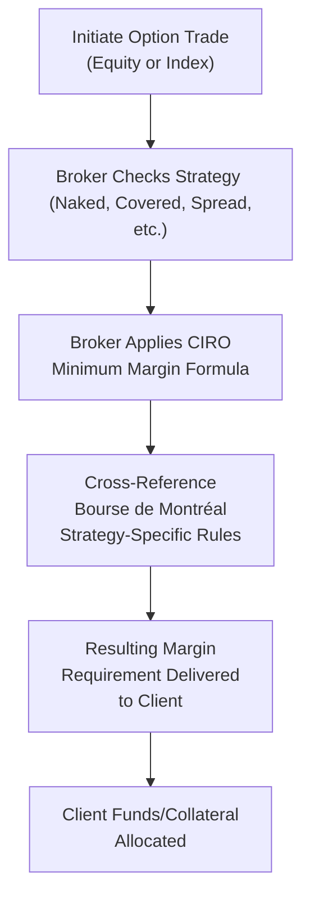
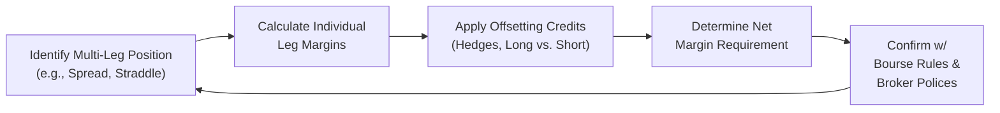

## 23.3 CIRO and Bourse de Montréal Minimum Margin Requirements for Equity and Index Option Strategies

Margin requirements for equity and index options in Canada can sometimes sound pretty daunting, right? I mean, you might think, “Oh dear, is there a secret formula only a rocket scientist can grasp?” But in reality, these rules come down to making sure both you and your brokerage firm have enough cushion to handle negative price movements in your trading positions. In Canada, both the Canadian Investment Regulatory Organization (CIRO) and the Bourse de Montréal—our primary derivatives exchange—set out the guidelines and formulas for how much collateral you must post when you enter certain trades. 

In this section, we’re going to walk through:  
• How minimum margin requirements are calculated and why they exist.  
• The main differences between margin calculations for equity options vs. index options.  
• Why certain strategies (like a naked call) require more margin, while others (like a protective put) get margin relief due to built-in hedges.  
• Real-life examples to illustrate what you might see on your brokerage statement and how to approach margin calls if they crop up (we’ve all been there!).  

So, let’s pop the hood on margin requirements and see what’s under there.

-----

### The Big Picture: CIRO, the Bourse, and International Margin Practices

CIRO, as of January 1, 2023, is the national self-regulatory organization that oversees investment dealers and the integrity of equity and debt marketplaces in Canada. The Bourse de Montréal—often simply referred to as the Montréal Exchange—administers the listing and trading of many of Canada’s derivative products, including equity and index options.

CIRO’s margin requirements serve as the baseline, basically telling all investment dealers: “Here’s the minimum margin you must collect from clients for specific positions, to remain in compliance with Canadian regulations.” The Bourse de Montréal complements these requirements with its own set of rules and policy documents, which align with global best practices. These margin guidelines also factor in price volatility, time to expiry, underlying instrument characteristics, and potential changes in market conditions.

Why do we need dual oversight from CIRO and the Bourse? In a nutshell:  
• CIRO ensures all dealer firms follow consistent national rules.  
• The Bourse enforces more detailed product-specific margin formulas to ensure the safe and orderly trading of its products.  

-----

### What is Margin, Anyway?

Margin is essentially collateral: you put up a certain amount of money (or securities) as a “good-faith deposit” to cover potential losses. If you’ve ever had an unexpected expense and your credit card company insisted on a credit limit, you already get the gist. In the options world, margin protects not only you but also your broker and the broader market.  

For equity and index options, a typical margin requirement might look like this:

(1) A base percentage of the underlying share (or index) value, plus  
(2) An additional percentage for each day the contract has until expiration, or an amount keyed to the option’s market price, or  
(3) A fixed dollar minimum set by regulatory guidelines—whichever is larger.

The actual formula can vary depending on your strategy (e.g., naked calls vs. covered calls).  

-----

### A Quick Note on Strategy-Based Margining

When we talk about “strategy-based margining,” it means the margin is calculated based on the net risk of your entire position, rather than just each option in isolation. 

• If you hold a covered call (i.e., you have 100 shares of stock and you sell a call option on that same stock), you’ve got less risk because your short call is “covered” by your long stock—it’s a built-in hedge. So you pay less margin.  
• If you write a naked call (i.e., you sell a call option without owning the underlying shares), you have theoretically unlimited upside risk if the price skyrockets, so your margin requirement will be higher.  

From a practical standpoint, you want to structure your trades in a way that keeps margin reasonable while also achieving your investment or hedging goals.  

-----

### Why Do Index Options Often Require Higher Margin?

Index options (e.g., on S&P/TSX 60 or other broad-based indexes) effectively represent a bundle of stocks. So if the entire index moves significantly, the potential for large gains—or large losses—can exceed that of an individual equity position under certain market conditions.  

Also, indexes can occasionally exhibit higher volatility, especially if macroeconomic events rattle the markets. Because the notional exposure can be bigger (imagine controlling many companies with a single option contract), CIRO and the Bourse require margin levels that reflect that broader market risk.

• Concentration Risk: Index options can be impacted by sector concentration (e.g., an index heavily weighted in financials or energy). If those sectors swing widely, margin might be set higher to cushion unexpected moves.  
• Correlation Dynamics: Sometimes, rapid interest rate changes or global events spark correlated moves in all components of the index. The Bourse de Montréal’s margin rules factor this correlation into their risk framework.  

-----

### Common Option Strategies and Their Margin Treatment

Below is a quick rundown of how margin is typically treated for each major category of option strategy. Keep in mind, the actual formula can differ from one broker to another, but they’ll generally follow or exceed the guidelines set by CIRO and the Bourse.

#### Naked Calls or Naked Puts
• Highest margin requirement among all strategies.  
• Requires you to put up collateral equal to a combination of the option’s current market value plus a buffer (percentage of the underlying stock price).  
• The logic: if you’re short a call and the stock rockets higher, you face unlimited losses.  

#### Covered Calls
• You own the underlying stock and sell (write) a call option.  
• Because you have the underlying shares as collateral, margin requirements are significantly lower.  
• The Bourse has a special formula that typically includes the call premium plus a reduced exposure cushion.  

#### Protective Puts
• You’re long the underlying stock and purchase a put option.  
• The put provides downside protection, so overall risk is lower.  
• Margin relief comes from the fact that your maximum risk is more limited (the worst-case scenario is the loss on the stock down to the strike price of the put, minus your put premium).  

#### Spreads
• In a call (or put) spread, you simultaneously buy and sell options of the same type with different strikes and/or expirations.  
• Your maximum gain and loss are both capped (or at least bounded more tightly than a naked option).  
• Margin is usually the net difference in strike prices, minus the premium received (for credit spreads) or plus the premium paid (for debit spreads).  

#### Straddles and Strangles
• You hold simultaneous call and put positions on the same underlying (in a straddle, same strike; in a strangle, different strike prices).  
• The net margin depends on the overall resulting risk if the market moves up or down.  
• Sometimes the margin is additive if both positions are short. If you’re long both sides, you’ve paid your premium in full, so margin might not be required beyond the cost of the premiums.  

-----

### Margin Formulas in Action: A Simplified Example

Let’s say you decide to sell (write) one covered call on ABC Inc., which trades at CAD 50 per share. You own 100 shares already, so it’s a perfect covered call scenario. The option you write has a strike price of CAD 52 and a premium of CAD 2.

In a simplified approach, your broker might look at the Bourse’s margin requirement for covered calls and do something like:

• Take the short option premium amount: 2 × 100 = CAD 200.  
• Add a small buffer (say, 10% of the underlying share price) to reflect potential stock price moves. That’s 10% of (50 × 100) = CAD 500.  
• Subtract any in-the-money amount, if applicable (not the case here, as the call is out-of-the-money).  

Your required margin might be around CAD 700 total. However, because the position is covered by the shares, your broker might partially or fully offset that margin requirement with the shares themselves as collateral. The precise calculation can vary, so always confirm with your firm’s margin department or the Bourse’s official margin calc tables.  

-----

### A Real-World Glimpse: Personal Margin Call Adventures

Let me tell you a quick personal anecdote—one of those “ugh” times in trading. Years ago, I was short an out-of-the-money put on a mining stock. The margin seemed easy enough to maintain. Suddenly, metals prices dropped, the miner’s stock tumbled 20%, and, well, that “out-of-the-money” put was quickly heading toward at-the-money territory. My broker emailed me at 9:45 a.m. the next morning with that dreaded subject line: “Margin Deficiency Notice.” That was my cue to either deposit more funds or close/roll the position.  

This is precisely why margin is so crucial: it’s not there to punish you but to ensure that everyone in the chain—broker, clearing corporation, and even the entire marketplace—remains well-protected if market moves go against you.  

-----

### Index Option Margins: A Closer Look

Imagine you short one call option on the S&P/TSX 60 Index with a value of CAD 20 per contract (representing an index level of 970, for instance). The notional value of that contract might be the index level (970) times a multiplier (let’s say 10 for simplicity), so the contract’s notional is CAD 9,700.

Even though that might not seem huge, the margin rules for index options could require:

1. The in-the-money amount (if any).  
2. A percentage of the underlying index’s current market value (often around 15% to 20%, depending on volatility).  
3. The cost (premium) of the call.  

The total margin might end up being thousands of dollars, especially if the index is near that strike or if markets are in the midst of a big swing. If you were to hold an offsetting long position in that same index, or a closely correlated instrument, your net margin could be reduced.  

-----

### How the Bourse de Montréal Maintains Alignment with International Standards

The Bourse’s margin framework is not an island of its own. It aligns with broader standards set by:  
• International Organization of Securities Commissions (IOSCO).  
• Financial Industry Regulatory Authority (FINRA) in the U.S. (Granted, the Bourse is not bound by FINRA, but it often references some of the margining best practices).  
• Risk-based margining systems used by global exchanges like the CBOE or Eurex.

This alignment ensures Canadian traders and investors can seamlessly interact with global markets, hedge cross-border positions, and maintain a consistent approach to risk.  

-----

### Diagram: Simplified Workflow for Margin Assessment

Below is a Mermaid.js flowchart to give you a visual sense of how your margin might be determined when you initiate a new option position at a CIRO-regulated firm that accesses the Bourse de Montréal.

**How to read this:**  
1. You place an order.  
2. Broker identifies the type of option strategy.  
3. CIRO’s baseline formula is applied.  
4. The Bourse’s specific margin guidelines are factored in.  
5. You get your margin requirement.  
6. You post funds or securities to meet that requirement.

-----

### Frequently Asked Questions

• **Do margin requirements change daily?**  
  Yes, margin requirements can change as the underlying price, implied volatility, and time to expiration fluctuate. Brokers often revalue positions daily (or more frequently) and update margin calls accordingly.  

• **Is portfolio margining available in Canada?**  
  Some Canadian brokerages offer a version of portfolio margin on a case-by-case basis. It’s typically more advanced and requires approval, plus a larger account size.  

• **Why do I need margin if I’ve fully paid for my shares?**  
  If you’re writing options without owning or hedging the underlying, you’re taking on additional risk. The margin covers potential losses beyond simply holding the shares.  

• **Are margin rules the same for U.S.-listed or other international options?**  
  Canadian brokers often follow local rules (CIRO and the Bourse). Cross-border trades might be subject to additional or different margin requirements under U.S. or global regulations.  

-----

### Tables: Illustrative Margin Scenarios

Below is an illustrative (not official) table showing approximate margin requirements for various option strategies. Always refer to the Bourse de Montréal’s policy documents and your broker’s calculations for actual numbers.

| Strategy       | Simplified Margin Approach                                                       | Example (1 Contract)                                             |
|----------------|----------------------------------------------------------------------------------|-------------------------------------------------------------------|
| Naked Call     | Max of [(% of Underlying × Underlying Price × # Shares) + Premium, Min. $/Contract] | E.g., 20% of (CAD 50 × 100) + Premium = CAD 1,000 + 2 × 100 = CAD 1,200  |
| Covered Call   | Minimum coverage since underlying is held                                        | E.g., Premium + small cushion. Possibly covered by stock collateral |
| Protective Put | Underlying margin, reduced by cost of long put                                   | E.g., If stock is CAD 50 × 100 shares = CAD 5,000 cost, put reduces downside risk, so margin might be minimal. |
| Call Spread    | Net max risk (Difference in strikes - net premium)                               | E.g., Strike difference = CAD 5; net premium = CAD 1 => Max loss = CAD 4 × 100 = CAD 400    |
| Short Straddle | Sum of short call + short put margin, minus correlation adjustment (if any)       | E.g., 20% of (USD 100 × 100) for each side, minus some offset      |

-----

### A Deeper Diagram: Strategy-Based Margin Calculation Flow

To further illustrate how strategy-based margin might be applied, here’s a second chart showing multiple legs of a trade.

Sometimes you’ll get margin relief if your short option is hedged by a long option in the same series or underlying. This cyclical check can happen periodically as market conditions (or your positions) change.  

-----

### Potential Pitfalls and Best Practices

• **Pitfall**: Selling too many naked options on a volatile stock or index can tie up huge margin or lead to margin calls if the market swings.  
• **Best Practice**: Use spreads or protective puts to limit your maximum risk and reduce margin.  

• **Pitfall**: Not checking your margin daily in fast-moving markets.  
• **Best Practice**: Make a habit of reviewing your positions each morning, especially during earnings season or major economic announcements.  

• **Pitfall**: Assuming your margin never changes.  
• **Best Practice**: Keep extra cash or margin capacity in your account to handle unexpected daily or intraday margin calls.  

-----

### Staying Compliant and Informed

Both CIRO and the Bourse update their rules from time to time. You can stay ahead of the game by:

• Reviewing the Bourse’s official margin tables at:  
  https://www.m-x.ca/  

• Checking CIRO’s compliance notices and manuals at:  
  https://www.ciro.ca  

• Consulting the Options Industry Council (OIC) for broad educational materials, though mostly U.S.-oriented:  
  https://www.optionseducation.org/  

• Keeping a reference library of textbooks like “Option Volatility & Pricing” by Sheldon Natenberg, for deeper dives into theoretical pricing, risk, and margining.  

-----

### Wrapping It Up

Margin is like a seatbelt: it might feel restrictive at times, but it’s there to protect you. Whether you’re selling a naked call or deploying more nuanced spreads, always calculate your potential risk and how it impacts your required margin. Remember that margin requirements aren’t static; they can change with market volatility, time to expiration, and the underlying price. 

By understanding how CIRO and the Bourse de Montréal structure their margin guidelines, you can trade (or invest) more responsibly and avoid those pesky margin calls that catch you off guard. Oh, and keep in mind that your specific dealer firm might impose stricter requirements than the minimums. It never hurts to ask your broker’s margin desk for a detailed breakdown of how your next big trade will be margined.

Here’s to responsible option trading and ensuring you always have enough coverage—financial seatbelt clicked, so to speak.  

-----

## Sample Exam Questions: Margin Requirements for Equity and Index Options



### Which organization sets the baseline margin requirements for all investment dealers in Canada?

- [x] CIRO
- [ ] OCC
- [ ] FINRA
- [ ] MFDA

> **Explanation:** The Canadian Investment Regulatory Organization (CIRO) is the national self-regulatory organization that replaced IIROC and MFDA as of 2023, and it sets the baseline margin requirements for investment dealers in Canada.

### Which option strategy typically has the highest margin requirement?

- [ ] Covered Call
- [ ] Protective Put
- [ ] Bull Call Spread
- [x] Naked Call

> **Explanation:** A naked (uncovered) call presents theoretically unlimited risk as the stock price can keep rising. This results in a high margin requirement to offset potential adverse price movements.

### Why do index options often have higher margin requirements than single-equity options?

- [ ] They are always more expensive.
- [ ] They have lower liquidity.
- [x] They represent a basket of stocks and can exhibit larger moves.
- [ ] They are only traded over-the-counter (OTC).

> **Explanation:** Because index options encapsulate overall market or sector movements, they can experience larger price swings. Regulators and exchanges impose higher margins to account for the broader risk profile.

### In a covered call strategy, what primarily reduces the margin requirement?

- [ ] The option's expiration date
- [x] Ownership of the underlying shares
- [ ] The strike price selection
- [ ] The underlying stock's trading volume

> **Explanation:** Covered calls are written (sold) against shares already owned. The underlying shares act as collateral, reducing overall risk and therefore the margin requirement.

### Which of the following statements is most accurate regarding CIRO and the Bourse de Montréal margin rules?

- [ ] They operate independently without referencing each other.
- [ ] The Bourse de Montréal sets no additional rules beyond CIRO’s.
- [ ] CIRO sets rules only for government bonds.
- [x] The Bourse de Montréal’s margin requirements complement CIRO’s baseline, incorporating product-specific guidelines.

> **Explanation:** CIRO sets the minimum margin requirement for Canadian investment dealers, while the Bourse de Montréal adds specific guidelines for the listed derivatives on its exchange, ensuring alignment with international standards.

### What might happen if your margin account falls below the required level?

- [ ] The broker automatically closes the account.
- [ ] Nothing, margin requirements do not change daily.
- [x] You will receive a margin call and must deposit more collateral or close positions.
- [ ] The Bourse de Montréal buys more securities on your behalf.

> **Explanation:** A margin deficiency requires immediate rectification—by depositing more funds/securities or by reducing positions—failing which the broker may liquidate positions on your behalf.

### In an option spread, why is margin often reduced compared to a single naked option position?

- [x] The maximum gain and loss are capped, limiting overall risk.
- [ ] Spreads always have zero margin requirements.
- [ ] No regulation applies to spread trading.
- [ ] Central counterparty clearing eliminates all risk.

> **Explanation:** A spread involves simultaneously buying and selling options, capping both losses and gains. This limited risk profile typically leads to a lower margin requirement.

### How do daily price changes or volatility affect your margin requirement for an open short option position?

- [ ] They have no effect once the option is sold.
- [x] They can increase your margin requirement if underlying prices move against your position.
- [ ] They only matter at the final day of expiration.
- [ ] They only affect margin for long option positions.

> **Explanation:** Brokers recalculate margin based on current market conditions, and large adverse price moves or rising volatility can increase your margin requirements significantly.

### Which of the following best describes a protective put’s margin treatment?

- [ ] It requires the full margin of a naked put.
- [x] It reduces margin requirements because the long put covers downside risk of the stock.
- [ ] It increases margin requirements since you hold two positions.
- [ ] It requires no margin at all, always.

> **Explanation:** A protective put strategy (long stock + long put) provides downside protection, thus reducing the net risk to the investor, which typically leads to a lower margin requirement.

### True or False: CIRO’s margin requirements are fixed and never adjusted to reflect changing market conditions.

- [x] True
- [ ] False

> **Explanation:** (This is a trick question.) In reality, CIRO’s margin requirements can be updated periodically, and the actual margin you owe can change daily due to fluctuations in price and volatility. However, the “baseline” formulas are generally stable until CIRO issues updated policy or the Bourse adjusts rules. Always confirm with your broker or official guidelines.


