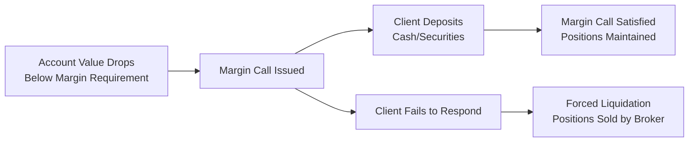

## 23.4 Meeting Margin Calls

Imagine you’re sitting at your desk, casually checking your trading account, sipping your morning coffee—everything seems fine. Then, suddenly, you receive an email alert that your account has just been hit with a margin call. Your heart skips a beat. It’s a quick jolt of panic: “Oh no, how did this happen?!” Well, margin calls can indeed creep up on you fast, especially when markets move against your positions. Let’s walk through what margin calls are, how you can meet them, and how the entire process is regulated to protect everyone involved.

Margin calls arise when a client’s account equity falls below the required margin level set by the firm and by regulatory bodies such as the Canadian Investment Regulatory Organization (CIRO). In these situations, the brokerage firm (or investment dealer) calls on the client—literally or figuratively—to deposit additional funds or marginable securities within a specified timeframe (often one to three business days). If you’ve never experienced it, it can feel a bit like your high school teacher suddenly demanding extra homework to push your grade back up above passing level.

Below, we’ll break down the reasons margin calls exist, how they work, and what to do to satisfy them quickly (and with fewer headaches).

  
### Why Margin Calls Occur

At the core, a margin call is all about maintaining enough collateral to cover the risk you—and, indirectly, your dealer—take when trading derivatives on margin. When trading futures or options, you typically post an initial margin (sometimes called “good faith” funds). This margin is meant to cover potential losses if prices move instantly in the wrong direction. As markets fluctuate, your account equity changes. If your account equity falls below the maintenance margin level (the minimum margin you must keep in the account), you get a margin call.

  
• Account Equity – This is the net value of your account, which includes the cash you’ve deposited and the unrealized profit or loss on any open positions. If this equity drops too low, you’ll likely hear from your firm’s margin department.

• Margin Deficiency – A fancy phrase meaning the shortfall that arises when your account equity dips under the required margin. Essentially, it’s how much more you need to deposit—or by how much you need to lighten your positions—to regain compliance.

• Market Volatility – Rapid price movements due to macroeconomic events, earnings misses, or even surprise announcements can cause big dips in your account equity. As you might guess, margin calls can happen fast in these circumstances.

  
### The Mechanics of a Margin Call

The margin call process starts with your broker or investment dealer. Here’s a simplified look at how this typically unfolds:

1. The broker’s margin system monitors client accounts in real time.  
2. When the equity in your account (cash plus securities minus any debts) can’t meet the required margin, an alert is generated.  
3. The firm sends you a “margin call notice,” explaining how much is needed and by when. Often this is around one to three business days, but in exceptionally volatile markets, the firm might demand immediate action or same-day coverage.  
4. If you meet the call, everything returns to normal. If not, the broker can forcibly liquidate (sell out) some or all of your positions to cover the deficiency.

Here’s a quick diagram to illustrate that process:

It may look intimidating, but basically, once you get that call, you either deposit more collateral or reduce your open positions. If you don’t or can’t, the broker has every right—and in fact, a regulatory obligation—to forcibly liquidate your positions.

  
### Depositing Cash vs. Marginable Securities

To meet a margin call, you can usually deposit cash or marginable securities. Marginable securities are stocks or bonds that a brokerage accepts as collateral, although they’re typically “haircut” in value (for instance, a stock worth $10,000 might only be valued at $7,000 for margin purposes). You might prefer to deposit securities if you want to avoid sending cash, but keep in mind that using securities this way depends on your firm’s margin rules and the regulatory guidelines.

  
### Failing to Meet a Margin Call

What happens if you fail to top up your account in time? Well, the dreaded forced liquidation is next. Dealers perform forced liquidation when:

1. The margin call is ignored or not met within the specified timeframe.  
2. The margin shortfall is growing quickly, and the dealer needs to prevent further losses.  
3. There is no sign of communication from the client about how, when, or whether the deficiency will be covered.

Forced liquidation isn’t fun—nobody wants to see their positions sold at possibly the worst time, but the dealer has that right to protect itself, comply with CIRO guidelines, and preserve market integrity. So, if you see a margin call in your inbox, the best approach is to reach out to your advisor or your firm’s margin department right away.

  
### The Regulatory Landscape: CIRO and Provincial Commissions

In Canada, CIRO is the national self-regulatory body that oversees dealers, among other responsibilities. When the Mutual Fund Dealers Association of Canada (MFDA) and the Investment Industry Regulatory Organization of Canada (IIROC) amalgamated on January 1, 2023, they formed what is now CIRO. All margin rules that previously existed under IIROC and MFDA have effectively merged, with updates and clarifications to modernize them.

Dealers must also abide by provincial securities commissions (e.g., Ontario Securities Commission, British Columbia Securities Commission) that set guidelines for how margin calls and communications must be handled. Essentially, these rules help maintain a fair, transparent marketplace in which clients understand their obligations and dealers follow consistent procedures when requiring margin top-ups.

If you’re ever curious about the official stance for your own province, you can check your local securities commission’s website or see the broad guidelines adapted by CIRO at:
• https://www.ciro.ca

And if you want more details on how derivatives accounts should be managed, see “Managing an Options Account” by the Bourse de Montréal at:
• https://www.m-x.ca/

  
### Communication and Documentation

You know how sometimes you get an unexpected phone call from a number labeled “Unknown Caller” and you either ignore it or assume it’s spam? Don’t do that if your margin department tries to reach you. Advisors have an obligation to inform you promptly when a margin call occurs. This might be an email, a call, or even a text message in some cases (depending on your firm’s processes). The clock is ticking from that moment on. Usually, you’ll be told exactly how much you need to deposit and the time you have to do it.

Most firms allow a short grace period, but it could be as short as a single trading day if the shortfall is significant or markets are extremely volatile (especially with leveraged, short-term products such as futures and short options). If your account is only slightly under the maintenance margin, you might get a bit more leeway. Regardless, it’s your responsibility to respond.

  
### Real-World Example and Personal Anecdote

I recall an old colleague—let’s call him Jack—who fell in love with a certain tech stock. He purchased call options on margin, believing the price would skyrocket after an upcoming product announcement. Well, the announcement wasn’t as big a deal as folks expected, and the stock slid for a few days. Suddenly, Jack’s margin cushion got wiped out, and the next thing he knew, a margin call popped up in his email. He had to scramble to pull funds out of his savings account and deposit them into his trading account the very next morning. It was either that or face forced liquidation. He got it done in time, but he was definitely stressed—and from that point on, he started keeping more cash in the account to cushion any future hits.

  
### Margin Calls in Highly Volatile Markets

If there’s one key lesson to remember, it’s that margin calls can happen quickly when market volatility ramps up. Situations like sudden macroeconomic shifts, black swan events, or even a surprise central bank announcement can send shockwaves across markets. The required margin could also increase at times if the derivative exchange or the clearinghouse sees a spike in volatility. This is why daily monitoring of your account is essential. Don’t just check once a week or once a month—especially if you’re using leverage.

In fact, some traders set up automatic alerts to warn them if their account equity is nearing the maintenance margin threshold. This can buy you enough time to deposit additional cash or close out some positions to avoid a margin call before it lands.

  
### Formulas and Quick Calculations

Let’s examine a basic formula for margin deficiency:


\text{Margin Deficiency} = \text{Required Margin} - \text{Account Equity}


So, if your Required Margin is \$50,000 but your account equity is \$45,000, you have a margin deficiency of \$5,000. You’d need to fix that gap by topping up your account with at least \$5,000 in cash or marginable securities, or by closing some of your positions to reduce the margin requirement.

Similarly, the margin requirement for certain futures contracts is often calculated as:


\text{Futures Margin Requirement} = \text{Contract Size} \times \text{Price} \times \text{Margin Rate}


For example, if you’re trading a crude oil futures contract (1,000 barrels per lot), priced at \$80 per barrel, and your dealer margin rate is 5%, here’s the rough margin you’d need:


1,000 \times \$80 \times 5\% = \$4,000


If the price moves unfavorably and your account equity drops below this requirement, a margin call is likely coming your way.

  
### Handling Forced Liquidation

Forced liquidation is the last resort when a client hasn’t met the margin call obligations. The firm might systematically liquidate positions until the deficiency is covered. You, as the client, don’t usually get to dictate which positions are sold; the firm’s interest is to protect itself (and by extension, other clients, the clearinghouse, and the marketplace). In other words, they might sell off your most liquid positions first because it’s the fastest way to restore compliance.

  
### Best Practices to Help Avoid Margin Calls

• Maintain a Cash Buffer – Keep more funds in the account than the bare minimum. This helps cushion against abrupt price movements.  
• Monitor Your Positions – Check your P&L daily, especially when there’s a big news release on the horizon.  
• Consider Stop-Loss Orders – While not guaranteed, they can help reduce risk if the market moves sharply against your position.  
• Diversify – Spreading risk over multiple assets or sectors can lower portfolio volatility.  
• Communicate Early – If you think you might not be able to meet a margin call, talk to your broker. Sometimes partial coverage or an extension might be arranged—but only if there’s good faith communication and it fits your firm’s policies.  

  
### Role of Clearing Corporations

Clearing corporations, such as the Canadian Derivatives Clearing Corporation (CDCC) or the Options Clearing Corporation (OCC) in the U.S., also support margining processes. They require brokers to post enough margin at the clearing level to cover their clients’ positions. If you default, an impact can cascade up the chain, affecting the clearing corporation and ultimately the market. That’s why these margin rules are strictly enforced. A single big default can destabilize the entire system if not handled properly.

  
### References and Further Resources

• CIRO: [https://www.ciro.ca](https://www.ciro.ca)  
• Ontario Securities Commission (OSC): [https://www.osc.ca](https://www.osc.ca)  
• Bourse de Montréal’s “Managing an Options Account”: [https://www.m-x.ca](https://www.m-x.ca)  
• The Investment Funds Institute of Canada (IFIC): [https://www.ific.ca](https://www.ific.ca)

These references offer deeper dives into rules, guidelines, and practical tips. The Bourse de Montréal’s materials are especially helpful if you trade options on Canadian underlyings. They walk you through various margin scenarios, including complex spread positions.

  
### Key Takeaways

Meeting margin calls is about swiftly restoring your account to regulatory compliance. Margin calls are not designed to be punitive; they exist to keep risk somewhat contained. If you fail to meet them, your firm has every right—indeed, an obligation—to liquidate your positions. As an investor, you can safeguard against such abrupt calls by staying on top of your account balances, using risk management tools, and maintaining clear lines of communication with your broker.

Finally, remember that margin calls can happen to the best of us—even seasoned pros. The difference is in how quickly and proactively you respond. As soon as you see that notice, consider your options: deposit additional funds, move marginable securities, or close positions to free up margin capacity. By staying informed of the rules, setting alerts, and anticipating sudden market swings, you’ll be better positioned to handle any surprises. And hopefully, you can finish that morning coffee without a heart-stopping email from your broker.

  
## Sample Exam Questions: Meeting Margin Calls in Derivatives Trading



### Under what condition is a margin call typically triggered in a derivatives account?

- [x] When the account equity falls below the required margin
- [ ] When the client liquidates a position at a profit
- [ ] When the client makes a deposit exceeding the required margin
- [ ] When the broker changes its commission structure

> **Explanation:** A margin call occurs when a client’s account equity fails to meet the prescribed maintenance margin level.

### Which of the following is the BEST way to satisfy a margin call, assuming the broker allows it?

- [x] Deposit additional cash or marginable securities
- [ ] Increase your open positions
- [ ] File a complaint with the provincial securities commission
- [ ] None of the above

> **Explanation:** Depositing cash or permissible collateral is the standard way to fulfill margin call requirements.

### If a client fails to meet a margin call within the allotted timeframe, what action might the firm take?

- [x] Forced liquidation of the client’s positions
- [ ] Grant the client an indefinite extension
- [ ] Provide a no-interest loan to the client
- [ ] Ignore the shortfall until the next quarter

> **Explanation:** Firms are obligated to protect themselves and comply with regulations by closing positions if the margin call is not met.

### Which regulatory body replaced the merged MFDA and IIROC in Canada as of June 1, 2023?

- [x] CIRO (Canadian Investment Regulatory Organization)
- [ ] CIPF (Canadian Investor Protection Fund)
- [ ] SEC (Securities and Exchange Commission)
- [ ] OSC (Ontario Securities Commission)

> **Explanation:** The MFDA and IIROC were amalgamated into CIRO, which now oversees investment dealers and other regulatory responsibilities.

### What is the term for the shortfall between required margin and account equity?

- [x] Margin Deficiency
- [ ] Collateral Surplus
- [ ] Dividend Coverage
- [ ] Net Exposure

> **Explanation:** “Margin Deficiency” is the gap a client must cover when equity falls below required margin levels.

### In a highly volatile market, which statement is MOST accurate regarding margin calls?

- [x] They may occur more quickly and require immediate action.
- [ ] They are completely suspended to stabilize the market.
- [ ] Brokers generally ignore them until volatility settles.
- [ ] They can be postponed with a simple phone request.

> **Explanation:** Volatility can push your account below maintenance requirements rapidly, prompting swift margin calls that demand prompt attention.

### Which securities are generally permitted for deposit to meet a margin call?

- [x] Marginable securities as defined by the broker
- [ ] All stocks, regardless of listing or liquidity
- [ ] Only high-yield bonds
- [ ] Precious metals in physical form

> **Explanation:** Firms typically define “marginable securities,” and these instruments are subject to haircuts or specific approval.

### What is one recommended best practice to preempt margin calls?

- [x] Maintain a cash buffer above the minimum requirement
- [ ] Never monitor your open positions
- [ ] Immediately close all winning trades
- [ ] Rely on the market always moving in your favor

> **Explanation:** Maintaining extra funds in your account helps cushion potential losses and avoid sudden margin calls.

### In forced liquidation, which positions are likely to be sold first?

- [x] Highly liquid positions to rapidly cover the deficiency
- [ ] Illiquid positions that are hard to value
- [ ] Positions that the client requests to keep
- [ ] All positions are sold regardless of liquidity

> **Explanation:** Firms typically start with the most liquid assets, as these can be sold quickly and reliably to cover the shortfall.

### True or False: A margin call is primarily designed by brokers to punish traders.

- [x] False
- [ ] True

> **Explanation:** Margin calls exist to ensure account equity remains sufficient to cover the risk; they’re not punitive but protective measures.


