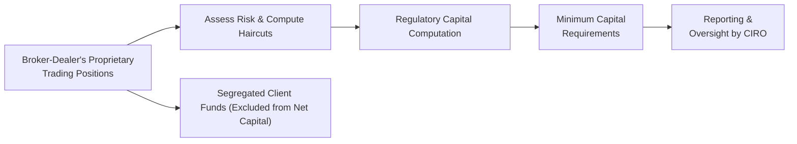

## 23.5 Capital Requirements for Firm and Market Maker Accounts

It’s funny, you know, but the very first time I heard about capital requirements, I thought it sounded like a super-strict teacher reminding us to keep our homework neat and tidy or suffer the consequences. I was working at a small brokerage firm back then, and we had to ensure that our books were always in line with the regulator’s demands. If not, well, let’s just say it would have been the corporate equivalent of a very long time-out.

Yet these requirements are absolutely essential for preserving market integrity and protecting clients. Looking back, I realize how capital requirements play a massive role in keeping trades flowing smoothly. Everyone from retail investors to major pension plans relies on the stability of regulated market participants. So let’s explore why firms—and especially market makers—need to carry sufficient capital, how these requirements are calculated, and what you need to know to ensure compliance in the Canadian derivatives market (with some tidbits about global frameworks, too).

## Why Capital Requirements Matter

The entire concept of capital requirements revolves around one big question: “Does your firm have enough resources to meet all of its obligations, even if the market goes haywire?” This question may feel theoretical until you live through a market crash or a sudden, unexpected surge in volatility that pushes some broker-dealers to the breaking point.

• It’s all about resilience: By holding a certain minimum net capital, dealers can sustain losses from proprietary positions and still remain solvent.  
• It’s about trust: Investors band together in markets where participants (especially market makers) have the financial muscle to weather a storm without putting client assets or the broader system at risk.  
• It’s about regulatory compliance: CIRO, Canada’s new self-regulatory organization (SRO), sets out specific rules on how much capital a member must hold. Violating those rules can trigger fines, suspension, or even losing your registration.  

Sooner or later, if you’re dealing with derivatives, you’ll find yourself on the front lines of capital adequacy. Whether you’re part of an established firm or a startup hedge fund, you cannot ignore it. Let’s walk through the fundamentals.

## Key Elements of Firm-Level Regulatory Capital

Firms registered with CIRO must maintain capital in accordance with Financial and Operations Rules—basically the blueprint for how to measure net capital and ensure adequate buffers. The main building blocks typically include:

• Shareholder Equity or Core Capital: This is like your rainy-day fund. It comprises paid-up capital, retained earnings, and certain additional paid-in capital (subject to adjustments).  
• Subordinated Loans (in some cases): Under strict conditions, a firm can classify subordinated debt as part of regulatory capital if it’s structured properly and meets formal agreements recognized by CIRO.  
• Deductions for Illiquid/High-Risk Assets: If a firm holds illiquid assets or certain “risky” categories, regulators will require a reduction in the capital count. You might hear these referred to as “haircuts.” Basically, if you have a security that’s considered volatile (like junior mining stocks or penny shares), you can’t count 100% of its market value for capital requirement calculations.  
• Segregated or “Held in Trust” Client Funds: These aren’t the firm’s resources to tap for proprietary trades. Regulators will exclude or treat them as separate for net capital.  

A helpful way to see some of these flows is through a simplified diagram:

In this flowchart, the firm’s proprietary trading positions get evaluated through risk assessment and haircut calculations. Then the final net amount is fed into a capital computation formula. The result is compared against regulatory thresholds set by CIRO. Meanwhile, client funds remain off-limits for net capital calculations, ensuring clients' assets are protected.

## Capital Requirements for Market Makers

Market makers are an especially fun bunch! They stand ready to buy and sell securities (or derivatives) at a moment’s notice, posting continuous bid-and-ask quotes. Because they’re carrying that extra level of responsibility—ultimately to keep the trading environment liquid—CIRO demands an additional layer of capital or more stringent capital buffers.

### Why Market Makers Need More Capital

• Larger Positions: Market makers often hold bigger inventories of underlying securities and derivatives, simply because they have to maintain active quotes.  
• Rapidly Shifting Exposures: A market maker’s book can move quickly, especially in volatile markets, leading to substantial changes in potential risk (and thus capital needs).  
• Potential for High-Frequency Trading (HFT): While not all market makers are HFT shops, many use algorithms to place quotes at lightning speed. One glitch in the code could lead to massive unintended positions. So regulators want to ensure you’ve got the capital to handle those “oops” moments.  

In Canada, the Bourse de Montréal has Market Maker Programs that spell out obligations and privileges. They typically state the minimum time/quantity that a market maker must post quotes and also describe capital or net worth thresholds required to participate. If a firm can’t meet those obligations, it risks losing its market-making status and may face stiff regulatory consequences.

## The Calculation: Putting It All Together

So how do you figure out a firm’s capital requirement? Let’s go step by step in a simplified approach (the real thing can be more complex, but this sets the stage):

1. Start with Shareholder Equity: This includes retained earnings, common shares, and any other capital recognized by regulators.  
2. Add/Subtract Adjustments: Incorporate subordinated debt (if recognized), intangible assets (usually subtracted), and other line items governed by CIRO’s rules.  
3. Compute Risk-Weighted Assets (RWAs): For each asset (e.g., equity securities, derivative exposures), apply a “haircut” based on the risk classification. A highly illiquid stock might face a steep haircut, meaning you can only count a fraction of its value.  
4. Factor in Proprietary Positions and Potential Exposures: If your firm trades huge volumes of futures, options, or other derivatives, you apply standardized or internal models (depending on CIRO’s approval) to estimate the margin or capital you need to set aside for those positions.  
5. Arrive at Net Capital: Net Capital = (Eligible Capital) – (Risk Charges + Other Deductions).  

Where does the market maker’s additional requirement fit in? Usually, they must hold some buffer beyond standard net capital. The exact figure depends on the complexity of operations and the obligations they sign up for under the Bourse’s market-making program. In other words, market makers often face a “higher bar” because they’re presumed to carry bigger and more dynamic positions.

## Real-World Examples and Case Studies

I recall a scenario a few years ago at a proprietary trading firm. We had one desk that specialized in index options on the S&P/TSX 60. During a surprise interest rate announcement, the implied volatility spiked, and the premium on both calls and puts skyrocketed. Our firm’s risk models signaled that the desk’s net capital usage would jump significantly within a single trading day. We had to swiftly move capital from other desks—ones that were less active at that moment—to ensure we maintained compliance with the SRO minimum.

The speed at which exposure changed was eye-opening. One moment, we were well within comfortable capital limits; the next moment, we were scrambling to file an intraday capital update with the regulator. This taught me that capital adequacy is not a one-and-done check; it’s a living, breathing requirement that can fluctuate by the minute, especially for high-volume or high-volatility trading desks.

## Maintaining Ongoing Compliance

Keeping on top of capital requirements isn’t just about an annual check-in or a monthly statement; it’s a continuous process. CIRO mandates periodic (often daily, weekly, or monthly) capital reports, depending on your firm’s trading volume and risk level.

### Key Filings and Audits

• Daily Capital Monitoring: Many broker-dealers institute daily “flash” reports to track net capital usage in near real-time, especially if they handle large proprietary or client trades.  
• Monthly Regulatory Filings: You’ll typically file something akin to a risk-adjusted capital schedule that outlines your current positions, haircuts, and net capital.  
• Annual Audits: Auditors (internal or external) verify capital calculations, ensuring nothing was improperly categorized or overlooked. They also check if the firm’s risk management processes align with regulatory guidelines.  
• Financial and Operations Compliance Reviews: CIRO can conduct spot-checks or routine exams where they scrutinize your capital calculations, ledger entries, and risk data.  

These measures help detect shortfalls early. If your capital dips below the required threshold, you may face forced liquidation of proprietary positions or restrictions on your trading until you shore up capital levels.

## Managing Liquidity Risk

Closely tied to capital adequacy is the concept of liquidity risk. A firm might have a high “paper” value of capital but hold it in extremely illiquid assets that can’t be sold quickly in a crisis. Canadian regulations, influenced by global frameworks like the Basel Committee on Banking Supervision, emphasize that capital must be able to absorb losses in both normal and stressed market conditions.

That’s why CIRO might impose higher capital charges for certain illiquid securities or lesser-known derivative instruments. If you can’t easily convert them to cash, you’re effectively tying up your capital in assets that may not help when the market is in meltdown mode.

## The Global Context: Basel and Beyond

Although Basel regulations predominantly apply to banks, the underlying philosophy of robust capital and liquidity standards has influenced the securities industry worldwide. For instance, you’ll see parallels in how systemically important financial institutions must maintain capital well above minimum thresholds to reduce the probability of catastrophic failure.

In the derivatives space, global regulatory bodies like IOSCO (International Organization of Securities Commissions) also publish guidelines on intermediary and clearinghouse liquidity. Even though CIRO’s rules are adapted for Canada’s markets, the broader global push for stronger capital standards after 2008’s financial crisis resonates here.

## Best Practices for Market Participants

• Keep Capital Buffers Above Minimum Thresholds: Don’t aim for the bare minimum. Market volatility can push you over the edge quickly. A comfortable buffer can save your firm from last-minute fire drills or forced position liquidations.  
• Centralize Your Risk Monitoring: Use integrated software that tracks your exposures across all desks or business lines in real time. This is especially crucial for large dealers or active market makers.  
• Stress Testing: Regular scenario analysis—like big interest rate changes or huge index moves—helps project how your net capital might shift.  
• Review Collateral Arrangements: If you have margin or collateral held at a clearing firm, keep an eye on potential changes in margin calls. These can affect your available capital in ways you might not anticipate.  
• Ongoing Training: Educate staff on capital adequacy. From the CFO to risk managers to the trading desk, everyone should understand the basics of net capital, haircuts, and regulatory obligations.  

## Potential Pitfalls and Lessons Learned

- Overconfidence in Low Volatility Environments: Periods of stability can lull firms into complacency. Don’t forget that volatility can snap back.  
- Complex Derivatives: Exotic or lightly traded products might carry hidden liquidity or valuation risks. Regulators often require bigger haircuts for these instruments, which can shrink your net capital more than you expect.  
- Neglecting Intraday Monitoring: If you only check your capital at the end of the day, you could face a shortfall during busy hours.  
- Underestimating Operational Risk: Capital adequacy isn’t just about market risk. If your systems go down or you have a manual error in trade settlement, you might face fines or settlement discrepancies that eat into capital.  

## Personal Reflections

I still remember the adrenaline spike I felt when a major position in metals futures started going haywire one day, and we realized our real-time margin system was lagging. It turned out we inadvertently doubled our short position because of a software glitch. My heart sank as we tried to square everything up in a fast-moving market. That fiasco hammered home just how quickly capital usage can spiral if your operational processes falter.

At the same time, these capital requirements, though they might feel cumbersome at times (hello, never-ending paperwork!), do protect the markets from meltdown. They’re like seatbelts: a bit annoying to put on, but a real life-saver when chaos hits.

## Tools and Resources

1. CIRO’s Financial and Operations Rules:  
   Access these official guidelines directly at [https://www.ciro.ca](https://www.ciro.ca). They outline capital requirements, haircuts, reporting timelines, and more.

2. Bourse de Montréal’s Market Maker Programs:  
   Check out the Bourse’s official site for information on how market makers are selected and what capital obligations they face to maintain liquidity.  

3. Basel Committee on Banking Supervision Publications:  
   Though bank-focused, their documents like “Basel III: Finalising Post-Crisis Reforms” offer universal insights on risk management and capital adequacy.  

4. “Derivative Markets and Risk Management” by Robert Lynch:  
   A great resource for comparing global derivatives frameworks and gleaning best practices for risk measurement.  

5. Open-Source Financial Tools (e.g., QuantLib, RiskAPI wrappers):  
   These can help smaller firms build or prototype risk models without having to reinvent the wheel.  

## Encouragement to Keep Learning

Capital requirements may sound overwhelming, but the underlying principle is straightforward: you need enough salted away to handle big market moves without toppling over. Whether you’re a small boutique or a large market-making operation, staying on top of these rules is a critical part of playing the long game in the derivatives space.

And hey, next time you feel bogged down by capital adequacy calculations, try imagining them as your safety net doing a massive favor—protecting your clients, your firm, and the integrity of the whole trading ecosystem.

---

## Sample Exam Questions: Capital Requirements for Firm and Market Maker Accounts



### Which of the following best describes the primary purpose of capital requirements for a broker-dealer in derivatives markets?

- [ ] To maximize profit through proprietary positions.
- [x] To ensure the firm can meet obligations and absorb potential losses.
- [ ] To limit the trading volume of retail clients.
- [ ] To maintain a flat net exposure to all markets.

> **Explanation:** Capital requirements aim to provide a safety cushion so the firm can handle losses without jeopardizing client funds or market stability.

### What is one of the main reasons that market makers often face higher capital requirements?

- [ ] They generally provide fewer quotes.
- [ ] They do not hold proprietary positions.
- [ ] They only trade equities.
- [x] They frequently carry larger and more dynamic inventories of securities.

> **Explanation:** Because market makers must provide liquidity at all times, they often hold larger positions, thus facing higher potential risk and needing more capital.

### In a simplified capital calculation, “haircuts” are best described as:

- [ ] Special interest payments owed to regulators.
- [ ] Excess earnings retained by the firm.
- [x] Reductions in asset value based on risk or liquidity concerns.
- [ ] Tax deductions available when trading options.

> **Explanation:** Regulators apply “haircuts” to reflect the uncertainty or volatility of certain securities in a firm’s portfolio, reducing their allowable value for capital calculations.

### Which of the following statements about segregated client funds is correct?

- [ ] Segregated funds are included in the firm’s net capital calculation.
- [x] Segregated funds must be excluded from the firm’s net capital.
- [ ] Segregated funds are only for proprietary trading activities.
- [ ] Segregated funds can be used to pay firm operating expenses.

> **Explanation:** By definition, segregated client funds cannot be drawn upon by the firm for proprietary exposures and must remain separate from its net capital formulations.

### How does volatility impact net capital requirements intraday?

- [x] Volatility can significantly increase required risk-based capital.
- [ ] Volatility lowers the capital needed for short positions.
- [x] Volatility may force real-time capital reallocation within a firm.
- [ ] Volatility is irrelevant as long as trades settle in T+2.

> **Explanation:** Spikes in volatility can suddenly inflate margin or capital requirements. If risk exposure changes quickly, the firm might need to shift capital or reduce positions in real time.

### Which regulatory body in Canada sets the financial and operations rules for broker-dealers, including capital requirements?

- [ ] The Federal Reserve
- [ ] The Office of the Superintendent of Financial Institutions (OSFI)
- [ ] The Canada Revenue Agency (CRA)
- [x] The Canadian Investment Regulatory Organization (CIRO)

> **Explanation:** CIRO establishes and enforces capital rules that were historically set by IIROC and the MFDA but are now combined into a single SRO structure.

### Which statement about liquidity risk and capital adequacy is most accurate?

- [x] A firm with illiquid assets might struggle to raise cash quickly, increasing its risk of breaching capital requirements.
- [ ] Illiquid assets are always more valuable for capital calculations.
- [x] Liquidity risk is often addressed by applying stricter haircuts to less liquid securities.
- [ ] Capital adequacy and liquidity risk management are unrelated.

> **Explanation:** Even if a firm holds capital on paper, if it’s locked in illiquid assets, it can’t convert them to cash easily during stress. Liquidity risk is therefore a key concern in capital adequacy.

### Which of the following is NOT typically part of the firm’s net capital calculation?

- [ ] Subordinated loans approved by the regulator.
- [ ] Retained earnings adjusted for prior-year losses.
- [x] Cash contributions made by individual clients into their personal trading accounts.
- [ ] Deductions for intangible assets like goodwill.

> **Explanation:** Client cash in segregated accounts belongs to the clients, not the firm, so it’s excluded from the firm’s regulatory net capital base.

### What is a recommended best practice in managing capital requirements?

- [x] Maintaining a capital buffer above the minimal required threshold to handle sudden market moves.
- [ ] Ignoring capital usage during intraday volatility.
- [ ] Relying solely on historical data to predict future capital needs.
- [ ] Defining capital requirements based on the least volatile instrument in the portfolio.

> **Explanation:** Having an extra buffer in place helps reduce the likelihood of a capital shortfall, especially during rapid market changes.

### True or False: Basel Committee guidelines are never relevant for broker-dealers in Canada.

- [ ] True
- [x] False

> **Explanation:** While Basel regulations directly apply to banks, their concept of capital adequacy and liquidity risk management influences securities regulators worldwide, including CIRO.


