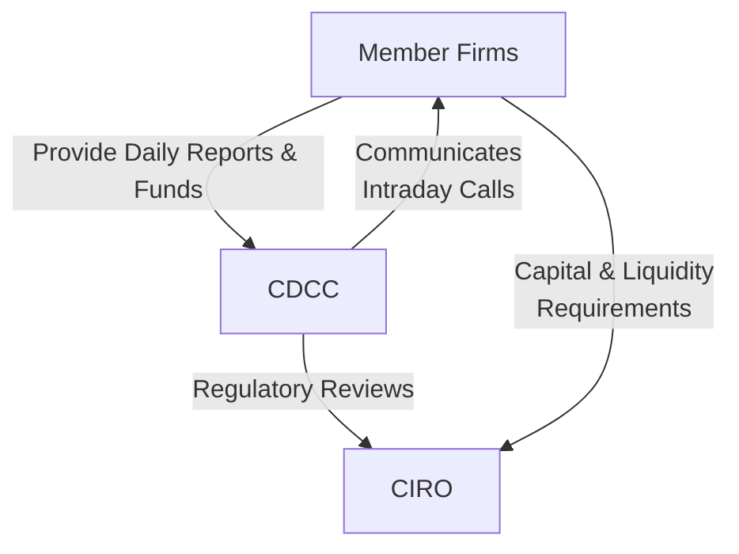

## 23.6 Member Firm Clearing Deposit Requirements at the Clearing Corporation

Sometimes, when people talk about margin and clearing deposits, it can feel like we’re wading through a swamp. You’ve got margin for clients on one side, clearing deposits on the other, and a whole cast of acronyms swirling around. I remember way back in my early days at a clearing firm: practically every conversation started or ended with a deposit call from our clearinghouse. You’d see your manager raise an eyebrow and say, “Uh, we got another intraday call—looks like we need more funds to cover that big open position.” It was certainly a crash course in how clearing members maintain their responsibilities with the Canadian Derivatives Clearing Corporation (CDCC). Anyway, let’s break this topic down step by step in a more relaxed way—no complicated jargon overload, I promise.

––––––––––––––––––––––––

### Why Clearing Deposits Exist

Clearing corporations (such as the CDCC in Canada) serve as the intermediary for derivatives transactions, stepping in to guarantee that trades are settled even if a buyer or seller defaults. They’re basically the safety net ensuring that the financial system doesn’t crumble when a firm runs into trouble. And, you know, trouble occasionally shows up uninvited—like that mysterious cousin who breezes into your family gathering without calling first.

For the CDCC to manage this default risk, it requires each member firm (often called a clearing member) to deposit a specific amount of funds (or acceptable securities) into a clearing fund. This deposit is absolutely separate from whatever margin a firm requires from its individual clients. Think of the clearing deposit as a communal safety cushion. When one member hits a rough patch, the clearinghouse can access these mutualized funds to manage the failing member’s obligations, protecting both the broader market and the other clearing members as well.

––––––––––––––––––––––––

### Distinction from Client Margin

You might be wondering: “Hang on. If clients have margins to protect the house already, why do we need a second layer of protection?” Well, margin requirements handle the possibility of your specific clients not meeting their obligations—so those funds effectively mitigate immediate trading risk at the client and firm level. The clearing deposit, on the other hand, is a bigger umbrella for the entire clearing system. It’s there for scenarios where, say, the firm itself fails or an extreme wave of defaults hits the entire marketplace.

• Client Margin → Shields your firm from your clients’ potential defaults.  
• Clearing Deposit → Shields the clearinghouse (and indeed the marketplace) from your firm’s potential default and other systemic shocks.

If you’ve ever played community sports, maybe you’ve come across a collective equipment deposit. Each team ponying up some cash in case someone breaks more than their fair share of gear. The clearing deposit is a lot like that, but in a financial context with more zeros at the end of the figures.

––––––––––––––––––––––––

### Role of the CDCC in Mitigating Risk

Before diving into how the numbers get crunched, it’s worth painting a picture of the clearinghouse’s daily job. The Canadian Derivatives Clearing Corporation (CDCC) acts as the middle entity in a derivatives transaction—when party A buys (or sells) a futures or options contract from party B, the CDCC steps in to become the buyer to party B and the seller to party A. By becoming the “bookend” on both sides of the trade, the CDCC is exposed to default risk from each member.

• The CDCC collects margins from members to cover short-term market movements of open derivatives positions.  
• The CDCC also collects clearing deposits from members to protect the entire system if a default escalates beyond an individual’s margin shortfall.  

In Canada, these mechanisms are subject to oversight by regulatory bodies such as the Canadian Investment Regulatory Organization (CIRO), formed out of the historical MFDA/IIROC merger. CIRO monitors the capital adequacy and operational efficiency of clearing firms, meaning each clearing member has to show they can handle their share of open positions and system obligations.  

A quick reference: The CDCC website (<https://www.cdcc.ca/>) outlines membership requirements, including capital thresholds and clearing fund contributions, in detail.

––––––––––––––––––––––––

### How Clearing Deposits are Determined

This part is where folks’ eyes often start to glaze over, but hang tight because it’s more straightforward than it might seem. Each clearing member’s deposit requirement is generally calculated based on these three factors:

1. Trading Volume: If your firm trades a lot of derivatives (whether for proprietary desks or on behalf of clients), there’s a higher chance something could go off the rails.  
2. Open Positions: The bigger your open interest, the larger your potential exposure if the market turns against you.  
3. Historical Exposure: Past activity, volatility, and the firm’s worst-case scenarios, are used to gauge how your future might shape up.  

The CDCC typically rolls these into a formula that yields a certain deposit requirement with both a base level and a variable portion. The base level might be an industry-wide minimum for all members, and the variable portion scales up or down with your firm’s risk metrics.

––––––––––––––––––––––––

### Dynamic Adjustments and Intraday Calls

Here’s another essential piece: the clearing deposit requirement isn’t chiseled in stone. If your open positions balloon suddenly, or if the market takes a wild turn, the clearinghouse can revise the deposit requirement… sometimes within the same trading day. That’s called an intraday margin call or deposit call, and it basically says:

> “Hey, your risk has surged. We need more funds on deposit to keep the clearing system safe.”

Plenty of us have experienced that pinch. I recall an instance—well, maybe it’s best to keep the details light—but let’s just say that a firm forgot to close out a big contract that hedged a large commodity position. Suddenly the market soared, and the clearinghouse flagged the firm’s net exposure as triple from the day before. The CDCC slapped us with an intraday call, giving us just hours to deposit more funds or scale back the position. Everything ended up fine, but it was a prime lesson in how clearing deposit calculations can shift on a dime.

––––––––––––––––––––––––

### A Visual Overview

To illustrate how funds flow from member firms into the clearing deposit pool—and how the clearinghouse might tap into those funds in a stress event—check out the following diagram:

• “Member Firm” (A) contributes to the “Clearing Deposit Contribution” (B).  
• The deposit is pooled at the “CDCC Clearing Fund” (C).  
• If any single clearing member faces a default, the clearinghouse can draw upon the “Clearing Fund” (D).  
• Ultimately, if the default is large, “Losses Mutualized” (A2) means all member firms bear the communal risk.

This mutualization approach ensures one firm’s meltdown doesn’t blow up the entire system—but also means that if your fellow clearing member does something catastrophically risky, you might feel it indirectly.

––––––––––––––––––––––––

### Stress Scenarios and Additional Deposits

In times of high volatility, the CDCC might impose extra overlay requirements. For example, let’s say major price swings are happening in the market (like we occasionally witnessed during wild commodity cycles or sudden interest rate announcements). The clearinghouse can implement a blanket increase in deposit levels or revise the parameters in their calculation model, leading to additional deposit calls for every member.  

It’s not exactly fun for risk managers—coming up with large sums of cash or acceptable securities quickly can make for a stressful day. However, having strong liquidity reserves and pre-arranged lines of credit can ensure that the clearing member can respond promptly. If a firm fails to meet these deposit calls, they risk losing their clearing privileges, which is basically a showstopper for their entire derivatives business.

––––––––––––––––––––––––

### Commonly Accepted Forms of Deposit

While the name “clearing deposit” implies cash, it’s often permissible to pledge other instruments (like short-term government securities, treasury bills, or certain highly rated corporate bonds) as collateral. The idea is that these instruments can quickly be converted into cash if needed. However, the CDCC imposes strict guidelines on which securities are acceptable, possibly applying “haircuts” to their valuation to account for potential price fluctuations.

So, if you pledge government bonds worth CAD 2,000,000, the clearinghouse might only count them as CAD 1,900,000 in deposit coverage to cushion themselves. This is all spelled out in the membership guidelines, so no big surprises there—just keep in mind that your friendly treasury folks might have to shuffle the firm’s securities portfolio to meet these requirements.

––––––––––––––––––––––––

### Example: Hypothetical Clearing Deposit Calculation

Let’s imagine a fictional clearing member, Maple Leaf Investments (MLI). Over the past quarter, MLI consistently held around 10,000 open futures contracts on the Montreal Exchange—a moderate level. Historically, MLI’s stress exposure (based on worst-case analysis) stands at around CAD 8 million. Meanwhile, peer firms with a similar profile maintain deposits around CAD 9–11 million.

One day, MLI decides to expand into index options, doubling its book of derivatives overnight. The CDCC then recalculates:

1. The base deposit for membership may be CAD 5 million.  
2. The variable deposit portion is pegged to MLI’s total open exposure, plus a buffer for expected volatility. Let’s say that’s CAD 6.5 million.  
3. After factoring in correlation offsets (some positions might offset risk in others), CDCC sets MLI’s total deposit to CAD 10 million.  

Since MLI already posted CAD 7 million, they get an additional deposit call for CAD 3 million. If MLI fails to post it timely, they risk penalties or even a suspended clearing relationship.

––––––––––––––––––––––––

### Best Practices for Managing Clearing Deposits

1. Maintain Liquid Reserves: Always have immediate access to cash or liquid assets that can be readily pledged in case of an intraday call.  
2. Monitor Intraday Exposures: Use advanced risk analytics (there are open-source tools, but also commercial solutions) to track your firm’s real-time positions. The second you see your net exposures jump, you can proactively prepare more deposit funds.  
3. Frequent Stress Testing: Simulate extreme market shocks on your portfolio. Are you close to hitting the deposit threshold that might cause a call? If so, have a game plan.  
4. Diversify Collateral: Don’t rely solely on government bonds or T-bills. Having a range of acceptable securities can help navigate market fluctuations in bond values.  
5. Communication: Keep an open channel with the clearinghouse. If you anticipate a big trade or a massive shift in your positions, a heads-up can go a long way.  

––––––––––––––––––––––––

### Potential Pitfalls

• Overconcentration in Illiquid Collateral: If the clearinghouse imposes larger haircuts on certain illiquid securities, you might scramble last minute to make up the shortfall in deposit valuation.  
• Underestimating Market Volatility: If you only look backward at calm market data, you could be in for a shock when markets spike, leading to sudden deposit calls.  
• Relying on Credit Lines Alone: If your entire industry is under strain, your lender might be less willing to extend short-term funds. It’s wise to hold some accessible capital in a rainy-day fund.  
• Not Updating Internal Risk Models: Firms that keep stale risk parameters or outdated data can be blindsided when the clearinghouse’s updated calculations differ drastically from their own.  

––––––––––––––––––––––––

### Regulatory and Compliance Perspectives

As of 2025, CIRO (<https://www.ciro.ca>) is the self-regulatory organization overseeing both investment dealers and mutual fund dealers in Canada, along with ensuring market integrity. It’s important to know that:

• Member firms must comply with capital adequacy rules that go hand in hand with deposit requirements.  
• CIRO sets out guidelines and compliance bulletins that highlight how firms should interpret changes in clearing deposit policy.  
• The CDCC is under constant review by regulators, ensuring that its deposit methodologies stay robust and up-to-date with international best practices.  

On a global note, the International Swaps and Derivatives Association (ISDA) has established frameworks for OTC derivatives clearing that parallel the exchange-traded clearing deposit concepts. Though this chapter focuses on listed derivatives clearing, many risk principles are consistent across both spheres (OTC and exchange-traded).

––––––––––––––––––––––––

### Governance and Reporting

Clearing members typically have internal committees that handle capital adequacy, liquidity, and risk management. These committees:

• Approve the daily or weekly deposit levels and any intraday changes.  
• Ensure compliance with the clearinghouse’s ever-evolving guidelines.  
• Oversee the collation and submission of periodic financial reports to the regulators.  

A helpful mental image might be a multi-layered fortress: the outer wall is your firm’s own capital controls, the second layer is your client margin policy, and the final layer is the clearing deposit. There’s no single point of failure. If intraday deposit calls start rolling in, these committees are the folks managing the response—ensuring that money moves around quickly and everything remains squeaky-clean from a compliance perspective.

––––––––––––––––––––––––

### Real-World Stress Events

You might recall certain historical market events—like the big commodity price meltdown or sudden interest-rate jolts—that triggered a spike in derivatives volatility. During those times, the clearing fund was in the spotlight. The clearinghouse typically:

• Required members to top up their deposits with intraday calls.  
• Convened “crisis calls” with clearing members to provide market updates and coordinate responses.  
• Escalated margin rates to alleviate the immediate risk from open positions.

Fortunately, thanks to robust clearing deposit requirements, the Canadian market’s history is mostly positive in terms of containing default fallout. This mutualized risk approach has proven time and again to hold the system together during big storms. To me, that’s a testament to how well these frameworks actually work when push comes to shove, even if they can be burdensome on a day-to-day basis.

––––––––––––––––––––––––

### Using Technology for Transparency

Technology now allows near real-time oversight of deposit adequacy. Many clearing members use software that integrates:

• Intraday position tracking.  
• Automated “risk bucket” calculations that replicate or approximate CDCC’s deposit formula.  
• Early warning triggers if deposit coverage is drifting under a certain threshold.  

In some cases, members adopt open-source or hybrid solutions to keep pace with evolving data standards. This can help them remain nimble. If the clearinghouse changes a parameter, a quick software update ensures your firm’s risk engine stays aligned.

––––––––––––––––––––––––

### Diagrams to Illustrate Key Relationships

Let’s consider a high-level view of the interplay among Member Firms, the CDCC, and CIRO oversight:

In this simplified diagram:

• Member Firms (A) not only lodge funds with the CDCC (B) but also get instructions from it about deposit changes.  
• Because CIRO (C) oversees both the marketplace and the individual member firms’ compliance, it checks that everyone is playing by the rules. The CDCC similarly interacts with CIRO to ensure its clearing fund rules are robust and valid.

––––––––––––––––––––––––

### Looking Forward

Derivative markets continually evolve—especially with the growth of environmental, social, and governance (ESG) products, carbon credits, or even cryptocurrency-linked derivatives. As new products come online, the clearing deposit framework also adapts. After all, brand-new markets can carry strange volatility patterns. We might see the clearinghouse adjusting deposit requirements more frequently in the future as it navigates these uncharted waters.

Additionally, technology-driven changes—like algorithmic or high-frequency trading—could ramp up intraday risk. That means deposit calculations could become more dynamic, with near-real-time updates. It’s not inconceivable that we might see micro deposit calls in the future, though that’s speculation for now. The main takeaway: be prepared for more frequent recalibrations if your firm deals heavily in short-term or high-velocity trading strategies.

––––––––––––––––––––––––

### Final Thoughts

In essence, the clearing deposit is both a shield and a community pool that fosters confidence in a marketplace where default risk can’t be fully eradicated but can certainly be contained. By understanding how it works—why it’s separate from client margin, how it’s calculated and adjusted, and what might happen in volatile times—firms can be better prepared to meet these obligations without panic.  

Remember, if you ever find yourself on the receiving end of an intraday deposit call, the worst thing you can do is procrastinate. Pick up the phone, talk to your risk committee, and mobilize your resources ASAP. Because, trust me, the clearinghouse clock is always ticking.

––––––––––––––––––––––––

### Additional Resources

• Canadian Derivatives Clearing Corporation (CDCC): <https://www.cdcc.ca/>  
• Canadian Investment Regulatory Organization (CIRO): <https://www.ciro.ca>  
• International Swaps and Derivatives Association (ISDA): <https://www.isda.org/>  
• Open-Source Risk Engine (ORE): <https://www.opensourcerisk.org/> – a resource for risk modeling and analytics.  

These sources provide comprehensive details on membership obligations, best practices, and the technicalities of clearing deposit calculations. If you’re keen on exploring global parallels, skim through ISDA’s guidelines for aspects of OTC derivatives clearing and see how they resonate with what we’ve covered in this chapter.

––––––––––––––––––––––––

## Sample Exam Questions: Member Firm Clearing Deposit Requirements



### A clearing deposit with the CDCC primarily serves to:
- [ ] Provide liquidity to clients on a daily basis.
- [x] Protect against a member firm’s potential default and mutualize risk.
- [ ] Pay brokerage commissions on new trades.
- [ ] Replace client margin requirements with a single deposit.

> **Explanation:** The clearing deposit is intended to protect the clearinghouse and all its members from potential default risk, essentially distributing that risk among all participants.

### In which scenario might the clearinghouse impose an intraday deposit call?
- [ ] When market volatility is extremely low.
- [ ] When the clearing fund is in surplus.
- [ ] When the firm closes out large positions.
- [x] When a member’s open positions increase its risk exposure significantly during the trading day.

> **Explanation:** Clearinghouses monitor intraday exposures and can require additional deposits if a firm’s net risk spikes beyond certain thresholds.

### Which statement best describes the difference between client margin and the clearing deposit?
- [x] Client margin protects the firm against client defaults, while the clearing deposit protects the entire clearing system from a firm’s potential default.
- [ ] Client margin and clearing deposit both serve the same function and are interchangeable.
- [ ] Client margin is never used by the clearinghouse.
- [ ] The clearing deposit directly offsets individual client positions.

> **Explanation:** Client margin is specifically for client-level exposures, whereas the clearing deposit is a communal safety net for the clearinghouse as a whole.

### What is a primary factor in calculating a firm’s clearing deposit requirement?
- [ ] The credit rating of the firm’s rival counterparties.
- [ ] The total number of employees at the firm.
- [x] The firm’s trading volume and open positions.
- [ ] The regulatory fees paid by the firm.

> **Explanation:** Clearing deposit requirements reflect the firm’s trading volume, open positions, and historical exposure.

### If a member firm fails to meet its clearing deposit call, the clearinghouse may:
- [x] Restrict or suspend the firm’s clearing privileges.
- [ ] Provide additional grace days until the next settlement date.
- [ ] Reduce the minimum deposit requirement.
- [ ] Dismiss the default without consequence.

> **Explanation:** Failure to meet deposit requirements undermines the safety of the entire system, so the clearinghouse can bar the firm from trading or enforce other disciplinary actions.

### Which of the following might be accepted as collateral for a clearing deposit?
- [x] Government bonds subject to a haircut.
- [ ] Unsecured promissory notes from the member’s affiliate.
- [ ] Shares in highly speculative penny stocks.
- [ ] None of the above.

> **Explanation:** Clearing members typically can post government bonds or similarly liquid, high-quality securities with the clearing corporation, subject to valuation haircuts.

### What best characterizes “mutualized funds” in the context of clearing deposits?
- [x] A pool of funds contributed by all clearing members to absorb losses in event of a default.
- [ ] Funds invested in money market instruments for personal gain.
- [ ] Special government subsidies for clearinghouses.
- [ ] Restricted accounts reserved solely for client refunds.

> **Explanation:** Mutualized funds come from all clearing members, enabling collective sharing of default risk for the stability of the overall marketplace.

### A firm’s historical exposure is considered in the clearing deposit calculation to:
- [ ] Minimize overhead costs for the clearinghouse.
- [x] Gauge potential losses under worst-case market conditions.
- [ ] Determine the discount rate for T-bills.
- [ ] Estimate the daily margin calls for the clearinghouse.

> **Explanation:** Past performance and stress scenarios help the clearinghouse assess whether a firm’s current positions could lead to large defaults in extreme markets.

### How do intraday margin or deposit calls benefit the market?
- [ ] They increase overall settlement time.
- [x] They help ensure adequate collateral is on hand as exposures shift intraday.
- [ ] They eliminate the need for regulatory oversight.
- [ ] They discourage trading by adding extra complexity.

> **Explanation:** Intraday calls allow the clearinghouse to react swiftly to real-time market volatility and firm exposures, mitigating default risk.

### True or False: A clearing deposit is fundamentally the same as a client’s margin requirement.
- [ ] True
- [x] False

> **Explanation:** A clearing deposit is held at the clearinghouse to guard against a firm’s default risk on a systemic level, whereas margin specifically covers open positions of individual clients at a more granular level.


