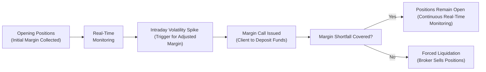

## 23.7 Updates in Margin Rules Post-Pandemic Volatility

It’s probably fair to say that the dramatic price swings during the early days of the COVID-19 pandemic took many of us by surprise. If you were trading futures or options in March 2020—or simply keeping an eye on your portfolio—maybe you remember that sinking feeling as equity markets tumbled, crude oil futures dove into negative territory (like, who expected negative prices?), and margin calls started flying around early in the morning. I recall a friend texting me at 7 a.m., saying, “Um...what does it mean my margin just doubled overnight?!” Suddenly, the rules we’d always taken for granted about margin requirements and risk coverage seemed ready to shift beneath our feet.

In the aftermath of all that turmoil, regulators and clearinghouses realized that their existing margin frameworks, though robust, needed some serious updates to keep up with modern markets. The focus was on capturing extreme “tail risk” events—rare but high-impact occurrences that can cause catastrophic losses if we’re not prepared. Because of this new emphasis, margin calls started becoming more dynamic, adjusting in near real time whenever volatility spiked. These changes have left many market participants, both retail and institutional, wondering how to best navigate this new environment. Let’s walk through some of the key developments and what they mean for our day-to-day trading activities.

### Why Did Margin Rules Change So Abruptly?

In a nutshell, there was an urgent need to better reflect risk in margin models. Historically, margin calculations often relied heavily on backward-looking volatility and somewhat static stress scenarios. But as we all witnessed during the pandemic, market moves can be more rapid and severe than many prior models allowed for. Regulators realized that if margin requirements lag market realities by too much, two problems occur:

• Traders and firms may not be holding enough resources to withstand big moves, which raises default risk in the system.  
• Once margins do get raised, the changes tend to be abrupt and “procyclical,” meaning margin requirements can spike just when liquidity is already tight—sometimes exacerbating the market stress.

The Canadian Investor Protection Fund (CIPF) safeguards client assets if a member firm fails, but that’s a last resort. The real preference is that trades remain safe and backed throughout their lifecycle, so the entire clearing system doesn’t get overwhelmed. With risks mounting quickly during uncertain market conditions, the clearinghouses and CIRO (Canada’s current national self-regulatory body overseeing investment dealers, mutual fund dealers, and market integrity) decided to refine margin methodologies to reduce the “lag effect.”

### Tail Risk: The Driving Force Behind Higher Margins

A huge takeaway from 2020 was that rare events—known as “tail risk” events—can happen more often than we’d like to think. Tail risk refers to those outlier market scenarios that lie far outside typical price movements. In healthy times, tail risk might seem like an abstract concept, hidden in the corners of a probability distribution. But when the pandemic struck, it felt like the “far corners” became tomorrow’s reality.

As a result, margin models were updated to factor in both historical extremes and hypothetical market shocks. Instead of just applying a standard volatility measure from, say, the prior 30 days, new approaches now consider multi-year data sets, potential liquidity crunches, cross-asset contagion, and correlated sell-offs. The aim is straightforward: if an event akin to March 2020 (or worse) happens again, the clearinghouse wants to ensure it’s not caught off guard. This shift helps protect the broader financial system but also forces all of us—brokerage clients, proprietary traders, and major institutions—to hold more collateral than we might have in the past.

### Real-Time Adjustments and Procyclicality

A noteworthy change arising from these new models is the use of more real-time margin adjustments. Before, your margin requirement might be updated once a day—maybe at the close of trading or in the morning before the open. Now, we’re seeing clearinghouses adjust margins intraday if market volatility warrants it. That can mean a quick message from your broker around lunchtime: “Hey, your margin requirement just went up 25%. Please deposit funds by close of business or risk forced liquidation.”

It’s important to point out there’s a potential downside in these real-time adjustments known as “procyclicality.” Procyclicality describes how margin requirements tend to ratchet up in volatile markets, effectively pulling liquidity out of the market at the precise moment participants may be starved for cash. This response can aggravate big sell-offs because traders forced to meet margin calls might sell positions to raise money, thus pushing prices down further and triggering more margin calls. It’s a vicious cycle. The changes introduced after the pandemic are designed to mitigate these effects (for instance, by using more advanced risk metrics that incorporate forward-looking elements), but it’s something market participants must keep in mind. Having a buffer of additional funds can help cushion any sudden margin shocks.

### Stress Testing and Scenario Analysis

Stress testing has become more elaborate in recent years. “Stress testing,” basically, is evaluating how a portfolio might behave under extreme conditions—think the 2008 financial crisis, a sudden cyber-attack on critical trading infrastructure, or a multi-day lockdown scenario reminiscent of 2020. With the post-pandemic updates, these stress tests:

• Include more severe assumptions about volatility spikes, illiquidity, and correlation breakdowns.  
• Are performed more frequently, sometimes on a daily or even intraday basis, depending on the firm.  
• Factor in real-world constraints, such as how quickly positions can be unwound in times of crisis.

The Bourse de Montréal (the main exchange for derivatives in Canada), in its white papers on managing volatility, emphasized that scenario analyses now incorporate even more “worst-case but plausible” outcomes. This means not just 95% or 99% confidence intervals, but also truly extreme events—like if the market drops 15–20% in a single day or if an entire sector shuts down unexpectedly. These thorough checks let clearinghouses and regulators like CIRO decide if margin requirements need to be hiked preemptively.

### Managing Abrupt Margin Calls

So, how do you weather these storms as an individual trader or as an institution? The short answer is to maintain a margin cushion. If you’re already close to using all your margin capacity, an intraday jump can prompt an urgent call for extra cash (or cause your broker to liquidate positions on your behalf). And honestly, that’s never fun to deal with if you’re at your day job or you just stepped away from your screen. Being forced to sell in a fast-falling market can lock in steep losses.

Here are some guidelines to consider:

• Keep Excess Cash or Approved Securities in Your Account: Think of this as your safety net. A bit of unutilized margin capacity can cover abrupt increases.  
• Diversify Your Portfolio: By spreading risk across different sectors or instruments, even if margin rates go up, you might offset potential exposures so you don’t face a huge margin call in one single product.  
• Monitor Volatility Indicators: Keep an eye on the VIX or Canadian volatility indexes. They’re not a crystal ball, but if you see a spike, it might be time to think about raising some cash in case margin requirements follow suit.  
• Coordinate with Your Broker: Proactive communication helps. Some brokers will notify you in advance if they anticipate margin changes based on new margin requirement announcements from clearinghouses.  
• Understand Product-Specific Margins: Different futures, options, or swap contracts have unique margin formulas. Commodity futures might have tighter margin changes if energy markets are particularly volatile. Equity index products might have intraday updates depending on how broad-based the movement is.

### A Glimpse Into Margin Flows

To get a sense of how margin has become more dynamic post-pandemic, check out the simple Mermaid diagram below, illustrating the now faster-paced cycle of margin checks and updates:

In this diagram, you can see that real-time monitoring has become a key part of the margin control process. If your positions are still fine, trading goes on as usual. But if the market spikes and margin shortfalls occur, the system quickly escalates to a margin call scenario. If that call isn’t met, the next step is forced liquidation.

### The Role of Canadian Regulators and CIRO

Post-pandemic, the Canadian Securities Administrators (CSA) issued bulletins emphasizing the need for more robust margin and liquidity management. For up-to-date official releases, you can visit the CSA’s website or check any bulletins referencing pandemic-era reforms. Meanwhile, CIRO (formed by the amalgamation of the old MFDA and IIROC in 2023) is now the main self-regulatory organization that oversees both investment dealers and mutual fund dealers.

CIRO has published notices on exactly how margin policies might be recalibrated during volatile times. You can find these updates on their homepage at https://www.ciro.ca. They often include guidance on how soon margin rates can be raised during market stress, plus clarifications on netting rules for complex option strategies. If you hold spreads or multi-leg positions, these details can mean a big difference in how much margin you’re required to maintain.

### The Bank of Canada’s Research on Procyclical Risk

The Bank of Canada has been studying how margin changes can amplify or mitigate financial shocks. In their papers, accessible at https://www.bankofcanada.ca, they highlight that while higher margins reduce credit risk to clearinghouses, very sharp spikes in margin requirements can deepen a crisis if too many participants must liquidate quickly.

The Bank’s take is that transparent, predictable margin frameworks—where participants know well in advance the triggers and possible sizes of margin calls—can help smooth out that procyclical effect. Yes, margin hikes may be necessary during periods of mounting volatility, but if traders know the thresholds, they can plan. It’s like packing for a trip: if you don’t know how cold it might get, you might just bring a light jacket. But if you know that the temperature can drop quickly, you’ll pack a thicker coat (i.e., you’ll keep extra cash available in your account).

### Institutional and Retail Perspectives

• Institutions: Large banks, pension funds, and hedge funds typically have specialized risk management teams that run daily or even intraday stress tests. They also have direct lines to clearinghouses to gauge upcoming margin changes. Even so, the post-pandemic environment has spurred them to hold extra liquidity buffers—especially if they’re active in highly volatile commodity markets.  
• Retail Clients: Smaller traders often find themselves at a disadvantage simply because they might not have the cutting-edge analytics or staff that big institutions do. However, retail clients can benefit from technology offered by many broker platforms, such as real-time margin calculations. That said, it’s always wise to do your own research and maintain a margin buffer. If you see the volatility index creeping up, consider trimming positions or at least keep track of how close you are to your margin limit.

### Updated Margin Models in Practice

Let’s walk through a hypothetical scenario:

1. Suppose you have a margin account with positions in equity index futures. Historically, the initial margin was around $10,000 for every $200,000 notional exposure (just a simplified example).  
2. Suddenly, geopolitical tensions spike, and the market drops 5% in a day. Volatility surges.  
3. The clearinghouse’s new real-time margin model sees this spike and recalculates your required margin to $15,000. You get a margin call or an overnight notice that you owe an additional $5,000 by tomorrow.  
4. Unprepared, you’re scrambling to wire money from your bank account.  

In the old days, you might have had more time to respond (or maybe the margin wouldn’t have gone up quite so sharply). But with the new rules, the system is more sensitive to these big moves. On the plus side, it means the risk is properly contained within the financial system. On the minus side, you can definitely find yourself in a pinch if you’re not tracking volatility.

### Best Practices for Navigating the New Margin Landscape

1. Plan for the Unexpected: Rare events can occur when you least expect them, so treat your margin with caution.  
2. Keep an Eye on Liquidity: If you’re heavily invested in illiquid instruments, be aware that unwinding positions during stress might be extra costly or slow.  
3. Self-Stress Test: You don’t need fancy software to run a basic scenario analysis. Estimate how your P&L and margin requirements might shift if the underlying moves by 10% or more.  
4. Leverage Hedging Tools: You might consider using certain options strategies to limit downside risk. While these require margin as well, they can help reduce your net exposure.  
5. Communicate with Your Broker or Risk Department: Don’t hesitate to ask for clarifications on how margin is calculated or updated. Some brokers will let you review a margin detail report.  
6. Monitor Regulatory Notices: Keep tabs on announcements from CIRO, Bourse de Montréal, or the CSA. These can signal upcoming changes or expansions in margin requirements.  
7. Understand That Nothing is Set in Stone: Conditions can change fast. Market participants need to be nimble, especially if they deal with leveraged products.  

### Open-Source Tools, Frameworks, and Additional Resources

If you’re a numbers person or love diving into data, there are various open-source tools out there that can help you test and simulate margin scenarios. Platforms like R or Python with financial libraries (e.g., QuantLib) let you approximate clearinghouse margin requirements under different volatility assumptions. Keep in mind these won’t be perfectly accurate (since the actual margin formulas can be proprietary), but they help you get a ballpark idea.

Along with that, you can look into:

• “Pandemic-Era Margin and Liquidity Enhancements,” a bulletin jointly released by the Canadian Securities Administrators (CSA).  
• CIRO’s up-to-date notices and margin bulletins on https://www.ciro.ca (previously IIROC & MFDA, now one entity).  
• Bourse de Montréal white papers on how they handle volatility risk—great for a closer look at local markets.  
• Bank of Canada research on procyclical margin processes, available at https://www.bankofcanada.ca, which can be enlightening for those wanting to understand the theoretical underpinnings of margin policy shifts.  

### Conclusion: Stay Nimble, Stay Prepared

If there’s one lesson the pandemic taught us, it’s that the unthinkable can become reality—and quickly. Margin rules have become more stringent and more sensitive to real-time conditions to ensure the health of the markets. Yes, that can be painful if you’re on the financial hook. But in the bigger picture, it’s meant to reduce systemic risk and prevent market chaos from spiraling out of control.

Regardless of whether you’re a small retail investor dabbling in futures or a seasoned institutional trader managing gigantic portfolios, the core principles remain the same: keep yourself well-informed, anticipate that margin requirements can rise suddenly, and keep some extra money (or margin-eligible assets) on hand. By doing so, you can ride out the waves of volatility instead of being swept away by them.

And hey—maybe next time your friend sends a 7 a.m. text about a margin call, you can calmly say, “Yes, I know. We planned for this.”

---

## Sample Exam Questions: Post-Pandemic Margin Changes and Best Practices



### Which factor primarily drove the update of margin rules after the COVID-19 pandemic?

- [ ] A desire to lower transaction fees for traders
- [ ] The elimination of capital gains taxes in Canada
- [x] The recognition that extreme "tail risk" events can rapidly trigger large losses
- [ ] A surge in investor sentiments toward cryptocurrency

> **Explanation:** The primary driver was the recognition of tail risk events and the market volatility witnessed during COVID-19. Regulators needed to ensure margin requirements matched worst-case losses more effectively.

### What is "procyclicality" in the context of margin requirements?

- [x] The tendency for margin requirements to increase significantly during volatile times, potentially worsening liquidity pressures
- [ ] The gradual decrease of margin requirements to stimulate trading volume
- [ ] The requirement for brokers to cycle through customers’ accounts weekly
- [ ] A strategy for hedging credit risk using lifecycle approaches

> **Explanation:** "Procyclicality" refers to margin requirements surging in sync with market stress, contributing to bigger liquidity squeezes during high volatility.

### Stress testing frameworks for margin requirements now commonly do which of the following?

- [ ] Ignore worst-case scenarios to reduce panic
- [x] Simulate extreme but plausible market conditions for more accurate risk assessment
- [ ] Shift margin calculations to annual reviews only
- [ ] Eliminate intraday margin calls to protect clients

> **Explanation:** Updated stress testing frameworks specifically incorporate extreme market scenarios to ensure realistic coverage for tail risks.

### During high market volatility, one recommended best practice is to:

- [ ] Use no leverage at all
- [ ] Double your positions to average down
- [x] Maintain a margin cushion or excess liquidity
- [ ] Suspend all trading until volatility disappears

> **Explanation:** Holding excess funds or margin capacity in your account helps you handle any sudden margin hikes without being forced into rapid liquidation during volatile times.

### Why do regulators emphasize “real-time” or intraday margin adjustments?

- [x] To align margin requirements more closely with current market conditions and volatility
- [ ] To discourage speculative trading in stable markets
- [ ] To force all traders to liquidate half their positions by midday
- [ ] To reduce the total number of trades in a session

> **Explanation:** Real-time adjustments ensure margin reflects up-to-the-hour risk levels, safeguarding clearinghouses amid abrupt price swings.

### According to post-pandemic guidelines, how do clearinghouses handle margin shortfalls if a client cannot meet an intraday margin call?

- [ ] They frequently waive the shortfall to encourage more trading
- [ ] They immediately refer the case to the Canadian Investor Protection Fund (CIPF)
- [x] They force liquidation of the client’s positions to cover the deficit
- [ ] They apply a penalty interest rate but allow trades to continue

> **Explanation:** If a participant can’t meet a margin call promptly, mandatory liquidation often occurs to cover the shortfall and protect the clearinghouse from potential default risk.

### A key result of more robust margin models is:

- [x] Abrupt and larger margin calls during severe volatility
- [ ] Elimination of risk entirely
- [ ] Lower margin requirements for all asset classes
- [ ] Reduced need for stress testing

> **Explanation:** Because new margin models capture tail risk more effectively, they can trigger bigger or more frequent margin calls in extremely volatile market contexts.

### What is one drawback that arises from increased real-time margin adjustments?

- [ ] Reduced transparency from clearinghouses on risk models
- [x] It can exacerbate market downturns through forced liquidations (procyclicality)
- [ ] The elimination of all leveraged trading
- [ ] The CSA no longer requires risk disclosures

> **Explanation:** When margin calls spike quickly, participants may be forced to liquidate positions en masse in a volatile market, further driving prices down.

### Which organization in Canada replaced both IIROC and the MFDA as the unified self-regulatory body?

- [ ] The Bank of Canada
- [ ] The Canadian Securities Administrators
- [ ] The Alberta Securities Commission
- [x] CIRO (the Canadian Investment Regulatory Organization)

> **Explanation:** CIRO was established after the amalgamation of IIROC and the MFDA. It oversees investment dealers, mutual fund dealers, and market integrity.

### True or False: Maintaining a buffer of extra funds in your margin account is a recommended practice in post-pandemic volatility.

- [x] True
- [ ] False

> **Explanation:** Keeping extra cash or liquid assets helps cushion unexpected margin escalations, preventing fire sales and panic during market stress.


