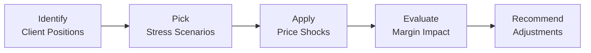

## 23.8 Stress Testing Client Positions

Stress testing is an important aspect of managing derivatives portfolios for clients, especially in volatile markets. It involves imagining extreme market moves—like a sudden jump in interest rates or a dramatic plunge in equity prices—and then evaluating the potential impact on a client’s positions. The outcome of these tests can help guide margin requirements, prompt changes in collateral, or even encourage unwinding certain risky trades. 

This practice is particularly significant under the regulatory environment in Canada, where the Canadian Investment Regulatory Organization (CIRO) lays out best practices for stress testing portfolios. Stress tests not only protect individual clients from catastrophic losses but also help guard the broader financial system against systemic risks. Below, we’ll explore what stress testing is, why it matters, how it’s done, and what you should keep in mind when recommending strategies or adjustments to clients.

---

## Why Stress Testing Matters

You might wonder: Why go through all the trouble of applying hypothetical doomsday scenarios? Isn’t it enough to handle risk when it happens? Well, not quite. In finance, we don’t want to wait for the building to start burning before checking if the fire alarm actually works.

• Stress testing helps ensure your clients’ positions have enough margin posted to withstand adverse market moves.  
• Scenario analyses can reveal weaknesses in a portfolio that simple real-time calculations might not show.  
• Regulators—like CIRO—expect firms and advisors to be proactive in evaluating risk.  
• For large or complex positions, stress tests might be mandatory or strongly encouraged.  

I still remember the day a colleague hurried into my office saying, “We just ran a shock scenario with a 2% overnight interest rate hike. Our client’s margin usage jumps by almost 50% in just one day!” It was, honestly, a bit terrifying—yet it perfectly illustrated how stress tests can flag vulnerabilities before they snowball.

---

## Key Concepts in Stress Testing

### Scenario Analysis
Scenario analysis is about defining hypothetical events—like a major drop in the TSX Composite Index or an unexpected spike in local interest rates—and then evaluating how your positions might fare in that event. The point is not necessarily to *predict* these exact outcomes but to test your readiness if something similar happens.

For example, you can create a scenario where:  
• Equity markets drop 10% overnight.  
• The Canadian dollar suddenly weakens against the U.S. dollar by 5%.  
• Short-term interest rates jump by 1.5 percentage points.  

You’d then measure the potential impact on your client’s derivative positions. If margin usage or liquidation losses exceed your comfort threshold (or your brokerage’s allowable risk limits), you have some adjusting to do.

### Sensitivity Analysis (Greeks)
Where scenario analysis sets specific conditions, sensitivity analysis looks at how changes in certain parameters—like volatility, interest rates, and time—can affect an option's price. Think about “Greeks” such as Delta, Gamma, Vega, Theta, and Rho, which quantify the rate of change in an option’s value relative to the underlying variables.

By combining scenario analyses with sensitivity metrics, you get a deeper view. Let’s say your scenario is that implied volatility doubles. You can combine that scenario with Vega to see how significantly your long index call options might appreciate (or your short put options might move against you).

### Adverse Market Moves
Adverse moves can be anything from an equity market correction to a commodity price shock. Stress testing is about readying yourself for an extreme scenario that is unlikely but not impossible—sometimes referred to as a “tail event.” The 2008 financial crisis is a sobering example: many positions that seemed safe quickly became unmanageable. If there had been thorough stress testing in place, many participants might have reduced or hedged those positions.

### Systemic Risk
Systemic risk is the concern that large-scale defaults can cascade through the financial system. A big default can take out more than just that single participant; it can cause losses across multiple firms. Stress testing is a valuable tool for ensuring a single firm’s positions aren’t so large or leveraged that it would pose a serious threat to overall market stability. CIRO’s guidelines emphasize that robust stress testing frameworks support market integrity.

### Capital Efficiency
Capital efficiency helps decide how best to allocate margin or capital. You don’t want clients to over-pledge capital if it’s not truly necessary. Stress tests can inform whether you’re using margin in the most optimal way or if you should tweak the structure of a position. It’s all about balancing risk control and efficient use of capital.

---

## The Stress Testing Workflow

Below is a simple diagram of how a stress testing process might flow within a brokerage or risk management department:

• Identify Client Positions: Gather data on all the derivative contracts your client holds—calls, puts, futures, etc.  
• Pick Stress Scenarios: Decide on the hypothetical events. These could be large interest rate moves, equity or commodity shocks, exchange-rate fluctuations, or volatility spikes.  
• Apply Price Shocks: Use pricing models to figure out how each position would be affected by the changes described in the scenario.  
• Evaluate Margin Impact: See how the shocks translate into margin usage and compare this to available collateral.  
• Recommend Adjustments: If the margin usage is too high or if tail risk is too large, advise your client to add collateral, reduce position size, or implement risk hedges.

---

## Types of Stress Tests

### Historical vs. Hypothetical
One approach is to replay a known historical crisis—like the 2008 meltdown or the COVID-19 market turmoil in March 2020—and see how the current portfolio would have performed. Alternatively, hypothetical stress testing invents scenarios that have never happened but could happen, such as interest rates spiking by 5% in under a week.

### Single-Factor vs. Multi-Factor
Single-factor tests isolate one variable at a time—like crude oil prices—while multi-factor tests model multiple changes simultaneously (for instance, a spike in oil prices, a drop in equity markets, and a surge in the Canadian dollar might all co-occur).

### Reverse Stress Testing
Here, you ask the question: “What events must happen for my portfolio to completely blow up?” or “At which thresholds do margin calls exceed the client’s available funds?” This is a great way to pinpoint “break points” within a portfolio.

---

## Practical Example

Let’s consider a scenario where a client sells put options on a major Canadian mining stock. Because the stock is historically stable in price, the client’s reading of the market suggests the premium earned from the short puts is “free money.” However, your stress test might apply a scenario in which the mining sector experiences a big slump—maybe due to unexpected regulations or a global commodity supply glut. If the stock’s price tumbles by 20% or so, the client’s margin usage might skyrocket, possibly doubling or tripling overnight. 

If the result is that the client’s account can’t handle the margin call that arises, you’d then advise steps like:  
• Posting more cash collateral.  
• Reducing short put positions.  
• Buying protective calls or another hedge.  
• Diversifying the portfolio with some offsetting positions in other sectors.  

This approach often helps avoid the dreaded phone call: “Hey, you need to deposit more funds into your margin account by 2:00 PM.” Most clients really dislike these calls, and I can’t blame them.

---

## Regulatory Environment

Since January 1, 2023, Canada’s securities regulatory body for investment dealers and mutual fund dealers has been CIRO. Although many historical references remain to the now-retired MFDA and IIROC, CIRO is currently the official source for guidelines and rules. CIRO encourages or requires stress testing for large, complex, or highly leveraged positions. Specifically, here are a few important aspects:

• CIRO’s Best Practices for Stress Testing Client Derivatives Portfolios  
  Check https://www.ciro.ca to see if there’s a specific bulletin or guidance note on how to conduct stress tests. Although some best practices may still be in draft form, the site often provides templates or recommended scenarios for equity, index, and interest rate derivatives.  

• Margin Requirements  
  CIRO sets minimum margin requirements for listed options, futures, and other derivatives. Stress test results might cause a firm to require a higher margin deposit than the standard minimum if the risk is deemed elevated.  

• Systemic Risk Concerns  
  In cases of extremely large positions, CIPF (Canadian Investor Protection Fund) might also pay attention to the potential knock-on effects if the client were to default. While CIPF protects client assets in the event of a member firm’s insolvency, big client positions can still lead to systemic ripple effects.

---

## Best Practices and Common Pitfalls

### Best Practices
• Conduct Regular and Dynamic Tests  
  Don’t do a one-time stress test and forget about it. Market conditions evolve quickly.  

• Align with Client Risk Appetite  
  If your client is conservative, propose more robust stress tests. If they’re more aggressive, still conduct thorough tests, but highlight that margin usage could soar in an adverse scenario.  

• Combine Scenario and Sensitivity Approaches  
  Use multi-factor scenario analysis to see how layered risks might intersect. Complement this with a sensitivity check on Greeks for day-to-day fluctuations.  

• Document Assumptions  
  Stress tests are only as good as the assumptions behind them. Keep a record of the logic and data sources.  

### Common Pitfalls
• Overly Narrow Assumptions  
  It’s human nature to underestimate how bad things can get. Don’t rely only on mild or “expected” moves.  

• Ignoring Liquidity  
  Even if you have margin capacity, a rapid market may become so illiquid that it’s hard to adjust positions.  

• Organizational Silos  
  If the front-office trading desk doesn’t communicate with the risk management department, stress tests can get watered down.  

• Inadequate Systems  
  If you’re using outdated spreadsheets, you risk underestimating or overestimating margin impacts. Consider robust solutions, including specialized software or open-source Python libraries.  

---

## Implementing Stress Testing: Tools & Resources

### Software and Open-Source Tools
• Python Libraries (e.g., PyPortfolioOpt)  
  While commonly used for portfolio optimization, you can modify scripts to incorporate derivative greeks and scenario inputs.  

• RiskModeling Frameworks  
  Many banks or brokerage platforms have proprietary tools for real-time margin calculations. Check with your IT or risk management team for advanced modules that let you build custom scenarios.  

### Regulatory References
• CIRO’s “Best Practices for Stress Testing Client Derivatives Portfolios” (draft or future publication).
• Bourse de Montréal’s recommended scenario analyses for Canadian equity and index options.  

### Additional Reading
• Financial Risk Management: A Practitioner’s Guide by Steve L. Allen – for a deep dive into risk quantification and modeling.  
• Canadian Investor Protection Fund (CIPF) website for guidance on client asset protection.  
• Academic journals (like the Journal of Risk and the Journal of Derivatives) for more theoretical frameworks and case studies.

---

## Actions After Stress Testing

Stress test results aren’t just fancy numbers. They are the basis for making decisions that help protect portfolios. Advisors often discuss test outcomes with clients and propose changes, such as:

• Increasing Collateral or Margin  
  Straightforward: deposit more funds to protect against margin calls if the stress scenario materializes.  

• Adjusting Position Sizes  
  Reducing outsized bets in one asset class or underlying instrument.  

• Hedging or Diversification  
  Using offsetting derivatives positions to neutralize some risk.  

• Reevaluating Strategy  
  If stress tests consistently show unacceptable risk, it might be time to pivot to strategies emphasizing capital preservation, like spreading out risk across multiple underlyings or using protective option structures.  

Sometimes, clients prefer to “ride out” the risk. While that might be fine if they truly understand the consequences, it’s more often a recipe for big trouble. I’ve heard more than one story of clients who said, “Ah, it’ll be fine,” only to see a huge chunk of their portfolio wiped out when the unexpected happened.

---

## Designing Derivatives Strategies with Stress Testing in Mind

Stress testing doesn’t solely apply once you’ve built your position. You can also use it as a forward-looking tool to explore new strategies before committing real capital. For instance:

• Capital-Efficient Spreads  
  If you’re about to implement a spread strategy—like a bull call spread on an index—run a few scenario analyses. That way you can see how each leg of the spread might behave under large upward or downward swings.  

• Downside Risk Limitation  
  Protective puts can limit catastrophic losses. A quick stress test can confirm whether the cost of buying puts versus the expected risk reduction is still worthwhile.  

• Interest Rate Sensitive Structures  
  For clients with substantial exposure to interest rate changes—such as those in interest rate futures or swaps—stress tests can highlight if a large upward or downward rate move would cripple the portfolio.  

---

## Considering Systemic Risk and Firm-Level Policies

Large or complex accounts can pose systemic hazards, even if you’re just helping one client. To prevent a small handful of big portfolios from roiling broader markets, many Canadian brokerage firms incorporate mandatory stress tests for these large accounts. They might also set house margin requirements above CIRO’s minimum if the stress test results suggest a particularly high risk.

If you’re dealing with an especially large portfolio, you might see the firm produce daily stress test reports—some even do multiple intraday updates if the markets are turbulent. That’s a sign the firm recognizes the potential for systemic risk, particularly when significant open interest in derivatives is involved.

---

## Final Thoughts

Stress testing is not just a checkbox for regulatory compliance. It’s a vital, proactive method of protecting clients and the financial system from the fallout of extreme and unexpected market events. Plus, it can spark valuable conversations with clients about how they want to manage risk—do they prefer to dial it back a bit, or are they comfortable with exposure to big potential losses?

No scenario or model is perfect. Sometimes, the real catastrophes are those nobody foresaw, which is why it’s helpful to keep stress tests flexible, wide-ranging, and updated. For you as an advisor, it’s a phenomenal opportunity to deepen trust with your clients by demonstrating that you’re watching out for their interests even when markets behave unpredictably.

---

## Sample Exam Questions: Stress Testing Client Positions Quiz



### Which of the following best describes stress testing in the context of derivatives?

- [ ] Checking the daily trading volume of the underlying asset.  
- [ ] Estimating profits under normal market conditions.  
- [ ] Evaluating how a portfolio might react to unrealistic market changes.  
- [x] Applying hypothetical extreme market moves to a portfolio to gauge margin adequacy.  

> **Explanation:** Stress testing entails applying extreme scenarios—like a sudden 10% drop in equity markets—to see if the current margin is enough.  

### In a stress test scenario where interest rates rise sharply, how might one typically respond if a client's margin requirements exceed available collateral?

- [x] Ask the client to add more collateral or reduce leverage.  
- [ ] Let the position ride in the hope that rates will revert.  
- [ ] Ignore the shortfall because it is only a hypothetical scenario.  
- [ ] Immediately liquidate all positions irrespective of portfolio context.  

> **Explanation:** The usual response recommended by risk managers is to provide client guidance on adding margin or reducing position size long before a catastrophic event actually happens.  

### What is the primary purpose of reverse stress testing?

- [x] Identifying what conditions would cause the internal margin framework to fail.  
- [ ] Verifying that the scenario analysis tools are priced fairly.  
- [ ] Testing historical events to gain insights about past crises.  
- [ ] Ignoring liquidity when analyzing positions.  

> **Explanation:** Reverse stress testing examines the breaking point of the portfolio, essentially asking what circumstances would lead to catastrophic loss.  

### Which of these is considered a major pitfall in stress testing?

- [ ] Using multi-factor models for scenario analysis.  
- [x] Using assumptions that are too narrow and not reflecting severe market swings.  
- [ ] Documenting each step of the stress test for transparency.  
- [ ] Performing dynamic stress tests on a regular basis.  

> **Explanation:** A common pitfall is not stretching your scenarios enough. Overly mild assumptions can hide the real risk in a portfolio.  

### When conducting stress tests on short put options, which scenario is often used?

- [x] A sharp decline in the underlying stock’s market price.  
- [ ] A sudden increase in the underlying stock’s beta.  
- [ ] A small but steady appreciation of the underlying.  
- [x] A major drop in implied volatility.  

> **Explanation:** Short puts are highly vulnerable to big downside moves in the underlying asset. A drop in implied volatility can also affect both premium collection and margin requirements.  

### What is a potential advantage of conducting scenario analysis alongside sensitivity (Greeks) analysis?

- [x] Combining both can reveal multi-dimensional risks that a single method might miss.  
- [ ] Scenario analysis is only useful for short options positions, while Greeks apply solely to futures.  
- [ ] Sensitivity analysis is unnecessary if you have scenario analysis.  
- [ ] Scenario analysis and Greeks are used exclusively for margin calls.  

> **Explanation:** A comprehensive view of risk comes from using both forward-looking scenario analysis and continuous sensitivity monitoring with Greeks.  

### Which of the following is an official resource where Canadian advisors and dealers can find guidance on stress testing?

- [x] CIRO’s Best Practices for Stress Testing Client Derivatives Portfolios.  
- [ ] An internal memo from the U.S. Federal Reserve.  
- [x] The Bourse de Montréal’s recommended scenarios for equity options.  
- [ ] The MFDA website for open derivative positions.  

> **Explanation:** CIRO is the new Canadian self-regulatory organization that publishes relevant best practices. Bourse de Montréal also provides scenario guidelines. The MFDA site is historical and no longer active.  

### In a scenario where volatility doubles, which Greek measure primarily indicates the impact on option prices?

- [x] Vega  
- [ ] Delta  
- [ ] Theta  
- [ ] Gamma  

> **Explanation:** Vega measures an option's sensitivity to changes in implied volatility.  

### What is the main goal of capital efficiency in stress testing?

- [x] Balancing adequate margin coverage with optimal use of available capital.  
- [ ] Ensuring no margin is ever used.  
- [ ] Maximizing risk exposures for higher returns.  
- [ ] Eliminating all possible derivatives positions from the portfolio.  

> **Explanation:** Capital efficiency means avoiding both over-pledging collateral and underestimating genuine risk.  

### True or False: Stress testing results are typically less important than the actual trading activity of the client’s account.

- [ ] True  
- [x] False  

> **Explanation:** Stress testing results are crucial because they forecast how positions might behave in extreme conditions, informing preventative actions before actual trading losses occur.  


