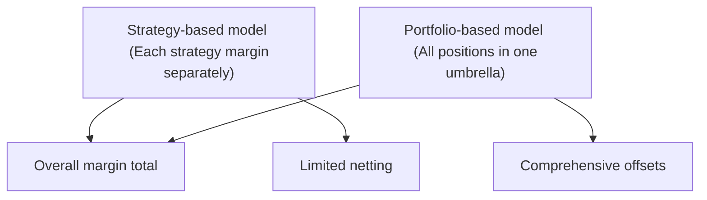

## 23.9 Handling Complex Structured Option Spreads and Margins

Have you ever found yourself juggling multiple moving parts, like you’re performing circus acrobatics with your portfolio? That’s sometimes exactly what trading complex structured option spreads can feel like. Folks see the potential for reduced margin requirements and more precise risk exposure, but the path isn’t always straightforward. I remember the first time I set up a ratio spread in a real trading account—everything looked good on paper, but I soon realized that one leg’s early exercise risk could throw a wrench into the entire margin calculation. Let’s walk through how to handle these intricate structures so you’re well-prepared, both from a strategic standpoint and in terms of margin management.

Understanding risk for multi-leg options is a bit like looking at a puzzle: each piece is connected to another. A butterfly spread might behave differently than an iron condor if the underlying price moves beyond what you expect. Similarly, ratio spreads can catch you by surprise if one side has significantly higher open interest or if implied volatility shifts unexpectedly. Plus, if you’re in Canadian markets, you’ll need to keep an eye on the regulatory frameworks shaped by the Canadian Investment Regulatory Organization (CIRO) and the Bourse de Montréal.

Below, we’ll take a look at the margin requirements for common multi-leg structures, how strategy-based and portfolio-based margin approaches differ, pitfalls to watch for (like early assignment), best practices in risk control, and resources you can use to sharpen your knowledge. By the end, my hope is that you’ll be comfortable structuring your trades—and confident in explaining to your clients or colleagues how margin is impacted when layering multiple options into one position.

### Why Complex Multi-Leg Spreads Often Incur Lower Margins

One of the main draws to combining multiple options into a single strategy is to reduce net risk. For instance, consider a butterfly spread. You might buy one in-the-money (ITM) call, write two at-the-money (ATM) calls, and buy one out-of-the-money (OTM) call. At first glance, it looks complicated, but it’s essentially two spreads rolled into one. Because the sold calls are partially “protected” by the calls you purchase, your total risk is more controlled compared to an outright naked call sale. Regulatory bodies and brokerage firms often reflect this reduced risk by lowering margin requirements.

The same logic applies to iron condors, which combine a bull put spread and a bear call spread. Each side hedges the other, so your net risk is smaller than if you had simply sold naked puts or calls across the same strike distances. When properly set up, a multi-leg structure can significantly reduce the margin capital you need to post.

### Strategy-Based Margin Versus Portfolio-Based Margin

Even though overall risk might drop, the margin calculation method can differ depending on the brokerage firm’s approach.

Strategy-Based Margining  
This method calculates margin requirements on each identified strategy as if it were stand-alone. Then the margin amounts for each strategy are summed up to arrive at a total margin. It’s simpler for the brokerage to implement, but it can result in higher margin requirements than absolutely necessary, because offsetting positions in different strategies aren’t always recognized.

Portfolio-Based (Risk-Based) Margining  
With portfolio-based margining, the brokerage looks at your entire portfolio (or at least the entire subset of options in a recognized portfolio) and considers the net risk. If your short put on one stock is offset by a long call spread on a closely correlated index, the margin model may give you partial relief. This approach is more dynamic but carries greater complexity, as your margin can fluctuate quickly if the correlation assumptions change or if implied volatility spikes.

In Canadian markets, margin rules are significantly influenced by Bourse de Montréal guidelines and CIRO’s mandates, which historically followed IIROC or MFDA frameworks prior to 2023. If you’re deep into advanced trading, you may even see references to or adopt some guidelines from the Options Clearing Corporation (OCC) in the U.S., which is famous for its risk-based margin models.

In the diagram above, you can see a simple depiction of how margin is assessed under each model. Strategy-based margin stands alone, summing up each strategy margin, whereas portfolio-based margin lumps all positions together, with the possibility of netting offsets.

### Calculating Margin Offsets with a Simple Formula

While margin can get very technical, a simplified representation of a margin requirement for multi-leg strategies could be expressed using KaTeX as follows:


\text{Margin Requirement} = \max \Bigl[\sum (\text{Indiv. Margin Amounts}) - (\text{Offset Credits}), 0\Bigr]


In a strategy-based approach, you might find the Offset Credits portion to be zero or very limited if the system doesn’t fully recognize offsets across different strategies. In a portfolio-based margin model, that offset can be significantly larger, reflecting a more holistic risk viewpoint.

### Common Complex Spread Strategies

Butterfly Spread  
A butterfly spread combines two spreads sharing a common middle strike. It’s typically used when you expect a stock or index to stay near a central strike price until expiration. Margins in a butterfly spread are modest because the maximum risk is well-defined. The trades that typically make up a butterfly spread are:  
• Long 1 ITM call (or put)  
• Short 2 ATM calls (or puts)  
• Long 1 OTM call (or put)  

Iron Condor  
An iron condor is a neutral strategy that sells a call spread above the current market price and a put spread below the market price. The maximum risk is similarly capped because each short call and short put is protected by a further out-of-the-money long option. Canadian margin rules often treat each spread separately, but a portfolio-based model might allow for netting if both sides are recognized as part of a single trade.

Ratio Spreads  
A ratio spread involves buying or selling options in a ratio that’s not 1:1, for instance, buying 1 call at a specific strike while selling 2 calls at a higher strike. While ratio spreads can offer net credits and potentially profitable positions, they introduce a directional bias and unlimited or high risk if the underlying moves significantly against you. Margin rules can vary substantially here; a strategy-based approach may identify the short call side as requiring heavier margin.

Calendar and Diagonal Spreads  
When you mix options with different expirations, you get calendar or diagonal spreads. The margin for these can get tricky because different expiration cycles can have different implied volatilities, and changes in time decay can benefit or harm your position in unexpected ways. If the near-month leg is assigned or exercised early, you may end up with an uncovered position that changes your margin drastically.

### Why Complexity Can Introduce Hidden Risks

The reason multi-leg spreads lower margin requirements is because they’re recognized as relatively “safe” strategies with capped risk. However, “capped risk” doesn’t mean “no risk.” For instance, in an iron condor, the main risk is that the underlying price makes a significant move in either direction. That risk is finite but can still be large if volatility spikes.

Early Exercise  
American-style options can be exercised at any time. If you’re short a leg of the spread, you can face early exercise—especially around dividend ex-dates for calls or if you hold deep in-the-money puts. If that happens, your carefully planned spread can morph into a partially naked position. Suddenly, your margin may skyrocket if you no longer hold the covering leg.

Correlation Shift  
Sometimes you’ll rely on correlation assumptions to offset risk—for example, short calls on a stock that closely tracks an index you’re long. If that correlation cracks (maybe the sector-specific stock gets hammered, while the broader index does not), your margin offset might quickly prove inadequate. Under a portfolio-based margin system, your margin can spike as the system recomputes your portfolio’s net risk.

Bid-Ask Spreads and Liquidity  
When volatility is high, or a stock is thinly traded, the offsets that look great on paper may become illusory in real life. Wider bid-ask spreads can reduce the reliability of mid-market calculations for hedging. Margin calls might increase if your valuations for individual legs diverge from actual fill prices.

### Monitoring Each Leg Carefully

When you’re working with multi-leg strategies, it’s crucial to keep a close eye on every single leg. A live example from a friend’s practice might help: A client had an iron butterfly on a biotech stock and forgot about a short call assignment risk right before an FDA announcement. The client woke up to an exercise notice with a big short stock position. The broker immediately demanded elevated margin because the protective leg was fully OTM and not effectively covering that short. The moral of the story? Track each leg’s status every day.

### Strategy-Based Margining with Complex Spreads

Under strategy-based margining, your broker will typically have margin tables that specify typical margin offsets for various multi-leg setups. The Bourse de Montréal’s Strategy Margin Tables are a go-to reference in Canadian markets (https://www.m-x.ca/). They outline margin offset percentages for recognized strategies like butterflies, vertical spreads, and others. If your combination of calls/puts matches a known scenario in the table, you get a standard margin requirement that is often significantly lower than if each trade was singled out.

However, if your spread is so unique that it doesn’t show up on the standard margin table, your broker might either decline to recognize it as a strategy or apply a more conservative margin approach. Strategy-based margining essentially looks at each spread in isolation.

### Portfolio-Based (Risk-Based) Margining

With a portfolio-based margin approach, the firm uses a specialized risk engine—sometimes based on sophisticated calculations that replicate simulated market moves. Instead of treating that iron condor or butterfly as a stand-alone position, the margin system factors in the entire user portfolio. For big institutions, portfolio margining can yield huge capital efficiencies because different positions can hedge each other. However, for a retail or small institutional trader, the complexity can be both a blessing and a curse. Reduced margins mean higher leverage potential, but also a greater risk of triggered margin calls if the net portfolio risk becomes unbalanced quickly.

### Case Study: A Ratio Spread with Portfolio Margin

Consider a ratio spread on ABC stock (a hypothetical scenario) where you buy 1 call at a $50 strike for $3.00 and sell 2 calls at a $55 strike for $1.50 each. Let’s say the initial net credit is zero. The maximum risk occurs if ABC surges above $55, leaving you short one call that isn’t fully covered.

Under strategy-based margining, the short call that’s effectively uncovered might require a full margin akin to a naked short call (with some discount for the long call). With portfolio-based margining, if you hold a correlated short position on the underlying stock or some offsetting put positions, you might see a lower margin requirement. For instance, if your portfolio includes a short put or you’re short the correlated index, the risk engine might realize that the ratio spread’s short call is offset, partially or entirely, reducing the margin required.

### Best Practices to Avoid Margin Shortfalls

• Know Your Leg Status in Real Time: Check for early exercise risk daily, especially when short ITM options near dividends or major events.  
• Plan for Volatility Shifts: Stress-test your multi-leg positions for big implied volatility swings.  
• Use Alerts: Set up automated alerts through your broker’s platform or third-party risk tools to warn you if your margin usage spikes.  
• Communicate with Your Broker: If you’re trading a nuanced spread, ask if they’ll give you partial credits under their margin rules. Sometimes the squeaky wheel gets the grease.  
• Understand Regulatory Nuances: Bourse de Montréal’s margin guidelines, CIRO bulletins, or specialized references from the OCC can help you align your strategy with recognized frameworks.

### Additional Resources

• Bourse de Montréal’s Strategy Margin Tables:  
  https://www.m-x.ca/  
  (Gives insight into standard margin offsets for recognized multi-leg strategies in Canada.)  

• CIRO Bulletins or Training Modules:  
  The Canadian Investment Regulatory Organization often publishes educational content or bulletins that clarify how margin is calculated under Canadian regulations. Visit https://www.ciro.ca for updates.

• OCC Portfolio Margin Guide:  
  Though U.S.-focused, the Options Clearing Corporation publishes in-depth documentation on portfolio margin frameworks that can help you understand broader best practices.

• “Options as a Strategic Investment” by Lawrence G. McMillan:  
  This is a staple resource covering multi-leg strategies, margin guidelines, and practical examples for advanced options strategies.

### Putting It All Together

If you want to make the most of complex option spreads, you need both the strategy knowledge and a firm grasp of margin mechanics. Yes, your margin might be lower than a single-leg position, but you also face hidden complexities like early assignment, changes in correlation, and liquidity constraints. It’s all about balance: carefully constructing offsetting option legs to limit your risk, then diligently monitoring each leg so you’re never blindsided by a nasty margin surprise.

At the end of the day, structured approaches can offer a beautiful blend of efficiency and risk management—like having a well-choreographed dance routine where each performer knows exactly where to stand. But if someone exits stage left without warning, you can quickly find yourself out of sync (and out of margin capacity!). So, keep your eyes open, stay informed, communicate with your brokerage, and always keep an ear to the ground for regulatory changes or new margin rules that might affect your strategy.  

I often tell newer traders: “If you’re going to build a fancy multi-leg spread, be prepared to babysit it.” That includes anticipating weird market moves, checking IV levels, and remembering that early assignment can happen anytime with American-style options. Do all that, and the dance becomes manageable—and maybe even thrilling.

---

## Sample Exam Questions: Complex Structured Option Spreads and Margins



### Which statement best describes a butterfly spread's margin requirement relative to a single-leg position?

- [ ] It is generally higher due to additional legs.
- [ ] It is the same as a naked short call.
- [ ] It is waived entirely by most brokers.
- [x] It is lower because the potential risk is reduced by offsetting positions.

> **Explanation:** Multi-leg strategies like butterfly spreads typically limit maximum risk, so margin requirements are lower compared to unhedged single-leg options.

### In a ratio spread, why might a strategy-based margin approach be higher than a portfolio-based margin approach?

- [ ] Strategy-based margin recognizes all potential offsets holistically.
- [x] Strategy-based margin calculates each position in isolation, resulting in limited or no offsets.
- [ ] Portfolio-based approaches always ignore any offsetting positions.
- [ ] Canadian regulators require high margin on ratio spreads, regardless of approach.

> **Explanation:** Strategy-based margin does not often account for the netting effect of offsetting positions held elsewhere in the portfolio, leading to potentially higher margin.

### You are short a call within a multi-leg American-style option spread. Which risk factor can cause margin requirements to spike unexpectedly?

- [x] Early exercise of the short call.
- [ ] Declining implied volatility.
- [ ] A sudden drop in open interest.
- [ ] Dividend cancellation on the underlying.

> **Explanation:** If the short call is exercised early, you may lose the margin benefit of the covering leg, causing your margin requirement to jump if you become naked short.

### Which regulatory body oversees client margin requirements for derivative products in Canada as of 2025?

- [ ] The Mutual Fund Dealers Association of Canada (MFDA).
- [ ] The Investment Industry Regulatory Organization of Canada (IIROC).
- [x] The Canadian Investment Regulatory Organization (CIRO).
- [ ] The Ontario Securities Commission (OSC) exclusively.

> **Explanation:** MFDA and IIROC merged to form CIRO as the new self-regulatory body overseeing investment dealers, mutual fund dealers, and market integrity.

### What is the main advantage of using portfolio-based margin models over strategy-based models?

- [x] They recognize net risk across all positions, potentially lowering total margin.
- [ ] They eliminate the risk of early assignment.
- [ ] They make it impossible for clients to face margin calls.
- [ ] They allow infinite leverage in all cases.

> **Explanation:** A portfolio-based model examines the entire portfolio’s net exposure and can significantly reduce margin if positions offset each other’s risk.

### A trader sets up an iron condor, combining a call spread and a put spread. Under most margin frameworks, why is the trader’s margin requirement generally limited?

- [x] Because the maximum risk on each side is capped by the long options.
- [ ] Because margin requirements are waived for all condors.
- [ ] Because early assignment risk is eliminated in iron condors.
- [ ] Because iron condors always expire worthless.

> **Explanation:** An iron condor has capped risk on both sides due to the long out-of-the-money options covering the short positions, thus limiting the margin requirement.

### In a complex option spread, how might correlation assumptions affect margin?

- [x] If correlated legs diverge drastically, offset assumptions might fail, leading to higher margin.
- [ ] Correlation does not factor into margin calculations.
- [ ] Higher correlation always increases margin requirements.
- [ ] Lower correlation always leads to zero margin.

> **Explanation:** Portfolio-based margin can rely on correlations between positions. If these assumptions fail, the margin could jump due to increased net risk.

### Why is it critical to monitor each leg of a multi-leg strategy daily?

- [x] Early assignment or a closed leg can eliminate the margin benefit the strategy once provided.
- [ ] Each leg of a spread is always margin-free.
- [ ] Leg risks are unrelated to the total margin.
- [ ] Brokers typically restrict multi-leg trades to monthly check-ins.

> **Explanation:** If one leg is exercised or closed, you may be left with a partially uncovered position, significantly affecting margin requirements.

### Which complex strategy can combine both a bull spread and a bear spread?

- [ ] Calendar spread
- [ ] Ratio spread
- [x] Iron condor
- [ ] Diagonal spread

> **Explanation:** An iron condor enters a bull put spread and a bear call spread simultaneously, providing a range-based, neutral outlook.

### True or False: Portfolio margin often leads to greater leverage potential, but also requires more active risk monitoring.

- [x] True
- [ ] False

> **Explanation:** Portfolio-based margin allows an increased use of capital if positions offset risk, but it also demands closer monitoring because margin requirements can fluctuate with market conditions.


