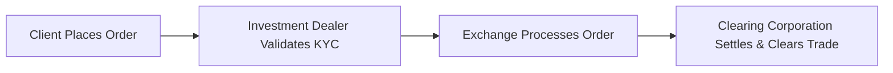

## 24.1 Essential Information Required for All Types of Orders

Placing an order for a listed option isn’t just a matter of clicking a few buttons or calling your investment dealer to say, “Hey, grab me ten call contracts ASAP.” Instead, there are strict procedures and essential pieces of information you must confirm to ensure your trade aligns with industry guidelines—especially in Canada and under the supervision of the Canadian Investment Regulatory Organization (CIRO). These rules help protect both you and the market as a whole. In this section, we’ll dive into the foundational details required to submit an option order, tackle some compliance and regulatory essentials, and provide real-life examples so you’ll know exactly what to do when placing your next trade.

Let me start with a small anecdote from my own experience: Years ago, when I first dipped my toe into the options market, I placed a buy order for a put option but completely forgot to specify my account type (I had both a cash account and a margin account at the time). My investment dealer had to call me back before processing it because he needed to confirm the correct account. It was a pretty embarrassing moment—still cringe-worthy. That minor oversight delayed my order, and by the time it was properly set up, the market had moved away from my desired price. It was a frustrating lesson, but it taught me how crucial these details can be.

Below, we’ll break down all key elements that must be defined and verified when entering any listed option order. We’ll also discuss how they tie into compliance regulations, margin requirements, and the big picture of accurate trading records.

---

### The Building Blocks of an Option Order

When you decide to trade listed options in North America—whether on the Bourse de Montréal, the Chicago Board Options Exchange (CBOE), or other markets—you’ll need to provide a set of basic but critical inputs. Some of these may feel second nature once you’re more familiar with the market, but it’s always good to double-check:

• Client’s Account Number and Account Type  
• Underlying Security or Index  
• Option Class (Call or Put)  
• Option Expiry Month or Week (if applicable)  
• Strike Price  
• Position Instructions (Buy or Sell) and Whether It’s an Opening or Closing Trade  
• Number of Contracts (Volume)  
• Order Price Instructions (Market, Limit, Stop, Stop-Limit, etc.)

Let’s unpack each of these elements:

#### Client’s Account Number and Account Type

• You must provide the correct account number so the trade is booked in the right place. Are you using a margin account, a cash account, or maybe a registered plan like an RRSP or TFSA (if the dealer allows options in such accounts)?  
• Oversights can result in confusion about who owns the position or which rules apply (for example, margin requirements differ from cash accounts).  
• From a practical standpoint, your investment dealer cannot process the order in the clearing system without your accurate account details.

#### Underlying Security or Index

• You have to specify the exact underlying instrument—e.g., a stock on the Toronto Stock Exchange (TSX), a broad market index like the S&P/TSX 60, or an exchange-traded fund (ETF).  
• If the underlying security is interlisted or trades on multiple exchanges, your order ticket’s system might automatically categorize the listing. Make sure you identify the exact ticker symbol or index name to avoid any mix-ups.

#### Option Class (Call or Put)

• A call option gives you the right to buy, a put option gives you the right to sell.  
• Minor confusion here can result in the exact opposite of your intended trade. Trust me, mixing up calls and puts is not fun.

#### Option Expiry Month or Week

• You need to specify the correct monthly or weekly expiration. Is it the monthly contract that expires on the third Friday of the month, or is it one of the newer weekly options that expire every Friday?  
• If your market offers short-term weekly options, missing this detail could lead to big mismatches in pricing and time value.

#### Strike Price

• Each option contract targets a particular strike price. Make sure to confirm that you’re selecting the right strike.  
• A single underlying stock may have dozens of available strikes, especially in periods of high market volatility.

#### Position Instructions: Buy/Sell and Opening/Closing

• Are you opening a new position or closing an existing one? The difference between “buy to open” vs. “buy to close” is crucial, and it impacts factors like margin and risk.  
• “Sell to open” indicates shorting a contract you do not yet hold, while “sell to close” indicates you are liquidating a long position you already have.

#### Number of Contracts (Volume)

• Typically each contract in an equity option represents 100 shares of the underlying. Make sure you have the correct total quantity in mind (e.g., 5 contracts = 500 shares).  
• Keep an eye on your liquidity constraints. Large orders in thinly traded options can cause big spread costs and slippage.

#### Price Instructions (Market, Limit, Stop, etc.)

• If you say “market order,” you’re telling your broker to get you in or out of the position as soon as possible at the best current price. Market orders can be dangerous if liquidity is low.  
• A limit order sets your maximum purchase price (if buying) or minimum selling price (if selling).  
• A stop order only gets triggered once the market trades (or quotes) at or through your specified stop price. It’s typically used to protect gains or limit losses.

---

### Compliance and Suitability: The KYC Aspect

In Canada, all investment dealers are required by CIRO to conduct Know-Your-Client (KYC) checks before approving you for options trading. That means dealers must understand your financial background, risk tolerance, investment objectives, and knowledge level surrounding derivatives.

• If you have brand-new clients who have never traded options, an order for a complex short put spread or a naked call might not align with their risk profile.  
• If your investment objectives revolve around income generation but with low risk tolerance, your dealer likely wouldn’t immediately approve a high-risk strategy like selling strangles.  
• This is where the conversation with your registered investment advisor or dealing representative typically starts: they ensure your margin or cash account has the capability to handle the potential losses an option strategy might generate.

Regulators (CIRO and the CSA) enforce these requirements so retail investors don’t get burned by overly complex trades. Always verify that your order lines up with what you said you wanted to do in your KYC documents.

---

### The Life Cycle of an Option Order

To visualize how your order moves through the trading process, here’s a simple flowchart:

1. You, the client, initiate the order with all required details.  
2. The investment dealer checks your account, ensures compliance requirements are met, and forwards the order to the exchange.  
3. The exchange matches your order with a counterparty.  
4. The clearing corporation (in Canada, typically the Canadian Derivatives Clearing Corporation (CDCC)) takes over to settle and clear the trade, ensuring the position is properly recorded.

---

### Real-World Example: Placing a Limit Buy Order

Let’s say you want to buy 10 call contracts on ABC Inc., which currently trades at CA$50/share. You expect a bump in ABC’s stock price over the next month—maybe due to an upcoming earnings report. Here’s how you might fill in your order ticket:

• Account Number: 123456 (Margin)  
• Underlying: ABC Inc.  
• Option Class: Call  
• Expiry: June (monthly series)  
• Strike Price: 50.00  
• Buy or Sell: Buy to Open  
• Number of Contracts: 10 (representing 1,000 shares)  
• Order Type: Limit Order at $2.00 per contract (CA$200 per contract, total CA$2,000 if filled)  
• Expiry of Order: Day Order (valid for that trading day only)

Because you put in a limit of $2.00, you won’t pay more than that. If the option is trading at $2.05, your limit might not get filled immediately (or at all). If the best available ask price drops to $2.00, your order can be executed. You’re also referencing a margin account, so your investment dealer will verify that you have sufficient margin to open this position.

---

### Common Pitfalls When Entering Orders

• Mixing Up Calls and Puts: Always double-check your selection. Calls and puts have opposite risk profiles.  
• Wrong Strike Price: Checking the chain multiple times is wise—especially after big market moves.  
• Using Market Orders in Illiquid Options: Might cause huge slippage or partial fills.  
• Missing the “Opening” vs. “Closing” Instruction: If you already have 10 open put contracts and you accidentally place a “buy to open” order again instead of “buy to close,” you’ll be increasing your open position rather than closing it.  
• Not Reviewing the Expiry Date: If you accidentally pick a weekly expiry instead of a monthly (or vice versa), your time horizon changes drastically.

---

### The Role of Margin and Capital Requirements

Every time you buy or sell an option, your account needs to meet margin requirements under CIRO guidelines (for margin accounts), or you must have the full cash available (for cash accounts). For instance, if you sell a put to open, the margin requirement can vary depending on the strike price, the underlying’s market price, implied volatility, and regulatory formulas.

• Sales of naked (uncovered) puts and calls have higher margin demands compared to, say, a covered call (where you already own the underlying shares).  
• If your margin is insufficient, your investment dealer may reject the order or issue a margin call once the position is open.

---

### Recording the Order Details

When you place the order—often electronically these days—your investment dealer’s platform will timestamp it. If any detail is missing or obviously incorrect, the order might get rejected. On the back end:

• The dealing representative or the electronic system checks for basic commodity code validation (e.g., the ticker symbol and the option series).  
• The system also tags your order with an internal reference number for auditing and compliance.  
• This ensures that if the regulator or the clearinghouse has questions, everything is well-documented.  

There’s a good chance your broker’s user interface has some built-in validations to help guide you, but always remain cautious: the final responsibility for correctness is yours.

---

### Glossary of Key Terms

• **Call Option**: A contract granting the buyer the right (but not the obligation) to buy the underlying asset at a specified strike price on or before the expiry date.  
• **Put Option**: A contract granting the buyer the right (but not the obligation) to sell the underlying asset at a specified strike price on or before the expiry date.  
• **Underlying Security**: The financial instrument (e.g., stock, index, or ETF) on which the option is based.  
• **Opening Transaction**: “Buy to Open” or “Sell to Open” indicates you’re establishing a new position.  
• **Closing Transaction**: “Buy to Close” or “Sell to Close” indicates you’re liquidating or unwinding an existing position.  
• **Market Order**: An order to buy or sell at the best available price. Execution is generally immediate, though not guaranteed at a specific price.  
• **Limit Order**: An order to buy or sell at a specified price (or better).  
• **Stop Order**: An order activated when the market reaches the stop price. It then converts to a market order (or a limit order if specified as “stop-limit”).

---

### Why These Requirements Matter

1. **Accuracy**: Even a small mix-up (like choosing the wrong strike or expiry) can drastically change your risk/return profile.  
2. **Compliance**: Regulators (CIRO, CSA) and the markets themselves mandate specific data fields to maintain orderly markets and a transparent audit trail.  
3. **Speed**: In fast-moving markets, missing any detail can delay your order or cause it to be declined, impacting your potential profitability or risk management.  
4. **Risk Management**: Proper classification of opening vs. closing transactions ensures that the dealer calculates margin requirements accurately.  
5. **Client Protection**: The thorough KYC checks protect you from trades that might exceed your risk appetite or financial capacity.

---

### Additional Resources

If you’re keen to expand your knowledge on how these rules fit into the broader Canadian derivatives landscape, check out these sources:

• **CIRO Website** ([www.ciro.ca](https://www.ciro.ca)): For up-to-date information on self-regulatory standards in Canada.  
• **Bourse de Montréal Rulebook** ([www.m-x.ca](https://www.m-x.ca)): Offers detailed technical requirements and procedures for listed options and futures in Canada.  
• **“Options, Futures, and Other Derivatives” by John C. Hull**: A foundational text that walks you through derivatives pricing, mechanics, and strategies.   
• **Canadian Securities Administrators** ([www.securities-administrators.ca](https://www.securities-administrators.ca)): For overarching provincial/territorial rules regarding derivatives and investor protection.  
• **Open-Source Tools**: Websites like QuantLib (an open-source library) can help you test or evaluate option pricing in your own time.

---

### Putting It All Together

Yes, placing an order for a listed option can be done in under five seconds once you become an expert, but each of those seconds must include verifying the vital details: your account is approved for options, your chosen strike and expiry align with your strategy, the correct order type is specified, and the margin or cash is available. If you keep these essential components in mind—and if you remain mindful of compliance requirements—you’ll avoid the deer-in-headlights feeling when your investment dealer or clearinghouse comes calling for clarifications.

In practice, an options trade is a collaboration between you, your broker (the investment dealer), the exchange, and eventually the clearing corporation. Everything from your KYC data to your margin or capital status plays a role in ensuring your order can flow smoothly. By mastering the essential building blocks of option order placement, you’ll be equipped to handle the wide variety of option strategies detailed throughout this course.

---

## Sample Exam Questions: Essential Info for Listed Option Orders



### Which piece of information is typically not required when placing a listed option order?

- [ ] The underlying security or index
- [ ] The strike price
- [ ] The expiry month or week
- [x] The client’s birth date

> **Explanation:** An investor’s birth date, while part of broader KYC documents, is not specifically required on the order ticket. The other details are crucial to executing an option trade accurately.

### What is the primary reason for specifying “opening” or “closing” in an option order?

- [x] To distinguish whether a position is being established or unwound
- [ ] To inform the market maker of a preferred settlement method
- [ ] To reduce commission fees
- [ ] To indicate margin eligibility

> **Explanation:** “Opening” vs. “closing” tells the broker and clearing system whether you’re initiating a new position or offsetting an existing one. This distinction affects margin and position records.

### If a client places a market order in a thinly traded option series, what is the main risk?

- [ ] The client will not be able to open the position at all.
- [x] The client may experience high slippage and receive an unfavorable fill.
- [ ] The order is automatically rejected by the exchange.
- [ ] The margin requirement doubles.

> **Explanation:** In a thinly traded market, executing a market order can lead to a fill at a far worse price than expected due to the wide bid-ask spread.

### Which statement best describes the role of a stop order?

- [ ] It is an order priced above the current ask and canceled if not filled within seconds.
- [x] It becomes a market or limit order when the trigger price is hit.
- [ ] It is only available for institutional traders.
- [ ] It refers to the standard market open for trading.

> **Explanation:** A stop order is activated once the market price reaches the specified stop level. It can convert into a market or limit order, depending on the order instructions.

### Why might a dealer request additional documentation before placing a new option trade for a client?

- [ ] The client is under 18 years old.
- [ ] The underlying security does not exist.
- [x] The client’s KYC file indicates they lack approval for higher-risk strategies.
- [ ] To verify if the client owns exactly one share of the underlying.

> **Explanation:** Dealers must ensure each new option trade aligns with the client’s approval tier and risk tolerance as outlined in KYC records.

### In a margin account, which of the following trades typically requires higher margin?

- [x] Selling a naked call
- [ ] Buying a call to open
- [ ] Buying a put to open
- [ ] Selling a covered call

> **Explanation:** Selling a naked call has potentially unlimited risk, so the margin requirement is higher compared to buying options or selling a covered call.

### Which entity in Canada generally handles the clearing of listed option trades?

- [ ] CIRO
- [ ] The CSA
- [x] The Canadian Derivatives Clearing Corporation (CDCC)
- [ ] The Bourse de Montréal

> **Explanation:** The CDCC is responsible for clearing and settling listed derivative trades, including options, in Canada.

### What is the possible consequence of placing an order with an incorrect strike price?

- [ ] The trade may automatically correct to the nearest strike.
- [ ] Trading systems ignore it and fill the order at a random strike.
- [x] You could end up with the wrong option, leading to a mismatched risk profile.
- [ ] The exchange automatically cancels the order without notifying the broker.

> **Explanation:** An incorrect strike price can lead to holding a position that doesn’t match your intended strategy, potentially causing unexpected risk or losses.

### Which resource would you consult to confirm specific rules covering the addition or deletion of option series on the Bourse de Montréal?

- [ ] The U.S. Commodity Futures Trading Commission website
- [x] The Bourse de Montréal Rulebook
- [ ] The Department of Finance Canada
- [ ] The Canadian Investor Protection Fund (CIPF) website

> **Explanation:** The Bourse de Montréal Rulebook details the operational procedures and rules for listed options and derivatives in Canada.

### True or False: A limit order will always be filled at your specified price level once the market touches your limit price.

- [ ] True
- [x] False

> **Explanation:** Although a limit order sets the maximum or minimum price at which you are willing to trade, there is no guarantee of a fill. If other orders are ahead of you in priority or if the market moves away, you may miss the execution.


