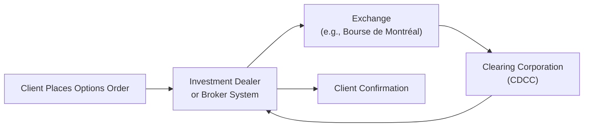

## 24.2 Order Ticket Information Unique to Options

Have you ever messed up an online shopping order by picking the wrong size or color, and then needed to fix it in a hurry? Well, imagine something like that in the world of finance—except instead of returning a pair of shoes for a refund, you could be tangled up in thousands (or tens of thousands) of dollars in unwanted risk. That’s essentially what can happen if we mess up an options order ticket. In the world of derivatives, the order ticket is the final set of instructions that get your trade from your brain to the market. And if it’s incorrect or imprecise, watch out.

Below, we’re going to look at the critical fields that make an options order ticket so different from a regular stock or bond ticket. Think about it as a checklist that you absolutely need to use if you value your time, money, and maybe even your sanity.

Before we dip into the specifics, remember that Canada’s self-regulation is now consolidated under the Canadian Investment Regulatory Organization (CIRO). If you see references to the MFDA or IIROC, that’s historical context. Today, CIRO rules apply. The Bourse de Montréal (the “Bourse”) handles listed derivatives in the Canadian market, and they, together with CIRO, set out many of the rules for how we submit options orders.

------------------------------------------
  
### Why Accuracy Matters

It’s easy to breeze over an order ticket—“I just need to buy that call option, right?”—until you realize the difference between a call and a put or choosing a weekly versus a monthly expiry can have very real monetary consequences. An incorrect order can lead to:

• Missed trades (and missed profits).  
• Larger-than-expected or unwanted losses.  
• Regulatory and compliance headaches (nobody enjoys explaining these to their boss or client).  

So, let’s break down each of the unique info fields on an options ticket. Then we’ll look at some best practices for making sure you don’t skip a beat.

------------------------------------------

### Breaking Down the Fields

#### 1. Option Class (Call or Put)

When we say “option class,” we’re basically deciding if we’re trading a call option—the right to buy the underlying security—or a put option—the right to sell the underlying security. This might sound obvious, but every so often someone out there chooses the wrong side. Picture wanting insurance (a put) but actually ending up with a call. Big oops.

• Calls vs. Puts:  
  - Calls gain value if the underlying price increases beyond the strike.  
  - Puts gain value if the underlying price falls below the strike.  

At the Bourse, or any other global exchange, you must specify whether your trade is in calls or puts. If that’s not clear on the ticket, it’s an automatic error and you’re going to be stuck.  

#### 2. Expiry Date

Options come with a built-in countdown timer. If you buy a 3-month call option, the clock starts ticking the moment you trade. Selecting the correct expiry date is crucial because it determines how quickly your option will expire.  

• Standard Expiry: Often the third Friday of the month in Canadian and U.S. markets.  
• Weekly Expiry: More and more popular for actively traded underlyings—these expire on Fridays as well, but they come up much faster.  

Don’t mix up near-term weeklys with monthly expiries. It’s an easy mistake that can cause you to lose money faster than you might like, or you might not get the trade you actually wanted.

#### 3. Strike Price

The strike price represents the agreed-upon price at which you can buy (call) or sell (put) the underlying asset. If you’re used to buying stocks at market or limit prices, the concept of “strike price” can sometimes be confusing, but it’s essential in the options world.

• Strike Increment: On Canadian exchanges, strike prices are typically set in specific increments (e.g., $0.50 or $1.00, depending on the underlying).  
• Deep In-the-Money Options sometimes have strikes that differ from at-the-money or out-of-the-money strikes. **Double-check** your intended strike—don’t just pick the first option you see on the platform.  

#### 4. Detailed Pricing Fields (Option Premium or Limit Price)

So here’s a big difference from stocks: when you buy an option, you pay a premium (or you receive a premium if you’re the seller). That premium is typically quoted in dollars (e.g., $2.50 per share). But remember each options contract often represents 100 shares of the underlying. So the total cost is that quoted premium * 100 (plus fees).

• Price Input: You can enter a limit price or opt for a market price. In the options world, limit orders may be more common—especially if the option is illiquid—because you don’t want to get hammered by wide spreads.  
• Potential for Error: A single decimal slip—entering $20.00 when you meant $2.00—can create a massive unintended outlay (like paying $2,000 in premium instead of $200). Let’s just say I’ve seen more than one sweaty phone call because of that.  

#### 5. Opening or Closing Designation

Everyone in finance loves a good label, right? When you enter an options order, you must specify whether you’re opening a new position or closing one you already hold. To the firm’s back office (and CIRO’s compliance folks), these designations matter because they track positions for margin calculations and regulatory reporting.

• Opening Transactions: Increase your position (or create a new one).  
• Closing Transactions: Decrease or eliminate your existing position.  

It might not sound exciting, but it’s super important for your clearing firm and compliance. If you’re opening a position and accidentally mark it as a “closing,” your account might show the wrong margin or pay too little or too much in transaction fees.

#### 6. Special Instructions

Stocks have these too—Day Order, Good-Till-Cancelled (GTC), Fill-or-Kill (FOK), Immediate-or-Cancel (IOC)—but in options, these instructions can be more sensitive because (a) option liquidity can be lower, and (b) the time value is ticking away.

• Day Order: Expires at the close of the current trading session.  
• Good-Till-Cancelled (GTC): Stays active until you manually cancel it or until it’s filled.  
• Fill-or-Kill (FOK): Either the entire order fills immediately or the order is canceled in full.  
• Immediate-or-Cancel (IOC): Part of the order can fill right away, and the rest is canceled immediately.  

For some traders, a GTC might keep them in the market longer than they intended, especially if volatility hits. Also keep an eye on “good until date” instructions—accidentally leaving an order in the market when you thought it was done is no fun.

#### 7. Option Symbol

In Canada, listed option symbols are typically assigned by the Bourse or the Canadian Derivatives Clearing Corporation (CDCC). They’ll specify the underlying ticker, the expiry date, strike price, and whether it’s a call (C) or a put (P). A typical example looks something like this:

• “SU 220618C00055000” for a Suncor call, expiring June 2022, strike $55.00.  

Yes, these strings look intimidating, but they’re actually designed to reduce confusion once you get used to decoding them. Many order entry systems have dropdown menus so you can’t just type in the symbol from memory. That helps avoid user mistakes.

------------------------------------------

### Best Practices and Common Pitfalls

1. **Validate All Fields**  
   Before you confirm your order, re-check the symbol, call/put designation, strike price, and expiry. It’s kind of like confirming your shipping address—just do it.

2. **Cross-Reference with Real-Time Data**  
   Use TMX or other real-time data vendors to see the current bid-ask quotes for the option. Also confirm features like “in-the-money” or “out-of-the-money” pricing. Don’t guess. Actually look it up.

3. **Leverage Drop-Down Menus**  
   Most modern systems give you a pick-list for the expiry date and strike prices. This might feel slower but generally helps reduce error. You do not want to be the person who typed in the old expiry date by accident.

4. **Stay Aware of Regulatory Requirements**  
   Under CIRO guidelines, especially for a retail client or an institutional account that has certain margin or reporting requirements, you might need to clearly mark an opening vs. closing position. Some dealers even require double confirmation if you’re short positions or if your position might exceed certain exposure thresholds.

5. **Keep an Eye on the Premium**  
   Options can have wide spreads—especially on days of heightened volatility or for illiquid underlyings. Suppose you see a $1.00 bid, $2.50 ask. Entering a limit price of $2.50 if you meant $1.50 could cost you. Always reference the market depth or use a limit that’s consistent with your strategy.

6. **Don’t Confuse Trading Price with Strike Price**  
   The biggest rookie mistake is mixing up the “strike price” field with the “limit price” for your premium. Double-check that “$55.00 strike” does not get typed into the “premium” box by accident.

7. **Watch for Partial Fills and Validity**  
   If you use an IOC (Immediate-or-Cancel) order, you may only receive part of your contract quantity. Make sure you truly want partial fills or if it’s all-or-nothing.  

------------------------------------------

### A Quick Visual: Order Submission Flow

Below is a handy diagram of how an order typically flows. Even though it’s simplified, it should help you see where your ticket info goes:

• The client inputs an order with the correct symbol, expiry, strike, call/put, price, and instructions.  
• The investment dealer’s system routes it to the Bourse.  
• The Bourse’s matching engine pairs it with a seller or buyer.  
• Trades are cleared by the Canadian Derivatives Clearing Corporation (CDCC).  
• Confirmation flows back to the dealer and ultimately to you.

------------------------------------------

### Real-World Scenario: The Strike Price Mix-Up

I once met a trader—let’s call him “Sam”—who wanted to buy a call option on a Canadian tech stock. He’d done his research: the underlying was trading around $49, and Sam decided to buy calls at the $50 strike. Great. Only problem: in his rush, Sam typed the premium ($3.00) in the strike price field and actually ended up buying calls at a $3 strike, far in-the-money, and at a drastically higher cost. The system didn’t block him because it recognized the $3 strike line was valid (some underlyings have many strikes open, including deep in the money). So Sam’s small intended trade ended up costing him a fortune. He did not realize the mistake until after the execution. (Fortunately, he managed to re-sell quickly, but not everyone is so lucky.)

Moral of the story? Slow down and confirm each field.

------------------------------------------

### Software Tools and Public Resources

• **Bourse de Montréal:**  
  Includes option contract specifications, margin calculators, and a learning center.  
  → (https://www.m-x.ca/en)  

• **CIRO Website:**  
  Check compliance bulletins and updates on margin requirements, opening and closing designations, and how to handle short-selling.  
  → (https://www.ciro.ca)  

• **Data Vendors (e.g., TMX, Reuters, Bloomberg):**  
  Provide real-time quotes to help confirm your limit price and prevent data-gone-bad scenarios.  

• **Open-Source Libraries:**  
  Tools like QuantLib are widely used for option pricing. You can parse out your theoretical option prices before submitting that order.  
  → (https://www.quantlib.org)  

------------------------------------------

### Regulatory Angle: CIRO Oversight

These days, CIRO is the single self-regulatory body that keeps an eye on investment dealers and marketplace integrity. The main points relevant to options order tickets include:

• **Margin Requirements:** You have to specify opening vs. closing because that can determine how much margin you pay.  
• **Position Limits & Reporting:** The exchange and CIRO set position limits for certain underlyings. If your new order would push you over a position limit, the system might reject your trade or you may need an exemption.  
• **Trade Reporting:** Each trade has to be reported in line with regulatory guidelines for transparency. Make sure you get the symbol, quantity, and side right.  

------------------------------------------

### Glossary Refresher

• **Option Premium:** The price paid by the buyer (or received by the seller) for the rights/ obligations in the option contract.  
• **Day Order:** An order valid for one trading session, expiring at the close if unfilled.  
• **Good-Till-Cancelled (GTC):** Remains open until explicitly canceled or filled.  
• **Fill-or-Kill (FOK):** The entire order must be filled immediately or the entire order is canceled.  
• **Immediate-or-Cancel (IOC):** Whatever can be filled right away is filled; any unfilled portion is canceled.  

------------------------------------------

### Wrap-Up: Don’t Rush

Sometimes—especially for those chasing fast-moving markets—there’s a temptation to race through an order ticket. But triple-checking that you have the correct call/put, strike, expiry, quantity, diet soda brand (kidding… a little) can save you massive heartache. When in doubt, do a quick “paper trade” check in your system or verify with quotes from a reliable data vendor.

Take comfort that many modern systems are designed to help avoid mistakes. Dropdown menus, intuitive user interfaces, and warnings for “inconsistent data” are your friends. That said, these systems rely on correct inputs from you. As technology changes and new option series appear (like weekly or daily expiries for certain hot stocks), you’ll need to be even more vigilant.  

------------------------------------------

### References for Further Exploration

• **Bourse de Montréal – Derivatives Products**  
  (https://www.m-x.ca/en/products)  

• **CIRO Official Resources**  
  (https://www.ciro.ca)  

• **Chicago Board Options Exchange (CBOE)** – For additional educational materials on options in North America  
  (https://www.cboe.com)  

• **“Options as a Strategic Investment”** by Lawrence G. McMillan – A classic reference on options strategies and mechanics.  

• **International Organization of Securities Commissions (IOSCO)** – For global best practices and standards, including some coverage on derivatives markets.  
  (https://www.iosco.org)  

------------------------------------------

## Sample Exam Questions: Order Ticket Essentials for Listed Options



### When entering an order ticket for an option, specifying "Call" or "Put" is referred to as designating which of the following?  
- [ ] Option number  
- [x] Option class  
- [ ] Option spread  
- [ ] Option series  

> **Explanation:** The classification of “call” vs. “put” is the very definition of the option class, distinguishing whether it conveys the right to buy or to sell the underlying.

### Which of the following is most likely to happen if you mistakenly type a much higher premium (e.g., $20 instead of $2) when placing a buy order on an option?  
- [ ] The order automatically corrects to $2.00 based on an alert.  
- [ ] It will be rejected by the exchange for an “invalid price.”  
- [x] Your order could immediately fill at $20.00 if the offered premium is available.  
- [ ] You will receive a margin call but only after the market closes.  

> **Explanation:** If the order is within the exchange’s permissible price ranges, it may be filled at or near that mistakenly high price, resulting in a severe overpayment.

### A weekly option typically differs from a standard monthly option primarily in which dimension?  
- [x] The shorter time until expiry  
- [ ] The strike price is always higher  
- [ ] Its symbol does not show the underlying asset  
- [ ] It calculates margin differently  

> **Explanation:** A weekly option typically expires on the closest Friday, offering a significantly shorter life span compared to standard monthly options.

### Which best describes the “Opening or Closing Designation” on an options order ticket?  
- [ ] A reference to whether the stock market is open or closed  
- [x] An indication of whether the trade initiates or offsets a position  
- [ ] The marker to show if the order is valid for the entire day  
- [ ] A measured rating of the option’s liquidity  

> **Explanation:** “Opening” and “Closing” designate whether you are establishing a new position or offsetting an existing one.

### Which of the following special instructions ensures an order is valid only for that day’s trading session?  
- [x] Day Order  
- [ ] Good-Till-Cancelled (GTC)  
- [ ] Fill-or-Kill (FOK)  
- [ ] Immediate-or-Cancel (IOC)  

> **Explanation:** A Day Order expires at the end of the current trading day if it is not executed.

### Which item on an order ticket indicates the agreed-on price at which a call or put may be exercised?  
- [ ] Premium  
- [ ] Opening or Closing designation  
- [x] Strike price  
- [ ] Fill-or-Kill instruction  

> **Explanation:** The strike price is the contractual price upon which the call or put buyer has the right to buy or sell the underlying asset.

### Day orders, GTC, FOK, and IOC are considered which type of order ticket detail?  
- [ ] Pricing details  
- [x] Special instructions  
- [ ] Regulatory override codes  
- [ ] Clearing defaults  

> **Explanation:** These are special duration and execution instructions which accompany an order to specify how and when it can be filled.

### Which of the following focuses on ensuring that the position limits are not exceeded and that each trade is properly reported?  
- [ ] The short-seller  
- [ ] The clearing broker’s back office only  
- [x] The exchange and CIRO  
- [ ] The investment dealer’s IT department  

> **Explanation:** Both the exchange (e.g., Bourse de Montréal) and CIRO enforce position limits, margin rules, and appropriate trade reporting.

### If you place an order to buy an option but designate it as a “closing” transaction by mistake, which of the following might occur?  
- [ ] No issue since the system always corrects this automatically  
- [ ] Your trade will be deemed invalid and canceled by the clearing corporation  
- [ ] It will automatically convert to a “day order”  
- [x] Margin calculations and your account records may be incorrect  

> **Explanation:** Marking an order incorrectly as “closing” can cause discrepancies in margin usage and position records, since the system believes you’re offsetting a position you may not actually have.

### True or False: Major Canadian market participants like the Bourse de Montréal or CDCC typically assign a distinct symbol to each option contract, reflecting underlying symbol, call/put indicator, expiry date, and strike price.  
- [x] True  
- [ ] False  

> **Explanation:** Each listed option series has a unique identifier that usually distills down the class, strike, expiry, and call/put characteristic for clarity and standardization.


