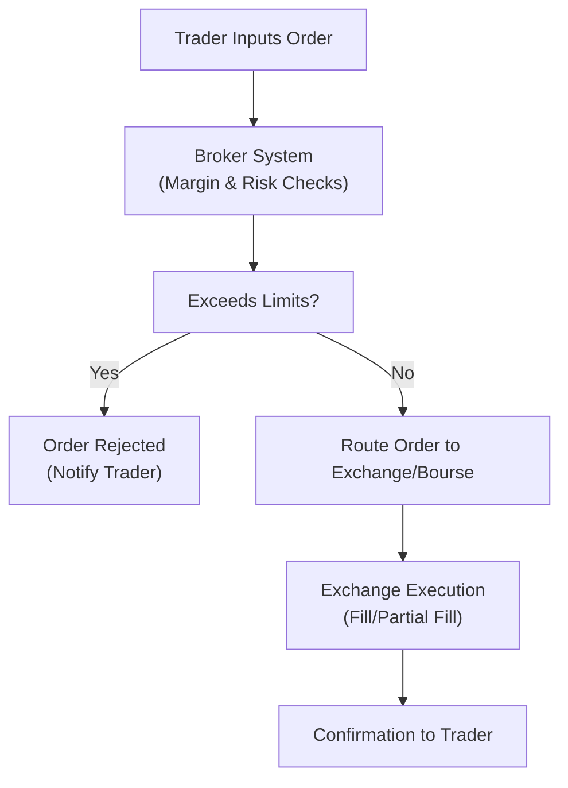

## 24.3 A Generic Order Entry Screen

When it comes to placing listed options orders (and if you’re anything like me when I first started), you might find yourself staring at a trading platform, looking for the right buttons to click, occasionally muttering, “Umm, is this the right symbol? Is it a put or a call?” Don’t worry, we’ve all been there. In fact, I still remember the day I mistyped a symbol, ended up buying something totally different, and nearly spat out my morning coffee when I realized I was long a call on the wrong underlying stock! Anyway, let’s talk step by step about each field you’re likely to see on a typical order entry screen so you can avoid that kind of fiasco.

A modern derivatives trading platform will generally present you with a consolidated “Order Entry” window or tab, with fields for each necessary input. In most cases, you can see these fields in a single screen or in a sequence. Below is a high-level structure depicting these elements in a simplified workflow:

```mermaid
flowchart LR
    A["Start (Launch Order Entry)"] --> B["Symbol Search/Lookup"]
    B --> C["Action Buttons <br/>Buy or Sell, Call or Put?"]
    C --> D["Quantity Field"]
    D --> E["Price Field <br/> (Market, Limit, etc.)"]
    E --> F["Time in Force <br/> (Day, GTC, IOC, etc.)"]
    F --> G["Account Selection"]
    G --> H["Margin/Buying Power <br/> Real-Time Update"]
    H --> I["Review and Confirm"]
    I --> J["Send Order <br/>(Execution)"]
```

In this section, we’ll break down these components, show you practical examples, and highlight how they tie into real-world trading. We’ll also discuss warnings or “risk checks” you might encounter along the way—things that help keep you (and your brokerage firm) safer from excessive losses or compliance issues. Let’s get going.

---

### Symbol Search/Lookup

• This is the first item you’ll see on almost every trading platform. You must ensure you’re selecting the correct underlying symbol. There’s often a search box where you can type in the company name or ticker symbol. The platform should guide you to a list of possible option “chains” (i.e., all the available call and put contracts across various strike prices and expirations).  
• Why it matters: A single letter of difference can change a lot. Buying call options on MNO vs. NOM or MON can lead to very different outcomes. Many platforms allow you to confirm if it’s the right underlying with additional info—like the stock’s exchange, most recent market price, or summary data.  

**Example:** You want to trade call options on “XYZ Inc.” The platform might display something like “XYZ (Toronto Stock Exchange).” Double-check you’re not mixing it up with a similarly named U.S.-listed stock.  

---

### Action Buttons (e.g., Buy/Sell, Call/Put)

• Once you have the correct underlying, find the portion of the screen where you tell the system what type of option you want and whether you want to buy or sell. Typically, there’s a dropdown or set of radio buttons labeled “Buy” or “Sell,” and another for “Call” or “Put.”  
• Some advanced platforms let you specify combined actions (e.g., spreads, straddles, or combos) in a single order ticket. For now, let’s keep it straightforward: a single-leg option buy or sell.  

**Common Pitfall:** Accidentally clicking “Buy to Open” when you intended “Sell to Close.” Or mixing up calls and puts. Many systems highlight your selection in a contrasting color (green for buy, red for sell), which is super helpful—just glance if you’re in “buy mode” or “sell mode” before proceeding.

---

### Quantity Field: Number of Contracts

• After specifying buy or sell, you indicate how many contracts you want to trade. Remember, in many North American markets, a single options contract typically covers 100 shares of the underlying. So when you type “3” for the quantity, you’re effectively controlling 300 shares.  
• Some new traders forget about the multiplier. If you see an order summary that says “300 shares,” that’s often because you typed in “3 contracts.”  
• This step might also tie into risk checks: Some brokerage platforms automatically display an “Estimated Dollar Value” or “Total Potential Exposure.”  

**Example:** On a user-friendly platform, if you type in “5” (contracts) in the Quantity field, it might show something like “Equivalent to 500 shares of XYZ Inc.” That’s a subtle but very helpful reminder of your real exposure.

---

### Price Field (e.g., Limit, Market, or Other Complex Instructions)

• Here’s where you define how much you’re willing to pay (when buying) or the price you want to receive (when selling). By default, many platforms place “Market” as the order type, meaning you’ll buy or sell at the best available price. But you might prefer using a “Limit” to set a maximum (buy) or minimum (sell) price.  
• Advanced fields: Some interfaces allow for more complex instructions like “Stop,” “Stop-Limit,” or custom triggers based on technical indicators. For example, you can set up a limit order that’s only triggered if the option moves above a certain threshold.  
• Proceed with caution on “Market” orders in illiquid options because you can get wide spreads and see a big difference between the bid and ask. As a friendly tip, if it’s a less liquid contract, always consider a limit order.  

---

### Time-in-Force (TIF) Menu (Day, GTC, IOC, etc.)

Time-in-Force (TIF) defines how long your order remains active. Below is a handy table summarizing common TIF choices:

| TIF Type         | Description                                                                                     |
|------------------|-------------------------------------------------------------------------------------------------|
| Day              | Order expires at the end of the trading day if not filled.                                      |
| GTC (Good Till Canceled) | Order remains open until manually canceled or until the broker closes it (often 90 days).  |
| IOC (Immediate-or-Cancel) | Order must fill immediately (at least partially) or it’s canceled. No partial fill is left open. |
| FOK (Fill-or-Kill) | Similar to IOC but requires the entire order to be filled immediately or canceled.            |

Certain platforms might also let you specify if the order is for regular market hours only or if it includes extended hours sessions. For most Canadian listed options, after-hours trading is typically not offered, so it’s usually not as relevant as with equities, but it’s still something to keep in mind.

---

### Account Selection

• If you’re a retail investor with a single account, this might be a non-issue. But if you manage multiple accounts—like you have a TFSA (Tax-Free Savings Account), RRSP (Registered Retirement Savings Plan), or a Margin Account—your trading platform might let you pick an account from a dropdown.  
• Institutional or professional traders often have a more complex setup. You might see an “Account ID” field or a “Client Code” so that trades get reported to the correct entity.  
• If you’re a licensed professional with a dealer, you might see an option to place trades in a “House account” or “Pro-trader account” vs. a “Client sub-account.” This ensures trades are properly allocated for compliance with CIRO regulations about proprietary vs. client trading.  

**Pro Tip:** In some systems, once you select the account, the system automatically updates margin or buying power info (discussed next). So if you’re playing around with different accounts, watch the margin changes carefully.

---

### Margin/Buying Power Update

• Modern trading platforms often provide real-time margin or buying power calculations as soon as you input your trade parameters. You might see a line that says: “Available Margin Before Order: CA$15,000” and “Available Margin After Order: CA$12,000.”  
• Why it matters: If you’re shorting options, or dealing in leveraged products, margin requirements can ramp up quickly. If you exceed the permitted margin, your broker might block the trade or ask you to deposit extra funds.  

**Risk Warnings:** Many systems will throw a warning if your potential margin usage surpasses a threshold. This is partially due to internal risk policies and partially because of mandated regulatory rules. For example, the Bourse de Montréal and CIRO have minimum functionality requirements for broker systems to ensure that clients do not accidentally blow up their accounts (or the firm’s risk capital).

---

### Review/Confirm Window

• Before you hit “Send,” many systems give you a summary screen. It might list the symbol, the action (buy/sell), the quantity, the order type, the TIF, and the estimated cost or credit.  
• Pay attention to any disclaimers. Sometimes you might see a pop-up: “Warning: This option has low liquidity” or “Warning: You’re close to exceeding your position limit for XYZ.”  
• If everything checks out, you click “Confirm” or “Place Order.” Once you do, the order is routed for execution.

At that point, the broker’s system might do additional “Risk Checks” or “Compliance Checks.” If the order contravenes certain rules—for instance, you’re trying to violate your personal position limit or some other regulatory constraint—the order could be rejected. You might get a message like, “Order Rejected: Exceeds maximum allowed contracts.” It might sound harsh, but that’s there to protect you and the marketplace.

---

### An Example Walkthrough

Let’s imagine you log in at 9:30 AM and want to buy 2 call option contracts for ABC Inc. which expires in three months at a CA$5.00 limit per contract.

1. In the “Symbol Lookup” box, you type “ABC.” You see “ABC Jan24 50.00C.” Perfect—this is the January 2024 call with a strike of $50.00.  
2. You pick “Buy,” “Call,” and enter quantity “2.”  
3. Price: select “Limit,” and type in “5.00.”  
4. Time-in-Force: “Day.”  
5. Account: If you have both a “Cash” account and a “Margin” account, you ensure “Margin” is selected because you want the flexibility of margin if needed.  
6. The platform shows a margin/buying power update. Maybe it says you have CA$10,000 of available margin. This trade requires an estimated CA$1,000 plus commissions. So your leftover margin after the trade might be CA$9,000 (hypothetical example).  
7. You click “Review,” see a summary that reads: “Buy 2 ABC Jan24 50.00C limit 5.00.”  
8. You confirm. Off it goes to the exchange or a market maker for possible execution.

---

### Additional Risk Checks and Position Limits

For large or leveraged orders, you may see:

• **Regulatory Position Limits:** Suppose the Bourse de Montréal sets a position limit at 25,000 contracts for a certain underlying. That might not sound relevant if you only want 2 or 10 contracts. But if you’re a big fish or an institutional trader, the system might automatically block you if you try to buy 30,000.  
• **Margin Overload:** If your margin spiked beyond your firm’s internal limit, you’d be flagged. You could get a phone call from the broker’s risk desk or an immediate rejection in your order screen.  
• **Concentration Risk:** Sometimes systems track how many open positions you hold in the same underlying or sector. They may issue a caution if you’re too concentrated.

It might feel frustrating, but these checks are there to keep both you and the broader market environment stable. 

---

### References and Regulatory Considerations

If you’re curious about the official stance on order entry, here are some references:

• **CIRO**: Check out CIRO’s website at [https://www.ciro.ca](https://www.ciro.ca) for up-to-date rules and guidance notes. They replaced IIROC and the MFDA, so if you’re digging up old references, just remember that those SROs no longer exist separately as of January 1, 2023.  
• **Bourse de Montréal Guidelines**: The Bourse de Montréal is pretty big on position and exercise limits, especially for certain index options. They publish notices and bulletins that clarify maximum contract positions and risk protocols.  
• **Paper Trading Platforms**: If you’re new, you can try “TD Direct Investing Paper Trading,” “Interactive Brokers Demo,” or other simulated platforms to practice placing orders without risking real capital.  
• **Open-Source Tools**: If you’re a tinkerer, you might enjoy frameworks like [QuantLib](https://www.quantlib.org/) to model or test your own risk scenarios or pricing strategies for different orders.

These resources will help you dive deeper into the behind-the-scenes mechanics of order entry and risk management.

---

### Best Practices, Pitfalls, and Pro Tips

1. **Double-Check the Symbol:** Always glance at the underlying. Even if the system auto-filled it, better safe than sorry.  
2. **Watch the Multiplier:** Make sure you’re aware of the contract’s share coverage (usually 100 shares, but not always).  
3. **Limit vs. Market Orders:** In options—particularly the less liquid ones—limit orders can protect you from big price gaps.  
4. **Keep an Eye on TIF:** Don’t inadvertently leave a Good-Till-Canceled order out there if you want to day trade.  
5. **Margin = Potential Leverage:** Be mindful that margin can amplify gains but also losses.  
6. **Review Button:** Take a moment to read that final summary. A quick check can prevent expensive mistakes.

All these steps come together so you can confidently place an options order with minimal stress. And yes, we all worry about messing up from time to time, but once you get used to the interface, it becomes second nature.

---

### Additional Mermaid Diagram:
Here’s another quick reference chart that highlights how risk checks and confirmations are integrated into a typical order flow for a broker-dealer in Canada:

---

By understanding each component on a generic order entry screen, you can reduce errors, trade more efficiently, and stay compliant with Canadian regulatory frameworks. It never hurts to build strong order-entry habits, especially as your portfolio (and your appetite for more advanced strategies) grows.

---

## Sample Exam Questions: Mastering a Generic Order Entry Screen for Options



### Which field on an order entry screen specifies how many options contracts you plan to buy or sell?
- [ ] Symbol Lookup
- [ ] Action Buttons
- [x] Quantity Field
- [ ] Time in Force Menu

> **Explanation:** The quantity field determines the number of contracts (each typically equivalent to 100 shares of the underlying) that the trader buys or sells.

### If your order is not filled immediately and you want it to stay open until the end of trading on the current day, which Time-in-Force (TIF) would you typically select?
- [ ] IOC (Immediate-or-Cancel)
- [x] Day
- [ ] GTC (Good Till Canceled)
- [ ] FOK (Fill-or-Kill)

> **Explanation:** A “Day” order remains active only through the trading day. If it’s not filled by market close, it automatically expires.

### What might occur if the margin requirement for a large short call position exceeds your available buying power?
- [ ] The order is automatically repriced to a Market Order.
- [x] The order may be rejected or flagged for risk review.
- [ ] The TIF is automatically changed to GTC.
- [ ] The system automatically closes your position.

> **Explanation:** When you exceed margin or risk limits, brokerage platforms often reject the order or flag it for manual risk review to ensure compliance with internal and regulatory guidelines.

### Which of the following fields ensures you have selected the correct derivative to trade on a particular underlying instrument?
- [ ] Quantity Field
- [ ] Time-in-Force
- [x] Symbol Lookup
- [ ] Risk Check Prompt

> **Explanation:** The Symbol Lookup confirms you’re trading the correct underlying. It helps avoid errors, especially if there are multiple instruments with similar tickers.

### Which statement best describes a “Market” order for an options contract?
- [ ] You must specify an exact price limit.
- [ ] You define a minimum acceptable fill quantity.
- [x] It executes at the best available market price.
- [ ] It automatically splits your order into smaller increments.

> **Explanation:** A Market order tells the broker to fill the trade at the best available price immediately, without a specified limit price.

### In a typical order entry screen, which field lets you designate if you’re placing a “Buy” or “Sell” order and if it’s a “Call” or a “Put”?
- [ ] Symbol Search
- [ ] Quantity
- [x] Action Buttons
- [ ] TIF Menu

> **Explanation:** Action buttons (or radio buttons) allow traders to specify whether they want to buy or sell puts or calls.

### If you see a pop-up warning such as “This order would exceed your allowed position limit,” what is the most likely outcome?
- [x] The order will be rejected or require manual approval.
- [ ] The platform converts the order into a partial fill to comply with limits.
- [ ] Your margin usage is automatically adjusted to allow the position.
- [ ] No effect; it’s just a courtesy notice.

> **Explanation:** Exceeding position limits typically results in the order being blocked unless you reduce the size or receive special approval.

### Which of the following TIFs requires an order to be filled in entirety immediately or canceled?
- [x] FOK (Fill-or-Kill)
- [ ] Day
- [ ] GTC
- [ ] IOC

> **Explanation:** Fill-or-Kill means the entire order must be executed instantly; otherwise, it is canceled right away.

### What is the main benefit of a final “Review/Confirm” window before sending an options order?
- [ ] It gives you more time to secure margin financing.
- [ ] It calculates your personal risk tolerance level.
- [x] It displays a summary of all details to help prevent mistakes.
- [ ] It automatically picks the best order route on your behalf.

> **Explanation:** A review/confirm window summarizes the order details, letting the user check for accuracy one last time.

### True or False: The “Margin/Buying Power Update” on your order entry screen is only informational and never impacts whether your order gets accepted.
- [ ] True
- [x] False

> **Explanation:** False. If your order exceeds your available margin, the platform will often reject or hold the order until you deposit additional funds.



