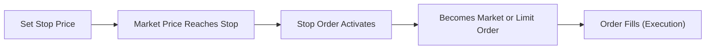
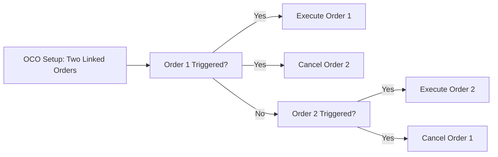

## 24.5 Types of Contingent Orders

Imagine you’re watching your favorite stock or option, and everything suddenly moves—fast. You’re thinking, “Um, do I really want to sit here and stare at this all day?” That’s where contingent orders come in. They’re kind of like the auto-pilot feature for your trades, kicking in only when something specific happens in the market. But, just like auto-pilot, they can be tremendous if configured correctly or they can lead to some real mishaps if you aren’t sure what you’re doing.

Below, we’ll dig deep into a few powerful types of contingent orders. In simplest terms, a contingent order is any order that only goes active, or “fires,” if some pre-set market condition is met. If you’re trading listed options, these conditions can be based on the option’s price itself or the price of the underlying security (e.g., the stock). They can also be triggered by other parameters, like specific time intervals or volatility levels, but we’ll focus on market and price triggers.

Many Canadian market participants lean on contingent orders to handle unexpected volatility or to capture specific price moves automatically. However, keep in mind that the Canadian Investment Regulatory Organization (CIRO) expects you to be aware of best practices, slippage risks, and your responsibilities as a market participant. Let’s break down the major types of contingent orders that you’ll find in the listed options world.

---

### Stop Orders
Stop orders are often referred to as “stop-loss” (when you’re trying to sell) or “stop-buy” (when you’re trying to buy). A stop order is basically a sentinel, waiting for the asset (or underlying stock) to reach a certain price. Once that threshold is touched, the order turns into a market or limit order (depending on which flavor you chose). 

#### Stop-Loss (Sell Stop)  
This one’s typically used to shield yourself from further losses if the price falls below a certain point. Let’s say you bought a call option at C$2.00, and you decide that if the call trades down to C$1.00, you want out before it (potentially) goes to zero. You enter a stop-loss sell order with a stop price of C$1.00. If the option hits that level, your stop order “activates” and is sent to the market, usually as a market order. If the market is liquid, you might get an execution near C$1.00. If liquidity is thin or the market is dropping like a rock, you might get filled at a much lower price due to slippage.

#### Stop-Buy (Buy Stop)
A buy stop order instructs your brokerage platform to buy if the market rises above a certain threshold. If you have a short call or short put position, you might protect yourself in case the option’s price spikes. Alternatively, you might have no position at all but want to jump on a momentum rally if the underlying stock breaks a key level. So, maybe you set a stop-buy at C$2.80 on a call option that is currently trading at C$2.50, anticipating a breakout. Once the call hits C$2.80, your order triggers, and you attempt to buy the option. 

These orders are popular, but you gotta be mindful of how quickly the market can move. In some fast markets, you could face partial fills—or fill at really unpleasant prices—depending on order flow.

#### Basic Stop Order Flow

Below is a simple Mermaid diagram illustrating the flow of a stop order, from setting the trigger to the eventual execution.

Here, once the market price “B” is touched or exceeded, the order transitions (“C”) and is submitted for execution (“D” and “E”). Under normal circumstances, if it’s a stop-loss, it becomes a sell market or sell limit order; if it’s a stop-buy, it will become a buy market or buy limit order. 

---

### Stop-Limit Orders
If regular stop orders shift into “market” mode once triggered, stop-limit orders add one more protective layer: they convert into limit orders once the trigger is reached. This helps you control your execution price. Of course, control comes at a cost: you may not get filled at all, especially if the option’s price jumps (or plummets) beyond your set limit during a big market move.

Let’s say you set a stop-limit order to sell your call option at a C$1.00 stop, with a limit price of C$0.90. If your option hits C$1.00, your order activates and becomes a limit order to sell at C$0.90 or better. If the market instantly plunges to C$0.70, you might not get executed until (and unless) it comes back up to C$0.90 or better.

Stop-limit orders are a bit tricky because new traders often assume “stop-limit” is the same as “stop-loss.” Not exactly. A stop-limit might prevent some of the slippage you get with a straight stop market order, but it also introduces the risk of not getting filled at all. 

---

### One-Cancels-the-Other (OCO) Orders
OCO orders are effectively two separate orders bracketed together, such that if one is executed, the other is immediately cancelled. They’re a cool way of setting up a “take-profit or stop-loss” scenario. For instance, if you have a long call, you might place:

• A limit order to sell if the option’s price rises to, say, C$3.00 (your profit target).  
• A stop-loss order to sell if the option’s price drops to C$1.00 (your pain threshold).

If either event happens—i.e., the call goes up and hits C$3.00 or tumbles to C$1.00—whichever order is triggered first will get filled (assuming the market cooperates), and the other one is cancelled automatically.

#### Simple OCO Flow

When one order in the bracket fires, the other is voided. This helps you avoid a situation where you’d accidentally double-sell or double-buy. 

---

### One-Triggers-the-Other (OTO) Orders
This one’s a bit like passing the baton in a relay race. An OTO order means the execution of the first order triggers a second order to be entered. For example, suppose you want to buy a call option if the underlying stock breaks above a certain resistance level. Once that “buy call” order is filled, you want to automatically place a stop-loss order to protect that position. So you do an OTO:

1. The first order: “Buy call at $2.50 if triggered.”  
2. Once you’re filled on that buy, the platform automatically places a stop-limit sell at $1.50 to protect your new position.

If for some reason your initial buy order never fills, the stop-limit portion never even hits the market. This approach can help you stay disciplined and avoid impulsively forgetting to place your protective orders.

---

### Why Use Contingent Orders?
I still remember a friend who used to babysit his stock positions. He’d watch them all day, anxiously ready to click “sell” if things looked dicey. One day, the market tanked in minutes, and by the time he clicked, it was too late—he’d lost a good chunk. Contingent orders can prevent that scenario. They automate your exit or entry at specific triggers. Here are a few major benefits:

• **Risk Control**: For instance, you can limit potential losses on an option if it drifts out-of-the-money.  
• **Profit Protection**: OCO orders let you simultaneously aim for a take-profit level while also setting a stop.  
• **Peace of Mind**: You can step away from your screen without worrying that you’ll miss your signals. 

---

### Potential Pitfalls & Slippage
Contingent orders aren’t perfect. In very fast-moving markets—especially in options with less liquidity—your stop might trigger at a certain price, but the fill could be significantly different (slippage). Also, there’s no guarantee everything will be filled, especially with stop-limits or advanced multi-leg OCO strategies. Partial fills can occur if there isn’t enough volume at or near your limit price. 

On top of that, Canadian regulations (facilitated via CIRO bulletins) stress that you must understand best execution requirements and trade-through protection. If a large order triggers at an inopportune moment, there’s a possibility the execution might skip over a better-priced order in a different marketplace, especially if your broker’s route is not scanning multiple venues quickly. This is one reason it’s a good idea to talk to your dealer or broker about how they handle best execution—it’s not all identical across the board.

---

### Regulatory and Global Perspectives
Here in Canada, the Canadian Investment Regulatory Organization (CIRO) is our national self-regulatory body overseeing investment dealers and marketplace integrity. They often issue bulletins and guidance regarding the usage of contingent orders, best execution practices, and safe leverage. (Remember, CIPF—Canadian Investor Protection Fund—protects client assets up to certain limits if a member firm becomes insolvent, but it does not protect you from market losses.)

If you look abroad, well, the Monetary Authority of Singapore (MAS) and the European Securities and Markets Authority (ESMA) also offer guidelines on order types, including contingent orders. Even though those frameworks are outside Canada, they show similar cautionary notes on “gapping risk” and partial fills. 

---

### Practical Examples in Options 
Let’s quickly run through a typical scenario:

• **You own a long call** on a well-known tech stock. The call is trading at C$2.00.  
• **You set an OCO**: One is a limit sell at C$3.00 (target profit), the other is a stop at C$1.00 (acceptable loss). If the price rockets to C$3.00, great, you automatically get out with a profit, and the stop order is cancelled. If the option falls to C$1.00 first, you’re out, and your limit order is cancelled.  
• **Alternate approach**: You might choose to set a stop-limit order for the bottom side, picking C$1.00 as the trigger and C$0.90 as the limit. This way, you won’t accept a price below C$0.90. The risk is obviously that if the price freefalls below C$0.90, you might not get out at all.  

Anyway, the main takeaway is that each of these tools can be a game-changer—if you plan carefully. The challenge is ensuring they’re part of a broader risk management plan, not just random instructions you throw at your broker.

---

### Best Practices and Tips
• **Communicate with Your Broker**: Some platforms handle contingency orders differently. Ask about partial fills, slippage, and how your orders are routed.  
• **Check Option Liquidity**: Illiquid contracts can cause major nightmares with wide bid-ask spreads. A stop or OCO in such contracts might not trigger at a fair price.  
• **Set Realistic Triggers**: Random thresholds can lead to random outcomes. Tie your triggers to specific technical or fundamental levels.  
• **Monitor After the Order Is Placed**: Even though contingent orders are automated, keep half an eye on them. Market conditions can change, or you might want to revise the order if the situation evolves.  
• **Backtest Strategies**: If your trading platform allows it, test how your contingent orders would’ve performed in past market conditions. This can reveal potential issues upfront.

---

### Additional Resources
• **CIRO**: https://www.ciro.ca – Check out bulletins for best execution practices and trade-through protection updates.  
• **CIPF**: https://www.cipf.ca – Canada’s sole investor protection fund since the merger of CIPF and MFDA IPC.  
• **Monetary Authority of Singapore (MAS)**: https://www.mas.gov.sg – Global perspectives on derivatives regulations.  
• **European Securities and Markets Authority (ESMA)**: https://www.esma.europa.eu – Their guidelines echo many best practices relevant to stops and limit orders.  
• **“Trading Options For Dummies” by Joe Duarte** – A straightforward guide for expanding your knowledge on contingent orders in the options space.

---

## Sample Exam Questions: Mastering Contingent Orders



### Which of the following best describes a stop-loss order?

- [ ] An order that ensures a guaranteed price level for an option.
- [x] An order designed to exit a position if the market price moves beyond a preset threshold, typically to limit losses.
- [ ] An order type that simultaneously executes two opposing trades.
- [ ] An order that only triggers if the option’s price rises to a certain level, then places a separate order to take profit.

> **Explanation:** A stop-loss order is meant to mitigate risk by automatically exiting your position if the market moves against you, beyond a specified “stop” level.

### How does a stop-limit order differ from a traditional stop order?

- [ ] A stop-limit order is triggered by time intervals, while a stop order depends on market conditions.
- [x] A stop-limit order becomes a limit order after the stop is triggered, while a stop order often becomes a market order.
- [ ] A stop-limit order only applies to bullish strategies.
- [ ] There is no practical difference between a stop-limit order and a stop order.

> **Explanation:** Once triggered, a traditional stop order will generally execute at the next available price (market order), whereas a stop-limit order converts into a limit order with a specified price threshold.

### In an OCO (One-Cancels-the-Other) setup, what happens when one order is triggered and filled?

- [x] The other order is automatically cancelled.
- [ ] The other order remains active until manually cancelled.
- [ ] Both orders execute in tandem.
- [ ] The first order is placed on hold until the second order triggers.

> **Explanation:** OCO orders are paired instructions. If one triggers, the other is cancelled to avoid accidental double execution.

### Which contingent order type places a secondary order only after the initial order has been filled?

- [ ] Stop-loss order
- [ ] OCO order
- [x] OTO order
- [ ] Stop-limit order

> **Explanation:** An OTO (One-Triggers-the-Other) order defers the second order until the first is filled, providing a sequential approach to executing multiple trades.

### What is the primary benefit of using a stop-limit order over a stop market order?

- [x] You have more control over the execution price.
- [ ] You are guaranteed a fill even in fast-moving markets.
- [x] You can potentially avoid large slippage if the market gaps.
- [ ] You can lock in unlimited profit.

> **Explanation:** Stop-limit orders convert to limit orders to prevent executions beyond your desired price. However, this also means you may not get filled at all if the market moves too quickly.

### Which of the following might be a drawback of a stop-limit order?

- [x] The order may not get filled if the market price moves beyond the limit.
- [ ] It is always filled at your exact limit price, regardless of market conditions.
- [ ] It blocks you from placing OCO orders at the same time.
- [ ] It requires you to place a second order manually once filled.

> **Explanation:** The key trade-off of a stop-limit order is that if the market price moves beyond the limit, you might miss the trade entirely.

### In an OCO setup for a long call position, one order is a limit sell at a profit target. The other order is:

- [x] Typically a stop-loss to limit downside.
- [ ] A second limit sell at a lower profit target.
- [x] Potentially a stop-limit order if you wish to control the exit price.
- [ ] A market buy order to double the position size.

> **Explanation:** The OCO pairing often combines a profit target limit order and a stop order (or stop-limit) to limit losses on the same position.

### If your stop-buy order is triggered due to a fast upward move in the option’s price, what risk might you face?

- [x] Slippage and being filled at a higher price than expected.
- [ ] Forced liquidation of your existing positions.
- [ ] Reversal of your order into a stop-loss order.
- [ ] Extension of the time value on the option.

> **Explanation:** In a sharply rising market, a stop-buy order can fill at a higher price than the trigger level, referred to as slippage.

### Under CIRO guidelines, how should market participants handle contingent orders to ensure best execution?

- [x] They must understand how each order type works and be aware of possible market fragmentation or liquidity shortages.
- [ ] They must only place contingent orders in highly liquid stocks and never in options.
- [ ] They must use only OCO orders with no alternative allowed.
- [ ] Best execution is not required for contingent orders.

> **Explanation:** CIRO expects diligence in placing orders, especially contingent ones, to minimize trade-throughs and ensure the best obtainable price, taking into account liquidity and order routing practices.

### True or False: Using contingent orders completely eliminates the possibility of incurring losses beyond the stop or limit price.

- [x] True
- [ ] False

> **Explanation:** This statement is actually false in the strictest sense, but if it were referencing the theory behind stop orders, many traders believe it “guarantees” they’ll exit at or near the chosen level. The reality is that the market can gap well past your stop or limit price, leaving you with unexpected losses. Always be aware that stop and stop-limit orders do not guarantee fills at the exact stop level.



---

You should now have a strong overview of contingent orders: how to set them up, where they can help, and where you can slip up if you aren’t careful. Although they can’t guarantee perfect fills, they can bring structure and discipline to your option trading strategy—whether to lock in profit targets, protect against losses, or chain multiple orders together in an automated sequence.

Feel free to dive deeper into practical guides like “Trading Options For Dummies” or academic writings from the Monetary Authority of Singapore (MAS) and the European Securities and Markets Authority (ESMA). And always remember: these tools are only as good as your strategy and understanding of how they truly work under real market conditions!
