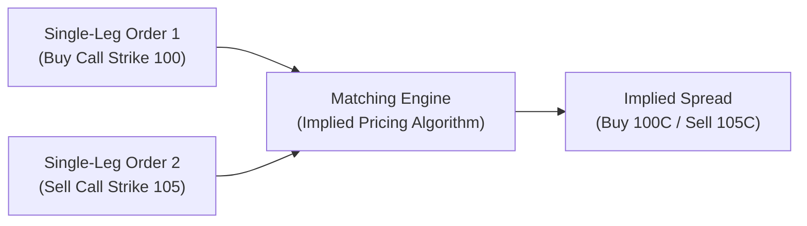
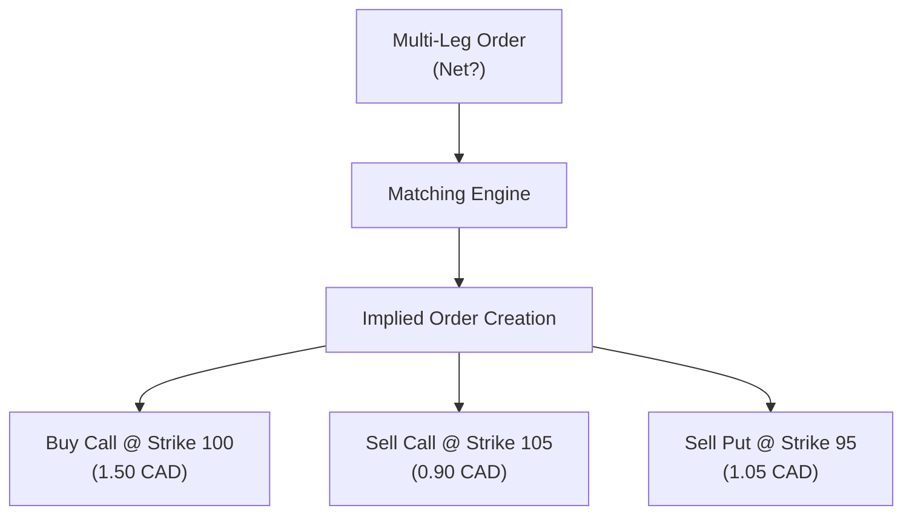

## 24.6 Implied Orders and the Bourse de Montréal’s Implied Pricing Algorithm

Have you ever placed a multi-leg option order—say, a vertical spread—and wondered how the exchange manages to fill your two-leg strategy so smoothly when one side might not have a matching counterparty with the exact same plan? It can feel a bit magical, right? Well, the real hero behind this “magic” is something known as an implied order. Implied orders serve as an automated method for exchanges—like the Bourse de Montréal—to generate new orders from existing ones, improving the likelihood that multi-leg strategies will get filled at competitive prices. In this section, we’ll dive into the idea of implied orders, look at the Bourse de Montréal’s implied pricing algorithm, and explore how it fosters greater liquidity and faster fills for complex option strategies. And, you know, we’ll also talk about the times when things can get tricky.

Before we really dig in, let me share a quick personal anecdote. A while back, I tried to leg into a simple call spread by placing each side separately. I entered a limit order to purchase a long call option and then, after a moment, placed another limit order to write a call at a slightly higher strike. I thought everything was going smoothly—until market prices shifted, and I only got filled on one leg, leaving me with a weird position that wasn’t what I intended. Sound familiar? This is precisely where implied orders can come to the rescue. The Bourse de Montréal’s matching engine, for instance, can automatically combine the separate single-leg orders in the market into a “virtual multi-leg” order, so you don’t get stuck with partial fills. Let’s see how it all works.

### Why Implied Orders Matter

An implied order is basically an artificially derived order that the exchange creates from other orders already resting in the order book. The idea is to piece together separate bids and offers in such a way that a multi-leg strategy (like a spread) can be matched, even when the exact multi-leg order isn’t explicitly resting in the book. This tactic aims to:

• Reduce missed trading opportunities: If you want to buy a call spread, and there’s a buyer for the upper strike call and a seller for the lower strike call at compatible prices, the system can combine these to fill your spread request, even if no single participant placed both legs simultaneously.  
• Enhance liquidity: By effectively linking different markets (e.g., different strikes, maturities), the Bourse de Montréal’s implied pricing algorithm ensures that the best possible markets are combined to form tradable spreads, making it easier for you to get filled.  
• Facilitate better pricing: Sometimes, implied orders can uncover price relationships across multiple strikes or expirations that a single-leg approach might miss. This can lead to tighter spreads or more favorable execution prices for multi-leg trades.

### How the Matching Engine Handles It All

The Bourse de Montréal operates an electronic matching engine that is constantly scanning its order book. This matching engine looks across:

• Single-leg orders (just a regular buy/sell of an option on a particular strike and expiry)  
• Multi-leg orders (explicit spread orders, combos, straddles, or other multi-component structures)

It then calculates possible implied combinations. Let’s dissect a hypothetical scenario:

1. Trader A posts a single-leg order to buy 10 XYZ calls at a strike of 100 for a premium of CAD 2.00.  
2. Trader B posts a single-leg order to sell 10 XYZ calls at a strike of 105 for a premium of CAD 1.10.  
3. Trader C wants to simultaneously buy the 100-strike call and sell the 105-strike call as a spread at a net premium of CAD 0.90 (or something close to that).

If no direct multi-leg order from Trader A or B currently sits at that net price, the Bourse’s implied pricing algorithm can look at Trader A’s limit and Trader B’s limit, see if the net price for the spread can be matched. If it can, it creates an “implied spread order” that effectively marries Trader A’s willingness to sell the call at 2.00 (fulfilling the buy side for Trader A’s order from Trader C’s perspective) with Trader B’s willingness to buy the call at 1.10 (fulfilling the short side for Trader C’s order). The matching engine then checks if this synthetic spread (2.00 – 1.10 = 0.90) meets or improves upon any resting multi-leg requests (Trader C’s net premium target). If it does, a trade is generated. Pretty nifty, right?

### Digging into the Bourse de Montréal’s Implied Pricing Algorithm

People often call it the “implied pricing engine” or the “implied spread generation logic.” In essence, this is a set of rules, coded into the exchange’s infrastructure, that:

• Identifies cross-market relationships: The algorithm scans for possible ways to combine existing orders in different option series (or even futures and options, in some cases) to form a new price.  
• Aggregates partial or multiple legs: If you’re trying to complete a spread that requires two or more legs, the algorithm hunts for the needed single-leg orders or partial multi-leg orders.  
• Prioritizes fair matching: Thanks to oversight by CIRO (the Canadian Investment Regulatory Organization), the Bourse must ensure that existing single-leg orders are not put at a disadvantage. Orders that existed first at a given price typically hold time priority if multiple implied combinations become available at once.  
• Updates in real time: As new orders arrive or as old ones are filled or canceled, implied orders are recalculated or canceled so that the market data accurately reflects the best possible trading combinations.

It’s not just about spreads, either. The algorithm can help with strategies like straddles (buying or selling both a call and put with the same strike and expiry), strangles (buying or selling a call and put with the same expiry but different strikes), and more complex multi-leg structures. Whenever partial legs in the order book can be combined to fill a multi-leg request, the exchange’s matching engine can create implied orders. This is designed to reduce the risk that a trader would have to “leg in” manually, which can lead to partial fills or suboptimal pricing if the market moves.

### Visualizing the Process with a Mermaid Diagram

Here’s a simple conceptual diagram to illustrate how an implied order might be created from separate single-leg orders:

In this simplified illustration, the matching engine (D) takes in single-leg orders A and B and generates an implied spread order C whenever the prices align in a way that meets or improves upon the multi-leg (spread) market available.

### Trading Example: Call Spread on the Bourse de Montréal

Let’s say you’re bullish on a Canadian bank stock, but you want to limit your capital outlay. You decide to do a call spread: buy a 95-strike call and write a 100-strike call in the same expiry month. You input a total net debit you’re willing to pay (e.g., CAD 2.50).

• You submit this as a multi-leg order directly, specifying the net premium.  
• The matching engine scours the order book. It sees a resting limit sell order for the 100-strike call at CAD 1.70. It also sees a resting buy order for the 95-strike call at CAD 4.20.  
• If implied logic (4.20–1.70=2.50) matches your net, bingo: your multi-leg order is filled without you having to break it down into two separate orders and hope the market doesn’t move away while you do so.  
• Alternatively, if the single-leg market changes to 4.25 bid at 95 strike and 1.75 offered at 100 strike, the implied net would be 2.50, so you’d still fill at your limit.

### The Dreaded Partial Fill and How Implied Orders Help

We already joked about my “half-filled call spread fiasco.” That partial fill scenario often happens when you’re forced to leg in manually. The first leg might get done at a decent price, but by the time you try to secure the second leg, other market participants have adjusted their orders or the underlying’s price has changed. Suddenly, the second leg is out of reach or has become way more expensive. In the worst case, you end up holding a naked call or a single long call with no offsetting short leg, which changes your profit/risk dynamics.

Implied orders drastically lower this “legging risk” because the system tries to fill both legs simultaneously—virtually making sure you get the net price you asked for, or no fill at all. That’s a huge plus for any spread, straddle, butterfly, or other multi-part order.

### Regulatory Oversight and Fairness

Implied orders operate under strict parameters to ensure they don’t disadvantage existing single-leg orders. CIRO—Canada’s current self-regulatory organization—enforces relevant rules around best execution, fairness, and transparency. The Bourse de Montréal’s technology and rulebook must:

• Ensure time priority is respected: If a single-leg order was there first at a certain price level, it should not be bypassed by a newly created implied order at the same price.  
• Provide full transparency: Traders can see the best quotes, including implied ones, so they have an accurate view of the market.  
• Reflect changes quickly: If a single-leg order is modified or canceled, any implied order depending on it must also be updated or removed.

Furthermore, for those who enjoy flipping through the fine print, you can check out the Bourse de Montréal’s “Implied Strategy” guidelines and technical updates at www.m-x.ca. This documentation details the underlying technology specifications for how implied orders are generated, displayed, and matched.

### Global Comparisons and Best Practices

If you trade on other global derivatives exchanges like CME Group (in the U.S.) or Eurex (in Europe), you might notice a similar approach. Many large exchanges use implied order functionality to connect their futures and options markets. This fosters deeper liquidity but can also lead to complexities around margin requirements and partial executions. Best practices often revolve around:

• Using Good-til-Canceled (GTC) or day orders that specify a net premium, letting the implied engine work on your behalf.  
• Keeping track of your execution reports to ensure that if you do get a fill, you see the correct price allocations across each leg.  
• Monitoring your margin closely. If you are combining multiple short options, for instance, ensure that your risk and capital usage are always in line with your broker and CIRO’s guidelines.

### Potential Challenges and Pitfalls

Just because implied orders exist doesn’t mean life is flawless. There are some issues to be mindful of:

• Complex strategies with many legs: The Bourse de Montréal’s implied engine typically supports strategies up to a certain number of legs. If you get into truly multi-legged, fancy strategies (like an iron butterfly combined with an outright put purchase), you might not have a straightforward implied order generation.  
• Price constraints: Sometimes, the algorithm might not generate an implied order if it would lead to a net premium below or above certain thresholds (e.g., negative premiums).  
• Latency and dynamic changes: The market can move very fast, so the implied order you rely on might vanish if the single-leg orders get filled or canceled. This is common across all electronic markets, so it pays to keep an eye on real-time quotes.  
• Potential for “phantom liquidity”: Some participants might see large implied quotes and assume there is actual volume behind them. However, the volume is contingent on the interplay of multiple orders, so it can disappear if any piece of that puzzle is canceled or filled elsewhere.

### Using Open-Source Tools and Additional Resources

If you’re someone who likes to dig deeper into data analytics or create automated trading strategies, exploring how implied orders are displayed in market data can be fascinating. Some open-source financial tools, like certain Python libraries or R packages designed for market microstructure analysis, can help parse real-time data feeds (though the Bourse’s direct feed typically requires specialized access).

Additionally, you might look at:

• Bourse de Montréal’s official feeds and application programming interfaces (APIs).  
• White papers from CME Group or Eurex discussing the dynamics of implied order books across futures and options.  
• CIRO’s electronic trading and algorithmic trading rules, which provide a framework for fair and orderly markets, ensuring that any algorithmic creation of implied orders still respects best execution.

### Practical Tips for Traders

• If you’re placing a multi-leg strategy, try entering it as a single multi-leg order specifying the net debit or credit you desire, rather than placing multiple single-leg orders. This harnesses the power of implied order matching for better fills.  
• Keep an eye on the implied price: Even if you plan to do single-leg trades, understanding where implied quotes might land can help you gauge the “fair value” of partial legs.  
• Always confirm your fill reports to see if you were filled via implied order or directly. Some broker platforms will show you at which price each leg was officially executed.  

### Mermaid Diagram: Multi-Leg Implied Matching

Let’s illustrate an example involving three option legs. Suppose we have a call spread plus a put sale. The matching engine tries to match each piece from existing single-leg orders.

In this scenario, the engine (O) sees single-leg quotes or partial multi-leg quotes in the marketplace for the 100 Call, 105 Call, and 95 Put. If it can combine them to match the net price requested by D, it will generate one or more implied orders (E) enabling the trade to execute.

### Keeping Current with CIRO and Regulatory Updates

Since CIRO oversees the regulatory landscape for derivatives trading in Canada, always keep an eye on their website (https://www.ciro.ca) for:

• Changes to margin or capital rules that might affect how multi-leg strategies are collateralized.  
• Updates on electronic trading protocols, including algorithmic functionality.  
• Guidance notes on how best execution policies relate to implied orders.  

Remember, back in the day, IIROC and MFDA were separate. They amalgamated into CIRO in 2023, so any historical references you see to the “old SROs” are just that—historical. CIRO is now the single, national self-regulatory organization.

### Conclusion

Implied orders may sound a bit mysterious, but at heart, they’re a straightforward concept. By automatically blending different existing single-leg or multi-leg orders, the Bourse de Montréal’s implied pricing algorithm pursues greater liquidity and fairer prices for everyone—especially you, the trader placing a multi-leg order. So the next time you see your complex spread get filled in one shot—no partial fill headache, no “legging risk”—remember that behind the scenes, the exchange is using implied logic to make it happen.  

Embrace these tools, stay aware of the potential pitfalls, and customize your trading approach with the knowledge that technology is on your side to deliver quick executions and (hopefully) better pricing.

---

## References for Further Exploration

• Bourse de Montréal: (www.m-x.ca) – Look under “Implied Strategy” technical guides.  
• CIRO Rules and Notices: (https://www.ciro.ca) – Especially their guidance on electronic and algorithmic trading.  
• CME Group White Papers on Implied Order Matching – Can be found at www.cmegroup.com.  
• Eurex Webinars on Spread Trading – Check their resource library for archived educational sessions.  
• Open-Source Tools: Search GitHub or PyPI for “options market making” or “implied spread logic” to see community-driven analytics projects.

## Sample Exam Questions: Implied Orders and the Bourse de Montréal’s Implied Pricing Algorithm



### A multi-leg spread order on the Bourse de Montréal can often be filled by implied orders when:
- [x] Different single-leg orders in the order book can be combined to match the spread’s net price. 
- [ ] There are no single-leg orders in the order book. 
- [ ] The strategy is for more than five option legs. 
- [ ] The spread cannot be filled explicitly.
> **Explanation:** Implied orders derive from combining existing single-leg (or multi-leg) orders to fulfill a multi-leg strategy’s net credit or debit requirement. 

### Which of the following is the main benefit of implied orders for traders?
- [x] Reduced risk of partial or mismatched fills on multi-leg strategies.
- [ ] Guaranteed profit based on time priority rules.
- [ ] Elimination of all transaction fees on options.
- [ ] Automatic margin waivers from the broker.
> **Explanation:** Implied orders save traders from having to leg in separately, thus reducing the risk of partial fills.

### When the Bourse de Montréal’s matching engine calculates an implied order, it:
- [x] Combines resting orders to create a new synthetic (implied) price for a multi-leg strategy.
- [ ] Rejects all single-leg orders in favor of multi-leg only.
- [ ] Requires regulatory pre-approval from CIRO for every implied transaction.
- [ ] Automatically shifts the time priority from older orders to newer ones.
> **Explanation:** The matching engine scans existing orders and creates a synthetic multi-leg price. Time priority remains with the orders that were there first.

### A trader wants to enter a two-leg spread on the Bourse. To maximize the chance of a complete fill:
- [x] Submitting a multi-leg order specifying the net debit/credit often leverages implied order functionality.
- [ ] Always leg in each side separately to secure the best individual prices.
- [ ] File a formal request with CIRO for an implied spread creation.
- [ ] Use only market orders on each leg in the hope the system finds a match.
> **Explanation:** Entering a multi-leg order at a net price encourages the matching engine to create or use implied orders, limiting legging risk.

### Which of the following is a typical oversight function of CIRO in relation to implied orders?
- [x] Ensuring fairness and transparency so single-leg orders are not disadvantaged.
- [ ] Guaranteeing a minimum fill size for all implied orders.
- [x] Monitoring high-frequency trading algorithms that generate or interact with implied orders.
- [ ] Setting dividend rates for all securities traded in Canada.
> **Explanation:** CIRO oversees best execution, fair market practices, and can monitor algorithmic trading but doesn’t guarantee minimum fills or set dividend rates.

### What is a key risk if a trader attempts to “leg in” manually instead of relying on implied orders for a spread?
- [x] They might get filled on one leg but miss the other because market prices can move.
- [ ] Margin requirements are automatically waived for single-leg manual trades.
- [ ] Manual legging is always cheaper in commission costs.
- [ ] The Bourse prohibits placing single-leg orders during multi-leg attempts.
> **Explanation:** Prices can change rapidly, leaving one leg unfilled or at a worse price, which is a primary driver behind implied order functionality.

### Implied liquidity in an options market refers to:
- [x] Additional, virtual liquidity generated by combining resting orders into multi-leg orders.
- [ ] Liquidity provided only by designated market makers.
- [x] Liquidity that disappears only once real trades begin to execute.
- [ ] Total daily volume divided by open interest.
> **Explanation:** Implied liquidity arises when the exchange’s engine generates new synthetic combinations from existing orders, although it can vanish if those underlying orders get filled or canceled.

### A possible downside of implied orders for traders:
- [x] “Phantom” liquidity that may vanish if a single-leg order disappears.
- [ ] Mandatory short position assignment.
- [ ] CIRO penalties for using multi-leg orders.
- [ ] Inability to see the implied quotes in the live market feed.
> **Explanation:** Implied orders are contingent on the underlying single-leg orders. If they get canceled, that implied liquidity also evaporates.

### Which of the following statements is true about the Bourse de Montréal’s implied pricing algorithm?
- [x] It recalculates implied orders in real time based on changes in the order book.
- [ ] It only updates once daily upon the market close.
- [ ] It is purely manual and requires a broker to input new net prices.
- [ ] It is illegal under CIRO rules to use an implied pricing algorithm.
> **Explanation:** The implied pricing engine updates whenever new orders come in or old orders are canceled, allowing real-time creation or removal of implied quotes.

### Implied orders primarily help traders by:
- [x] Matching multi-leg strategies more efficiently.
- [ ] Providing guaranteed risk-free arbitrage opportunities.
- [ ] Freezing the price of an underlying asset.
- [ ] Limiting the types of orders a participant can submit.
> **Explanation:** Implied orders aren’t a magic bullet for guaranteed profits, but they do allow multi-leg strategies to execute more efficiently, reducing leg-in risk.


