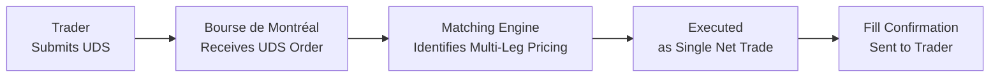
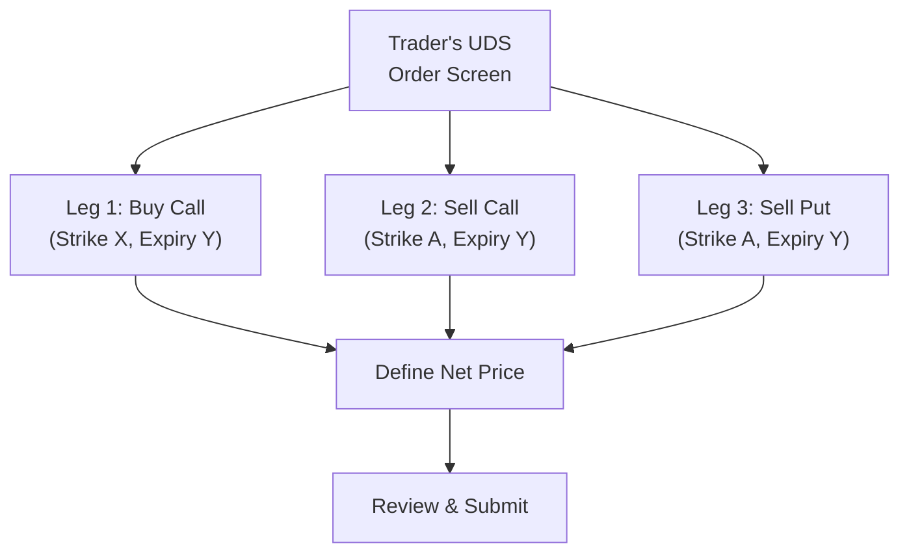

## 24.7 The Bourse de Montréal’s User-Defined Strategies (UDS) Functionality

Sometimes, you just wish you didn’t have to juggle multiple option legs one by one—buy one leg, sell another, watch the market move in the meantime—yikes, it can be nerve-wracking. That’s exactly the headache the User-Defined Strategies (UDS) tool at the Bourse de Montréal aims to fix. I remember the first time I was entering a multi-leg strategy manually: I entered the first leg of a vertical spread, got a partial fill, and by the time I tried to complete the second leg, the market had already shifted. Not fun.

UDS functionality is like having an all-in-one solution for placing multi-leg strategies. You determine your legs, you punch in the details, and everything matches at a net premium. Let’s explore how this game-changer works, the strategies you can craft, and some best practices for both professionals and budding traders entering the derivatives space.

---

## What Are User-Defined Strategies (UDS)?

User-Defined Strategies (UDS) at the Bourse de Montréal allow traders to create custom multi-leg option orders that the system automatically recognizes and executes as a single trade. Instead of legging into each part of your spread or combination—and risking intervals where one leg is filled but not the other—the UDS tool bundles everything together. This means you essentially define:

• The type of strategy (spread, straddle, strangle, butterfly, etc.).  
• The legs involved (call or put, buy or sell).  
• The strikes and expiry dates.  
• A single net premium at which you’re willing to enter the entire package.

Once the UDS trade is submitted, the Bourse’s matching engine attempts to fill all the legs simultaneously at your specified net premium. This helps you avoid “slippage,” which is the dreaded scenario where one part of your trade executes at a worse price because time has passed and prices have moved.

---

## UDS Evolution and Rationale

Before the advent of advanced electronic platforms, traders placed each leg separately. You might buy one call, then sell another, and if the market turned quickly (which, let’s be honest, it often does), you could be stuck with an unintended exposure. This is commonly called “legging risk.” UDS effectively addresses this by:

• Executing each leg at once.  
• Streamlining the order entry process (less chance of data entry mistakes).  
• Potentially reducing brokerage costs, because the entire strategy can often generate a better net fill price than if you had to “piece it together.”  
• Providing better price transparency for multi-leg positions.

Of course, no tool is foolproof, but in my experience, having a single net premium to worry about is a huge mental relief and results in more consistent outcomes.

---

## Key Strategies Facilitated by UDS

With UDS, you can define just about any multi-leg position imaginable. However, some of the most common examples include:

### Spreads (Vertical, Horizontal, Diagonal)
1. Vertical spreads: Typically involve buying and selling calls (or puts) at different strikes but the same expiry.  
2. Horizontal spreads: Involve the same strike but different expiries.  
3. Diagonal spreads: Combine different strikes and different expiries.  

When you set up these spreads via UDS, you specify each leg’s details in a single ticket. Instead of separately entering (for example) “Buy 1 ABC Call @ 50 strike, Sell 1 ABC Call @ 55 strike,” you might define the entire net debit for the spread.

### Straddles and Strangles
1. Straddles: Buy or sell a call and a put at the same strike and expiry.  
2. Strangles: Buy or sell a call and a put at different strikes but the same expiry.  

These are classic volatility plays. With UDS, you can quickly put on (or take off) both legs, knowing you’ll get a net fill for the entire position.

### Butterflies and Condors
1. Butterflies: Often combine two spreads in a symmetrical way, like a “long butterfly” that buys one option at a lower strike, sells two options at a middle strike, and buys one option at a higher strike (all with the same expiry).  
2. Condors: An extension of the butterfly concept, but with four distinct strikes.  

UDS is especially helpful here because a butterfly can be made up of multiple legs. Doing that manually can be time-consuming and prone to error. UDS lumps them into a single ticket, perfect for folks like me who sometimes get anxious about mixing up all those legs.

---

## How UDS Orders Are Entered

The Bourse de Montréal’s system allows you to select a “Strategy Creation” screen (sometimes called a “Strategy Tool” within the electronic trading platform). You’ll see something like:

• Leg 1: Buy (or Sell), Call (or Put), strike X, expiry date Y.  
• Leg 2: Buy (or Sell), Call (or Put), strike A, expiry date B.  
• … possibly more legs.

You then declare the quantity for each leg, specify the net premium you’re willing to accept (debit, credit, or sometimes even). When you hit **Submit**, the entire package is broadcast to the market as a user-defined strategy. Market participants can match or improve upon your price, or if you’re looking to complete the UDS order at market, the system automatically attempts to fill it at the best possible net price.

### Example: Vertical Call Spread with UDS

Let’s say you want to buy a vertical call spread on stock XYZ (to be consistent, I’ll keep the example simple).

• Buy 1 XYZ June 50 Call  
• Sell 1 XYZ June 55 Call  

You might feel comfortable paying C\$2.00 net. Without UDS, you’d enter two separate orders:

1. Buy the 50 Call.  
2. Sell the 55 Call.  

With UDS, you specify:

• Leg 1: Buy 1 XYZ June 50 Call  
• Leg 2: Sell 1 XYZ June 55 Call  
• Net Premium: C\$2.00 Debit  

And that’s it. The system sees it as a single net trade. If it gets matched, you instantly have both legs at your desired net cost.

---

## Diagram: UDS Order Flow

Below is a simple Mermaid.js diagram illustrating the flow of a UDS order from trader submission to the Bourse de Montréal’s matching engine and final execution.

• A: The trader’s front-end system.  
• B: The Bourse’s servers where the order is recognized as a UDS.  
• C: The matching engine that pairs it against counterparties.  
• D: Execution as a single net trade.  
• E: The fill confirmation is returned.

---

## Advantages of UDS

1. **Mitigating Legging Risk:** No more partial fills that leave you with an unbalanced position.  
2. **Speed and Efficiency:** One ticket, multiple legs. Perfect for fast-moving markets.  
3. **Possibility of Better Pricing:** Since the trade is executed as a package, counterparties can quote a net price, which might be more competitive than filling legs individually.  
4. **Simplified Recordkeeping:** One net price on your trade confirmations. This also simplifies compliance checks for your firm, because the system sees it as a single recognized strategy (handy for your monthly statements).  
5. **Margin Efficiency:** CIRO margin requirements for multi-leg positions often reflect the net risk of the strategy. Submitting as a UDS can make margin calculations more straightforward, though always confirm with your clearing firm or compliance department.

---

## Regulatory Oversight and CIRO Requirements

Remember, effective January 1, 2023, the MFDA and IIROC merged into the Canadian Investment Regulatory Organization (CIRO). If you hear references to the “New SRO,” that’s historical. Now we just call it CIRO, and it oversees all investment dealers, mutual fund dealers, and market integrity in Canada.

When it comes to multi-leg option strategies:

• CIRO has specific margin requirements that vary depending on whether the position is recognized as a “hedged” or “spreading” transaction.  
• There may be additional capital requirements for member firms offering advanced strategies to clients (especially in large institutional accounts).  
• For each multi-leg strategy, the clearing corporation (in Canada, that’s typically the Canadian Derivatives Clearing Corporation or CDCC) keeps track of net risk. A UDS helps them see the intended net exposure immediately.

For more details, check out the Bourse de Montréal’s official “Strategy Creation Tool” user guide. And always monitor the latest CIRO bulletins regarding margin or capital guideline updates. They sometimes tweak these rules, especially in response to market volatility events.

---

## Real-World Example: A Three-Leg Diagonal Spread

I once used a diagonal spread on a large Canadian bank stock, let’s call it ABC Bank. My goal was to capture some short-term premium while holding a longer-term call as a bullish position. Specifically, I created:

• Buy 1 ABC Bank January (next year) 55 Call  
• Sell 1 ABC Bank June (this year) 60 Call  
• Sell 1 ABC Bank June (this year) 60 Put  

That might look unusual, but the idea was that I’d capitalize on near-term swings while maintaining a longer-term bullish stance. Doing it as a single net trade with UDS was so convenient. I just input:

• Leg 1: Buy 1 Jan 55 Call  
• Leg 2: Sell 1 Jun 60 Call  
• Leg 3: Sell 1 Jun 60 Put  
• Net Premium: (Let’s say) C\$3.50 credit  

The system recognized that I was collecting an overall credit. The matching engine filled it at that net credit, and the entire position was set up simultaneously.

---

## Practical Considerations and Best Practices

• **Check Liquidity:** Multi-leg strategies can only fill if each leg has liquidity. If you see that your chosen strikes or expiries are illiquid, you might need to adjust the price or structure.  
• **Set Realistic Net Premium:** Sometimes it’s tempting to aim for a net premium that’s far from the market. But if no one’s willing to take the other side, you just won’t get filled.  
• **Mind Transaction Costs:** Even though UDS might result in fewer “legging” trades, your broker may still charge per-leg fees. Always confirm how commissions are calculated.  
• **Risk Disclosure:** Remember to read the Risk Disclosure Statement for Options Trading, as required by CIRO. Multi-leg strategies have unique risk profiles that may not be apparent just from reading a standard single-leg call/put disclosure.  

---

## Diagram: Building a UDS Ticket

Below is another simple visual using Mermaid.js that shows how a trader might define each leg in the “Strategy Tool” prior to submission:

1. The trader designs each leg (B, C, D).  
2. Then sets the net price or net credit under (E).  
3. Finally, the order is submitted (F) as a single multi-leg package.

---

## UDS and Compliance

Because UDS ensures the entire package is recognized by the exchange, compliance officers typically find it easier to review your trade. Here are a few reasons:

• The consolidated trade record clearly states your net debit or credit.  
• The transaction log indicates that it’s a legitimate multi-leg strategy, not separate random trades that might be confused with unauthorized short positions or naked calls.  
• Some compliance software can identify and group these UDS logs automatically, simplifying daily trade reconciliation.

If you’re a registered representative at a CIRO member firm, you’ll appreciate the automation. Meanwhile, your back-office team likely has a direct feed from the Bourse’s system so they can confirm your margin usage is accurate.

---

## Common Pitfalls

Even though UDS is straightforward, keep these points in mind:

• **Incorrect Quantity per Leg:** Accidentally flipping the buy/sell direction or mismatching your size (for instance, specifying 2 calls on Leg 1 but 1 call on Leg 2).  
• **Outdated Market Data:** If your real-time quotes are lagging, you might place a net premium that’s too optimistic or too pessimistic.  
• **Over-Complex Strategies:** Just because you can create multi-leg combos doesn’t always mean you should. Complexity can lead to confusion, especially around assignment or early exercise of short options.  

A little caution goes a long way, so verify all legs carefully before hitting that Submit button.

---

## Margin and Capital Requirements

1. **CIRO Directives on Spreads and Combinations**: Typically, if you do a recognized spread, margin might only be required on the riskier side of the trade. For instance, a vertical spread margin is lower than two naked options because your maximum loss is capped.  
2. **Cross-Margining**: Some clearing houses (like CDCC) may allow cross-margining across asset classes, though that can get complicated. The key is that a recognized multi-leg structure is usually more margin-efficient than separate legs.  
3. **Institutional Accounts**: Pension funds and large asset managers must also meet certain capital requirements for derivative exposures. With UDS recognized at the exchange level, net risk can be segmented more accurately.  

If you’re unsure how margin is calculated, consult the official guidelines from CIRO, the Bourse de Montréal, or check with your clearing firm’s risk management department.

---

## How UDS Fits into the Broader Canadian Derivatives Landscape

This entire conversation about UDS ties into the broader functionalities we discuss in other chapters of this course. Canada is home to a vibrant derivatives market centered on the Bourse de Montréal. UDS supports:

• **Futures and Options Integration**: Some advanced strategies may combine futures, though those are often separate tickets at the Bourse.  
• **Algorithmic Trading**: High-frequency traders can push complex strategies electronically and rely on UDS to reduce execution risk.  
• **Retail Adoption**: With lower commissions and user-friendly online platforms, retail traders increasingly access multi-leg strategies. UDS is a gateway for them to trade sophisticated positions without the complexity of separate entries.

---

## Additional Resources

Below you’ll find helpful references if you want to explore UDS or multi-leg strategies in more detail:

• **Bourse de Montréal – Strategy Creation Tool**: Official user guide and documentation.  
  (https://www.m-x.ca/en/products/strategies#user-guide)  

• **CIRO Regulations**: (https://www.ciro.ca). Check the latest bulletins for margin requirements and advanced option strategy rules.  

• **Canadian Securities Institute (CSI)**: Offers courses on derivatives, advanced option strategies, and regulatory updates.  

• **Open-Source Tools**: Platforms like QuantLib or certain online multi-leg strategy analyzers can help you model scenario outcomes before placing your UDS order.  

---

## Conclusion

User-Defined Strategies (UDS) at the Bourse de Montréal revolutionized the way multi-leg option orders are executed in Canada. Instead of wrestling with timing and partial fills, you can package your strategies into a single net order with one click (well, maybe a few clicks). Whether you’re hedging a portfolio, speculating on volatility, or just trying some fancy diagonal spread, UDS greatly reduces operational risk and streamlines your experience.

In a world where speed and precision matter, UDS is arguably one of the biggest leaps forward for Canadian derivatives traders. And guess what? It’s here for you to use, so the next time you’re eyeing that butterfly spread, think UDS. Trust me—it makes life a lot easier.

---

## Sample Exam Questions: The Bourse de Montréal’s User-Defined Strategies (UDS) Functionality



### When placing a multi-leg option strategy using the Bourse de Montréal’s UDS functionality:
- [x] All legs are executed as a single net trade, mitigating legging risk.
- [ ] The legs must be executed separately before being combined.
- [ ] The system requires manual input for combined fills.
- [ ] The strategy cannot be recognized by the clearing corporation.

> **Explanation:** UDS functionality is specifically designed to combine all legs into a single net transaction.

### Which of the following is a key benefit of using UDS for multi-leg strategies?
- [x] It significantly reduces the risk of partial fills across multiple legs.
- [ ] It requires more steps to enter an order ticket.
- [ ] It prevents margin efficiency by separating net positions.
- [ ] It always results in higher net premiums.

> **Explanation:** UDS allows traders to enter multi-leg orders at one time, reducing the chance of partial fills if the market moves.

### Vertical spreads, horizontal spreads, and diagonal spreads all fall under which category?
- [x] Spreads
- [ ] Straddles
- [ ] Strangles
- [ ] None of the above

> **Explanation:** These three are classic examples of spread strategies. The difference lies in whether the strikes or the expiries vary.

### Which entity sets the margin guidelines for multi-leg option strategies in Canada after the 2023 SRO merger?
- [x] CIRO (the Canadian Investment Regulatory Organization)
- [ ] IIROC (Investment Industry Regulatory Organization of Canada)
- [ ] MFDA (Mutual Fund Dealers Association)
- [ ] CSA (Canadian Securities Administrators)

> **Explanation:** IIROC and MFDA no longer exist as separate organizations; they have merged into CIRO, which now oversees investment and mutual fund dealers.

### Which of the following is NOT a strategy commonly set up via the Bourse de Montréal’s UDS functionality?
- [x] Simple single-leg call or put order
- [ ] Vertical spreads
- [x] Straddle or strangle
- [x] Butterfly

> **Explanation:** UDS is designed for multi-leg strategies, not single-leg orders.

### When using a UDS order ticket, the net premium for a multi-leg option strategy:
- [x] Is determined by summing the premiums of each leg to one total credit or debit.
- [ ] Must be individually priced for each leg.
- [ ] Does not depend on strikes or expiries.
- [ ] Is always set by the exchange.

> **Explanation:** UDS orders execute based on one net premium that accounts for all legs.

### In practice, UDS can help compliance teams because:
- [x] It simplifies recordkeeping by grouping all legs under one transaction ID.
- [ ] It disguises each leg as a separate trade.
- [ ] It requires no margin or capital constraints.
- [ ] It eliminates all risk from multi-leg trades.

> **Explanation:** The bundle nature of UDS makes it easier for compliance teams to see a complete record in one place.

### Which of the following might happen if real-time quotes are lagging when entering a UDS order?
- [x] The trader may set an unrealistic net premium and fail to get filled.
- [ ] The system automatically adjusts the net premium.
- [ ] The clearing corporation prohibits the trade.
- [ ] The trade is executed immediately at the worst price.

> **Explanation:** Outdated market data can lead to setting a net premium far away from the actual market, often resulting in no fill.

### Which is an accurate statement regarding margin requirements for recognized multi-leg option strategies under CIRO rules?
- [x] Recognized spreads typically have lower margin requirements than unpaired single-leg positions.
- [ ] The margin is the same as if all legs were naked.
- [ ] Margin rules only apply to equity, not equity options.
- [ ] There is no margin classification for multi-leg strategies.

> **Explanation:** CIRO’s margin rules consider the reduced risk in recognized multi-leg strategies and assign lower margin requirements accordingly.

### UDS primarily benefits traders by:
- [x] Consolidating multi-leg option orders into a single net premium execution.
- [ ] Increasing the complexity of each leg’s settlement.
- [ ] Introducing more partial fills on each leg.
- [ ] Eliminating the need to specify quantity for each leg.

> **Explanation:** UDS’s hallmark feature is allowing multi-leg orders to execute as a single trade, alleviating the need for manual leg-by-leg fills.


